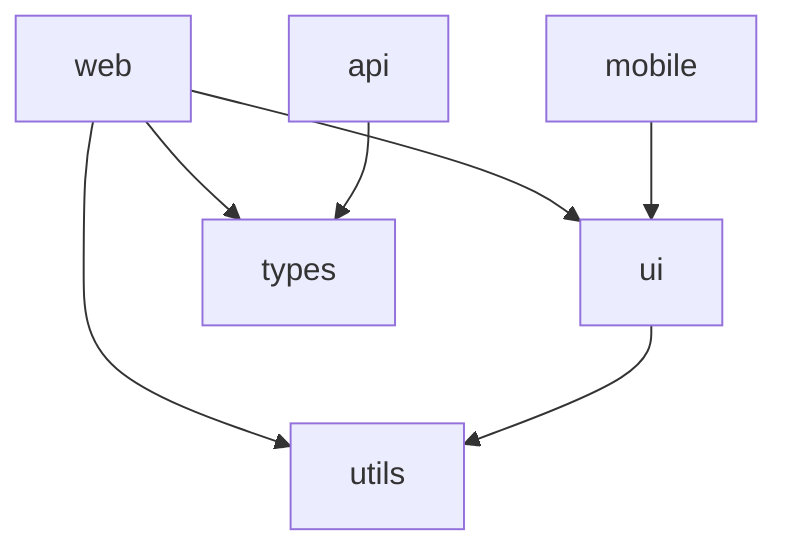

## 何时使用

适用：
- 多个 app/package 共享代码（UI 组件、utils、types、API 客户端）。
- 改一处就全量重建导致构建慢，需要只跑受影响（affected）的包。
- 从多个独立仓库合并为单仓，且要保留 git 历史。
- 需要协调版本号、向 npm 发布多个包。
- 多团队跨包协作、需要统一工具链。

不该用（负边界）：
- 单应用、无任何共享包的项目。
- 团队/项目边界完全隔离，多仓（polyrepo）已经够用。
- 共享代码极少、复制粘贴成本可接受。

## 步骤

1. 选型：JS/TS 现代默认组合为 **pnpm workspaces + Turborepo + Changesets**。Turborepo（极简配置、一流远程缓存）；Nx（大型企业、项目图与插件生态）；pnpm（workspace 协议、磁盘高效）；Lerna/Changesets 负责版本与发布，新项目优先 Changesets。
2. 摸清结构：先用分析脚本探测工具类型、工作区与内部依赖图（见下「指令」）。
3. 跨包影响分析：在合入共享包改动前，确定哪些 app 会被波及，沟通爆炸半径（blast radius）。
4. 选择性构建/测试：所有命令用 `--filter`/`affected` 限定到受影响的包。
5. 开启远程缓存：monorepo CI 没有远程缓存会比多仓还慢，远程缓存不是可选项。
6. 发布：用 Changesets 管理版本，禁止手改 package.json 版本号。
7. 迁移（如需）：用 `git filter-repo --to-subdirectory-filter` 把各仓改写进子目录再合并，绝不手动搬文件。
8. 配置 Claude Code：根目录与每个包各放一份 CLAUDE.md，明确任务作用域规则。

## 指令

工作区分析脚本（探测工具类型 / 工作区路径 / 内部依赖图）：

```bash
python3 scripts/monorepo_analyzer.py /path/to/monorepo
python3 scripts/monorepo_analyzer.py /path/to/monorepo --json
```

Turborepo —— `turbo.json` 关键管线字段：`dependsOn: ["^build"]`（拓扑序先建依赖）、`outputs`（缓存产物，如 `.next/**`、`dist/**`）、`cache`、`dev` 用 `cache:false` + `persistent:true`。常用命令：

```bash
turbo run build                          # 按依赖序全量构建
turbo run build --filter=...[origin/main] # 只构建相对 main 受影响的包（CI 必用）
turbo run build --filter=...[HEAD^1]      # 自上次提交以来受影响
turbo run build --filter=@myorg/web...    # 某 app 及其全部依赖
turbo run build --dry-run                # 只看会跑什么，不执行
turbo login && turbo link                # 接入 Vercel 远程缓存
turbo run build --summarize              # 排查远程缓存是否命中
```

自托管远程缓存用环境变量：`TURBO_API`、`TURBO_TOKEN`、`TURBO_TEAM`。

pnpm workspaces：`pnpm-workspace.yaml` 列出 `apps/*`、`packages/*`、`tools/*`；本地包引用用 `workspace:*`（始终用本地）/`workspace:^`/`workspace:~`（发布时按 semver 替换为真实版本）。常用：

```bash
pnpm --filter @myorg/web dev    # 在指定包跑脚本
pnpm --filter @myorg/web... build # 包及其依赖
pnpm --filter @myorg/web add react
pnpm add -D typescript -w       # 给根加共享 devDep
pnpm ls --depth -1 -r           # 列出工作区所有包
```

Nx 受影响命令：

```bash
nx graph                                  # 浏览器查看项目图
nx affected --target=test --base=main --head=HEAD
nx affected:apps --base=main --head=HEAD  # 哪些 app 受影响
```

Changesets 版本与发布：

```bash
pnpm add -D @changesets/cli -w && pnpm changeset init
pnpm changeset            # 交互式：选包、选 semver、写 changelog
pnpm changeset version    # CI 中升版本 + 更新 changelog
pnpm changeset publish    # 发布所有变更包（自动把 workspace:* 替换为真实版本）
pnpm changeset pre enter beta   # 进入 beta 预发布通道；pre exit 退出
```

多仓 → monorepo 迁移（保留历史的关键步骤）：

```bash
git clone https://github.com/myorg/web-app && cd web-app
git filter-repo --to-subdirectory-filter apps/web  # 把历史改写进子目录
cd .. && git remote add web-app ./web-app
git fetch web-app --tags
git merge web-app/main --allow-unrelated-histories
```

随后：把包名改成带 scope（`@myorg/web`）→ 跨仓 npm 依赖改为 `workspace:*` → 共享配置抽到根（`tsconfig.base.json`、`.eslintrc.base.js`）各包 `extends` → 加 Turborepo → 统一 CI。

## 示例

依赖图可视化（用 pnpm 元数据生成 Mermaid，写入 `docs/dep-graph.md`）：



工作区级 CLAUDE.md（根 + 每包）—— 把任务作用域写死，避免改错包：

```markdown
# /CLAUDE.md（对所有包生效）
## 结构：apps/web、apps/admin、packages/ui、packages/utils（纯函数）、packages/types（无运行时代码）
## 构建：pnpm workspaces + Turborepo；命令一律 pnpm --filter <pkg>；禁用 npm/yarn
## 作用域规则：
- 改 packages/ui → 同时跑 apps/web、apps/admin 的测试（它们依赖它）
- 改 packages/types → 全包 type-check
- 改 apps/api → 只测 apps/api
```

CI 只跑受影响包（GitHub Actions 要点）：`fetch-depth: 0`（affected 检测需要全历史）→ 缓存 `.turbo` → `turbo run build --filter=...[origin/main]`，配 `TURBO_TOKEN`/`TURBO_TEAM` 环境变量。发布流水线用 `changesets/action@v1` 自动开 release PR 或 publish。

## 注意事项

常见坑 → 修法：
- 每个 PR 都跑 `turbo run build` 不带 filter → CI 一律 `--filter=...[origin/main]`。
- `workspace:*` 导致发布失败 → 用 `pnpm changeset publish`，它会自动替换为真实版本。
- 无关文件改动触发全量重建 → 调 `turbo.json` 的 `inputs`，排除 docs、配置文件。
- 共享 tsconfig 让一个包拖垮全部 type-check → 正确用 `extends`，各包覆盖 `rootDir`/`outDir`。
- 迁移时丢历史 → 必须用 `git filter-repo`，绝不手动搬文件。
- 远程缓存在 CI 不生效 → 检查 `TURBO_TOKEN`/`TURBO_TEAM`，用 `--summarize` 验证。
- CLAUDE.md 太泛、改错包 → 每包写明「只动 apps/X 目录下的文件」。

最佳实践：根 CLAUDE.md 画地图（每个包用途与依赖规则），每包 CLAUDE.md 定规则（允许/禁止/测试命令）；命令永远 `--filter` 限定作用域；远程缓存必开；版本用 Changesets，绝不手改；共享配置放根、各包 extends；合入共享包前先做影响分析；`packages/types` 保持纯 TypeScript（无运行时代码、无依赖）。依赖方向：优先 app/service → package/lib 单向依赖，默认禁止跨 app 互相 import。

## 互见

- code-reviewer：合入受影响包改动前的代码审查。
- dependency-auditor：审计工作区内依赖版本与安全风险，与跨包依赖图分析互补。

---
本条采编自 alirezarezvani/claude-skills（MIT）。
