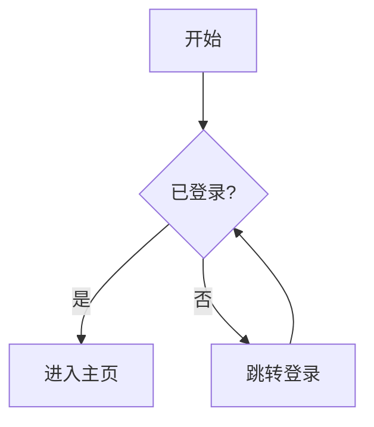
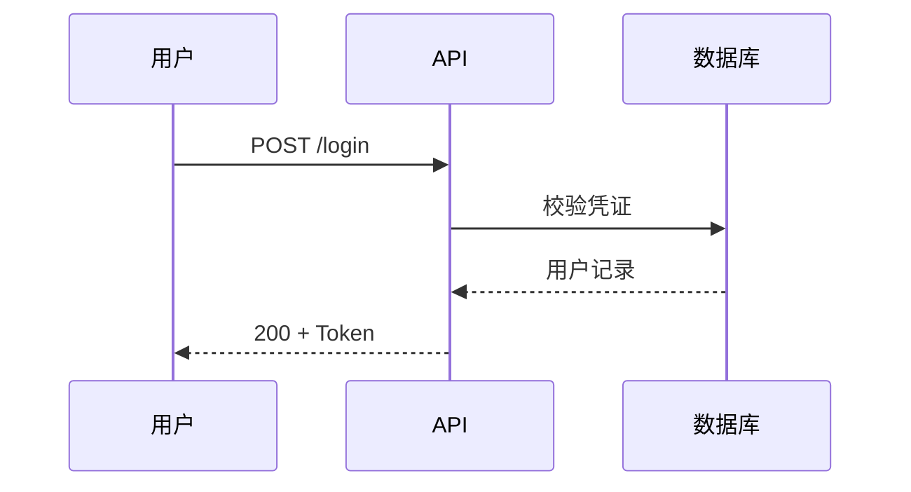
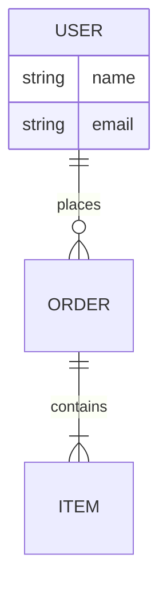

## 何时使用

用 Mermaid 把流程、交互、数据结构、时间线等关系用文本语法写成「代码即图表」，直接嵌入 Markdown、GitHub/GitLab、Notion、文档站等支持 Mermaid 的环境，随版本控制一起演进。

适合用 Mermaid：
- 流程图与决策树（`flowchart` / `graph`）
- API/系统交互的时序图（`sequenceDiagram`）
- 数据库结构 ER 图（`erDiagram`）、类图（`classDiagram`）
- 状态机（`stateDiagram-v2`）、用户旅程（`journey`）
- 项目时间线甘特图（`gantt`）、饼图（`pie`）、`gitGraph`、`quadrantChart`、`timeline`
- 需要可 diff、可评审、纯文本维护的图

不该用（边界）：
- 需要像素级精修、自由排版的设计稿/海报 -> 用 Figma 或飞书画板
- 重数据驱动、自定义视觉编码的可视化（力导向网络、地理投影、热力图等）-> 用 D3.js / ECharts
- 渲染环境不支持 Mermaid（如纯 PDF、老旧 wiki）时，先确认目标平台再选型
- 缺少明确的图意图、节点/关系输入或成功标准时，先停下来问清楚，不要硬画

## 步骤

1. 选对图类型：先判断要表达「流程 / 交互 / 结构 / 状态 / 时间」中的哪一类，按上表映射到具体 diagram 关键字，别用错类型硬凑。
2. 控制信息密度：单图聚焦一件事，节点宜在 ~15 个以内，过大就拆成多图并互相引用；保持方向（`TD`/`LR`）与命名一致。
3. 写基础版：先产出无样式、能渲染的最小正确版本，确认结构与关系无误。
4. 加样式版：用 `classDef` + `class`、`style`、子图 `subgraph`、`%%{init}%%` 主题统一配色，给复杂语法加 `%%` 注释。
5. 渲染校验：交付前在 Mermaid Live Editor（mermaid.live）或 `mmdc` 本地渲染验证语法，确保不报错、布局可读。
6. 交付：给出代码块（标注 ```mermaid）+ 渲染/预览说明 + 必要的替代图类型建议与导出方式（SVG/PNG）。

## 指令

交付物清单（每次尽量都给）：
- 完整、可直接渲染的 Mermaid 代码（基础版 + 样式版各一）
- 渲染方式说明（嵌入 Markdown / Live Editor / `mmdc` 导出）
- 复杂语法处的 `%%` 注释
- 可选的替代图类型（同一信息换一种更合适的表达）
- 无障碍提示：有意义的节点文案、避免仅靠颜色区分、必要时提供文字描述

本地导出命令（mermaid-cli）：

```bash
npm i -g @mermaid-js/mermaid-cli
mmdc -i diagram.mmd -o diagram.svg          # 导出 SVG
mmdc -i diagram.mmd -o diagram.png -t dark   # 暗色主题导出 PNG
```

## 示例

流程图（带决策分支与方向 `TD`）：



时序图（API 交互）：



ER 图（数据库关系）：



样式版（`classDef` 统一配色 + 主题 init）：

```mermaid
%%{init: {'theme':'base'}}%%
flowchart LR
    A[输入] --> B[处理] --> C[输出]
    classDef hot fill:#ffd6d6,stroke:#c00,stroke-width:2px;
    class B hot;   %% 高亮关键节点
```

## 注意事项

- 类型用错是最常见坑：交互用 `sequenceDiagram`、结构用 `classDiagram`/`erDiagram`、流程用 `flowchart`，不要全用 `graph` 硬画。
- 渲染前必验：不同平台 Mermaid 版本不一，新语法（如 `stateDiagram-v2`、`timeline`）老环境可能不支持；交付前用 Live Editor 或 `mmdc` 跑一遍。
- 文本含特殊字符（`(`、`:`、`#`、`<>`）要放进引号节点 `A["a (b)"]` 或转义，否则解析失败。
- 节点过多导致布局拥挤时，优先拆图或切换方向（`LR`↔`TD`），而非堆在一张图里。
- 始终同时给基础版与样式版，复杂语法加注释，方便他人维护与二次修改。
- 输出不替代目标平台的实际渲染验证；不确定的输入要先问清楚再画。

## 互见

- related：`d3js-data-viz` —— 重数据驱动、自定义交互的可视化改用 D3.js
- related：图像/设计稿类需求改用 Figma / 飞书画板等设计工具
- combines_with：文档写作类技能 —— Mermaid 图作为 Markdown/技术文档的内嵌图示

---
采编自 sickn33/antigravity-awesome-skills（MIT 许可）。
