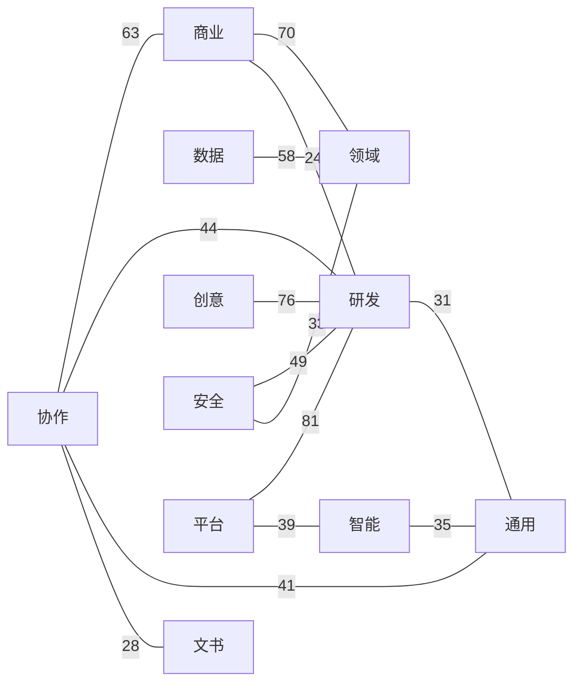

# 互见图谱 · Graph

> 本文件由 scripts/build-index.mjs 自动生成，请勿手改。

全库 **1108** 节点、**6843** 条互见边（含方向重复前的原始边）。

图例：`-->` 依赖(requires) · `-.-` 互见(related) · `===` 组合(combines_with)。

整库单图无法在 GitHub 上渲染，故拆成「卷级总览 mermaid + 按卷紧凑边表」。机读全量见同目录 [`graph.json`](graph.json)。

## 卷级总览（跨卷最强互见）

无向边按跨卷计数取 Top 14；边上数字为边数。示例热点：平台–研发(81)、创意–研发(76)、商业–领域(70)、协作–商业(63)、数据–领域(58)…

## 按卷展开（仅卷内边 · 紧凑表）

每卷列出度最高的 10 个枢纽，及其诱导边中按两端度之和排序的 Top 24 条；空卷跳过。完整边集见 `graph.json`。

卷〇 · 通用（枢纽 10 / 边 22）（枢纽截断至 10）

**Hubs (by degree):** `premortem-plan-challenger`(18), `business-assumption-stress-test`(12), `four-voice-decision-council`(11), `executive-adversarial-mentor`(10), `entity-research-dossier`(9), `fact-checking`(9), `multi-source-knowledge-synthesis`(9), `decision-navigator`(8), `first-principles-thinking`(8), `structured-decision-framework`(8)

| from | type | to |
| --- | --- | --- |
| `business-assumption-stress-test` | `-.-` | `premortem-plan-challenger` |
| `premortem-plan-challenger` | `===` | `business-assumption-stress-test` |
| `four-voice-decision-council` | `-.-` | `premortem-plan-challenger` |
| `four-voice-decision-council` | `===` | `premortem-plan-challenger` |
| `executive-adversarial-mentor` | `-.-` | `premortem-plan-challenger` |
| `executive-adversarial-mentor` | `===` | `premortem-plan-challenger` |
| `structured-decision-framework` | `-.-` | `premortem-plan-challenger` |
| `four-voice-decision-council` | `===` | `business-assumption-stress-test` |
| `business-assumption-stress-test` | `-.-` | `executive-adversarial-mentor` |
| `executive-adversarial-mentor` | `===` | `business-assumption-stress-test` |
| `four-voice-decision-council` | `-.-` | `executive-adversarial-mentor` |
| `first-principles-thinking` | `===` | `business-assumption-stress-test` |
| `four-voice-decision-council` | `===` | `entity-research-dossier` |
| `structured-decision-framework` | `===` | `business-assumption-stress-test` |
| `four-voice-decision-council` | `-.-` | `decision-navigator` |
| `four-voice-decision-council` | `-.-` | `first-principles-thinking` |
| `structured-decision-framework` | `-.-` | `four-voice-decision-council` |
| `decision-navigator` | `-.-` | `executive-adversarial-mentor` |
| `entity-research-dossier` | `-.-` | `fact-checking` |
| `entity-research-dossier` | `===` | `fact-checking` |
| `multi-source-knowledge-synthesis` | `-.-` | `fact-checking` |
| `decision-navigator` | `-.-` | `first-principles-thinking` |

卷一 · 文书（枢纽 10 / 边 22）（枢纽截断至 10）

**Hubs (by degree):** `docs-architect`(16), `professional-proofreader`(12), `markdown-to-docx`(11), `doc-coauthoring`(10), `pdf-processing-toolkit`(9), `technical-reference-builder`(8), `pdf-form-filler`(7), `beautiful-prose-stylist`(6), `code-tutorial-engineer`(6), `avoid-ai-writing-patterns`(5)

| from | type | to |
| --- | --- | --- |
| `markdown-to-docx` | `===` | `docs-architect` |
| `doc-coauthoring` | `-.-` | `docs-architect` |
| `docs-architect` | `-.-` | `technical-reference-builder` |
| `technical-reference-builder` | `===` | `docs-architect` |
| `markdown-to-docx` | `-.-` | `professional-proofreader` |
| `professional-proofreader` | `===` | `markdown-to-docx` |
| `code-tutorial-engineer` | `-.-` | `docs-architect` |
| `code-tutorial-engineer` | `===` | `docs-architect` |
| `doc-coauthoring` | `-.-` | `professional-proofreader` |
| `doc-coauthoring` | `===` | `professional-proofreader` |
| `markdown-to-docx` | `===` | `doc-coauthoring` |
| `pdf-processing-toolkit` | `-.-` | `professional-proofreader` |
| `markdown-to-docx` | `-.-` | `pdf-processing-toolkit` |
| `beautiful-prose-stylist` | `-.-` | `professional-proofreader` |
| `pdf-form-filler` | `-.-` | `markdown-to-docx` |
| `avoid-ai-writing-patterns` | `-.-` | `professional-proofreader` |
| `beautiful-prose-stylist` | `===` | `doc-coauthoring` |
| `pdf-form-filler` | `-.-` | `pdf-processing-toolkit` |
| `pdf-form-filler` | `===` | `pdf-processing-toolkit` |
| `avoid-ai-writing-patterns` | `===` | `doc-coauthoring` |
| `code-tutorial-engineer` | `-.-` | `technical-reference-builder` |
| `avoid-ai-writing-patterns` | `-.-` | `beautiful-prose-stylist` |

卷二 · 研发（枢纽 10 / 边 10）（枢纽截断至 10）

**Hubs (by degree):** `error-handling-patterns`(24), `react-state-management`(24), `rest-api-endpoint-builder`(23), `typescript-advanced-types`(22), `ci-cd-pipeline-builder`(20), `microservices-patterns`(19), `code-reviewer`(18), `shadcn-ui-components`(18), `distributed-tracing`(17), `playwright-e2e-testing`(17)

| from | type | to |
| --- | --- | --- |
| `error-handling-patterns` | `===` | `rest-api-endpoint-builder` |
| `react-state-management` | `-.-` | `typescript-advanced-types` |
| `typescript-advanced-types` | `===` | `react-state-management` |
| `error-handling-patterns` | `===` | `microservices-patterns` |
| `react-state-management` | `===` | `shadcn-ui-components` |
| `shadcn-ui-components` | `-.-` | `react-state-management` |
| `error-handling-patterns` | `===` | `distributed-tracing` |
| `typescript-advanced-types` | `===` | `shadcn-ui-components` |
| `playwright-e2e-testing` | `===` | `ci-cd-pipeline-builder` |
| `distributed-tracing` | `===` | `microservices-patterns` |

卷三 · 数据（枢纽 10 / 边 24）（枢纽截断至 10；边截断至 24）

**Hubs (by degree):** `data-pipeline-engineer`(20), `matplotlib-visualization`(20), `polars-dataframe`(15), `sql-query-builder`(14), `csv-data-cleaner`(13), `data-quality-frameworks`(13), `data-quality-validator`(13), `snowflake-development`(13), `dbt-transformation-modeler`(12), `scikit-learn-ml`(12)

| from | type | to |
| --- | --- | --- |
| `matplotlib-visualization` | `===` | `polars-dataframe` |
| `csv-data-cleaner` | `===` | `matplotlib-visualization` |
| `data-pipeline-engineer` | `===` | `data-quality-frameworks` |
| `data-pipeline-engineer` | `-.-` | `snowflake-development` |
| `data-quality-frameworks` | `-.-` | `data-pipeline-engineer` |
| `data-quality-validator` | `===` | `data-pipeline-engineer` |
| `data-pipeline-engineer` | `-.-` | `dbt-transformation-modeler` |
| `data-pipeline-engineer` | `===` | `dbt-transformation-modeler` |
| `matplotlib-visualization` | `===` | `scikit-learn-ml` |
| `scikit-learn-ml` | `-.-` | `matplotlib-visualization` |
| `csv-data-cleaner` | `-.-` | `polars-dataframe` |
| `csv-data-cleaner` | `===` | `polars-dataframe` |
| `polars-dataframe` | `-.-` | `scikit-learn-ml` |
| `polars-dataframe` | `===` | `scikit-learn-ml` |
| `snowflake-development` | `-.-` | `sql-query-builder` |
| `csv-data-cleaner` | `-.-` | `data-quality-frameworks` |
| `csv-data-cleaner` | `-.-` | `data-quality-validator` |
| `data-quality-frameworks` | `-.-` | `data-quality-validator` |
| `dbt-transformation-modeler` | `-.-` | `sql-query-builder` |
| `snowflake-development` | `===` | `data-quality-frameworks` |
| `sql-query-builder` | `===` | `dbt-transformation-modeler` |
| `data-quality-frameworks` | `-.-` | `dbt-transformation-modeler` |
| `data-quality-frameworks` | `===` | `dbt-transformation-modeler` |
| `dbt-transformation-modeler` | `-.-` | `snowflake-development` |

卷四 · 智能（枢纽 10 / 边 20）（枢纽截断至 10）

**Hubs (by degree):** `production-llm-app-builder`(26), `langfuse-llm-observability`(20), `rag-pipeline-builder`(20), `langgraph-agent-framework`(19), `embedding-model-strategies`(17), `llm-model-router`(17), `ai-engineering-toolkit`(16), `llm-judge-evaluation`(16), `multi-agent-system-designer`(16), `autonomous-coding-agent-patterns`(15)

| from | type | to |
| --- | --- | --- |
| `langfuse-llm-observability` | `===` | `production-llm-app-builder` |
| `production-llm-app-builder` | `-.-` | `rag-pipeline-builder` |
| `embedding-model-strategies` | `===` | `production-llm-app-builder` |
| `llm-model-router` | `===` | `production-llm-app-builder` |
| `ai-engineering-toolkit` | `-.-` | `production-llm-app-builder` |
| `llm-judge-evaluation` | `===` | `production-llm-app-builder` |
| `production-llm-app-builder` | `===` | `multi-agent-system-designer` |
| `langfuse-llm-observability` | `===` | `langgraph-agent-framework` |
| `embedding-model-strategies` | `-.-` | `rag-pipeline-builder` |
| `langfuse-llm-observability` | `-.-` | `llm-model-router` |
| `llm-model-router` | `===` | `langfuse-llm-observability` |
| `ai-engineering-toolkit` | `===` | `langfuse-llm-observability` |
| `langfuse-llm-observability` | `-.-` | `ai-engineering-toolkit` |
| `langfuse-llm-observability` | `-.-` | `llm-judge-evaluation` |
| `rag-pipeline-builder` | `===` | `llm-judge-evaluation` |
| `langgraph-agent-framework` | `-.-` | `multi-agent-system-designer` |
| `autonomous-coding-agent-patterns` | `===` | `langgraph-agent-framework` |
| `llm-model-router` | `===` | `ai-engineering-toolkit` |
| `ai-engineering-toolkit` | `-.-` | `llm-judge-evaluation` |
| `autonomous-coding-agent-patterns` | `-.-` | `multi-agent-system-designer` |

卷五 · 商业（枢纽 10 / 边 16）（枢纽截断至 10）

**Hubs (by degree):** `seo-content-writer`(31), `board-deck-builder`(27), `pricing-strategy`(25), `conversion-rate-optimizer`(24), `content-strategy-planner`(23), `cfo-financial-advisor`(21), `competitive-analysis`(21), `schema-markup-builder`(20), `startup-financial-modeler`(20), `cro-revenue-advisor`(19)

| from | type | to |
| --- | --- | --- |
| `content-strategy-planner` | `-.-` | `seo-content-writer` |
| `content-strategy-planner` | `===` | `seo-content-writer` |
| `seo-content-writer` | `===` | `schema-markup-builder` |
| `board-deck-builder` | `-.-` | `cfo-financial-advisor` |
| `board-deck-builder` | `===` | `cfo-financial-advisor` |
| `board-deck-builder` | `-.-` | `startup-financial-modeler` |
| `startup-financial-modeler` | `===` | `board-deck-builder` |
| `cfo-financial-advisor` | `===` | `pricing-strategy` |
| `competitive-analysis` | `===` | `pricing-strategy` |
| `cro-revenue-advisor` | `===` | `board-deck-builder` |
| `pricing-strategy` | `-.-` | `cfo-financial-advisor` |
| `cro-revenue-advisor` | `-.-` | `pricing-strategy` |
| `cro-revenue-advisor` | `===` | `pricing-strategy` |
| `cfo-financial-advisor` | `-.-` | `startup-financial-modeler` |
| `cfo-financial-advisor` | `===` | `startup-financial-modeler` |
| `cfo-financial-advisor` | `-.-` | `cro-revenue-advisor` |

卷六 · 创意（枢纽 10 / 边 19）（枢纽截断至 10）

**Hubs (by degree):** `ui-design-system-builder`(16), `theme-factory`(14), `fal-ai-media-generation`(12), `high-end-visual-design`(11), `demo-video-generator`(10), `algorithmic-art`(7), `canvas-design`(7), `design-critique`(7), `magic-motion-animator`(7), `minimax-media-cli`(7)

| from | type | to |
| --- | --- | --- |
| `theme-factory` | `-.-` | `ui-design-system-builder` |
| `ui-design-system-builder` | `===` | `theme-factory` |
| `high-end-visual-design` | `-.-` | `ui-design-system-builder` |
| `canvas-design` | `-.-` | `ui-design-system-builder` |
| `design-critique` | `-.-` | `ui-design-system-builder` |
| `fal-ai-media-generation` | `-.-` | `demo-video-generator` |
| `fal-ai-media-generation` | `===` | `demo-video-generator` |
| `algorithmic-art` | `===` | `theme-factory` |
| `canvas-design` | `-.-` | `theme-factory` |
| `canvas-design` | `===` | `theme-factory` |
| `magic-motion-animator` | `===` | `theme-factory` |
| `fal-ai-media-generation` | `-.-` | `algorithmic-art` |
| `magic-motion-animator` | `-.-` | `fal-ai-media-generation` |
| `minimax-media-cli` | `-.-` | `fal-ai-media-generation` |
| `magic-motion-animator` | `-.-` | `demo-video-generator` |
| `minimax-media-cli` | `-.-` | `demo-video-generator` |
| `algorithmic-art` | `-.-` | `canvas-design` |
| `minimax-media-cli` | `===` | `algorithmic-art` |
| `minimax-media-cli` | `-.-` | `magic-motion-animator` |

卷七 · 协作（枢纽 10 / 边 23）（枢纽截断至 10）

**Hubs (by degree):** `enterprise-project-manager`(16), `agile-product-owner`(15), `company-culture-builder`(14), `company-operating-system`(14), `jira-expert`(13), `task-decomposition-planner`(13), `status-report-generator`(12), `org-health-diagnostic`(11), `product-manager-toolkit`(10), `coo-operations-advisor`(9)

| from | type | to |
| --- | --- | --- |
| `agile-product-owner` | `===` | `enterprise-project-manager` |
| `enterprise-project-manager` | `-.-` | `agile-product-owner` |
| `enterprise-project-manager` | `-.-` | `jira-expert` |
| `enterprise-project-manager` | `===` | `jira-expert` |
| `enterprise-project-manager` | `-.-` | `task-decomposition-planner` |
| `agile-product-owner` | `-.-` | `jira-expert` |
| `agile-product-owner` | `===` | `jira-expert` |
| `agile-product-owner` | `-.-` | `task-decomposition-planner` |
| `company-culture-builder` | `-.-` | `company-operating-system` |
| `company-culture-builder` | `===` | `company-operating-system` |
| `status-report-generator` | `-.-` | `enterprise-project-manager` |
| `task-decomposition-planner` | `===` | `agile-product-owner` |
| `enterprise-project-manager` | `===` | `product-manager-toolkit` |
| `product-manager-toolkit` | `-.-` | `enterprise-project-manager` |
| `agile-product-owner` | `-.-` | `product-manager-toolkit` |
| `agile-product-owner` | `===` | `product-manager-toolkit` |
| `company-culture-builder` | `-.-` | `org-health-diagnostic` |
| `company-culture-builder` | `===` | `org-health-diagnostic` |
| `company-operating-system` | `===` | `org-health-diagnostic` |
| `org-health-diagnostic` | `-.-` | `company-operating-system` |
| `company-operating-system` | `-.-` | `coo-operations-advisor` |
| `company-operating-system` | `===` | `coo-operations-advisor` |
| `product-manager-toolkit` | `===` | `jira-expert` |

卷八 · 安全（枢纽 10 / 边 16）（枢纽截断至 10）

**Hubs (by degree):** `penetration-testing-methodology`(26), `security-audit-toolkit`(20), `false-positive-check`(18), `red-team-recon`(18), `burp-suite-testing`(15), `dependency-auditor`(15), `api-fuzzing-bug-bounty`(14), `compliance-readiness-review`(14), `wireshark-traffic-analysis`(14), `codeql-scanner`(13)

| from | type | to |
| --- | --- | --- |
| `penetration-testing-methodology` | `===` | `security-audit-toolkit` |
| `security-audit-toolkit` | `-.-` | `penetration-testing-methodology` |
| `penetration-testing-methodology` | `-.-` | `red-team-recon` |
| `penetration-testing-methodology` | `===` | `red-team-recon` |
| `penetration-testing-methodology` | `===` | `burp-suite-testing` |
| `wireshark-traffic-analysis` | `===` | `penetration-testing-methodology` |
| `false-positive-check` | `-.-` | `security-audit-toolkit` |
| `false-positive-check` | `===` | `security-audit-toolkit` |
| `compliance-readiness-review` | `===` | `security-audit-toolkit` |
| `burp-suite-testing` | `===` | `red-team-recon` |
| `dependency-auditor` | `===` | `false-positive-check` |
| `api-fuzzing-bug-bounty` | `===` | `red-team-recon` |
| `codeql-scanner` | `===` | `false-positive-check` |
| `false-positive-check` | `-.-` | `codeql-scanner` |
| `api-fuzzing-bug-bounty` | `-.-` | `burp-suite-testing` |
| `api-fuzzing-bug-bounty` | `===` | `burp-suite-testing` |

卷九 · 领域专精（枢纽 10 / 边 18）（枢纽截断至 10）

**Hubs (by degree):** `octagon-equity-research-analyst`(56), `gene-set-enrichment-analysis`(39), `single-cell-rnaseq-analysis`(39), `general-counsel-advisor`(34), `scientific-database-lookup`(33), `cheminformatics-toolkit`(28), `portfolio-risk-metrics`(28), `genomic-file-toolkit`(25), `gget-genomic-databases`(24), `uniprot-protein-database`(24)

| from | type | to |
| --- | --- | --- |
| `octagon-equity-research-analyst` | `-.-` | `portfolio-risk-metrics` |
| `gene-set-enrichment-analysis` | `-.-` | `single-cell-rnaseq-analysis` |
| `gene-set-enrichment-analysis` | `===` | `single-cell-rnaseq-analysis` |
| `gene-set-enrichment-analysis` | `-.-` | `scientific-database-lookup` |
| `gene-set-enrichment-analysis` | `===` | `scientific-database-lookup` |
| `single-cell-rnaseq-analysis` | `-.-` | `scientific-database-lookup` |
| `gene-set-enrichment-analysis` | `-.-` | `genomic-file-toolkit` |
| `genomic-file-toolkit` | `===` | `gene-set-enrichment-analysis` |
| `genomic-file-toolkit` | `-.-` | `single-cell-rnaseq-analysis` |
| `gget-genomic-databases` | `===` | `gene-set-enrichment-analysis` |
| `gget-genomic-databases` | `===` | `single-cell-rnaseq-analysis` |
| `cheminformatics-toolkit` | `-.-` | `scientific-database-lookup` |
| `cheminformatics-toolkit` | `===` | `scientific-database-lookup` |
| `scientific-database-lookup` | `-.-` | `genomic-file-toolkit` |
| `gget-genomic-databases` | `-.-` | `scientific-database-lookup` |
| `uniprot-protein-database` | `-.-` | `scientific-database-lookup` |
| `gget-genomic-databases` | `-.-` | `uniprot-protein-database` |
| `gget-genomic-databases` | `===` | `uniprot-protein-database` |

卷十 · 平台集成（枢纽 10 / 边 20）（枢纽截断至 10）

**Hubs (by degree):** `terraform-specialist`(15), `browser-automation-builder`(13), `zoom-oauth-setup`(13), `zoom-meeting-app-builder`(12), `zoom-product-surface-selector`(12), `zoom-webhooks-setup`(12), `aws-serverless-architect`(11), `firecrawl-web-scraper`(11), `azure-cloud-architect`(10), `zoom-integration-planner`(10)

| from | type | to |
| --- | --- | --- |
| `aws-serverless-architect` | `===` | `terraform-specialist` |
| `azure-cloud-architect` | `===` | `terraform-specialist` |
| `zoom-meeting-app-builder` | `-.-` | `zoom-oauth-setup` |
| `zoom-oauth-setup` | `===` | `zoom-meeting-app-builder` |
| `zoom-oauth-setup` | `-.-` | `zoom-product-surface-selector` |
| `zoom-oauth-setup` | `-.-` | `zoom-webhooks-setup` |
| `zoom-oauth-setup` | `===` | `zoom-webhooks-setup` |
| `browser-automation-builder` | `-.-` | `firecrawl-web-scraper` |
| `zoom-meeting-app-builder` | `-.-` | `zoom-product-surface-selector` |
| `zoom-meeting-app-builder` | `===` | `zoom-webhooks-setup` |
| `zoom-product-surface-selector` | `===` | `zoom-meeting-app-builder` |
| `zoom-webhooks-setup` | `-.-` | `zoom-product-surface-selector` |
| `zoom-integration-planner` | `-.-` | `zoom-oauth-setup` |
| `zoom-integration-planner` | `===` | `zoom-oauth-setup` |
| `zoom-integration-planner` | `-.-` | `zoom-meeting-app-builder` |
| `zoom-integration-planner` | `-.-` | `zoom-product-surface-selector` |
| `zoom-integration-planner` | `===` | `zoom-product-surface-selector` |
| `zoom-meeting-app-builder` | `===` | `zoom-integration-planner` |
| `zoom-webhooks-setup` | `-.-` | `zoom-integration-planner` |
| `aws-serverless-architect` | `-.-` | `azure-cloud-architect` |

