# 互见图谱 · Graph

> 本文件由 scripts/build-index.mjs 自动生成，请勿手改。

全库 **1108** 节点、**6843** 条互见边（含方向重复前的原始边）。

图例：`-->` 依赖(requires) · `-.-` 互见(related) · `===` 组合(combines_with)。

整库单图无法在 GitHub 上渲染，故拆成「卷级总览 + 按卷折叠」。机读全量见同目录 [`graph.json`](graph.json)。

## 卷级总览（跨卷最强互见）

无向边按跨卷计数取 Top 14；边上数字为边数。示例热点：平台–研发(81)、创意–研发(76)、商业–领域(70)、协作–商业(63)、数据–领域(58)…

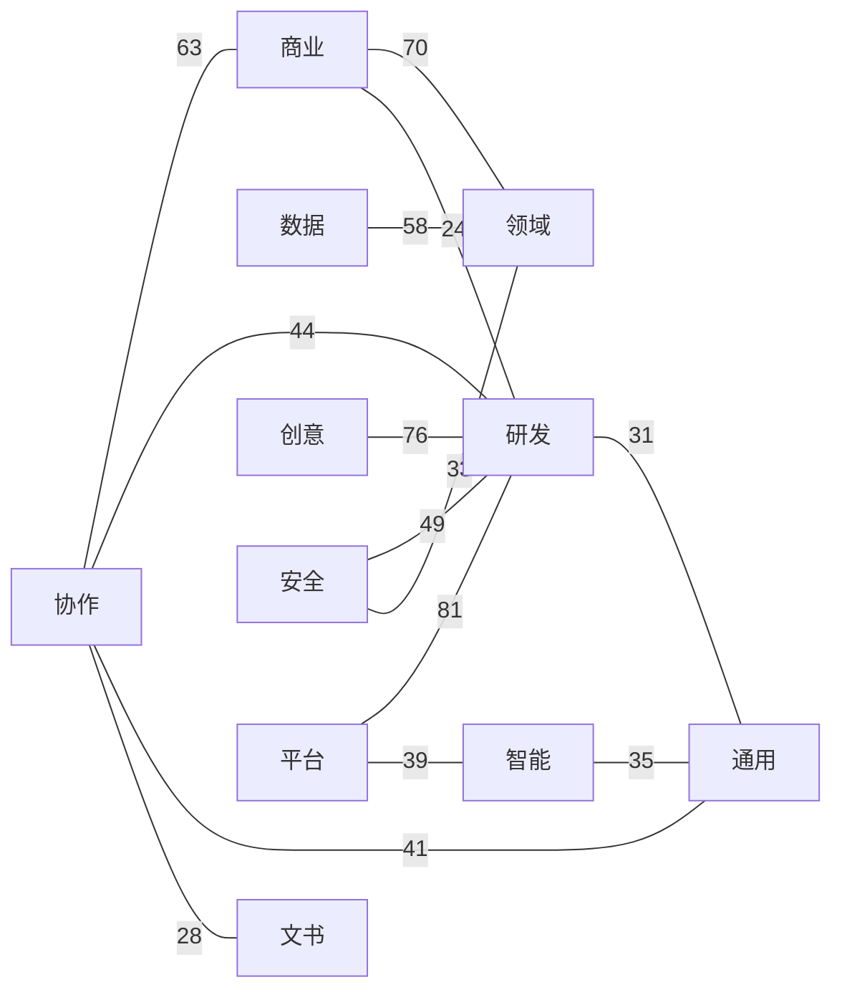

## 按卷展开（仅卷内边）

每卷最多展示度最高的 25 个节点及其诱导边；空卷跳过。

卷〇 · 通用（25 节点 / 84 边）（已截断：仅保留度最高的 25 个节点及其诱导边）

```mermaid
graph LR
  premortem-plan-challenger["事前验尸式计划挑战"]
  business-assumption-stress-test["商业假设压力测试"]
  four-voice-decision-council["四声决策议会（结构化异议与权衡）"]
  executive-adversarial-mentor["高管对抗式思维伙伴"]
  entity-research-dossier["实体决策级调研档案（entity-research-d…"]
  fact-checking["事实核查"]
  multi-source-knowledge-synthesis["多源知识综合"]
  decision-navigator["分支提问引导决策导航"]
  first-principles-thinking["第一性原理思考"]
  structured-decision-framework["结构化决策框架"]
  boardroom-deliberation["C 级多角色董事会六阶段审议"]
  design-brainstorming["构思转设计的结构化头脑风暴"]
  first-principles-assumption-auditor["第一性原理假设审计"]
  hard-call-advisor["艰难抉择推演顾问"]
  idea-darwin-evolution["达尔文式创意进化"]
  agent-self-reflection["Agent 自我反思复盘"]
  closed-loop-delivery["验收标准闭环交付"]
  decision-cooldown-freeze["决策冷静期锁定"]
  kaizen-continuous-improvement["改善持续改进法（Kaizen）"]
  last-30-days-research["近 30 天研究：Reddit/X/Web 时效话题速成"]
  news-sentiment-briefing["多源新闻情感简报引擎"]
  notebooklm-source-grounded-qa["NotebookLM 源锚定问答"]
  query-decomposition-search["查询分解多源检索"]
  skill-router-interviewer["技能路由顾问：访谈式定位最合适的技能"]
  socratic-explainer["苏格拉底式启发讲解"]
  agent-self-reflection -.- executive-adversarial-mentor
  agent-self-reflection -.- premortem-plan-challenger
  agent-self-reflection -.- first-principles-assumption-auditor
  agent-self-reflection -.- business-assumption-stress-test
  agent-self-reflection === structured-decision-framework
  boardroom-deliberation -.- executive-adversarial-mentor
  boardroom-deliberation -.- premortem-plan-challenger
  boardroom-deliberation -.- business-assumption-stress-test
  boardroom-deliberation === premortem-plan-challenger
  boardroom-deliberation === entity-research-dossier
  business-assumption-stress-test -.- premortem-plan-challenger
  business-assumption-stress-test -.- first-principles-assumption-auditor
  business-assumption-stress-test -.- executive-adversarial-mentor
  closed-loop-delivery -.- structured-decision-framework
  decision-cooldown-freeze -.- hard-call-advisor
  decision-cooldown-freeze -.- structured-decision-framework
  decision-cooldown-freeze -.- decision-navigator
  decision-cooldown-freeze -.- premortem-plan-challenger
  decision-cooldown-freeze === four-voice-decision-council
  decision-navigator -.- design-brainstorming
  decision-navigator -.- first-principles-thinking
  decision-navigator -.- executive-adversarial-mentor
  decision-navigator === design-brainstorming
  design-brainstorming -.- first-principles-thinking
  design-brainstorming === premortem-plan-challenger
  entity-research-dossier -.- fact-checking
  entity-research-dossier -.- news-sentiment-briefing
  entity-research-dossier === fact-checking
  executive-adversarial-mentor -.- premortem-plan-challenger
  executive-adversarial-mentor -.- first-principles-assumption-auditor
  executive-adversarial-mentor === premortem-plan-challenger
  executive-adversarial-mentor === business-assumption-stress-test
  fact-checking -.- news-sentiment-briefing
  fact-checking -.- notebooklm-source-grounded-qa
  first-principles-assumption-auditor -.- first-principles-thinking
  first-principles-assumption-auditor -.- premortem-plan-challenger
  first-principles-assumption-auditor === business-assumption-stress-test
  first-principles-assumption-auditor === premortem-plan-challenger
  first-principles-thinking === business-assumption-stress-test
  first-principles-thinking === design-brainstorming
  four-voice-decision-council -.- boardroom-deliberation
  four-voice-decision-council -.- executive-adversarial-mentor
  four-voice-decision-council -.- premortem-plan-challenger
  four-voice-decision-council -.- decision-navigator
  four-voice-decision-council -.- first-principles-thinking
  four-voice-decision-council === premortem-plan-challenger
  four-voice-decision-council === business-assumption-stress-test
  four-voice-decision-council === entity-research-dossier
  hard-call-advisor -.- structured-decision-framework
  hard-call-advisor -.- four-voice-decision-council
  hard-call-advisor -.- premortem-plan-challenger
  hard-call-advisor -.- decision-navigator
  hard-call-advisor === boardroom-deliberation
  hard-call-advisor === executive-adversarial-mentor
  idea-darwin-evolution -.- design-brainstorming
  idea-darwin-evolution -.- first-principles-thinking
  idea-darwin-evolution -.- kaizen-continuous-improvement
  idea-darwin-evolution === business-assumption-stress-test
  idea-darwin-evolution === structured-decision-framework
  idea-darwin-evolution === premortem-plan-challenger
  kaizen-continuous-improvement -.- closed-loop-delivery
  kaizen-continuous-improvement -.- first-principles-thinking
  last-30-days-research -.- news-sentiment-briefing
  last-30-days-research -.- entity-research-dossier
  last-30-days-research -.- multi-source-knowledge-synthesis
  last-30-days-research -.- query-decomposition-search
  last-30-days-research === fact-checking
  multi-source-knowledge-synthesis -.- query-decomposition-search
  multi-source-knowledge-synthesis -.- fact-checking
  multi-source-knowledge-synthesis -.- notebooklm-source-grounded-qa
  multi-source-knowledge-synthesis === query-decomposition-search
  multi-source-knowledge-synthesis === news-sentiment-briefing
  news-sentiment-briefing === fact-checking
  notebooklm-source-grounded-qa -.- entity-research-dossier
  notebooklm-source-grounded-qa === fact-checking
  premortem-plan-challenger === business-assumption-stress-test
  query-decomposition-search === entity-research-dossier
  skill-router-interviewer -.- decision-navigator
  skill-router-interviewer === query-decomposition-search
  socratic-explainer === notebooklm-source-grounded-qa
  socratic-explainer === multi-source-knowledge-synthesis
  structured-decision-framework -.- four-voice-decision-council
  structured-decision-framework -.- premortem-plan-challenger
  structured-decision-framework === business-assumption-stress-test
```

卷一 · 文书（25 节点 / 73 边）（已截断：仅保留度最高的 25 个节点及其诱导边）

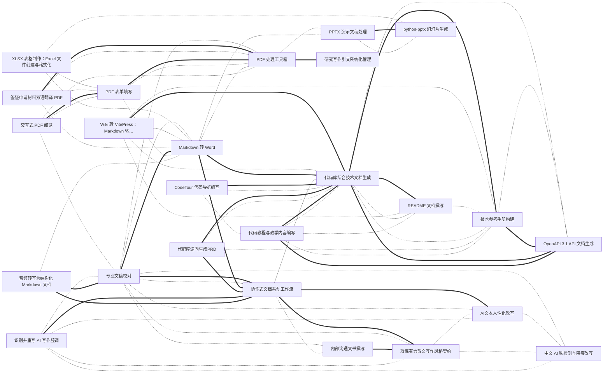

卷二 · 研发（25 节点 / 56 边）（已截断：仅保留度最高的 25 个节点及其诱导边）

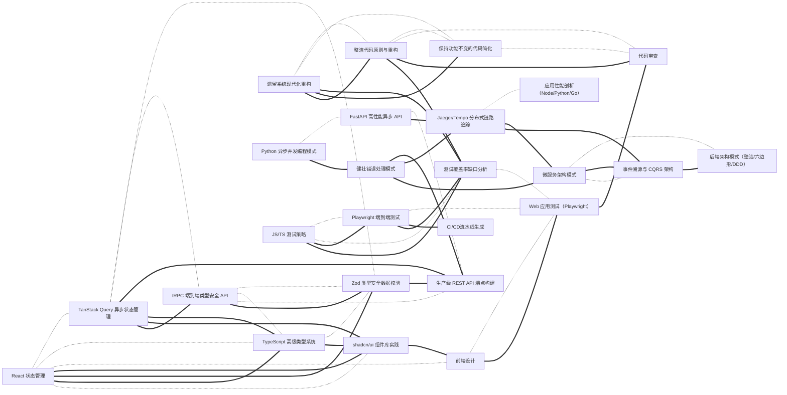

卷三 · 数据（25 节点 / 104 边）（已截断：仅保留度最高的 25 个节点及其诱导边）

```mermaid
graph LR
  data-pipeline-engineer["数据管道与流式架构工程"]
  matplotlib-visualization["Matplotlib 数据可视化"]
  polars-dataframe["Polars 高性能数据框"]
  sql-query-builder["SQL 查询构建"]
  csv-data-cleaner["CSV 数据清洗"]
  data-quality-frameworks["数据质量验证框架"]
  data-quality-validator["数据质量校验框架"]
  snowflake-development["Snowflake 数据开发"]
  dbt-transformation-modeler["dbt数据转换建模"]
  scikit-learn-ml["scikit-learn 机器学习"]
  airflow-dag-builder["Airflow 数据管道编排"]
  kpi-dashboard-design["KPI 仪表盘设计"]
  spark-job-optimization["Apache Spark 作业性能调优"]
  dataset-profiler["数据集探查画像"]
  dataset-quality-auditor["数据集质量审计"]
  dbt-transformation-patterns["dbt 数据转换建模与测试模式"]
  plotly-interactive-viz["Plotly 交互式可视化"]
  analysis-qa-validator["分析交付前质检"]
  dask-distributed-dataframes["Dask 超内存分布式计算"]
  data-question-analyzer["数据问题分析（从速查到正式报告）"]
  seaborn-statistical-charts["Seaborn 统计图表"]
  airflow-dag-patterns["Airflow DAG 生产实践模式"]
  clickhouse-analytics-io["ClickHouse 查询优化与分析"]
  html-dashboard-builder["交互式 HTML 仪表盘构建"]
  postgresql-optimization["PostgreSQL 性能优化"]
  airflow-dag-builder -.- airflow-dag-patterns
  airflow-dag-builder -.- data-pipeline-engineer
  airflow-dag-builder -.- dbt-transformation-modeler
  airflow-dag-builder -.- snowflake-development
  airflow-dag-builder === data-quality-frameworks
  airflow-dag-builder === dbt-transformation-modeler
  airflow-dag-builder === spark-job-optimization
  airflow-dag-patterns -.- data-pipeline-engineer
  airflow-dag-patterns -.- dbt-transformation-patterns
  airflow-dag-patterns -.- snowflake-development
  airflow-dag-patterns === data-quality-validator
  airflow-dag-patterns === dbt-transformation-patterns
  airflow-dag-patterns === spark-job-optimization
  analysis-qa-validator -.- data-quality-validator
  analysis-qa-validator -.- dataset-quality-auditor
  analysis-qa-validator -.- data-quality-frameworks
  analysis-qa-validator === dataset-profiler
  analysis-qa-validator === html-dashboard-builder
  clickhouse-analytics-io -.- postgresql-optimization
  clickhouse-analytics-io -.- sql-query-builder
  clickhouse-analytics-io === dbt-transformation-modeler
  clickhouse-analytics-io === data-pipeline-engineer
  clickhouse-analytics-io === html-dashboard-builder
  csv-data-cleaner -.- dataset-quality-auditor
  csv-data-cleaner -.- data-quality-validator
  csv-data-cleaner -.- polars-dataframe
  csv-data-cleaner -.- data-quality-frameworks
  csv-data-cleaner === polars-dataframe
  csv-data-cleaner === dataset-quality-auditor
  csv-data-cleaner === matplotlib-visualization
  dask-distributed-dataframes -.- polars-dataframe
  dask-distributed-dataframes -.- spark-job-optimization
  dask-distributed-dataframes -.- snowflake-development
  dask-distributed-dataframes === matplotlib-visualization
  dask-distributed-dataframes === scikit-learn-ml
  data-pipeline-engineer -.- dbt-transformation-modeler
  data-pipeline-engineer -.- snowflake-development
  data-pipeline-engineer -.- spark-job-optimization
  data-pipeline-engineer === airflow-dag-builder
  data-pipeline-engineer === data-quality-frameworks
  data-pipeline-engineer === dbt-transformation-modeler
  data-quality-frameworks -.- data-quality-validator
  data-quality-frameworks -.- dataset-quality-auditor
  data-quality-frameworks -.- dbt-transformation-modeler
  data-quality-frameworks -.- data-pipeline-engineer
  data-quality-frameworks === dbt-transformation-modeler
  data-quality-validator -.- dataset-quality-auditor
  data-quality-validator -.- dbt-transformation-patterns
  data-quality-validator === dbt-transformation-patterns
  data-quality-validator === data-pipeline-engineer
  data-question-analyzer -.- analysis-qa-validator
  data-question-analyzer -.- data-quality-validator
  data-question-analyzer -.- kpi-dashboard-design
  data-question-analyzer -.- sql-query-builder
  data-question-analyzer === html-dashboard-builder
  data-question-analyzer === matplotlib-visualization
  dataset-profiler -.- dataset-quality-auditor
  dataset-profiler -.- data-quality-validator
  dataset-profiler -.- analysis-qa-validator
  dataset-profiler -.- csv-data-cleaner
  dataset-profiler === csv-data-cleaner
  dataset-profiler === matplotlib-visualization
  dataset-quality-auditor === scikit-learn-ml
  dataset-quality-auditor === polars-dataframe
  dbt-transformation-modeler -.- dbt-transformation-patterns
  dbt-transformation-modeler -.- snowflake-development
  dbt-transformation-modeler -.- sql-query-builder
  dbt-transformation-modeler === snowflake-development
  dbt-transformation-patterns -.- snowflake-development
  dbt-transformation-patterns -.- data-pipeline-engineer
  dbt-transformation-patterns -.- sql-query-builder
  dbt-transformation-patterns === snowflake-development
  html-dashboard-builder -.- kpi-dashboard-design
  html-dashboard-builder -.- plotly-interactive-viz
  html-dashboard-builder === sql-query-builder
  html-dashboard-builder === kpi-dashboard-design
  kpi-dashboard-design -.- plotly-interactive-viz
  kpi-dashboard-design -.- matplotlib-visualization
  kpi-dashboard-design -.- sql-query-builder
  kpi-dashboard-design === sql-query-builder
  kpi-dashboard-design === plotly-interactive-viz
  matplotlib-visualization -.- seaborn-statistical-charts
  matplotlib-visualization -.- plotly-interactive-viz
  matplotlib-visualization === seaborn-statistical-charts
  matplotlib-visualization === polars-dataframe
  matplotlib-visualization === scikit-learn-ml
  plotly-interactive-viz -.- seaborn-statistical-charts
  plotly-interactive-viz === polars-dataframe
  polars-dataframe -.- spark-job-optimization
  polars-dataframe -.- scikit-learn-ml
  polars-dataframe === scikit-learn-ml
  postgresql-optimization -.- sql-query-builder
  postgresql-optimization === sql-query-builder
  scikit-learn-ml -.- matplotlib-visualization
  seaborn-statistical-charts === polars-dataframe
  seaborn-statistical-charts === scikit-learn-ml
  snowflake-development -.- sql-query-builder
  snowflake-development === airflow-dag-builder
  snowflake-development === data-quality-frameworks
  spark-job-optimization -.- airflow-dag-builder
  spark-job-optimization -.- snowflake-development
  spark-job-optimization === data-pipeline-engineer
  spark-job-optimization === data-quality-validator
  sql-query-builder === dbt-transformation-modeler
```

卷四 · 智能（25 节点 / 96 边）（已截断：仅保留度最高的 25 个节点及其诱导边）

```mermaid
graph LR
  production-llm-app-builder["生产级 LLM 应用与 RAG 系统构建"]
  langfuse-llm-observability["Langfuse LLM 可观测"]
  rag-pipeline-builder["RAG 检索管道搭建"]
  langgraph-agent-framework["LangGraph 智能体编排"]
  embedding-model-strategies["嵌入模型选型与优化"]
  llm-model-router["测量驱动的 LLM 模型路由"]
  ai-engineering-toolkit["AI 工程工作流工具箱"]
  llm-judge-evaluation["LLM-as-Judge 高级评测"]
  multi-agent-system-designer["多智能体系统架构设计"]
  autonomous-coding-agent-patterns["自主编码智能体设计模式"]
  claude-api["Claude API 应用开发"]
  llm-agent-benchmarking["LLM 智能体测试与基准评测"]
  agent-tool-builder["AI 智能体工具设计与构建"]
  agent-tool-design["面向 Agent 的工具设计"]
  context-compression["智能体上下文压缩策略"]
  rag-implementation-workflow["RAG 检索增强实现"]
  mlops-model-productionizer["机器学习模型生产化与 MLOps"]
  llm-prompt-caching["LLM 提示词缓存策略"]
  local-llm-inference["本地 LLM 推理部署"]
  agent-memory-systems["AI 智能体记忆系统设计"]
  agent-workflow-pattern-designer["智能体工作流模式设计"]
  coding-agent-headtohead-eval["编码 Agent 对比评测（通过率/成本/耗时）"]
  context-window-management["LLM 上下文窗口管理策略"]
  llm-prompt-optimizer["LLM 提示词优化"]
  skill-optimizer["Agent 技能诊断与优化（Skill Optimiz…"]
  agent-memory-systems -.- embedding-model-strategies
  agent-memory-systems === rag-pipeline-builder
  agent-tool-builder -.- agent-tool-design
  agent-tool-builder -.- autonomous-coding-agent-patterns
  agent-tool-builder === langgraph-agent-framework
  agent-tool-builder === multi-agent-system-designer
  agent-tool-design -.- autonomous-coding-agent-patterns
  agent-tool-design -.- skill-optimizer
  agent-tool-design === multi-agent-system-designer
  agent-tool-design === langgraph-agent-framework
  agent-tool-design === agent-workflow-pattern-designer
  agent-workflow-pattern-designer -.- multi-agent-system-designer
  agent-workflow-pattern-designer -.- langgraph-agent-framework
  agent-workflow-pattern-designer === llm-agent-benchmarking
  agent-workflow-pattern-designer === context-compression
  ai-engineering-toolkit -.- llm-judge-evaluation
  ai-engineering-toolkit -.- llm-agent-benchmarking
  ai-engineering-toolkit -.- llm-prompt-optimizer
  ai-engineering-toolkit -.- production-llm-app-builder
  ai-engineering-toolkit === langfuse-llm-observability
  ai-engineering-toolkit === rag-implementation-workflow
  ai-engineering-toolkit === context-window-management
  autonomous-coding-agent-patterns -.- multi-agent-system-designer
  autonomous-coding-agent-patterns === langgraph-agent-framework
  autonomous-coding-agent-patterns === context-compression
  claude-api -.- llm-prompt-caching
  claude-api === llm-prompt-optimizer
  claude-api === context-window-management
  claude-api === langfuse-llm-observability
  coding-agent-headtohead-eval -.- llm-judge-evaluation
  coding-agent-headtohead-eval -.- llm-agent-benchmarking
  coding-agent-headtohead-eval -.- autonomous-coding-agent-patterns
  coding-agent-headtohead-eval -.- ai-engineering-toolkit
  coding-agent-headtohead-eval === llm-judge-evaluation
  coding-agent-headtohead-eval === llm-model-router
  context-compression -.- context-window-management
  context-compression -.- llm-prompt-caching
  context-compression -.- llm-prompt-optimizer
  context-compression -.- agent-memory-systems
  context-compression === production-llm-app-builder
  context-compression === langgraph-agent-framework
  context-compression === rag-pipeline-builder
  context-window-management -.- llm-prompt-caching
  context-window-management -.- llm-prompt-optimizer
  context-window-management -.- llm-model-router
  context-window-management === production-llm-app-builder
  context-window-management === rag-pipeline-builder
  embedding-model-strategies -.- rag-pipeline-builder
  embedding-model-strategies === rag-implementation-workflow
  embedding-model-strategies === production-llm-app-builder
  embedding-model-strategies === agent-memory-systems
  langfuse-llm-observability -.- llm-judge-evaluation
  langfuse-llm-observability -.- llm-agent-benchmarking
  langfuse-llm-observability -.- ai-engineering-toolkit
  langfuse-llm-observability -.- llm-model-router
  langfuse-llm-observability === production-llm-app-builder
  langfuse-llm-observability === langgraph-agent-framework
  langgraph-agent-framework -.- multi-agent-system-designer
  langgraph-agent-framework === agent-memory-systems
  llm-agent-benchmarking -.- llm-judge-evaluation
  llm-agent-benchmarking -.- skill-optimizer
  llm-agent-benchmarking === multi-agent-system-designer
  llm-agent-benchmarking === langgraph-agent-framework
  llm-agent-benchmarking === production-llm-app-builder
  llm-judge-evaluation -.- llm-prompt-optimizer
  llm-judge-evaluation === production-llm-app-builder
  llm-judge-evaluation === rag-implementation-workflow
  llm-model-router -.- claude-api
  llm-model-router -.- llm-prompt-caching
  llm-model-router -.- mlops-model-productionizer
  llm-model-router === langfuse-llm-observability
  llm-model-router === ai-engineering-toolkit
  llm-model-router === production-llm-app-builder
  llm-prompt-caching === production-llm-app-builder
  llm-prompt-caching === rag-pipeline-builder
  llm-prompt-caching === langfuse-llm-observability
  llm-prompt-optimizer -.- llm-prompt-caching
  llm-prompt-optimizer === llm-agent-benchmarking
  llm-prompt-optimizer === context-window-management
  local-llm-inference -.- llm-model-router
  local-llm-inference === embedding-model-strategies
  local-llm-inference === production-llm-app-builder
  local-llm-inference === mlops-model-productionizer
  mlops-model-productionizer -.- production-llm-app-builder
  mlops-model-productionizer === langfuse-llm-observability
  mlops-model-productionizer === llm-model-router
  production-llm-app-builder -.- rag-implementation-workflow
  production-llm-app-builder -.- rag-pipeline-builder
  production-llm-app-builder === multi-agent-system-designer
  rag-implementation-workflow -.- rag-pipeline-builder
  rag-implementation-workflow -.- embedding-model-strategies
  rag-implementation-workflow === langfuse-llm-observability
  rag-pipeline-builder === llm-judge-evaluation
  skill-optimizer -.- llm-prompt-optimizer
  skill-optimizer === llm-judge-evaluation
  skill-optimizer === langfuse-llm-observability
```

卷五 · 商业（25 节点 / 76 边）（已截断：仅保留度最高的 25 个节点及其诱导边）

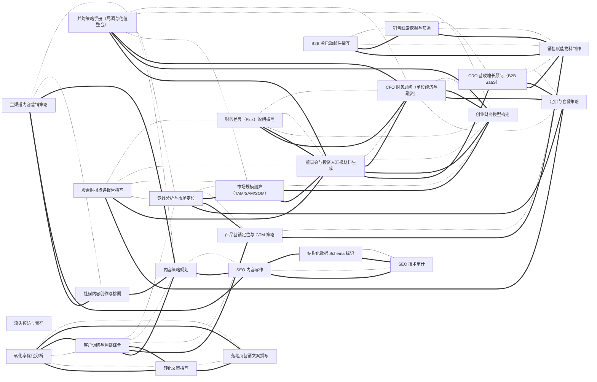

卷六 · 创意（25 节点 / 73 边）（已截断：仅保留度最高的 25 个节点及其诱导边）

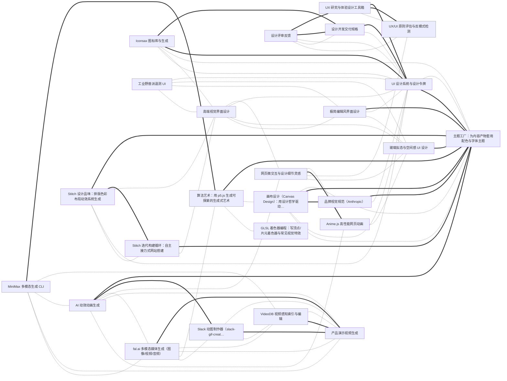

卷七 · 协作（25 节点 / 77 边）（已截断：仅保留度最高的 25 个节点及其诱导边）

```mermaid
graph LR
  enterprise-project-manager["企业级项目组合管理"]
  agile-product-owner["敏捷产品负责人与待办管理"]
  company-culture-builder["公司文化构建与度量"]
  company-operating-system["公司运营系统框架（EOS/OKR）"]
  jira-expert["Jira 项目与工作流专家"]
  task-decomposition-planner["任务拆解与依赖编排"]
  status-report-generator["项目状态报告生成"]
  org-health-diagnostic["组织健康度跨职能诊断"]
  product-manager-toolkit["产品经理工具箱（RICE/PRD）"]
  coo-operations-advisor["COO 运营顾问（流程与 OKR 执行）"]
  hr-partner-pro["HR 招聘与人事管理"]
  org-change-management["组织变革管理ADKAR"]
  strategic-alignment-cascader["战略对齐自上而下级联"]
  company-culture-architect["公司文化体系构建"]
  company-policy-lookup["公司政策查询与白话解释"]
  multi-agent-orchestrator["多智能体任务编排器"]
  new-hire-onboarding-plan["新员工入职计划"]
  stakeholder-update-writer["干系人进展更新撰写"]
  business-process-mapper["业务流程绘制与瓶颈分析"]
  codebase-onboarding-doc["代码库上手文档生成"]
  decision-log-recorder["决策日志记录（两层记忆）"]
  ops-capacity-planner["运营产能与人力规划"]
  resource-capacity-planner["资源产能规划"]
  technical-change-tracker["技术变更记录与会话交接追踪"]
  activity-digest-generator["活动动态摘要生成"]
  activity-digest-generator -.- status-report-generator
  activity-digest-generator -.- stakeholder-update-writer
  activity-digest-generator === status-report-generator
  activity-digest-generator === stakeholder-update-writer
  agile-product-owner -.- product-manager-toolkit
  agile-product-owner -.- jira-expert
  agile-product-owner -.- task-decomposition-planner
  agile-product-owner === product-manager-toolkit
  agile-product-owner === jira-expert
  agile-product-owner === enterprise-project-manager
  business-process-mapper -.- coo-operations-advisor
  business-process-mapper -.- ops-capacity-planner
  business-process-mapper -.- company-operating-system
  business-process-mapper === coo-operations-advisor
  business-process-mapper === ops-capacity-planner
  company-culture-architect -.- company-culture-builder
  company-culture-architect -.- company-operating-system
  company-culture-architect -.- org-change-management
  company-culture-architect -.- hr-partner-pro
  company-culture-architect === company-operating-system
  company-culture-architect === org-change-management
  company-culture-architect === org-health-diagnostic
  company-culture-builder -.- company-operating-system
  company-culture-builder -.- org-health-diagnostic
  company-culture-builder -.- hr-partner-pro
  company-culture-builder === company-operating-system
  company-culture-builder === org-change-management
  company-culture-builder === org-health-diagnostic
  company-operating-system -.- coo-operations-advisor
  company-operating-system -.- strategic-alignment-cascader
  company-operating-system === coo-operations-advisor
  company-operating-system === strategic-alignment-cascader
  company-operating-system === org-health-diagnostic
  company-policy-lookup -.- hr-partner-pro
  company-policy-lookup -.- new-hire-onboarding-plan
  company-policy-lookup === hr-partner-pro
  company-policy-lookup === new-hire-onboarding-plan
  coo-operations-advisor -.- ops-capacity-planner
  coo-operations-advisor -.- strategic-alignment-cascader
  coo-operations-advisor === ops-capacity-planner
  decision-log-recorder -.- stakeholder-update-writer
  decision-log-recorder === status-report-generator
  enterprise-project-manager -.- agile-product-owner
  enterprise-project-manager -.- jira-expert
  enterprise-project-manager -.- task-decomposition-planner
  enterprise-project-manager === jira-expert
  enterprise-project-manager === product-manager-toolkit
  hr-partner-pro -.- org-change-management
  hr-partner-pro === company-culture-builder
  multi-agent-orchestrator -.- task-decomposition-planner
  multi-agent-orchestrator === task-decomposition-planner
  new-hire-onboarding-plan -.- hr-partner-pro
  new-hire-onboarding-plan -.- codebase-onboarding-doc
  new-hire-onboarding-plan === codebase-onboarding-doc
  new-hire-onboarding-plan === company-culture-architect
  ops-capacity-planner -.- company-operating-system
  ops-capacity-planner -.- enterprise-project-manager
  org-change-management -.- company-culture-builder
  org-change-management === org-health-diagnostic
  org-health-diagnostic -.- company-operating-system
  product-manager-toolkit -.- enterprise-project-manager
  product-manager-toolkit === jira-expert
  resource-capacity-planner -.- ops-capacity-planner
  resource-capacity-planner -.- enterprise-project-manager
  resource-capacity-planner -.- task-decomposition-planner
  resource-capacity-planner -.- agile-product-owner
  resource-capacity-planner === enterprise-project-manager
  resource-capacity-planner === status-report-generator
  stakeholder-update-writer -.- status-report-generator
  stakeholder-update-writer === status-report-generator
  stakeholder-update-writer === task-decomposition-planner
  stakeholder-update-writer === enterprise-project-manager
  status-report-generator -.- enterprise-project-manager
  strategic-alignment-cascader -.- org-health-diagnostic
  strategic-alignment-cascader === coo-operations-advisor
  strategic-alignment-cascader === org-change-management
  task-decomposition-planner === agile-product-owner
```

卷八 · 安全（25 节点 / 68 边）（已截断：仅保留度最高的 25 个节点及其诱导边）

```mermaid
graph LR
  penetration-testing-methodology["渗透测试全生命周期"]
  security-audit-toolkit["安全审计与威胁建模工具箱"]
  false-positive-check["漏洞误报核验"]
  red-team-recon["红队侦察方法论"]
  burp-suite-testing["Burp Suite Web 安全测试"]
  dependency-auditor["依赖与供应链审计"]
  api-fuzzing-bug-bounty["REST/GraphQL API 模糊测试与漏洞挖掘"]
  compliance-readiness-review["多框架合规就绪审查（compliance-readin…"]
  wireshark-traffic-analysis["Wireshark 流量分析"]
  codeql-scanner["CodeQL 数据流漏洞扫描"]
  insecure-defaults-detector["不安全默认配置检测"]
  sast-configurator["SAST静态扫描配置"]
  security-incident-response["安全事件分级与响应"]
  binary-analysis-patterns["二进制逆向与汇编分析模式"]
  c-cpp-security-review["C/C++ 内存安全审查"]
  stride-threat-modeler["STRIDE威胁建模"]
  vulnerability-variant-analysis["漏洞变体横向排查"]
  yara-rule-authoring["YARA-X 恶意软件检测规则编写"]
  agent-skill-security-scanner["AI 技能安装前安全扫描"]
  ai-system-security-audit["AI 系统安全评估（注入/越狱）"]
  backend-security-coder["后端安全编码与 API 防护"]
  broken-authentication-testing["认证与会话漏洞检测利用"]
  cloud-misconfig-auditor["云基础设施安全审计"]
  cloud-penetration-testing["多云基础设施渗透测试"]
  soc2-compliance-preparer["SOC 2 审计准备与控制矩阵"]
  agent-skill-security-scanner -.- dependency-auditor
  agent-skill-security-scanner === dependency-auditor
  agent-skill-security-scanner === false-positive-check
  ai-system-security-audit -.- stride-threat-modeler
  ai-system-security-audit -.- security-audit-toolkit
  ai-system-security-audit === stride-threat-modeler
  api-fuzzing-bug-bounty -.- broken-authentication-testing
  api-fuzzing-bug-bounty -.- burp-suite-testing
  api-fuzzing-bug-bounty === burp-suite-testing
  api-fuzzing-bug-bounty === red-team-recon
  backend-security-coder -.- insecure-defaults-detector
  backend-security-coder === sast-configurator
  backend-security-coder === codeql-scanner
  binary-analysis-patterns -.- yara-rule-authoring
  binary-analysis-patterns === yara-rule-authoring
  broken-authentication-testing -.- burp-suite-testing
  broken-authentication-testing === burp-suite-testing
  broken-authentication-testing === penetration-testing-methodology
  burp-suite-testing === red-team-recon
  c-cpp-security-review -.- binary-analysis-patterns
  c-cpp-security-review -.- codeql-scanner
  c-cpp-security-review === codeql-scanner
  c-cpp-security-review === vulnerability-variant-analysis
  c-cpp-security-review === false-positive-check
  cloud-misconfig-auditor -.- cloud-penetration-testing
  cloud-penetration-testing -.- penetration-testing-methodology
  cloud-penetration-testing === red-team-recon
  cloud-penetration-testing === cloud-misconfig-auditor
  cloud-penetration-testing === penetration-testing-methodology
  codeql-scanner -.- sast-configurator
  codeql-scanner -.- vulnerability-variant-analysis
  codeql-scanner === false-positive-check
  codeql-scanner === vulnerability-variant-analysis
  codeql-scanner === sast-configurator
  compliance-readiness-review -.- soc2-compliance-preparer
  compliance-readiness-review === soc2-compliance-preparer
  compliance-readiness-review === security-audit-toolkit
  dependency-auditor -.- sast-configurator
  dependency-auditor === false-positive-check
  false-positive-check -.- vulnerability-variant-analysis
  false-positive-check -.- codeql-scanner
  false-positive-check -.- security-audit-toolkit
  false-positive-check === vulnerability-variant-analysis
  false-positive-check === security-audit-toolkit
  insecure-defaults-detector -.- sast-configurator
  insecure-defaults-detector === codeql-scanner
  insecure-defaults-detector === false-positive-check
  insecure-defaults-detector === vulnerability-variant-analysis
  penetration-testing-methodology -.- red-team-recon
  penetration-testing-methodology === red-team-recon
  penetration-testing-methodology === burp-suite-testing
  penetration-testing-methodology === security-audit-toolkit
  red-team-recon -.- cloud-penetration-testing
  sast-configurator === dependency-auditor
  security-audit-toolkit -.- stride-threat-modeler
  security-audit-toolkit -.- penetration-testing-methodology
  security-audit-toolkit === stride-threat-modeler
  security-audit-toolkit === security-incident-response
  security-incident-response -.- wireshark-traffic-analysis
  security-incident-response -.- yara-rule-authoring
  security-incident-response -.- security-audit-toolkit
  security-incident-response === wireshark-traffic-analysis
  soc2-compliance-preparer === security-audit-toolkit
  stride-threat-modeler -.- false-positive-check
  stride-threat-modeler === dependency-auditor
  vulnerability-variant-analysis -.- c-cpp-security-review
  wireshark-traffic-analysis === penetration-testing-methodology
  yara-rule-authoring === security-incident-response
```

卷九 · 领域专精（25 节点 / 61 边）（已截断：仅保留度最高的 25 个节点及其诱导边）

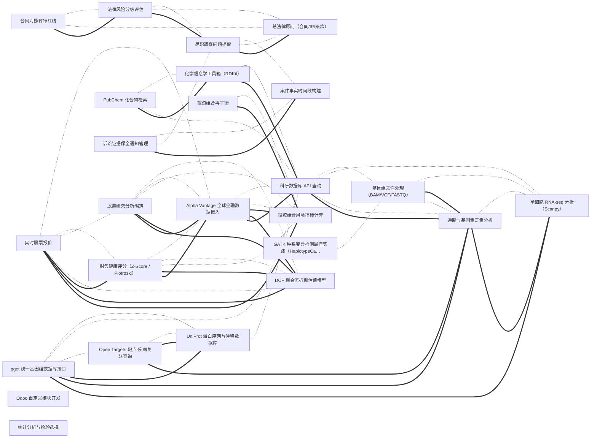

卷十 · 平台集成（25 节点 / 71 边）（已截断：仅保留度最高的 25 个节点及其诱导边）

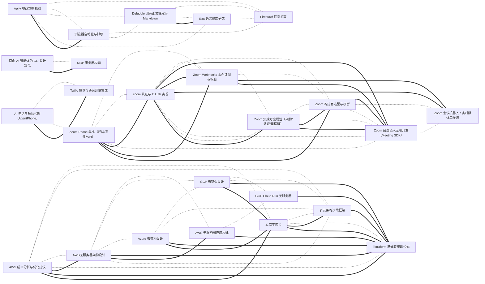

