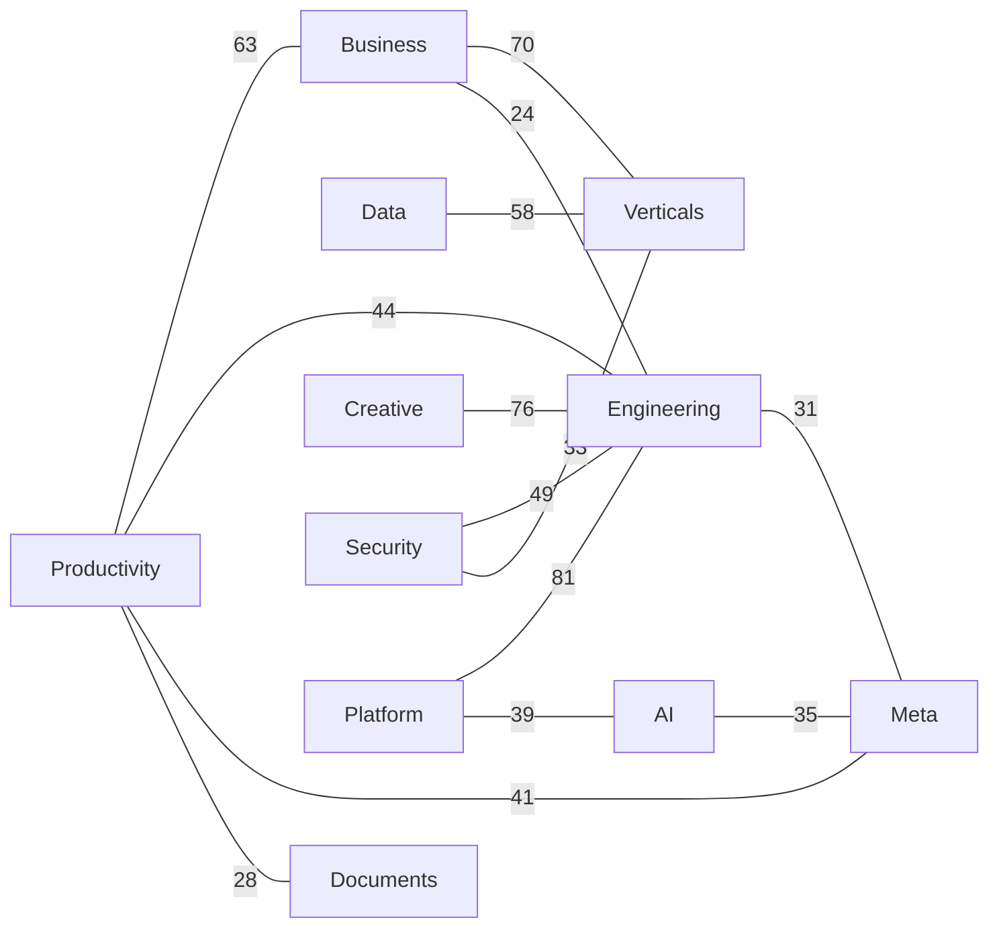

# Everything Skills

> An encyclopedic, cross-linked **skill library for AI agents**. Skills cluster by kind; techniques cross-reference each other.
>
> Curated `SKILL.md` packages loadable by Claude Code / Codex / Cursor / Gemini CLI and similar agents — organized like a classical **leishu** (encyclopedia: taxonomy + cross-references + indexes), implemented for scale.
>
> **Install**: in Claude Code run `/plugin marketplace add findscripter/everything-skills` to browse and install 11 volume plugins. Multi-harness context files (`AGENTS.md` / `GEMINI.md` + `gemini-extension.json` / `CLAUDE.md`) help Codex / Gemini CLI / Cursor discover the same tree.
>
> **Language**: repository chrome on `main` is **English**; each `SKILL.md` stays in its **native/original language**. Chinese chrome edition: [`zh`](https://github.com/findscripter/everything-skills/tree/zh). Full English skill mirror on `en` is **deprecated** — see [LANGUAGE.md](LANGUAGE.md).
>
> This library holds **1108** curated skills and also indexes **1712** external GitHub skill libraries (README-only).
>
> **Security & license**: skill bodies are **instruction text** for agents (not executables). Scripts / network calls are flagged in each skill's notes. Provenance: [INDEX/sources.md](INDEX/sources.md); terms: [LICENSE](LICENSE) / [NOTICE](NOTICE). Policy: [SECURITY.md](SECURITY.md).

---

## Graph showcase (excerpt)

**1108 skills · 6843 cross-reference edges.** Skills form a **network**, not isolated cards — linked by `requires` / `related` / `combines_with`.

Full graph (volume overview + per-volume hub/edge tables): **[INDEX/graph.md](INDEX/graph.md)**. Machine-readable: [`INDEX/graph.json`](INDEX/graph.json).

Legend: solid `-->` = `requires`, dashed `-.-` = `related`, thick `===` = `combines_with`.

### Volume overview (strongest cross-volume links)

Top 14 undirected cross-volume edge counts among the 11 volumes (edge label = count). Dense per-skill clusters live in `INDEX/graph.md` / `graph.json` (kept out of the README to leave room for the skill-repos directory).

---

## What this is

Each skill is a folder with a standard `SKILL.md` (YAML frontmatter).
At runtime, agents **match the `description` field** to decide whether to load a skill — so:

- **Discovery is metadata-driven, not directory browsing.** Folders are for human maintainers; agents read frontmatter.
- **One skill, one place.** Cross-domain links use `related` / `requires` / `combines_with` as a **relation graph**, instead of copying the same skill into five categories.
- **Indexes, catalogs, and graphs are script-generated** — never hand-maintained.

See also [LANGUAGE.md](LANGUAGE.md) and [SECURITY.md](SECURITY.md).

## Skill repos directory

(placeholder for CI refresh)
