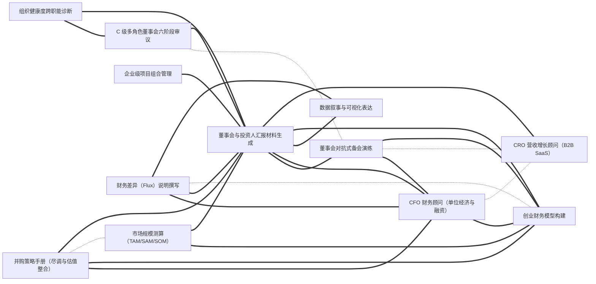

# 技能大典 · Everything Skills

> 一部面向 **AI Agent** 的技能类书。事以类聚，技以互见。
>
> 收录可被 Claude Code / Codex / Cursor / Gemini CLI 等智能体直接加载的 `SKILL.md` 技能包，
> 以中国传统**类书**的「分类 + 互见 + 索引」思想组织，但把实现换成了今天真正能 scale 的形态。

> **一键安装**：在 Claude Code 里运行 `/plugin marketplace add findscripter/everything-skills`，即可浏览、按卷分装 11 个插件。

---

## 一图看懂：技能互见图谱（节选）

全库 **1108 条技能、6843 条互见边**。整图无法渲染，这里截取连接最密的一个技能簇示意——
实线 = 依赖(requires)，虚线 = 互见(related)，粗线 = 组合(combines_with)。
**这正是本仓库区别于"平铺列表"的核心：技能不是孤立条目，而是连成网络。**



---

## 这是什么

每一条技能是一个文件夹，里面有一个标准的 `SKILL.md`（带 YAML frontmatter）。
AI Agent 在运行时**读取每条技能的 `description` 字段做匹配**来决定是否加载——
这意味着：

- **发现靠元数据，不靠目录树**。目录是给人类维护者用的；Agent 看的是 frontmatter。
- **一条技能只放一个地方**，跨领域的关联用「互见」字段（`related` / `requires` / `combines_with`）表达成**关系图**，而不是把技能复制到 5 个分类下。
- **索引、目录、互见图谱全部由脚本自动生成**，永不手工维护。

## 设计哲学：保留类书的魂，换掉过时的骨

类书（《永乐大典》《四库全书》）的伟大，在于**没有全文检索的时代**用人工分类 + 互见解决"找东西"。
今天搜索已经解决了检索，所以我们**继承它的思想，修正它的机制**：

| 类书思想 | 在本仓库的对应实现 | 为什么这样改 |
|---|---|---|
| 事以类聚（分类） | 11 卷功能域目录（[TAXONOMY.md](TAXONOMY.md)） | 命名**内容可预测**，贡献者一眼知道往哪放；不用乾坤五行那种语义为空的隐喻 |
| 互见法（一物多见） | frontmatter 关系字段 → 自动生成[互见图谱](INDEX/) | Agent 不浏览目录；互见做成**图的边**才能驱动依赖/组合/进阶推荐 |
| 总目 + 分目 + 索引 | `scripts/build-index.mjs` **自动生成** [INDEX/](INDEX/) | 手工维护多套索引必然腐烂；让机器从 frontmatter 重建 |
| 条目体例统一 | [SCHEMA.md](SCHEMA.md) + [`_template/SKILL.md`](_template/SKILL.md) | 机读友好、单一职责、token 精简——为 Agent 而非为人类阅读优化 |

> **为什么不用「天-地-人-事-物 / 乾坤坎离 / 金木水火土」？**
> 因为受众是 AI Agent。那套命名很美，但"思维归乾、沟通归坤"是**不可预测的映射**——
> 贡献者猜不到该放哪、用户猜不到去哪找，会原样复活你最想消灭的"分类混乱"。
> 对机器它更是完全不可见。我们把"类书味"留在**标题、目录、互见**这一层，而非生硬套在原始路径上。

## 目录结构

```
everything-skills/
├── README.md                # 本文件（总序）
├── TAXONOMY.md              # 分类总纲：11 卷功能域 + 设计原则
├── SCHEMA.md                # 技能条目的 frontmatter 字段规范
├── taxonomy.json            # 卷→合法类 受控词表（生成器校验依据）
├── CONTRIBUTING.md          # 如何新增一条技能
├── _template/
│   └── SKILL.md             # 条目模板（复制即用）
├── scripts/
│   └── build-index.mjs      # 索引/目录/互见图谱生成器（零依赖 Node）
├── INDEX/                   # ← 全部自动生成，勿手改
│   ├── catalog.md           # 全书总目（按卷·类）
│   ├── tags.md              # 标签索引
│   ├── tools.md             # 工具索引
│   ├── graph.md             # 互见图谱（Mermaid）
│   ├── graph.json           # 互见图谱（机读，供可视化）
│   └── search.json          # 召回层：扁平记录，供两段式发现/搜索
├── .claude-plugin/
│   └── marketplace.json     # 插件市场清单（自动生成，可 /plugin marketplace add 安装）
├── 00-meta/                 # 卷〇·通用元能力
├── 01-documents/            # 卷一·文书
├── 02-engineering/          # 卷二·研发
├── 03-data/                 # 卷三·数据
├── 04-ai/                   # 卷四·智能
├── 05-business/             # 卷五·商业
├── 06-creative/             # 卷六·创意
├── 07-productivity/         # 卷七·协作
├── 08-security/             # 卷八·安全
├── 09-verticals/            # 卷九·领域专精
└── 10-platform/             # 卷十·平台集成（连接器/CLI/云/浏览器/MCP）
```

> **路径用 ASCII kebab-case，标题用中文。** 单条技能的文件夹名即它的 `name`（技能 ID），
> 必须是 ASCII 短横线命名（跨平台 / 跨 Agent 安全），中文标题写在 frontmatter 的 `title` 里。
> 「类书」活在目录与索引层，而非原始路径层。

## 一条技能长什么样

见 [`_template/SKILL.md`](_template/SKILL.md) 与字段规范 [SCHEMA.md](SCHEMA.md)。核心是 frontmatter：

```yaml
---
name: pdf-form-filler
title: PDF 表单填写
description: 当需要以编程方式填写、提取或勾选 PDF 表单字段（AcroForm/XFA）时使用；触发词：填表、PDF 表单、表单字段、批量盖章。
domain: 文书/PDF
tags: [pdf, forms, extraction]
level: 进阶
requires: [pdf-basics]            # 依赖（前置技能）
related: [markdown-to-docx]       # 互见
combines_with: [csv-data-cleaner] # 组合
agents: [claude-code, codex, cursor]
tools: [python, pypdf]
status: stable
---
```

## 如何被 AI Agent 使用

- **作为插件市场安装（推荐）**：仓库含 `.claude-plugin/marketplace.json`，在 Claude Code 里 `/plugin marketplace add <repo>` 即可浏览、**按卷分装**（11 个插件对应 11 卷）。对标 anthropics/skills、wshobson/agents 的安装方式。
- **Claude Code / Agent SDK**：把整个仓库（或某几卷）作为 skills 目录挂载，Agent 按 `description` 自动发现。
- **导出单包**：每个技能文件夹自包含，可单独复制给任意支持 `SKILL.md` 的工具。
- **多版本适配**：`agents:` 字段声明兼容的助手；后续可由脚本生成各家优化变体。

## 如何检索

不靠人脑爬目录，靠生成出来的索引（运行 `node scripts/build-index.mjs` 重建）：

- 按领域浏览 → [INDEX/catalog.md](INDEX/catalog.md)
- 按标签找 → [INDEX/tags.md](INDEX/tags.md)
- 按工具找 → [INDEX/tools.md](INDEX/tools.md)
- 看技能关系（依赖/互见/组合）→ [INDEX/graph.md](INDEX/graph.md)
- 全文/语义搜索 → 直接用编辑器或后续接入的搜索（这才是"检索"的正解）

## 路线图

- **第一阶段 · 骨架（当前）**：定稿分类总纲、字段规范、条目模板、索引生成器；每卷放数条样例技能跑通全链路。
- **第二阶段 · 填肉**：按卷补充高频技能；完善互见图谱；接入全文/语义搜索。
- **第三阶段 · 特色**：技能依赖图可视化、组合推荐、一键导出各 Agent 变体、社区贡献与评分。

> 已做过一轮 3 视角对抗评审（发现机制 / 归位 / 规模化）。完整发现与 P0–P3 待办见 [ROADMAP.md](ROADMAP.md)。

## 贡献

读 [CONTRIBUTING.md](CONTRIBUTING.md)。一句话：复制模板 → 填 frontmatter → 写正文 → 跑 `build-index.mjs` 校验 → 提 PR。

---

*事以类聚，技以互见。— 技能大典*
