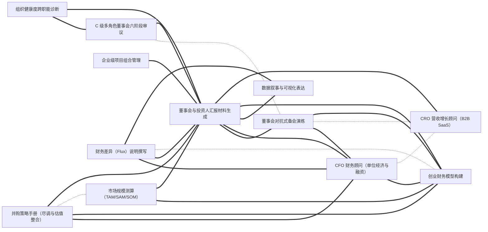

# 技能大典 · Everything Skills

> 一部面向 **AI Agent** 的技能类书。事以类聚，技以互见。
>
> 收录可被 Claude Code / Codex / Cursor / Gemini CLI 等智能体直接加载的 `SKILL.md` 技能包，
> 以中国传统**类书**的「分类 + 互见 + 索引」思想组织，但把实现换成了今天真正能 scale 的形态。

> **一键安装**：在 Claude Code 里运行 `/plugin marketplace add findscripter/everything-skills`，即可浏览、按卷分装 11 个插件。也提供 `AGENTS.md` / `GEMINI.md`（+ `gemini-extension.json`）/ `CLAUDE.md` 同源上下文，供 Codex / Gemini CLI / Cursor 等发现使用。
>
> **中文优先**：全库技能均为中文——这是以英文为主的技能生态里少见的体系化中文技能库。
>
> 本库 1108 条中文技能；另索引 293 个外部 GitHub 技能库（只读 README）。
>
> **English version** — a full English tree mirrors this library 1-to-1 (same `name`, same cross-references) on the [`en`](https://github.com/findscripter/everything-skills/tree/en) branch. Where an upstream English original exists, the English tree **reuses it verbatim** rather than translating back from Chinese (`source` keeps every skill traceable).
>
> **安全与许可**：技能本体是给 Agent 的**指令文本**（非可执行程序）；凡涉及脚本/网络调用的已在各自「注意事项」中标注。本库为精选改编合集，逐条来源与许可见 [INDEX/sources.md](INDEX/sources.md)、总说明见 [LICENSE](LICENSE) / [NOTICE](NOTICE)。

---

## 一图看懂：技能互见图谱（节选）

全库 **1108 条技能、6843 条互见边**。整图无法渲染，这里截取连接最密的一个技能簇示意——
实线 = 依赖(requires)，虚线 = 互见(related)，粗线 = 组合(combines_with)。
**这正是本仓库区别于"平铺列表"的核心：技能不是孤立条目，而是连成网络。**



---

## 这是什么

每一条技能是一个文件夹，里面有一个标准的 `SKILL.md`（带 YAML frontmatter）。
AI Agent 在运行时**读取每条技能的 `description` 字段做匹配**来决定是否加载——
这意味着：

- **发现靠元数据，不靠目录树**。目录是给人类维护者用的；Agent 看的是 frontmatter。
- **一条技能只放一个地方**，跨领域的关联用「互见」字段（`related` / `requires` / `combines_with`）表达成**关系图**，而不是把技能复制到 5 个分类下。
- **索引、目录、互见图谱全部由脚本自动生成**，永不手工维护。

## 技能仓库目录

目前索引 **293** 个 GitHub 技能库/市场/精选列表。只根据 README 摘要，不收录对方源码、不复制 SKILL.md。本页是目录；详细表由 `data/skill-repos.jsonl` 生成，见 [INDEX/skill-repos.md](INDEX/skill-repos.md)。

### 1. 官方与权威（93）

- [`anthropics/skills`](https://github.com/anthropics/skills)
- [`agentskills/agentskills`](https://github.com/agentskills/agentskills)
- [`openai/skills`](https://github.com/openai/skills)
- [`openai/plugins`](https://github.com/openai/plugins)
- [`vercel-labs/agent-skills`](https://github.com/vercel-labs/agent-skills)
- [`vercel-labs/skills`](https://github.com/vercel-labs/skills)
- [`anthropics/claude-plugins-official`](https://github.com/anthropics/claude-plugins-official)
- [`anthropics/claude-plugins-community`](https://github.com/anthropics/claude-plugins-community)
- [`anthropics/financial-services`](https://github.com/anthropics/financial-services)
- [`anthropics/knowledge-work-plugins`](https://github.com/anthropics/knowledge-work-plugins)
- [`anthropics/claude-for-legal`](https://github.com/anthropics/claude-for-legal)
- [`anthropics/k12-teacher-skills`](https://github.com/anthropics/k12-teacher-skills)
- [`github/awesome-copilot`](https://github.com/github/awesome-copilot)
- [`microsoft/skills`](https://github.com/microsoft/skills)
- [`NVIDIA/skills`](https://github.com/NVIDIA/skills)
- [`google/skills`](https://github.com/google/skills)
- [`huggingface/skills`](https://github.com/huggingface/skills)
- [`google-labs-code/stitch-skills`](https://github.com/google-labs-code/stitch-skills)
- [`anthropics/defending-code-reference-harness`](https://github.com/anthropics/defending-code-reference-harness)
- [`google/agents-cli`](https://github.com/google/agents-cli)
- [`microsoft/SkillOpt`](https://github.com/microsoft/SkillOpt)
- [`cloudflare/skills`](https://github.com/cloudflare/skills)
- [`expo/skills`](https://github.com/expo/skills)
- [`microsoft/azure-skills`](https://github.com/microsoft/azure-skills)
- [`microsoft/skills-for-fabric`](https://github.com/microsoft/skills-for-fabric)
- [`vercel-labs/next-skills`](https://github.com/vercel-labs/next-skills)
- [`anthropics/launch-your-agent`](https://github.com/anthropics/launch-your-agent)
- [`awslabs/agent-plugins`](https://github.com/awslabs/agent-plugins)
- [`google/mantis`](https://github.com/google/mantis)
- [`microsoft/power-platform-skills`](https://github.com/microsoft/power-platform-skills)
- [`makenotion/skills`](https://github.com/makenotion/skills)
- [`googleworkspace/cli`](https://github.com/googleworkspace/cli)
- [`larksuite/cli`](https://github.com/larksuite/cli)
- [`dotnet/skills`](https://github.com/dotnet/skills)
- [`OpenSenseNova/SenseNova-Skills`](https://github.com/OpenSenseNova/SenseNova-Skills)
- [`remotion-dev/skills`](https://github.com/remotion-dev/skills)
- [`supabase/agent-skills`](https://github.com/supabase/agent-skills)
- [`firebase/agent-skills`](https://github.com/firebase/agent-skills)
- [`prisma/skills`](https://github.com/prisma/skills)
- [`browserbase/skills`](https://github.com/browserbase/skills)
- [`hashicorp/agent-skills`](https://github.com/hashicorp/agent-skills)
- [`angular/skills`](https://github.com/angular/skills)
- [`elastic/agent-skills`](https://github.com/elastic/agent-skills)
- [`ClickHouse/agent-skills`](https://github.com/ClickHouse/agent-skills)
- [`LambdaTest/agent-skills`](https://github.com/LambdaTest/agent-skills)
- [`qdrant/skills`](https://github.com/qdrant/skills)
- [`OpenZeppelin/openzeppelin-skills`](https://github.com/OpenZeppelin/openzeppelin-skills)
- [`resend/resend-skills`](https://github.com/resend/resend-skills)
- [`circlefin/skills`](https://github.com/circlefin/skills)
- [`redis/agent-skills`](https://github.com/redis/agent-skills)
- [`Shopify/agent-skills`](https://github.com/Shopify/agent-skills)
- [`greensock/gsap-skills`](https://github.com/greensock/gsap-skills)
- [`google-gemini/gemini-skills`](https://github.com/google-gemini/gemini-skills)
- [`aws/agent-toolkit-for-aws`](https://github.com/aws/agent-toolkit-for-aws)
- [`apify/agent-skills`](https://github.com/apify/agent-skills)
- [`WordPress/agent-skills`](https://github.com/WordPress/agent-skills)
- [`langchain-ai/langchain-skills`](https://github.com/langchain-ai/langchain-skills)
- [`getsentry/skills`](https://github.com/getsentry/skills)
- [`planetscale/database-skills`](https://github.com/planetscale/database-skills)
- [`posit-dev/skills`](https://github.com/posit-dev/skills)
- [`elevenlabs/skills`](https://github.com/elevenlabs/skills)
- [`microsoft/skills-for-copilot-studio`](https://github.com/microsoft/skills-for-copilot-studio)
- [`microsoft/win-dev-skills`](https://github.com/microsoft/win-dev-skills)
- [`amd/skills`](https://github.com/amd/skills)
- [`databricks/databricks-agent-skills`](https://github.com/databricks/databricks-agent-skills)
- [`vercel/vercel-plugin`](https://github.com/vercel/vercel-plugin)
- [`mongodb/agent-skills`](https://github.com/mongodb/agent-skills)
- [`langchain-ai/langsmith-skills`](https://github.com/langchain-ai/langsmith-skills)
- [`black-forest-labs/skills`](https://github.com/black-forest-labs/skills)
- [`firecrawl/skills`](https://github.com/firecrawl/skills)
- [`wandb/skills`](https://github.com/wandb/skills)
- [`replicate/skills`](https://github.com/replicate/skills)
- [`vercel-labs/agent-browser`](https://github.com/vercel-labs/agent-browser)
- [`microsoft/playwright-cli`](https://github.com/microsoft/playwright-cli)
- [`figma/mcp-server-guide`](https://github.com/figma/mcp-server-guide)
- [`higgsfield-ai/skills`](https://github.com/higgsfield-ai/skills)
- [`NVIDIA-BioNeMo/bionemo-agent-toolkit`](https://github.com/NVIDIA-BioNeMo/bionemo-agent-toolkit)
- [`neondatabase/postgres-skills`](https://github.com/neondatabase/postgres-skills)
- [`TheQtCompanyRnD/agent-skills`](https://github.com/TheQtCompanyRnD/agent-skills)
- [`NVIDIA/nvidia-kaggle`](https://github.com/NVIDIA/nvidia-kaggle)
- [`huggingface/pwc-cli`](https://github.com/huggingface/pwc-cli)
- [`elastic/elastic-docs-skills`](https://github.com/elastic/elastic-docs-skills)
- [`huggingface/transformers-to-mlx`](https://github.com/huggingface/transformers-to-mlx)
- [`NVIDIA/nurec-skills`](https://github.com/NVIDIA/nurec-skills)
- [`huggingface/s2-cli`](https://github.com/huggingface/s2-cli)
- [`huggingface/physics-intern-skills`](https://github.com/huggingface/physics-intern-skills)
- [`elastic/integration-skills`](https://github.com/elastic/integration-skills)
- [`trycourier/courier-skills`](https://github.com/trycourier/courier-skills)
- [`NVIDIA/digital-health-skills`](https://github.com/NVIDIA/digital-health-skills)
- [`astronomer/agents`](https://github.com/astronomer/agents)
- [`remix-run/agent-skills`](https://github.com/remix-run/agent-skills)
- [`sanity-io/agent-toolkit`](https://github.com/sanity-io/agent-toolkit)
- [`coderabbitai/skills`](https://github.com/coderabbitai/skills)

### 2. 精选列表 / 大集合（38）

- [`ComposioHQ/awesome-claude-skills`](https://github.com/ComposioHQ/awesome-claude-skills)
- [`hesreallyhim/awesome-claude-code`](https://github.com/hesreallyhim/awesome-claude-code)
- [`VoltAgent/awesome-openclaw-skills`](https://github.com/VoltAgent/awesome-openclaw-skills)
- [`sickn33/agentic-awesome-skills`](https://github.com/sickn33/agentic-awesome-skills)
- [`VoltAgent/awesome-agent-skills`](https://github.com/VoltAgent/awesome-agent-skills)
- [`VoltAgent/awesome-claude-code-subagents`](https://github.com/VoltAgent/awesome-claude-code-subagents)
- [`composio-community/awesome-codex-skills`](https://github.com/composio-community/awesome-codex-skills)
- [`travisvn/awesome-claude-skills`](https://github.com/travisvn/awesome-claude-skills)
- [`heilcheng/awesome-agent-skills`](https://github.com/heilcheng/awesome-agent-skills)
- [`mukul975/Anthropic-Cybersecurity-Skills`](https://github.com/mukul975/Anthropic-Cybersecurity-Skills)
- [`BehiSecc/awesome-claude-skills`](https://github.com/BehiSecc/awesome-claude-skills)
- [`anbeime/skill`](https://github.com/anbeime/skill)
- [`0xNyk/awesome-hermes-agent`](https://github.com/0xNyk/awesome-hermes-agent)
- [`libukai/awesome-agent-skills`](https://github.com/libukai/awesome-agent-skills)
- [`jeremylongshore/tons-of-skills-marketplace`](https://github.com/jeremylongshore/tons-of-skills-marketplace)
- [`bergside/awesome-design-skills`](https://github.com/bergside/awesome-design-skills)
- [`obra/superpowers-marketplace`](https://github.com/obra/superpowers-marketplace)
- [`numman-ali/n-skills`](https://github.com/numman-ali/n-skills)
- [`hashgraph-online/awesome-codex-plugins`](https://github.com/hashgraph-online/awesome-codex-plugins)
- [`gamedev-skills/awesome-gamedev-agent-skills`](https://github.com/gamedev-skills/awesome-gamedev-agent-skills)
- [`lawve-ai/awesome-legal-skills`](https://github.com/lawve-ai/awesome-legal-skills)
- [`trailofbits/skills-curated`](https://github.com/trailofbits/skills-curated)
- [`LinklyAI/best-skills`](https://github.com/LinklyAI/best-skills)
- [`tmstack/awesome-persona-skills`](https://github.com/tmstack/awesome-persona-skills)
- [`Prat011/awesome-llm-skills`](https://github.com/Prat011/awesome-llm-skills)
- [`spencerpauly/awesome-cursor-skills`](https://github.com/spencerpauly/awesome-cursor-skills)
- [`skillmatic-ai/awesome-agent-skills`](https://github.com/skillmatic-ai/awesome-agent-skills)
- [`ZeroPointRepo/awesome-hermes-skills`](https://github.com/ZeroPointRepo/awesome-hermes-skills)
- [`brycewang-stanford/Awesome-Journal-Skills`](https://github.com/brycewang-stanford/Awesome-Journal-Skills)
- [`fleurytian/awesome-claude-skills`](https://github.com/fleurytian/awesome-claude-skills)
- [`apify/awesome-skills`](https://github.com/apify/awesome-skills)
- [`JackyST0/awesome-agent-skills`](https://github.com/JackyST0/awesome-agent-skills)
- [`figma/community-resources`](https://github.com/figma/community-resources)
- [`jakubkrehel/skills`](https://github.com/jakubkrehel/skills)
- [`BuilderIO/skills`](https://github.com/BuilderIO/skills)
- [`Hisn00w/ASu-skills`](https://github.com/Hisn00w/ASu-skills)
- [`JasonColapietro/suede-creator-skills`](https://github.com/JasonColapietro/suede-creator-skills)
- [`neondatabase/agent-skills`](https://github.com/neondatabase/agent-skills)

### 3. 垂直领域技能包（73）

- [`obra/superpowers`](https://github.com/obra/superpowers)
- [`affaan-m/ECC`](https://github.com/affaan-m/ECC)
- [`mattpocock/skills`](https://github.com/mattpocock/skills)
- [`addyosmani/agent-skills`](https://github.com/addyosmani/agent-skills)
- [`kepano/obsidian-skills`](https://github.com/kepano/obsidian-skills)
- [`coreyhaines31/marketingskills`](https://github.com/coreyhaines31/marketingskills)
- [`K-Dense-AI/scientific-agent-skills`](https://github.com/K-Dense-AI/scientific-agent-skills)
- [`wshobson/agents`](https://github.com/wshobson/agents)
- [`alirezarezvani/claude-skills`](https://github.com/alirezarezvani/claude-skills)
- [`phuryn/pm-skills`](https://github.com/phuryn/pm-skills)
- [`Orchestra-Research/AI-Research-SKILLs`](https://github.com/Orchestra-Research/AI-Research-SKILLs)
- [`Jeffallan/claude-skills`](https://github.com/Jeffallan/claude-skills)
- [`deanpeters/Product-Manager-Skills`](https://github.com/deanpeters/Product-Manager-Skills)
- [`trailofbits/skills`](https://github.com/trailofbits/skills)
- [`antfu/skills`](https://github.com/antfu/skills)
- [`tech-leads-club/agent-skills`](https://github.com/tech-leads-club/agent-skills)
- [`tradermonty/claude-trading-skills`](https://github.com/tradermonty/claude-trading-skills)
- [`aaron-he-zhu/aaron-marketing-skills`](https://github.com/aaron-he-zhu/aaron-marketing-skills)
- [`aaron-he-zhu/seo-geo-claude-skills`](https://github.com/aaron-he-zhu/seo-geo-claude-skills)
- [`aklofas/kicad-happy`](https://github.com/aklofas/kicad-happy)
- [`jaechang-hits/SciAgent-Skills`](https://github.com/jaechang-hits/SciAgent-Skills)
- [`OctagonAI/skills`](https://github.com/OctagonAI/skills)
- [`voidful/academic-skills`](https://github.com/voidful/academic-skills)
- [`findscripter/everything-skills`](https://github.com/findscripter/everything-skills)
- [`JimLiu/baoyu-skills`](https://github.com/JimLiu/baoyu-skills)
- [`EveryInc/compound-engineering-plugin`](https://github.com/EveryInc/compound-engineering-plugin)
- [`rjs/shaping-skills`](https://github.com/rjs/shaping-skills)
- [`himself65/finance-skills`](https://github.com/himself65/finance-skills)
- [`samber/cc-skills-golang`](https://github.com/samber/cc-skills-golang)
- [`RKiding/Awesome-finance-skills`](https://github.com/RKiding/Awesome-finance-skills)
- [`eternityspring/shuohao-skills`](https://github.com/eternityspring/shuohao-skills)
- [`badlogic/pi-skills`](https://github.com/badlogic/pi-skills)
- [`wondelai/skills`](https://github.com/wondelai/skills)
- [`emilkowalski/skills`](https://github.com/emilkowalski/skills)
- [`titanwings/distilly`](https://github.com/titanwings/distilly)
- [`KKKKhazix/khazix-skills`](https://github.com/KKKKhazix/khazix-skills)
- [`Vincentwei1021/video-shotcraft`](https://github.com/Vincentwei1021/video-shotcraft)
- [`JimLiu/baoyu-design`](https://github.com/JimLiu/baoyu-design)
- [`mohitagw15856/pm-claude-skills`](https://github.com/mohitagw15856/pm-claude-skills)
- [`fivetaku/gptaku_plugins`](https://github.com/fivetaku/gptaku_plugins)
- [`BagelHole/DevOps-Security-Agent-Skills`](https://github.com/BagelHole/DevOps-Security-Agent-Skills)
- [`data-goblin/power-bi-agentic-development`](https://github.com/data-goblin/power-bi-agentic-development)
- [`inference-sh/skills`](https://github.com/inference-sh/skills)
- [`giuseppe-trisciuoglio/developer-kit`](https://github.com/giuseppe-trisciuoglio/developer-kit)
- [`try-works/recursive-mode`](https://github.com/try-works/recursive-mode)
- [`jnMetaCode/superpowers-zh`](https://github.com/jnMetaCode/superpowers-zh)
- [`MengTo/Skills`](https://github.com/MengTo/Skills)
- [`SamurAIGPT/Generative-Media-Skills`](https://github.com/SamurAIGPT/Generative-Media-Skills)
- [`ScrapeCreators/social-media-research-skills`](https://github.com/ScrapeCreators/social-media-research-skills)
- [`AIDevGTM/gtm-cofounder`](https://github.com/AIDevGTM/gtm-cofounder)
- [`SkyworkAI/Skywork-Skills`](https://github.com/SkyworkAI/Skywork-Skills)
- [`internet-court/internet-court-skill`](https://github.com/internet-court/internet-court-skill)
- [`s1dashu/ip-as-logo-skill`](https://github.com/s1dashu/ip-as-logo-skill)
- [`larashero3-dotcom/lieflat-charts`](https://github.com/larashero3-dotcom/lieflat-charts)
- [`isjiamu/gzh-design-skill`](https://github.com/isjiamu/gzh-design-skill)
- [`cloudflare/security-audit-skill`](https://github.com/cloudflare/security-audit-skill)
- [`karanb192/itr-wala`](https://github.com/karanb192/itr-wala)
- [`amElnagdy/guard-skills`](https://github.com/amElnagdy/guard-skills)
- [`SeanJ1ang/design-judge-skills`](https://github.com/SeanJ1ang/design-judge-skills)
- [`Kulaxyz/self-learning-skills`](https://github.com/Kulaxyz/self-learning-skills)
- [`BBuf/AI-Infra-Auto-Driven-SKILLS`](https://github.com/BBuf/AI-Infra-Auto-Driven-SKILLS)
- [`lllllllama/RigorPilot-Skills`](https://github.com/lllllllama/RigorPilot-Skills)
- [`web-infra-dev/midscene-skills`](https://github.com/web-infra-dev/midscene-skills)
- [`KKKKhazix/human-writing`](https://github.com/KKKKhazix/human-writing)
- [`danyuchn/asd-ste100-skill`](https://github.com/danyuchn/asd-ste100-skill)
- [`titanwings/ex-skill`](https://github.com/titanwings/ex-skill)
- [`JimLiu/Illustrated-Agent-Skills`](https://github.com/JimLiu/Illustrated-Agent-Skills)
- [`JimLiu/baocut`](https://github.com/JimLiu/baocut)
- [`obra/superpowers-lab`](https://github.com/obra/superpowers-lab)
- [`KKKKhazix/sun-style-writing`](https://github.com/KKKKhazix/sun-style-writing)
- [`Neeeophytee/finding-unknowns-skills`](https://github.com/Neeeophytee/finding-unknowns-skills)
- [`CloudWave818/ieee-skills`](https://github.com/CloudWave818/ieee-skills)
- [`JimLiu/science-skills`](https://github.com/JimLiu/science-skills)

### 4. 安装器 / 注册表 / 基础设施（14）

- [`NVIDIA/SkillSpector`](https://github.com/NVIDIA/SkillSpector)
- [`yusufkaraaslan/Skill_Seekers`](https://github.com/yusufkaraaslan/Skill_Seekers)
- [`numman-ali/openskills`](https://github.com/numman-ali/openskills)
- [`iflytek/skillhub`](https://github.com/iflytek/skillhub)
- [`modelcontextprotocol/registry`](https://github.com/modelcontextprotocol/registry)
- [`antfu/skills-npm`](https://github.com/antfu/skills-npm)
- [`microsoft/waza`](https://github.com/microsoft/waza)
- [`microsoft/skill-recorder`](https://github.com/microsoft/skill-recorder)
- [`TanStack/intent`](https://github.com/TanStack/intent)
- [`openclaw/clawhub`](https://github.com/openclaw/clawhub)
- [`cloudflare/agent-skills-discovery-rfc`](https://github.com/cloudflare/agent-skills-discovery-rfc)
- [`huggingface/upskill`](https://github.com/huggingface/upskill)
- [`NVIDIA/SkillEvaluator`](https://github.com/NVIDIA/SkillEvaluator)
- [`changchangidea-oss/SkillRadar`](https://github.com/changchangidea-oss/SkillRadar)

### 5. 其他（1）

- [`anthropics/claude-cookbooks`](https://github.com/anthropics/claude-cookbooks)

### 6. 名称不含 skill / agent（74）

- [`DietrichGebert/ponytail`](https://github.com/DietrichGebert/ponytail)
- [`JuliusBrussee/caveman`](https://github.com/JuliusBrussee/caveman)
- [`garrytan/gstack`](https://github.com/garrytan/gstack)
- [`OthmanAdi/planning-with-files`](https://github.com/OthmanAdi/planning-with-files)
- [`nextlevelbuilder/ui-ux-pro-max-skill`](https://github.com/nextlevelbuilder/ui-ux-pro-max-skill)
- [`Graphify-Labs/graphify`](https://github.com/Graphify-Labs/graphify)
- [`Leonxlnx/taste-skill`](https://github.com/Leonxlnx/taste-skill)
- [`pbakaus/impeccable`](https://github.com/pbakaus/impeccable)
- [`heygen-com/hyperframes`](https://github.com/heygen-com/hyperframes)
- [`tt-a1i/archify`](https://github.com/tt-a1i/archify)
- [`blader/humanizer`](https://github.com/blader/humanizer)
- [`cathrynlavery/diagram-design`](https://github.com/cathrynlavery/diagram-design)
- [`mvanhorn/last30days-skill`](https://github.com/mvanhorn/last30days-skill)
- [`Nutlope/hallmark`](https://github.com/Nutlope/hallmark)
- [`guillaumemeyer/watermarks-remover`](https://github.com/guillaumemeyer/watermarks-remover)
- [`shadcn/improve`](https://github.com/shadcn/improve)
- [`oso95/scroll-world`](https://github.com/oso95/scroll-world)
- [`petergyang/no-ai-slop`](https://github.com/petergyang/no-ai-slop)
- [`diffusionstudio/lottie`](https://github.com/diffusionstudio/lottie)
- [`AminBlg/SimpleEnglish`](https://github.com/AminBlg/SimpleEnglish)
- [`kwakseongjae/oh-my-design`](https://github.com/kwakseongjae/oh-my-design)
- [`NanmiCoder/open-image-prompts`](https://github.com/NanmiCoder/open-image-prompts)
- [`plannotator/effective-html`](https://github.com/plannotator/effective-html)
- [`Forward-Future/loopy`](https://github.com/Forward-Future/loopy)
- [`feicaiclub/video-spec-builder`](https://github.com/feicaiclub/video-spec-builder)
- [`miqdadbadjuber/anti-slop`](https://github.com/miqdadbadjuber/anti-slop)
- [`Owl-Listener/designer-skills`](https://github.com/Owl-Listener/designer-skills)
- [`Owl-Listener/ai-design-skills`](https://github.com/Owl-Listener/ai-design-skills)
- [`Owl-Listener/inclusive-design-skills`](https://github.com/Owl-Listener/inclusive-design-skills)
- [`mcollina/skills`](https://github.com/mcollina/skills)
- [`MicrosoftDocs/Agent-Skills`](https://github.com/MicrosoftDocs/Agent-Skills)
- [`microsoft/Dataverse-skills`](https://github.com/microsoft/Dataverse-skills)
- [`microsoft/cat-agent-skills`](https://github.com/microsoft/cat-agent-skills)
- [`vinayaklatthe/microsoft-security-skills`](https://github.com/vinayaklatthe/microsoft-security-skills)
- [`K-Dense-AI/science-superpowers`](https://github.com/K-Dense-AI/science-superpowers)
- [`K-Dense-AI/mimeographs`](https://github.com/K-Dense-AI/mimeographs)
- [`ghostsecurity/skills`](https://github.com/ghostsecurity/skills)
- [`obra/superpowers-skills`](https://github.com/obra/superpowers-skills)
- [`NeoLabHQ/context-engineering-kit`](https://github.com/NeoLabHQ/context-engineering-kit)
- [`mhattingpete/claude-skills-marketplace`](https://github.com/mhattingpete/claude-skills-marketplace)
- [`haunchen/n8n-skills`](https://github.com/haunchen/n8n-skills)
- [`zxkane/aws-skills`](https://github.com/zxkane/aws-skills)
- [`PostHog/skills`](https://github.com/PostHog/skills)
- [`antonbabenko/terraform-skill`](https://github.com/antonbabenko/terraform-skill)
- [`sunchaokun/PPT-Design-Skill`](https://github.com/sunchaokun/PPT-Design-Skill)
- [`czlonkowski/n8n-skills`](https://github.com/czlonkowski/n8n-skills)
- [`n8n-io/skills`](https://github.com/n8n-io/skills)
- [`earthtojake/text-to-cad`](https://github.com/earthtojake/text-to-cad)
- [`xstongxue/best-skills`](https://github.com/xstongxue/best-skills)
- [`daymade/claude-code-skills`](https://github.com/daymade/claude-code-skills)
- [`alibaba/skill-up`](https://github.com/alibaba/skill-up)
- [`wpsnote/wpsnote-skills`](https://github.com/wpsnote/wpsnote-skills)
- [`stripe/ai`](https://github.com/stripe/ai)
- [`payloadcms/skills`](https://github.com/payloadcms/skills)
- [`livekit/agent-skills`](https://github.com/livekit/agent-skills)
- [`ant-design/antd-skill`](https://github.com/ant-design/antd-skill)
- [`longbridge/skills`](https://github.com/longbridge/skills)
- [`smartcontractkit/chainlink-agent-skills`](https://github.com/smartcontractkit/chainlink-agent-skills)
- [`video-db/skills`](https://github.com/video-db/skills)
- [`marswaveai/skills`](https://github.com/marswaveai/skills)
- [`labring/sealos-skills`](https://github.com/labring/sealos-skills)
- [`opensearch-project/opensearch-agent-skills`](https://github.com/opensearch-project/opensearch-agent-skills)
- [`op7418/guizang-ppt-skill`](https://github.com/op7418/guizang-ppt-skill)
- [`tanweai/pua`](https://github.com/tanweai/pua)
- [`muratcankoylan/Agent-Skills-for-Context-Engineering`](https://github.com/muratcankoylan/Agent-Skills-for-Context-Engineering)
- [`dontbesilent2025/dbskill`](https://github.com/dontbesilent2025/dbskill)
- [`kangarooking/cangjie-skill`](https://github.com/kangarooking/cangjie-skill)
- [`gsd-build/get-shit-done`](https://github.com/gsd-build/get-shit-done)
- [`open-gsd/gsd-core`](https://github.com/open-gsd/gsd-core)
- [`CloudAI-X/threejs-skills`](https://github.com/CloudAI-X/threejs-skills)
- [`yetone/native-feel-skill`](https://github.com/yetone/native-feel-skill)
- [`superdesigndev/superdesign-skill`](https://github.com/superdesigndev/superdesign-skill)
- [`yan-labs/serenity-aleabitoreddit`](https://github.com/yan-labs/serenity-aleabitoreddit)
- [`existential-birds/beagle`](https://github.com/existential-birds/beagle)

## 设计哲学：保留类书的魂，换掉过时的骨

类书（《永乐大典》《四库全书》）的伟大，在于**没有全文检索的时代**用人工分类 + 互见解决"找东西"。
今天搜索已经解决了检索，所以我们**继承它的思想，修正它的机制**：

| 类书思想 | 在本仓库的对应实现 | 为什么这样改 |
|---|---|---|
| 事以类聚（分类） | 11 卷功能域目录（[TAXONOMY.md](TAXONOMY.md)） | 命名**内容可预测**，贡献者一眼知道往哪放；不用乾坤五行那种语义为空的隐喻 |
| 互见法（一物多见） | frontmatter 关系字段 → 自动生成[互见图谱](INDEX/) | Agent 不浏览目录；互见做成**图的边**才能驱动依赖/组合/进阶推荐 |
| 总目 + 分目 + 索引 | `scripts/build-index.mjs` **自动生成** [INDEX/](INDEX/) | 手工维护多套索引必然腐烂；让机器从 frontmatter 重建 |
| 条目体例统一 | [SCHEMA.md](SCHEMA.md) + [`_template/SKILL.md`](_template/SKILL.md) | 机读友好、单一职责、token 精简——为 Agent 而非为人类阅读优化 |

> **为什么不用「天-地-人-事-物 / 乾坤坎离 / 金木水火土」？**
> 因为受众是 AI Agent。那套命名很美，但"思维归乾、沟通归坤"是**不可预测的映射**——
> 贡献者猜不到该放哪、用户猜不到去哪找，会原样复活你最想消灭的"分类混乱"。
> 对机器它更是完全不可见。我们把"类书味"留在**标题、目录、互见**这一层，而非生硬套在原始路径上。

## 目录结构

```
everything-skills/
├── README.md                # 本文件（总序）
├── TAXONOMY.md              # 分类总纲：11 卷功能域 + 设计原则
├── SCHEMA.md                # 技能条目的 frontmatter 字段规范
├── taxonomy.json            # 卷→合法类 受控词表（生成器校验依据）
├── CONTRIBUTING.md          # 如何新增一条技能
├── _template/
│   └── SKILL.md             # 条目模板（复制即用）
├── data/
│   ├── skill-repos.jsonl    # 外部技能库目录源（jsonl）
│   └── skill-repos.meta.md  # 总目前言（检索方法等）
├── scripts/
│   ├── build-index.mjs      # 索引/目录/互见图谱生成器（零依赖 Node）
│   └── build-skill-repos.mjs # 由 jsonl 生成 INDEX/skill-repos.md
├── INDEX/                   # catalog/tags/tools/graph/search/sources 由脚本生成
│   ├── catalog.md           # 全书总目（按卷·类）
│   ├── tags.md              # 标签索引
│   ├── tools.md             # 工具索引
│   ├── graph.md             # 互见图谱（Mermaid）
│   ├── graph.json           # 互见图谱（机读，供可视化）
│   ├── search.json          # 召回层：扁平记录，供两段式发现/搜索
│   └── skill-repos.md       # 技能仓库总目（由 jsonl 生成，勿手改）
├── .claude-plugin/
│   └── marketplace.json     # 插件市场清单（自动生成，可 /plugin marketplace add 安装）
├── 00-meta/                 # 卷〇·通用元能力
├── 01-documents/            # 卷一·文书
├── 02-engineering/          # 卷二·研发
├── 03-data/                 # 卷三·数据
├── 04-ai/                   # 卷四·智能
├── 05-business/             # 卷五·商业
├── 06-creative/             # 卷六·创意
├── 07-productivity/         # 卷七·协作
├── 08-security/             # 卷八·安全
├── 09-verticals/            # 卷九·领域专精
└── 10-platform/             # 卷十·平台集成（连接器/CLI/云/浏览器/MCP）
```

> **路径用 ASCII kebab-case，标题用中文。** 单条技能的文件夹名即它的 `name`（技能 ID），
> 必须是 ASCII 短横线命名（跨平台 / 跨 Agent 安全），中文标题写在 frontmatter 的 `title` 里。
> 「类书」活在目录与索引层，而非原始路径层。

## 一条技能长什么样

见 [`_template/SKILL.md`](_template/SKILL.md) 与字段规范 [SCHEMA.md](SCHEMA.md)。核心是 frontmatter：

```yaml
---
name: pdf-form-filler
title: PDF 表单填写
description: 当需要以编程方式填写、提取或勾选 PDF 表单字段（AcroForm/XFA）时使用；触发词：填表、PDF 表单、表单字段、批量盖章。
domain: 文书/PDF
tags: [pdf, forms, extraction]
level: 进阶
requires: [pdf-basics]            # 依赖（前置技能）
related: [markdown-to-docx]       # 互见
combines_with: [csv-data-cleaner] # 组合
agents: [claude-code, codex, cursor]
tools: [python, pypdf]
status: stable
---
```

## 如何被 AI Agent 使用

- **作为插件市场安装（推荐）**：仓库含 `.claude-plugin/marketplace.json`，在 Claude Code 里 `/plugin marketplace add <repo>` 即可浏览、**按卷分装**（11 个插件对应 11 卷）。对标 anthropics/skills、wshobson/agents 的安装方式。
- **Claude Code / Agent SDK**：把整个仓库（或某几卷）作为 skills 目录挂载，Agent 按 `description` 自动发现。
- **导出单包**：每个技能文件夹自包含，可单独复制给任意支持 `SKILL.md` 的工具。
- **多版本适配**：`agents:` 字段声明兼容的助手；后续可由脚本生成各家优化变体。

## 如何检索

不靠人脑爬目录，靠生成出来的索引（运行 `node scripts/build-index.mjs` 重建）：

- 按领域浏览 → [INDEX/catalog.md](INDEX/catalog.md)
- 按标签找 → [INDEX/tags.md](INDEX/tags.md)
- 按工具找 → [INDEX/tools.md](INDEX/tools.md)
- 看技能关系（依赖/互见/组合）→ [INDEX/graph.md](INDEX/graph.md)
- 技能仓库目录（只索引 GitHub 技能库，不收录源码）→ [本页目录](#技能仓库目录) · 详细表 [INDEX/skill-repos.md](INDEX/skill-repos.md)
- 全文/语义搜索 → 直接用编辑器或后续接入的搜索（这才是"检索"的正解）

## 路线图

- **第一阶段 · 骨架**：定稿分类总纲、字段规范、条目模板、索引生成器；每卷放数条样例技能跑通全链路。
- **第二阶段 · 填肉（当前）**：填肉进行中 / 1108 条已收录。
- **第三阶段 · 特色**：技能依赖图可视化、组合推荐、一键导出各 Agent 变体、社区贡献与评分。

> 已做过一轮 3 视角对抗评审（发现机制 / 归位 / 规模化）。完整发现与 P0–P3 待办见 [ROADMAP.md](ROADMAP.md)。

## 贡献

读 [CONTRIBUTING.md](CONTRIBUTING.md)。一句话：复制模板 → 填 frontmatter → 写正文 → 跑 `node scripts/build-index.mjs` 与 `node scripts/build-skill-repos.mjs` 校验 → 提 PR。

---

*事以类聚，技以互见。— 技能大典*
