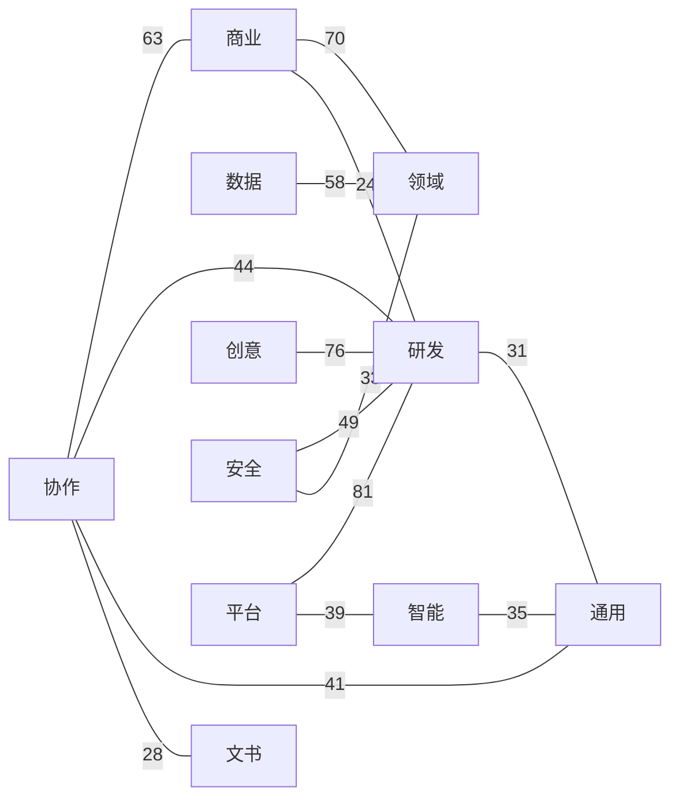
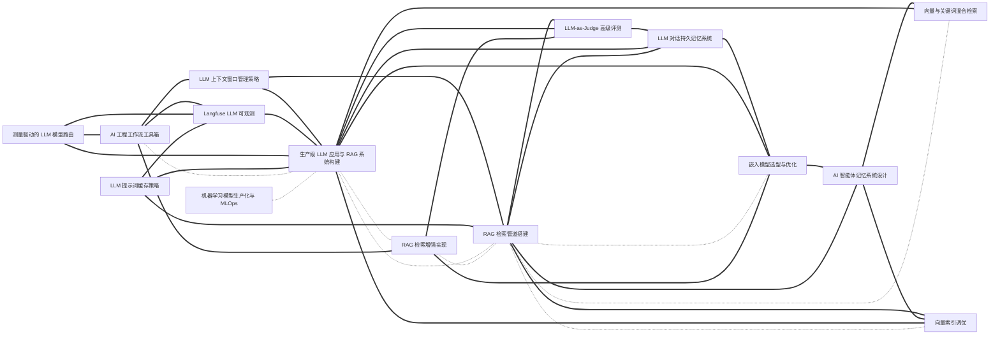

# 技能大典 · Everything Skills

> 一部面向 **AI Agent** 的技能类书。事以类聚，技以互见。
>
> 收录可被 Claude Code / Codex / Cursor / Gemini CLI 等智能体直接加载的 `SKILL.md` 技能包，
> 以中国传统**类书**的「分类 + 互见 + 索引」思想组织，但把实现换成了今天真正能 scale 的形态。

> **一键安装**：在 Claude Code 里运行 `/plugin marketplace add findscripter/everything-skills`，即可浏览、按卷分装 11 个插件。也提供 `AGENTS.md` / `GEMINI.md`（+ `gemini-extension.json`）/ `CLAUDE.md` 同源上下文，供 Codex / Gemini CLI / Cursor 等发现使用。
>
> **中文优先**：全库技能均为中文——这是以英文为主的技能生态里少见的体系化中文技能库。
>
> 本库 1108 条中文技能；另索引 **1567** 个外部 GitHub 技能库（只读 README）。
>
> **English version** — a full English tree mirrors this library 1-to-1 (same `name`, same cross-references) on the [`en`](https://github.com/findscripter/everything-skills/tree/en) branch. Where an upstream English original exists, the English tree **reuses it verbatim** rather than translating back from Chinese (`source` keeps every skill traceable).
>
> **安全与许可**：技能本体是给 Agent 的**指令文本**（非可执行程序）；凡涉及脚本/网络调用的已在各自「注意事项」中标注。本库为精选改编合集，逐条来源与许可见 [INDEX/sources.md](INDEX/sources.md)、总说明见 [LICENSE](LICENSE) / [NOTICE](NOTICE)。

---

## 一图看懂：技能互见图谱（节选）

全库 **1108 条技能、6843 条互见边**。整图见 [INDEX/graph.md](INDEX/graph.md)（卷级总览 + 按卷折叠）；以下两张为**示意节选**（由 graph.json 按固定规则自动重绘），便于在 GitHub 上直接渲染。

图例：实线箭头 `-->` = 依赖(requires)，虚线 `-.-` = 互见(related)，粗线 `===` = 组合(combines_with)。

**这正是本仓库区别于「平铺列表」的核心：技能不是孤立条目，而是连成网络。**

### 卷级总览（跨卷最强互见）

11 卷之间 Top 14 条单向跨卷边（边标签 = 边数）。

### 密集聚类示意（RAG / LLM）

以 `production-llm-app-builder` / `rag-pipeline-builder`（生产级 LLM 应用与 RAG 系统构建 / RAG 检索管道搭建）为枢纽的 ego 簇，约 15 个技能 / 36 条边（节点标签为中文标题）。

---

## 这是什么

每一条技能是一个文件夹，里面有一个标准的 `SKILL.md`（带 YAML frontmatter）。
AI Agent 在运行时**读取每条技能的 `description` 字段做匹配**来决定是否加载——
这意味着：

- **发现靠元数据，不靠目录树**。目录是给人类维护者用的；Agent 看的是 frontmatter。
- **一条技能只放一个地方**，跨领域的关联用「互见」字段（`related` / `requires` / `combines_with`）表达成**关系图**，而不是把技能复制到 5 个分类下。
- **索引、目录、互见图谱全部由脚本自动生成**，永不手工维护。

## 技能仓库目录

目前索引 **1567** 个 GitHub 技能库/市场/精选列表。只根据 README 摘要，不收录对方源码、不复制 SKILL.md。

完整六类可点击目录与 stars/summary/license 分表见 **[INDEX/skill-repos.md](INDEX/skill-repos.md)**（CI 由 `data/skill-repos*.jsonl` 生成；本 PR 已追加 `data/skill-repos.part53.jsonl`）。

### 分类计数（全量 1567）

- 官方与权威（official）：**189**
- 精选列表 / 大集合（collections）：**377**
- 垂直领域技能包（vertical）：**763**
- 安装器 / 注册表 / 基础设施（infra）：**113**
- 其他（other）：**7**
- 名称不含 skill / agent（unnamed）：**118**

### 本批新增（part53，+30）

官方（official，本批 2）

- [`VapiAI/skills`](https://github.com/VapiAI/skills) — Vapi 官方语音 AI Agent Skills（创建助手/工具/活动等），兼容 skills.sh
- [`didit-protocol/skills`](https://github.com/didit-protocol/skills) — Didit 身份核验官方 12 个生产级 Agent Skills（KYC/AML/生物识别等）

精选（collections，本批 9）

- [`mikiarlo3/awesome-growth-hacking-skills`](https://github.com/mikiarlo3/awesome-growth-hacking-skills) — 精选增长黑客/营销 Agent Skills 目录（enso.bot 策展），按策略、获客、内容、RevOps 等分类
- [`scarletkc/agents`](https://github.com/scarletkc/agents) — 跨代理共享标准与可复用 skills（AGENTS.md + SKILL.md），面向 Claude Code / Codex CLI
- [`serpro69/claude-toolbox`](https://github.com/serpro69/claude-toolbox) — 精简多语言 Claude Code 配置与插件工具箱：MCP、skills、agents 等生产向工作流
- [`simota/agent-skills`](https://github.com/simota/agent-skills) — 90 个专科 AI agents + Nexus 编排的跨平台技能集合（Claude/Codex/Antigravity）
- [`tmchow/agent-skills`](https://github.com/tmchow/agent-skills) — 个人跨平台 Agent Skills 集合，可通过 npx skills 安装到 Claude/Cursor/Codex 等
- [`eai-org/agent-toolkit`](https://github.com/eai-org/agent-toolkit) — 项目无关的工程 Agent Skills/规则工具包：文档压缩、技能创作与日常工程任务
- [`antonbabenko/agent-plugins`](https://github.com/antonbabenko/agent-plugins) — Claude Code / Codex 插件市场与可执行纪律型 Agent Skills 集合
- [`heymegabyte/claude-skills`](https://github.com/heymegabyte/claude-skills) — Emdash：面向 32+ AI 编码工具的 solo-SaaS 技能平台（一句话到 Cloudflare 部署）
- [`beeyev/skills`](https://github.com/beeyev/skills) — 小型 Agent Skills 集合，含 GitLab CI Handbook 等可安装技能

垂直（vertical，本批 11）

- [`flaqai/backlink_skills`](https://github.com/flaqai/backlink_skills) — Codex 驱动的外链提交与 SEO 内容生产技能包：目录提交、写作与多平台分发工作流
- [`eternityspring/reelbench-skills`](https://github.com/eternityspring/reelbench-skills) — AI 视频侧 Claude/Codex 技能：成片拉片（video-shots）与分镜信息合成（video-sync）
- [`hyperfx-ai/marketing-skills`](https://github.com/hyperfx-ai/marketing-skills) — 面向营销的 Agent Skills（广告/社媒/SEO/邮件等），配合 Hyper MCP 工具背包
- [`eldermoraes/quarkus-agentic-scaffolding`](https://github.com/eldermoraes/quarkus-agentic-scaffolding) — Quarkus + LangChain4j 智能体脚手架技能与约定（CLAUDE.md/AGENTS.md）
- [`Jobo16/ielts-buddy`](https://github.com/Jobo16/ielts-buddy) — 雅思学习本地 Agent Skills：计划、作文批改、口语陪练、听力阅读复盘与模考
- [`JellyBrick/korean-prose-skill`](https://github.com/JellyBrick/korean-prose-skill) — 韩语撰写与校对 Agent Skill，清理翻译腔与不自然文风
- [`CodeAlive-AI/codealive-skills`](https://github.com/CodeAlive-AI/codealive-skills) — CodeAlive 语义代码搜索与代码库问答的官方 Agent Skills / 插件
- [`OpenGHz/embodied-ai-paper-writer`](https://github.com/OpenGHz/embodied-ai-paper-writer) — 具身智能顶会论文写作便携 Agent Skill（SKILL.md + 参考剧本）
- [`axisrobo/ea-harness`](https://github.com/axisrobo/ea-harness) — 企业架构设计与校验技能包/CLI（需求、设计、图表校验与门禁）
- [`mixocreative/ecommerce-cia`](https://github.com/mixocreative/ecommerce-cia) — 台湾电商金流串接与完整性审查 AI skill（蓝新/绿界等），支持 Claude/Codex/Cursor
- [`romainsimon/skills-for-decision-making`](https://github.com/romainsimon/skills-for-decision-making) — 基于《Algorithms for Decision Making》的决策理论 Agent Skills 与计算器

基础设施（infra，本批 8）

- [`william-garden/sync-skill`](https://github.com/william-garden/sync-skill) — 一键在多款编码代理/IDE 间同步 SKILL.md 技能目录的安装器
- [`Tencent/SkillHone`](https://github.com/Tencent/SkillHone) — 腾讯开源：基于持久决策历史的持续 Agent Skill 演化与优化运行时
- [`SpaceZephyr/build-your-harness`](https://github.com/SpaceZephyr/build-your-harness) — 三个配套 harness 搭建/体检/翻阅 Agent Skills，零依赖、多运行时通用
- [`dltsum/doc2skill`](https://github.com/dltsum/doc2skill) — 将操作手册/文档自动转化为高质量 Agent Skills（SKILL.md + references）的工具
- [`RiriXt1/skillcheck`](https://github.com/RiriXt1/skillcheck) — Agent Skills（SKILL.md）静态检查器：前置元数据、密钥泄露、重名与模糊触发
- [`theinfosecguy/razin`](https://github.com/theinfosecguy/razin) — 面向 SKILL.md 的本地静态分析安全扫描器（确定性发现，不执行技能代码）
- [`himself65/skill-lint`](https://github.com/himself65/skill-lint) — 校验 Claude/Agent Skills（SKILL.md）的 lint 工具
- [`KnoxOps/agent-runbook`](https://github.com/KnoxOps/agent-runbook) — 将契约式 YAML runbook 编译为 Claude/Codex SKILL.md 的多代理框架

> 说明：全量六段折叠目录因体积超过 GitHub MCP 单次写入上限，本 PR 先以「分类计数 + 本批链接 + INDEX」呈现；合并前可用 `node scripts/refresh-readme-skill-repos-directory.mjs` 本地回填全量目录。
