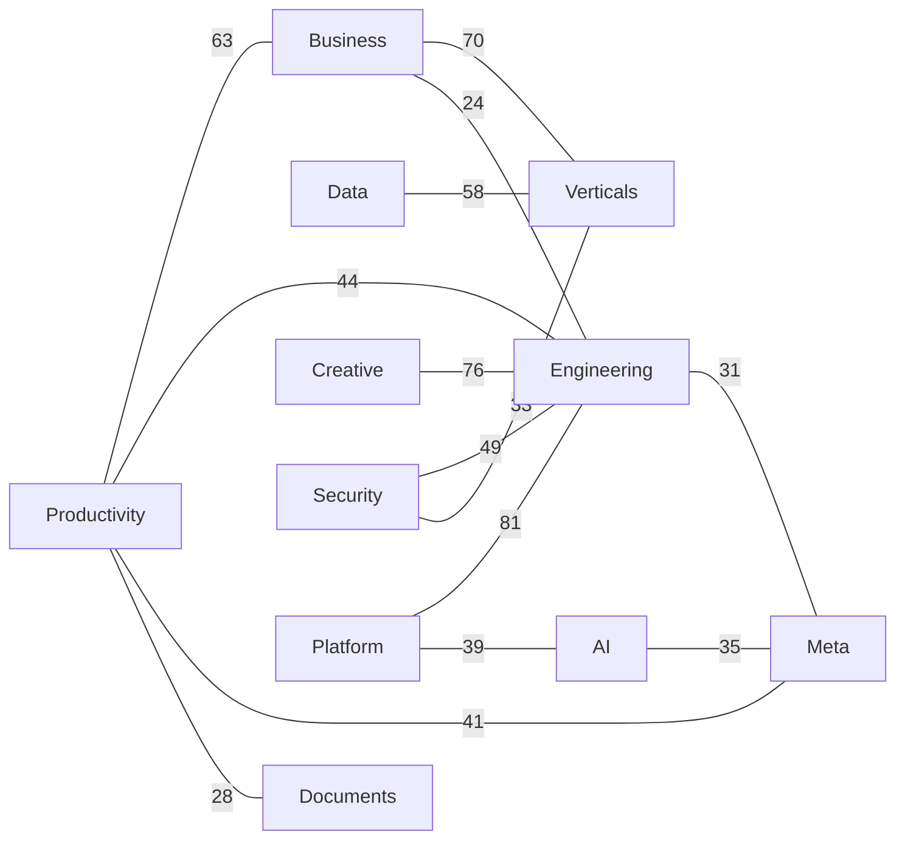
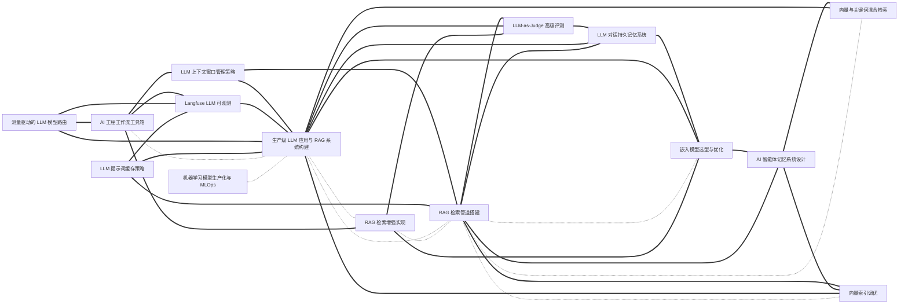

# Everything Skills

> An encyclopedic, cross-linked **skill library for AI agents**. Skills cluster by kind; techniques cross-reference each other.
>
> Curated `SKILL.md` packages loadable by Claude Code / Codex / Cursor / Gemini CLI and similar agents — organized like a classical **leishu** (encyclopedia: taxonomy + cross-references + indexes), implemented for scale.
>
> **Install**: in Claude Code run `/plugin marketplace add findscripter/everything-skills` to browse and install 11 volume plugins. Multi-harness context files (`AGENTS.md` / `GEMINI.md` + `gemini-extension.json` / `CLAUDE.md`) help Codex / Gemini CLI / Cursor discover the same tree.
>
> **Language**: repository chrome on `main` is **English**; each `SKILL.md` stays in its **native/original language**. Chinese chrome edition: [`zh`](https://github.com/findscripter/everything-skills/tree/zh). Full English skill mirror on `en` is **deprecated** — see [LANGUAGE.md](LANGUAGE.md).
>
> This library holds **1108** curated skills and also indexes **1679** external GitHub skill libraries (README-only).
>
> **Security & license**: skill bodies are **instruction text** for agents (not executables). Scripts / network calls are flagged in each skill's notes. Provenance: [INDEX/sources.md](INDEX/sources.md); terms: [LICENSE](LICENSE) / [NOTICE](NOTICE). Policy: [SECURITY.md](SECURITY.md).

---

## Graph showcase (excerpt)

**1108 skills · 6843 cross-reference edges.** Full graph: [INDEX/graph.md](INDEX/graph.md) (volume overview + per-volume folds). The two diagrams below are **illustrative excerpts** (redrawn from `graph.json` by fixed rules) so GitHub can render them inline.

Legend: solid arrow `-->` = `requires`, dashed `-.-` = `related`, thick `===` = `combines_with`.

**This is what sets the repo apart from a flat list: skills form a network, not isolated cards.**

### Volume overview (strongest cross-volume links)

Top 14 directed cross-volume edges among the 11 volumes (edge label = count).

### Dense cluster (RAG / LLM)

Ego cluster around `production-llm-app-builder` / `rag-pipeline-builder` (~15 skills / 36 edges). Node labels keep the skills' native titles.

---

## What this is

Each skill is a folder with a standard `SKILL.md` (YAML frontmatter).
At runtime, agents **match the `description` field** to decide whether to load a skill — so:

- **Discovery is metadata-driven, not directory browsing.** Folders are for human maintainers; agents read frontmatter.
- **One skill, one place.** Cross-domain links use `related` / `requires` / `combines_with` as a **relation graph**, instead of copying the same skill into five categories.
- **Indexes, catalogs, and graphs are script-generated** — never hand-maintained.

See also [LANGUAGE.md](LANGUAGE.md) and [SECURITY.md](SECURITY.md).

## Skill repos directory

Currently indexing **1679** GitHub skill libraries / marketplaces / curated lists. README summaries only — we do not vendor their source or copy their SKILL.md bodies.

Full tables (stars / summary / license) and the complete categorized link list are generated from `data/skill-repos.jsonl` (and part shards) into **[INDEX/skill-repos.md](INDEX/skill-repos.md)**. Below: section counts plus today's **part56** additions.

### 1. Official (196)

### 2. Collections (394)

### 3. Vertical (818)

### 4. Infra (139)

### 5. Other (13)

### 6. Unnamed (119)

#### New in part56 (2026-09-17)

1. Official — part56 (+2)

- [`spotify/portal-ai-plugins`](https://github.com/spotify/portal-ai-plugins) — Spotify Portal AI Plugins：把 Portal CLI 工作流接入 Claude/Codex/Cursor。
- [`openai/role-specific-plugins`](https://github.com/openai/role-specific-plugins) — OpenAI 官方角色化 Codex 插件模板（销售/数据/产品设计等）。

2. Collections — part56 (+11)

- [`shanraisshan/claude-code-best-practice`](https://github.com/shanraisshan/claude-code-best-practice) — 从 vibe coding 到 agentic engineering 的 Claude Code 最佳实践指南/技能。
- [`VoltAgent/awesome-codex-subagents`](https://github.com/VoltAgent/awesome-codex-subagents) — 175+ Codex 子代理精选列表（13 类）。
- [`zebbern/claude-code-guide`](https://github.com/zebbern/claude-code-guide) — Claude Code 社区指南：安装/命令/工作流/agents/skills 与技巧。
- [`chaseai-yt/claudex-loop`](https://github.com/chaseai-yt/claudex-loop) — Claude Code 四阶段计划硬化：侦察/质询/Codex 对抗审查/跨模型构建。
- [`Pluviobyte/rnskill`](https://github.com/Pluviobyte/rnskill) — 雪踏乌云维护的 57 个 Agent Skills（内容创作+工程/效率，SKILL.md）。
- [`MageByte-Zero/spec-superflow`](https://github.com/MageByte-Zero/spec-superflow) — OpenSpec+Superpowers 融合的 Spec-first AI 编程工作流插件（多平台）。
- [`soumatheusgomes/vibe-coding-toolkit`](https://github.com/soumatheusgomes/vibe-coding-toolkit) — Vibe Coding Toolkit：Claude Code/Codex 插件+子代理+质量门禁工具包。
- [`nWave-ai/nWave`](https://github.com/nWave-ai/nWave) — nWave：七波次门禁式 Claude Code 交付流程（人工审批节点）。
- [`Zhiyuan-Fan/Awesome-DeepSeek-Harness-Plugins`](https://github.com/Zhiyuan-Fan/Awesome-DeepSeek-Harness-Plugins) — DeepSeek Harness (DSH) 插件/技能/工具精选目录。
- [`tzachbon/smart-ralph`](https://github.com/tzachbon/smart-ralph) — Smart Ralph：Ralph Wiggum 循环 + 结构化规格驱动的 Claude Code 插件。
- [`oprogramadorreal/optimus-claude`](https://github.com/oprogramadorreal/optimus-claude) — optimus-claude：为项目调优 Claude Code 性能的插件集合。

3. Vertical — part56 (+7)

- [`Spark-To-Paper-Skills/paperjury`](https://github.com/Spark-To-Paper-Skills/paperjury) — PaperJury：论文投稿前 AI 评审压力测试 Claude Code skill（due-process）。
- [`jwangkun/claude-for-financial-services-cn`](https://github.com/jwangkun/claude-for-financial-services-cn) — Anthropic 金融服务 Skills 的 A 股/国内市场深度适配（63 skills）。
- [`arnabbagxd/Brand-building-skills`](https://github.com/arnabbagxd/Brand-building-skills) — 品牌建设 Agent Skills：策略/命名/身份/声音/定位/信息与发布。
- [`addsumtech/slides_maker`](https://github.com/addsumtech/slides_maker) — slide-maker：把论文/代码/文档变成可编辑 PPTX 的 Agent Skill。
- [`tryproduck/produck-skills`](https://github.com/tryproduck/produck-skills) — 以用户体验为中心的产品构建 Agent Skills 文档驱动集合。
- [`iart-ai/motion-skills`](https://github.com/iart-ai/motion-skills) — 50+ 动效/动画/视频 Agent Skills（14–15 可安装包，Remotion/Manim/WebGL）。
- [`cookiy-ai/sell-sessions-skill`](https://github.com/cookiy-ai/sell-sessions-skill) — 出售/打包 Claude Code 与 Codex 会话的开源 Skill。

4. Infra — part56 (+8)

- [`thedotmack/claude-mem`](https://github.com/thedotmack/claude-mem) — claude-mem：跨会话持久上下文记忆（捕获 agent 全程活动）。
- [`refly-ai/refly`](https://github.com/refly-ai/refly) — Refly：用 vibe workflow 定义/运行 Agent Skills 的开源构建器。
- [`LearnPrompt/luban-skill`](https://github.com/LearnPrompt/luban-skill) — 鲁班：把可用 Skill 打磨成可安装/可传播/可验证/可进化公共资产的工坊。
- [`raiyanyahya/recall`](https://github.com/raiyanyahya/recall) — Recall：Claude Code 本地项目记忆，减少跨会话重复解释。
- [`modiqo/skillspec`](https://github.com/modiqo/skillspec) — SkillSpec：让 Agent Skills 可遵循、可测试、可证明（Doctor 风险报告）。
- [`JayPokale/Chisle`](https://github.com/JayPokale/Chisle) — Chisle：压缩 agent 话语/代码/工具输出以省 token 的跨平台工具。
- [`arbiterForge/codeArbiter`](https://github.com/arbiterForge/codeArbiter) — codeArbiter：跨 Claude/Codex/Pi 的仓库级治理与硬门禁层。
- [`Bevel-Software/Hexis`](https://github.com/Bevel-Software/Hexis) — Hexis：团队协作的 git-backed skills/tools/context 控制面（MCP）。

5. Other — part56 (+6)

- [`nagisanzenin/engram`](https://github.com/nagisanzenin/engram) — Engram：基于证据的学习引擎（课程/回忆验证/FSRS），可作 agent skill。
- [`snflkd/fluent-korean`](https://github.com/snflkd/fluent-korean) — fluent-korean：让 Claude Code 输出清晰流利韩语的 output-style 插件。
- [`alexgreensh/attention-span`](https://github.com/alexgreensh/attention-span) — Attention Span：ADHD 友好的 agent 输出风格包（Claude/Codex 等）。
- [`fivetaku/fablize`](https://github.com/fivetaku/fablize) — Fablize：让 Claude 像 Fable 一样强调完成/证据/验证的插件。
- [`seyedehsanhadi/sloptrim`](https://github.com/seyedehsanhadi/sloptrim) — sloptrim：本地 AI 写作腔调检测器（Claude Code 插件，零依赖）。
- [`codingSamss/all-my-ai-needs`](https://github.com/codingSamss/all-my-ai-needs) — Claude Code + Codex 双平台 dotfiles：统一管理 skills/agents/hooks。

6. Unnamed — part56 (+1)

- [`avelikiy/great_cto`](https://github.com/avelikiy/great_cto) — great_cto：把 Claude Code 跑成 70 专家流水线的治理/门禁 harness。

