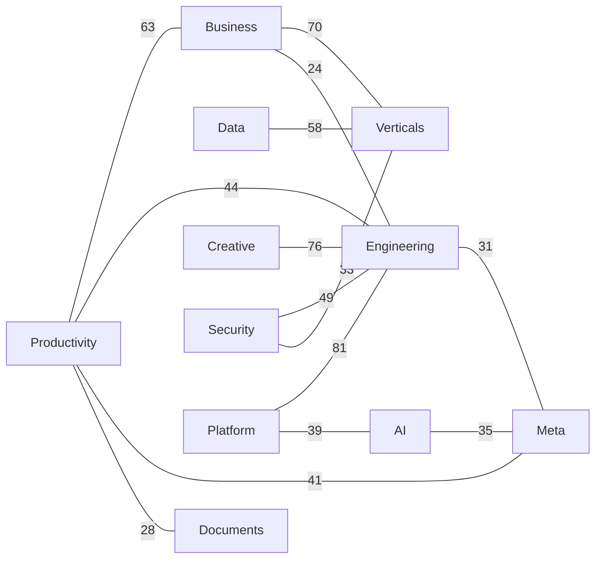

# Everything Skills

> An encyclopedic, cross-linked **skill library for AI agents**. Skills cluster by kind; techniques cross-reference each other.
>
> Curated `SKILL.md` packages loadable by Claude Code / Codex / Cursor / Gemini CLI and similar agents — organized like a classical **leishu** (encyclopedia: taxonomy + cross-references + indexes), implemented for scale.
>
> **Install**: in Claude Code run `/plugin marketplace add findscripter/everything-skills` to browse and install 11 volume plugins. Multi-harness context files (`AGENTS.md` / `GEMINI.md` + `gemini-extension.json` / `CLAUDE.md`) help Codex / Gemini CLI / Cursor discover the same tree.
>
> **Language**: repository chrome on `main` is **English**; each `SKILL.md` stays in its **native/original language**. Chinese chrome edition: [`zh`](https://github.com/findscripter/everything-skills/tree/zh). Full English skill mirror on `en` is **deprecated** — see [LANGUAGE.md](LANGUAGE.md).
>
> This library holds **1108** curated skills and also indexes **1730** external GitHub skill libraries (README-only).
>
> **Security & license**: skill bodies are **instruction text** for agents (not executables). Scripts / network calls are flagged in each skill's notes. Provenance: [INDEX/sources.md](INDEX/sources.md); terms: [LICENSE](LICENSE) / [NOTICE](NOTICE). Policy: [SECURITY.md](SECURITY.md).

---

## Graph showcase (excerpt)

**1108 skills · 6843 cross-reference edges.** Skills form a **network**, not isolated cards — linked by `requires` / `related` / `combines_with`.

Full graph (volume overview + per-volume hub/edge tables): **[INDEX/graph.md](INDEX/graph.md)**. Machine-readable: [`INDEX/graph.json`](INDEX/graph.json).

Legend: solid `-->` = `requires`, dashed `-.-` = `related`, thick `===` = `combines_with`.

### Volume overview (strongest cross-volume links)

Top 14 undirected cross-volume edge counts among the 11 volumes (edge label = count). Dense per-skill clusters live in `INDEX/graph.md` / `graph.json` (kept out of the README to leave room for the skill-repos directory).

---

## What this is

Each skill is a folder with a standard `SKILL.md` (YAML frontmatter).
At runtime, agents **match the `description` field** to decide whether to load a skill — so:

- **Discovery is metadata-driven, not directory browsing.** Folders are for human maintainers; agents read frontmatter.
- **One skill, one place.** Cross-domain links use `related` / `requires` / `combines_with` as a **relation graph**, instead of copying the same skill into five categories.
- **Indexes, catalogs, and graphs are script-generated** — never hand-maintained.

See also [LANGUAGE.md](LANGUAGE.md) and [SECURITY.md](SECURITY.md).

## Skill repos directory

Currently indexing **1730** GitHub skill libraries / marketplaces / curated lists. README summaries only — we do not vendor their source or copy their SKILL.md bodies.

Full tables (stars / summary / license) are generated from `data/skill-repos.jsonl` (and part shards) into **[INDEX/skill-repos.md](INDEX/skill-repos.md)**. This page is the categorized link directory.

1. Official (198)

- [`anthropics/skills`](https://github.com/anthropics/skills) — Anthropic official Agent Skills examples and doc skills; marketplace source anthropics/skills.
- [`vercel-labs/agent-browser`](https://github.com/vercel-labs/agent-browser) — Vercel official browser-automation CLI + installable Agent Skill (discovery stub + CLI hot-loads core); npx skills add vercel-labs/agent-browser. Repo name contains agent.
- [`github/awesome-copilot`](https://github.com/github/awesome-copilot) — GitHub official Awesome Copilot: curated custom agents, instructions, prompts, and skills.
- [`anthropics/claude-plugins-official`](https://github.com/anthropics/claude-plugins-official) — Anthropic-maintained official Claude Code / Cowork plugin marketplace.
- [`anthropics/financial-services`](https://github.com/anthropics/financial-services) — Claude for Financial Services official skills/plugins pack.
- [`vercel-labs/agent-skills`](https://github.com/vercel-labs/agent-skills) — Vercel official ~8 installable Agent Skills.
- [`googleworkspace/cli`](https://github.com/googleworkspace/cli) — Google Workspace unofficial-support CLI (gws): Discovery-driven command surface for Drive/Gmail/Calendar etc., with 100+ Agent Skills.
- [`vercel-labs/skills`](https://github.com/vercel-labs/skills) — Vercel npx skills CLI and skills.sh: de-facto installer for GitHub skill repos across 70+ coding agents.
- [`openai/skills`](https://github.com/openai/skills) — OpenAI early skills examples; README marks deprecated; current examples moved to openai/plugins.
- [`agentskills/agentskills`](https://github.com/agentskills/agentskills) — Agent Skills open standard (agentskills.io): SKILL.md format and cross-vendor portability.
- [`anthropics/knowledge-work-plugins`](https://github.com/anthropics/knowledge-work-plugins) — Knowledge-work Cowork plugins (~11 role plugins).
- [`google/skills`](https://github.com/google/skills) — Google official Agent Skills for GCP/GKE/BigQuery/Ads/Firebase etc.; npx skills add google/skills; bundles Claude/Codex/Antigravity marketplaces.
- [`larksuite/cli`](https://github.com/larksuite/cli) — Feishu/Lark official CLI: 200+ commands and 26 Agent Skills (calendar/docs/messaging/sheets/meetings, etc.); install via skills CLI as larksuite/cli.
- [`microsoft/SkillOpt`](https://github.com/microsoft/SkillOpt) — Microsoft optimizer treating SKILL.md as trainable state: freeze the model, edit skill docs with trajectories and validation gates; emits deployable best_skill.md.
- [`greensock/gsap-skills`](https://github.com/greensock/gsap-skills) — GSAP official animation skills (8): core/timeline/ScrollTrigger/plugins/utils/react/performance/frameworks; npx skills add greensock/gsap-skills.
- [`microsoft/playwright-cli`](https://github.com/microsoft/playwright-cli) — Microsoft Playwright CLI with SKILLS: playwright-cli install --skills; browser CLI for coding agents (more token-efficient than MCP).
- [`huggingface/skills`](https://github.com/huggingface/skills) — Hugging Face official Hub/train/eval/Spaces skills; marketplace exposes hf-cli by default; others via hf skills add.
- [`anthropics/claude-for-legal`](https://github.com/anthropics/claude-for-legal) — Claude for Legal official skills: contract review, legal research, and law-firm workflows.
- [`google-labs-code/stitch-skills`](https://github.com/google-labs-code/stitch-skills) — Google Stitch design skills and three plugins (design/build/utilities); works with Codex, Antigravity, Claude Code, Cursor. Not an officially supported product.
- [`anthropics/defending-code-reference-harness`](https://github.com/anthropics/defending-code-reference-harness) — Anthropic defensive-security reference harness: threat modeling, scan, triage, patch, and detection-response skills plus autonomous scan pipelines. Marked unmaintained.
- [`google/agents-cli`](https://github.com/google/agents-cli) — CLI + skills for Gemini Enterprise Agent Platform: turn any coding agent into an ADK agent build/eval/deploy expert.
- [`openai/plugins`](https://github.com/openai/plugins) — OpenAI current Codex plugins/skills example directory; successor to openai/skills.
- [`dotnet/skills`](https://github.com/dotnet/skills) — .NET official Agent Skills plugin marketplace: dotnet/advanced/data/diag/msbuild/nuget/upgrade/maui/ai/test/aspnetcore/blazor, etc., for Copilot/Claude/Codex/Cursor.
- [`OpenSenseNova/SenseNova-Skills`](https://github.com/OpenSenseNova/SenseNova-Skills) — SenseTime SenseNova office skills: infographics/PPT/Excel analysis/deep research/multi-source search; SKILL.md installs for OpenClaw and Hermes.
- [`remotion-dev/skills`](https://github.com/remotion-dev/skills) — Remotion official Agent Skills: best-practices/create/markup/studio/render/maps/captions/saas/interactivity/docs/upgrade/multimedia.
- [`google-gemini/gemini-skills`](https://github.com/google-gemini/gemini-skills) — Gemini API official skills: gemini-api-dev / live-api / omni-flash; npx skills add google-gemini/gemini-skills. Not an officially supported product.
- [`browserbase/skills`](https://github.com/browserbase/skills) — Browserbase official browser-automation skills: browser/functions/trace/autobrowse/safe-browser/search/ui-test, etc.; npx skills add browserbase/skills.
- [`anthropics/claude-plugins-community`](https://github.com/anthropics/claude-plugins-community) — Read-only mirror of the community plugin marketplace; nightly sync after submit, security scan, and approval.
- [`NVIDIA/skills`](https://github.com/NVIDIA/skills) — NVIDIA official verified skills catalog: Physical AI, simulation, CUDA-X, RAG.
- [`snyk/agent-scan`](https://github.com/snyk/agent-scan) — Snyk official: scan AI agents/MCP/skills security risks.
- [`microsoft/agent-skills`](https://github.com/microsoft/agent-skills) — Microsoft official Agent Skills repository (WIP).
- [`microsoft/skills`](https://github.com/microsoft/skills) — Microsoft official Azure SDK / AI Foundry Agent Skills; Skill Explorer claims 175.
- [`flutter/agent-plugins`](https://github.com/flutter/agent-plugins) — Flutter official agent plugin marketplace (marketplace.json); installable Flutter-dev Skills.
- [`cloudflare/skills`](https://github.com/cloudflare/skills) — Cloudflare official Workers/Agents SDK/Durable Objects/Wrangler/Cloudflare One skills and MCP.
- [`supabase/agent-skills`](https://github.com/supabase/agent-skills) — Supabase official skills: full supabase product pack + postgres-best-practices; skills CLI and Claude plugin marketplace.
- [`aws/agent-toolkit-for-aws`](https://github.com/aws/agent-toolkit-for-aws) — AWS official Agent Toolkit: aws-core/agents/data-analytics/devsecops (4 plugins) + MCP; README names successor awslabs/agent-plugins; npx skills add aws/agent-toolkit-for-aws/skills.
- [`expo/skills`](https://github.com/expo/skills) — Expo official build/deploy/upgrade/debug skills; Claude/Codex via plugin marketplace, others via skills CLI.
- [`apify/agent-skills`](https://github.com/apify/agent-skills) — Apify official 5: ultimate-scraper/actor-development/actorization/output-schema/sdk-integration; npx skills add. Community picks: apify/awesome-skills.
- [`anthropics/commerce-agents`](https://github.com/anthropics/commerce-agents) — Anthropic shopping and merchant Agent reference blueprint (prompts/skills/tool contracts).
- [`WordPress/agent-skills`](https://github.com/WordPress/agent-skills) — WordPress official 17: blocks/themes/plugins/REST/Playground, etc.; npx skills add WordPress/agent-skills.
- [`figma/mcp-server-guide`](https://github.com/figma/mcp-server-guide) — Figma official MCP guide repo: Cursor/Claude plugins include Agent Skills; also video-interaction-mapper / generate-project-plan workflow skills. README marks Beta.
- [`spotify/portal-ai-plugins`](https://github.com/spotify/portal-ai-plugins) — Spotify Portal AI Plugins: wire Portal CLI workflows into Claude/Codex/Cursor.
- [`callstackincubator/agent-skills`](https://github.com/callstackincubator/agent-skills) — Callstack: React Native–oriented Agent Skills collection.
- [`microsoft/hve-core`](https://github.com/microsoft/hve-core) — Microsoft Hypervelocity Engineering: instruction/prompt/agent/skill components for GitHub Copilot.
- [`microsoft/azure-skills`](https://github.com/microsoft/azure-skills) — Microsoft Azure skills plugins: prepare/validate/deploy/diagnose/cost/AI/RBAC etc., wired to Azure MCP and Foundry MCP.
- [`mozilla-ai/cq`](https://github.com/mozilla-ai/cq) — Mozilla AI shared-knowledge commons (cq) Claude plugin.
- [`langchain-ai/langchain-skills`](https://github.com/langchain-ai/langchain-skills) — LangChain/LangGraph/Deep Agents 21 skills; npx skills add langchain-ai/langchain-skills. Early development.
- [`TencentCloudBase/CloudBase-AI-Toolkit`](https://github.com/TencentCloudBase/CloudBase-AI-Toolkit) — Tencent Cloud CloudBase AI Toolkit (with Agent Skills).
- [`microsoft/skills-for-fabric`](https://github.com/microsoft/skills-for-fabric) — Microsoft Fabric skills marketplace: fabric-skills full pack and standalone Power BI authoring pack.
- [`Kotlin/kotlin-agent-skills`](https://github.com/Kotlin/kotlin-agent-skills) — Kotlin official: AI Agent Skills usable in Kotlin projects.
- [`vercel-labs/next-skills`](https://github.com/vercel-labs/next-skills) — Signpost repo: original Next.js Agent Skills moved into vercel/next.js skills/; use npx skills add vercel/next.js.
- [`anthropics/launch-your-agent`](https://github.com/anthropics/launch-your-agent) — Anthropic reference skill: interview→scope v0→launch Claude Managed Agent on your account→score/iterate→scheduled deploy.
- [`getsentry/skills`](https://github.com/getsentry/skills) — Sentry team official ~27 dev skills + 2 subagents; npx skills add getsentry/skills. Product-integration skills: getsentry/sentry-for-ai.
- [`awslabs/agent-plugins`](https://github.com/awslabs/agent-plugins) — AWS Labs Agent Plugins marketplace: Amplify, Serverless, SageMaker, deploy-on-aws, etc.; README says successor is Agent Toolkit for AWS.
- [`oxylabs/agent-skills`](https://github.com/oxylabs/agent-skills) — Oxylabs official product Agent Skills.
- [`hashicorp/agent-skills`](https://github.com/hashicorp/agent-skills) — HashiCorp official Terraform (16) + Packer (4) Agent Skills; npx skills add and Claude/Codex product plugins terraform@hashicorp / packer@hashicorp.
- [`google/mantis`](https://github.com/google/mantis) — Google portable security-review skill suite: plan→research→repro→patch→report pipeline; npx skills add google/mantis. Not an officially supported product.
- [`higgsfield-ai/skills`](https://github.com/higgsfield-ai/skills) — Higgsfield official 9: generate/soul-id/photoshoot/brandkit/marketplace-cards/websites/explainer/thumbnail/game-generation; npx skills add higgsfield-ai/skills.
- [`microsoft/power-platform-skills`](https://github.com/microsoft/power-platform-skills) — Microsoft Power Platform plugin marketplace: Power Pages, Model/Canvas/Code/Mobile Apps, Power Automate, etc.
- [`laravel/agent-skills`](https://github.com/laravel/agent-skills) — Laravel official Agent Skills (Cloud/LSP/Nightwatch, etc.).
- [`Unity-Technologies/skills`](https://github.com/Unity-Technologies/skills) — Unity official AI Agent Skills set (project/CLI/UI/multiplayer/IAP, etc.).
- [`dbt-labs/dbt-agent-skills`](https://github.com/dbt-labs/dbt-agent-skills) — dbt Labs official: Agent Skills collection for dbt workflows.
- [`planetscale/database-skills`](https://github.com/planetscale/database-skills) — PlanetScale official database skills: mysql/postgres/vitess/neki; npx skills add planetscale/database-skills.
- [`angular/skills`](https://github.com/angular/skills) — Angular official coding skills: angular-developer and angular-new-app; npx skills add angular/skills; sources in angular/angular skills/dev-skills.
- [`elastic/agent-skills`](https://github.com/elastic/agent-skills) — Elastic official skills: Cloud/Elasticsearch/Kibana/Observability/Security (5 groups); npx skills add elastic/agent-skills and Claude/Copilot marketplaces.
- [`openai/role-specific-plugins`](https://github.com/openai/role-specific-plugins) — OpenAI official role-specific Codex plugin templates (sales/data/product design, etc.).
- [`lightonai/next-plaid`](https://github.com/lightonai/next-plaid) — LightOn semantic/multi-vector code-search Tools Skills.
- [`ClickHouse/agent-skills`](https://github.com/ClickHouse/agent-skills) — ClickHouse official skills: best-practices/architecture/JS troubleshooting/chdb/infra/ClickStack OTel; npx skills add and clickhousectl skills.
- [`posit-dev/skills`](https://github.com/posit-dev/skills) — Posit official Claude skills: R packages/Shiny/Quarto/Connect/GitHub PR categories; npx skills add posit-dev/skills.
- [`makenotion/claude-code-notion-plugin`](https://github.com/makenotion/claude-code-notion-plugin) — Notion official Claude Code Notion plugin and skills.
- [`anthropics/k12-teacher-skills`](https://github.com/anthropics/k12-teacher-skills) — Claude for Teachers K-12 skills and evals, co-authored with Learning Commons.
- [`NVIDIA-BioNeMo/bionemo-agent-toolkit`](https://github.com/NVIDIA-BioNeMo/bionemo-agent-toolkit) — NVIDIA BioNeMo life-science official skills: Boltz-2/DiffDock/Evo2/GenMol/OpenFold/RFdiffusion/Parabricks NIMs and workflows; npx skills add. Dual license.
- [`elevenlabs/skills`](https://github.com/elevenlabs/skills) — ElevenLabs official TTS/STT/agents/SFX/music/dubbing etc. (10); npx skills add elevenlabs/skills.
- [`astronomer/agents`](https://github.com/astronomer/agents) — Astronomer official Airflow/warehouse skills 20+ (DAG/dbt/lineage/analytics) + MCP; npx skills add astronomer/agents.
- [`firebase/agent-skills`](https://github.com/firebase/agent-skills) — Firebase official Agent Skills; README install points at firebase/skills alias path; also Gemini/Claude/Codex/Kimi plugins.
- [`microsoft/skills-for-copilot-studio`](https://github.com/microsoft/skills-for-copilot-studio) — Microsoft Copilot Studio STANDARD agent YAML plugin: manage/author/test/advisor subagents. Experimental; not an officially supported product.
- [`mckinsey/agents-at-scale-ark`](https://github.com/mckinsey/agents-at-scale-ark) — McKinsey Agents at Scale / ARK plugin Skills.
- [`microsoft/win-dev-skills`](https://github.com/microsoft/win-dev-skills) — Microsoft WinUI 3 / Windows App SDK skills (8) + winui-dev orchestrator; Copilot/Claude/Codex marketplaces. Preview.
- [`getsentry/warden`](https://github.com/getsentry/warden) — Sentry local/PR AI code-review Agents Skills.
- [`TheQtCompanyRnD/agent-skills`](https://github.com/TheQtCompanyRnD/agent-skills) — Qt official 12: C++/QML review, UI, docs, profiler, test, Figma tokens/components, CMake; Claude marketplace + npx skills add + Gemini extension.
- [`LambdaTest/agent-skills`](https://github.com/LambdaTest/agent-skills) — TestMu AI (formerly LambdaTest) official testing skills: Selenium/Playwright/Cypress and cross-language frameworks; npx agentskillsforall add.
- [`amd/skills`](https://github.com/amd/skills) — AMD official Agent Skills: Ryzen AI local inference, Instinct LLM serving, ROCm diagnostics, etc.; npx skills add amd/skills.
- [`JetBrains/benjamin-plus-skill`](https://github.com/JetBrains/benjamin-plus-skill) — JetBrains Benjamin-Plus token-cost reduction skill.
- [`NVIDIA/nvidia-kaggle`](https://github.com/NVIDIA/nvidia-kaggle) — NVIDIA official Kaggle plugin: contest overview/writeup/kernel repro/submit; Codex/Claude marketplaces + SKILL.md.
- [`databricks/databricks-agent-skills`](https://github.com/databricks/databricks-agent-skills) — Databricks official 29 stable skills (core/jobs/pipelines/Unity Catalog, etc.); databricks aitools install and multi-host marketplaces.
- [`langfuse/skills`](https://github.com/langfuse/skills) — Langfuse official Agent Skills teaching agents tracing / prompt / evaluation.
- [`EpicGames/unreal-engine-skills-for-claude-code-plugin`](https://github.com/EpicGames/unreal-engine-skills-for-claude-code-plugin) — Epic official Unreal Editor Claude Code plugin: unreal-mcp skill + 30+ MCP toolsets.
- [`vercel/vercel-plugin`](https://github.com/vercel/vercel-plugin) — Vercel official plugin: 35 ecosystem skills + 3 expert agents + knowledge graph; npx plugins add vercel/vercel-plugin.
- [`basecamp/basecamp-cli`](https://github.com/basecamp/basecamp-cli) — Basecamp official CLI and Agent Skills.
- [`qdrant/skills`](https://github.com/qdrant/skills) — Qdrant official vector-search skills: scaling/sizing/search-quality/multitenancy/model-migration, etc. + Advisor meta-skill.
- [`OpenZeppelin/openzeppelin-skills`](https://github.com/OpenZeppelin/openzeppelin-skills) — OpenZeppelin official secure-contract skills: setup/upgrade/review for Solidity/Cairo/Stylus/Stellar/Sui.
- [`mongodb/agent-skills`](https://github.com/mongodb/agent-skills) — MongoDB official Atlas plugin + query/schema/Search/Vector skills; npx skills add mongodb/agent-skills.
- [`sanity-io/agent-toolkit`](https://github.com/sanity-io/agent-toolkit) — Sanity official 4 skills + MCP/Claude/Cursor/Codex plugins; npx skills add sanity-io/agent-toolkit.
- [`matlab/agent-skills-playground`](https://github.com/matlab/agent-skills-playground) — MathWorks MATLAB/Simulink Agent Skills experimental sandbox (official playground).
- [`okx/agent-skills`](https://github.com/okx/agent-skills) — OKX official trading/portfolio/quotes/bots Agent Skills (okx CLI).
- [`resend/resend-skills`](https://github.com/resend/resend-skills) — Resend official email skills: resend/agent-email-inbox/resend-cli/react-email/email-best-practices, plus MCP.
- [`coderabbitai/skills`](https://github.com/coderabbitai/skills) — CodeRabbit official code-review / autofix skills for 35+ agents; npx skills add coderabbitai/skills.
- [`makenotion/skills`](https://github.com/makenotion/skills) — Notion official Agent Skills; prefer npx skills add makenotion/skills; public table currently lists notion-cli only.
- [`CesiumGS/cesiumjs-skills`](https://github.com/CesiumGS/cesiumjs-skills) — Curated official CesiumJS development Agent Skills.
- [`langchain-ai/langsmith-skills`](https://github.com/langchain-ai/langsmith-skills) — LangSmith observability skills (3): trace/dataset/evaluator; npx skills add langchain-ai/langsmith-skills.
- [`adobe/spectrum-design-data`](https://github.com/adobe/spectrum-design-data) — Adobe Spectrum design tokens and component Skills.
- [`circlefin/skills`](https://github.com/circlefin/skills) — Circle official stablecoin skills: USDC/CCTP/wallets/Gateway/Arc/agent-wallet, etc.; npx skills add circlefin/skills.
- [`kevmoo/dash_skills`](https://github.com/kevmoo/dash_skills) — Dart/Flutter ecosystem Agent Skills (dash_skills).
- [`alpacahq/alpaca-skills`](https://github.com/alpacahq/alpaca-skills) — Alpaca Trading/Broker API official Agent Skills.
- [`veniceai/skills`](https://github.com/veniceai/skills) — Venice AI Agent Skills。
- [`redis/agent-skills`](https://github.com/redis/agent-skills) — Redis official skills: core/connections/search/semantic-cache/clustering/security/observability/iris-development.
- [`remix-run/agent-skills`](https://github.com/remix-run/agent-skills) — Remix official React Router three-mode skills (archived; successor `npx skills add remix-run/react-router --skill react-router`).
- [`UiPath/coder_eval`](https://github.com/UiPath/coder_eval) — UiPath open “Playwright for coding agents”: sandbox YAML suites evaluating skills/MCP/CLI as CI gates.
- [`slackapi/slack-skills-plugin`](https://github.com/slackapi/slack-skills-plugin) — Slack official skills plugin: Slack MCP + Developer Skills for Claude/Codex/Cursor.
- [`coinbase/agentic-wallet-skills`](https://github.com/coinbase/agentic-wallet-skills) — Coinbase Agentic Wallet official skills (awal CLI).
- [`base/skills`](https://github.com/base/skills) — Base chain official Skills (build-on-base/base-mcp/vibenet); npx skills add base/skills.
- [`black-forest-labs/skills`](https://github.com/black-forest-labs/skills) — Black Forest Labs FLUX image/video official skills: prompting, BFL API, FLUX 3 video suite; npx skills add.
- [`huggingface/pwc-cli`](https://github.com/huggingface/pwc-cli) — Hugging Face official Papers with Code CLI + `pwc skills add` to generate version-matched Agent Skills.
- [`clay-run/agent-plugins`](https://github.com/clay-run/agent-plugins) — Clay official GTM/enrichment Agent Skills+MCP+CLI.
- [`SalesforceAIResearch/agentforce-adlc`](https://github.com/SalesforceAIResearch/agentforce-adlc) — Agentforce development lifecycle: Claude Code skills + Agent Script DSL.
- [`ComPDFKit/compdf-skills`](https://github.com/ComPDFKit/compdf-skills) — ComPDF agent-oriented PDF processing Skills.
- [`Shopify/claude-for-commerce-examples`](https://github.com/Shopify/claude-for-commerce-examples) — Shopify storefront/merchant implementation examples for Anthropic commerce-agents.
- [`firecrawl/skills`](https://github.com/firecrawl/skills) — Firecrawl official skills catalog (CI-synced): core CLI/MCP, build SDK, workflows; npx skills add firecrawl/skills.
- [`GoogleCloudPlatform/cxas-scrapi`](https://github.com/GoogleCloudPlatform/cxas-scrapi) — Google CX Agent Studio official Python API/CLI/Skills.
- [`rstackjs/agent-skills`](https://github.com/rstackjs/agent-skills) — Rstack official Agent Skills collection.
- [`base44/skills`](https://github.com/base44/skills) — Base44 official Claude Code Skills.
- [`NVIDIA-TAO/tao-skill-bank`](https://github.com/NVIDIA-TAO/tao-skill-bank) — NVIDIA official TAO Agent Skills bank (models/data/platform/apps) for Claude/Codex plugin marketplaces; install from release tag.
- [`apache/magpie`](https://github.com/apache/magpie) — Apache official project-maintenance Agent Skills (triage/PR/release/security recipe families).
- [`microsoft/aspire-skills`](https://github.com/microsoft/aspire-skills) — .NET Aspire official Agent Skills.
- [`resemble-ai/detect-skill`](https://github.com/resemble-ai/detect-skill) — Resemble AI official deepfake detection/media-security Agent Skill.
- [`polars-inc/skills`](https://github.com/polars-inc/skills) — Polars official AI Agent Skills.
- [`zoom/skills`](https://github.com/zoom/skills) — Zoom developer-platform official Skills (REST/SDK/MCP routing).
- [`basecamp/skills`](https://github.com/basecamp/skills) — 37signals official Agent Skills for Basecamp/HEY/Fizzy via product CLIs; npx skills add basecamp/skills.
- [`vmware-skills/VMware-AIops`](https://github.com/vmware-skills/VMware-AIops) — VMware vCenter/ESXi monitoring and ops Claude Skills (monitor + aiops).
- [`elastic/elastic-docs-skills`](https://github.com/elastic/elastic-docs-skills) — Elastic official docs-workflow skills catalog; Claude marketplace + npx skills add elastic/elastic-docs-skills.
- [`Shopify/agent-skills`](https://github.com/Shopify/agent-skills) — Shopify official skills: Admin/Storefront/Functions/Hydrogen/Liquid/Polaris extensions, etc. (15); npx skill install.
- [`Shopify/ucp-cli`](https://github.com/Shopify/ucp-cli) — Shopify Universal Commerce Protocol shopping Agent Skill.
- [`Cap-go/capgo-skills`](https://github.com/Cap-go/capgo-skills) — Capgo/Capacitor mobile-dev Agent Skills.
- [`pulumi/agent-skills`](https://github.com/pulumi/agent-skills) — Pulumi official IaC Agent Skills: migrate/secrets/codegen agentskills.io skills.
- [`heygen-com/hyperframes-community-skills`](https://github.com/heygen-com/hyperframes-community-skills) — HeyGen HyperFrames community-maintained workflow Skills.
- [`wandb/skills`](https://github.com/wandb/skills) — Weights & Biases official train/eval skills (3, experimental); npx skills add wandb/skills.
- [`contentful/skill-kit`](https://github.com/contentful/skill-kit) — Contentful official SDK for building Agent Skills with TypeScript state machines.
- [`Bria-AI/bria-skill`](https://github.com/Bria-AI/bria-skill) — Bria AI image Agent Skill.
- [`VapiAI/skills`](https://github.com/VapiAI/skills) — Vapi official voice AI Agent Skills (create assistants/tools/campaigns, etc.); skills.sh compatible.
- [`catalystbyzoho/agent-skills`](https://github.com/catalystbyzoho/agent-skills) — Zoho Catalyst official Agent Skills: deploy-ready code and Zoho MCP infra.
- [`aws/tools-for-devops-agent`](https://github.com/aws/tools-for-devops-agent) — AWS DevOps Agent open skills / custom-agents toolkit.
- [`califio/skills`](https://github.com/califio/skills) — Calif.io official Agent Skills.
- [`motherduckdb/agent-skills`](https://github.com/motherduckdb/agent-skills) — MotherDuck official 22 Agent Skills: connect/SQL/Dive/pipelines.
- [`replicate/skills`](https://github.com/replicate/skills) — Replicate official model find/compare/run/publish and image/video prompting (7); npx skills add replicate/skills.
- [`confluentinc/agent-skills`](https://github.com/confluentinc/agent-skills) — Confluent official stream-processing/event-streaming Agent Skills.
- [`prisma/skills`](https://github.com/prisma/skills) — Prisma official ORM/Client/Postgres/Compute skills (8).
- [`huggingface/transformers-to-mlx`](https://github.com/huggingface/transformers-to-mlx) — Hugging Face official: Agent Skill porting transformers LLMs to mlx-lm (`uvx hf skills add`).
- [`microsoft/dataverse-business-skills`](https://github.com/microsoft/dataverse-business-skills) — Dataverse business-development official Skills.
- [`auth0/agent-skills`](https://github.com/auth0/agent-skills) — Auth0 official Agent Skills.
- [`huaweicloud/huaweicloud-devkit`](https://github.com/huaweicloud/huaweicloud-devkit) — Huawei Cloud official AI-agent DevKit: cloud-knowledge skills + KooCLI + safety guardrails.
- [`publora/skills`](https://github.com/publora/skills) — Publora official social posting/scheduling Agent Skills (via MCP).
- [`microsoft/power-cat-skills`](https://github.com/microsoft/power-cat-skills) — Power Platform CAT official Skills.
- [`microsoft/azure-devops-skills`](https://github.com/microsoft/azure-devops-skills) — Azure DevOps MCP + Copilot sample Skills/prompt patterns.
- [`cypress-io/ai-toolkit`](https://github.com/cypress-io/ai-toolkit) — Cypress official AI Toolkit Agent Skills.
- [`quark-clouddrive/quarkclouddrive_offical`](https://github.com/quark-clouddrive/quarkclouddrive_offical) — Quark Cloud Drive official Skill: manage/search drive files inside an Agent.
- [`microsoft/agent365-skills`](https://github.com/microsoft/agent365-skills) — Microsoft 365 Agent official Skills.
- [`netlify/context-and-tools`](https://github.com/netlify/context-and-tools) — Netlify official Claude plugin and context-tools skills.
- [`NVIDIA/nurec-skills`](https://github.com/NVIDIA/nurec-skills) — NVIDIA Omniverse NuRec official 6: nurec-index/datasets/ncore/nre/asset-harvester/nurec-fixer.
- [`JetBrains/phpstorm-claude-marketplace`](https://github.com/JetBrains/phpstorm-claude-marketplace) — PhpStorm Claude Code plugin marketplace.
- [`Shopify/liquid-skills`](https://github.com/Shopify/liquid-skills) — Shopify Liquid language Claude Code plugin skills.
- [`AtlasCloudAI/atlas-cloud-skills`](https://github.com/AtlasCloudAI/atlas-cloud-skills) — Atlas Cloud image/video and multi-model Agent Skills.
- [`neondatabase/postgres-skills`](https://github.com/neondatabase/postgres-skills) — Neon official vendor-neutral Postgres best-practice skills (schema/indexes/queries); npx skills add neondatabase/postgres-skills. Sibling of neondatabase/agent-skills.
- [`huggingface/s2-cli`](https://github.com/huggingface/s2-cli) — Hugging Face official Semantic Scholar CLI + SKILL.md (citations/cited-by/search).
- [`metalbear-co/skills`](https://github.com/metalbear-co/skills) — MetalBear official user Agent Skills pack.
- [`AgentEra/Agently-Skills`](https://github.com/AgentEra/Agently-Skills) — Agently framework official Agent Skills collection.
- [`awslabs/hcls-agent-skills`](https://github.com/awslabs/hcls-agent-skills) — AWS HealthCare & Life Sciences official Agent Skills.
- [`didit-protocol/skills`](https://github.com/didit-protocol/skills) — Didit identity-verification official 12 production Agent Skills (KYC/AML/biometrics, etc.).
- [`gemini-cli-extensions/google-cloud-storage`](https://github.com/gemini-cli-extensions/google-cloud-storage) — Google Cloud Storage official plugin: GCS Agent Skills + Cloud Storage MCP.
- [`helius-labs/core-ai`](https://github.com/helius-labs/core-ai) — Helius Solana Core AI Skills。
- [`Starchild-ai-agent/official-skills`](https://github.com/Starchild-ai-agent/official-skills) — Starchild official Skills.
- [`NVIDIA-Omniverse/usd-convert-cad`](https://github.com/NVIDIA-Omniverse/usd-convert-cad) — NVIDIA Omniverse official CAD→OpenUSD conversion Agent Skill.
- [`atlassian/forge-skills`](https://github.com/atlassian/forge-skills) — Atlassian Forge official Skills plugin (scaffold, review, debug, security).
- [`huggingface/physics-intern-skills`](https://github.com/huggingface/physics-intern-skills) — Hugging Face PhysicsIntern: theoretical physics/math research workflows; 8 slash skills for Claude/Codex/OpenCode/Pi.
- [`cashfree/agent-skills`](https://github.com/cashfree/agent-skills) — Cashfree payments-integration Agent Skills (npx install across frameworks).
- [`JetBrains/rider-skills`](https://github.com/JetBrains/rider-skills) — .NET/GameDev-oriented Rider Agent Skills.
- [`ultralytics/skills`](https://github.com/ultralytics/skills) — Ultralytics official YOLO Agent Skills: train/infer/track/export.
- [`kestra-io/agent-skills`](https://github.com/kestra-io/agent-skills) — Kestra official workflow-orchestration Agent Skills collection.
- [`powersync-ja/agent-skills`](https://github.com/powersync-ja/agent-skills) — PowerSync official Agent Skills.
- [`awslabs/startups`](https://github.com/awslabs/startups) — AWS Startups official plugins/Skills/tooling resource library.
- [`Hashnode/gql-skill`](https://github.com/Hashnode/gql-skill) — Hashnode GraphQL API official installable Agent Skill.
- [`nocodb/agent-skills`](https://github.com/nocodb/agent-skills) — NocoDB Agent Skills。
- [`PSPDFKit-labs/nutrient-agent-skill`](https://github.com/PSPDFKit-labs/nutrient-agent-skill) — Nutrient/PSPDFKit document Agent Skill.
- [`elastic/integration-skills`](https://github.com/elastic/integration-skills) — Elastic official integration-pack skills: research/create-integration + CEL/ingest/ECS domain skills; npx skills add. Beta.
- [`aliyun/maxcompute-semantic`](https://github.com/aliyun/maxcompute-semantic) — Alibaba Cloud MaxCompute semantic-layer CLI + portable SKILL.md: table/metric/JOIN context and SQL review/execution for agents.
- [`trycourier/courier-skills`](https://github.com/trycourier/courier-skills) — Courier official notification skills: email/SMS/push/inbox/Slack/Teams/WhatsApp; npx skills add trycourier/courier-skills.
- [`Tencent-RTC/agent-skills`](https://github.com/Tencent-RTC/agent-skills) — Tencent RTC (Chat/Call/Live, etc.) integration Agent Skills.
- [`vmware-skills/VMware-Monitor`](https://github.com/vmware-skills/VMware-Monitor) — Read-only VMware vCenter/ESXi monitoring Skill (forced read-only safety).
- [`preset-io/agent-skills`](https://github.com/preset-io/agent-skills) — Preset/Superset official BI Agent Skills (incl. Snowflake Cortex).
- [`scenario-labs/skills`](https://github.com/scenario-labs/skills) — Scenario official: image/video/audio/texture/3D workflow Agent Skills.
- [`webull-inc/webull-openapi-skills`](https://github.com/webull-inc/webull-openapi-skills) — Webull OpenAPI Agent Skills。
- [`2ChatCo/agent-skills`](https://github.com/2ChatCo/agent-skills) — WhatsApp/SMS/phone Agent Skills.
- [`exasol-labs/exasol-agent-skills`](https://github.com/exasol-labs/exasol-agent-skills) — Exasol database Agent Skills.
- [`mailtrap/mailtrap-skills`](https://github.com/mailtrap/mailtrap-skills) — Mailtrap official email-testing Agent Skills.
- [`NVIDIA/digital-health-skills`](https://github.com/NVIDIA/digital-health-skills) — NVIDIA Digital Health official clinical ASR four-stage skills: setup/build/eval/finetune.
- [`coinpaprika/skills`](https://github.com/coinpaprika/skills) — CoinPaprika/DexPaprika crypto-market Agent Skills.
- [`microsoft/teams-platform-skills`](https://github.com/microsoft/teams-platform-skills) — Teams platform development official Skills.
- [`microsoft/code-optimizations-skills`](https://github.com/microsoft/code-optimizations-skills) — Code-optimization official Agent Skills.
- [`transloadit/skills`](https://github.com/transloadit/skills) — Transloadit official media-processing Agent Skills.

2. Collections (402)

- [`ComposioHQ/awesome-claude-skills`](https://github.com/ComposioHQ/awesome-claude-skills) — One of the largest community Claude Skills curated lists; README indexes 1000+ skill entries.
- [`santifer/career-ops`](https://github.com/santifer/career-ops) — Job-search / career-ops Agent Skills workflows (high stars).
- [`shanraisshan/claude-code-best-practice`](https://github.com/shanraisshan/claude-code-best-practice) — Claude Code best-practice guide/skills from vibe coding to agentic engineering.
- [`hesreallyhim/awesome-claude-code`](https://github.com/hesreallyhim/awesome-claude-code) — Claude Code ecosystem awesome: skills, slash commands, hooks, MCP, plugins, and workflows.
- [`VoltAgent/awesome-openclaw-skills`](https://github.com/VoltAgent/awesome-openclaw-skills) — Curated OpenClaw skills aggregated from ClawHub etc.; README claims 5200–5400+.
- [`Imbad0202/academic-research-skills`](https://github.com/Imbad0202/academic-research-skills) — End-to-end academic-research Claude Skills: retrieve→write→review→revise→finalize.
- [`sickn33/agentic-awesome-skills`](https://github.com/sickn33/agentic-awesome-skills) — AAS Core: large cross-agent SKILL.md collection (v16.5.0 claims 2107). Formerly antigravity-awesome-skills.
- [`Yuan1z0825/nature-skills`](https://github.com/Yuan1z0825/nature-skills) — Large Nature-style paper writing/figures/review scientific Agent Skills library (npx skills).
- [`VoltAgent/awesome-claude-skills`](https://github.com/VoltAgent/awesome-claude-skills) — VoltAgent curated official/community Agent Skills (not AI slop).
- [`VoltAgent/awesome-agent-skills`](https://github.com/VoltAgent/awesome-agent-skills) — Hand-picked official+community Agent Skills catalog; badge claims 1497+.
- [`alchaincyf/nuwa-skill`](https://github.com/alchaincyf/nuwa-skill) — Nuwa: distill any public figure’s thinking style into an installable Agent Skill.
- [`freestylefly/awesome-gpt-image-2`](https://github.com/freestylefly/awesome-gpt-image-2) — GPT-Image2 industrial prompt engine/template library, distilled into installable Skills.
- [`Donchitos/Claude-Code-Game-Studios`](https://github.com/Donchitos/Claude-Code-Game-Studios) — Turn Claude Code into a game studio: 49 agents + 73 workflow Skills.
- [`VoltAgent/awesome-claude-code-subagents`](https://github.com/VoltAgent/awesome-claude-code-subagents) — Curated Claude Code subagents 158+; related but not a SKILL.md library.
- [`composio-community/awesome-codex-skills`](https://github.com/composio-community/awesome-codex-skills) — Codex skills awesome list; seed name ComposioHQ/awesome-codex-skills moved here.
- [`travisvn/awesome-claude-skills`](https://github.com/travisvn/awesome-claude-skills) — Community Claude Skills awesome list indexing installable skill repos by domain.
- [`ConardLi/garden-skills`](https://github.com/ConardLi/garden-skills) — ConardLi open-source Skills collection (web design/knowledge base, etc.).
- [`alchaincyf/zhangxuefeng-skill`](https://github.com/alchaincyf/zhangxuefeng-skill) — Zhang Xuefeng cognitive-OS Skill (gaokao majors/grad school/career; Nuwa distillation).
- [`BehiSecc/awesome-claude-skills`](https://github.com/BehiSecc/awesome-claude-skills) — Community Claude Skills awesome curated list.
- [`ykdojo/claude-code-tips`](https://github.com/ykdojo/claude-code-tips) — Claude Code practical tips collection (dx plugin + installable Skills).
- [`nexu-io/html-anything`](https://github.com/nexu-io/html-anything) — Agent-driven multi-surface HTML edit/generation skills (magazines/posters/Xiaohongshu, etc.).
- [`PleasePrompto/notebooklm-skill`](https://github.com/PleasePrompto/notebooklm-skill) — Skill letting Claude Code talk directly to NotebookLM.
- [`NomaDamas/k-skill`](https://github.com/NomaDamas/k-skill) — Agent Skills collection for Korean users.
- [`zenstory-ai/oh-story-claudecode`](https://github.com/zenstory-ai/oh-story-claudecode) — Web-novel writing Skill pack (rankings/breakdown/writing/de-AI-tone/covers). npx skills add zenstory-ai/oh-story-claudecode.
- [`heilcheng/awesome-agent-skills`](https://github.com/heilcheng/awesome-agent-skills) — Agent Skills directory with companion site agent-skill.co.
- [`VoltAgent/awesome-codex-subagents`](https://github.com/VoltAgent/awesome-codex-subagents) — 175+ curated Codex subagents list (13 categories).
- [`anbeime/skill`](https://github.com/anbeime/skill) — Chinese Skill store: auto-fetches official skills + 63 local Chinese skills (docs/shorts/e-commerce, etc.); claims 245 total, syncs every 24h.
- [`alchaincyf/darwin-skill`](https://github.com/alchaincyf/darwin-skill) — Darwin: evaluate→improve→test→ratchet-keep Skill self-evolution system.
- [`browser-act/skills`](https://github.com/browser-act/skills) — BrowserAct browser automation and scraping Skills (Skill Forge/solutions catalog).
- [`0xNyk/awesome-hermes-agent`](https://github.com/0xNyk/awesome-hermes-agent) — Independent Nous Hermes Agent directory: skills, plugins, memory, tools, and guides.
- [`epoko77-ai/im-not-ai`](https://github.com/epoko77-ai/im-not-ai) — Korean de-AI-tone polish Claude Skill (Humanize KR).
- [`libukai/awesome-agent-skills`](https://github.com/libukai/awesome-agent-skills) — Chinese ultimate guide to Agent Skills: specs, install, official project tables, and curated skills.
- [`jakubkrehel/skills`](https://github.com/jakubkrehel/skills) — Interfaces.dev UI skills pack (typography/colors/a11y, etc.); npx skills add + Claude marketplace.
- [`zebbern/claude-code-guide`](https://github.com/zebbern/claude-code-guide) — Claude Code community guide: install/commands/workflows/agents/skills and tips.
- [`BuilderIO/skills`](https://github.com/BuilderIO/skills) — Builder.io Agent-Native skills pack (visual-plan/recap/webmcp, etc.); npx @agent-native/skills + marketplace.
- [`conorbronsdon/avoid-ai-writing`](https://github.com/conorbronsdon/avoid-ai-writing) — Skill that detects and rewrites away AI writing tells.
- [`dmmulroy/anti-slop`](https://github.com/dmmulroy/anti-slop) — Oxlint + Agent Skill that rejects low-evidence TypeScript/JS patterns.
- [`nyldn/claude-octopus`](https://github.com/nyldn/claude-octopus) — Multi-model complementary collaboration Claude Octopus skills/plugins.
- [`Dimillian/Skills`](https://github.com/Dimillian/Skills) — Personal Codex Skills collection.
- [`davidondrej/skills`](https://github.com/davidondrej/skills) — David Ondrej personal Agent Skills.
- [`sanyuan0704/sanyuan-skills`](https://github.com/sanyuan0704/sanyuan-skills) — Sanyuan code-review Skills (SOLID/security/performance, etc.). npx skills add sanyuan0704/sanyuan-skills.
- [`liustack/modlens`](https://github.com/liustack/modlens) — Skill/plugin that adds vision/OCR to text-only coding agents.
- [`tmstack/awesome-persona-skills`](https://github.com/tmstack/awesome-persona-skills) — Curated Chinese persona/distillation skills: colleague/boss/ex/self/Nuwa, etc., linking titanwings/distilly and related repos.
- [`brycewang-stanford/Auto-Empirical-Research-Skills`](https://github.com/brycewang-stanford/Auto-Empirical-Research-Skills) — Stanford REAP social-science empirical-research Agent Skills mega-library.
- [`nowork-studio/NotFair`](https://github.com/nowork-studio/NotFair) — Open-source SEO/GEO/marketing Agent Skills (NotFair).
- [`Hisn00w/ASu-skills`](https://github.com/Hisn00w/ASu-skills) — Chinese job-search workflow plugin: 9 entry points (resume/interview/OSS contrib/apply); Claude/Codex/Trae plugins.
- [`foryourhealth111-pixel/Vibe-Skills`](https://github.com/foryourhealth111-pixel/Vibe-Skills) — Vibe Skills installable skills collection.
- [`eracle/OpenOutreach`](https://github.com/eracle/OpenOutreach) — B2B lead-outreach Claude plugin/skills.
- [`rohitg00/pro-workflow`](https://github.com/rohitg00/pro-workflow) — Pro Workflow Agent Skills/workflow pack.
- [`addyosmani/web-quality-skills`](https://github.com/addyosmani/web-quality-skills) — Web quality optimization Agent Skills based on Lighthouse/Core Web Vitals. npx skills add.
- [`jeremylongshore/claude-code-plugins-plus-skills`](https://github.com/jeremylongshore/claude-code-plugins-plus-skills) — Cross-model Agent Skills platform and skills catalog.
- [`cocoindex-io/cocoindex-code`](https://github.com/cocoindex-io/cocoindex-code) — AST semantic code-search Claude/Cursor Skill (marketplace).
- [`jeremylongshore/tons-of-skills-marketplace`](https://github.com/jeremylongshore/tons-of-skills-marketplace) — Tons of Skills marketplace: 440 plugins, 2984 visible skills, 347 agent defs; ccpi CLI and tonsofskills.com.
- [`ciembor/agent-rules-books`](https://github.com/ciembor/agent-rules-books) — AGENTS.md rules/Skills derived from classic books (Codex/Cursor/Claude).
- [`bergside/awesome-design-skills`](https://github.com/bergside/awesome-design-skills) — 67 DESIGN.md + SKILL.md design-system skills; pull into Cursor/Claude via npx typeui.sh pull <slug>.
- [`rohitg00/awesome-claude-code-toolkit`](https://github.com/rohitg00/awesome-claude-code-toolkit) — Claude Code comprehensive toolkit: agents/skills/commands/plugins.
- [`twostraws/Swift-Agent-Skills`](https://github.com/twostraws/Swift-Agent-Skills) — Curated open-source Swift/Apple-platform AI Agent Skills catalog.
- [`AMAP-ML/SkillClaw`](https://github.com/AMAP-ML/SkillClaw) — Amap SkillClaw Agent Skills–related project.
- [`softaworks/agent-toolkit`](https://github.com/softaworks/agent-toolkit) — Opinionated shareable Agent Skills toolkit.
- [`mrgoonie/claudekit-skills`](https://github.com/mrgoonie/claudekit-skills) — ClaudeKit-specific workflow Agent Skills.
- [`LeoYeAI/openclaw-master-skills`](https://github.com/LeoYeAI/openclaw-master-skills) — Curated OpenClaw popular skills collection (periodically updated).
- [`Paramchoudhary/ResumeSkills`](https://github.com/Paramchoudhary/ResumeSkills) — Resume optimization and job-application Agent Skills.
- [`chaseai-yt/claudex-loop`](https://github.com/chaseai-yt/claudex-loop) — Claude Code four-phase plan hardening: recon/probe/Codex adversarial review/cross-model build.
- [`GuDaStudio/skills`](https://github.com/GuDaStudio/skills) — GuDaStudio Agent Skills collection.
- [`awesome-skills/code-review-skill`](https://github.com/awesome-skills/code-review-skill) — Code-review Agent Skill.
- [`bergside/typeui.sh`](https://github.com/bergside/typeui.sh) — TypeUI design-system pull/install Agent Skills platform.
- [`ReScienceLab/opc-skills`](https://github.com/ReScienceLab/opc-skills) — One-person company / indie-founder Agent Skills collection.
- [`Alisa0808/vox-director`](https://github.com/Alisa0808/vox-director) — Film/short-video director–oriented Agent Skill.
- [`Prat011/awesome-llm-skills`](https://github.com/Prat011/awesome-llm-skills) — LLM Skills awesome list across Claude/Codex/Gemini/OpenCode/Qwen.
- [`zenstory-ai/drama-skills`](https://github.com/zenstory-ai/drama-skills) — AI short-drama/manhua-drama creation Skill pack (script→storyboard→prompts→review); Claude/Codex.
- [`qufei1993/skills-hub`](https://github.com/qufei1993/skills-hub) — Skills Hub skills distribution/index.
- [`Pluviobyte/rnskill`](https://github.com/Pluviobyte/rnskill) — 57 Agent Skills maintained by Xue Ta Wu Yun (content+eng/productivity, SKILL.md).
- [`dvdsgl/claude-canvas`](https://github.com/dvdsgl/claude-canvas) — Claude Canvas plugin/marketplace.
- [`rohitg00/skillkit`](https://github.com/rohitg00/skillkit) — Skillkit skills management/install tool and packs.
- [`alchaincyf/huashu-skills`](https://github.com/alchaincyf/huashu-skills) — Huashu open Agent Skills master catalog (flagship + persona + built-ins, 50+).
- [`hyhmrright/brooks-lint`](https://github.com/hyhmrright/brooks-lint) — Brooks Lint code-quality Agent Skill.
- [`CloudAI-X/claude-workflow-v2`](https://github.com/CloudAI-X/claude-workflow-v2) — Claude Workflow v2 skills/plugin pack.
- [`tjboudreaux/cc-thinking-skills`](https://github.com/tjboudreaux/cc-thinking-skills) — 28 evaluation-oriented mental-model / critical-thinking Claude Skills. npx skills add tjboudreaux/cc-thinking-skills.
- [`cbrock84/headcount`](https://github.com/cbrock84/headcount) — Company-org Claude Code department Skills marketplace (125+).
- [`obra/superpowers-marketplace`](https://github.com/obra/superpowers-marketplace) — Superpowers Claude Code plugin marketplace: core superpowers, Elements of Style, plugin-dev skills, Private Journal MCP.
- [`irinabuht12-oss/marketing-skills`](https://github.com/irinabuht12-oss/marketing-skills) — 48 free Claude marketing skills (Ads/SEO/GEO) with Ryze MCP data connectors.
- [`gooseworks-ai/goose-skills`](https://github.com/gooseworks-ai/goose-skills) — Growth/GTM Skills + data APIs (ads/social, etc.) for Claude/Codex/Cursor.
- [`GanyuanRan/Aegis`](https://github.com/GanyuanRan/Aegis) — Aegis security-protection Agent Skills.
- [`JuliusBrussee/blueprint`](https://github.com/JuliusBrussee/blueprint) — Blueprint Agent Skill/workflow.
- [`MoizIbnYousaf/ai-agent-skills`](https://github.com/MoizIbnYousaf/ai-agent-skills) — AI Agent Skills collection.
- [`openclaw/agent-skills`](https://github.com/openclaw/agent-skills) — OpenClaw practical Agent Skills collection.
- [`dpearson2699/swift-ios-skills`](https://github.com/dpearson2699/swift-ios-skills) — iOS 26+/Swift 6.3/SwiftUI modern Apple-framework Agent Skills.
- [`abubakarsiddik31/claude-skills-collection`](https://github.com/abubakarsiddik31/claude-skills-collection) — Curated Claude Skills collection.
- [`brycewang-stanford/Awesome-Journal-Skills`](https://github.com/brycewang-stanford/Awesome-Journal-Skills) — Stanford REAP × CoPaper.AI journal skills pack: README claims 4166 skills, 300 packs, 744 venues across 11 disciplines’ submission norms.
- [`numman-ali/n-skills`](https://github.com/numman-ali/n-skills) — Cross-agent curated marketplace (SKILL.md + AGENTS.md + openskills): orchestration, gastown, dev-browser, etc.
- [`jezweb/claude-skills`](https://github.com/jezweb/claude-skills) — Full-stack Cloudflare/React/Tailwind/AI-app Claude Skills.
- [`kostja94/marketing-skills`](https://github.com/kostja94/marketing-skills) — Marketing Agent Skills (SEO/social/influencers, etc.), 160+ open source.
- [`new-silvermoon/awesome-android-agent-skills`](https://github.com/new-silvermoon/awesome-android-agent-skills) — Curated standardized Android Agent Skills (Copilot/Claude, etc.).
- [`bear2u/my-skills`](https://github.com/bear2u/my-skills) — My Skills Hub installable skills center.
- [`ferdinandobons/startup-skill`](https://github.com/ferdinandobons/startup-skill) — Startup validation / competitor-intel and related founder Agent Skills.
- [`hashgraph-online/awesome-codex-plugins`](https://github.com/hashgraph-online/awesome-codex-plugins) — Curated Codex/ChatGPT plugins and skills, self-styled Codex Marketplace with hol.org/registry.
- [`sergebulaev/linkedin-skills`](https://github.com/sergebulaev/linkedin-skills) — LinkedIn writing Claude/Codex Skills (11).
- [`figma/community-resources`](https://github.com/figma/community-resources) — Figma community open-resource catalog: separate Agent Skill Resources table (tokens/components/a11y/FigJam, etc.) pointing to southleft/skills-for-figma etc. Not official endorsement.
- [`suboss87/FDEOps`](https://github.com/suboss87/FDEOps) — Forward Deployed Engineering skills pack: 35 task skills + fde coordinator writing customer agreements/approvals/handoffs into coding-agent workflows.
- [`laolaoshiren/claude-code-skills-zh`](https://github.com/laolaoshiren/claude-code-skills-zh) — Curated + original Claude Code Skills/Agents/Plugins for Chinese developers.
- [`rampstackco/claude-skills`](https://github.com/rampstackco/claude-skills) — Stack-agnostic website full-lifecycle Claude Skills (brand→launch).
- [`MageByte-Zero/spec-superflow`](https://github.com/MageByte-Zero/spec-superflow) — Spec-first AI coding workflow plugin fusing OpenSpec+Superpowers (multi-platform).
- [`gamedev-skills/awesome-gamedev-agent-skills`](https://github.com/gamedev-skills/awesome-gamedev-agent-skills) — 68 game-dev skills + router across ten engines (Godot/Unity/Unreal/Phaser, etc.); SKILL.md via npx skills add.
- [`scottstts/Threejs-Awesome-Graphics-Agent-Skills`](https://github.com/scottstts/Threejs-Awesome-Graphics-Agent-Skills) — Curated Three.js flashy graphics-scene Agent Skills.
- [`vshulcz/deja-vu`](https://github.com/vshulcz/deja-vu) — deja-vu Agent skills/plugins.
- [`coreyhaines31/makerskills`](https://github.com/coreyhaines31/makerskills) — Indie-operator craft Agent Skills (decisions/research, etc.).
- [`ZeroPointRepo/youtube-skills`](https://github.com/ZeroPointRepo/youtube-skills) — YouTube ops/content Agent Skills.
- [`spencerpauly/awesome-cursor-skills`](https://github.com/spencerpauly/awesome-cursor-skills) — Cursor-specific SKILL.md curated list: Cursor-native workflows + marketplace plugin index.
- [`realkimbarrett/advertising-skills`](https://github.com/realkimbarrett/advertising-skills) — Ad-buying Agent Skills.
- [`chujianyun/skills`](https://github.com/chujianyun/skills) — WuMing’s Claude Skills collection.
- [`dongshuyan/compass-skills`](https://github.com/dongshuyan/compass-skills) — Compass-style multi-domain Agent Skills.
- [`mikiarlo3/awesome-growth-hacking-skills`](https://github.com/mikiarlo3/awesome-growth-hacking-skills) — Curated growth-hacking/marketing Agent Skills directory (enso.bot), by strategy/acquisition/content/RevOps, etc.
- [`staruhub/ClaudeSkills`](https://github.com/staruhub/ClaudeSkills) — 13 curated Agent Skills for research/product decisions/slides/shipping, etc.
- [`borghei/Claude-Skills`](https://github.com/borghei/Claude-Skills) — Large Claude Skills/expert-agent and tools collection.
- [`Appllama/appllama-skills`](https://github.com/Appllama/appllama-skills) — Agent Skills that break top apps into shippable builds.
- [`soumatheusgomes/vibe-coding-toolkit`](https://github.com/soumatheusgomes/vibe-coding-toolkit) — Vibe Coding Toolkit: Claude Code/Codex plugins+subagents+quality-gate toolkit.
- [`shinpr/claude-code-workflows`](https://github.com/shinpr/claude-code-workflows) — Claude Code workflow/skills plugin pack (codebase exploration and delivery).
- [`lawve-ai/awesome-legal-skills`](https://github.com/lawve-ai/awesome-legal-skills) — Curated legal-work automation Agent Skills list.
- [`skillmatic-ai/awesome-agent-skills`](https://github.com/skillmatic-ai/awesome-agent-skills) — Agent Skills learning-path awesome: specs, platforms, marketplaces, evals, and paper index.
- [`partme-ai/full-stack-skills`](https://github.com/partme-ai/full-stack-skills) — Free full-stack development skills marketplace (multi-platform AI skills).
- [`Affitor/affiliate-skills`](https://github.com/Affitor/affiliate-skills) — 50 affiliate-marketing AI Agent Skills.
- [`JackyST0/awesome-agent-skills`](https://github.com/JackyST0/awesome-agent-skills) — V2EX-post curated cross-Cursor/Claude/Copilot Agent Skills awesome + 5 sample skills and install scripts.
- [`nexscope-ai/Amazon-Skills`](https://github.com/nexscope-ai/Amazon-Skills) — Free Amazon-seller Agent Skills (keywords/competitors, etc.).
- [`nWave-ai/nWave`](https://github.com/nWave-ai/nWave) — nWave: seven-wave gated Claude Code delivery flow (human approval nodes).
- [`pedronauck/skills`](https://github.com/pedronauck/skills) — Personal/team installable Agent Skills.
- [`TexasBedouin/vibe-check`](https://github.com/TexasBedouin/vibe-check) — Vibe Check Agent Skill。
- [`momozi1996/awesome-ai-persona-skills`](https://github.com/momozi1996/awesome-ai-persona-skills) — 100+ persona-distillation Skills (celebrities/classics/workplace, etc.).
- [`Zhiyuan-Fan/Awesome-DeepSeek-Harness-Plugins`](https://github.com/Zhiyuan-Fan/Awesome-DeepSeek-Harness-Plugins) — Curated DeepSeek Harness (DSH) plugins/skills/tools directory.
- [`echoVic/boss-skill`](https://github.com/echoVic/boss-skill) — Auditable BMAD-style agent-team workflow (9 roles, event-sourced gates) for Claude/Codex/Hermes; npx skills add echoVic/boss-skill.
- [`levnikolaevich/claude-code-skills`](https://github.com/levnikolaevich/claude-code-skills) — Engineering-oriented standalone Claude/Codex skills (review/audit/test, etc.).
- [`hashgraph-online/hol-guard`](https://github.com/hashgraph-online/hol-guard) — Hashgraph Online HOL Guard skills/plugins.
- [`tzachbon/smart-ralph`](https://github.com/tzachbon/smart-ralph) — Smart Ralph: Ralph Wiggum loop + structured spec-driven Claude Code plugin.
- [`karanb192/awesome-claude-skills`](https://github.com/karanb192/awesome-claude-skills) — 50+ verified Awesome Claude Skills collection.
- [`ZeroPointRepo/awesome-hermes-skills`](https://github.com/ZeroPointRepo/awesome-hermes-skills) — Curated Nous Hermes Agent skills/plugins; README badge 368 (built-in+optional+community).
- [`trailofbits/skills-curated`](https://github.com/trailofbits/skills-curated) — Trail of Bits–reviewed Claude Code plugin marketplace: dev/security/productivity/writing, plus portable skills converted from openai/skills.
- [`mxyhi/ok-skills`](https://github.com/mxyhi/ok-skills) — Curated coding-agent skills collection (31: planning/docs/browser/design, etc.); clone into ~/.agents/skills.
- [`coleam00/skills`](https://github.com/coleam00/skills) — Practical software-building Agent Skills (PIV loops/planning/worktrees, etc.).
- [`coffeefuelbump/csv-data-summarizer-claude-skill`](https://github.com/coffeefuelbump/csv-data-summarizer-claude-skill) — CSV data summarizer Claude Skill.
- [`helloianneo/awesome-claude-code-skills`](https://github.com/helloianneo/awesome-claude-code-skills) — Chinese curated Claude Code Skills/Agents/Plugins collection.
- [`claude-office-skills/skills`](https://github.com/claude-office-skills/skills) — Curated practical Claude Skills for office scenarios.
- [`freestylefly/canghe-skills`](https://github.com/freestylefly/canghe-skills) — Canghe Skills repo: curated productivity skills pack.
- [`bencium/bencium-marketplace`](https://github.com/bencium/bencium-marketplace) — Bencium Skills marketplace (design and engineering philosophy).
- [`sanjay3290/ai-skills`](https://github.com/sanjay3290/ai-skills) — AI Skills collection cited by multiple lists.
- [`aiskillstore/marketplace`](https://github.com/aiskillstore/marketplace) — Security-audited Claude/Codex skills marketplace with one-click install.
- [`marimo-team/marimo-pair`](https://github.com/marimo-team/marimo-pair) — marimo notebook pair-programming Agent Skills.
- [`Context-Engine-AI/Context-Engine`](https://github.com/Context-Engine-AI/Context-Engine) — Context Engine code-retrieval Agent Skills.
- [`jnMetaCode/ai-shortfilm-prompts`](https://github.com/jnMetaCode/ai-shortfilm-prompts) — AI short-film prompting methodology Claude Skill.
- [`redfox-data/redfox-community`](https://github.com/redfox-data/redfox-community) — Redfox community data/Agent Skills.
- [`almendili/skills`](https://github.com/almendili/skills) — Portable SKILL.md skills pack (incl. architecture-map, etc.).
- [`glebis/claude-skills`](https://github.com/glebis/claude-skills) — Claude Code Skills collection enhancing the dev workflow.
- [`LinklyAI/best-skills`](https://github.com/LinklyAI/best-skills) — Daily Top 100 skills ranking across skills.sh / ClawHub / Tencent SkillHub with open CSV; not a skill-body library.
- [`bam-bam-2/solo-skills`](https://github.com/bam-bam-2/solo-skills) — One-person-company productivity: 26 installable Agent Skills (Korean).
- [`nuwa-skills/awesome-nuwa`](https://github.com/nuwa-skills/awesome-nuwa) — Awesome Nuwa persona-thinking-framework skills collection (source encoding corrupted).
- [`JetBrains/skills`](https://github.com/JetBrains/skills) — JetBrains official verified Agent Skills curated collection.
- [`fleurytian/awesome-claude-skills`](https://github.com/fleurytian/awesome-claude-skills) — Xiaohongshu @Rubao Claude Skills: McKinsey consultant PPT, Mimeng writing, find-session, US government shutdown tracker.
- [`aapersh/strategy-skills-for-claude`](https://github.com/aapersh/strategy-skills-for-claude) — 21 standalone strategy-consulting Claude Skills (six consulting domains).
- [`inhouseseo/superseo-skills`](https://github.com/inhouseseo/superseo-skills) — SEO Claude Skills (11: audit/backlinks/writing, etc.).
- [`JSONbored/awesome-claude`](https://github.com/JSONbored/awesome-claude) — HeyClaude: Claude/Agent asset registry and distribution (agents/skills/MCP, etc.).
- [`intellectronica/agent-skills`](https://github.com/intellectronica/agent-skills) — intellectronica curated Claude Code/Cowork Skills.
- [`ohad6k/emulo`](https://github.com/ohad6k/emulo) — emulo Agent Skills/plugins.
- [`OneWave-AI/claude-skills`](https://github.com/OneWave-AI/claude-skills) — 200+ production-grade Claude Code Skills collection.
- [`ilyautov/humanizer-ru`](https://github.com/ilyautov/humanizer-ru) — Russian de-AI-tone Humanizer Skill.
- [`Aperivue/medsci-skills`](https://github.com/Aperivue/medsci-skills) — Medical-research Agent Skills (literature/report norms, etc.).
- [`niaka3dayo/agent-skills-vrc-udon`](https://github.com/niaka3dayo/agent-skills-vrc-udon) — VRChat UdonSharp codegen Agent Skills.
- [`lijigang/ljg-skill-roundtable`](https://github.com/lijigang/ljg-skill-roundtable) — Structured roundtable-debate Claude skill plugin.
- [`lingxling/awesome-skills-cn`](https://github.com/lingxling/awesome-skills-cn) — Popular Skills Chinese learning edition / tutorials with 1000+ Skills integrated with Claude skills (source encoding corrupted).
- [`majiayu000/spellbook`](https://github.com/majiayu000/spellbook) — Cross-runtime Claude/Codex multi-agent skillbook.
- [`squirrelscan/squirrelscan`](https://github.com/squirrelscan/squirrelscan) — SquirrelScan code/repo scanning Agent Skill.
- [`Misaka-Mikoto-Tech/agent-skills`](https://github.com/Misaka-Mikoto-Tech/agent-skills) — Codex-oriented reusable Agent Skills (incl. secure PowerShell, etc.).
- [`tlehman/litprog-skill`](https://github.com/tlehman/litprog-skill) — Literate programming Agent Skill。
- [`futantan/agent-skills.md`](https://github.com/futantan/agent-skills.md) — Agent Skills spec/collection documentation site.
- [`michael-denyer/pstack-claude`](https://github.com/michael-denyer/pstack-claude) — Poteto pstack workflow ported to Claude Code/Codex/OpenCode/Gemini as skills and plugins.
- [`testdouble/han`](https://github.com/testdouble/han) — Han: evidence-driven planning/research/docs Agent Skills.
- [`apify/awesome-skills`](https://github.com/apify/awesome-skills) — Apify community Actor skills curated 13 (ad intel/maps leads/e-commerce/OSINT, etc.); npx skills add apify/awesome-skills.
- [`yonatangross/orchestkit`](https://github.com/yonatangross/orchestkit) — Claude Code full developer toolkit: ~107 skills / 36 agents / 171 hooks.
- [`BZDmathclub/bzd-math-modeling-skills`](https://github.com/BZDmathclub/bzd-math-modeling-skills) — China Undergraduate Math Modeling Contest end-to-end Agent Skills (read/model/self-check/review).
- [`human-avatar/skills-for-humanity`](https://github.com/human-avatar/skills-for-humanity) — 171 structured reasoning-methodology Skills (decision/ethics/systems thinking, etc.); launched on Show HN.
- [`talkstream/ru-text`](https://github.com/talkstream/ru-text) — Russian text-processing Agent Skill.
- [`Dominic789654/awesome-deepseek-harness`](https://github.com/Dominic789654/awesome-deepseek-harness) — Curated list of DeepSeek Harness (DSH) plugins/skills/MCP.
- [`taisly/agent`](https://github.com/taisly/agent) — Taisly Agent skills pack (cited by multiple lists).
- [`ttfake92-lab/skills`](https://github.com/ttfake92-lab/skills) — Content-creation Skills pack (video prompts/Remotion/thumbnails); npx skills add ttfake92-lab/skills.
- [`secondsky/claude-skills`](https://github.com/secondsky/claude-skills) — Production-grade Claude Code Skills for Cloudflare/React/Tailwind, etc.
- [`deckardger/tanstack-agent-skills`](https://github.com/deckardger/tanstack-agent-skills) — TanStack ecosystem Agent Skills.
- [`scarletkc/agents`](https://github.com/scarletkc/agents) — Cross-agent shared standards and reusable skills (AGENTS.md + SKILL.md) for Claude Code / Codex CLI.
- [`fewwwww/awesome-web3-skills`](https://github.com/fewwwww/awesome-web3-skills) — Curated Web3/crypto Agent Skills.
- [`finfin/awesome-frontend-skills`](https://github.com/finfin/awesome-frontend-skills) — Curated frontend Agent Skills list installable via npx skills add.
- [`naodeng/awesome-qa-skills`](https://github.com/naodeng/awesome-qa-skills) — Bilingual (ZH/EN) testing-oriented AI Agent Skills library.
- [`w95/awesome-claude-corporate-skills`](https://github.com/w95/awesome-claude-corporate-skills) — 166 production-ready Claude AI skills organized by corporate…
- [`artwist-polyakov/polyakov-claude-skills`](https://github.com/artwist-polyakov/polyakov-claude-skills) — Russian-oriented Claude Skills collection.
- [`GetBindu/awesome-claude-code-and-skills`](https://github.com/GetBindu/awesome-claude-code-and-skills) — A collection of Claude Skills
- [`itgoyo/awesome-agent-skills`](https://github.com/itgoyo/awesome-agent-skills) — Collection of popular Agent-Skills projects across the web.
- [`smixs/creative-director-skill`](https://github.com/smixs/creative-director-skill) — Creative Director Agent Skill.
- [`AtlasCloudAI/awesome-seedance-2.5-prompts-skills`](https://github.com/AtlasCloudAI/awesome-seedance-2.5-prompts-skills) — Curated Seedance 2.5 prompts and video Skills.
- [`Epsilon617/Codex-Academic-Skills`](https://github.com/Epsilon617/Codex-Academic-Skills) — A curated list of research-oriented skills usable in OpenAI Codex, cov…
- [`yan-labs/yan-skills`](https://github.com/yan-labs/yan-skills) — Yan skills collection: Google Trends SEO/AI news, etc.
- [`seb1n/awesome-ai-agent-skills`](https://github.com/seb1n/awesome-ai-agent-skills) — 103 ready-to-use AI Agent Skills (Claude/Codex/Gemini).
- [`BioTender-max/awesome-bio-agent-skills`](https://github.com/BioTender-max/awesome-bio-agent-skills) — Curated biomedical-research AI Agent Skills.
- [`JayZeeDesign/awesome-claude-skills`](https://github.com/JayZeeDesign/awesome-claude-skills) — Agent Skills repo: awesome-claude-skills.
- [`gaasher/Agent-Loop-Skills`](https://github.com/gaasher/Agent-Loop-Skills) — Agent Loop Skills marketplace pack.
- [`rand/cc-polymath`](https://github.com/rand/cc-polymath) — cc-polymath multi-domain Skill management marketplace.
- [`theneoai/awesome-skills`](https://github.com/theneoai/awesome-skills) — 1000+ expert-style AI Skills collection.
- [`dfkai/xtquantai`](https://github.com/dfkai/xtquantai) — Thinktrader QMT quant-trading AI skills set.
- [`smerchek/claude-epub-skill`](https://github.com/smerchek/claude-epub-skill) — EPUB ebook processing Claude Skill.
- [`swyxio/skills`](https://github.com/swyxio/skills) — swyx’s Claude Code/Agent Skills collection.
- [`Gerstep/HumanCompiler`](https://github.com/Gerstep/HumanCompiler) — Skills pack that compiles human-behavior interviews into AI agents.
- [`pattern-ai-labs/agentcall`](https://github.com/pattern-ai-labs/agentcall) — AgentCall Agent Skills/toolkit.
- [`gokapso/agent-skills`](https://github.com/gokapso/agent-skills) — Kapso Agent Skills collection.
- [`firecrawl/firecrawl-workflows`](https://github.com/firecrawl/firecrawl-workflows) — Firecrawl workflow Agent Skills.
- [`serpro69/claude-toolbox`](https://github.com/serpro69/claude-toolbox) — Lean multilingual Claude Code config and plugin toolbox: MCP, skills, agents, production workflows.
- [`oaustegard/claude-skills`](https://github.com/oaustegard/claude-skills) — Personal Claude Skills collection.
- [`TerminalSkills/skills`](https://github.com/TerminalSkills/skills) — Open-source AI Agent Skills library (multi-client).
- [`JayLZhou/Awesome-Agent-Skills`](https://github.com/JayLZhou/Awesome-Agent-Skills) — Curated Agent Skills list.
- [`marmbiz/humanizer-de`](https://github.com/marmbiz/humanizer-de) — German AI-text humanizer Skill (Claude Code/Codex).
- [`CodeAlive-AI/ai-driven-development`](https://github.com/CodeAlive-AI/ai-driven-development) — AI-driven development practices: cross-tool Agent Skills and security hooks.
- [`idiotLeoLYJ/Daliu-Awesome-Skills`](https://github.com/idiotLeoLYJ/Daliu-Awesome-Skills) — Daliu self-built high-quality Skills collection.
- [`Cassette-Editor/oh-my-cassette`](https://github.com/Cassette-Editor/oh-my-cassette) — Oh My Cassette film/tape workflow skills.
- [`jMerta/codex-skills`](https://github.com/jMerta/codex-skills) — Codex CLI skills catalog
- [`JasonColapietro/suede-creator-skills`](https://github.com/JasonColapietro/suede-creator-skills) — 74 open Creator/marketing/code-review skills (A–F ship grade); Claude/Codex plugins + npx skills add.
- [`MohamedAbdallah-14/unslop`](https://github.com/MohamedAbdallah-14/unslop) — Unslop Agent Skill that removes low-quality AI output.
- [`sandbaseai/sandbase-skills`](https://github.com/sandbaseai/sandbase-skills) — Sandbase Agent Skills collection.
- [`Vladimir-Human/humanizer-ru`](https://github.com/Vladimir-Human/humanizer-ru) — De-AI-tone / humanize-writing Agent Skill.
- [`TheGoat395/Codex-Skills`](https://github.com/TheGoat395/Codex-Skills) — Codex-first frontend/web/motion/a11y skills library.
- [`wrsmith108/linear-claude-skill`](https://github.com/wrsmith108/linear-claude-skill) — Linear project-management Claude Skill.
- [`ithiria894/awesome-claude-code-workflows`](https://github.com/ithiria894/awesome-claude-code-workflows) — Claude Code workflow cookbooks: hooks+MCP+skills+agents.
- [`mathbullet/skills`](https://github.com/mathbullet/skills) — mathbullet: installable Agent Skills collection for Japanese workflows.
- [`promptadvisers/claudex`](https://github.com/promptadvisers/claudex) — Claude+Codex adversarial review-loop plugin.
- [`infranodus/skills`](https://github.com/infranodus/skills) — LLM thinking-enhancement Skills companion to InfraNodus insight generation.
- [`Yila-AI/awesome-research-skills`](https://github.com/Yila-AI/awesome-research-skills) — Research paper plan/write/revise/polish Agent Skills (evidence and citation preservation).
- [`beefiker/superloopy`](https://github.com/beefiker/superloopy) — Superloopy Agent skills/plugins.
- [`numman-ali/zai-cli`](https://github.com/numman-ali/zai-cli) — Z.AI vision/search and related Agent Skills (zai-cli).
- [`Necmttn/ax`](https://github.com/Necmttn/ax) — Ax Agent Skills/toolkit.
- [`mblode/agent-skills`](https://github.com/mblode/agent-skills) — Delivery-oriented Skills (26: UI/typography/PR/SEO, etc.) + plugin marketplace; npx skills add.
- [`Albertchamberlain/Awesome-OKF`](https://github.com/Albertchamberlain/Awesome-OKF) — YAML-driven Awesome OKF catalog (tools/plugins/Claude skills) with CLI + MCP search; pipx install awesome-okf.
- [`GoekeLab/awesome-genomic-skills`](https://github.com/GoekeLab/awesome-genomic-skills) — A curated list of awesome genomics and bioinformatics agentic skills, …
- [`Kevin7Qi/codex-collab`](https://github.com/Kevin7Qi/codex-collab) — Codex collaboration Agent Skill/plugin.
- [`omkamal/pypict-claude-skill`](https://github.com/omkamal/pypict-claude-skill) — PyPICT pairwise-testing Claude Skill.
- [`agent-skills-hub/agent-skills-hub`](https://github.com/agent-skills-hub/agent-skills-hub) — Agent Skills Hub: skills registry and NPX install across Claude/Gemini/Cursor/Codex, etc.; ~790+ skills.
- [`agentrhq/authsome`](https://github.com/agentrhq/authsome) — Authsome auth-related Agent Skill.
- [`vasilyu1983/AI-Agents-public`](https://github.com/vasilyu1983/AI-Agents-public) — Production Agent Skills + Custom GPT prompts collection (Claude/Codex).
- [`RankSpotAI/awesome-seo-agent-skills`](https://github.com/RankSpotAI/awesome-seo-agent-skills) — Curated SEO / GEO / AEO Agent Skills list.
- [`neondatabase/agent-skills`](https://github.com/neondatabase/agent-skills) — Neon official Agent Skills (Postgres/Auth/Object Storage/AI Gateway, etc.); npx skills add + plugins.
- [`YiShu5/claude-skills`](https://github.com/YiShu5/claude-skills) — Practical coding-agent skills for product/content/writing/decks and workflow automation.
- [`michtio/craftcms-claude-skills`](https://github.com/michtio/craftcms-claude-skills) — Craft CMS 5 production-grade Claude Code Skills/Agents.
- [`Gingiris-1031/gingiris-skills`](https://github.com/Gingiris-1031/gingiris-skills) — Reusable Claude Code skills set for AI-startup ops.
- [`simota/agent-skills`](https://github.com/simota/agent-skills) — 90 specialist AI agents + Nexus orchestration cross-platform skills set (Claude/Codex/Antigravity).
- [`ogulcancelik/agent-skills`](https://github.com/ogulcancelik/agent-skills) — Small opinionated cross-agent coding skills pack.
- [`sneg55/agent-starter`](https://github.com/sneg55/agent-starter) — Agent Starter beginner skills pack.
- [`fabricioctelles/skills`](https://github.com/fabricioctelles/skills) — Reusable Agent Skills collection across Kiro/Cursor/Windsurf/Claude/Codex.
- [`justincasher/lean-explore`](https://github.com/justincasher/lean-explore) — Lean 4 declaration-retrieval Claude plugin.
- [`oprogramadorreal/optimus-claude`](https://github.com/oprogramadorreal/optimus-claude) — optimus-claude: plugin set tuning Claude Code performance for a project.
- [`smvlx/awesome-ru-ai-skills`](https://github.com/smvlx/awesome-ru-ai-skills) — Russia local-service integration AI Agent Skills.
- [`ThomasMoreAI/legal-skills-open`](https://github.com/ThomasMoreAI/legal-skills-open) — Open legal AI skills library (SKILL.md): 39 jurisdictions, 200+ practice plugins.
- [`eze-is/eze-skills`](https://github.com/eze-is/eze-skills) — Eze Skills Claude plugin collection.
- [`keyuyuan/skillhub-awesome-skills`](https://github.com/keyuyuan/skillhub-awesome-skills) — Skillhub.club curated Awesome Skills.
- [`fvadicamo/dev-agent-skills`](https://github.com/fvadicamo/dev-agent-skills) — Dev-oriented Agent Skills collection.
- [`kael-odin/awesome-academic-research-skills`](https://github.com/kael-odin/awesome-academic-research-skills) — Chinese academic-research Agent Skill daily ranking board.
- [`fei0810/bear-research-skills`](https://github.com/fei0810/bear-research-skills) — Xiong Yan Xiong Yu: academic research thinking distilled into Agent Skills.
- [`thrixel/build-world`](https://github.com/thrixel/build-world) — Thrixel 3D game-asset generation Claude plugin.
- [`PaulRBerg/agent-skills`](https://github.com/PaulRBerg/agent-skills) — PRB personal Agent Skills collection.
- [`mkanat/skills`](https://github.com/mkanat/skills) — Max Kanat-Alexander code-quality Agent Skills.
- [`magnus919/agent-skills`](https://github.com/magnus919/agent-skills) — Curated AI Agent Skills for Hermes and similar frameworks.
- [`LOGIN-TB/claude-skills`](https://github.com/LOGIN-TB/claude-skills) — LOGIN DACH-region open Claude Skills.
- [`Jamie-BitFlight/claude_skills`](https://github.com/Jamie-BitFlight/claude_skills) — Claude Code/Codex/Cursor plugins and Skills.
- [`k-kolomeitsev/data-structure-protocol`](https://github.com/k-kolomeitsev/data-structure-protocol) — Data Structure Protocol Agent Skill。
- [`lovstudio/skills`](https://github.com/lovstudio/skills) — Lovstudio Claude Code skills ecosystem master index (CJK/doc conversion, etc.).
- [`Mann1988/awesome-claude-skills`](https://github.com/Mann1988/awesome-claude-skills) — Explore high-quality Claude skills focused on business and more.
- [`nota-america/forgecat-agent-profiles`](https://github.com/nota-america/forgecat-agent-profiles) — ForgeCat installable Agent Profiles/skills-pack marketplace.
- [`tmchow/agent-skills`](https://github.com/tmchow/agent-skills) — Personal cross-platform Agent Skills collection; install via npx skills to Claude/Cursor/Codex, etc.
- [`wendylabsinc/claude-skills`](https://github.com/wendylabsinc/claude-skills) — Wendy Labs Claude Skills。
- [`laguagu/claude-code-nextjs-skills`](https://github.com/laguagu/claude-code-nextjs-skills) — Next.js/AI SDK/pgvector–oriented Claude Code Skills.
- [`terrylica/cc-skills`](https://github.com/terrylica/cc-skills) — Claude Code Skills/Plugins marketplace: workflow, quality, DevOps plugin packs.
- [`BENZEMA216/awesome-weread`](https://github.com/BENZEMA216/awesome-weread) — Curated WeRead official Agent Skill derivative projects.
- [`naveedharri/benai-skills`](https://github.com/naveedharri/benai-skills) — benai Claude/Agent Skills collection.
- [`zeroclaw-labs/zeroclaw-skills`](https://github.com/zeroclaw-labs/zeroclaw-skills) — ZeroClaw official community skills registry.
- [`dsebban/skills`](https://github.com/dsebban/skills) — OMP/pstack multi-agent orchestration skills set.
- [`palmier-io/palmier-skills`](https://github.com/palmier-io/palmier-skills) — Palmier Pro curated/community Agent Skills catalog.
- [`maxedapps/agent-skills`](https://github.com/maxedapps/agent-skills) — Maxed Apps installable skills: test/review/plan/report/create-skills, etc.
- [`patrick-fu/awesome-skills`](https://github.com/patrick-fu/awesome-skills) — Patrick’s publicly released practical Skills collection.
- [`doncheli/don-cheli-sdd`](https://github.com/doncheli/don-cheli-sdd) — Specification-Driven Development framework: 88+ commands, 51 skills, forced TDD/OWASP; Claude Code/Cursor/Codex, etc.
- [`open-fox/agents`](https://github.com/open-fox/agents) — open-fox: browser automation/content/design/Obsidian Agent Skills.
- [`takechanman1228/claude-persona`](https://github.com/takechanman1228/claude-persona) — Claude Persona character Agent Skill.
- [`LeeJuOh/claude-code-zero`](https://github.com/LeeJuOh/claude-code-zero) — Claude Code Zero shareable plugins/skills pack.
- [`agentbay-ai/agentbay-skills`](https://github.com/agentbay-ai/agentbay-skills) — AgentBay Skills。
- [`Kanevry/session-orchestrator`](https://github.com/Kanevry/session-orchestrator) — Session Orchestrator session-orchestration Agent Skills.
- [`richkuo/rk-skills`](https://github.com/richkuo/rk-skills) — rk Agent Skills (GitHub issue/PR/release + Fable planning); npx/plugins.
- [`avenoxai/avenoxskills`](https://github.com/avenoxai/avenoxskills) — Production-grade Agent Skills (Codex/video/review, etc.).
- [`gmh5225/awesome-skills`](https://github.com/gmh5225/awesome-skills) — Curated cross-platform Agent Skills resources.
- [`huangwb8/skills`](https://github.com/huangwb8/skills) — General skill-development pipeline (Claude Code & Codex).
- [`adrianpuiu/specification-document-generator`](https://github.com/adrianpuiu/specification-document-generator) — Evidence-driven architecture-spec document skills/marketplace: `/plugin marketplace add` installs architecture-skills (incl. specification-architect); six-phase traceable docs. Successor to deprecated claude-skills-marketplace.
- [`belumume/claude-skills`](https://github.com/belumume/claude-skills) — Claude Skills collection.
- [`xmm/codex-bmad-skills`](https://github.com/xmm/codex-bmad-skills) — BMAD skills and workflows for OpenAI Codex (App, CLI, Web): intent-bas…
- [`eai-org/agent-toolkit`](https://github.com/eai-org/agent-toolkit) — Project-agnostic engineering Agent Skills/rules toolkit: docs compression, skill authoring, daily eng tasks.
- [`massimodeluisa/recursive-decomposition-skill`](https://github.com/massimodeluisa/recursive-decomposition-skill) — Recursive task-decomposition Agent Skill.
- [`Randroids-Dojo/skills`](https://github.com/Randroids-Dojo/skills) — Randroids Dojo Claude Code skills collection.
- [`WYRE-AI/msp-claude-plugins`](https://github.com/WYRE-AI/msp-claude-plugins) — MSP-oriented Claude Code plugin marketplace: 80+ PSA/RMM/security/finance vendor plugins and cross-tool workflow packs.
- [`rustyrazorblade/skills`](https://github.com/rustyrazorblade/skills) — Jon Haddad database-understanding and AI-driven-dev Claude Skills.
- [`antonbabenko/agent-plugins`](https://github.com/antonbabenko/agent-plugins) — Claude Code / Codex plugin marketplace and executable discipline Agent Skills collection.
- [`etr/groundwork`](https://github.com/etr/groundwork) — Groundwork: Claude/Codex plan·design·TDD·debug skills library (30+).
- [`gbasin/stress-test-skill`](https://github.com/gbasin/stress-test-skill) — Stress-test Agent Skill.
- [`ericwang915/PythonClaw`](https://github.com/ericwang915/PythonClaw) — Python-oriented OpenClaw Skills.
- [`naderelewa/Product-to-Prod`](https://github.com/naderelewa/Product-to-Prod) — Full product-management chain Claude/Codex skills and plugins (PRD/roadmap/GTM).
- [`terryso/claude-bmad-skills`](https://github.com/terryso/claude-bmad-skills) — BMAD-method Claude Code Skills collection.
- [`yzfly/awesome-skills-zh`](https://github.com/yzfly/awesome-skills-zh) — Chinese curated Claude/Agent Skills list.
- [`drayline/rootnode-skills`](https://github.com/drayline/rootnode-skills) — 27 Skills diagnosing/building/optimizing each Claude-environment architecture layer.
- [`J-nowcow/awesome-korean-agent-skills`](https://github.com/J-nowcow/awesome-korean-agent-skills) — Curated Korean coding-agent Skills index (400+ feature categories).
- [`maxvaega/awesome-skills`](https://github.com/maxvaega/awesome-skills) — Curated reusable Agent Skills.
- [`frankxai/claude-skills-library`](https://github.com/frankxai/claude-skills-library) — Catalog of 113 production Claude Agent Skills (MCP/frontend/cloud/creative, etc.).
- [`OpenLinkSoftware/ai-agent-skills`](https://github.com/OpenLinkSoftware/ai-agent-skills) — OpenLink OPAL standard SKILL.md skills packs and ZIP distribution set.
- [`Agents365-ai/365-skills`](https://github.com/Agents365-ai/365-skills) — Agents365 production-grade skills/plugin marketplace; npx skills add + Claude marketplace.
- [`agentskillexchange/skills`](https://github.com/agentskillexchange/skills) — Agent Skill Exchange skills library.
- [`tenequm/skills`](https://github.com/tenequm/skills) — Agent Skills for building, shipping, and growing software products.
- [`transcendr/slopware-skills`](https://github.com/transcendr/slopware-skills) — Slopware portable Agent Skills/plugins (MSW Kernel / Minimum Sufficient Work).
- [`yujiachen-y/codebase-recon-skill`](https://github.com/yujiachen-y/codebase-recon-skill) — Codebase recon/overview Agent Skill.
- [`shipshitdev/skills`](https://github.com/shipshitdev/skills) — Claude / Cursor / Codex skills and commands collection.
- [`h4vzz/awesome-ai-agent-skills`](https://github.com/h4vzz/awesome-ai-agent-skills) — 70+ cross-platform AI Agent Skills.
- [`xjtulyc/awesome-rosetta-skills`](https://github.com/xjtulyc/awesome-rosetta-skills) — Cross-disciplinary research all-in-one Agent Skills collection.
- [`awrshift/claude-memory-kit`](https://github.com/awrshift/claude-memory-kit) — Claude Memory Kit memory skills pack.
- [`camoa/claude-skills`](https://github.com/camoa/claude-skills) — Claude Skills collection.
- [`iliaal/whetstone`](https://github.com/iliaal/whetstone) — Claude Code plugin: 19 agents / 22 commands / 32 skills developer toolbox.
- [`linny006/awesome-agent-skills`](https://github.com/linny006/awesome-agent-skills) — Auto-updating curated Agent Skills list (quality ratings).
- [`johnqtcg/awesome-skills`](https://github.com/johnqtcg/awesome-skills) — Production-grade Claude Code Skills with evaluation reports.
- [`gregoire-costory/awesome-agentic-finops`](https://github.com/gregoire-costory/awesome-agentic-finops) — Curated cloud-cost/FinOps MCP and assistant skills.
- [`fabricioctelles/jump-skills`](https://github.com/fabricioctelles/jump-skills) — Jump Skill Ninjas: meta-skill library routing to specialist skills.
- [`Borda/AI-Rig`](https://github.com/Borda/AI-Rig) — Python/ML/OSS-maintainer workflows: Claude Code and Codex multi-plugin packs (foundry/oss/develop/research, etc.).
- [`kesslernity/awesome-copilot-cowork-skills`](https://github.com/kesslernity/awesome-copilot-cowork-skills) — Microsoft 365 Copilot Cowork drag-and-drop SKILL.md (workflows + reviewer personas).
- [`kreuzberg-dev/plugins`](https://github.com/kreuzberg-dev/plugins) — Kreuzberg document-processing Codex/Claude plugins.
- [`aktsmm/Agent-Skills`](https://github.com/aktsmm/Agent-Skills) — Agent Skills collection.
- [`freenet/freenet-agent-skills`](https://github.com/freenet/freenet-agent-skills) — Freenet app-development Agent Skills.
- [`songgoldenwind-crypto/liuyao-skills`](https://github.com/songgoldenwind-crypto/liuyao-skills) — Full-platform Liuyao divination Agent Skills (Claude/Codex/Cursor, etc.).
- [`ningzimu/awesome-skills`](https://github.com/ningzimu/awesome-skills) — Curated practical AI Agent Skills.
- [`shajith003/awesome-claude-skills`](https://github.com/shajith003/awesome-claude-skills) — Awesome Claude Skills curated list.
- [`agents-inc/skills`](https://github.com/agents-inc/skills) — Agents Inc official Skills marketplace: atomic SKILL.md by tech stack.
- [`Hedgehogues/awesome-claude`](https://github.com/Hedgehogues/awesome-claude) — rules/skills/agents collection cloneable into .claude/.
- [`JamalMohafil/claude-skills`](https://github.com/JamalMohafil/claude-skills) — Claude Skills born from real problems.
- [`O0000-code/awesome-academic-skills`](https://github.com/O0000-code/awesome-academic-skills) — Academic end-to-end Claude/Agent Skills index.
- [`vinnie357/claude-skills`](https://github.com/vinnie357/claude-skills) — Claude Code Skills。
- [`flaqai/awesome_codex_skills`](https://github.com/flaqai/awesome_codex_skills) — Curated Codex Skills list.
- [`felvieira/claude-skills-fv`](https://github.com/felvieira/claude-skills-fv) — Claude Skills (FV) collection.
- [`gohypergiant/agent-skills`](https://github.com/gohypergiant/agent-skills) — AI coding agent Skills collection.
- [`codejunkie99/x-article-skills`](https://github.com/codejunkie99/x-article-skills) — 8 Agent Skills to research, write, and package X long-form posts.
- [`Ezra144israel/governed-agent-skills`](https://github.com/Ezra144israel/governed-agent-skills) — Governed Agent Skills collection.
- [`heymegabyte/claude-skills`](https://github.com/heymegabyte/claude-skills) — Emdash: solo-SaaS skills platform for 32+ AI coding tools (one sentence to Cloudflare deploy).
- [`lidge-jun/codexclaw`](https://github.com/lidge-jun/codexclaw) — OpenAI Codex engineering-discipline plugin: 28 skills + PABCD workflow.
- [`ConnorGriffin/skills`](https://github.com/ConnorGriffin/skills) — Portable coding skills: UI mockup/browser verify/Codebase Memory/worktree, etc.
- [`j4flmao/agent-skills`](https://github.com/j4flmao/agent-skills) — Agent Skills collection.
- [`ommakes/Skills`](https://github.com/ommakes/Skills) — Product-design Claude Skills collection.
- [`Sendmux/skills`](https://github.com/Sendmux/skills) — Sendmux Skills collection.
- [`starslingdev/skills`](https://github.com/starslingdev/skills) — Agent Skills from StarSling.
- [`dubzeb/awesome-gemini-spark-prompts`](https://github.com/dubzeb/awesome-gemini-spark-prompts) — Curated Gemini/Gems/Workspace prompts and skills specs.
- [`l3a0/claude-plugins`](https://github.com/l3a0/claude-plugins) — Personal Claude Code plugin marketplace (l3a0 namespace) with kindle-highlights skill for verbatim export/recovery.
- [`Soushi888/holochain-agent-skills`](https://github.com/Soushi888/holochain-agent-skills) — Holochain hApp development Agent Skills.
- [`synthesisengineering/synthesis-skills`](https://github.com/synthesisengineering/synthesis-skills) — Synthesis Engineering Agent Skills pack (~63): review/content/PM/coordination on agentskills.io; multi-client install.
- [`fortunto2/solo-factory`](https://github.com/fortunto2/solo-factory) — Solo-project 45 skills + 3 agents sensor factory.
- [`martinholovsky/SOTA-skills`](https://github.com/martinholovsky/SOTA-skills) — Engineering best-practice 40+ skills (security/cloud/compliance/UX copy).
- [`mhylle/claude-skills-collection`](https://github.com/mhylle/claude-skills-collection) — Codebase research/context/implementation-planning Claude Skills.
- [`paulnsorensen/easy-cheese`](https://github.com/paulnsorensen/easy-cheese) — Portable cross-harness Agent Skills toolkit; npx skills / plugin marketplaces.
- [`zaidmukaddam/skills`](https://github.com/zaidmukaddam/skills) — AI Skills for Agents/Founders/Engineers.
- [`alexclowe/awesome-copilot-cowork-plugins`](https://github.com/alexclowe/awesome-copilot-cowork-plugins) — Copilot Cowork career-oriented Agent Skills plugin directory.
- [`cuic19053-hue/awesome-student-ai-skills`](https://github.com/cuic19053-hue/awesome-student-ai-skills) — 35 AI Skills for student contests and project proposals.
- [`junminhong/awesome-agent-skills`](https://github.com/junminhong/awesome-agent-skills) — Curated Agent Skills / collections / tools link directory (does not host bodies).
- [`philipbankier/awesome-agent-skills`](https://github.com/philipbankier/awesome-agent-skills) — Cross-platform Agent Skills/tools/plugins curated catalog.
- [`ProxiBlue/claude-skills`](https://github.com/ProxiBlue/claude-skills) — Experimental Claude Skills collection.
- [`rdmgator12/awesome-claude-plugins`](https://github.com/rdmgator12/awesome-claude-plugins) — Anthropic Claude Plugins directory mirror index.
- [`Unknown-333/awesome-data-engineering-skills`](https://github.com/Unknown-333/awesome-data-engineering-skills) — Curated data-engineering (dbt/Airflow/Spark, etc.) Agent Skills.
- [`beeyev/skills`](https://github.com/beeyev/skills) — Small Agent Skills collection with installable skills such as GitLab CI Handbook.
- [`nahid-sparktales/agent-dispatcher`](https://github.com/nahid-sparktales/agent-dispatcher) — Capability-aware Claude/Codex dispatcher: 27 roles + 79 local skills + recipes; claude plugin marketplace add nahid-sparktales/agent-dispatcher.
- [`StudentSuite/awesome-skills-plugins-for-students`](https://github.com/StudentSuite/awesome-skills-plugins-for-students) — Curated Skills/plugins for students.
- [`tinh2/skills-hub-registry`](https://github.com/tinh2/skills-hub-registry) — skills-hub.ai official skills set: ~430 covering R&D lifecycle and vertical industries; daily registry sync.
- [`ulises-jeremias/agent-toolkit`](https://github.com/ulises-jeremias/agent-toolkit) — Cross-assistant composable Skills/Agents/Loops toolkit (CLI+marketplace).
- [`vladimirrott/claude-math`](https://github.com/vladimirrott/claude-math) — Claude Code terminal math Unicode readable-rendering Skill.
- [`FridrichMethod/awesome-skills`](https://github.com/FridrichMethod/awesome-skills) — Auto-synced Skills collection for bioinformatics/academic writing, etc.
- [`minsooparkk/budongsan-skills`](https://github.com/minsooparkk/budongsan-skills) — Korea real-estate tax calculator skills plugins (Codex/Claude).
- [`mirkobozzetto/arsenal`](https://github.com/mirkobozzetto/arsenal) — Portable workflow-skills runtime across Pi/OMP/Codex/Claude.
- [`abagames/agentic-gamedev-skills`](https://github.com/abagames/agentic-gamedev-skills) — Skills extracted from game-dev and agentic workflows.
- [`alebgl77/claude-inc`](https://github.com/alebgl77/claude-inc) — Virtual-company Claude Code: 8 departments and 54 skill manuals.
- [`ashish7802/awesome-api-skills`](https://github.com/ashish7802/awesome-api-skills) — Installable Agent Skills for API development.
- [`Bikach/skills-claude-code`](https://github.com/Bikach/skills-claude-code) — French-community Claude Code Skills.
- [`dreamers-laboratory/useful-skills-playbook`](https://github.com/dreamers-laboratory/useful-skills-playbook) — Production-tested 27 agent skills (11 categories).
- [`plushyta/Awesome-Marketing-Skills`](https://github.com/plushyta/Awesome-Marketing-Skills) — Marketing Agent Skills collection (across Claude/Cursor/Codex).
- [`smturtle2/codex-skills`](https://github.com/smturtle2/codex-skills) — Codex-oriented individually installable skills: animation, EPUB translation, images, podcast copy, subagent creation (~10).
- [`sumsun-dev/awesome-web3-claude`](https://github.com/sumsun-dev/awesome-web3-claude) — Web3 + Claude Code: curated MCP/skills/frameworks.
- [`GiaSip/giasip-skills`](https://github.com/GiaSip/giasip-skills) — GiaSip Skills collection.
- [`MindGoblinStudios/grim-tome`](https://github.com/MindGoblinStudios/grim-tome) — Grim Tome: /skills prompt spellbook.
- [`mthines/agent-skills`](https://github.com/mthines/agent-skills) — Personal Agent Skills for code review/DX/UX/TDD, etc.
- [`62656456/ai-film-skills`](https://github.com/62656456/ai-film-skills) — 19 standalone Agent Skills for film script/storyboard/prompts, etc.
- [`ai-shifu/skills`](https://github.com/ai-shifu/skills) — AI-Shifu one-to-one interactive course-creation Skills.
- [`artubss/SKILLS-CLAUDE-CODE`](https://github.com/artubss/SKILLS-CLAUDE-CODE) — Large curated Claude Code skills/agents/hooks/MCP collection.
- [`bradfrost/skills`](https://github.com/bradfrost/skills) — Brad Frost work-and-life Agent Skills.
- [`aka-kika/akakika-skills`](https://github.com/aka-kika/akakika-skills) — 40 SKILL.md files for calm native software and agent workflows.
- [`cooler333/cool-claude-code`](https://github.com/cooler333/cool-claude-code) — Curated Claude Code and agent tools.
- [`fdiblen/rseng-agent-skills`](https://github.com/fdiblen/rseng-agent-skills) — Research software engineering (RSEng) skills pack for AI coding agents.
- [`sanhuang520-ship-it/awesome-chinese-ai-tools`](https://github.com/sanhuang520-ship-it/awesome-chinese-ai-tools) — Chinese Agent Skills collection index (originals + multi-client test notes).
- [`timwukp/agent-skills-best-practice`](https://github.com/timwukp/agent-skills-best-practice) — Best-practice Skills for Scrum/DevSecOps/compliance/AWS, etc.
- [`carlymr/carlys-claude-skills`](https://github.com/carlymr/carlys-claude-skills) — Carly’s Claude Skills.
- [`adeonir/agent-skills`](https://github.com/adeonir/agent-skills) — Personal AI coding agent Skills.
- [`kevin-burns/claude-skills`](https://github.com/kevin-burns/claude-skills) — Small MIT Claude Code Skills.
- [`khasky/awesome-agent-skills`](https://github.com/khasky/awesome-agent-skills) — Curated Agent Skills for code review/debug/refactor, etc.
- [`neomjs/neo-agent-skills`](https://github.com/neomjs/neo-agent-skills) — Neo.mjs Agent Skills。
- [`Olshansk/agent-skills`](https://github.com/Olshansk/agent-skills) — Agent Skills collection.
- [`Bang-isme/CodexAI---Skills`](https://github.com/Bang-isme/CodexAI---Skills) — End-to-end development-workflow Codex Skills pack.
- [`kevinaimonster/skill-hub`](https://github.com/kevinaimonster/skill-hub) — Chinese Skill Hub with 50+ installable Skills; npx skills add --full-depth.
- [`flowkit-labs/skills`](https://github.com/flowkit-labs/skills) — Flowkit Skills; hot installs on skills.sh.

3. Vertical (842)

- [`obra/superpowers`](https://github.com/obra/superpowers) — Methodology skills pack: TDD, brainstorming, subagent-driven development, and other composable engineering disciplines.
- [`affaan-m/ECC`](https://github.com/affaan-m/ECC) — ECC, successor to Everything Claude Code: skills/agents/commands/hooks plugin marketplace. Formerly everything-claude-code.
- [`mattpocock/skills`](https://github.com/mattpocock/skills) — Matt Pocock composable skills for real engineers: grill-me, TDD, architecture deepening, triage, and specification.
- [`addyosmani/agent-skills`](https://github.com/addyosmani/agent-skills) — Addy Osmani production-engineering skills (25) + 9 slash commands.
- [`hugohe3/ppt-master`](https://github.com/hugohe3/ppt-master) — AI PPT Agent Skills: one-click native PowerPoint from docs/topics.
- [`kepano/obsidian-skills`](https://github.com/kepano/obsidian-skills) — Maintained by Obsidian’s founder: Markdown, Bases, JSON Canvas, CLI, Defuddle.
- [`coreyhaines31/marketingskills`](https://github.com/coreyhaines31/marketingskills) — Marketing Agent Skills (content, SEO, growth, etc.); README lists ~50.
- [`K-Dense-AI/claude-scientific-skills`](https://github.com/K-Dense-AI/claude-scientific-skills) — Large scientific Agent Skills collection (Scientific Skills).
- [`K-Dense-AI/scientific-agent-skills`](https://github.com/K-Dense-AI/scientific-agent-skills) — Scientific computing skills library v2.65.0: 163 skills + 100+ DB/tool connectors.
- [`wshobson/agents`](https://github.com/wshobson/agents) — Claude Code plugin superset: 94 plugins, 202 agents, 183 skills, 105 commands.
- [`emilkowalski/skills`](https://github.com/emilkowalski/skills) — Design/motion skills by animations.dev author: emil-design-eng, animate, review-animations, apple-design, etc.
- [`zarazhangrui/frontend-slides`](https://github.com/zarazhangrui/frontend-slides) — Skill for coding agents to generate polished HTML slide decks.
- [`virgiliojr94/book-to-skill`](https://github.com/virgiliojr94/book-to-skill) — Technical-book PDF→Claude Code Skill; learnable/citable knowledge packs. npx skills add virgiliojr94/book-to-skill.
- [`ayghri/i-have-adhd`](https://github.com/ayghri/i-have-adhd) — ADHD-friendly output Skill: less fluff, answers first.
- [`phuryn/pm-skills`](https://github.com/phuryn/pm-skills) — PM skills marketplace: 9 plugins, 68 skills, and 42 chained workflows.
- [`JimLiu/baoyu-skills`](https://github.com/JimLiu/baoyu-skills) — Baoyu personal content-creation skills (WeChat OA, Markdown, Xiaohongshu posts, PPT, etc.) with .claude-plugin and skills/.
- [`alirezarezvani/claude-skills`](https://github.com/alirezarezvani/claude-skills) — Enterprise Claude skills/agents/toolkit; README claims 388 skills, 118 agents, 13 tools.
- [`EveryInc/compound-engineering-plugin`](https://github.com/EveryInc/compound-engineering-plugin) — Compound Engineering: brainstorm→plan→work→review→compound loop with 33 skills across 14 hosts (Claude Code, Cursor, Codex, Copilot, OpenCode, etc.).
- [`titanwings/distilly`](https://github.com/titanwings/distilly) — Distilly (formerly Colleague Skill): distill human experience into installable Person Profile skills across colleague/relationship/celebrity families.
- [`alchaincyf/huashu-design`](https://github.com/alchaincyf/huashu-design) — Huashu Design: HTML-native high-fidelity prototypes/slides/animation Skill in Claude Code.
- [`KKKKhazix/khazix-skills`](https://github.com/KKKKhazix/khazix-skills) — Digital-life Kazike personal 6 skills: leader/storage-analyzer/aihot/neat-freak/hv-analysis/khazix-writer.
- [`teng-lin/notebooklm-py`](https://github.com/teng-lin/notebooklm-py) — Unofficial NotebookLM Python API + installable agentic Skill.
- [`op7418/Humanizer-zh`](https://github.com/op7418/Humanizer-zh) — Chinese de-AI-tone Humanizer skill.
- [`AgriciDaniel/claude-seo`](https://github.com/AgriciDaniel/claude-seo) — Open-source SEO analysis Claude plugin/skills pack.
- [`wanshuiyin/Auto-claude-code-research-in-sleep`](https://github.com/wanshuiyin/Auto-claude-code-research-in-sleep) — ARIS: lightweight Markdown Skills for sleep/background auto-research.
- [`AgriciDaniel/claude-obsidian`](https://github.com/AgriciDaniel/claude-obsidian) — Obsidian + Claude self-organizing second-brain skills pack.
- [`Orchestra-Research/AI-Research-SKILLs`](https://github.com/Orchestra-Research/AI-Research-SKILLs) — Open-source AI research skills from topic to paper; README claims 98 skills across 23 categories.
- [`Jeffallan/claude-skills`](https://github.com/Jeffallan/claude-skills) — Full-stack engineering skills and workflows (README: 67 skills, 9 workflows).
- [`zubair-trabzada/geo-seo-claude`](https://github.com/zubair-trabzada/geo-seo-claude) — GEO/AI-search-optimization Claude SEO skills pack.
- [`Imbad0202/academic-research-skills-codex`](https://github.com/Imbad0202/academic-research-skills-codex) — Codex-native academic-research Skills suite (human–AI research workflows).
- [`nicobailon/visual-explainer`](https://github.com/nicobailon/visual-explainer) — Agent Skill generating explainer/slides/diff-review rich HTML.
- [`Agents365-ai/drawio-skill`](https://github.com/Agents365-ai/drawio-skill) — Natural-language/docs→maintainable .drawio architecture diagrams (Diagram IR); install via 365 marketplace.
- [`eze-is/web-access`](https://github.com/eze-is/web-access) — Skill giving Claude Code web retrieval and browser capabilities.
- [`AgriciDaniel/claude-ads`](https://github.com/AgriciDaniel/claude-ads) — Paid-media ops Claude Skill across 12 ad platforms.
- [`ibelick/ui-skills`](https://github.com/ibelick/ui-skills) — UI/interface-building Agent Skills.
- [`jnMetaCode/superpowers-zh`](https://github.com/jnMetaCode/superpowers-zh) — Chinese-enhanced obra/superpowers: 14 translations + 6 China-specific skills; npx superpowers-zh for 23 coding agents.
- [`chuspeeism/dashi-ppt-skill`](https://github.com/chuspeeism/dashi-ppt-skill) — Multi-theme, browser-editable presentation Agent Skill (master PPT).
- [`Vincentwei1021/video-shotcraft`](https://github.com/Vincentwei1021/video-shotcraft) — Cinematic product-video Agent Skill: 157 shot recipe cards + Remotion templates for Claude Code/Codex.
- [`trailofbits/skills`](https://github.com/trailofbits/skills) — Trail of Bits security-engineering skills (code audit, threat modeling, etc.).
- [`op7418/guizang-social-card-skill`](https://github.com/op7418/guizang-social-card-skill) — Xiaohongshu carousels / WeChat cover-image generation Claude/Codex Skill. npx skills add op7418/guizang-social-card-skill.
- [`deanpeters/Product-Manager-Skills`](https://github.com/deanpeters/Product-Manager-Skills) — 77 teaching-oriented PM framework skills + 6 command workflows; non-commercial sharealike license.
- [`HKUSTDial/Supervisor-Skills`](https://github.com/HKUSTDial/Supervisor-Skills) — Distill PhD-advisor research experience into executable AI Skills (idea eval, writing, review, figures, etc.).
- [`Master-cai/Research-Paper-Writing-Skills`](https://github.com/Master-cai/Research-Paper-Writing-Skills) — ML/CV/NLP paper-writing skills pack (Codex/Claude/Gemini).
- [`uditgoenka/autoresearch`](https://github.com/uditgoenka/autoresearch) — Claude Autoresearch: autonomous iterative research/optimization skill.
- [`antfu/skills`](https://github.com/antfu/skills) — Anthony Fu’s opinionated Vite/Nuxt/Vue skills: hand-maintained + docs-generated + upstream vendored.
- [`MengTo/Skills`](https://github.com/MengTo/Skills) — Meng To design/game/web skill library: 123 SKILL.md files (Codex workflows, Three.js games, landing-page motion).
- [`ningzimu/codex-ppt-skill`](https://github.com/ningzimu/codex-ppt-skill) — GPT-Image-2 image-style PPT generation Skill for Codex/Claude etc.
- [`internet-court/internet-court-skill`](https://github.com/internet-court/internet-court-skill) — Inter-agent commerce trust-layer umbrella skill: routing + 91 vendored protocol skills; plugin marketplace / npx skills add.
- [`wuyoscar/GPT-Image2-Skill`](https://github.com/wuyoscar/GPT-Image2-Skill) — GPT Image 2 prompt library + Agent Skill/CLI; install via plugin marketplace.
- [`tech-leads-club/agent-skills`](https://github.com/tech-leads-club/agent-skills) — Validated skills registry + CLI; engine MIT, TLC skills CC-BY-4.0.
- [`Zeejay0/gathered-scenes-zine-skill`](https://github.com/Zeejay0/gathered-scenes-zine-skill) — Agent Skill that gathers scenes and generates zines/booklets.
- [`s1dashu/ip-as-logo-skill`](https://github.com/s1dashu/ip-as-logo-skill) — Minimal IP mascot logo Agent Skill; npx skills add s1dashu/ip-as-logo-skill.
- [`coleam00/excalidraw-diagram-skill`](https://github.com/coleam00/excalidraw-diagram-skill) — Skill to make Claude Code etc. generate useful, attractive Excalidraw diagrams.
- [`twostraws/SwiftUI-Agent-Skill`](https://github.com/twostraws/SwiftUI-Agent-Skill) — SwiftUI expert-guidance Agent Skill (Claude/Codex etc.). npx skills add.
- [`eugeniughelbur/obsidian-second-brain`](https://github.com/eugeniughelbur/obsidian-second-brain) — Obsidian plaintext second brain: persistent-memory skills pack across CLI agents.
- [`SamurAIGPT/Generative-Media-Skills`](https://github.com/SamurAIGPT/Generative-Media-Skills) — Generative-media Agent Skills: MuAPI CLI + 41 image/video/social recipes; npx skills add SamurAIGPT/Generative-Media-Skills.
- [`0x0funky/agent-sprite-forge`](https://github.com/0x0funky/agent-sprite-forge) — 2D spritesheet/map transparent PNG frame generation Agent Skill.
- [`vinvcn/mattpocock-skills-zh-CN`](https://github.com/vinvcn/mattpocock-skills-zh-CN) — Simplified-Chinese localization of mattpocock/skills.
- [`muxuuu/serenity-skill`](https://github.com/muxuuu/serenity-skill) — Supply-chain bottleneck stock-research Agent Skill (semiconductors/compute/innovative drugs, etc.).
- [`JimLiu/baoyu-design`](https://github.com/JimLiu/baoyu-design) — Wraps Claude Design as a local Agent Skill: high-fidelity UI/prototypes/PPT as standalone HTML for Cursor/Claude/Codex.
- [`HughYau/qiushi-skill`](https://github.com/HughYau/qiushi-skill) — Seek-truth research Agent Skill: investigate first, grasp the main contradiction, verify in practice. Plugin marketplace install.
- [`larashero3-dotcom/lieflat-charts`](https://github.com/larashero3-dotcom/lieflat-charts) — Editorial data-viz Agent Skill (Lupi/Glance + 12 report templates); npx skills add.
- [`geekjourneyx/md2wechat-skill`](https://github.com/geekjourneyx/md2wechat-skill) — WeChat Official Account Markdown→layout/draft CLI + Agent Skill (skills/md2wechat); md2wechat skills discovery; Claude/Codex/OpenClaw.
- [`zLanqing/codex-claude-academic-skills`](https://github.com/zLanqing/codex-claude-academic-skills) — Chinese research Skills: literature/paper writing/scientific computing (Claude+Codex).
- [`axtonliu/axton-obsidian-visual-skills`](https://github.com/axtonliu/axton-obsidian-visual-skills) — Axton Obsidian visualization Skills.
- [`AvdLee/SwiftUI-Agent-Skill`](https://github.com/AvdLee/SwiftUI-Agent-Skill) — SwiftUI expert Agent Skill (marketplace/npx).
- [`isjiamu/gzh-design-skill`](https://github.com/isjiamu/gzh-design-skill) — WeChat Official Account Markdown→inline HTML layout skill; 6 themes + validation script; npx skills add.
- [`nowork-studio/notfair-plugin`](https://github.com/nowork-studio/notfair-plugin) — Open-source SEO/GEO/marketing Agent Skills plugin.
- [`KKKKhazix/human-writing`](https://github.com/KKKKhazix/human-writing) — Kazike “human-feel writing” Chinese writing skill: material gates + de-AI tone; MIT; install SKILL.md under ~/.agents/skills.
- [`jakubkrehel/make-interfaces-feel-better`](https://github.com/jakubkrehel/make-interfaces-feel-better) — UI detail-polish Skill: motion/type/touch targets/optical alignment, etc.
- [`himself65/finance-skills`](https://github.com/himself65/finance-skills) — Finance analysis/trading Agent Skills: valuation, filings, options, social read-only sources, TradingView/Hyperliquid plugin groups.
- [`op7418/NanoBanana-PPT-Skills`](https://github.com/op7418/NanoBanana-PPT-Skills) — NanoBanana PPT Skills: AI-generated high-quality PPT images/video.
- [`cloudflare/security-audit-skill`](https://github.com/cloudflare/security-audit-skill) — Cloudflare open-source multi-stage security-audit Agent Skill; npx skills add; emits findings.json.
- [`samber/cc-skills-golang`](https://github.com/samber/cc-skills-golang) — Production-grade Go-specific skills (style, concurrency, tests, security, samber/* libs, etc.); eval claims 98% with skills vs 57% without.
- [`lackeyjb/playwright-skill`](https://github.com/lackeyjb/playwright-skill) — General Playwright automation Skill for coding agents. npx skills add lackeyjb/playwright-skill.
- [`FreedomIntelligence/OpenClaw-Medical-Skills`](https://github.com/FreedomIntelligence/OpenClaw-Medical-Skills) — Large open-source medical AI Skills library (OpenClaw).
- [`Ceeon/videocut-skills`](https://github.com/Ceeon/videocut-skills) — Video-editing Agent built with Claude Code Skills.
- [`op7418/Claude-to-IM-skill`](https://github.com/op7418/Claude-to-IM-skill) — Bridge Claude Code/Codex to Telegram/Discord and other IMs.
- [`RKiding/Awesome-finance-skills`](https://github.com/RKiding/Awesome-finance-skills) — AlphaEar finance skills: news, quotes, sentiment, Kronos forecasts, logic-chain viz, research reports; npx skills add.
- [`vuejs-ai/skills`](https://github.com/vuejs-ai/skills) — Vue 3 development Agent Skills collection.
- [`tradermonty/claude-trading-skills`](https://github.com/tradermonty/claude-trading-skills) — Trading/quant workflow Claude skills pack.
- [`aaron-he-zhu/aaron-marketing-skills`](https://github.com/aaron-he-zhu/aaron-marketing-skills) — 120 marketing-skills umbrella repo (narrative/SEO-GEO/social/email/paid/influencer/launch).
- [`NarratorAI-Studio/narrator-ai-cli-skill`](https://github.com/NarratorAI-Studio/narrator-ai-cli-skill) — AI Narrator Master: Skill wrapping narrator-ai-cli for Claude/Codex.
- [`eternityspring/shuohao-skills`](https://github.com/eternityspring/shuohao-skills) — AI short-drama production five-stage skills: outline, characters, art, script, storyboard; symlink to Claude Code and Codex.
- [`yanliudesign/mono-color-skill`](https://github.com/yanliudesign/mono-color-skill) — Mono/duo-tone editorial print-style image Skill (posters/magazines/portraits).
- [`badlogic/pi-skills`](https://github.com/badlogic/pi-skills) — pi-coding-agent skills set compatible with Claude Code/Codex/Amp/Droid: Brave search, browser, Gmail/Calendar/Drive, transcription, etc.
- [`Sahir619/fable-method`](https://github.com/Sahir619/fable-method) — Claude Fable workflows distilled into installable Skills.
- [`asuojun/claude-vision-skill`](https://github.com/asuojun/claude-vision-skill) — Claude vision-related skill.
- [`op7418/Youtube-clipper-skill`](https://github.com/op7418/Youtube-clipper-skill) — YouTube clipping/slicing related Agent Skill.
- [`HUANGCHIHHUNGLeo/claude-real-video`](https://github.com/HUANGCHIHHUNGLeo/claude-real-video) — Scene Skills that let agents truly “understand” video.
- [`wondelai/skills`](https://github.com/wondelai/skills) — Bestseller frameworks distilled into business/marketing/UX/coding skills; README claims 50 skills + 12 guided journeys.
- [`AgriciDaniel/claude-blog`](https://github.com/AgriciDaniel/claude-blog) — Blog-writing Claude plugin/skills suite (multi sub-skills + agents).
- [`ScrapeCreators/social-media-research-skills`](https://github.com/ScrapeCreators/social-media-research-skills) — Social research skills (13): outlier/transcript/comments/ads/trends/influencer, etc.; npx skills add.
- [`YouMind-OpenLab/nano-banana-pro-prompts-recommend-skill`](https://github.com/YouMind-OpenLab/nano-banana-pro-prompts-recommend-skill) — Nano Banana Pro prompt recommendation Skill.
- [`aiwithremy/claude-skills-llm-council`](https://github.com/aiwithremy/claude-skills-llm-council) — Multi-model advisory-council decision skill (LLM Council).
- [`Eronred/aso-skills`](https://github.com/Eronred/aso-skills) — App Store Optimization / app-marketing Agent Skills.
- [`danyuchn/asd-ste100-skill`](https://github.com/danyuchn/asd-ste100-skill) — ASD-STE100 Simplified Technical English skill (disambiguation for agent-to-agent text); npx skills add danyuchn/asd-ste100-skill. Independent of AminBlg/SimpleEnglish.
- [`adamlyttleapps/claude-skill-aso-appstore-screenshots`](https://github.com/adamlyttleapps/claude-skill-aso-appstore-screenshots) — App Store screenshot/ASO Claude skill.
- [`tigerless-labs/autoharness`](https://github.com/tigerless-labs/autoharness) — Claude Code Skill layer distilled from real sessions and self-updating.
- [`amElnagdy/delegate-skills`](https://github.com/amElnagdy/delegate-skills) — Delegate coding tasks to an independent CLI agent and land the diff. npx skills add amElnagdy/delegate-skills.
- [`feiskyer/claude-code-settings`](https://github.com/feiskyer/claude-code-settings) — Claude Code skills/subagents and config-template collection.
- [`AvdLee/Swift-Concurrency-Agent-Skill`](https://github.com/AvdLee/Swift-Concurrency-Agent-Skill) — Swift Concurrency expert Agent Skill (open Agent Skills format).
- [`Agents365-ai/video-podcast-maker`](https://github.com/Agents365-ai/video-podcast-maker) — Topic→4K talking-head video Agent Skill (research/script/TTS/Remotion); install via 365-skills marketplace.
- [`Klotzkette/claude-fuer-deutsches-recht`](https://github.com/Klotzkette/claude-fuer-deutsches-recht) — Experimental Claude Skills for German legal scenarios.
- [`LottieFiles/motion-design-skill`](https://github.com/LottieFiles/motion-design-skill) — General motion-design principles Agent Skill (timing/easing, etc.). npx skills add LottieFiles/motion-design-skill.
- [`rjs/shaping-skills`](https://github.com/rjs/shaping-skills) — Basecamp Shape Up methodology skills: framing-doc, kickoff-doc, shaping, breadboarding—for Claude Code requirement shaping.
- [`skills-directory/skill-codex`](https://github.com/skills-directory/skill-codex) — Claude Code Skill that delegates prompts to Codex.
- [`truongduy2611/app-store-preflight-skills`](https://github.com/truongduy2611/app-store-preflight-skills) — App Store preflight Agent Skills (rejection-risk scanning).
- [`EverettFish/holo-card-studio`](https://github.com/EverettFish/holo-card-studio) — Codex Skill: one-sentence interactive 3D holographic flashcards (Blender+Three.js).
- [`mohitagw15856/pm-claude-skills`](https://github.com/mohitagw15856/pm-claude-skills) — 1153 professional Agent Skills (PRD/retros to life workflows), MIT, in Anthropic official plugin directory.
- [`BehiSecc/VibeSec-Skill`](https://github.com/BehiSecc/VibeSec-Skill) — Security-first coding Skill: inject vuln-hunting experience into the writing flow (defensive).
- [`JuneYaooo/gpt-image2-ppt-skills`](https://github.com/JuneYaooo/gpt-image2-ppt-skills) — Skills to imitate/generate PPT layouts with gpt-image-2.
- [`conorluddy/ios-simulator-skill`](https://github.com/conorluddy/ios-simulator-skill) — iOS Simulator Claude plugin Skill. /plugin marketplace add conorluddy/ios-simulator-skill.
- [`amElnagdy/guard-skills`](https://github.com/amElnagdy/guard-skills) — Coding-agent quality gates (5): clean-code/test/docs/wp/woo-guard; npx skills add amElnagdy/guard-skills.
- [`AvdLee/Xcode-Build-Optimization-Agent-Skill`](https://github.com/AvdLee/Xcode-Build-Optimization-Agent-Skill) — Xcode incremental/clean build optimization Agent Skill. npx skills add.
- [`mem9-ai/mem9`](https://github.com/mem9-ai/mem9) — OpenClaw infinite-memory official plugins/Skills.
- [`GPTomics/bioSkills`](https://github.com/GPTomics/bioSkills) — Bioinformatics Agent Skills (SKILL.md set).
- [`alchaincyf/x-mentor-skill`](https://github.com/alchaincyf/x-mentor-skill) — X/Twitter ops methodology Skill (Nuwa non-human distillation).
- [`adamlyttleapps/claude-skill-app-onboarding-questionnaire`](https://github.com/adamlyttleapps/claude-skill-app-onboarding-questionnaire) — Questionnaire-style App onboarding design/generation skill.
- [`Spark-To-Paper-Skills/paperjury`](https://github.com/Spark-To-Paper-Skills/paperjury) — PaperJury: pre-submission AI peer-review stress-test Claude Code skill (due-process).
- [`dgreenheck/webgpu-claude-skill`](https://github.com/dgreenheck/webgpu-claude-skill) — Three.js WebGPU development Claude skill.
- [`imxv/Pretty-mermaid-skills`](https://github.com/imxv/Pretty-mermaid-skills) — Beautify Mermaid→SVG/terminal ASCII Agent Skill. npx skills add imxv/pretty-mermaid-skills.
- [`itsmostafa/aws-agent-skills`](https://github.com/itsmostafa/aws-agent-skills) — AWS-scenario Agent Skills collection.
- [`bevibing/tutor-skills`](https://github.com/bevibing/tutor-skills) — PDF/docs/codebase→Obsidian learning vault Claude Skill.
- [`RoundTable02/tutor-skills`](https://github.com/RoundTable02/tutor-skills) — Skill that turns PDF/docs/codebases into Obsidian study materials.
- [`ClawBio/ClawBio`](https://github.com/ClawBio/ClawBio) — Bioinformatics-native AI Agent Skills library.
- [`fivetaku/gptaku_plugins`](https://github.com/fivetaku/gptaku_plugins) — GPTaku Claude Code plugin marketplace: 17 plugins (insane-search/design/review/research, etc.); KO/EN/ZH/JA/ES READMEs.
- [`prompt-security/clawsec`](https://github.com/prompt-security/clawsec) — Security skill suite for OpenClaw/Hermes/NanoClaw/PicoClaw: signed intel, drift detection, install gates; npx skills add prompt-security/clawsec.
- [`adithya-s-k/manim_skill`](https://github.com/adithya-s-k/manim_skill) — Manim / 3Blue1Brown–style animation Agent Skills.
- [`titanwings/ex-skill`](https://github.com/titanwings/ex-skill) — By Distilly: distill chat history into a digital-persona Skill (/create-ex); Claude/OpenClaw/DSH.
- [`aklofas/kicad-happy`](https://github.com/aklofas/kicad-happy) — KiCad PCB design Agent Skills.
- [`XiaoMaColtAI/math-modeling-skill`](https://github.com/XiaoMaColtAI/math-modeling-skill) — Math-modeling three-phase skill (model/code/paper) + DSH plugin; npx skills add math-modeling.
- [`am-will/codex-skills`](https://github.com/am-will/codex-skills) — Codex skills collection.
- [`SeanJ1ang/design-judge-skills`](https://github.com/SeanJ1ang/design-judge-skills) — Evidence-driven design-award submission skills (6): search/evaluation/match/prep/check/pipeline; npx skills add SeanJ1ang/design-judge-skills.
- [`199-biotechnologies/claude-deep-research-skill`](https://github.com/199-biotechnologies/claude-deep-research-skill) — Enterprise deep-research pipeline Claude skill.
- [`rorkai/app-store-connect-cli-skills`](https://github.com/rorkai/app-store-connect-cli-skills) — App Store Connect CLI automation Skills.
- [`Spielewoy/autoprompt-skill`](https://github.com/Spielewoy/autoprompt-skill) — Autoprompt coding Skill that lowers agentic-task failure rates.
- [`Jane-xiaoer/claude-skill-web-clone`](https://github.com/Jane-xiaoer/claude-skill-web-clone) — High-fidelity website-clone methodology skill.
- [`coji/natural-japanese`](https://github.com/coji/natural-japanese) — Agent Skill for more natural, readable Japanese workplace writing.
- [`komal-SkyNET/claude-skill-homeassistant`](https://github.com/komal-SkyNET/claude-skill-homeassistant) — Home Assistant workflow Claude skill.
- [`Kulaxyz/self-learning-skills`](https://github.com/Kulaxyz/self-learning-skills) — Meta-skill: harvest verified golden paths from sessions into SKILL.md / Cursor rules; npx skills add kulaxyz/self-learning-skills.
- [`alchaincyf/steve-jobs-skill`](https://github.com/alchaincyf/steve-jobs-skill) — Steve Jobs cognitive-OS Skill (Nuwa distillation; mental models and heuristics).
- [`BagelHole/DevOps-Security-Agent-Skills`](https://github.com/BagelHole/DevOps-Security-Agent-Skills) — DevOps/security/infra/compliance Agent Skills; README claims 160+.
- [`kajisho5/ffmpeg-skill`](https://github.com/kajisho5/ffmpeg-skill) — Local FFmpeg video-editing Agent Skill (Claude/Cursor/Codex/MCP).
- [`Raymondhou0917/speak-human-tw`](https://github.com/Raymondhou0917/speak-human-tw) — Traditional-Chinese de-AI-tone rewrite Skill (incl. PRC wording/punctuation fixes).
- [`simonw/claude-skills`](https://github.com/simonw/claude-skills) — Mirror of Claude code-interpreter /mnt/skills contents.
- [`boyang-hu/website-rebuild-skill`](https://github.com/boyang-hu/website-rebuild-skill) — Read-only mirror crawl + compressed-code website rebuild Agent Skill.
- [`alchaincyf/huashu-md-html`](https://github.com/alchaincyf/huashu-md-html) — Huashu md↔html/docx four-way pipeline Agent Skill (4 anti-AI-slop themes); npx skills add alchaincyf/huashu-md-html.
- [`Bhanunamikaze/Agentic-SEO-Skill`](https://github.com/Bhanunamikaze/Agentic-SEO-Skill) — LLM-first SEO analysis Skill for Antigravity/Codex/Claude.
- [`sunbigfly/ppt-agent-skills`](https://github.com/sunbigfly/ppt-agent-skills) — Code-driven presentation generation framework and Agent Skills.
- [`data-goblin/power-bi-agentic-development`](https://github.com/data-goblin/power-bi-agentic-development) — Power BI / Fabric plugin marketplace: 11 plugins (semantic-models/reports/pbip/fabric-cli, etc.) for Claude Code and Copilot CLI.
- [`plugin87/ux-ui-agent-skills`](https://github.com/plugin87/ux-ui-agent-skills) — Senior design-architect UX/UI Agent Skills.
- [`Sushegaad/Claude-Skills-Governance-Risk-and-Compliance`](https://github.com/Sushegaad/Claude-Skills-Governance-Risk-and-Compliance) — GRC governance, risk, and compliance Claude Skills.
- [`wshuyi/x-article-publisher-skill`](https://github.com/wshuyi/x-article-publisher-skill) — Claude Skill that publishes Markdown articles to X (Twitter).
- [`nexscope-ai/eCommerce-Skills`](https://github.com/nexscope-ai/eCommerce-Skills) — E-commerce research/marketing-automation Agent Skills.
- [`Anionex/dsh-vision-toolkit`](https://github.com/Anionex/dsh-vision-toolkit) — DeepSeek Harness vision toolbox Skill/plugin.
- [`karanb192/itr-wala`](https://github.com/karanb192/itr-wala) — India ITR tax-filing Agent Skill: deterministic Python tax engine + AI document reading; plugin / npx skills add.
- [`Gabberflast/academic-pptx-skill`](https://github.com/Gabberflast/academic-pptx-skill) — Academic conference defense PPTX generation Claude Skill.
- [`WJZ-P/gemini-skill`](https://github.com/WJZ-P/gemini-skill) — Browser-driven Gemini drawing MCP/skill.
- [`tfriedel/claude-office-skills`](https://github.com/tfriedel/claude-office-skills) — Office document create/edit Claude skills (PPTX/DOCX/XLSX/PDF).
- [`indranilbanerjee/digital-marketing-pro`](https://github.com/indranilbanerjee/digital-marketing-pro) — Digital-marketing pro Agent Skills.
- [`BBuf/AI-Infra-Auto-Driven-SKILLS`](https://github.com/BBuf/AI-Infra-Auto-Driven-SKILLS) — LLM serving / SGLang / vLLM infra skills (11) + 72 model PR histories; install via Claude plugin marketplace.
- [`zenstory-ai/novel-to-game`](https://github.com/zenstory-ai/novel-to-game) — Agent Skills suite that adapts novels into playable games.
- [`JeffLi1993/seo-audit-skill`](https://github.com/JeffLi1993/seo-audit-skill) — Single-page SEO audit Agent Skill; emits structured HTML report. V2EX. npx skills add JeffLi1993/seo-audit-skill.
- [`jwangkun/claude-for-financial-services-cn`](https://github.com/jwangkun/claude-for-financial-services-cn) — Deep A-share/China-market adaptation of Anthropic financial-services Skills (63 skills).
- [`ZhangHanDong/makepad-skills`](https://github.com/ZhangHanDong/makepad-skills) — Makepad/Robius/MolyKit app-development Skills.
- [`LB623/no-negative-echo`](https://github.com/LB623/no-negative-echo) — Codex Skill that reduces rejected-idea residue in titles/commits/PRs.
- [`larashero3-dotcom/lieflat-gongwen`](https://github.com/larashero3-dotcom/lieflat-gongwen) — Chinese official-document writing Skill distilled from 1.02M-character corpus (7 genres).
- [`GarethManning/education-agent-skills`](https://github.com/GarethManning/education-agent-skills) — Education-domain Agent Skills.
- [`inference-sh/skills`](https://github.com/inference-sh/skills) — inference.sh official skills: image/video generation, LLMs, search, SDK/UI components.
- [`learnwithu/mingli-master`](https://github.com/learnwithu/mingli-master) — Zi Wei Dou Shu natal-chart reading and HTML visualization Skill.
- [`Vincentwei1021/anything2explainer`](https://github.com/Vincentwei1021/anything2explainer) — Topic→Remotion explainer-video Skill (TTS/captions/chapter progress).
- [`larashero3-dotcom/lieflat-less-ai-tone`](https://github.com/larashero3-dotcom/lieflat-less-ai-tone) — De-AI-tone writing Skill from 2.83M-character corpus statistics.
- [`AmazingAng/old-coder`](https://github.com/AmazingAng/old-coder) — Evidence-first old-school engineering Skill (run acceptance before reading code).
- [`flaqai/backlink_skills`](https://github.com/flaqai/backlink_skills) — Codex-driven backlink submission and SEO content skills: directory submit, writing, multi-platform distribution.
- [`AgriciDaniel/codex-seo`](https://github.com/AgriciDaniel/codex-seo) — Codex-first SEO skills suite: 26 workflows + TOML agents and data integrations.
- [`onmax/nuxt-skills`](https://github.com/onmax/nuxt-skills) — Nuxt frontend Agent Skills.
- [`feichanggege/ecommerce-visual-copywriting-skill`](https://github.com/feichanggege/ecommerce-visual-copywriting-skill) — E-commerce visual copywriting Skill: main images/detail storyboards/in-image copy and image prompts.
- [`rshankras/claude-code-apple-skills`](https://github.com/rshankras/claude-code-apple-skills) — Apple platform (iOS/macOS) development Claude Skills.
- [`tourmind-com/Tourmind-Booking-Skills`](https://github.com/tourmind-com/Tourmind-Booking-Skills) — End-to-end hotel search/booking AI Agent Skill.
- [`JimLiu/Illustrated-Agent-Skills`](https://github.com/JimLiu/Illustrated-Agent-Skills) — Companion repo to Baoyu’s Illustrated Skill book: installable skills such as book-illustrator + appendices.
- [`heliocosta-dev/revenue-centric-design`](https://github.com/heliocosta-dev/revenue-centric-design) — Product-design Skills for SaaS conversion and behavioral science.
- [`thedivergentai/GD-Agentic-Skills`](https://github.com/thedivergentai/GD-Agentic-Skills) — Godot 4.7+ AI Agent high-density skills library.
- [`chengyi-ai/native-subtitle-quote-image`](https://github.com/chengyi-ai/native-subtitle-quote-image) — Agent Skill that keeps embedded captions when frame-grabbing and making social long images.
- [`Hao0321/claude-skill-social-post`](https://github.com/Hao0321/claude-skill-social-post) — Social posting skill that learns style and auto-posts to FB/IG/Threads.
- [`arnabbagxd/Brand-building-skills`](https://github.com/arnabbagxd/Brand-building-skills) — Brand-building Agent Skills: strategy/naming/identity/voice/positioning/messaging and launch.
- [`chubbyguan/chubbyskills`](https://github.com/chubbyguan/chubbyskills) — 13 Chinese AI Skills that ingest omnichannel content into a personal knowledge base.
- [`product-on-purpose/pm-skills`](https://github.com/product-on-purpose/pm-skills) — Product-management Agent Skills (68) covering Triple Diamond lifecycle + plugins; skills.sh / agentskills.io.
- [`sparklabx/drawio-ai-kit`](https://github.com/sparklabx/drawio-ai-kit) — Skill toolkit teaching agents to draw correct, attractive draw.io diagrams.
- [`evanca/flutter-ai-rules`](https://github.com/evanca/flutter-ai-rules) — Flutter AI Skills/Rules (multi-agent).
- [`leenbj/novel-creator-skill`](https://github.com/leenbj/novel-creator-skill) — Novel-writing Agent Skill.
- [`analogjs/angular-skills`](https://github.com/analogjs/angular-skills) — Analog/Angular Agent Skills。
- [`Light0305/Light-skills`](https://github.com/Light0305/Light-skills) — Research/competition/innovation-project workflow Skills pack.
- [`aldefy/compose-skill`](https://github.com/aldefy/compose-skill) — Jetpack Compose Agent Skill (real API knowledge).
- [`michaelshimeles/skills`](https://github.com/michaelshimeles/skills) — Claude Code workflow skills pack (6: worktree/evidence tests/Greptile loops, etc.) + AGENTS.md.
- [`memvid/claude-brain`](https://github.com/memvid/claude-brain) — Memvid official Claude Code memory plugin Skills.
- [`crawfordxx/xiaoma-durex-copywriter`](https://github.com/crawfordxx/xiaoma-durex-copywriter) — Durex-style double-entendre copy and poster Skill.
- [`sleekdotdesign/agent-skills`](https://github.com/sleekdotdesign/agent-skills) — Design-oriented Agent Skills collection.
- [`jtydhr88/screenwriting-skills`](https://github.com/jtydhr88/screenwriting-skills) — Screenwriting/script-creation Agent Skills pack.
- [`HoangNguyen0403/agent-skills-standard`](https://github.com/HoangNguyen0403/agent-skills-standard) — Multilingual/framework Agent Skills standards and best-practices collection.
- [`aiworkskills/wechat-article-skills`](https://github.com/aiworkskills/wechat-article-skills) — WeChat Official Account full-funnel ops Skills (topics/drafting/review/layout/images/publish).
- [`axtonliu/smart-illustrator`](https://github.com/axtonliu/smart-illustrator) — Article smart-illustration and placement-detection Skill.
- [`24kchengYe/human-skill-tree`](https://github.com/24kchengYe/human-skill-tree) — Lifelong-learning skill-tree (30+ human skills) Agent Skills.
- [`ayi-ai/nie-grassroots-logic`](https://github.com/ayi-ai/nie-grassroots-logic) — Nie grassroots operating-logic methodology toolbox Agent Skill.
- [`michalparkola/tapestry-skills-for-claude-code`](https://github.com/michalparkola/tapestry-skills-for-claude-code) — Tapestry Skills for downloading articles/PDFs/YouTube and other materials.
- [`eternityspring/reelbench-skills`](https://github.com/eternityspring/reelbench-skills) — AI-video-side Claude/Codex skills: finished-film shot breakdown (video-shots) and storyboard info synthesis (video-sync).
- [`joeseesun/qiaomu-design`](https://github.com/joeseesun/qiaomu-design) — Qiaomu Design: anti-AI-slop design and style-system Skill.
- [`AAASS554/codex-academic-paper-skills`](https://github.com/AAASS554/codex-academic-paper-skills) — Software-engineering paper planning and revision Codex skills.
- [`njzjz/nsfc-agent-skills`](https://github.com/njzjz/nsfc-agent-skills) — Agent Skills for writing NSFC proposals.
- [`NoizAI/skills`](https://github.com/NoizAI/skills) — Skills that make agents speak/shout with more natural voice.
- [`addsumtech/slides_maker`](https://github.com/addsumtech/slides_maker) — slide-maker: Agent Skill turning papers/code/docs into editable PPTX.
- [`ancoleman/ai-design-components`](https://github.com/ancoleman/ai-design-components) — AI-assisted UI/UX and backend-component design Skills.
- [`Jaycheng1103/chatgpt-video-editing-skills`](https://github.com/Jaycheng1103/chatgpt-video-editing-skills) — ChatGPT/Codex verifiable short-form video editing environment Skills.
- [`Johell1NS/browser-search`](https://github.com/Johell1NS/browser-search) — Agent web-search Skill via SearXNG + browser automation.
- [`tryproduck/produck-skills`](https://github.com/tryproduck/produck-skills) — User-experience-centered product-building Agent Skills docs-driven collection.
- [`alchaincyf/elon-musk-skill`](https://github.com/alchaincyf/elon-musk-skill) — Elon Musk cognitive-OS Skill (Nuwa distillation).
- [`badseal/ssh-skill`](https://github.com/badseal/ssh-skill) — Cross-platform SSH workflow Skill (Codex/Claude Code).
- [`cookjohn/gs-skills`](https://github.com/cookjohn/gs-skills) — Google Scholar search/cite/fulltext/Zotero-export Claude Skills.
- [`skydoves/compose-performance-skills`](https://github.com/skydoves/compose-performance-skills) — Jetpack Compose performance-optimization Agent Skills collection.
- [`zenstory-ai/video-recap-skills`](https://github.com/zenstory-ai/video-recap-skills) — Claude Skills that edit video into narrated recaps.
- [`agentenatalie/get-job.skill`](https://github.com/agentenatalie/get-job.skill) — Job/internship Skill: resume polish, interview notes mining, interview prep.
- [`OSideMedia/higgsfield-ai-prompt-skill`](https://github.com/OSideMedia/higgsfield-ai-prompt-skill) — Higgsfield cinematic video-prompt Skill (multi sub-skills).
- [`alonw0/web-asset-generator`](https://github.com/alonw0/web-asset-generator) — Website icon/App Icon/social-image generation Claude Skill.
- [`Orkas-AI/Orkas-VideoStudio`](https://github.com/Orkas-AI/Orkas-VideoStudio) — Orkas Video Studio Agent Skill.
- [`archlizheng/frontend-slides-editable`](https://github.com/archlizheng/frontend-slides-editable) — Editable HTML presentation Skill (drag-resize/export).
- [`leonardomso/rust-skills`](https://github.com/leonardomso/rust-skills) — Rust idiomatic-writing Agent Skills (multi-category rules).
- [`aj-geddes/claude-code-bmad-skills`](https://github.com/aj-geddes/claude-code-bmad-skills) — BMAD Method Claude Code Skills.
- [`Boom5426/Nature-Paper-Skills`](https://github.com/Boom5426/Nature-Paper-Skills) — Nature-style paper writing/revision/audit Agent Skills.
- [`lllllllama/RigorPilot-Skills`](https://github.com/lllllllama/RigorPilot-Skills) — Reproducible deep-learning research skills (11) with trusted/explore dual lanes; npx skills add lllllllama/rigorpilot-skills.
- [`bentossell/visualise`](https://github.com/bentossell/visualise) — In-chat inline interactive visualization (SVG/HTML/charts) Agent Skill.
- [`blacktwist/social-media-skills`](https://github.com/blacktwist/social-media-skills) — Social-media content strategy/creation/analytics Agent Skills.
- [`yzddmr6/repo-analyzer`](https://github.com/yzddmr6/repo-analyzer) — Deep open-source project architecture-analysis Agent Skill.
- [`codejunkie99/graph-engineering`](https://github.com/codejunkie99/graph-engineering) — Knowledge-graph/task-graph engineering Skill (9-stage pipeline and teach mode).
- [`JimLiu/baocut`](https://github.com/JimLiu/baocut) — Baoyu BaoCut subtitle/transcript/edit Agent Skill; npx skills add JimLiu/baocut.
- [`claesbackman/AI-research-feedback`](https://github.com/claesbackman/AI-research-feedback) — Academic research-review Claude Code Skills collection.
- [`managedcode/dotnet-skills`](https://github.com/managedcode/dotnet-skills) — .NET installable skills catalog and CLI (Codex/Claude/Copilot/Gemini).
- [`Ryze-AI-Adgent/open-seo-mcp-skills`](https://github.com/Ryze-AI-Adgent/open-seo-mcp-skills) — Open-source SEO/GEO Claude Skills (keywords/rankings).
- [`Yuzzyuk/marketing-os`](https://github.com/Yuzzyuk/marketing-os) — Entire marketing-dept capability encapsulated as one Claude Skill.
- [`yanhua1010/self-media-content-workflow`](https://github.com/yanhua1010/self-media-content-workflow) — Modular self-media content production and ops Skills.
- [`bitwize-music-studio/claude-ai-music-skills`](https://github.com/bitwize-music-studio/claude-ai-music-skills) — Suno human–AI music-production workflow Claude Skills.
- [`cosmicstack-labs/mercury-agent-skills`](https://github.com/cosmicstack-labs/mercury-agent-skills) — Reusable skills registry for Mercury/OpenClaw/Hermes.
- [`geekjourneyx/claude-design-card`](https://github.com/geekjourneyx/claude-design-card) — 14-layout design-card generation Skill.
- [`iart-ai/motion-skills`](https://github.com/iart-ai/motion-skills) — 50+ motion/animation/video Agent Skills (14–15 installable packs; Remotion/Manim/WebGL).
- [`YurunChen/repo-docs-skills`](https://github.com/YurunChen/repo-docs-skills) — Skills for coding agents to maintain living docs/progress logs.
- [`ViryaZheng/recomby-geo`](https://github.com/ViryaZheng/recomby-geo) — Open-source GEO-domain AI-worker Skills solution.
- [`limingrui679-design/high-stakes-analytics-decision-lab`](https://github.com/limingrui679-design/high-stakes-analytics-decision-lab) — High-stakes decision data dissection and visualization Skill.
- [`himself65/trade-skills`](https://github.com/himself65/trade-skills) — AI trading-related Skills collection.
- [`AvdLee/Swift-Testing-Agent-Skill`](https://github.com/AvdLee/Swift-Testing-Agent-Skill) — Swift Testing–focused Agent Skill (migration/architecture/modern tests).
- [`waditu-tushare/skills`](https://github.com/waditu-tushare/skills) — Tushare financial-data Skills pack.
- [`bahayonghang/academic-writing-skills`](https://github.com/bahayonghang/academic-writing-skills) — Academic writing post-process Skills (format/grammar/de-AI-tone/review).
- [`tt-a1i/simplify-codebase`](https://github.com/tt-a1i/simplify-codebase) — Agent Skill that proves and removes accidental complexity from a codebase.
- [`wyh0626/resume-optimizer`](https://github.com/wyh0626/resume-optimizer) — Resume-optimization Skill for job seekers.
- [`jabrena/plinth`](https://github.com/jabrena/plinth) — Modern Java enterprise-engineering AI-native toolkit Skills.
- [`carnot-tech/consulting-pptx-skill`](https://github.com/carnot-tech/consulting-pptx-skill) — Consulting-grade PPTX Claude Skill (62 slide-type specs+validation).
- [`EvoScientist/EvoSkills`](https://github.com/EvoScientist/EvoSkills) — Installable research Skills/knowledge packs extending EvoScientist.
- [`secondsky/sap-skills`](https://github.com/secondsky/sap-skills) — SAP development production-grade Skills (BTP/CAP/Fiori/ABAP, etc.).
- [`boshu2/agentops`](https://github.com/boshu2/agentops) — Portable Agent engineering-ops layer Skills.
- [`geekjourneyx/hyperframes-motion-director`](https://github.com/geekjourneyx/hyperframes-motion-director) — Chinese-first HyperFrames motion-video Skill.
- [`reticlehq/reticle`](https://github.com/reticlehq/reticle) — Verification Skills giving agents runtime awareness of web/desktop apps.
- [`evolsb/claude-legal-skill`](https://github.com/evolsb/claude-legal-skill) — Contract-review / CUAD risk-detection legal Skill.
- [`alirezarezvani/claude-code-aso-skill`](https://github.com/alirezarezvani/claude-code-aso-skill) — Claude Code AEO/ASO automation-framework skill.
- [`gcpdev/llm-council-skill`](https://github.com/gcpdev/llm-council-skill) — Multi-LLM council brainstorming Skill.
- [`rollingSirius/equity-research-skill`](https://github.com/rollingSirius/equity-research-skill) — Deep single-stock/filings research and reproducible valuation Skill (US/HK/A-shares).
- [`palkan/layered-rails-skills`](https://github.com/palkan/layered-rails-skills) — Layered Rails architecture-practice Agent Skills.
- [`appautomaton/latex-arxiv-SKILL`](https://github.com/appautomaton/latex-arxiv-SKILL) — LaTeX/research Skill for arXiv-ready papers.
- [`obra/superpowers-lab`](https://github.com/obra/superpowers-lab) — Superpowers experimental skills (4): semantic dupe detection, mcp-cli, tmux interaction, windows-vm.
- [`twostraws/Swift-Testing-Agent-Skill`](https://github.com/twostraws/Swift-Testing-Agent-Skill) — Swift Testing Agent Skill (Claude/Codex, etc.).
- [`wanshuiyin/HERO-Anti-OverDefense`](https://github.com/wanshuiyin/HERO-Anti-OverDefense) — HERO anti-overdefense: paste-style coding-agent contract.
- [`seo-skills/seo-audit-skill`](https://github.com/seo-skills/seo-audit-skill) — Comprehensive SEO-audit CLI Skill with 332 rules.
- [`chenxiachan/xhs-claude-skills`](https://github.com/chenxiachan/xhs-claude-skills) — Claude skills extracting Xiaohongshu content into Obsidian.
- [`BrianRWagner/ai-marketing-claude-code-skills`](https://github.com/BrianRWagner/ai-marketing-claude-code-skills) — AI marketing Claude Code Skills.
- [`BrianRWagner/ai-marketing-skills`](https://github.com/BrianRWagner/ai-marketing-skills) — Marketing-framework Skills executable by Claude Code.
- [`waynesutton/convexskills`](https://github.com/waynesutton/convexskills) — Convex backend-development Agent Skills.
- [`HuangYuChuh/ComfyUI_Skills_OpenClaw`](https://github.com/HuangYuChuh/ComfyUI_Skills_OpenClaw) — ComfyUI workflow skills for OpenClaw/Hermes/Codex.
- [`Adkid-Zephyr/anti-defensive-writing-Skill`](https://github.com/Adkid-Zephyr/anti-defensive-writing-Skill) — Lightweight Skill to remove defensive writing from academic papers.
- [`leopard627/fire-your-seo-agency`](https://github.com/leopard627/fire-your-seo-agency) — Agent Skills that can replace an SEO agency.
- [`xr843/Master-skill`](https://github.com/xr843/Master-skill) — FoJin-driven Buddhist AI persona-framework Skill: source grounding, boundary awareness, and fidelity tests; runnable.
- [`LukasNiessen/kubernetes-skill`](https://github.com/LukasNiessen/kubernetes-skill) — Kubernetes ops Agent Skill.
- [`cclank/lanshu-awesome-ai-video-kit`](https://github.com/cclank/lanshu-awesome-ai-video-kit) — Lanshu AI video toolkit Skills.
- [`maxrave-dev/kotlin-footguns`](https://github.com/maxrave-dev/kotlin-footguns) — Kotlin/Compose Multiplatform/desktop JVM footgun Agent Skills distilled from a production music app (~224).
- [`jamditis/claude-skills-journalism`](https://github.com/jamditis/claude-skills-journalism) — Journalism reporting Claude Skills.
- [`fcakyon/phd-skills`](https://github.com/fcakyon/phd-skills) — PhD research workflow Skills.
- [`yanliudesign/offer-toolkit-skill`](https://github.com/yanliudesign/offer-toolkit-skill) — Job-offer toolkit Skill.
- [`dogwood-policy/dogwood`](https://github.com/dogwood-policy/dogwood) — Policy/compliance Dogwood Claude plugin.
- [`tizzy916/humanities-writing-companion`](https://github.com/tizzy916/humanities-writing-companion) — Humanities writing companion Skills.
- [`achimala/dream-loop`](https://github.com/achimala/dream-loop) — Agent Skill for high visual-quality scenes via image-gen target frames + subagent review loops.
- [`Kiterlin/anti-defensive-writing`](https://github.com/Kiterlin/anti-defensive-writing) — Anti-defensive-writing Skill.
- [`dmoshehun-prog/learn-from-materials`](https://github.com/dmoshehun-prog/learn-from-materials) — Cross-agent learning skill: PDF/EPUB/DOCX/PPT → traceable .learnkb + offline interactive HTML; clone into ~/.agents/skills.
- [`DougTrajano/pydantic-ai-skills`](https://github.com/DougTrajano/pydantic-ai-skills) — Wire the Agent Skills standard into pydantic-ai.
- [`saurabhkumar8112/cyclomatic-complexity-skill`](https://github.com/saurabhkumar8112/cyclomatic-complexity-skill) — Cyclomatic-complexity reduction refactor Claude skill; /plugin marketplace add saurabhkumar8112/cyclomatic-complexity-skill.
- [`KKKKhazix/sun-style-writing`](https://github.com/KKKKhazix/sun-style-writing) — Kazike “Sun-style writing” plain/blank-space narrative skill; install SKILL.md under ~/.agents/skills.
- [`zexuanw958-svg/travel-plan-viz`](https://github.com/zexuanw958-svg/travel-plan-viz) — Travel-plan visualization Skill.
- [`jaechang-hits/SciAgent-Skills`](https://github.com/jaechang-hits/SciAgent-Skills) — Biomedical research skills; README claims 199 bio skills, ~92% on BixBench.
- [`testdino-hq/playwright-skill`](https://github.com/testdino-hq/playwright-skill) — Playwright testing Agent Skill.
- [`alchaincyf/munger-skill`](https://github.com/alchaincyf/munger-skill) — Munger latticework-of-models Skill (Nuwa distillation).
- [`staskh/trading_skills`](https://github.com/staskh/trading_skills) — Trading/quant-related Agent Skills.
- [`arpitg1304/robotics-agent-skills`](https://github.com/arpitg1304/robotics-agent-skills) — Robotics Agent Skills (10: ROS1/ROS2/perception/test/safety); SKILL.md set + install.sh.
- [`zhoushoujianwork/easyeda-agent`](https://github.com/zhoushoujianwork/easyeda-agent) — EasyEDA circuit-design Agent Skills.
- [`yushui2022/MathModel-Skill`](https://github.com/yushui2022/MathModel-Skill) — End-to-end math-modeling Skills (problem→model→code→paper); Trae/Claude/Codex packs. Distinct from XiaoMaColtAI’s same-topic repo.
- [`AgriciDaniel/claude-youtube`](https://github.com/AgriciDaniel/claude-youtube) — YouTube-related Claude Skills.
- [`Kronop/vibe-aso`](https://github.com/Kronop/vibe-aso) — iOS App Store optimization and multilingual ASO skills.
- [`zenstory-ai/oh-story-dsh`](https://github.com/zenstory-ai/oh-story-dsh) — DeepSeek Harness community plugin: novel/short-drama/interactive-game/video-narration creation Skills and workbench (not DeepSeek official).
- [`leeguooooo/chatgpt-imagegen`](https://github.com/leeguooooo/chatgpt-imagegen) — ChatGPT image-generation related Skills.
- [`agiprolabs/claude-trading-skills`](https://github.com/agiprolabs/claude-trading-skills) — Trading/DeFi/quant-finance Agent Skills (68+).
- [`AlpacaLabsLLC/skills-for-architects`](https://github.com/AlpacaLabsLLC/skills-for-architects) — Architecture/real-estate/career-strategy Claude Skills.
- [`giuseppe-trisciuoglio/developer-kit`](https://github.com/giuseppe-trisciuoglio/developer-kit) — Modular Claude Code plugin marketplace: 150+ skills, 45+ agents covering Java/TS/Python/PHP/AWS.
- [`athola/claude-night-market`](https://github.com/athola/claude-night-market) — Claude night-market Skills marketplace collection.
- [`mizzlelover/gongwen-gbt9704-skill`](https://github.com/mizzlelover/gongwen-gbt9704-skill) — Cross-platform Skill generating editable official-doc DOCX per GB/T 9704-2012.
- [`joeseesun/qiaomu-cut-skill`](https://github.com/joeseesun/qiaomu-cut-skill) — Qiaomu cut / video-editing Skill.
- [`cosai-oasis/project-codeguard`](https://github.com/cosai-oasis/project-codeguard) — Secure AI coding Project CodeGuard plugin.
- [`op7418/guizang-yingzao-skill`](https://github.com/op7418/guizang-yingzao-skill) — Chinese traditional architecture/yingzao culture image-generation Claude/Codex Skill.
- [`AThevon/genjutsu`](https://github.com/AThevon/genjutsu) — Genjutsu Agent Skills plugins pack.
- [`Mr-funny/hbg-classical-poem-silk-video`](https://github.com/Mr-funny/hbg-classical-poem-silk-video) — Classical-poetry silk-video generation Skill.
- [`codeswithroh/tastemaker`](https://github.com/codeswithroh/tastemaker) — Taste / design-taste Agent Skills.
- [`Neeeophytee/finding-unknowns-skills`](https://github.com/Neeeophytee/finding-unknowns-skills) — Thariq Shihipar finding-unknowns methodology 11 skills; npx skills add + Claude/Codex plugins. Not Anthropic official.
- [`AlmogBaku/debug-skill`](https://github.com/AlmogBaku/debug-skill) — Debugging-oriented Agent Skill (npx/skills.sh).
- [`tachikomared/character-animation-creator-skill`](https://github.com/tachikomared/character-animation-creator-skill) — Character-animation creation Skill.
- [`LukasNiessen/terrashark`](https://github.com/LukasNiessen/terrashark) — Terraform/IaC Shark Skills（Claude/Codex）。
- [`educlopez/ui-craft`](https://github.com/educlopez/ui-craft) — UI Craft design-quality system Agent Skills.
- [`kennyzir/7deer_skills`](https://github.com/kennyzir/7deer_skills) — Auditable Roblox game-site growth Agent Skills workflows.
- [`EveryInc/charlie-cfo-skill`](https://github.com/EveryInc/charlie-cfo-skill) — CFO financial-management Claude Skill for startups.
- [`Lupynow/math-modeling-skills`](https://github.com/Lupynow/math-modeling-skills) — Math-modeling contest end-to-end toolchain Skills (China/MCM).
- [`web-infra-dev/midscene-skills`](https://github.com/web-infra-dev/midscene-skills) — Midscene vision-driven cross-platform UI automation (7: browser/desktop/Android/iOS/Harmony/E2E); npx skills add web-infra-dev/midscene-skills.
- [`AvdLee/Core-Data-Agent-Skill`](https://github.com/AvdLee/Core-Data-Agent-Skill) — Apple Core Data framework Agent Skill.
- [`datadrivenconstruction/DDC_Skills_for_AI_Agents_in_Construction`](https://github.com/datadrivenconstruction/DDC_Skills_for_AI_Agents_in_Construction) — Construction-industry AI Agent Skills.
- [`BeamusWayne/simp-skill`](https://github.com/BeamusWayne/simp-skill) — Simp simplified-workflow Skill.
- [`bevibing/socrates-skill`](https://github.com/bevibing/socrates-skill) — Socratic questioning / critical-thinking Skill.
- [`alchaincyf/karpathy-skill`](https://github.com/alchaincyf/karpathy-skill) — Karpathy cognitive-OS Skill (Nuwa distillation).
- [`sv-number/skills`](https://github.com/sv-number/skills) — Installable Agent Skills collection.
- [`AaravKashyap12/safe-project-approach`](https://github.com/AaravKashyap12/safe-project-approach) — Portable project-planning Skill (Codex/Claude).
- [`smixs/visual-skills`](https://github.com/smixs/visual-skills) — Visual-design Agent Skills.
- [`coldteadotai/pr-lens`](https://github.com/coldteadotai/pr-lens) — PR review-lens Skill.
- [`ognjengt/founder-skills`](https://github.com/ognjengt/founder-skills) — Founder-oriented Claude Skills collection.
- [`Rimagination/good-question`](https://github.com/Rimagination/good-question) — High-quality questioning Skill.
- [`CosmoBlk/email-marketing-bible`](https://github.com/CosmoBlk/email-marketing-bible) — Email-marketing Claude Code Skill (large knowledge base).
- [`Eriemon/verilog-generator`](https://github.com/Eriemon/verilog-generator) — Verilog-2001 RTL / FPGA design workflow Agent Skill.
- [`ZeKaiNie/universal-examprep-skill`](https://github.com/ZeKaiNie/universal-examprep-skill) — Exam-cram coach Claude Agent Skill (courseware→review).
- [`likaku/Mck-ppt-design-skill`](https://github.com/likaku/Mck-ppt-design-skill) — McKinsey-style PPT design Skill.
- [`membranedev/application-skills`](https://github.com/membranedev/application-skills) — Application-development Skills (incl. ClawHub).
- [`alchaincyf/trump-skill`](https://github.com/alchaincyf/trump-skill) — Trump negotiation and power-analysis framework Skill (Nuwa distillation).
- [`alchaincyf/feynman-skill`](https://github.com/alchaincyf/feynman-skill) — Feynman learning/teaching thinking Skill (Nuwa distillation).
- [`jzOcb/writing-style-skill`](https://github.com/jzOcb/writing-style-skill) — Writing-style Skill template with built-in learning-from-edits rules.
- [`andylizf/nonstop`](https://github.com/andylizf/nonstop) — Claude Code continuous autonomous-work mode plugins/Skills.
- [`AIDevGTM/gtm-cofounder`](https://github.com/AIDevGTM/gtm-cofounder) — Product Hunt #1: developer-tools GTM skills (positioning/first users/launch/pricing); npx skills add AIDevGTM/gtm-cofounder.
- [`Bomx/super-video-maker-skill`](https://github.com/Bomx/super-video-maker-skill) — Super video-maker Skill.
- [`rrezartprebreza/spring-boot-skills`](https://github.com/rrezartprebreza/spring-boot-skills) — Spring Boot 3/4 production-grade Claude Code & Codex Skills (with marketplace).
- [`LeoYeAI/teammate-skill`](https://github.com/LeoYeAI/teammate-skill) — Distill a teammate into an AI Skill. Auto-collect Slack/Teams/GitHub d…
- [`zouchenzhen/thesis-defense-pptx-skill`](https://github.com/zouchenzhen/thesis-defense-pptx-skill) — PDF/LaTeX→editable defense PPTX Codex/Claude Skill.
- [`CloudWave818/ieee-skills`](https://github.com/CloudWave818/ieee-skills) — Unofficial IEEE paper workflow 10 Codex skills (summarize/writing/reviewer/experiment/figure, etc.).
- [`Alexwtlf/agentic-product-demo`](https://github.com/Alexwtlf/agentic-product-demo) — Agent Skill for product demo videos via coding agents + Remotion: UI is code, not screen recordings.
- [`provencher/codex-skills`](https://github.com/provencher/codex-skills) — Reusable skills for ChatGPT work and Codex.
- [`Yeachan-Heo/My-Jogyo`](https://github.com/Yeachan-Heo/My-Jogyo) — Research-goal→reproducible Jupyter scientific-research plugin.
- [`alchaincyf/naval-skill`](https://github.com/alchaincyf/naval-skill) — Naval wealth/leverage life-philosophy Skill (Nuwa distillation).
- [`jherrodthomas/robotics-skills-suite`](https://github.com/jherrodthomas/robotics-skills-suite) — 76 audit-oriented Claude skills for industrial robots/Cobot/AMR/ROS2/IEC, etc.
- [`gozen3ji/consulting-pptx-skill`](https://github.com/gozen3ji/consulting-pptx-skill) — Consulting-style PPTX: 62 slide-type catalog and mechanical checks.
- [`WenyuChiou/ai-research-skills`](https://github.com/WenyuChiou/ai-research-skills) — General research-workflow SKILL.md catalog (literature/design/writing, etc.).
- [`tigerless-labs/seo-ops`](https://github.com/tigerless-labs/seo-ops) — SEO foundational-structure check Agent Skill: 26 deterministic crawler-view pass/fail checks for a URL; zero LLM.
- [`jakubkrehel/oklch-skill`](https://github.com/jakubkrehel/oklch-skill) — OKLCH color-workflow Agent Skill.
- [`JimLiu/science-skills`](https://github.com/JimLiu/science-skills) — Baoyu Claude Science–style science skills: alphafold/boltz/literature/single-cell/remote compute, etc.
- [`Kyure-A/agent-skills-nix`](https://github.com/Kyure-A/agent-skills-nix) — Nix-related Agent Skills.
- [`jiabaobei/skills-constitution`](https://github.com/jiabaobei/skills-constitution) — Skills constitution/spec collection.
- [`OrangeViolin/content-pipeline`](https://github.com/OrangeViolin/content-pipeline) — Content-pipeline Skills.
- [`kharmanskyi/open-steps`](https://github.com/kharmanskyi/open-steps) — Open steps/process Skills.
- [`Spark-To-Paper-Skills/paperjury-codex`](https://github.com/Spark-To-Paper-Skills/paperjury-codex) — Codex-first port of PaperJury, a pre-submission CS paper review and ed…
- [`machina-sports/sports-skills`](https://github.com/machina-sports/sports-skills) — Sports data and prediction-market open Agent Skills (soccer/F1/Kalshi, etc.).
- [`tigerless-labs/design-harness`](https://github.com/tigerless-labs/design-harness) — Evidence-driven system-design Agent Skill (sources/ideas canvases); Claude/Codex plugin marketplaces.
- [`Aboudjem/humanizer-skill`](https://github.com/Aboudjem/humanizer-skill) — Open-source de-AI-writing-tells / detection Skill.
- [`chrichuang218/ai-learning-coach`](https://github.com/chrichuang218/ai-learning-coach) — Codex project-based AI private-tutor learning-coach skill.
- [`luoling8192/technical-writing`](https://github.com/luoling8192/technical-writing) — Technical-writing Agent Skills.
- [`cookiy-ai/sell-sessions-skill`](https://github.com/cookiy-ai/sell-sessions-skill) — Open Skill to sell/package Claude Code and Codex sessions.
- [`techjanitor/botmaker`](https://github.com/techjanitor/botmaker) — Hermes Agent skill + SOUL specialized in building specialist bots.
- [`AgriciDaniel/claude-shorts`](https://github.com/AgriciDaniel/claude-shorts) — Shorts video Claude Skills.
- [`ai4s-research/ai4s-skills`](https://github.com/ai4s-research/ai4s-skills) — AI for Science research Agent Skills.
- [`agentii-ai/agentii-investment-intelligence`](https://github.com/agentii-ai/agentii-investment-intelligence) — Equity-research Agent Skills pack (80 across 14 verticals) on agentii MCP/SEC+XBRL data; Claude marketplace + copy-skills install.
- [`SkyworkAI/Skywork-Skills`](https://github.com/SkyworkAI/Skywork-Skills) — Skywork office skills (6): PPT/docs/Excel/image/search/music; npx skills add SkyworkAI/Skywork-Skills.
- [`lornshrimp/Lorn.NovelWriteSkills`](https://github.com/lornshrimp/Lorn.NovelWriteSkills) — Long-form web-novel writing workflow skills (genre/outline/chapters/multi-platform distribution) + CommonSkills.
- [`ahmedasmar/devops-claude-skills`](https://github.com/ahmedasmar/devops-claude-skills) — DevOps Claude Skills。
- [`moskoo/xxg-portrait-rebuild-light`](https://github.com/moskoo/xxg-portrait-rebuild-light) — Portrait re-lighting image-edit Skill: keep identity/composition; separate light/exposure/skin micro-detail (Codex/Claude/OpenClaw).
- [`T8mars/minimax-h3-prompt-skill-T8`](https://github.com/T8mars/minimax-h3-prompt-skill-T8) — MiniMax H3/Seedance 2.0 creative-DNA video skills.
- [`rileyhilliard/rr`](https://github.com/rileyhilliard/rr) — Claude plugins/Skills to run remote-synced commands.
- [`uxKero/anydesign`](https://github.com/uxKero/anydesign) — Claude Skill extracting design systems from images/sites/Figma into design.md (tokens, component lists, rebuild notes).
- [`johnpapa/ai-ready`](https://github.com/johnpapa/ai-ready) — Skill that scans a repo and generates AI-ready configs (AGENTS.md/Copilot/CI, etc.).
- [`yizhiyanhua-ai/fireworks-open-eli5`](https://github.com/yizhiyanhua-ai/fireworks-open-eli5) — Portable Agent Skill turning complex systems into offline interactive ELI5 stories (evidence ladder + single-file HTML).
- [`adrianpunk/punk-ip-illustrations`](https://github.com/adrianpunk/punk-ip-illustrations) — Personal-IP article illustration Agent Skill.
- [`aaron-he-zhu/seo-geo-claude-skills`](https://github.com/aaron-he-zhu/seo-geo-claude-skills) — Signpost repo: 16 SEO/GEO skills moved into aaron-marketing-skills; independent 20-skill line frozen at v9.9.12.
- [`Bomx/distribb-skill`](https://github.com/Bomx/distribb-skill) — AI SEO writing Distribb CLI / multi-agent Skill.
- [`techygarg/lattice`](https://github.com/techygarg/lattice) — Composable engineering-discipline Skills (design→implement→review pipeline) for Claude/Codex/Cursor.
- [`Wholiver/swiftui-design-skill`](https://github.com/Wholiver/swiftui-design-skill) — SwiftUI design Skill.
- [`Vivixiao980/xhs-cover-skill`](https://github.com/Vivixiao980/xhs-cover-skill) — Xiaohongshu cover generator Claude Code Skill with preset styles (source encoding corrupted).
- [`mattgierhart/PRD-driven-context-engineering`](https://github.com/mattgierhart/PRD-driven-context-engineering) — PRD-driven context engineering / memory infra Skills.
- [`addyosmani/clarity`](https://github.com/addyosmani/clarity) — Agent Skill for clearer writing (Clarity).
- [`tigerless-labs/influencer-discovery`](https://github.com/tigerless-labs/influencer-discovery) — Influencer discovery and contact-enrichment pipeline skills.
- [`georgeguimaraes/elixir-agent-tools`](https://github.com/georgeguimaraes/elixir-agent-tools) — Five concise Elixir/Phoenix/Ecto/OTP/Oban Agent Skills plus optional Mix hooks; npx skills add georgeguimaraes/elixir-agent-tools.
- [`Impertio-Studio/Frappe_Claude_Skill_Package`](https://github.com/Impertio-Studio/Frappe_Claude_Skill_Package) — 60 deterministic Claude AI skills for Frappe Framework & ERPNext v14-v…
- [`Colinjqq/content-forecast`](https://github.com/Colinjqq/content-forecast) — Creator-first topic/script-review/shooting-guidance and play-prediction Agent Skill (asks why you’re fit to tell it first).
- [`GaZmagik/iso-24495`](https://github.com/GaZmagik/iso-24495) — ISO 24495 plain-language writing and audit skills/plugins.
- [`leeguooooo/cross-request-master`](https://github.com/leeguooooo/cross-request-master) — YApi browser plugin + YApi Skill.
- [`calesthio/generative-media-skills`](https://github.com/calesthio/generative-media-skills) — Research-oriented generative image/video/audio production Agent Skills suite.
- [`alexgreensh/repo-forensics`](https://github.com/alexgreensh/repo-forensics) — Repo forensics/analysis Skills.
- [`kitze/council`](https://github.com/kitze/council) — Collaboration Skill that forces multi-agent CLI counsel before planning.
- [`tigerless-labs/paper-radar`](https://github.com/tigerless-labs/paper-radar) — arXiv paper-radar skill across 28 tech companies.
- [`ascend-ai-coding/awesome-ascend-skills`](https://github.com/ascend-ai-coding/awesome-ascend-skills) — Ascend NPU development Skills knowledge base; install by domain via npx; listed on skills.sh.
- [`alchaincyf/zhang-yiming-skill`](https://github.com/alchaincyf/zhang-yiming-skill) — Zhang Yiming cognitive-OS Skill (Nuwa distillation).
- [`EXboys/skilllite`](https://github.com/EXboys/skilllite) — A lightweight secure Self-evolution engine built in Rust, featuring a …
- [`GENEXIS-AI/gpt-image-skill`](https://github.com/GENEXIS-AI/gpt-image-skill) — Generate/edit GPT images in local agents (Codex/Claude Code) via ChatGPT subscription (not separate Images API billing).
- [`Square-Zero-Labs/video-prompting-skill`](https://github.com/Square-Zero-Labs/video-prompting-skill) — Video-model prompting Agent Skill.
- [`guiguiyan930-source/game-ui-design-workflow`](https://github.com/guiguiyan930-source/game-ui-design-workflow) — Cursor game-UI design Agent Skills (design→spec→extend→breakdown).
- [`anildash/better-documents`](https://github.com/anildash/better-documents) — Business-document communication best-practices Claude Skill.
- [`dbwls99706/ros2-engineering-skills`](https://github.com/dbwls99706/ros2-engineering-skills) — ROS2 engineering Skills.
- [`bartekpucek/miodkuj`](https://github.com/bartekpucek/miodkuj) — Claude plugin skills pack with marketplace.
- [`yaojingang/GEOHub`](https://github.com/yaojingang/GEOHub) — Open GEO/SEO Agent Skill Hub: protocolized packs for discovery, diagnosis, content, metrics, and strategy optimization.
- [`csthink/dashmotion`](https://github.com/csthink/dashmotion) — DashMotion motion Skills.
- [`simbajigege/book2skills`](https://github.com/simbajigege/book2skills) — Create best skills based on best books
- [`adaptyvbio/protein-design-skills`](https://github.com/adaptyvbio/protein-design-skills) — Protein-design Agent Skills.
- [`Blotato-Inc/blotato-skills`](https://github.com/Blotato-Inc/blotato-skills) — Blotato social-publishing Claude Skills marketplace (blank to scheduled).
- [`DoHyun468/claw-hwp`](https://github.com/DoHyun468/claw-hwp) — Korean HWP read/write Claude/Codex plugin skills; plugin marketplace add.
- [`moonlarry/codex-paper-skills`](https://github.com/moonlarry/codex-paper-skills) — Codex runtime norms and multi-skills for writing papers (source encoding corrupted).
- [`appautomaton/document-SKILLs`](https://github.com/appautomaton/document-SKILLs) — PDF/Excel/Word/PPTX document-ops Claude/Codex Skills.
- [`Digidai/product-manager-skills`](https://github.com/Digidai/product-manager-skills) — SaaS metrics diagnostics and related PM Skills (multi-agent).
- [`irinabuht12-oss/email-campaigns-claude`](https://github.com/irinabuht12-oss/email-campaigns-claude) — Claude Skill for HTML email campaigns with Resend.
- [`O0000-code/paper-search-pro`](https://github.com/O0000-code/paper-search-pro) — Academic literature-discovery Skill (multi-source search and reports).
- [`dososo/blcaptain-style-skill`](https://github.com/dososo/blcaptain-style-skill) — BL Captain style writing Skill.
- [`oil-oil/vibe-hub-skill`](https://github.com/oil-oil/vibe-hub-skill) — Vibe Hub design/atmosphere Skill.
- [`phileiny/h3-storyboard-skill`](https://github.com/phileiny/h3-storyboard-skill) — MiniMax H3 storyboard and character-performance skills.
- [`ZSeven-W/craft-skills`](https://github.com/ZSeven-W/craft-skills) — Research/eval-driven design Skills: logo semantic fusion, diary comics, transparent-image gen, miniature process theater, etc.
- [`aronhy/tiktok-agent-skills`](https://github.com/aronhy/tiktok-agent-skills) — TikTok Shop ops Agent Skills (sourcing/store/creators/captions+plans).
- [`op7418/guizang-product-video-skill`](https://github.com/op7418/guizang-product-video-skill) — Product changelog promo-video Agent Skill (real components + code-driven motion/audio) for Claude/Codex; npx skills add … --skill guizang-product-video-skill.
- [`jdforsythe/forge`](https://github.com/jdforsythe/forge) — Science teaming: Mission/Agent/Skill Creator suite.
- [`Yusuke710/manim-skill`](https://github.com/Yusuke710/manim-skill) — Manim animation Agent Skill.
- [`jaccen/Awesome-Gaussian-Skills`](https://github.com/jaccen/Awesome-Gaussian-Skills) — 3DGS/NeRF/graphics research Agent Skills.
- [`RollingGo-AI/rollinggo-hotel-skill-cn`](https://github.com/RollingGo-AI/rollinggo-hotel-skill-cn) — Chinese hotel-ops RollingGo Skills.
- [`mujingquan835/dashiai-ppt-skill`](https://github.com/mujingquan835/dashiai-ppt-skill) — Dashiai PPT generation Skill.
- [`aleksandr-alhoff/seo-landing`](https://github.com/aleksandr-alhoff/seo-landing) — Technical SEO landing-page Agent Skill (CWV/PageSpeed/Schema).
- [`vaibhavarora14/job-application-agent`](https://github.com/vaibhavarora14/job-application-agent) — Privacy-first job-application Codex/Claude Skill (discover/fill/track).
- [`angieruiz17/claude-fintech-skills`](https://github.com/angieruiz17/claude-fintech-skills) — Fintech/trading and brokerage-infra Claude Skills.
- [`firefly-hefeng/VESTI-SKILLS`](https://github.com/firefly-hefeng/VESTI-SKILLS) — VESTI memory and handoff Agent Skills (work continuity across coding agents).
- [`maplibre/maplibre-agent-skills`](https://github.com/maplibre/maplibre-agent-skills) — MapLibre GL JS community Skills; npx skills add maplibre/maplibre-agent-skills.
- [`proflead/codex-skills-library`](https://github.com/proflead/codex-skills-library) — Codex Skills Library is a curated library of reusable Codex skills for…
- [`open-infra-skills/infra-skills`](https://github.com/open-infra-skills/infra-skills) — Portable Agent Skills for AI infra build/ops/perf optimization.
- [`SerhiiKorniienko/bullshit-detector`](https://github.com/SerhiiKorniienko/bullshit-detector) — Claim-by-claim fact-check Agent Skills for A/V/articles.
- [`godot-fun/godot-agent`](https://github.com/godot-fun/godot-agent) — Lightweight Godot framework + game-shipping Agent Skills.
- [`Mark393295827/third-brain-v5-skills`](https://github.com/Mark393295827/third-brain-v5-skills) — Agent Wiki + engineering Skills third-brain pack.
- [`Alisa0808/vibe-creating-skill`](https://github.com/Alisa0808/vibe-creating-skill) — Bilingual AI video-prompt rewrite Skill.
- [`op7418/guizang-sports-skill`](https://github.com/op7418/guizang-sports-skill) — Guizang sports/athletics-theme Skill.
- [`viettranx/3dviz-pro-max`](https://github.com/viettranx/3dviz-pro-max) — Creative 3D visualization Agent Skill (Three.js/Blender, with recipes and KB).
- [`N1arko/redaktura-skills`](https://github.com/N1arko/redaktura-skills) — Russian editorial-policy/copy/UX-writing Agent Skills suite.
- [`unclecatvn/agent-skills`](https://github.com/unclecatvn/agent-skills) — Odoo development and professional-workflow AI skills pack (CLI-installable).
- [`0xE1337/thesis-figure-skill`](https://github.com/0xE1337/thesis-figure-skill) — Skill that auto-generates submission-grade LaTeX figures from paper text.
- [`joeseesun/qiaomu-download`](https://github.com/joeseesun/qiaomu-download) — yt-dlp media-download Agent Skill (YouTube/Bilibili/X/WeChat channels + ffprobe verify); npx skills add joeseesun/qiaomu-download.
- [`try-works/recursive-mode`](https://github.com/try-works/recursive-mode) — File-based recursive engineering workflow skills: requirements→plan→TDD→review→memory; Show HN.
- [`voidful/academic-skills`](https://github.com/voidful/academic-skills) — Academic research skills (literature, writing, submission, etc.).
- [`OctagonAI/skills`](https://github.com/OctagonAI/skills) — Octagon financial-analysis skills + Octagon MCP.
- [`senpi-ai/senpi-skills`](https://github.com/senpi-ai/senpi-skills) — Hyperliquid autonomous-trading Agent Skills + 80+ strategy templates.
- [`Infrasity-Labs/dev-gtm-claude-skills`](https://github.com/Infrasity-Labs/dev-gtm-claude-skills) — Developer GTM Claude Skills.
- [`fallow-rs/fallow-skills`](https://github.com/fallow-rs/fallow-skills) — fallow codebase intelligence (dead code/complexity) Agent Skills.
- [`AIwithhassan/lets-scroll`](https://github.com/AIwithhassan/lets-scroll) — Scroll-driven flyover landing-page Agent Skill.
- [`alchaincyf/taleb-skill`](https://github.com/alchaincyf/taleb-skill) — Taleb antifragile/risk thinking Skill (Nuwa distillation).
- [`pillar-labs/sail-skill`](https://github.com/pillar-labs/sail-skill) — SAIL AI security lifecycle assessment Skill.
- [`adand-91/requirement-ledger`](https://github.com/adand-91/requirement-ledger) — Privacy-first feedback Skill that turns corrections into traceable requirements and fix plans.
- [`Oldcircle/geo-sleuth`](https://github.com/Oldcircle/geo-sleuth) — Photo geolocation Agent Skill (OSM/elevation/skyline/street-view evidence chain) for Claude/Codex/Cursor; npx skills add Oldcircle/geo-sleuth.
- [`manavmishra/ZeroSlop`](https://github.com/manavmishra/ZeroSlop) — AI prose de-slop scoring and local rewrite Agent Skill.
- [`joshua-zyy/academic-paper-writer`](https://github.com/joshua-zyy/academic-paper-writer) — Evidence-driven, section-by-section paper-writing Agent Skill for CS/AI/ML.
- [`lokikill123/codex-token-skills`](https://github.com/lokikill123/codex-token-skills) — Cut 60-80% token cost for DeepSeek V4 Pro on Codex CLI (token skills).
- [`machina-exm/film-studio-skills`](https://github.com/machina-exm/film-studio-skills) — AI film production pipeline: 7 installable skills.
- [`DogInfantry/claude-skill-management-consultant-B1`](https://github.com/DogInfantry/claude-skill-management-consultant-B1) — MBB-grade management-consulting Claude Skill/plugin.
- [`Ovid/paad`](https://github.com/Ovid/paad) — PAAD: Claude plugin skills bringing engineering practice back to AI speed.
- [`alchaincyf/mrbeast-skill`](https://github.com/alchaincyf/mrbeast-skill) — MrBeast content-creation methodology Skill (Nuwa distillation).
- [`emaynard/claude-family-history-research-skill`](https://github.com/emaynard/claude-family-history-research-skill) — Family-history / genealogy research Claude Skill.
- [`obra/claude-session-driver`](https://github.com/obra/claude-session-driver) — Skill to start/control/monitor other Claude Code sessions.
- [`opentrace/opentrace`](https://github.com/opentrace/opentrace) — Agent marketplace Skills bundled with a knowledge-graph platform.
- [`gviiisen/repo-context-ledger`](https://github.com/gviiisen/repo-context-ledger) — Agent Skill that stores verifiable feature notes in Git for cross-session handoff.
- [`LiarMTTT/TavernWeave`](https://github.com/LiarMTTT/TavernWeave) — SillyTavern character-card engineering non-commercial Agent Skills.
- [`v2space-labs/shader-for-interfaces`](https://github.com/v2space-labs/shader-for-interfaces) — Product-UI GPU-FX design/validation Agent Skill.
- [`praneybehl/llm-wiki-plugin`](https://github.com/praneybehl/llm-wiki-plugin) — Karpathy LLM Wiki–mode skill/plugin: self-maintaining Markdown knowledge base.
- [`breath57/dingtalk-skills`](https://github.com/breath57/dingtalk-skills) — DingTalk docs/knowledge-base/multidim tables/calendar/contacts enterprise Skill library (curl-light).
- [`drpwchen/lecture-to-notes`](https://github.com/drpwchen/lecture-to-notes) — Lecture recording→timestamped structured notes + HTML viewer.
- [`ilang-ai/Imprint`](https://github.com/ilang-ai/Imprint) — Cross-platform “AI DNA” umbrella Skill: memory/compress/review/debug/plan/test/git/SEO.
- [`Azhi-ss/academic-figure-skills`](https://github.com/Azhi-ss/academic-figure-skills) — Academic paper figure Skills (5); npx skills add -g --all.
- [`nwiizo/oi-owarasero`](https://github.com/nwiizo/oi-owarasero) — Claude/Codex Skill for the five-step “just finish it” wrap-up flow.
- [`kwhi6693-web/photo-abstract-editorial`](https://github.com/kwhi6693-web/photo-abstract-editorial) — Photo→faithful editorial abstract-art Agent Skill.
- [`bmad-code-org/bmad-method-test-architecture-enterprise`](https://github.com/bmad-code-org/bmad-method-test-architecture-enterprise) — BMAD-method test-architecture enterprise-enhancement Skills.
- [`cognyai/claude-code-marketing-skills`](https://github.com/cognyai/claude-code-marketing-skills) — Cogny marketing Claude Skills.
- [`jtydhr88/music-composition-skills`](https://github.com/jtydhr88/music-composition-skills) — 29 Agent Skills for pop arranging: ARR-SPEC workflow compiling to Suno/YuE2/MIDI; Claude/Codex plugin marketplace.
- [`alchaincyf/paul-graham-skill`](https://github.com/alchaincyf/paul-graham-skill) — Paul Graham cognitive-OS Skill (Nuwa distillation).
- [`gongyu0918-debug/chinese-official-writing-skill`](https://github.com/gongyu0918-debug/chinese-official-writing-skill) — Chinese official/document writing Agent Skill v2 (通知/请示/方案/新闻评论 + length/prose checks); copy chinese-official-writing/ into skills dir.
- [`rbrown101010/codex-marketing-skills`](https://github.com/rbrown101010/codex-marketing-skills) — Private team repo for Codex creator and marketing skills
- [`kgraph57/mckinsey-style-visualization-skill`](https://github.com/kgraph57/mckinsey-style-visualization-skill) — McKinsey-style visualization Agent Skill.
- [`sergebulaev/instagram-skills`](https://github.com/sergebulaev/instagram-skills) — Instagram marketing Agent Skills (9): copy/Reels hooks/tags/carousels and weekly plans; approve-before-publish.
- [`ahacker-1/cre-agent-skills`](https://github.com/ahacker-1/cre-agent-skills) — Commercial real-estate underwriting/DD/financing workflow Agent Skills.
- [`wakatime/claude-code-wakatime`](https://github.com/wakatime/claude-code-wakatime) — WakaTime Claude Code time-tracking plugin.
- [`Xquik-dev/tweetclaw`](https://github.com/Xquik-dev/tweetclaw) — X/Twitter-related OpenClaw Skills.
- [`hexiaofeier/hehe-industry-research-skill-pack`](https://github.com/hexiaofeier/hehe-industry-research-skill-pack) — 14 Chinese industry/company research Agent Skills (sizing, chain, finance, valuation) with evidence gates; clone skills/ folders.
- [`meshy-dev/meshy-3d-agent`](https://github.com/meshy-dev/meshy-3d-agent) — Meshy AI 3D generate/print Agent Skills (Cursor/Claude/OpenClaw).
- [`nathankim0/clean-architecture-skills`](https://github.com/nathankim0/clean-architecture-skills) — Clean Architecture review and design Claude Skills.
- [`See-Sol-Lab/private-house-code-v2.5`](https://github.com/See-Sol-Lab/private-house-code-v2.5) — Codex global coding-constraint Skill: curb over-engineering and token waste.
- [`hyperfx-ai/marketing-skills`](https://github.com/hyperfx-ai/marketing-skills) — Marketing Agent Skills (ads/social/SEO/email, etc.) with Hyper MCP tool bag.
- [`ilang-ai/autocode`](https://github.com/ilang-ai/autocode) — AutoCode: 48 zero-dep session skills from one sentence to deploy.
- [`xjli360/sealeap-amazon-ad-skills`](https://github.com/xjli360/sealeap-amazon-ad-skills) — Amazon ads/Listing/AMC vertical Agent Skills.
- [`shepsci/kaggle-skill`](https://github.com/shepsci/kaggle-skill) — Kaggle competition workflow Agent Skill.
- [`longsizhuo/openInvest`](https://github.com/longsizhuo/openInvest) — Finance/investment-research Agent Skills.
- [`wuwangzhang1216/DirectorSKILL`](https://github.com/wuwangzhang1216/DirectorSKILL) — AI film storyboard/keyframe prompts (ten director styles).
- [`aurorascharff/nextjs-app-architecture-skill`](https://github.com/aurorascharff/nextjs-app-architecture-skill) — Next.js 16+ App Router build and audit skill.
- [`JustSteveKing/api-skill`](https://github.com/JustSteveKing/api-skill) — An opinionated agent skill that encodes production-ready patterns for …
- [`netresearch/jira-skill`](https://github.com/netresearch/jira-skill) — Jira Claude plugin with jira-communication + jira-syntax skills (CLI scripts, Cloud/Server-DC); npx skills add.
- [`plasma-ai/wiki`](https://github.com/plasma-ai/wiki) — Plasma Wiki second-brain Agent skills pack.
- [`Ronvaknins/ableton-extensions-skill`](https://github.com/Ronvaknins/ableton-extensions-skill) — Ableton Live extension scaffold/packaging Agent Skill.
- [`KerberosClaw/kc_ai_skills`](https://github.com/KerberosClaw/kc_ai_skills) — Chinese-first practical AI Skills for Claude/Codex.
- [`kevindutra/crit`](https://github.com/kevindutra/crit) — TUI for reviewing AI-generated code/designs (with marketplace).
- [`moonlin1213/muted-zine-poster-v01`](https://github.com/moonlin1213/muted-zine-poster-v01) — Low-saturation zine-style paper-poster image-generation Agent Skill.
- [`daishuge/pcb-skill`](https://github.com/daishuge/pcb-skill) — EasyEDA MCP-driven Agent Skill from idea to orderable PCB.
- [`jiankang1991/nsfc-benzi-audit`](https://github.com/jiankang1991/nsfc-benzi-audit) — NSFC proposal first-draft diagnosis Agent Skill.
- [`mcpads/create-retro-game-kr-patch`](https://github.com/mcpads/create-retro-game-kr-patch) — Retro-game Korean fan-patch end-to-end Agent Skill.
- [`grp06/useful-codex-skills`](https://github.com/grp06/useful-codex-skills) — Agent Skills repo: useful-codex-skills.
- [`LeeHueeng/store-screenshots`](https://github.com/LeeHueeng/store-screenshots) — App Store/Play marketing-screenshot auto-generation Agent Skill.
- [`nuyoah-ai-works/nuyoah-image-reverse-prompt`](https://github.com/nuyoah-ai-works/nuyoah-image-reverse-prompt) — Nanyuan: reverse-engineer structure fields and Chinese prompts from reference images.
- [`heyman333/agent-notion-template-docs`](https://github.com/heyman333/agent-notion-template-docs) — Writing skill that locks Notion doc structure and visual style.
- [`ojiudezue/productmind-skills`](https://github.com/ojiudezue/productmind-skills) — Open Claude Code skills combining product thinking with engineering rigor.
- [`akii-technologies-ltd/akii-seo-ai-search-optimizer`](https://github.com/akii-technologies-ltd/akii-seo-ai-search-optimizer) — Free SEO/AEO/GEO Claude plugin: audit and AI visibility.
- [`Ashutos1997/claude-design-auditor-skill`](https://github.com/Ashutos1997/claude-design-auditor-skill) — Claude Skill that audits UIs against 19 design rules.
- [`gongnyang/deck-factory`](https://github.com/gongnyang/deck-factory) — One-line intent→dark editorial HTML deck skill.
- [`kcchien/model-thinking`](https://github.com/kcchien/model-thinking) — Mental-model thinking Agent Skill (decision/systems/stats and ten domains).
- [`Zsun79/ConferenceWatch`](https://github.com/Zsun79/ConferenceWatch) — Agent Skill that watches AI conference submission deadlines.
- [`mykpono/ultimate-seo-geo`](https://github.com/mykpono/ultimate-seo-geo) — SEO/GEO analysis and optimization skills pack for AI agents.
- [`netresearch/agent-rules-skill`](https://github.com/netresearch/agent-rules-skill) — Agent Skill to generate/maintain AGENTS.md per agents.md norms.
- [`Timefiles404/lean-mode-skill`](https://github.com/Timefiles404/lean-mode-skill) — Lean engineering: when to add defensive code and how to cut build time.
- [`beiyuii/personal-api-skill`](https://github.com/beiyuii/personal-api-skill) — Personal API Skill.
- [`Hao0321/claude-skill-code-cleanup`](https://github.com/Hao0321/claude-skill-code-cleanup) — Code/Skill cleanup and benchmark-driven R&D Skills.
- [`liangdabiao/weekend-city-trip`](https://github.com/liangdabiao/weekend-city-trip) — China city weekend micro-trip deep-research Agent Skill.
- [`mmiani/kotlin-kmp-claude-agent-skills`](https://github.com/mmiani/kotlin-kmp-claude-agent-skills) — Public AI agent skills for Kotlin Multiplatform projects, grounded in …
- [`trussary/vietnamese-language-skill`](https://github.com/trussary/vietnamese-language-skill) — Skill that makes Claude produce deliverable Vietnamese professional copy.
- [`AsyrafHussin/agent-skills`](https://github.com/AsyrafHussin/agent-skills) — Skills for AI coding agents — Laravel, PHP, React, TypeScript, etc.
- [`JangHyun-bin/korean-report-skills`](https://github.com/JangHyun-bin/korean-report-skills) — Korean document expression and design-enhancement Agent Skills.
- [`jtydhr88/lyric-writing-skills`](https://github.com/jtydhr88/lyric-writing-skills) — 18 lyric-writing Agent Skills producing LYR-SPEC (tone/rhyme/structure) for Mandarin/Cantonese/EN/JA; pairs with music-composition-skills.
- [`JuneYaooo/self-media-compliance-review`](https://github.com/JuneYaooo/self-media-compliance-review) — Five-level pre-publish compliance-risk review skill for self-media.
- [`eduardo-sl/go-agent-skills`](https://github.com/eduardo-sl/go-agent-skills) — Go language engineering Agent Skills.
- [`fivetaku/claude-office-skills`](https://github.com/fivetaku/claude-office-skills) — Excel/PowerPoint office-modeling Claude Skills.
- [`madebypan/threads-api-skill`](https://github.com/madebypan/threads-api-skill) — Threads API post/thread/image end-to-end skill.
- [`morankor/theorist-toolbox`](https://github.com/morankor/theorist-toolbox) — Economic-theory proof/adversarial-check Claude skills toolbox.
- [`ricmmartins/azure-sre-agent-skills`](https://github.com/ricmmartins/azure-sre-agent-skills) — Azure SRE Agent governance/cost/architecture-quality skills.
- [`TomGranot/hubspot-admin-skills`](https://github.com/TomGranot/hubspot-admin-skills) — HubSpot CRM admin Agent Skills.
- [`jaakla/openmapstack-skills`](https://github.com/jaakla/openmapstack-skills) — Reproducible GIS-analysis Agent Skill (OSM/STAC/DuckDB/PostGIS/MapLibre).
- [`ujjwalredd/Dopamine`](https://github.com/ujjwalredd/Dopamine) — Agent Skill mimicking human dopamine scheduling.
- [`jaakla/openmapstack`](https://github.com/jaakla/openmapstack) — Reproducible GIS-analysis open-source stack Agent Skill.
- [`wangjinger1218/nsfc-skills`](https://github.com/wangjinger1218/nsfc-skills) — Agent Skills repo: nsfc-skills.
- [`ZeoxCode/gaokao-advisor-skill`](https://github.com/ZeoxCode/gaokao-advisor-skill) — Gaokao major-choice decision skill standing with students/parents.
- [`dreamrec/LivePilot`](https://github.com/dreamrec/LivePilot) — Ableton Live music-production Agent/MCP skills plugin.
- [`dripips/plain-prose`](https://github.com/dripips/plain-prose) — EN/RU/DE prose de-AI-tone writing Agent Skill.
- [`salespeak-ai/buyer-eval-skill`](https://github.com/salespeak-ai/buyer-eval-skill) — Buyer-evaluation Salespeak Skill.
- [`xiaofeng-928/chinese-longnovel-skill`](https://github.com/xiaofeng-928/chinese-longnovel-skill) — Chinese long-form web novel: layered context and foreshadowing tracking.
- [`Yuki001/game-dev-skills`](https://github.com/Yuki001/game-dev-skills) — Game-development Agent Skills.
- [`alchaincyf/huashu-mac-use`](https://github.com/alchaincyf/huashu-mac-use) — Computer-use skill letting Agents control macOS native apps without APIs.
- [`anshaneja5/markscrub`](https://github.com/anshaneja5/markscrub) — CLI+skill that scrubs AI provenance marks from text/files.
- [`HeshamFS/materials-simulation-skills`](https://github.com/HeshamFS/materials-simulation-skills) — Computational materials-science Agent Skills.
- [`millwright-labs/minto-pyramid-skill`](https://github.com/millwright-labs/minto-pyramid-skill) — Barbara Minto Pyramid Principle writing Agent Skill.
- [`ZongziForu/cn-law-hub`](https://github.com/ZongziForu/cn-law-hub) — China statute retrieval and currently-in-force verification Agent Skill.
- [`kangarooking/director-skills`](https://github.com/kangarooking/director-skills) — Open-source AI video-creation director skills pack.
- [`muthuishere/hand-drawn-diagrams`](https://github.com/muthuishere/hand-drawn-diagrams) — Hand-drawn style diagram generation Agent Skill.
- [`Songzhi-lab/chinese-font-selector`](https://github.com/Songzhi-lab/chinese-font-selector) — Commercial Chinese font selection and CJK/Latin mixing knowledge-pack skill.
- [`AlterLab-IEU/AlterLab-Academic-Skills`](https://github.com/AlterLab-IEU/AlterLab-Academic-Skills) — AlterLab academic-research Agent Skills.
- [`Dianel555/DSkills`](https://github.com/Dianel555/DSkills) — CLI-tooling AI coding-assistant Skills.
- [`ziho7/agnes-skills`](https://github.com/ziho7/agnes-skills) — Claude Code skills for Agnes AI image and video generation APIs
- [`motiful/product-shots`](https://github.com/motiful/product-shots) — Claude Code skill: single product shot→e-commerce hero/A+/multi-angle/social ads.
- [`guinacio/claude-image-gen`](https://github.com/guinacio/claude-image-gen) — Call Gemini/OpenAI image generation via Skills/MCP.
- [`heleninsights-dot/phd-deepread-workflow`](https://github.com/heleninsights-dot/phd-deepread-workflow) — PhD deep-read literature CLI workflow Skills.
- [`KieranGao/general-readme-skill`](https://github.com/KieranGao/general-readme-skill) — Skill that generates a professional README for any project.
- [`DwDestiny/codex-visual-asset-skills`](https://github.com/DwDestiny/codex-visual-asset-skills) — Codex skills for transparent image assets and animation sprite sets
- [`Equilateral-AI/equilateral-agents-open-core`](https://github.com/Equilateral-AI/equilateral-agents-open-core) — Multi-agent orchestration open core (with installable Skills).
- [`erfnzdeh/arvancloud-agent-skill`](https://github.com/erfnzdeh/arvancloud-agent-skill) — ArvanCloud API Agent Skill (unofficial).
- [`Ericyoung-183/alpha-insights`](https://github.com/Ericyoung-183/alpha-insights) — Alpha Insights investment-insight Agent Skill.
- [`mrSutivu/Unreal-Engine-5-C-Expert-Skills`](https://github.com/mrSutivu/Unreal-Engine-5-C-Expert-Skills) — UE5 C++ expert Agent Skills (many SKILL.md files).
- [`btachinardi/church`](https://github.com/btachinardi/church) — Clean-code “order” style subagents/plugins pack.
- [`sechiro/VRCUdonSkills-for-Codex`](https://github.com/sechiro/VRCUdonSkills-for-Codex) — VRCUdonSkills-for-Codex
- [`typefully/agent-skills`](https://github.com/typefully/agent-skills) — Typefully official writing/social Agent Skills.
- [`bangtutorial/bang-motion`](https://github.com/bangtutorial/bang-motion) — Browser motion / opener-title Agent Skill (single-page HTML output).
- [`KeWang0622/kaogong-skill`](https://github.com/KeWang0622/kaogong-skill) — Civil-service exam (xingce/shenlun/interview) AI tutoring Agent Skill.
- [`miaoqichuan/new-litigation-visualization`](https://github.com/miaoqichuan/new-litigation-visualization) — Litigation visualization and pre-trial materials (timelines/adversarial maps, etc.) Claude skills toolkit.
- [`sergebulaev/x-skills`](https://github.com/sergebulaev/x-skills) — X/Twitter-related Agent Skills.
- [`appeeky/ua-skills`](https://github.com/appeeky/ua-skills) — Mobile app paid-growth UA Agent Skills (APPEEKY).
- [`Desko77/claude-code-skills-1c`](https://github.com/Desko77/claude-code-skills-1c) — 1C platform Claude Code Skills.
- [`Desko77/cursor-1c-skills`](https://github.com/Desko77/cursor-1c-skills) — Cursor 1C:Enterprise development Skills/rules/commands (metadata, forms, extensions).
- [`getaero-io/gtm-eng-skills`](https://github.com/getaero-io/gtm-eng-skills) — GTM engineering Agent Skills (TAM, lead enrichment, signals, outbound).
- [`LinklyAI/linkly-ai-skills`](https://github.com/LinklyAI/linkly-ai-skills) — Agent Skills for Linkly AI — search, browse, and read your links.
- [`ningzimu/codex-gpt-image`](https://github.com/ningzimu/codex-gpt-image) — OpenClaw/Claude Skill driving gpt-image via Codex OAuth.
- [`Rylaispirit/rylai-codex-hermes-skills`](https://github.com/Rylaispirit/rylai-codex-hermes-skills) — 35 portable Agent Skills for Codex, Hermes, and Claude, maintained by …
- [`wbso-ai/omarchy-plugin-security-skill`](https://github.com/wbso-ai/omarchy-plugin-security-skill) — Omarchy plugin-marketplace listing security-trap review skill.
- [`chengzhi-c/natural-talk`](https://github.com/chengzhi-c/natural-talk) — Rules/skills set making AI speak and create more like a human.
- [`ElmatadorZ/MoneyAtlas-ClaudeSkill-Agent`](https://github.com/ElmatadorZ/MoneyAtlas-ClaudeSkill-Agent) — Macro/geopolitics Money Atlas Claude Skill.
- [`jeremylongshore/excel-analyst-pro-skill-md`](https://github.com/jeremylongshore/excel-analyst-pro-skill-md) — Professional financial-modeling Excel Claude Skill.
- [`robzolkos/skill-rails-upgrade`](https://github.com/robzolkos/skill-rails-upgrade) — Rails upgrade related Agent Skill.
- [`scdenney/open-science-skills`](https://github.com/scdenney/open-science-skills) — Social-science open-science methods Agent Skills.
- [`modem-dev/skills`](https://github.com/modem-dev/skills) — Modem Agent Skills (incl. discoverable content writing, etc.).
- [`suntay44/buildable-plugin-skills`](https://github.com/suntay44/buildable-plugin-skills) — Local-first AI app building brain (Claude plugin Skills).
- [`tikoci/routeros-skills`](https://github.com/tikoci/routeros-skills) — MikroTik RouterOS v7 Agent Skills。
- [`dembrandt/dembrandt-skills`](https://github.com/dembrandt/dembrandt-skills) — Dembrandt design-oriented Agent Skills.
- [`JanYork/llm-wiki-cli`](https://github.com/JanYork/llm-wiki-cli) — LLM Wiki CLI second-brain/knowledge-base Agent skills.
- [`Job-Yang/jobbyang-ai-skills`](https://github.com/Job-Yang/jobbyang-ai-skills) — Job Yang's AI Agent Skills: writing, video reading, and reusable agent…
- [`k7cfo/remove-your-data`](https://github.com/k7cfo/remove-your-data) — Agent-first Skill to delete personal data from data brokers.
- [`lbiz-partners/hometax-doum`](https://github.com/lbiz-partners/hometax-doum) — Korea HomeTax tax-assistant skills (6): VAT/comprehensive income tax/e-invoices, etc., conversational for small merchants.
- [`moonlight-lupin/agent-skills`](https://github.com/moonlight-lupin/agent-skills) — Hermes Agent Skills (research/creative/productivity/DevOps).
- [`Rtur2003/Claude-Code-Promts-Skills`](https://github.com/Rtur2003/Claude-Code-Promts-Skills) — Production-grade prompts/Skills library for Claude coding agents.
- [`alchaincyf/ilya-sutskever-skill`](https://github.com/alchaincyf/ilya-sutskever-skill) — Ilya Sutskever research-taste / AI-safety thinking Skill (Nuwa distillation).
- [`AVGVSTVS96/better-github-skill`](https://github.com/AVGVSTVS96/better-github-skill) — Lean GitHub workflow Agent Skill (fewer tool calls).
- [`takechanman1228/claude-ecom`](https://github.com/takechanman1228/claude-ecom) — E-commerce ops Claude Agent Skills.
- [`LeadMagic/gtm-skills`](https://github.com/LeadMagic/gtm-skills) — GTM acquisition/growth Agent Skills.
- [`Linked-API/linkedin-skills`](https://github.com/Linked-API/linkedin-skills) — LinkedIn automation Agent Skills (sales/social).
- [`netresearch/git-workflow-skill`](https://github.com/netresearch/git-workflow-skill) — Git branch/commit/PR workflow best-practices Agent Skill.
- [`hmohamed01/powershell-expert`](https://github.com/hmohamed01/powershell-expert) — PowerShell development Claude Code skill.
- [`jvogan/a-fable-of-codexes`](https://github.com/jvogan/a-fable-of-codexes) — Orchestration skills for Claude directing parallel Codex fleets.
- [`0731coderlee-sudo/wechat-publisher`](https://github.com/0731coderlee-sudo/wechat-publisher) — Markdown→WeChat Official Account draft OpenClaw Skill; npx skills add. V2EX.
- [`gl0bal01/malware-analysis-claude-skills`](https://github.com/gl0bal01/malware-analysis-claude-skills) — Blue-team malware-analysis Claude Skills (triage/dynamic analysis/detection eng/reporting).
- [`levineam/lastXdays-skill`](https://github.com/levineam/lastXdays-skill) — Last-X-days topic-research Claude Skill.
- [`LycheeAILab/avatar-forge`](https://github.com/LycheeAILab/avatar-forge) — Open Agent Skill: portrait+reference voice+script → digital talking-head video.
- [`zhangpeicheng8788-ux/xhs-skill`](https://github.com/zhangpeicheng8788-ux/xhs-skill) — xhs-skill: auto-publish notes (title/body/images) to Xiaohongshu (source encoding corrupted).
- [`XieWxx/maxhub-api-skills`](https://github.com/XieWxx/maxhub-api-skills) — MAXHUB API Skills。
- [`DeliciousBuding/xiaohongshu-skill`](https://github.com/DeliciousBuding/xiaohongshu-skill) — Xiaohongshu browser toolbox Skill (search/publish/engage, etc.).
- [`liuyuexi1987/shenlun-review-pro`](https://github.com/liuyuexi1987/shenlun-review-pro) — Chinese civil-service essay (Shenlun) materials parse/grade Claude plugin.
- [`netresearch/php-modernization-skill`](https://github.com/netresearch/php-modernization-skill) — PHP 8.x modernization (types/attributes/PHPStan) Agent Skill.
- [`haidrrrry/compose-kotlin-agent-skills`](https://github.com/haidrrrry/compose-kotlin-agent-skills) — Jetpack Compose/Kotlin Agent Skills。
- [`sergebulaev/facebook-skills`](https://github.com/sergebulaev/facebook-skills) — Facebook Pages marketing Agent Skills (8): posts/engagement replies/weekly plans; same family as linkedin-skills.
- [`jefflester/claude-skills-supercharged`](https://github.com/jefflester/claude-skills-supercharged) — A “supercharged” implementation of Claude Code Skills.
- [`kunhai1994/xhs-research`](https://github.com/kunhai1994/xhs-research) — Xiaohongshu research Skill.
- [`naorsabag/openhop`](https://github.com/naorsabag/openhop) — OpenHop animated dataflow-diagram Claude Skill.
- [`prime-skills/runcomfy-agent-skills`](https://github.com/prime-skills/runcomfy-agent-skills) — RunComfy media-generation Skills; skills.sh trending; agentspace-so alias points here.
- [`respira-press/agent-skills-wordpress`](https://github.com/respira-press/agent-skills-wordpress) — Community Agent Skills hub for WordPress site audit/migration/SEO, etc.
- [`YeyeQian/codex-thesis-review-skills`](https://github.com/YeyeQian/codex-thesis-review-skills) — Codex skills for master's and doctoral thesis review
- [`newbanser/pristine-skill`](https://github.com/newbanser/pristine-skill) — First-Time Principle meta-skill: restart each time by first principles.
- [`sergebulaev/threads-skills`](https://github.com/sergebulaev/threads-skills) — Threads marketing Agent Skills (8): posts/multi-post threads/hooks/replies and weekly plans.
- [`Tranz007/ux-skills`](https://github.com/Tranz007/ux-skills) — UX-designer oriented Agent Skills.
- [`ultimatile/arxiv-skills`](https://github.com/ultimatile/arxiv-skills) — arXiv retrieval and document-building Claude skills.
- [`brycewang-stanford/many-ppt-skills`](https://github.com/brycewang-stanford/many-ppt-skills) — AI slides Skill comparison/selection registry.
- [`memi-design/memi`](https://github.com/memi-design/memi) — Agent-oriented design-context-layer Skills.
- [`latentwill/ideonomy-skill`](https://github.com/latentwill/ideonomy-skill) — Patrick creative-expansion methodology Claude Skill.
- [`EodHistoricalData/eodhd-claude-skills`](https://github.com/EodHistoricalData/eodhd-claude-skills) — EODHD financial-data Claude Skills.
- [`sergebulaev/tiktok-skills`](https://github.com/sergebulaev/tiktok-skills) — TikTok marketing Agent Skills (8): 3-second hook scripts/captions/trends and weekly plans (does not generate video).
- [`jinwx/weather-data-skills`](https://github.com/jinwx/weather-data-skills) — Weather-data Agent Skills.
- [`Natan-Mohart/24-strategy-skills-for-claude`](https://github.com/Natan-Mohart/24-strategy-skills-for-claude) — 24 strategy-analysis Claude Skills.
- [`shinpr/codex-workflows`](https://github.com/shinpr/codex-workflows) — Codex development workflow Skills/orchestration.
- [`skywain/trip-planner-skill`](https://github.com/skywain/trip-planner-skill) — Verifiable bookable trip-planning Agent Skill.
- [`matteotitta/genesys-skills`](https://github.com/matteotitta/genesys-skills) — B2B SaaS GTM Claude Skills (content/acquisition/SEO, etc.).
- [`Servosity/msp-skills`](https://github.com/Servosity/msp-skills) — MSP tools (PSA/RMM/M365) local-first MCP + Skills.
- [`yha9806/academic-writing-toolkit`](https://github.com/yha9806/academic-writing-toolkit) — Evidence-controlled academic writing Agent Skills (revision bounds and publish governance).
- [`AugustusW/audio-tldr-skill`](https://github.com/AugustusW/audio-tldr-skill) — Local A/V/podcast transcription+summary Claude Skill.
- [`cfh-7598/cnki-codex-skills`](https://github.com/cfh-7598/cnki-codex-skills) — Codex-native CNKI skills with Playwright/CDP automation and Zotero exp…
- [`cth9191/motion-design`](https://github.com/cth9191/motion-design) — Codex/Claude Skill adapting motion design into finished films via Higgsfield.
- [`Jakeschincariol/linkedin-agent-skill`](https://github.com/Jakeschincariol/linkedin-agent-skill) — 11 free Claude Skills for operating a LinkedIn account.
- [`malkreide/socratic-method-skill`](https://github.com/malkreide/socratic-method-skill) — Socratic teaching-method Claude Skill.
- [`UniM0cha/self-improving-skills`](https://github.com/UniM0cha/self-improving-skills) — Hermes-style self-improving skills (Claude Code plugin).
- [`CBirkbeck/mathlib-quality`](https://github.com/CBirkbeck/mathlib-quality) — Lean 4/mathlib code-quality and golf Claude Code skills plugin.
- [`ilindaniel/impeccable-lite`](https://github.com/ilindaniel/impeccable-lite) — Lightweight UI-taste constraint Skill (single SKILL.md).
- [`SupercmoHQ/superCMO-skills`](https://github.com/SupercmoHQ/superCMO-skills) — SuperCMO marketing Agent Skills.
- [`powerofjinbo/phdtaketaketake`](https://github.com/powerofjinbo/phdtaketaketake) — Connection-first Skill oriented to PhD advisor matching.
- [`sakhadib/IUT-Thesis-Skill-for-AI`](https://github.com/sakhadib/IUT-Thesis-Skill-for-AI) — Reusable Agent Skill for drafting and maintaining IUT undergrad theses.
- [`xxyshawn-creator/yuge-overseas-sales-research`](https://github.com/xxyshawn-creator/yuge-overseas-sales-research) — Overseas sales-company research Claude Skill (five-looks six-decisions report).
- [`axelfreeman/marketing-mindset`](https://github.com/axelfreeman/marketing-mindset) — Marketing-mindset OS single skill: volume thresholds/elimination rules/positioning and bid decisions—not a copy template library.
- [`forjd/better-writing`](https://github.com/forjd/better-writing) — Clearer, more concrete human-prose Agent skill.
- [`franklinxkk/ai-delivery-spec`](https://github.com/franklinxkk/ai-delivery-spec) — Requirements-management Skill: PRD/prototype/traceability/acceptance baselines.
- [`MoizIbnYousaf/marketing-cli`](https://github.com/MoizIbnYousaf/marketing-cli) — Agent-native marketing CLI: 76 skills + research/review agents.
- [`sergebulaev/youtube-skills`](https://github.com/sergebulaev/youtube-skills) — YouTube/Shorts marketing Agent Skills (9): high-CTR titles/SEO descriptions/retention hooks/thumbnail briefs.
- [`averma416/consulting-gauntlet`](https://github.com/averma416/consulting-gauntlet) — Full-stack consulting Claude skills: strategy frameworks and financial modeling.
- [`ilang-ai/ilang-openclaw`](https://github.com/ilang-ai/ilang-openclaw) — I-Lang verb skills pack for OpenClaw/Hermes and similar agents.
- [`maton-ai/api-gateway-skill`](https://github.com/maton-ai/api-gateway-skill) — Managed-auth API gateway Skill: one-click connect agents to Slack/HubSpot/Salesforce/Google Workspace, etc.
- [`RandalSchwartz/dart-sdk-skills`](https://github.com/RandalSchwartz/dart-sdk-skills) — Dart/Flutter SDK and migration-related Agent Skills.
- [`Shehabov/pm-resume-builder-skill`](https://github.com/Shehabov/pm-resume-builder-skill) — ATS-friendly PM resume generation Claude Skill.
- [`Eriemon/hls-generator`](https://github.com/Eriemon/hls-generator) — AMD/Xilinx Vitis HLS generation and FPGA workflow Agent Skill.
- [`florianbonnet14/thepowerofanalytics_claudeskills`](https://github.com/florianbonnet14/thepowerofanalytics_claudeskills) — North Star / KPI Tree and complex-analytics planning Claude Skills.
- [`ptreezh/sscisubagent-skills`](https://github.com/ptreezh/sscisubagent-skills) — Chinese social-science research Subagent and Skills collection.
- [`dzcmemory-web/bazi-ziwei-skills`](https://github.com/dzcmemory-web/bazi-ziwei-skills) — Bazi + Zi Wei Dou Shu charting and verification Skill (mingpan/iztro): algorithmic charts and ink-wash HTML posters; multi-agent.
- [`tcsenpai/specification-website-skill`](https://github.com/tcsenpai/specification-website-skill) — specification.website offline-packaged Agent Skill.
- [`Echo-aloha/asphalt-codex-skills-5`](https://github.com/Echo-aloha/asphalt-codex-skills-5) — Codex Skills for version-pure PFC2D/PFC3D 5.0 asphalt-mixture modeling…
- [`eldermoraes/quarkus-agentic-scaffolding`](https://github.com/eldermoraes/quarkus-agentic-scaffolding) — Quarkus + LangChain4j agent scaffolding skills and conventions (CLAUDE.md/AGENTS.md).
- [`javen-wangjunren/elementor-website-skill`](https://github.com/javen-wangjunren/elementor-website-skill) — Skills suite to plan/build B2B sites with maintainable Elementor components.
- [`nevertoday/xxd-strip-ai-meta`](https://github.com/nevertoday/xxd-strip-ai-meta) — CLI+Agent Skill batch-stripping AI provenance and image metadata.
- [`zx1160763849-hash/codex-cost-router-skills`](https://github.com/zx1160763849-hash/codex-cost-router-skills) — Codex Cost Router Skills - preflight task routing skills for Codex to …
- [`1102tools-dev/federal-contracting-skills`](https://github.com/1102tools-dev/federal-contracting-skills) — US federal contracting Agent Skills.
- [`anasfik/FlutterGuard`](https://github.com/anasfik/FlutterGuard) — Flutter APK/AAB security-audit Agent Skill: defensive checklists for OpenClaw/Codex/Claude Code, etc.
- [`anilcancakir/laravel-ai-sdk-skills`](https://github.com/anilcancakir/laravel-ai-sdk-skills) — Reusable capability system for Laravel AI SDK: define agent skills with SKILL.md and wire into Laravel apps.
- [`colineberhardt/claude-running-coach`](https://github.com/colineberhardt/claude-running-coach) — Running-coach training-plan and workout-analysis Claude Skills.
- [`CrowdStrike/foundry-skills`](https://github.com/CrowdStrike/foundry-skills) — CrowdStrike Falcon Foundry app-building Skills.
- [`cyijun/agent-smith`](https://github.com/cyijun/agent-smith) — Recursive task-decomposition Claude Code plugin/skill (Agent Smith).
- [`Gracker/Perfetto-Skills`](https://github.com/Gracker/Perfetto-Skills) — Portable Skill for Android/Linux/Chromium Perfetto evidence analysis.
- [`guramzhgamadze/WordPress-Elementor-Skill`](https://github.com/guramzhgamadze/WordPress-Elementor-Skill) — WordPress + Elementor Pro production-dev standards Skill: plugins/components/REST/performance practices.
- [`K-Dense-AI/drug-discovery-agent-skills`](https://github.com/K-Dense-AI/drug-discovery-agent-skills) — Small-molecule/protein drug-discovery Agent Skills.
- [`WenyuChiou/agent-collab-skills`](https://github.com/WenyuChiou/agent-collab-skills) — Multi-agent collaboration Claude Code marketplace Skills.
- [`Daqi029/saas-onboarding-diagnosis`](https://github.com/Daqi029/saas-onboarding-diagnosis) — SaaS new-user onboarding / activation / Aha Moment diagnosis skill.
- [`inhai-wiki/video-highlight-skill`](https://github.com/inhai-wiki/video-highlight-skill) — Video-highlight editing Agent skill (FFmpeg+captions+recap page).
- [`DenisSergeevitch/game-sensitivity-coach`](https://github.com/DenisSergeevitch/game-sensitivity-coach) — Game mouse-sensitivity tuning and cross-game conversion Agent Skill.
- [`fourleaf13-hue/decision-first-dashboard`](https://github.com/fourleaf13-hue/decision-first-dashboard) — Agent Skill turning KPI dashboards into decision-first dashboards.
- [`pimenov/codex-first-skills-pack`](https://github.com/pimenov/codex-first-skills-pack) — Public injenernykh skills pack for Codex (source encoding corrupted).
- [`zxc663/shisan-xinuo-workflow`](https://github.com/zxc663/shisan-xinuo-workflow) — Shisan Xinuo auditable engineering-governance Skill (three runways and progressive disclosure).
- [`Djarvur/go-ultimate`](https://github.com/Djarvur/go-ultimate) — Opinionated Go programming Agent Skill (architecture/tests/MCP/production-ready).
- [`eugenelim/agent-ready-repo`](https://github.com/eugenelim/agent-ready-repo) — Team AI work system: one-click install pack of skills/subagents/hooks.
- [`marceloeatworld/nixos-ai-skill`](https://github.com/marceloeatworld/nixos-ai-skill) — NixOS/Nix ecosystem docs-driven Agent Skill.
- [`MohgaNabil/deutsch-lernpaket`](https://github.com/MohgaNabil/deutsch-lernpaket) — German B2 weekly-practice trio Claude skills (conversation/quiz/translation).
- [`netresearch/docker-development-skill`](https://github.com/netresearch/docker-development-skill) — Netresearch Docker development Skill: Dockerfile best practices, CI tests, and Compose patterns.
- [`Romandredan/1c-quality-gate`](https://github.com/Romandredan/1c-quality-gate) — 1C:Enterprise development quality-gate Claude Code plugins/skills.
- [`sunniie/nexcanvas-drawio`](https://github.com/sunniie/nexcanvas-drawio) — Editable, evidence-anchored Draw.io architecture-diagram Agent Skill.
- [`upex-galaxy/agentic-qa-boilerplate`](https://github.com/upex-galaxy/agentic-qa-boilerplate) — Agentic QA boilerplate: Playwright+KATA+agentskills.io multi-skills covering plan/in-test/regression and GO/NO-GO.
- [`VonTerraProject501c3/slushpile`](https://github.com/VonTerraProject501c3/slushpile) — Adversarial job-search skills pack: pooled match scoring, resume/cover letter, seven-reviewer blind review then synthesize; local install.
- [`jentic/jentic-api-scorecard`](https://github.com/jentic/jentic-api-scorecard) — OpenAPI AI-readiness scorecard: CLI/GitHub Action + Agent Skills emitting HTML and Overlay.
- [`Jobo16/ielts-buddy`](https://github.com/Jobo16/ielts-buddy) — IELTS local Agent Skills: planning, essay grading, speaking practice, listening/reading review, and mock exams.
- [`PureTokens/andrej-karpathy-skills-codex`](https://github.com/PureTokens/andrej-karpathy-skills-codex) — Codex-compatible package for Forrest Chang's Karpathy coding guideline…
- [`PyModel/css-pro-tips`](https://github.com/PyModel/css-pro-tips) — Single cross-agent SKILL.md for modern CSS Baseline.
- [`Alchemist-Jo/textbook-anything`](https://github.com/Alchemist-Jo/textbook-anything) — University STEM textbook explanation and connected-exercise generation Agent Skill.
- [`DailybotHQ/deepworkplan-skill`](https://github.com/DailybotHQ/deepworkplan-skill) — Installable Agent Skill for resumable multi-hour Deep Work Plans (Markdown-only).
- [`Faizalimam990/Startup_builder_pro`](https://github.com/Faizalimam990/Startup_builder_pro) — Single-skill workflow turning product ideas/existing repos into shippable SaaS (stack-preference interview + progressive-disclosure references).
- [`geekjourneyx/geekx-skills`](https://github.com/geekjourneyx/geekx-skills) — Engineering adjudication/probing/implementation-constraint Agent Skills (geekx-gate, etc.).
- [`jeffy-Peng/jeffy-skills`](https://github.com/jeffy-Peng/jeffy-skills) — Personal Skill repo for traceable deep research and workplace messaging (npx skills add).
- [`JellyBrick/korean-prose-skill`](https://github.com/JellyBrick/korean-prose-skill) — Korean writing and proofreading Agent Skill; cleans translationese and unnatural style.
- [`Warlord-K/visual-thinking`](https://github.com/Warlord-K/visual-thinking) — Visual-design and product-video oriented Agent Skill.
- [`autolab-ai/hills`](https://github.com/autolab-ai/hills) — Agentic skill that creates a hill-to-climb for each problem.
- [`Leehyunbin0131/claude-ros2-skills`](https://github.com/Leehyunbin0131/claude-ros2-skills) — ROS2 Claude Skills。
- [`reqvire-org/reqvire`](https://github.com/reqvire-org/reqvire) — Marketplace Skills bundled with a semantic-engineering framework.
- [`crealwork/ai-marketing-kit`](https://github.com/crealwork/ai-marketing-kit) — 10 marketing Agent skills (SEO/email/CRM, etc.) + Claude plugin.
- [`getcargohq/cargo-skills`](https://github.com/getcargohq/cargo-skills) — Cargo GTM engineering skills (19): lead lists/enrichment/CRM sync/buying signals; npx skills add + Claude plugin.
- [`KirKruglov/claude-skills-kit`](https://github.com/KirKruglov/claude-skills-kit) — Claude Skills toolkit.
- [`alexex1993/mcu-skills`](https://github.com/alexex1993/mcu-skills) — MCU firmware Agent Skills: one SKILL.md per board family (STM32/ESP32/RP2040/nRF/AVR, etc.).
- [`anyshift-io/sre-skills`](https://github.com/anyshift-io/sre-skills) — Methodology SRE skills library for AI agents (Apache-2.0).
- [`GabrielOnDelphi/Claude-Tools-for-Delphi`](https://github.com/GabrielOnDelphi/Claude-Tools-for-Delphi) — Delphi commercial-dev Claude Code Skills/Agents.
- [`Interstellar-code/claud-skills`](https://github.com/Interstellar-code/claud-skills) — Production-ready Claude Code framework with 13 agents, 9 skills, and a…
- [`PranavNagrecha/AwesomeSalesforceSkills`](https://github.com/PranavNagrecha/AwesomeSalesforceSkills) — Salesforce knowledge-layer Skills/MCP mega-pack.
- [`teixasalone/UnrealEngine5-Skills`](https://github.com/teixasalone/UnrealEngine5-Skills) — Provide reusable workflows for Unreal Engine 5.6/5.7 to simplify Bluep…
- [`zhu-hailin/cumcm-modeling-analyst`](https://github.com/zhu-hailin/cumcm-modeling-analyst) — CUMCM math-modeling contest collaboration Skill (read/solve/verify/paper).
- [`CreateLafont/dnr-flat-pic`](https://github.com/CreateLafont/dnr-flat-pic) — Cross-platform Agent Skill turning photos into flat vector illustrations.
- [`fal3/claude-skills-collection`](https://github.com/fal3/claude-skills-collection) — Installable Swift/Apple-platform skills set (SwiftUI/concurrency/a11y/testing, etc.) with cross-agent install scripts.
- [`hanhuark/mechanical-engineering-research-skill`](https://github.com/hanhuark/mechanical-engineering-research-skill) — Mechanical-engineering research Skills.
- [`mcdenil-skills/razbor-servisa`](https://github.com/mcdenil-skills/razbor-servisa) — Claude Skill that reverse-engineers no-API services into agent-callable CLIs.
- [`MO7YW4NG/openscite`](https://github.com/MO7YW4NG/openscite) — Academic PDF inbound-citation analysis Agent Skill (Scite alternative).
- [`oila-gmbh/skill-bill`](https://github.com/oila-gmbh/skill-bill) — SkillBill packages your engineering judgment into governed skills, the…
- [`riekelt/technical-writer`](https://github.com/riekelt/technical-writer) — Engineering writing skills: specs, ADRs, changelogs, runbooks, migration guides.
- [`Abolfazlshahi/claude-capability-bridge-skill`](https://github.com/Abolfazlshahi/claude-capability-bridge-skill) — Procedural Skill teaching custom models to discover/use Claude Desktop tools.
- [`ALLENLION35/geo-first-principles`](https://github.com/ALLENLION35/geo-first-principles) — GEO first-principles analysis Skill for business owners.
- [`andykear/FileMaker-XMLsnippet-Layout-Claude-Skill`](https://github.com/andykear/FileMaker-XMLsnippet-Layout-Claude-Skill) — FileMaker layout XML reverse-spec + pasteable layout-generation Claude Skill.
- [`bmad-labs/skills`](https://github.com/bmad-labs/skills) — Installable Agent Skill/plugins pack (README includes install proof).
- [`ilyautov/small-business-ru`](https://github.com/ilyautov/small-business-ru) — 34 open AI skills for Russian small-business tax/cashflow/counterparty checks.
- [`lsj4232/kr_patent_skill`](https://github.com/lsj4232/kr_patent_skill) — Korea patent practice Claude skill: inventor communication to specification/docx.
- [`momotarabitch2/write-in-pencil`](https://github.com/momotarabitch2/write-in-pencil) — Agent Skill that explores UI/slides/diagrams as pencil sketches.
- [`product-on-purpose/thinking-framework-skills`](https://github.com/product-on-purpose/thinking-framework-skills) — 63 evidence-graded, executable thinking-framework Agent Skills.
- [`renakoni/note-organizer`](https://github.com/renakoni/note-organizer) — Skill organizing courses/PDF/PPT/question banks into Markdown/Obsidian study notes.
- [`scrollmark/social-skills`](https://github.com/scrollmark/social-skills) — Claude Code skills for understanding social media.
- [`shir-danishyar/humanize`](https://github.com/shir-danishyar/humanize) — Dual-mode Skill removing AI writing tells (with deterministic checks).
- [`uxuiprinciples/agent-skills`](https://github.com/uxuiprinciples/agent-skills) — Five UX evaluation/smell-detection/flow-check SKILL.md files.
- [`voidmatcha/e2e-skills`](https://github.com/voidmatcha/e2e-skills) — Playwright/Cypress E2E Agent Skills: generate/review/debug reliable tests.
- [`wanshuiyin/ALIGN-Agentic-Loop-Image-GeneratioN`](https://github.com/wanshuiyin/ALIGN-Agentic-Loop-Image-GeneratioN) — Agentic loop image generation without diffusion or autoregressive imag…
- [`XPOZpublic/xpoz-agent-skills`](https://github.com/XPOZpublic/xpoz-agent-skills) — Social-media intel Xpoz Agent Skills.
- [`yalishevant/kotlin-backend-agent-skills`](https://github.com/yalishevant/kotlin-backend-agent-skills) — Agent Skills repo: kotlin-backend-agent-skills.
- [`ahmedyehya92/saas-platform-teardown-kit`](https://github.com/ahmedyehya92/saas-platform-teardown-kit) — Claude Skill that takes a SaaS URL and outputs diligence-grade platform teardown.
- [`av/skills`](https://github.com/av/skills) — Agent skills for Claude Code, Codex, OpenCode & Cursor — automation and more.
- [`CodeAlive-AI/codealive-skills`](https://github.com/CodeAlive-AI/codealive-skills) — Official Agent Skills / plugins for CodeAlive semantic code search and codebase Q&A.
- [`DogukanK/claude-pc-cleanup`](https://github.com/DogukanK/claude-pc-cleanup) — macOS disk-cleanup (tiered confirmation) Claude Skill.
- [`girish6055/NanoBanana-PPT-Skills`](https://github.com/girish6055/NanoBanana-PPT-Skills) — Generate high-quality PPTs with AI, featuring smart transitions.
- [`l2461090/Literature-monitor-skills`](https://github.com/l2461090/Literature-monitor-skills) — Research-group literature monitoring and weekly-report Skills.
- [`novoads/agent-skills`](https://github.com/novoads/agent-skills) — Marketing-oriented AI video/image ad Skills.
- [`OpenGHz/embodied-ai-paper-writer`](https://github.com/OpenGHz/embodied-ai-paper-writer) — Portable embodied-AI venue paper-writing Agent Skill (SKILL.md + reference playbooks).
- [`seoskillsai/seo-skills-ai`](https://github.com/seoskillsai/seo-skills-ai) — Cross-tool SEO/technical-optimization Agent Skills.
- [`zimodzh/dsh-plugin-dev-skills`](https://github.com/zimodzh/dsh-plugin-dev-skills) — Agent Skill standard for developing DeepSeek Harness plugins.
- [`0nicell/data-deletion-skill`](https://github.com/0nicell/data-deletion-skill) — Personal data-broker deletion and privacy-request flow Claude skill.
- [`bitdezi/claude-skill-product-optimize`](https://github.com/bitdezi/claude-skill-product-optimize) — Product-polish Skill: proactively find visual/logic/code-quality issues and discuss→implement→accept→commit item by item.
- [`dan-blanchard/mtg-skills`](https://github.com/dan-blanchard/mtg-skills) — Magic: The Gathering Claude Code skills.
- [`ejklock/living-docs-skill`](https://github.com/ejklock/living-docs-skill) — Docs-as-living-system Skill: constitution/ADR/PRD governance without drift.
- [`ericluo04/claude-academic-workflow`](https://github.com/ericluo04/claude-academic-workflow) — ~20 academic-research workflow skills: causal inference, literature, Bib audit, reproducibility packs, LaTeX/TikZ, Quarto slide gates.
- [`gongyijie85/mattpocock-skills-dsh`](https://github.com/gongyijie85/mattpocock-skills-dsh) — DSH-adapted edition of mattpocock/skills.
- [`idea2go2go/smartfolder-skill`](https://github.com/idea2go2go/smartfolder-skill) — A Claude skill that turns a folder into a collaboration knowledge base…
- [`TokenHungryMash/personalized-travel-guide-skill`](https://github.com/TokenHungryMash/personalized-travel-guide-skill) — Personalized travel-guide webpage generation Agent Skill.
- [`wayne2wang/codex-skills-zilin`](https://github.com/wayne2wang/codex-skills-zilin) — Codex automation busywork skills pack (free time for ideas).
- [`aiopshwang/data-analysis-ml-agent-skills`](https://github.com/aiopshwang/data-analysis-ml-agent-skills) — Evidence-first data-analysis/ML Agent Skills suite.
- [`ariaxhan/kernel-claude`](https://github.com/ariaxhan/kernel-claude) — Kernel Claude plugin Skills.
- [`axisrobo/ea-harness`](https://github.com/axisrobo/ea-harness) — Enterprise-architecture design and validation skills pack/CLI (requirements, design, diagram checks, gates).
- [`DonkeyKing01/tasteful-ui-skill`](https://github.com/DonkeyKing01/tasteful-ui-skill) — Taste-first UI design Agent skill.
- [`EmblemCompany/Agent-skills`](https://github.com/EmblemCompany/Agent-skills) — EmblemAI official Agent Skills (multi-chain crypto tools).
- [`HetCreep/CoalMine`](https://github.com/HetCreep/CoalMine) — Nine quality-canary Skills + auto-rhythm hooks.
- [`icesixgod/awesome-astra-blender-characters`](https://github.com/icesixgod/awesome-astra-blender-characters) — Blender character create/fix and nine-view validation Agent Skill.
- [`JunSeo99/claude-skill-codex-imagegen`](https://github.com/JunSeo99/claude-skill-codex-imagegen) — Claude Code Skill that borrows Codex for image generation/editing.
- [`kanfu-panda/pdlc-skills`](https://github.com/kanfu-panda/pdlc-skills) — 38 slash commands that turn Claude Code into a real PDLC wor…
- [`kpab/seo-mastery-agent-skills`](https://github.com/kpab/seo-mastery-agent-skills) — SEO Agent Skills based on official search docs (EN/JA).
- [`mixocreative/ecommerce-cia`](https://github.com/mixocreative/ecommerce-cia) — Taiwan e-commerce payment-integration and integrity-review AI skill (NewebPay/ECPay, etc.) for Claude/Codex/Cursor.
- [`netresearch/go-development-skill`](https://github.com/netresearch/go-development-skill) — Enterprise Go development-pattern Agent Skill.
- [`noartem/skills`](https://github.com/noartem/skills) — Collection of Agents Skill for Laravel, Vue
- [`PauloFelipeM/agent-laravel-skills`](https://github.com/PauloFelipeM/agent-laravel-skills) — A structured repository for creating and maintaining Laravel Best Prac…
- [`QingYunA/agent-html`](https://github.com/QingYunA/agent-html) — Zero-dependency single-file HTML design system and Agent Skill.
- [`sixblade325/WaterHand-Processor-Development-Skills`](https://github.com/sixblade325/WaterHand-Processor-Development-Skills) — Chisel/RISC-V processor-development Codex Skills.
- [`88lin/computer-repair-skill`](https://github.com/88lin/computer-repair-skill) — Cross-platform PC repair diagnosis Playbook Agent Skill.
- [`a-attia/scicomp-research-skills`](https://github.com/a-attia/scicomp-research-skills) — Scientific-computing research paper and software-workflow Agent Skills.
- [`Alexeyisme/hermes-spotify-skill`](https://github.com/Alexeyisme/hermes-spotify-skill) — Spotify playback-control Skill for Hermes Agent.
- [`AlterLab-IEU/AlterLab-FC-Skills`](https://github.com/AlterLab-IEU/AlterLab-FC-Skills) — 72 Claude Skills for communications students (PR/ads, etc.).
- [`alvindemesadev/boring-engineering`](https://github.com/alvindemesadev/boring-engineering) — Anti-overengineering SKILL.md: turns KISS/YAGNI/DRY into an executable decision system for coding agents.
- [`ciberjohn/Hermes-Skills`](https://github.com/ciberjohn/Hermes-Skills) — Hermes Agent Skills (content/diagrams/social/business, etc.).
- [`ConnorRX56/presentation-delivery-skills`](https://github.com/ConnorRX56/presentation-delivery-skills) — Presentation Skills that turn one sentence into editable PPTX.
- [`enwong93-sketch/video-to-3d`](https://github.com/enwong93-sketch/video-to-3d) — Turntable/multi-view evidence-driven Blender character reconstruction Skill.
- [`fatdog-pro/Comsol-automatic-wwj`](https://github.com/fatdog-pro/Comsol-automatic-wwj) — Companion Skill/MCP environment for real COMSOL compute and Desktop visualization.
- [`gxCaesar/open-research-skills`](https://github.com/gxCaesar/open-research-skills) — Ten independently installable research end-to-end agent skills (papers/figures/grants, etc.).
- [`kurone-kito/idd-skill`](https://github.com/kurone-kito/idd-skill) — An automated setup kit for implementing loop engineering.
- [`kuya-egg/monozukuri`](https://github.com/kuya-egg/monozukuri) — Japanese craftsmanship-style coding Agent Skill: simple, correct, verifiable.
- [`msdanyg/humanize-pro`](https://github.com/msdanyg/humanize-pro) — Claude Skill that de-AI-marks and rewrites by channel.
- [`Qovery/qovery-skills`](https://github.com/Qovery/qovery-skills) — Qovery/K8s deployment Agent Skills.
- [`qqyumidi/eli5-plus`](https://github.com/qqyumidi/eli5-plus) — Layered visual standalone HTML explainer-page Agent Skill.
- [`romainsimon/skills-for-decision-making`](https://github.com/romainsimon/skills-for-decision-making) — Decision-theory Agent Skills and calculators based on Algorithms for Decision Making.
- [`SPYfighting/my-academic-skills`](https://github.com/SPYfighting/my-academic-skills) — Academic-research Claude/Codex/OpenCode Skills.
- [`warith-harchaoui/sprezzature`](https://github.com/warith-harchaoui/sprezzature) — Frontend design-system Claude/OpenCode skills (UI/UX/a11y).
- [`0xArchiveIO/0xarchive-skill`](https://github.com/0xArchiveIO/0xarchive-skill) — 0xArchive market-data Skill (Hyperliquid/Lighter).
- [`afrozahmad07/excalidraw-board`](https://github.com/afrozahmad07/excalidraw-board) — Claude Skill generating editable Excalidraw diagrams from JSON specs.
- [`egalano/build-a-skill`](https://github.com/egalano/build-a-skill) — Interactive Skill that walks you to a working SKILL.md per Anthropic guides.
- [`harebeats/cannonball`](https://github.com/harebeats/cannonball) — Cross-agent Skills that regenerate by reusing existing site components.
- [`hope138/enterprise-ai-project-assessor`](https://github.com/hope138/enterprise-ai-project-assessor) — Enterprise AI project/POC/pilot proposal review Agent Skill.
- [`johnnydecimal/skills`](https://github.com/johnnydecimal/skills) — Johnny.Decimal file-organization Agent Skills helping agents manage materials by JD numbers.
- [`jsChen-biostat/math-modelCN`](https://github.com/jsChen-biostat/math-modelCN) — Chinese math-modeling skills (model/code/paper/de-AIGC).
- [`Latifox/find-me-saas`](https://github.com/Latifox/find-me-saas) — SaaS idea research / scoring / pivot-analysis skills pack.
- [`luciole-studio/apostle-skills`](https://github.com/luciole-studio/apostle-skills) — Rigorous thinking/reading/research/translation Agent Skills.
- [`mikefutia/ad-multiplier`](https://github.com/mikefutia/ad-multiplier) — Video-ad reuse Skill that keeps shots/structure and only swaps on-camera talent.
- [`ponomr/thinking-toolkit`](https://github.com/ponomr/thinking-toolkit) — 30 thinking models packed as a portable Agent Skill (decision matrices/causal maps/pre-mortems, etc.); pure Markdown, zero deps.
- [`Tetra-Research/dangerous-professional-plugin`](https://github.com/Tetra-Research/dangerous-professional-plugin) — Patio11 Dangerous Professional communication-style plugin/Skill; HN Show.
- [`wyuzhi/qisi-video-remix`](https://github.com/wyuzhi/qisi-video-remix) — Video creative-adaptation Agent Skill: reference video→script→storyboard→prompts.
- [`Aznatkoiny/zAI-Skills`](https://github.com/Aznatkoiny/zAI-Skills) — Claude Code plugin marketplace: AI/ML and consulting-framework Skills.
- [`brandondees/code-quality-atlas`](https://github.com/brandondees/code-quality-atlas) — Code-quality atlas Skills.
- [`CoinLobster/agent-skills`](https://github.com/CoinLobster/agent-skills) — Crypto whale-flow interpretation Agent Skills (no API key).
- [`bcanfield/agentic-tech-debt`](https://github.com/bcanfield/agentic-tech-debt) — Tech-debt governance Agent Skills.
- [`BuildShipGrowRepeat/nextjs-sanity-blog-skill`](https://github.com/BuildShipGrowRepeat/nextjs-sanity-blog-skill) — Next.js + Sanity SEO blog Claude Skill.
- [`Deibler/universal-design-principles`](https://github.com/Deibler/universal-design-principles) — 42 universal design principles as composable Claude plugins/Skills.
- [`kali20gakki/mindstudio-skills`](https://github.com/kali20gakki/mindstudio-skills) — MindStudio Skills pack.
- [`lcrawfurd/claude-skills`](https://github.com/lcrawfurd/claude-skills) — Academic paper/code review and reproducibility-audit Skills.
- [`lnvestor/twitr-skills`](https://github.com/lnvestor/twitr-skills) — Twitter/X-related Skills.
- [`thatmike1/claude-skills`](https://github.com/thatmike1/claude-skills) — Reusable contextualized Claude Skills.
- [`Tygb99/claude-code-session-skills`](https://github.com/Tygb99/claude-code-session-skills) — Claude Code session handoff/query/log-restore Skills.
- [`Amey-Thakur/AI-SKILLS`](https://github.com/Amey-Thakur/AI-SKILLS) — Plug-and-play AI coding-assistant Skills/prompts.
- [`AndreaBozzo/Ceres-Claude-Skill`](https://github.com/AndreaBozzo/Ceres-Claude-Skill) — Ceres-related Claude Code Skill.
- [`Benknightdark/neo-skills`](https://github.com/Benknightdark/neo-skills) — Installable AI Agent skill modules (languages/frameworks/DevOps/governance, etc.).
- [`DotDebian/asd-ste100-skill`](https://github.com/DotDebian/asd-ste100-skill) — Simplified Technical English (STE) for software docs Claude Skill.
- [`IcyCreamDAS/shidi-skill`](https://github.com/IcyCreamDAS/shidi-skill) — Shidi-style writing Skill.
- [`JohnWayneeee/casely-qa-skill`](https://github.com/JohnWayneeee/casely-qa-skill) — Casely Q&A/QA Skill.
- [`Natan-Mohart/24-finance-skills-for-claude`](https://github.com/Natan-Mohart/24-finance-skills-for-claude) — 24 finance-oriented Claude Skills.
- [`tartinerlabs/skills`](https://github.com/tartinerlabs/skills) — Installable Agent Skills pack.
- [`lltx/skills`](https://github.com/lltx/skills) — Installable Agent Skills (npx).
- [`Aarvion-AI/stackwise-skills`](https://github.com/Aarvion-AI/stackwise-skills) — Stackwise tech-stack Agent Skills.
- [`Cristhianzl/claude-skills-czl`](https://github.com/Cristhianzl/claude-skills-czl) — Practical Claude Code config and Skills baseline.
- [`HideinbushZY/boss-zhipin-skill`](https://github.com/HideinbushZY/boss-zhipin-skill) — BOSS Zhipin job-search related Skill.
- [`HiMyNameIsDavidKim/prompt-triwizard-skill`](https://github.com/HiMyNameIsDavidKim/prompt-triwizard-skill) — Prompt Triwizard prompt-engineering Skill.
- [`Jason-chen-coder/dev-skills`](https://github.com/Jason-chen-coder/dev-skills) — Dev-oriented Agent Skills.
- [`KKenny0/card-skill`](https://github.com/KKenny0/card-skill) — Card design/generation Skill.
- [`Maksim-Burtsev/simple-man`](https://github.com/Maksim-Burtsev/simple-man) — Installable simple Agent Skills.
- [`Aident-AI/aident-skill`](https://github.com/Aident-AI/aident-skill) — Aident Loadout: Agent Skill connecting to 1000+ apps.
- [`Basic-XYZ/baku-skills`](https://github.com/Basic-XYZ/baku-skills) — Agent Skills I’ve run in real workflows and kept.
- [`findscripter/everything-skills`](https://github.com/findscripter/everything-skills) — This project: Chinese-first book-like skills encyclopedia; 1108 skills, 11-volume plugin marketplace.
- [`ASOScan/aso-skills`](https://github.com/ASOScan/aso-skills) — ASO (app-store optimization) Agent Skills.

4. Infra (149)

- [`thedotmack/claude-mem`](https://github.com/thedotmack/claude-mem) — claude-mem: persistent cross-session context memory (captures full agent activity).
- [`Fission-AI/OpenSpec`](https://github.com/Fission-AI/OpenSpec) — Spec-driven development OpenSpec (with agent skills).
- [`bmad-code-org/BMAD-METHOD`](https://github.com/bmad-code-org/BMAD-METHOD) — BMAD method: multi-agent spec-driven development skills system.
- [`mksglu/context-mode`](https://github.com/mksglu/context-mode) — Context-window optimization plugin across 17+ platforms: sandboxed tool output, session memory and routing, with ctx-* Agent Skills.
- [`NVIDIA/SkillSpector`](https://github.com/NVIDIA/SkillSpector) — Agent Skills security scanner: detects vulnerabilities, malicious patterns, prompt injection, and supply-chain risk before install.
- [`yusufkaraaslan/Skill_Seekers`](https://github.com/yusufkaraaslan/Skill_Seekers) — CLI and MCP that turn 18 source types (docs sites, GitHub, PDF, video, etc.) into SKILL.md.
- [`millionco/react-doctor`](https://github.com/millionco/react-doctor) — React Doctor: agent-installable React review/fix skills (with CLI).
- [`numman-ali/openskills`](https://github.com/numman-ali/openskills) — Universal SKILL.md installer: install GitHub skill repos into multiple agent directories.
- [`openclaw/clawhub`](https://github.com/openclaw/clawhub) — OpenClaw official public skills registry: publish/search/version/scan SKILL.md; clawhub CLI and clawhub.ai.
- [`refly-ai/refly`](https://github.com/refly-ai/refly) — Refly: open builder defining/running Agent Skills via vibe workflows.
- [`modelcontextprotocol/registry`](https://github.com/modelcontextprotocol/registry) — Official MCP server registry—not a SKILL.md library; indexed as adjacent infra.
- [`tw93/Waza`](https://github.com/tw93/Waza) — Waza: Claude Code design/engineering skills pack.
- [`Gentleman-Programming/gentle-ai`](https://github.com/Gentleman-Programming/gentle-ai) — Cross-agent engineering environment configurator: persistent memory/Spec-DD/curated skills/MCP/personas.
- [`iflytek/skillhub`](https://github.com/iflytek/skillhub) — iFlytek open-source self-hosted skills registry and marketplace.
- [`xingkongliang/skills-manager`](https://github.com/xingkongliang/skills-manager) — Lightweight desktop app managing/syncing Agent Skills across 50+ coding tools (Claude/Codex/Cursor/Copilot, etc.).
- [`microsoft/skill-recorder`](https://github.com/microsoft/skill-recorder) — Microsoft desktop screen-recorder: turns a real session into reusable skill docs or scheduled automation.
- [`davepoon/buildwithclaude`](https://github.com/davepoon/buildwithclaude) — Discovery hub for Claude Skills/Agents/Commands/Hooks/Plugins/Marketplace. Repo name lacks “skill”.
- [`runkids/skillshare`](https://github.com/runkids/skillshare) — One command to sync/share Skills across 60+ AI CLIs (with audit).
- [`yaojingang/yao-meta-skill`](https://github.com/yaojingang/yao-meta-skill) — YAO meta-skill: engineered/evaluated/governed/portable skill workflows.
- [`rebelytics/one-skill-to-rule-them-all`](https://github.com/rebelytics/one-skill-to-rule-them-all) — Self-improving meta-skill: build and improve all your skills (including itself).
- [`DenisSergeevitch/agents-best-practices`](https://github.com/DenisSergeevitch/agents-best-practices) — Cross-vendor Agent Skill best practices (Codex/Claude/harness). npx skills add DenisSergeevitch/agents-best-practices.
- [`Astro-Han/karpathy-llm-wiki`](https://github.com/Astro-Han/karpathy-llm-wiki) — Karpathy-style LLM Wiki compatible with Claude/Cursor/Codex Agent Skills.
- [`a5c-ai/babysitter`](https://github.com/a5c-ai/babysitter) — Agent workforce obedience and deterministic self-orchestration harness.
- [`activeloopai/hivemind`](https://github.com/activeloopai/hivemind) — Team shared memory: mine trajectories and generate reusable SKILL.md; Claude plugin marketplace + OpenClaw/Codex/Cursor hooks.
- [`microsoft/waza`](https://github.com/microsoft/waza) — Microsoft Agent Skills CLI/framework: create, test, measure, and improve skill quality and triggering.
- [`first-fluke/oh-my-agent`](https://github.com/first-fluke/oh-my-agent) — Cross-runtime multi-agent harness: artifact gates and independent review.
- [`AI-Builder-Club/skills`](https://github.com/AI-Builder-Club/skills) — Codebase harness + loop engineer Skills。
- [`CreminiAI/skillpack`](https://github.com/CreminiAI/skillpack) — Skill pack for packaging and deploying local AI agents to a team.
- [`fcakyon/claude-codex-settings`](https://github.com/fcakyon/claude-codex-settings) — Practical Claude/Codex/Cursor configs, plugins, and Agents.
- [`agenmod/immortal-skill`](https://github.com/agenmod/immortal-skill) — Open digital immortality: chat-history distilled into a seven-dimension digital-persona Skill framework.
- [`guanyang/open-agent-hub`](https://github.com/guanyang/open-agent-hub) — Zero-dep CLI: one-click link Skills/Agents/Commands to project or global.
- [`LearnPrompt/luban-skill`](https://github.com/LearnPrompt/luban-skill) — Luban: workshop polishing usable Skills into installable/spreadable/verifiable/evolvable public assets.
- [`alirezarezvani/claude-code-skill-factory`](https://github.com/alirezarezvani/claude-code-skill-factory) — Claude Code Skill factory/generation and deployment toolkit.
- [`raiyanyahya/recall`](https://github.com/raiyanyahya/recall) — Recall: Claude Code local project memory reducing cross-session re-explanation.
- [`modiqo/skillspec`](https://github.com/modiqo/skillspec) — SkillSpec: make Agent Skills followable/testable/provable (Doctor risk reports).
- [`huggingface/upskill`](https://github.com/huggingface/upskill) — Hugging Face official: generate and evaluate SKILL.md from tasks/trajectories (teacher→student).
- [`darkrishabh/agent-skills-eval`](https://github.com/darkrishabh/agent-skills-eval) — agentskills.io-style skill evaluation runner.
- [`Railly/tinte`](https://github.com/Railly/tinte) — Compile a design system into an Agent Plugin (SKILL.md + tokens.css); bunx tinte build --plugin. Repo name lacks “skill”.
- [`sandiiarov/skill-creator`](https://github.com/sandiiarov/skill-creator) — Skill-creator infra: npx @asnd/skill-creator installs and generates reusable Agent Skills with SKILL.md from OpenAPI/GraphQL/MCP.
- [`majiayu000/claude-skill-registry`](https://github.com/majiayu000/claude-skill-registry) — Claude Code skills registry/search.
- [`WoJiSama/skill-based-architecture`](https://github.com/WoJiSama/skill-based-architecture) — Routable project Skill meta-architecture (routing.yaml + thin shells); Claude marketplace /plugin marketplace add WoJiSama/skill-based-architecture. Hot on V2EX.
- [`antfu/skills-npm`](https://github.com/antfu/skills-npm) — Anthony Fu helper for publishing agent skills as packages.
- [`EverMind-AI/SkillCorpus`](https://github.com/EverMind-AI/SkillCorpus) — Aggregate scattered SKILL.md into searchable corpora + eval/plugins (OpenClaw/Hermes/DSH); open layer for SkillHub.
- [`instavm/open-skills`](https://github.com/instavm/open-skills) — Local-sandbox MCP runtime for Claude Skills (formerly BandarLabs/open-skills); import official/custom SKILL.md.
- [`JayPokale/Chisle`](https://github.com/JayPokale/Chisle) — Chisle: cross-platform tool compressing agent talk/code/tool output to save tokens.
- [`notque/vexjoy-agent`](https://github.com/notque/vexjoy-agent) — VexJoy: skill system routing natural language to expert Agents.
- [`agent-sh/agnix`](https://github.com/agent-sh/agnix) — Linter and LSP for agent instruction files (SKILL.md/CLAUDE.md).
- [`tobihagemann/turbo`](https://github.com/tobihagemann/turbo) — Composable agent development flow (Claude/Codex dual modular skills).
- [`K-Dense-AI/claude-skills-mcp`](https://github.com/K-Dense-AI/claude-skills-mcp) — Scientific Agent Skills vector-retrieval MCP.
- [`NVIDIA/SkillEvaluator`](https://github.com/NVIDIA/SkillEvaluator) — NVIDIA official three-layer skill evaluation: validate/dedupe/live agent eval; Verified Skills pipeline with SkillSpector.
- [`joeseesun/qiaomu-meta-skill`](https://github.com/joeseesun/qiaomu-meta-skill) — Qiaomu meta-skill: workflows→researchable/evaluable/publishable Agent Skills.
- [`leeguooooo/image-use`](https://github.com/leeguooooo/image-use) — Agent Skill generating images via ChatGPT subscription in CLI (no OPENAI_API_KEY).
- [`zhuyansen/agent-skills-hub`](https://github.com/zhuyansen/agent-skills-hub) — AgentSkillsHub: open backend for a Claude/MCP/Codex skills catalog and rating site (not a SKILL.md library itself).
- [`cloudflare/agent-skills-discovery-rfc`](https://github.com/cloudflare/agent-skills-discovery-rfc) — Cloudflare draft: discover Agent Skills via RFC 8615 .well-known/agent-skills/index.json. Spec, not a skills library.
- [`TanStack/intent`](https://github.com/TanStack/intent) — TanStack official CLI: generate and validate Agent Skills for library authors.
- [`To3akaRin/mac-computer-use`](https://github.com/To3akaRin/mac-computer-use) — macOS Agent Skill for native AX + CDP computer-use (windows, input, screenshots) across Claude/Codex/Cursor; build via scripts/build.sh.
- [`opensesh/KARIMO`](https://github.com/opensesh/KARIMO) — Claude Code harness: PRD-driven orchestration and review.
- [`K-Dense-AI/mimeo`](https://github.com/K-Dense-AI/mimeo) — CLI (mimeo) that compiles public expert corpora into SKILL.md/AGENTS.md; arxiv:2609.00453.
- [`initializ/forge`](https://github.com/initializ/forge) — Open-source secure portable runtime for the Anthropic Agent Skills standard.
- [`kklimuk/docx-cli`](https://github.com/kklimuk/docx-cli) — CLI for agents to read/write/annotate .docx, with Agent Skills wrappers.
- [`what1f/kitter`](https://github.com/what1f/kitter) — Local-first Skill manager: one library, multi-project on-demand install.
- [`william-garden/sync-skill`](https://github.com/william-garden/sync-skill) — One-click installer syncing SKILL.md skill dirs across coding agents/IDEs.
- [`kairyou/agent-tools`](https://github.com/kairyou/agent-tools) — Reusable Agent Skills + Codex/Claude/opencode integration.
- [`changchangidea-oss/SkillRadar`](https://github.com/changchangidea-oss/SkillRadar) — Agent Skills discovery/security-scan/rank/route: Codex plugin + npx skills add; offline registry Top-3.
- [`sudokar/openspec-plus`](https://github.com/sudokar/openspec-plus) — Agent Skills enhancing OpenSpec spec-driven development.
- [`Nagi-ovo/dsh-find-plugins`](https://github.com/Nagi-ovo/dsh-find-plugins) — DSH Skill: discover/explain/install/verify plugins from GitHub dsh-plugin topic via natural language.
- [`pliablepixels/gap-trap`](https://github.com/pliablepixels/gap-trap) — Repo quality-gates skill: contracts, proven-red tests, ratchets, playbooks so agents cannot skip checks; npx skills add pliablepixels/gap-trap.
- [`romiluz13/cc10x`](https://github.com/romiluz13/cc10x) — Claude Code Loop Engine: 1 router·9 agents·16 skills·4 workflows.
- [`kitze/skillbox`](https://github.com/kitze/skillbox) — Self-hosted versioned skills library for agents: MCP, scoped clients, CLI fetch/publish, optional Jev recommendations.
- [`oliver-zehentleitner/keep-the-why`](https://github.com/oliver-zehentleitner/keep-the-why) — Repo-native convention Agent Skill for keeping decision rationale.
- [`Tencent/SkillHone`](https://github.com/Tencent/SkillHone) — Tencent open-source: continuous Agent Skill evolution/optimization runtime based on persistent decision history.
- [`Chat2AnyLLM/awesome-claude-skills`](https://github.com/Chat2AnyLLM/awesome-claude-skills) — Metadata directory of Claude Skills upstream sources (does not mirror bodies).
- [`arbiterForge/codeArbiter`](https://github.com/arbiterForge/codeArbiter) — codeArbiter: repo-level governance and hard gates across Claude/Codex/Pi.
- [`genggng/hermes-arxiv-agent`](https://github.com/genggng/hermes-arxiv-agent) — Hermes daily arXiv fetch/summarize push-to-Feishu skill.
- [`ashutoshsinghpr7/wikiskill`](https://github.com/ashutoshsinghpr7/wikiskill) — WikiSkill: persistent knowledge-wiki self-evolving Hermes Skills.
- [`DFKHelper/token-goat`](https://github.com/DFKHelper/token-goat) — Cross-agent token optimization and prompt-injection defense hooks/skills (Claude/Codex/Copilot, etc.).
- [`Peiiii/skild`](https://github.com/Peiiii/skild) — Agent Skills package manager/platform (skild.sh): install/publish/search. V2EX.
- [`orziz/odai`](https://github.com/orziz/odai) — Evidence-driven task-governance framework with installable odai Agent Skills.
- [`LearnPrompt/skillrush-town`](https://github.com/LearnPrompt/skillrush-town) — Gold-rush town: ClawHub Top100 snapshot + rising-skill radar, with an installable Skill.
- [`ollygarden/opentelemetry-agent-skills`](https://github.com/ollygarden/opentelemetry-agent-skills) — Upstream-anchored OpenTelemetry Agent Skills.
- [`qkycir-123/dsh-run2skill`](https://github.com/qkycir-123/dsh-run2skill) — Successful DeepSeek Harness sessions auto-become reusable Skills.
- [`Bevel-Software/Hexis`](https://github.com/Bevel-Software/Hexis) — Hexis: team collaboration git-backed skills/tools/context control plane (MCP).
- [`runxhq/runx`](https://github.com/runxhq/runx) — Managed Agent Skill workflow runtime: compose SKILL.md into graphs, narrow permissions, keep per-step receipts (runx.ai).
- [`YPares/rigup.nix`](https://github.com/YPares/rigup.nix) — Nix modular packaging of parameterized Agent Skills/tools.
- [`ooocooc/open-skill-sunset`](https://github.com/ooocooc/open-skill-sunset) — Read-only audit of stale AGENTS.md/CLAUDE.md/generic SKILL.md instructions.
- [`klubinskak/skilldex`](https://github.com/klubinskak/skilldex) — Local-first desktop: discover/organize/favorite Agent Skills.
- [`smith-horn/skillsmith`](https://github.com/smith-horn/skillsmith) — Team-level Agent Skills registry: versioned sharing, scanning, and isolation.
- [`smixs/mentor`](https://github.com/smixs/mentor) — Skill that reads local Claude/Codex history into work-insight reports.
- [`Apeironics/prompt-refine-skill`](https://github.com/Apeironics/prompt-refine-skill) — Agent Skill that silently refines prompts for the current model.
- [`vanillagreencom/kendex`](https://github.com/vanillagreencom/kendex) — Package manager for agents/skills/hooks/extensions: write once, install across harnesses; desktop+CLI.
- [`NulightJens/rocket-fuel-skill`](https://github.com/NulightJens/rocket-fuel-skill) — Fable+Codex co-founder-style V/I operating-system skill.
- [`adewale/skill-eval-harness`](https://github.com/adewale/skill-eval-harness) — Agent Skill pairwise-variant eval and trajectory-artifact harness.
- [`Tasihi89/build-to-learn`](https://github.com/Tasihi89/build-to-learn) — Claude skill with learning as the goal and building as the quiz.
- [`levi-qiao/longgraph-skill`](https://github.com/levi-qiao/longgraph-skill) — Long-horizon multi-task ledger-loop Agent Skill (cross-host).
- [`Lyn-77/ProMentor`](https://github.com/Lyn-77/ProMentor) — Skill that turns an AI coding assistant into a stepped mentor.
- [`ruc-datalab/SkillAdam`](https://github.com/ruc-datalab/SkillAdam) — Skill evolution optimizer (test→edit→validate) for Codex/Claude/Cursor/Copilot; arXiv SkillAdam installers under integrations/.
- [`lingbol088-spec/auto-skill-installer`](https://github.com/lingbol088-spec/auto-skill-installer) — AI Agent skills auto-discovery and installer.
- [`pc-style/skill-view`](https://github.com/pc-style/skill-view) — Local Web GUI to inspect SKILL.md from various sources.
- [`mensfeld/craftdesk`](https://github.com/mensfeld/craftdesk) — npm-like package manager for Claude Code skills/agents/hooks/plugins.
- [`ericrisco/rsc-harness`](https://github.com/ericrisco/rsc-harness) — Meta harness giving agents memory and database arms.
- [`musoyangrigor/gitx-skill`](https://github.com/musoyangrigor/gitx-skill) — GitX skill for clean commits/tags/safe pushes across agents.
- [`per-simmons/fable-orchestration`](https://github.com/per-simmons/fable-orchestration) — Cheap orchestration skill: Fable architectures, Opus executes.
- [`luna-prompts/skillnote`](https://github.com/luna-prompts/skillnote) — Open Skill registry: create/manage/distribute SKILL.md across many agents.
- [`andersonamaral2/Claude-Code-to-Deep-Agents-Skills-Converter`](https://github.com/andersonamaral2/Claude-Code-to-Deep-Agents-Skills-Converter) — Universal SKILL.md converter (Claude↔Deep Agents↔Codex↔Cursor, etc.).
- [`costiash/claude-code-docs`](https://github.com/costiash/claude-code-docs) — Claude official-docs on-demand fetch plugin/Skill.
- [`Dicklesworthstone/skillranker`](https://github.com/Dicklesworthstone/skillranker) — Rust CLI (sr) ranking which agent skill fits the next step via TypeSafe Jev + Claude hooks/TUI; requires TypeSafe API key.
- [`SpaceZephyr/build-your-harness`](https://github.com/SpaceZephyr/build-your-harness) — Three companion harness build/checkup/browse Agent Skills; zero-deps, multi-runtime.
- [`beautyfree/skiller`](https://github.com/beautyfree/skiller) — Desktop Skills manager across Claude/Cursor/Codex.
- [`gridctl/gridctl`](https://github.com/gridctl/gridctl) — MCP gateway with built-in skills library.
- [`linny006/trending-claude-skills`](https://github.com/linny006/trending-claude-skills) — claude-skills / agent repo heat ranking refreshed every 15 minutes.
- [`alifurkangokce/driftlint`](https://github.com/alifurkangokce/driftlint) — Zero-config checker for CLAUDE.md/AGENTS.md/skills declaration vs code drift.
- [`erichare/skillroute`](https://github.com/erichare/skillroute) — Local-first skill routing: index SKILL.md and plan via MCP.
- [`dfrysinger/qrspi-plus`](https://github.com/dfrysinger/qrspi-plus) — QRSPI structured agentic-dev pipeline Claude/Copilot plugin.
- [`MichelKerkmeester/skilled-agent-harness_spec-driven-loops`](https://github.com/MichelKerkmeester/skilled-agent-harness_spec-driven-loops) — Spec-driven agent-loop custom Skill/continuity framework.
- [`Berserk-hub150/skillhawk`](https://github.com/Berserk-hub150/skillhawk) — Defensive security scanner for Agent Skills/SKILL.md/MCP configs.
- [`lattebbrook/agent-skiller`](https://github.com/lattebbrook/agent-skiller) — Open builder to visually step-orchestrate Agent Skills.
- [`sx4im/skillcheck`](https://github.com/sx4im/skillcheck) — Blind A/B and bootstrap CI evaluation for Agent Skills.
- [`aktsmm/vscode-agent-skill-ninja`](https://github.com/aktsmm/vscode-agent-skill-ninja) — VS Code extension to search/install/manage Agent Skills (SKILL.md) for Copilot and Claude Code.
- [`krishyaid-coder/doodle`](https://github.com/krishyaid-coder/doodle) — Claude SKILL.md linter: catches vague descriptions, oversized bodies, and trigger failures so skills actually fire.
- [`lcy362/flint`](https://github.com/lcy362/flint) — Local-first personal skills hub (tag/dedupe/symlink deploy to agents); npm i -g flint-skills-hub or npx flint-skills-hub.
- [`moonrunnerkc/tracemantle`](https://github.com/moonrunnerkc/tracemantle) — SKILL.md validation and agent-skill bundle change/evidence gates.
- [`linny006/skills-tracker`](https://github.com/linny006/skills-tracker) — Live radar tracking new GitHub skills repos.
- [`dltsum/doc2skill`](https://github.com/dltsum/doc2skill) — Tool that auto-turns ops manuals/docs into high-quality Agent Skills (SKILL.md + references).
- [`gtrabanco/agentic-workflow`](https://github.com/gtrabanco/agentic-workflow) — Stack-agnostic agentic programming workflow Skills + docs scaffolding.
- [`hussi9/skill-router`](https://github.com/hussi9/skill-router) — Meta-Skill that auto-routes Skill/Agent/model/thinking-depth by task.
- [`PyModel/niblet-skill-mcp`](https://github.com/PyModel/niblet-skill-mcp) — UI design MCP + design skill: ground coding agents’ UI work with real product screenshots/assets.
- [`jameskomo/config-drift-checker`](https://github.com/jameskomo/config-drift-checker) — CI for Claude Code config (CLAUDE.md/skills/hooks) drift and regressions.
- [`bshea-1/Routed`](https://github.com/bshea-1/Routed) — Local universal Agent Skills router across AI coding environments.
- [`netresearch/skill-repo-skill`](https://github.com/netresearch/skill-repo-skill) — Skill-repo structure and multi-channel distribution guide Skill.
- [`RiriXt1/skillcheck`](https://github.com/RiriXt1/skillcheck) — Agent Skills (SKILL.md) static checker: frontmatter, secret leaks, name collisions, and vague triggers.
- [`theinfosecguy/razin`](https://github.com/theinfosecguy/razin) — Local static-analysis security scanner for SKILL.md (deterministic findings; does not execute skill code).
- [`Zandereins/schliff`](https://github.com/Zandereins/schliff) — Deterministic quality scorer for AGENTS.md/SKILL.md instruction files (8 dims+security); zero deps.
- [`himself65/skill-lint`](https://github.com/himself65/skill-lint) — Lint tool validating Claude/Agent Skills (SKILL.md).
- [`modem-dev/ossrules`](https://github.com/modem-dev/ossrules) — Browse pinned AGENTS.md/CLAUDE.md and agent skills from OSS projects via ossrules.md API/llms.txt (downloadable bundles).
- [`zernie/vigiles`](https://github.com/zernie/vigiles) — Agent harness checkup: validate CLAUDE.md/AGENTS.md/skills/hooks.
- [`Hannay001/lockkeeper`](https://github.com/Hannay001/lockkeeper) — Capability routing and injection firewall across Claude/Codex/Cursor.
- [`kina-cmd/agent-skill-sync`](https://github.com/kina-cmd/agent-skill-sync) — Zero-dep Python CLI (skillsync) to scan/classify/sync SKILL.md across Codex/Claude/WorkBuddy.
- [`minivv/dsh-agent-skills`](https://github.com/minivv/dsh-agent-skills) — Discover/manage Agent Skills inside DeepSeek Harness.
- [`wei18/Upkeep`](https://github.com/wei18/Upkeep) — Repo-drift audit skill + reusable CI: parallel review of docs/spec/asset inconsistencies with evidence (output-only).
- [`avibe-bot/askill`](https://github.com/avibe-bot/askill) — Agent Skills package manager (version/deps/security scores); Show HN Askill.
- [`KnoxOps/agent-runbook`](https://github.com/KnoxOps/agent-runbook) — Multi-agent framework compiling contract YAML runbooks into Claude/Codex SKILL.md.
- [`byronxlg/skillfold`](https://github.com/byronxlg/skillfold) — Declarative Claude Code/Codex skill management: YAML + lockfile pins; reproducible install into .claude/skills.
- [`moatazhamada/ai-omni-skills`](https://github.com/moatazhamada/ai-omni-skills) — Source pack to unify distribute/sync Agent Skills across tools.
- [`MSiccDev/ai-context-kit`](https://github.com/MSiccDev/ai-context-kit) — AGENTS-first / skills-first context collaboration framework and templates.
- [`pdugan20/claudelint`](https://github.com/pdugan20/claudelint) — Claude Code project linter (CLAUDE.md/skills/settings/hooks).
- [`EvolveHQ/docflow`](https://github.com/EvolveHQ/docflow) — ADR-driven docs workflow Skills (Claude Code / pi).
- [`Sivan757/dsh-agent-plugins-market`](https://github.com/Sivan757/dsh-agent-plugins-market) — DeepSeek Harness plugin marketplace: install Claude/Codex/Cursor skill suites, MCP, hooks via Web GUI.
- [`ianustec/openwebui-skill-creator`](https://github.com/ianustec/openwebui-skill-creator) — Open WebUI Tool: interview→draft→validate→persist Workspace Skill (SKILL.md); private by default.
- [`CyrilLeMat/temper-skills`](https://github.com/CyrilLeMat/temper-skills) — Temper: Skill decision-logic adversarial testing/freeze tool; `/temper` in Claude Code; skills under `.claude/skills`.

5. Other (20)

- [`anthropics/claude-cookbooks`](https://github.com/anthropics/claude-cookbooks) — Claude API cookbook (notebooks/tutorials)—not a SKILL.md library; indexed as official learning material.
- [`nagisanzenin/engram`](https://github.com/nagisanzenin/engram) — Engram: evidence-based learning engine (courses/recall verification/FSRS); usable as agent skill.
- [`snflkd/fluent-korean`](https://github.com/snflkd/fluent-korean) — fluent-korean: output-style plugin making Claude Code write clear fluent Korean.
- [`alexgreensh/attention-span`](https://github.com/alexgreensh/attention-span) — Attention Span: ADHD-friendly agent output-style pack (Claude/Codex, etc.).
- [`fivetaku/fablize`](https://github.com/fivetaku/fablize) — Fablize: plugin making Claude emphasize completion/evidence/verification like Fable.
- [`UditAkhourii/neuroarxiv`](https://github.com/UditAkhourii/neuroarxiv) — Skill that searches arXiv priors before writing new architectures.
- [`Socialpranker/deepdive`](https://github.com/Socialpranker/deepdive) — Claude Code twelve-stage structured deep-research skill.
- [`aigorahub/elves`](https://github.com/aigorahub/elves) — Multi-batch overnight autonomous build/research skill (cross-model).
- [`seyedehsanhadi/sloptrim`](https://github.com/seyedehsanhadi/sloptrim) — sloptrim: local AI writing-tone detector (Claude Code plugin, zero deps).
- [`SeanEllyJames/deep-research-skill`](https://github.com/SeanEllyJames/deep-research-skill) — Deep-research skill emphasizing judgment over info dumping.
- [`Vuk97/forward-implementation-first`](https://github.com/Vuk97/forward-implementation-first) — Ship-implementation-first, then-verify anti-bookkeeping-procrastination skill.
- [`NiazMorshed2007/jev-review`](https://github.com/NiazMorshed2007/jev-review) — Local-first MCP plugin + jev-review skill for continuous multi-dimension code-quality scoring via TypeSafe Jev.
- [`aaddrick/attention-control`](https://github.com/aaddrick/attention-control) — Agent output-discipline skill/plugin for ADHD readers: ATC-style fielded replies (ACTION/EDIT/STATE/NEXT).
- [`Da7-Tech/SureForge`](https://github.com/Da7-Tech/SureForge) — Instruction-only research→ask→plan→verify→independent-review Agent Skill (light/standard/full tiers); npx skills add Da7-Tech/SureForge.
- [`dbreunig/building-with-jev-skill`](https://github.com/dbreunig/building-with-jev-skill) — Single Agent Skill for designing/debugging TypeSafe Jev Choice/Score/Noul questions; npx skills add + Claude plugin.
- [`MrZoyo/deslop-GPT`](https://github.com/MrZoyo/deslop-GPT) — Deletion-first skill removing test bloat and verification theater.
- [`kerpopule/hermes-jev-skills`](https://github.com/kerpopule/hermes-jev-skills) — Eight TypeSafe Jev Agent Skills (routing/memory/compaction/skill-select/computer-use) for Hermes/Claude/Codex; python install.py.
- [`MrMarudi/academy-coach`](https://github.com/MrMarudi/academy-coach) — Claude Academy hands-on coach plugin: academy-learn + academy-review skills aligned to official best practices.
- [`Consensys/repo-security-review`](https://github.com/Consensys/repo-security-review) — Defensive multi-phase Claude Code skill for repo security audits (secrets/OWASP/deps/PR mode); clone into ~/.claude/skills.
- [`codingSamss/all-my-ai-needs`](https://github.com/codingSamss/all-my-ai-needs) — Claude Code + Codex dual-platform dotfiles: unified skills/agents/hooks management.

6. Unnamed (119)

- [`garrytan/gstack`](https://github.com/garrytan/gstack) — Garry Tan’s Claude Code virtual eng team: 23 role slash commands + 8 tools, all Markdown.
- [`nextlevelbuilder/ui-ux-pro-max-skill`](https://github.com/nextlevelbuilder/ui-ux-pro-max-skill) — UI/UX design intelligence skill: 192 reasoning rules; installable on Claude/Cursor etc.; marketplace + CLI.
- [`DietrichGebert/ponytail`](https://github.com/DietrichGebert/ponytail) — “Lazy senior engineer” skills/plugins: YAGNI ladder, write less code; `/plugin marketplace add`, with 6 slash skills.
- [`Graphify-Labs/graphify`](https://github.com/Graphify-Labs/graphify) — `/graphify` skill: build queryable knowledge graphs from code/docs/PDF (local tree-sitter parsing).
- [`JuliusBrussee/caveman`](https://github.com/JuliusBrussee/caveman) — Skill that compresses agent output (and input agents); npx skills add JuliusBrussee/caveman; claims 30+ agents.
- [`Leonxlnx/taste-skill`](https://github.com/Leonxlnx/taste-skill) — Anti-slop frontend taste skills: design-taste-frontend etc. (~13).
- [`pbakaus/impeccable`](https://github.com/pbakaus/impeccable) — Frontend design skills: 1 skill + 23 commands + 61 detection rules; impeccable install and Claude marketplace.
- [`mvanhorn/last30days-skill`](https://github.com/mvanhorn/last30days-skill) — /last30days recent-research skill across Reddit/X/YouTube/HN/Polymarket; marketplace + npx skills add; repo name lacks agent.
- [`heygen-com/hyperframes`](https://github.com/heygen-com/hyperframes) — HeyGen HTML→MP4 video framework with 20 Agent Skills (hyperframes router).
- [`tt-a1i/archify`](https://github.com/tt-a1i/archify) — Architecture-diagram Agent Skill: compile code/system descriptions into interactive HTML/SVG.
- [`blader/humanizer`](https://github.com/blader/humanizer) — De-AI-tone writing skill with 35 wiki patterns.
- [`cathrynlavery/diagram-design`](https://github.com/cathrynlavery/diagram-design) — 39 editorial diagram-type skills outputting standalone HTML+SVG for Claude Code/Codex/Pi.
- [`Nutlope/hallmark`](https://github.com/Nutlope/hallmark) — Together AI anti-AI-slop design skill: 21 themes + 57 gates; npx skills add nutlope/hallmark. Repo name lacks skill.
- [`OthmanAdi/planning-with-files`](https://github.com/OthmanAdi/planning-with-files) — File-based planning skill: persist task_plan/findings/progress; hooks inject each turn; npx skills add; 60+ agents.
- [`op7418/guizang-ppt-skill`](https://github.com/op7418/guizang-ppt-skill) — Guizang HTML PPT: magazine/Swiss dual visuals + presenter mode.
- [`guillaumemeyer/watermarks-remover`](https://github.com/guillaumemeyer/watermarks-remover) — Agent Skill + stdlib-only Python service stripping multi-vendor AI provenance watermarks (text/files) for own-content privacy. Repo name lacks skill.
- [`tanweai/pua`](https://github.com/tanweai/pua) — PUA/PIP high-agency skill (multi-host SKILL.md + plugins). Repo name lacks skill.
- [`muratcankoylan/Agent-Skills-for-Context-Engineering`](https://github.com/muratcankoylan/Agent-Skills-for-Context-Engineering) — Context-engineering skills ~17 + marketplace; Claude/Cursor/Codex.
- [`earthtojake/text-to-cad`](https://github.com/earthtojake/text-to-cad) — CAD/CAE/CAM skills library (12: cad/urdf/sdf/gcode, etc.); npx skills add earthtojake/text-to-cad.
- [`nidhinjs/prompt-master`](https://github.com/nidhinjs/prompt-master) — Claude Skill for writing precise prompts for any AI tool; zero-extra-token pitch. Repo name lacks “skill”.
- [`dontbesilent2025/dbskill`](https://github.com/dontbesilent2025/dbskill) — dontbesilent business/content 31 Chinese skills.
- [`kangarooking/cangjie-skill`](https://github.com/kangarooking/cangjie-skill) — Cangjie: meta-skill that distills books/long videos/podcasts into callable Skill Packs.
- [`shadcn/improve`](https://github.com/shadcn/improve) — `/improve` audit skill: strong models emit executable plans, never edit source; npx skills add shadcn/improve. Repo name lacks skill.
- [`open-gsd/gsd-core`](https://github.com/open-gsd/gsd-core) — GSD Core: cross-host spec-driven / context-engineering loop; npx @opengsd/gsd-core. Repo name lacks skill.
- [`oso95/scroll-world`](https://github.com/oso95/scroll-world) — Scroll-flyover landing-page skill: Claude marketplace + npx skills add; Monid/Higgsfield coherent shots. Repo name lacks skill.
- [`petergyang/no-ai-slop`](https://github.com/petergyang/no-ai-slop) — Writing de-AI-tone skill (20+ patterns) keeping personal voice; npx skills add + Codex plugin. Repo name lacks skill.
- [`czlonkowski/n8n-skills`](https://github.com/czlonkowski/n8n-skills) — n8n-mcp companion 14 Claude skills + routing/hooks; `/plugin install czlonkowski/n8n-skills`.
- [`diffusionstudio/lottie`](https://github.com/diffusionstudio/lottie) — Text-to-Lottie skill: npx skills add diffusionstudio/lottie; generate shippable Lottie in coding agents. Repo name lacks skill.
- [`neilsonnn/image-blaster`](https://github.com/neilsonnn/image-blaster) — Image→world Skillset for Claude. Repo name lacks “skill”.
- [`gotalab/cc-sdd`](https://github.com/gotalab/cc-sdd) — Spec-driven long-horizon autonomous implementation framework with installable Skills. Repo name lacks “skill”.
- [`CloudAI-X/threejs-skills`](https://github.com/CloudAI-X/threejs-skills) — Three.js skills (10: fundamentals→interaction); SKILL.md set.
- [`AminBlg/SimpleEnglish`](https://github.com/AminBlg/SimpleEnglish) — ASD-STE100 Simplified Technical English writing skill; npx skills add + Claude/Codex plugins with benchmarks. Repo name lacks skill.
- [`Forward-Future/loopy`](https://github.com/Forward-Future/loopy) — Loop Library installable loopy skill: discover/audit/run bounded agent loops; npx skills add Forward-Future/loopy --skill loopy. Repo name lacks skill.
- [`Leonxlnx/unlazy`](https://github.com/Leonxlnx/unlazy) — Depth Tree anti-laziness completion-discipline skill (acceptance gates).
- [`plannotator/effective-html`](https://github.com/plannotator/effective-html) — Self-contained HTML artifact skills (6): html/design-artifact/wireframe/prototype/plan/diagram; npx skills add plannotator/effective-html. Repo name lacks skill.
- [`jangviktor-web/nihaixia`](https://github.com/jangviktor-web/nihaixia) — Ni Haixia–perspective TCM Agent Skill (Shanghan/Jingui/acupuncture, etc.). npx skills add. Repo name lacks “skill”.
- [`xstongxue/best-skills`](https://github.com/xstongxue/best-skills) — Chinese high-quality SKILL.md collection: papers/patents/drawio/WeChat OA/frontend/dev five-step method.
- [`Owl-Listener/designer-skills`](https://github.com/Owl-Listener/designer-skills) — Designer skills suite front door: 241 skills + 91 commands / 33 plugins; `/plugin marketplace add Owl-Listener/designer-skills`.
- [`romainsimon/paperasse`](https://github.com/romainsimon/paperasse) — France bureaucracy–specialized Agent Skills (accounting/notary, etc.). Repo name lacks “skill”.
- [`antonbabenko/terraform-skill`](https://github.com/antonbabenko/terraform-skill) — Terraform/OpenTofu skill; npx skills add antonbabenko/terraform-skill; Claude/Cursor/Codex/Gemini/OpenCode.
- [`JuneYaooo/nihaisha-nishi-tcm`](https://github.com/JuneYaooo/nihaisha-nishi-tcm) — Ni Haixia TCM course Agent Skill: retrieval/formula-pattern points/notes and blackboard evidence. Repo name lacks “skill”.
- [`mcollina/skills`](https://github.com/mcollina/skills) — Matteo Collina Node.js skills library (11: fastify/node/oauth/typescript, etc.), SKILL.md set.
- [`yetone/native-feel-skill`](https://github.com/yetone/native-feel-skill) — Cross-platform desktop native-feel architecture skill.
- [`Nanako0129/sepia`](https://github.com/Nanako0129/sepia) — De-AI-tone writing Agent Skill (narrative-structure first); npx skills add Nanako0129/sepia; native plugins for Claude/Codex/Grok/Antigravity. Repo name lacks “skill”.
- [`nateherkai/scroll-craft`](https://github.com/nateherkai/scroll-craft) — High-end immersive scroll-driven website building Agent Skill. Repo name lacks “skill”.
- [`stripe/ai`](https://github.com/stripe/ai) — Stripe official Agent Skills/plugins; npx skills add https://docs.stripe.com.
- [`lennney/stop-that-shit`](https://github.com/lennney/stop-that-shit) — Stop That Shit: Hook+Skill Guard that blocks invented requirement hashes/checksums. Repo name lacks “skill”.
- [`lyra81604/zhengxi-views`](https://github.com/lyra81604/zhengxi-views) — Traceable Zhengxi investment-research Agent Skill (public views + fund-data scoring). Repo name lacks “skill”.
- [`NeoLabHQ/context-engineering-kit`](https://github.com/NeoLabHQ/context-engineering-kit) — Context Engineering Kit marketplace: SDD/reflexion etc.; Claude/Gemini/OpenCode/Cursor/Antigravity.
- [`MrGeDiao/shuorenhua`](https://github.com/MrGeDiao/shuorenhua) — Speak human: Chinese-first de-AI-tone rewrite Skill (Codex/Claude). Repo name lacks “skill”.
- [`wuji-labs/nopua`](https://github.com/wuji-labs/nopua) — Skill that unlocks AI potential via respect/care (e.g. bug finding). Repo name lacks “skill”.
- [`noobnooc/agent`](https://github.com/noobnooc/agent) — Personal homepage–style Agent Skills collection. Repo name lacks “skill”.
- [`daymade/claude-code-skills`](https://github.com/daymade/claude-code-skills) — Claude Code production skills marketplace (hardened skill-creator fork); MIT.
- [`pyang5166/gbro-collage-broll`](https://github.com/pyang5166/gbro-collage-broll) — Halftone paper-collage B-roll generation Skill (three-gate approval). Repo name lacks “skill”.
- [`sunchaokun/PPT-Design-Skill`](https://github.com/sunchaokun/PPT-Design-Skill) — Editable PPTX design skill: Build/FreeStyle/VI modes + installer (OpenCode/Claude/Codex).
- [`huytieu/COG-second-brain`](https://github.com/huytieu/COG-second-brain) — Self-evolving second brain: 33 skills/10 agents/CRM loop. Repo name lacks “skill”.
- [`Anionex/agent-vision-toolkit`](https://github.com/Anionex/agent-vision-toolkit) — Vision toolkit and skills for text-only models (multi-image/UI recreate/GUI automation). Repo name lacks “skill”.
- [`SpaceZephyr/creator-buddy`](https://github.com/SpaceZephyr/creator-buddy) — Cross-platform content search / creator-analytics orchestration Agent Skills. Repo name lacks “skill”.
- [`shang-zhu/violin`](https://github.com/shang-zhu/violin) — Open-source video translation Skill. Repo name lacks “skill”.
- [`917Dhj/DeepPaperNote`](https://github.com/917Dhj/DeepPaperNote) — Single-paper deep-read and high-quality notes Agent Skill. Repo name lacks “skill".
- [`agiwhitelist/auteur`](https://github.com/agiwhitelist/auteur) — Claude Skill for directing websites like films. Repo name lacks “skill".
- [`feicaiclub/video-spec-builder`](https://github.com/feicaiclub/video-spec-builder) — Video storyboard-director skill: Q&A until video-spec.md, then hand off to HyperFrames; npx skills add feicaiclub/video-spec-builder. Repo name lacks skill.
- [`bitjaru/styleseed`](https://github.com/bitjaru/styleseed) — Design-style seed / taste Skill. Repo name lacks “skill".
- [`alibaba/skill-up`](https://github.com/alibaba/skill-up) — Alibaba Agent Skills eval/evolution CLI + skill-upper; npx skills add alibaba/skill-up.
- [`obra/superpowers-skills`](https://github.com/obra/superpowers-skills) — Superpowers community editable skills library (archived); auto-cloned by the superpowers plugin.
- [`MicrosoftDocs/Agent-Skills`](https://github.com/MicrosoftDocs/Agent-Skills) — Microsoft Learn Azure Agent Skills: 193 + VS Code/Claude/Codex marketplaces.
- [`miqdadbadjuber/anti-slop`](https://github.com/miqdadbadjuber/anti-slop) — Anti-AI-slop filters (6: core/ui/copy/human/mobile/code); npx skills add + Claude/Codex/Antigravity plugins. Independent of no-ai-slop/hallmark. Repo name lacks skill.
- [`mhattingpete/claude-skills-marketplace`](https://github.com/mhattingpete/claude-skills-marketplace) — Claude Code engineering-workflow marketplace ~17 skills (git/test/review/docs).
- [`Vincentwei1021/video-talkcraft`](https://github.com/Vincentwei1021/video-talkcraft) — Talking-head video motion Agent Skill: word-level AV sync + 79 motion cards + Remotion; npx skills add Vincentwei1021/video-talkcraft. Repo name lacks “skill”.
- [`s0xDk/refactoring-ui-skill`](https://github.com/s0xDk/refactoring-ui-skill) — Refactoring UI mechanical design-rules skill from the book.
- [`superdesigndev/superdesign-skill`](https://github.com/superdesigndev/superdesign-skill) — Superdesign UI/deck/graphics skills.
- [`kwakseongjae/oh-my-design`](https://github.com/kwakseongjae/oh-my-design) — `oh-my-design-cli` installs design-system workflows: 23 skills + 440+ reference DESIGN.md; Claude/Codex/Cursor. Repo name lacks skill.
- [`yan-labs/serenity-aleabitoreddit`](https://github.com/yan-labs/serenity-aleabitoreddit) — Serenity AI/semiconductor supply-chain research skills. Repo name lacks skill.
- [`n8n-io/skills`](https://github.com/n8n-io/skills) — n8n official 13 capability skills + using-n8n-skills-official; Claude/Codex/OpenCode plugins + npx skills add n8n-io/skills.
- [`gitroomhq/postiz-agent`](https://github.com/gitroomhq/postiz-agent) — Postiz social scheduling Agent (Claude/OpenClaw Skills).
- [`QuZhan51496/paper2anything`](https://github.com/QuZhan51496/paper2anything) — Skills pack turning paper PDFs into slides/posters, etc.
- [`ghostsecurity/skills`](https://github.com/ghostsecurity/skills) — Ghost Security official AppSec plugin marketplace (8: SCA/SAST/DAST/secrets).
- [`panggungunvibe/atutun-xhs-cover`](https://github.com/panggungunvibe/atutun-xhs-cover) — Xiaohongshu cover prompt generation skill (source summary encoding corrupted).
- [`haunchen/n8n-skills`](https://github.com/haunchen/n8n-skills) — n8n workflow skills pack: 1 SKILL.md covering 545 nodes + 20 templates.
- [`inkboard/system-atlas`](https://github.com/inkboard/system-atlas) — Architecture discussion → interactive isometric atlas Agent Skill; npx skills add inkboard/system-atlas. Repo name lacks “skill”.
- [`zxkane/aws-skills`](https://github.com/zxkane/aws-skills) — AWS Claude plugin marketplace: CDK/SST/cost/serverless/AgentCore; npx skills add zxkane/aws-skills.
- [`K-Dense-AI/science-superpowers`](https://github.com/K-Dense-AI/science-superpowers) — Research Superpowers reimplementation: 16 preregistered methodology skills; Claude/Cursor/Codex/Gemini/OpenCode/Antigravity.
- [`kunchenguid/vision`](https://github.com/kunchenguid/vision) — Draft and stress-test VISION.md from repo history; npx skills add kunchenguid/vision. Repo name lacks “skill”.
- [`LunarXuan/image-prompt-reverse`](https://github.com/LunarXuan/image-prompt-reverse) — High-fidelity image-prompt reverse-engineering skill.
- [`hopechen067/MapStage`](https://github.com/hopechen067/MapStage) — Map projection/terrain tuner + installable mapstage Skill; repo name lacks “skill”.
- [`aaronyi97/image-story-video-wizard`](https://github.com/aaronyi97/image-story-video-wizard) — Confirm-gated image-story video production skill.
- [`NanmiCoder/open-image-prompts`](https://github.com/NanmiCoder/open-image-prompts) — Open visual-prompt archive + 2 installable Agent Skills; npx skills add NanmiCoder/open-image-prompts. Repo name lacks skill.
- [`i18next/i18next-cli`](https://github.com/i18next/i18next-cli) — i18next unified high-performance CLI (with Agent Skills).
- [`bybit-exchange/svg-diagram`](https://github.com/bybit-exchange/svg-diagram) — Hand-authored SVG architecture/flow/sequence-diagram Skill + svg-lint; npx skills add. V2EX. Repo name lacks “skill”.
- [`microsoft/Dataverse-skills`](https://github.com/microsoft/Dataverse-skills) — Microsoft Dataverse official 9 skills plugins (Copilot/Claude/Codex/Cursor).
- [`wpsnote/wpsnote-skills`](https://github.com/wpsnote/wpsnote-skills) — WPS Note official skills marketplace: 30+ notes/create/learn/long-form skills; `/plugin marketplace add wpsnote/wpsnote-skills`.
- [`vinayaklatthe/microsoft-security-skills`](https://github.com/vinayaklatthe/microsoft-security-skills) — Microsoft Security 88 skills; npx skills add / APM; Defender/Sentinel/Entra/Purview.
- [`Owl-Listener/ai-design-skills`](https://github.com/Owl-Listener/ai-design-skills) — AXD suite 44 skills / 6 plugins (model-interaction to prompt-architecture); Claude/Gemini plugins.
- [`payloadcms/skills`](https://github.com/payloadcms/skills) — Payload official 2 skills (dev norms + cms-migration).
- [`bergside/design-md-figma`](https://github.com/bergside/design-md-figma) — Figma plugin that extracts local style guidelines and generates DESIGN…
- [`camilleroux/genart-skill`](https://github.com/camilleroux/genart-skill) — Deterministic hash-seed generative-art Claude plugin skill.
- [`ant-design/antd-skill`](https://github.com/ant-design/antd-skill) — Ant Design official 2 skills (antd v6/Pro/X + CLI).
- [`smartcontractkit/chainlink-agent-skills`](https://github.com/smartcontractkit/chainlink-agent-skills) — Chainlink official 6 (CRE/CCIP/Feeds/Streams/ACE/VRF).
- [`K-Dense-AI/mimeographs`](https://github.com/K-Dense-AI/mimeographs) — 80 expert SKILL.md files; npx skills add K-Dense-AI/mimeographs.
- [`video-db/skills`](https://github.com/video-db/skills) — VideoDB official video-perception skills (ingest/search/edit/stream).
- [`yschimke/compose-ai-tools`](https://github.com/yschimke/compose-ai-tools) — Compose Preview→PNG CLI with Claude skills so agents can see UI; repo name lacks “skill”.
- [`hi-nikola/hand-drawn-explainer-video-nikola`](https://github.com/hi-nikola/hand-drawn-explainer-video-nikola) — Chinese hand-drawn knowledge-explainer video Codex Skill.
- [`Owl-Listener/inclusive-design-skills`](https://github.com/Owl-Listener/inclusive-design-skills) — Inclusive design 40 skills / 6 plugins; `/plugin marketplace add Owl-Listener/inclusive-design-skills`.
- [`frmoretto/stream-coding`](https://github.com/frmoretto/stream-coding) — Stream Coding methodology and official SKILL.md.
- [`avelikiy/great_cto`](https://github.com/avelikiy/great_cto) — great_cto: governance/gate harness running Claude Code as a 70-expert pipeline.
- [`existential-birds/beagle`](https://github.com/existential-birds/beagle) — Beagle skills marketplace: Python/Go/Rust/Elixir/React/iOS review.
- [`labring/sealos-skills`](https://github.com/labring/sealos-skills) — Sealos official 8 deploy/database/S3/canvas; npx skills + plugins.
- [`marswaveai/skills`](https://github.com/marswaveai/skills) — ListenHub/Cola official content skills 13+ (podcast/TTS/image-video).
- [`livekit/agent-skills`](https://github.com/livekit/agent-skills) — LiveKit official voice skills (2: agents/simulations).
- [`microsoft/cat-agent-skills`](https://github.com/microsoft/cat-agent-skills) — Microsoft CAT skills gallery: downloadable SKILL.md marketplace for Cowork/Copilot Studio/Scout.
- [`PostHog/skills`](https://github.com/PostHog/skills) — PostHog official skills marketplace (integration/feature-flags/all); `/plugin marketplace add PostHog/skills`.
- [`LcpMarvel/feishu-whiteboard-pro`](https://github.com/LcpMarvel/feishu-whiteboard-pro) — A Claude Code / agent skill for building genuinely designed,…
- [`longbridge/skills`](https://github.com/longbridge/skills) — Longbridge official 13 quotes/positions skills; npx skills + Claude/Codex plugins.
- [`opensearch-project/opensearch-agent-skills`](https://github.com/opensearch-project/opensearch-agent-skills) — OpenSearch official 6 search/observability/cloud-deploy skills.
- [`mahmoudilyan/marmoui`](https://github.com/mahmoudilyan/marmoui) — Marmo UI component-library companion Claude Skills/plugins.
- [`Kayforkind/reimagine-it`](https://github.com/Kayforkind/reimagine-it) — HTML→stronger standalone-page CLI + Agent Skill/plugin; repo name lacks “skill”.
- [`V-Songbird/foreman`](https://github.com/V-Songbird/foreman) — Claude plugin: keep project plans alive across sessions; repo name lacks “skill”.
- [`jinyh/nsfc-xai-review`](https://github.com/jinyh/nsfc-xai-review) — NSFC AI+ natural-sciences interdisciplinary foundation-proposal review self-check Skill (source encoding corrupted).
- [`swaylq/humanize-chinese`](https://github.com/swaylq/humanize-chinese) — Chinese AI-text de-tells Skill.

