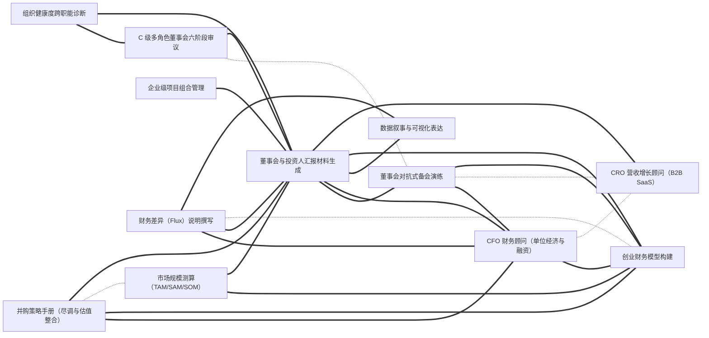

# 技能大典 · Everything Skills

> 一部面向 **AI Agent** 的技能类书。事以类聚，技以互见。
>
> 收录可被 Claude Code / Codex / Cursor / Gemini CLI 等智能体直接加载的 `SKILL.md` 技能包，
> 以中国传统**类书**的「分类 + 互见 + 索引」思想组织，但把实现换成了今天真正能 scale 的形态。

> **一键安装**：在 Claude Code 里运行 `/plugin marketplace add findscripter/everything-skills`，即可浏览、按卷分装 11 个插件。也提供 `AGENTS.md` / `GEMINI.md`（+ `gemini-extension.json`）/ `CLAUDE.md` 同源上下文，供 Codex / Gemini CLI / Cursor 等发现使用。
>
> **中文优先**：全库技能均为中文——这是以英文为主的技能生态里少见的体系化中文技能库。
>
> 本库 1108 条中文技能；另索引 **1386** 个外部 GitHub 技能库（只读 README）。
>
> **English version** — a full English tree mirrors this library 1-to-1 (same `name`, same cross-references) on the [`en`](https://github.com/findscripter/everything-skills/tree/en) branch. Where an upstream English original exists, the English tree **reuses it verbatim** rather than translating back from Chinese (`source` keeps every skill traceable).
>
> **安全与许可**：技能本体是给 Agent 的**指令文本**（非可执行程序）；凡涉及脚本/网络调用的已在各自「注意事项」中标注。本库为精选改编合集，逐条来源与许可见 [INDEX/sources.md](INDEX/sources.md)、总说明见 [LICENSE](LICENSE) / [NOTICE](NOTICE)。

---

## 一图看懂：技能互见图谱（节选）

全库 **1108 条技能、6843 条互见边**。整图无法渲染，这里截取连接最密的一个技能簇示意——
实线 = 依赖(requires)，虚线 = 互见(related)，粗线 = 组合(combines_with)。
**这正是本仓库区别于"平铺列表"的核心：技能不是孤立条目，而是连成网络。**



---

## 这是什么

每一条技能是一个文件夹，里面有一个标准的 `SKILL.md`（带 YAML frontmatter）。
AI Agent 在运行时**读取每条技能的 `description` 字段做匹配**来决定是否加载——
这意味着：

- **发现靠元数据，不靠目录树**。目录是给人类维护者用的；Agent 看的是 frontmatter。
- **一条技能只放一个地方**，跨领域的关联用「互见」字段（`related` / `requires` / `combines_with`）表达成**关系图**，而不是把技能复制到 5 个分类下。
- **索引、目录、互见图谱全部由脚本自动生成**，永不手工维护。

## 技能仓库目录

目前索引 **1386** 个 GitHub 技能库/市场/精选列表。只根据 README 摘要，不收录对方源码、不复制 SKILL.md。

完整分表（含 stars / summary / license）由 `data/skill-repos.jsonl`（及 part 分片）生成，见 **[INDEX/skill-repos.md](INDEX/skill-repos.md)**。本页为归类链接目录。

### 1. 官方与权威（official）（168）

- [`anthropics/skills`](https://github.com/anthropics/skills)
- [`vercel-labs/agent-browser`](https://github.com/vercel-labs/agent-browser)
- [`github/awesome-copilot`](https://github.com/github/awesome-copilot)
- [`anthropics/claude-plugins-official`](https://github.com/anthropics/claude-plugins-official)
- [`anthropics/financial-services`](https://github.com/anthropics/financial-services)
- [`vercel-labs/agent-skills`](https://github.com/vercel-labs/agent-skills)
- [`googleworkspace/cli`](https://github.com/googleworkspace/cli)
- [`vercel-labs/skills`](https://github.com/vercel-labs/skills)
- [`openai/skills`](https://github.com/openai/skills)
- [`agentskills/agentskills`](https://github.com/agentskills/agentskills)
- [`anthropics/knowledge-work-plugins`](https://github.com/anthropics/knowledge-work-plugins)
- [`google/skills`](https://github.com/google/skills)
- [`larksuite/cli`](https://github.com/larksuite/cli)
- [`microsoft/SkillOpt`](https://github.com/microsoft/SkillOpt)
- [`greensock/gsap-skills`](https://github.com/greensock/gsap-skills)
- [`microsoft/playwright-cli`](https://github.com/microsoft/playwright-cli)
- [`huggingface/skills`](https://github.com/huggingface/skills)
- [`anthropics/claude-for-legal`](https://github.com/anthropics/claude-for-legal)
- [`google-labs-code/stitch-skills`](https://github.com/google-labs-code/stitch-skills)
- [`anthropics/defending-code-reference-harness`](https://github.com/anthropics/defending-code-reference-harness)
- [`google/agents-cli`](https://github.com/google/agents-cli)
- [`openai/plugins`](https://github.com/openai/plugins)
- [`dotnet/skills`](https://github.com/dotnet/skills)
- [`OpenSenseNova/SenseNova-Skills`](https://github.com/OpenSenseNova/SenseNova-Skills)
- [`remotion-dev/skills`](https://github.com/remotion-dev/skills)
- [`google-gemini/gemini-skills`](https://github.com/google-gemini/gemini-skills)
- [`browserbase/skills`](https://github.com/browserbase/skills)
- [`anthropics/claude-plugins-community`](https://github.com/anthropics/claude-plugins-community)
- [`NVIDIA/skills`](https://github.com/NVIDIA/skills)
- [`snyk/agent-scan`](https://github.com/snyk/agent-scan)
- [`microsoft/agent-skills`](https://github.com/microsoft/agent-skills)
- [`microsoft/skills`](https://github.com/microsoft/skills)
- [`flutter/agent-plugins`](https://github.com/flutter/agent-plugins)
- [`cloudflare/skills`](https://github.com/cloudflare/skills)
- [`supabase/agent-skills`](https://github.com/supabase/agent-skills)
- [`aws/agent-toolkit-for-aws`](https://github.com/aws/agent-toolkit-for-aws)
- [`expo/skills`](https://github.com/expo/skills)
- [`apify/agent-skills`](https://github.com/apify/agent-skills)
- [`anthropics/commerce-agents`](https://github.com/anthropics/commerce-agents)
- [`WordPress/agent-skills`](https://github.com/WordPress/agent-skills)
- [`figma/mcp-server-guide`](https://github.com/figma/mcp-server-guide)
- [`callstackincubator/agent-skills`](https://github.com/callstackincubator/agent-skills)
- [`microsoft/azure-skills`](https://github.com/microsoft/azure-skills)
- [`mozilla-ai/cq`](https://github.com/mozilla-ai/cq)
- [`langchain-ai/langchain-skills`](https://github.com/langchain-ai/langchain-skills)
- [`TencentCloudBase/CloudBase-AI-Toolkit`](https://github.com/TencentCloudBase/CloudBase-AI-Toolkit)
- [`microsoft/skills-for-fabric`](https://github.com/microsoft/skills-for-fabric)
- [`Kotlin/kotlin-agent-skills`](https://github.com/Kotlin/kotlin-agent-skills)
- [`vercel-labs/next-skills`](https://github.com/vercel-labs/next-skills)
- [`anthropics/launch-your-agent`](https://github.com/anthropics/launch-your-agent)
- [`getsentry/skills`](https://github.com/getsentry/skills)
- [`awslabs/agent-plugins`](https://github.com/awslabs/agent-plugins)
- [`oxylabs/agent-skills`](https://github.com/oxylabs/agent-skills)
- [`hashicorp/agent-skills`](https://github.com/hashicorp/agent-skills)
- [`google/mantis`](https://github.com/google/mantis)
- [`higgsfield-ai/skills`](https://github.com/higgsfield-ai/skills)
- [`microsoft/power-platform-skills`](https://github.com/microsoft/power-platform-skills)
- [`laravel/agent-skills`](https://github.com/laravel/agent-skills)
- [`Unity-Technologies/skills`](https://github.com/Unity-Technologies/skills)
- [`dbt-labs/dbt-agent-skills`](https://github.com/dbt-labs/dbt-agent-skills)
- [`planetscale/database-skills`](https://github.com/planetscale/database-skills)
- [`angular/skills`](https://github.com/angular/skills)
- [`elastic/agent-skills`](https://github.com/elastic/agent-skills)
- [`lightonai/next-plaid`](https://github.com/lightonai/next-plaid)
- [`ClickHouse/agent-skills`](https://github.com/ClickHouse/agent-skills)
- [`posit-dev/skills`](https://github.com/posit-dev/skills)
- [`makenotion/claude-code-notion-plugin`](https://github.com/makenotion/claude-code-notion-plugin)
- [`anthropics/k12-teacher-skills`](https://github.com/anthropics/k12-teacher-skills)
- [`NVIDIA-BioNeMo/bionemo-agent-toolkit`](https://github.com/NVIDIA-BioNeMo/bionemo-agent-toolkit)
- [`elevenlabs/skills`](https://github.com/elevenlabs/skills)
- [`astronomer/agents`](https://github.com/astronomer/agents)
- [`firebase/agent-skills`](https://github.com/firebase/agent-skills)
- [`microsoft/skills-for-copilot-studio`](https://github.com/microsoft/skills-for-copilot-studio)
- [`mckinsey/agents-at-scale-ark`](https://github.com/mckinsey/agents-at-scale-ark)
- [`microsoft/win-dev-skills`](https://github.com/microsoft/win-dev-skills)
- [`getsentry/warden`](https://github.com/getsentry/warden)
- [`TheQtCompanyRnD/agent-skills`](https://github.com/TheQtCompanyRnD/agent-skills)
- [`LambdaTest/agent-skills`](https://github.com/LambdaTest/agent-skills)
- [`amd/skills`](https://github.com/amd/skills)
- [`JetBrains/benjamin-plus-skill`](https://github.com/JetBrains/benjamin-plus-skill)
- [`NVIDIA/nvidia-kaggle`](https://github.com/NVIDIA/nvidia-kaggle)
- [`databricks/databricks-agent-skills`](https://github.com/databricks/databricks-agent-skills)
- [`vercel/vercel-plugin`](https://github.com/vercel/vercel-plugin)
- [`qdrant/skills`](https://github.com/qdrant/skills)
- [`OpenZeppelin/openzeppelin-skills`](https://github.com/OpenZeppelin/openzeppelin-skills)
- [`mongodb/agent-skills`](https://github.com/mongodb/agent-skills)
- [`sanity-io/agent-toolkit`](https://github.com/sanity-io/agent-toolkit)
- [`okx/agent-skills`](https://github.com/okx/agent-skills)
- [`resend/resend-skills`](https://github.com/resend/resend-skills)
- [`coderabbitai/skills`](https://github.com/coderabbitai/skills)
- [`makenotion/skills`](https://github.com/makenotion/skills)
- [`CesiumGS/cesiumjs-skills`](https://github.com/CesiumGS/cesiumjs-skills)
- [`langchain-ai/langsmith-skills`](https://github.com/langchain-ai/langsmith-skills)
- [`adobe/spectrum-design-data`](https://github.com/adobe/spectrum-design-data)
- [`circlefin/skills`](https://github.com/circlefin/skills)
- [`alpacahq/alpaca-skills`](https://github.com/alpacahq/alpaca-skills)
- [`veniceai/skills`](https://github.com/veniceai/skills)
- [`redis/agent-skills`](https://github.com/redis/agent-skills)
- [`remix-run/agent-skills`](https://github.com/remix-run/agent-skills)
- [`coinbase/agentic-wallet-skills`](https://github.com/coinbase/agentic-wallet-skills)
- [`base/skills`](https://github.com/base/skills)
- [`black-forest-labs/skills`](https://github.com/black-forest-labs/skills)
- [`huggingface/pwc-cli`](https://github.com/huggingface/pwc-cli)
- [`clay-run/agent-plugins`](https://github.com/clay-run/agent-plugins)
- [`ComPDFKit/compdf-skills`](https://github.com/ComPDFKit/compdf-skills)
- [`Shopify/claude-for-commerce-examples`](https://github.com/Shopify/claude-for-commerce-examples)
- [`firecrawl/skills`](https://github.com/firecrawl/skills)
- [`GoogleCloudPlatform/cxas-scrapi`](https://github.com/GoogleCloudPlatform/cxas-scrapi)
- [`rstackjs/agent-skills`](https://github.com/rstackjs/agent-skills)
- [`base44/skills`](https://github.com/base44/skills)
- [`apache/magpie`](https://github.com/apache/magpie)
- [`microsoft/aspire-skills`](https://github.com/microsoft/aspire-skills)
- [`resemble-ai/detect-skill`](https://github.com/resemble-ai/detect-skill)
- [`polars-inc/skills`](https://github.com/polars-inc/skills)
- [`zoom/skills`](https://github.com/zoom/skills)
- [`elastic/elastic-docs-skills`](https://github.com/elastic/elastic-docs-skills)
- [`Shopify/agent-skills`](https://github.com/Shopify/agent-skills)
- [`Shopify/ucp-cli`](https://github.com/Shopify/ucp-cli)
- [`Cap-go/capgo-skills`](https://github.com/Cap-go/capgo-skills)
- [`wandb/skills`](https://github.com/wandb/skills)
- [`contentful/skill-kit`](https://github.com/contentful/skill-kit)
- [`Bria-AI/bria-skill`](https://github.com/Bria-AI/bria-skill)
- [`califio/skills`](https://github.com/califio/skills)
- [`motherduckdb/agent-skills`](https://github.com/motherduckdb/agent-skills)
- [`replicate/skills`](https://github.com/replicate/skills)
- [`confluentinc/agent-skills`](https://github.com/confluentinc/agent-skills)
- [`prisma/skills`](https://github.com/prisma/skills)
- [`huggingface/transformers-to-mlx`](https://github.com/huggingface/transformers-to-mlx)
- [`microsoft/dataverse-business-skills`](https://github.com/microsoft/dataverse-business-skills)
- [`auth0/agent-skills`](https://github.com/auth0/agent-skills)
- [`publora/skills`](https://github.com/publora/skills)
- [`microsoft/power-cat-skills`](https://github.com/microsoft/power-cat-skills)
- [`microsoft/azure-devops-skills`](https://github.com/microsoft/azure-devops-skills)
- [`cypress-io/ai-toolkit`](https://github.com/cypress-io/ai-toolkit)
- [`quark-clouddrive/quarkclouddrive_offical`](https://github.com/quark-clouddrive/quarkclouddrive_offical)
- [`microsoft/agent365-skills`](https://github.com/microsoft/agent365-skills)
- [`netlify/context-and-tools`](https://github.com/netlify/context-and-tools)
- [`NVIDIA/nurec-skills`](https://github.com/NVIDIA/nurec-skills)
- [`JetBrains/phpstorm-claude-marketplace`](https://github.com/JetBrains/phpstorm-claude-marketplace)
- [`Shopify/liquid-skills`](https://github.com/Shopify/liquid-skills)
- [`AtlasCloudAI/atlas-cloud-skills`](https://github.com/AtlasCloudAI/atlas-cloud-skills)
- [`neondatabase/postgres-skills`](https://github.com/neondatabase/postgres-skills)
- [`huggingface/s2-cli`](https://github.com/huggingface/s2-cli)
- [`metalbear-co/skills`](https://github.com/metalbear-co/skills)
- [`awslabs/hcls-agent-skills`](https://github.com/awslabs/hcls-agent-skills)
- [`helius-labs/core-ai`](https://github.com/helius-labs/core-ai)
- [`Starchild-ai-agent/official-skills`](https://github.com/Starchild-ai-agent/official-skills)
- [`atlassian/forge-skills`](https://github.com/atlassian/forge-skills)
- [`huggingface/physics-intern-skills`](https://github.com/huggingface/physics-intern-skills)
- [`cashfree/agent-skills`](https://github.com/cashfree/agent-skills)
- [`JetBrains/rider-skills`](https://github.com/JetBrains/rider-skills)
- [`powersync-ja/agent-skills`](https://github.com/powersync-ja/agent-skills)
- [`awslabs/startups`](https://github.com/awslabs/startups)
- [`Hashnode/gql-skill`](https://github.com/Hashnode/gql-skill)
- [`nocodb/agent-skills`](https://github.com/nocodb/agent-skills)
- [`PSPDFKit-labs/nutrient-agent-skill`](https://github.com/PSPDFKit-labs/nutrient-agent-skill)
- [`elastic/integration-skills`](https://github.com/elastic/integration-skills)
- [`trycourier/courier-skills`](https://github.com/trycourier/courier-skills)
- [`Tencent-RTC/agent-skills`](https://github.com/Tencent-RTC/agent-skills)
- [`webull-inc/webull-openapi-skills`](https://github.com/webull-inc/webull-openapi-skills)
- [`2ChatCo/agent-skills`](https://github.com/2ChatCo/agent-skills)
- [`exasol-labs/exasol-agent-skills`](https://github.com/exasol-labs/exasol-agent-skills)
- [`mailtrap/mailtrap-skills`](https://github.com/mailtrap/mailtrap-skills)
- [`NVIDIA/digital-health-skills`](https://github.com/NVIDIA/digital-health-skills)
- [`coinpaprika/skills`](https://github.com/coinpaprika/skills)
- [`microsoft/teams-platform-skills`](https://github.com/microsoft/teams-platform-skills)
- [`microsoft/code-optimizations-skills`](https://github.com/microsoft/code-optimizations-skills)
- [`transloadit/skills`](https://github.com/transloadit/skills)

### 2. 精选列表 / 大集合（collections）（315）

- [`ComposioHQ/awesome-claude-skills`](https://github.com/ComposioHQ/awesome-claude-skills)
- [`santifer/career-ops`](https://github.com/santifer/career-ops)
- [`hesreallyhim/awesome-claude-code`](https://github.com/hesreallyhim/awesome-claude-code)
- [`VoltAgent/awesome-openclaw-skills`](https://github.com/VoltAgent/awesome-openclaw-skills)
- [`Imbad0202/academic-research-skills`](https://github.com/Imbad0202/academic-research-skills)
- [`sickn33/agentic-awesome-skills`](https://github.com/sickn33/agentic-awesome-skills)
- [`Yuan1z0825/nature-skills`](https://github.com/Yuan1z0825/nature-skills)
- [`VoltAgent/awesome-claude-skills`](https://github.com/VoltAgent/awesome-claude-skills)
- [`VoltAgent/awesome-agent-skills`](https://github.com/VoltAgent/awesome-agent-skills)
- [`alchaincyf/nuwa-skill`](https://github.com/alchaincyf/nuwa-skill)
- [`freestylefly/awesome-gpt-image-2`](https://github.com/freestylefly/awesome-gpt-image-2)
- [`Donchitos/Claude-Code-Game-Studios`](https://github.com/Donchitos/Claude-Code-Game-Studios)
- [`VoltAgent/awesome-claude-code-subagents`](https://github.com/VoltAgent/awesome-claude-code-subagents)
- [`composio-community/awesome-codex-skills`](https://github.com/composio-community/awesome-codex-skills)
- [`travisvn/awesome-claude-skills`](https://github.com/travisvn/awesome-claude-skills)
- [`ConardLi/garden-skills`](https://github.com/ConardLi/garden-skills)
- [`alchaincyf/zhangxuefeng-skill`](https://github.com/alchaincyf/zhangxuefeng-skill)
- [`BehiSecc/awesome-claude-skills`](https://github.com/BehiSecc/awesome-claude-skills)
- [`ykdojo/claude-code-tips`](https://github.com/ykdojo/claude-code-tips)
- [`nexu-io/html-anything`](https://github.com/nexu-io/html-anything)
- [`PleasePrompto/notebooklm-skill`](https://github.com/PleasePrompto/notebooklm-skill)
- [`NomaDamas/k-skill`](https://github.com/NomaDamas/k-skill)
- [`zenstory-ai/oh-story-claudecode`](https://github.com/zenstory-ai/oh-story-claudecode)
- [`heilcheng/awesome-agent-skills`](https://github.com/heilcheng/awesome-agent-skills)
- [`anbeime/skill`](https://github.com/anbeime/skill)
- [`alchaincyf/darwin-skill`](https://github.com/alchaincyf/darwin-skill)
- [`browser-act/skills`](https://github.com/browser-act/skills)
- [`0xNyk/awesome-hermes-agent`](https://github.com/0xNyk/awesome-hermes-agent)
- [`epoko77-ai/im-not-ai`](https://github.com/epoko77-ai/im-not-ai)
- [`libukai/awesome-agent-skills`](https://github.com/libukai/awesome-agent-skills)
- [`jakubkrehel/skills`](https://github.com/jakubkrehel/skills)
- [`BuilderIO/skills`](https://github.com/BuilderIO/skills)
- [`conorbronsdon/avoid-ai-writing`](https://github.com/conorbronsdon/avoid-ai-writing)
- [`dmmulroy/anti-slop`](https://github.com/dmmulroy/anti-slop)
- [`nyldn/claude-octopus`](https://github.com/nyldn/claude-octopus)
- [`Dimillian/Skills`](https://github.com/Dimillian/Skills)
- [`davidondrej/skills`](https://github.com/davidondrej/skills)
- [`sanyuan0704/sanyuan-skills`](https://github.com/sanyuan0704/sanyuan-skills)
- [`liustack/modlens`](https://github.com/liustack/modlens)
- [`tmstack/awesome-persona-skills`](https://github.com/tmstack/awesome-persona-skills)
- [`brycewang-stanford/Auto-Empirical-Research-Skills`](https://github.com/brycewang-stanford/Auto-Empirical-Research-Skills)
- [`nowork-studio/NotFair`](https://github.com/nowork-studio/NotFair)
- [`Hisn00w/ASu-skills`](https://github.com/Hisn00w/ASu-skills)
- [`foryourhealth111-pixel/Vibe-Skills`](https://github.com/foryourhealth111-pixel/Vibe-Skills)
- [`eracle/OpenOutreach`](https://github.com/eracle/OpenOutreach)
- [`rohitg00/pro-workflow`](https://github.com/rohitg00/pro-workflow)
- [`addyosmani/web-quality-skills`](https://github.com/addyosmani/web-quality-skills)
- [`jeremylongshore/claude-code-plugins-plus-skills`](https://github.com/jeremylongshore/claude-code-plugins-plus-skills)
- [`cocoindex-io/cocoindex-code`](https://github.com/cocoindex-io/cocoindex-code)
- [`jeremylongshore/tons-of-skills-marketplace`](https://github.com/jeremylongshore/tons-of-skills-marketplace)
- [`ciembor/agent-rules-books`](https://github.com/ciembor/agent-rules-books)
- [`bergside/awesome-design-skills`](https://github.com/bergside/awesome-design-skills)
- [`twostraws/Swift-Agent-Skills`](https://github.com/twostraws/Swift-Agent-Skills)
- [`AMAP-ML/SkillClaw`](https://github.com/AMAP-ML/SkillClaw)
- [`softaworks/agent-toolkit`](https://github.com/softaworks/agent-toolkit)
- [`mrgoonie/claudekit-skills`](https://github.com/mrgoonie/claudekit-skills)
- [`LeoYeAI/openclaw-master-skills`](https://github.com/LeoYeAI/openclaw-master-skills)
- [`Paramchoudhary/ResumeSkills`](https://github.com/Paramchoudhary/ResumeSkills)
- [`GuDaStudio/skills`](https://github.com/GuDaStudio/skills)
- [`awesome-skills/code-review-skill`](https://github.com/awesome-skills/code-review-skill)
- [`bergside/typeui.sh`](https://github.com/bergside/typeui.sh)
- [`ReScienceLab/opc-skills`](https://github.com/ReScienceLab/opc-skills)
- [`Alisa0808/vox-director`](https://github.com/Alisa0808/vox-director)
- [`Prat011/awesome-llm-skills`](https://github.com/Prat011/awesome-llm-skills)
- [`zenstory-ai/drama-skills`](https://github.com/zenstory-ai/drama-skills)
- [`qufei1993/skills-hub`](https://github.com/qufei1993/skills-hub)
- [`dvdsgl/claude-canvas`](https://github.com/dvdsgl/claude-canvas)
- [`rohitg00/skillkit`](https://github.com/rohitg00/skillkit)
- [`alchaincyf/huashu-skills`](https://github.com/alchaincyf/huashu-skills)
- [`hyhmrright/brooks-lint`](https://github.com/hyhmrright/brooks-lint)
- [`CloudAI-X/claude-workflow-v2`](https://github.com/CloudAI-X/claude-workflow-v2)
- [`tjboudreaux/cc-thinking-skills`](https://github.com/tjboudreaux/cc-thinking-skills)
- [`cbrock84/headcount`](https://github.com/cbrock84/headcount)
- [`obra/superpowers-marketplace`](https://github.com/obra/superpowers-marketplace)
- [`irinabuht12-oss/marketing-skills`](https://github.com/irinabuht12-oss/marketing-skills)
- [`gooseworks-ai/goose-skills`](https://github.com/gooseworks-ai/goose-skills)
- [`GanyuanRan/Aegis`](https://github.com/GanyuanRan/Aegis)
- [`JuliusBrussee/blueprint`](https://github.com/JuliusBrussee/blueprint)
- [`MoizIbnYousaf/ai-agent-skills`](https://github.com/MoizIbnYousaf/ai-agent-skills)
- [`openclaw/agent-skills`](https://github.com/openclaw/agent-skills)
- [`dpearson2699/swift-ios-skills`](https://github.com/dpearson2699/swift-ios-skills)
- [`abubakarsiddik31/claude-skills-collection`](https://github.com/abubakarsiddik31/claude-skills-collection)
- [`brycewang-stanford/Awesome-Journal-Skills`](https://github.com/brycewang-stanford/Awesome-Journal-Skills)
- [`numman-ali/n-skills`](https://github.com/numman-ali/n-skills)
- [`jezweb/claude-skills`](https://github.com/jezweb/claude-skills)
- [`kostja94/marketing-skills`](https://github.com/kostja94/marketing-skills)
- [`new-silvermoon/awesome-android-agent-skills`](https://github.com/new-silvermoon/awesome-android-agent-skills)
- [`bear2u/my-skills`](https://github.com/bear2u/my-skills)
- [`ferdinandobons/startup-skill`](https://github.com/ferdinandobons/startup-skill)
- [`hashgraph-online/awesome-codex-plugins`](https://github.com/hashgraph-online/awesome-codex-plugins)
- [`sergebulaev/linkedin-skills`](https://github.com/sergebulaev/linkedin-skills)
- [`figma/community-resources`](https://github.com/figma/community-resources)
- [`laolaoshiren/claude-code-skills-zh`](https://github.com/laolaoshiren/claude-code-skills-zh)
- [`rampstackco/claude-skills`](https://github.com/rampstackco/claude-skills)
- [`gamedev-skills/awesome-gamedev-agent-skills`](https://github.com/gamedev-skills/awesome-gamedev-agent-skills)
- [`scottstts/Threejs-Awesome-Graphics-Agent-Skills`](https://github.com/scottstts/Threejs-Awesome-Graphics-Agent-Skills)
- [`vshulcz/deja-vu`](https://github.com/vshulcz/deja-vu)
- [`coreyhaines31/makerskills`](https://github.com/coreyhaines31/makerskills)
- [`ZeroPointRepo/youtube-skills`](https://github.com/ZeroPointRepo/youtube-skills)
- [`spencerpauly/awesome-cursor-skills`](https://github.com/spencerpauly/awesome-cursor-skills)
- [`realkimbarrett/advertising-skills`](https://github.com/realkimbarrett/advertising-skills)
- [`dongshuyan/compass-skills`](https://github.com/dongshuyan/compass-skills)
- [`staruhub/ClaudeSkills`](https://github.com/staruhub/ClaudeSkills)
- [`borghei/Claude-Skills`](https://github.com/borghei/Claude-Skills)
- [`Appllama/appllama-skills`](https://github.com/Appllama/appllama-skills)
- [`shinpr/claude-code-workflows`](https://github.com/shinpr/claude-code-workflows)
- [`lawve-ai/awesome-legal-skills`](https://github.com/lawve-ai/awesome-legal-skills)
- [`skillmatic-ai/awesome-agent-skills`](https://github.com/skillmatic-ai/awesome-agent-skills)
- [`partme-ai/full-stack-skills`](https://github.com/partme-ai/full-stack-skills)
- [`Affitor/affiliate-skills`](https://github.com/Affitor/affiliate-skills)
- [`JackyST0/awesome-agent-skills`](https://github.com/JackyST0/awesome-agent-skills)
- [`nexscope-ai/Amazon-Skills`](https://github.com/nexscope-ai/Amazon-Skills)
- [`pedronauck/skills`](https://github.com/pedronauck/skills)
- [`TexasBedouin/vibe-check`](https://github.com/TexasBedouin/vibe-check)
- [`momozi1996/awesome-ai-persona-skills`](https://github.com/momozi1996/awesome-ai-persona-skills)
- [`levnikolaevich/claude-code-skills`](https://github.com/levnikolaevich/claude-code-skills)
- [`hashgraph-online/hol-guard`](https://github.com/hashgraph-online/hol-guard)
- [`karanb192/awesome-claude-skills`](https://github.com/karanb192/awesome-claude-skills)
- [`ZeroPointRepo/awesome-hermes-skills`](https://github.com/ZeroPointRepo/awesome-hermes-skills)
- [`trailofbits/skills-curated`](https://github.com/trailofbits/skills-curated)
- [`mxyhi/ok-skills`](https://github.com/mxyhi/ok-skills)
- [`coleam00/skills`](https://github.com/coleam00/skills)
- [`coffeefuelbump/csv-data-summarizer-claude-skill`](https://github.com/coffeefuelbump/csv-data-summarizer-claude-skill)
- [`helloianneo/awesome-claude-code-skills`](https://github.com/helloianneo/awesome-claude-code-skills)
- [`claude-office-skills/skills`](https://github.com/claude-office-skills/skills)
- [`freestylefly/canghe-skills`](https://github.com/freestylefly/canghe-skills)
- [`bencium/bencium-marketplace`](https://github.com/bencium/bencium-marketplace)
- [`sanjay3290/ai-skills`](https://github.com/sanjay3290/ai-skills)
- [`aiskillstore/marketplace`](https://github.com/aiskillstore/marketplace)
- [`marimo-team/marimo-pair`](https://github.com/marimo-team/marimo-pair)
- [`Context-Engine-AI/Context-Engine`](https://github.com/Context-Engine-AI/Context-Engine)
- [`jnMetaCode/ai-shortfilm-prompts`](https://github.com/jnMetaCode/ai-shortfilm-prompts)
- [`redfox-data/redfox-community`](https://github.com/redfox-data/redfox-community)
- [`glebis/claude-skills`](https://github.com/glebis/claude-skills)
- [`LinklyAI/best-skills`](https://github.com/LinklyAI/best-skills)
- [`nuwa-skills/awesome-nuwa`](https://github.com/nuwa-skills/awesome-nuwa)
- [`JetBrains/skills`](https://github.com/JetBrains/skills)
- [`fleurytian/awesome-claude-skills`](https://github.com/fleurytian/awesome-claude-skills)
- [`inhouseseo/superseo-skills`](https://github.com/inhouseseo/superseo-skills)
- [`intellectronica/agent-skills`](https://github.com/intellectronica/agent-skills)
- [`ohad6k/emulo`](https://github.com/ohad6k/emulo)
- [`OneWave-AI/claude-skills`](https://github.com/OneWave-AI/claude-skills)
- [`ilyautov/humanizer-ru`](https://github.com/ilyautov/humanizer-ru)
- [`Aperivue/medsci-skills`](https://github.com/Aperivue/medsci-skills)
- [`niaka3dayo/agent-skills-vrc-udon`](https://github.com/niaka3dayo/agent-skills-vrc-udon)
- [`lijigang/ljg-skill-roundtable`](https://github.com/lijigang/ljg-skill-roundtable)
- [`lingxling/awesome-skills-cn`](https://github.com/lingxling/awesome-skills-cn)
- [`majiayu000/spellbook`](https://github.com/majiayu000/spellbook)
- [`squirrelscan/squirrelscan`](https://github.com/squirrelscan/squirrelscan)
- [`tlehman/litprog-skill`](https://github.com/tlehman/litprog-skill)
- [`futantan/agent-skills.md`](https://github.com/futantan/agent-skills.md)
- [`michael-denyer/pstack-claude`](https://github.com/michael-denyer/pstack-claude)
- [`testdouble/han`](https://github.com/testdouble/han)
- [`apify/awesome-skills`](https://github.com/apify/awesome-skills)
- [`BZDmathclub/bzd-math-modeling-skills`](https://github.com/BZDmathclub/bzd-math-modeling-skills)
- [`human-avatar/skills-for-humanity`](https://github.com/human-avatar/skills-for-humanity)
- [`talkstream/ru-text`](https://github.com/talkstream/ru-text)
- [`Dominic789654/awesome-deepseek-harness`](https://github.com/Dominic789654/awesome-deepseek-harness)
- [`taisly/agent`](https://github.com/taisly/agent)
- [`ttfake92-lab/skills`](https://github.com/ttfake92-lab/skills)
- [`secondsky/claude-skills`](https://github.com/secondsky/claude-skills)
- [`deckardger/tanstack-agent-skills`](https://github.com/deckardger/tanstack-agent-skills)
- [`fewwwww/awesome-web3-skills`](https://github.com/fewwwww/awesome-web3-skills)
- [`finfin/awesome-frontend-skills`](https://github.com/finfin/awesome-frontend-skills)
- [`naodeng/awesome-qa-skills`](https://github.com/naodeng/awesome-qa-skills)
- [`w95/awesome-claude-corporate-skills`](https://github.com/w95/awesome-claude-corporate-skills)
- [`artwist-polyakov/polyakov-claude-skills`](https://github.com/artwist-polyakov/polyakov-claude-skills)
- [`GetBindu/awesome-claude-code-and-skills`](https://github.com/GetBindu/awesome-claude-code-and-skills)
- [`itgoyo/awesome-agent-skills`](https://github.com/itgoyo/awesome-agent-skills)
- [`smixs/creative-director-skill`](https://github.com/smixs/creative-director-skill)
- [`AtlasCloudAI/awesome-seedance-2.5-prompts-skills`](https://github.com/AtlasCloudAI/awesome-seedance-2.5-prompts-skills)
- [`Epsilon617/Codex-Academic-Skills`](https://github.com/Epsilon617/Codex-Academic-Skills)
- [`yan-labs/yan-skills`](https://github.com/yan-labs/yan-skills)
- [`seb1n/awesome-ai-agent-skills`](https://github.com/seb1n/awesome-ai-agent-skills)
- [`BioTender-max/awesome-bio-agent-skills`](https://github.com/BioTender-max/awesome-bio-agent-skills)
- [`JayZeeDesign/awesome-claude-skills`](https://github.com/JayZeeDesign/awesome-claude-skills)
- [`gaasher/Agent-Loop-Skills`](https://github.com/gaasher/Agent-Loop-Skills)
- [`rand/cc-polymath`](https://github.com/rand/cc-polymath)
- [`dfkai/xtquantai`](https://github.com/dfkai/xtquantai)
- [`smerchek/claude-epub-skill`](https://github.com/smerchek/claude-epub-skill)
- [`swyxio/skills`](https://github.com/swyxio/skills)
- [`Gerstep/HumanCompiler`](https://github.com/Gerstep/HumanCompiler)
- [`pattern-ai-labs/agentcall`](https://github.com/pattern-ai-labs/agentcall)
- [`gokapso/agent-skills`](https://github.com/gokapso/agent-skills)
- [`firecrawl/firecrawl-workflows`](https://github.com/firecrawl/firecrawl-workflows)
- [`oaustegard/claude-skills`](https://github.com/oaustegard/claude-skills)
- [`TerminalSkills/skills`](https://github.com/TerminalSkills/skills)
- [`marmbiz/humanizer-de`](https://github.com/marmbiz/humanizer-de)
- [`Cassette-Editor/oh-my-cassette`](https://github.com/Cassette-Editor/oh-my-cassette)
- [`jMerta/codex-skills`](https://github.com/jMerta/codex-skills)
- [`JasonColapietro/suede-creator-skills`](https://github.com/JasonColapietro/suede-creator-skills)
- [`MohamedAbdallah-14/unslop`](https://github.com/MohamedAbdallah-14/unslop)
- [`sandbaseai/sandbase-skills`](https://github.com/sandbaseai/sandbase-skills)
- [`Vladimir-Human/humanizer-ru`](https://github.com/Vladimir-Human/humanizer-ru)
- [`TheGoat395/Codex-Skills`](https://github.com/TheGoat395/Codex-Skills)
- [`wrsmith108/linear-claude-skill`](https://github.com/wrsmith108/linear-claude-skill)
- [`mathbullet/skills`](https://github.com/mathbullet/skills)
- [`promptadvisers/claudex`](https://github.com/promptadvisers/claudex)
- [`infranodus/skills`](https://github.com/infranodus/skills)
- [`Yila-AI/awesome-research-skills`](https://github.com/Yila-AI/awesome-research-skills)
- [`beefiker/superloopy`](https://github.com/beefiker/superloopy)
- [`numman-ali/zai-cli`](https://github.com/numman-ali/zai-cli)
- [`Necmttn/ax`](https://github.com/Necmttn/ax)
- [`mblode/agent-skills`](https://github.com/mblode/agent-skills)
- [`GoekeLab/awesome-genomic-skills`](https://github.com/GoekeLab/awesome-genomic-skills)
- [`Kevin7Qi/codex-collab`](https://github.com/Kevin7Qi/codex-collab)
- [`omkamal/pypict-claude-skill`](https://github.com/omkamal/pypict-claude-skill)
- [`agentrhq/authsome`](https://github.com/agentrhq/authsome)
- [`vasilyu1983/AI-Agents-public`](https://github.com/vasilyu1983/AI-Agents-public)
- [`RankSpotAI/awesome-seo-agent-skills`](https://github.com/RankSpotAI/awesome-seo-agent-skills)
- [`neondatabase/agent-skills`](https://github.com/neondatabase/agent-skills)
- [`michtio/craftcms-claude-skills`](https://github.com/michtio/craftcms-claude-skills)
- [`Gingiris-1031/gingiris-skills`](https://github.com/Gingiris-1031/gingiris-skills)
- [`ogulcancelik/agent-skills`](https://github.com/ogulcancelik/agent-skills)
- [`sneg55/agent-starter`](https://github.com/sneg55/agent-starter)
- [`fabricioctelles/skills`](https://github.com/fabricioctelles/skills)
- [`justincasher/lean-explore`](https://github.com/justincasher/lean-explore)
- [`eze-is/eze-skills`](https://github.com/eze-is/eze-skills)
- [`fvadicamo/dev-agent-skills`](https://github.com/fvadicamo/dev-agent-skills)
- [`fei0810/bear-research-skills`](https://github.com/fei0810/bear-research-skills)
- [`thrixel/build-world`](https://github.com/thrixel/build-world)
- [`PaulRBerg/agent-skills`](https://github.com/PaulRBerg/agent-skills)
- [`magnus919/agent-skills`](https://github.com/magnus919/agent-skills)
- [`LOGIN-TB/claude-skills`](https://github.com/LOGIN-TB/claude-skills)
- [`Jamie-BitFlight/claude_skills`](https://github.com/Jamie-BitFlight/claude_skills)
- [`k-kolomeitsev/data-structure-protocol`](https://github.com/k-kolomeitsev/data-structure-protocol)
- [`Mann1988/awesome-claude-skills`](https://github.com/Mann1988/awesome-claude-skills)
- [`nota-america/forgecat-agent-profiles`](https://github.com/nota-america/forgecat-agent-profiles)
- [`wendylabsinc/claude-skills`](https://github.com/wendylabsinc/claude-skills)
- [`laguagu/claude-code-nextjs-skills`](https://github.com/laguagu/claude-code-nextjs-skills)
- [`terrylica/cc-skills`](https://github.com/terrylica/cc-skills)
- [`BENZEMA216/awesome-weread`](https://github.com/BENZEMA216/awesome-weread)
- [`zeroclaw-labs/zeroclaw-skills`](https://github.com/zeroclaw-labs/zeroclaw-skills)
- [`palmier-io/palmier-skills`](https://github.com/palmier-io/palmier-skills)
- [`open-fox/agents`](https://github.com/open-fox/agents)
- [`takechanman1228/claude-persona`](https://github.com/takechanman1228/claude-persona)
- [`LeeJuOh/claude-code-zero`](https://github.com/LeeJuOh/claude-code-zero)
- [`agentbay-ai/agentbay-skills`](https://github.com/agentbay-ai/agentbay-skills)
- [`Kanevry/session-orchestrator`](https://github.com/Kanevry/session-orchestrator)
- [`richkuo/rk-skills`](https://github.com/richkuo/rk-skills)
- [`avenoxai/avenoxskills`](https://github.com/avenoxai/avenoxskills)
- [`huangwb8/skills`](https://github.com/huangwb8/skills)
- [`adrianpuiu/specification-document-generator`](https://github.com/adrianpuiu/specification-document-generator)
- [`belumume/claude-skills`](https://github.com/belumume/claude-skills)
- [`xmm/codex-bmad-skills`](https://github.com/xmm/codex-bmad-skills)
- [`massimodeluisa/recursive-decomposition-skill`](https://github.com/massimodeluisa/recursive-decomposition-skill)
- [`gbasin/stress-test-skill`](https://github.com/gbasin/stress-test-skill)
- [`ericwang915/PythonClaw`](https://github.com/ericwang915/PythonClaw)
- [`naderelewa/Product-to-Prod`](https://github.com/naderelewa/Product-to-Prod)
- [`terryso/claude-bmad-skills`](https://github.com/terryso/claude-bmad-skills)
- [`J-nowcow/awesome-korean-agent-skills`](https://github.com/J-nowcow/awesome-korean-agent-skills)
- [`frankxai/claude-skills-library`](https://github.com/frankxai/claude-skills-library)
- [`OpenLinkSoftware/ai-agent-skills`](https://github.com/OpenLinkSoftware/ai-agent-skills)
- [`Agents365-ai/365-skills`](https://github.com/Agents365-ai/365-skills)
- [`agentskillexchange/skills`](https://github.com/agentskillexchange/skills)
- [`yujiachen-y/codebase-recon-skill`](https://github.com/yujiachen-y/codebase-recon-skill)
- [`awrshift/claude-memory-kit`](https://github.com/awrshift/claude-memory-kit)
- [`camoa/claude-skills`](https://github.com/camoa/claude-skills)
- [`iliaal/whetstone`](https://github.com/iliaal/whetstone)
- [`linny006/awesome-agent-skills`](https://github.com/linny006/awesome-agent-skills)
- [`kesslernity/awesome-copilot-cowork-skills`](https://github.com/kesslernity/awesome-copilot-cowork-skills)
- [`kreuzberg-dev/plugins`](https://github.com/kreuzberg-dev/plugins)
- [`aktsmm/Agent-Skills`](https://github.com/aktsmm/Agent-Skills)
- [`freenet/freenet-agent-skills`](https://github.com/freenet/freenet-agent-skills)
- [`songgoldenwind-crypto/liuyao-skills`](https://github.com/songgoldenwind-crypto/liuyao-skills)
- [`shajith003/awesome-claude-skills`](https://github.com/shajith003/awesome-claude-skills)
- [`agents-inc/skills`](https://github.com/agents-inc/skills)
- [`JamalMohafil/claude-skills`](https://github.com/JamalMohafil/claude-skills)
- [`vinnie357/claude-skills`](https://github.com/vinnie357/claude-skills)
- [`flaqai/awesome_codex_skills`](https://github.com/flaqai/awesome_codex_skills)
- [`felvieira/claude-skills-fv`](https://github.com/felvieira/claude-skills-fv)
- [`gohypergiant/agent-skills`](https://github.com/gohypergiant/agent-skills)
- [`codejunkie99/x-article-skills`](https://github.com/codejunkie99/x-article-skills)
- [`Ezra144israel/governed-agent-skills`](https://github.com/Ezra144israel/governed-agent-skills)
- [`lidge-jun/codexclaw`](https://github.com/lidge-jun/codexclaw)
- [`ConnorGriffin/skills`](https://github.com/ConnorGriffin/skills)
- [`j4flmao/agent-skills`](https://github.com/j4flmao/agent-skills)
- [`ommakes/Skills`](https://github.com/ommakes/Skills)
- [`Sendmux/skills`](https://github.com/Sendmux/skills)
- [`dubzeb/awesome-gemini-spark-prompts`](https://github.com/dubzeb/awesome-gemini-spark-prompts)
- [`Soushi888/holochain-agent-skills`](https://github.com/Soushi888/holochain-agent-skills)
- [`fortunto2/solo-factory`](https://github.com/fortunto2/solo-factory)
- [`martinholovsky/SOTA-skills`](https://github.com/martinholovsky/SOTA-skills)
- [`mhylle/claude-skills-collection`](https://github.com/mhylle/claude-skills-collection)
- [`paulnsorensen/easy-cheese`](https://github.com/paulnsorensen/easy-cheese)
- [`zaidmukaddam/skills`](https://github.com/zaidmukaddam/skills)
- [`junminhong/awesome-agent-skills`](https://github.com/junminhong/awesome-agent-skills)
- [`philipbankier/awesome-agent-skills`](https://github.com/philipbankier/awesome-agent-skills)
- [`ProxiBlue/claude-skills`](https://github.com/ProxiBlue/claude-skills)
- [`Unknown-333/awesome-data-engineering-skills`](https://github.com/Unknown-333/awesome-data-engineering-skills)
- [`ulises-jeremias/agent-toolkit`](https://github.com/ulises-jeremias/agent-toolkit)
- [`vladimirrott/claude-math`](https://github.com/vladimirrott/claude-math)
- [`minsooparkk/budongsan-skills`](https://github.com/minsooparkk/budongsan-skills)
- [`mirkobozzetto/arsenal`](https://github.com/mirkobozzetto/arsenal)
- [`abagames/agentic-gamedev-skills`](https://github.com/abagames/agentic-gamedev-skills)
- [`alebgl77/claude-inc`](https://github.com/alebgl77/claude-inc)
- [`Bikach/skills-claude-code`](https://github.com/Bikach/skills-claude-code)
- [`dreamers-laboratory/useful-skills-playbook`](https://github.com/dreamers-laboratory/useful-skills-playbook)
- [`GiaSip/giasip-skills`](https://github.com/GiaSip/giasip-skills)
- [`MindGoblinStudios/grim-tome`](https://github.com/MindGoblinStudios/grim-tome)
- [`mthines/agent-skills`](https://github.com/mthines/agent-skills)
- [`62656456/ai-film-skills`](https://github.com/62656456/ai-film-skills)
- [`ai-shifu/skills`](https://github.com/ai-shifu/skills)
- [`aka-kika/akakika-skills`](https://github.com/aka-kika/akakika-skills)
- [`fdiblen/rseng-agent-skills`](https://github.com/fdiblen/rseng-agent-skills)
- [`timwukp/agent-skills-best-practice`](https://github.com/timwukp/agent-skills-best-practice)
- [`carlymr/carlys-claude-skills`](https://github.com/carlymr/carlys-claude-skills)
- [`adeonir/agent-skills`](https://github.com/adeonir/agent-skills)
- [`kevin-burns/claude-skills`](https://github.com/kevin-burns/claude-skills)
- [`khasky/awesome-agent-skills`](https://github.com/khasky/awesome-agent-skills)
- [`neomjs/neo-agent-skills`](https://github.com/neomjs/neo-agent-skills)
- [`Olshansk/agent-skills`](https://github.com/Olshansk/agent-skills)
- [`Bang-isme/CodexAI---Skills`](https://github.com/Bang-isme/CodexAI---Skills)
- [`kevinaimonster/skill-hub`](https://github.com/kevinaimonster/skill-hub)
- [`flowkit-labs/skills`](https://github.com/flowkit-labs/skills)

### 3. 垂直领域技能包（vertical）（683）

- [`obra/superpowers`](https://github.com/obra/superpowers)
- [`affaan-m/ECC`](https://github.com/affaan-m/ECC)
- [`mattpocock/skills`](https://github.com/mattpocock/skills)
- [`addyosmani/agent-skills`](https://github.com/addyosmani/agent-skills)
- [`hugohe3/ppt-master`](https://github.com/hugohe3/ppt-master)
- [`kepano/obsidian-skills`](https://github.com/kepano/obsidian-skills)
- [`coreyhaines31/marketingskills`](https://github.com/coreyhaines31/marketingskills)
- [`K-Dense-AI/claude-scientific-skills`](https://github.com/K-Dense-AI/claude-scientific-skills)
- [`K-Dense-AI/scientific-agent-skills`](https://github.com/K-Dense-AI/scientific-agent-skills)
- [`wshobson/agents`](https://github.com/wshobson/agents)
- [`emilkowalski/skills`](https://github.com/emilkowalski/skills)
- [`zarazhangrui/frontend-slides`](https://github.com/zarazhangrui/frontend-slides)
- [`virgiliojr94/book-to-skill`](https://github.com/virgiliojr94/book-to-skill)
- [`ayghri/i-have-adhd`](https://github.com/ayghri/i-have-adhd)
- [`phuryn/pm-skills`](https://github.com/phuryn/pm-skills)
- [`JimLiu/baoyu-skills`](https://github.com/JimLiu/baoyu-skills)
- [`alirezarezvani/claude-skills`](https://github.com/alirezarezvani/claude-skills)
- [`EveryInc/compound-engineering-plugin`](https://github.com/EveryInc/compound-engineering-plugin)
- [`titanwings/distilly`](https://github.com/titanwings/distilly)
- [`alchaincyf/huashu-design`](https://github.com/alchaincyf/huashu-design)
- [`KKKKhazix/khazix-skills`](https://github.com/KKKKhazix/khazix-skills)
- [`teng-lin/notebooklm-py`](https://github.com/teng-lin/notebooklm-py)
- [`op7418/Humanizer-zh`](https://github.com/op7418/Humanizer-zh)
- [`AgriciDaniel/claude-seo`](https://github.com/AgriciDaniel/claude-seo)
- [`wanshuiyin/Auto-claude-code-research-in-sleep`](https://github.com/wanshuiyin/Auto-claude-code-research-in-sleep)
- [`AgriciDaniel/claude-obsidian`](https://github.com/AgriciDaniel/claude-obsidian)
- [`Orchestra-Research/AI-Research-SKILLs`](https://github.com/Orchestra-Research/AI-Research-SKILLs)
- [`Jeffallan/claude-skills`](https://github.com/Jeffallan/claude-skills)
- [`zubair-trabzada/geo-seo-claude`](https://github.com/zubair-trabzada/geo-seo-claude)
- [`Imbad0202/academic-research-skills-codex`](https://github.com/Imbad0202/academic-research-skills-codex)
- [`nicobailon/visual-explainer`](https://github.com/nicobailon/visual-explainer)
- [`Agents365-ai/drawio-skill`](https://github.com/Agents365-ai/drawio-skill)
- [`eze-is/web-access`](https://github.com/eze-is/web-access)
- [`AgriciDaniel/claude-ads`](https://github.com/AgriciDaniel/claude-ads)
- [`ibelick/ui-skills`](https://github.com/ibelick/ui-skills)
- [`jnMetaCode/superpowers-zh`](https://github.com/jnMetaCode/superpowers-zh)
- [`chuspeeism/dashi-ppt-skill`](https://github.com/chuspeeism/dashi-ppt-skill)
- [`Vincentwei1021/video-shotcraft`](https://github.com/Vincentwei1021/video-shotcraft)
- [`trailofbits/skills`](https://github.com/trailofbits/skills)
- [`op7418/guizang-social-card-skill`](https://github.com/op7418/guizang-social-card-skill)
- [`deanpeters/Product-Manager-Skills`](https://github.com/deanpeters/Product-Manager-Skills)
- [`HKUSTDial/Supervisor-Skills`](https://github.com/HKUSTDial/Supervisor-Skills)
- [`Master-cai/Research-Paper-Writing-Skills`](https://github.com/Master-cai/Research-Paper-Writing-Skills)
- [`uditgoenka/autoresearch`](https://github.com/uditgoenka/autoresearch)
- [`antfu/skills`](https://github.com/antfu/skills)
- [`MengTo/Skills`](https://github.com/MengTo/Skills)
- [`ningzimu/codex-ppt-skill`](https://github.com/ningzimu/codex-ppt-skill)
- [`internet-court/internet-court-skill`](https://github.com/internet-court/internet-court-skill)
- [`wuyoscar/GPT-Image2-Skill`](https://github.com/wuyoscar/GPT-Image2-Skill)
- [`tech-leads-club/agent-skills`](https://github.com/tech-leads-club/agent-skills)
- [`Zeejay0/gathered-scenes-zine-skill`](https://github.com/Zeejay0/gathered-scenes-zine-skill)
- [`s1dashu/ip-as-logo-skill`](https://github.com/s1dashu/ip-as-logo-skill)
- [`coleam00/excalidraw-diagram-skill`](https://github.com/coleam00/excalidraw-diagram-skill)
- [`twostraws/SwiftUI-Agent-Skill`](https://github.com/twostraws/SwiftUI-Agent-Skill)
- [`eugeniughelbur/obsidian-second-brain`](https://github.com/eugeniughelbur/obsidian-second-brain)
- [`SamurAIGPT/Generative-Media-Skills`](https://github.com/SamurAIGPT/Generative-Media-Skills)
- [`0x0funky/agent-sprite-forge`](https://github.com/0x0funky/agent-sprite-forge)
- [`vinvcn/mattpocock-skills-zh-CN`](https://github.com/vinvcn/mattpocock-skills-zh-CN)
- [`muxuuu/serenity-skill`](https://github.com/muxuuu/serenity-skill)
- [`JimLiu/baoyu-design`](https://github.com/JimLiu/baoyu-design)
- [`HughYau/qiushi-skill`](https://github.com/HughYau/qiushi-skill)
- [`larashero3-dotcom/lieflat-charts`](https://github.com/larashero3-dotcom/lieflat-charts)
- [`geekjourneyx/md2wechat-skill`](https://github.com/geekjourneyx/md2wechat-skill)
- [`zLanqing/codex-claude-academic-skills`](https://github.com/zLanqing/codex-claude-academic-skills)
- [`axtonliu/axton-obsidian-visual-skills`](https://github.com/axtonliu/axton-obsidian-visual-skills)
- [`AvdLee/SwiftUI-Agent-Skill`](https://github.com/AvdLee/SwiftUI-Agent-Skill)
- [`isjiamu/gzh-design-skill`](https://github.com/isjiamu/gzh-design-skill)
- [`nowork-studio/notfair-plugin`](https://github.com/nowork-studio/notfair-plugin)
- [`KKKKhazix/human-writing`](https://github.com/KKKKhazix/human-writing)
- [`jakubkrehel/make-interfaces-feel-better`](https://github.com/jakubkrehel/make-interfaces-feel-better)
- [`himself65/finance-skills`](https://github.com/himself65/finance-skills)
- [`op7418/NanoBanana-PPT-Skills`](https://github.com/op7418/NanoBanana-PPT-Skills)
- [`cloudflare/security-audit-skill`](https://github.com/cloudflare/security-audit-skill)
- [`samber/cc-skills-golang`](https://github.com/samber/cc-skills-golang)
- [`lackeyjb/playwright-skill`](https://github.com/lackeyjb/playwright-skill)
- [`FreedomIntelligence/OpenClaw-Medical-Skills`](https://github.com/FreedomIntelligence/OpenClaw-Medical-Skills)
- [`Ceeon/videocut-skills`](https://github.com/Ceeon/videocut-skills)
- [`op7418/Claude-to-IM-skill`](https://github.com/op7418/Claude-to-IM-skill)
- [`RKiding/Awesome-finance-skills`](https://github.com/RKiding/Awesome-finance-skills)
- [`vuejs-ai/skills`](https://github.com/vuejs-ai/skills)
- [`tradermonty/claude-trading-skills`](https://github.com/tradermonty/claude-trading-skills)
- [`aaron-he-zhu/aaron-marketing-skills`](https://github.com/aaron-he-zhu/aaron-marketing-skills)
- [`NarratorAI-Studio/narrator-ai-cli-skill`](https://github.com/NarratorAI-Studio/narrator-ai-cli-skill)
- [`eternityspring/shuohao-skills`](https://github.com/eternityspring/shuohao-skills)
- [`yanliudesign/mono-color-skill`](https://github.com/yanliudesign/mono-color-skill)
- [`badlogic/pi-skills`](https://github.com/badlogic/pi-skills)
- [`Sahir619/fable-method`](https://github.com/Sahir619/fable-method)
- [`asuojun/claude-vision-skill`](https://github.com/asuojun/claude-vision-skill)
- [`op7418/Youtube-clipper-skill`](https://github.com/op7418/Youtube-clipper-skill)
- [`HUANGCHIHHUNGLeo/claude-real-video`](https://github.com/HUANGCHIHHUNGLeo/claude-real-video)
- [`wondelai/skills`](https://github.com/wondelai/skills)
- [`AgriciDaniel/claude-blog`](https://github.com/AgriciDaniel/claude-blog)
- [`ScrapeCreators/social-media-research-skills`](https://github.com/ScrapeCreators/social-media-research-skills)
- [`YouMind-OpenLab/nano-banana-pro-prompts-recommend-skill`](https://github.com/YouMind-OpenLab/nano-banana-pro-prompts-recommend-skill)
- [`aiwithremy/claude-skills-llm-council`](https://github.com/aiwithremy/claude-skills-llm-council)
- [`Eronred/aso-skills`](https://github.com/Eronred/aso-skills)
- [`danyuchn/asd-ste100-skill`](https://github.com/danyuchn/asd-ste100-skill)
- [`adamlyttleapps/claude-skill-aso-appstore-screenshots`](https://github.com/adamlyttleapps/claude-skill-aso-appstore-screenshots)
- [`tigerless-labs/autoharness`](https://github.com/tigerless-labs/autoharness)
- [`amElnagdy/delegate-skills`](https://github.com/amElnagdy/delegate-skills)
- [`feiskyer/claude-code-settings`](https://github.com/feiskyer/claude-code-settings)
- [`AvdLee/Swift-Concurrency-Agent-Skill`](https://github.com/AvdLee/Swift-Concurrency-Agent-Skill)
- [`Agents365-ai/video-podcast-maker`](https://github.com/Agents365-ai/video-podcast-maker)
- [`Klotzkette/claude-fuer-deutsches-recht`](https://github.com/Klotzkette/claude-fuer-deutsches-recht)
- [`LottieFiles/motion-design-skill`](https://github.com/LottieFiles/motion-design-skill)
- [`rjs/shaping-skills`](https://github.com/rjs/shaping-skills)
- [`skills-directory/skill-codex`](https://github.com/skills-directory/skill-codex)
- [`truongduy2611/app-store-preflight-skills`](https://github.com/truongduy2611/app-store-preflight-skills)
- [`mohitagw15856/pm-claude-skills`](https://github.com/mohitagw15856/pm-claude-skills)
- [`BehiSecc/VibeSec-Skill`](https://github.com/BehiSecc/VibeSec-Skill)
- [`JuneYaooo/gpt-image2-ppt-skills`](https://github.com/JuneYaooo/gpt-image2-ppt-skills)
- [`conorluddy/ios-simulator-skill`](https://github.com/conorluddy/ios-simulator-skill)
- [`amElnagdy/guard-skills`](https://github.com/amElnagdy/guard-skills)
- [`AvdLee/Xcode-Build-Optimization-Agent-Skill`](https://github.com/AvdLee/Xcode-Build-Optimization-Agent-Skill)
- [`mem9-ai/mem9`](https://github.com/mem9-ai/mem9)
- [`GPTomics/bioSkills`](https://github.com/GPTomics/bioSkills)
- [`alchaincyf/x-mentor-skill`](https://github.com/alchaincyf/x-mentor-skill)
- [`adamlyttleapps/claude-skill-app-onboarding-questionnaire`](https://github.com/adamlyttleapps/claude-skill-app-onboarding-questionnaire)
- [`dgreenheck/webgpu-claude-skill`](https://github.com/dgreenheck/webgpu-claude-skill)
- [`imxv/Pretty-mermaid-skills`](https://github.com/imxv/Pretty-mermaid-skills)
- [`itsmostafa/aws-agent-skills`](https://github.com/itsmostafa/aws-agent-skills)
- [`bevibing/tutor-skills`](https://github.com/bevibing/tutor-skills)
- [`RoundTable02/tutor-skills`](https://github.com/RoundTable02/tutor-skills)
- [`ClawBio/ClawBio`](https://github.com/ClawBio/ClawBio)
- [`fivetaku/gptaku_plugins`](https://github.com/fivetaku/gptaku_plugins)
- [`prompt-security/clawsec`](https://github.com/prompt-security/clawsec)
- [`adithya-s-k/manim_skill`](https://github.com/adithya-s-k/manim_skill)
- [`titanwings/ex-skill`](https://github.com/titanwings/ex-skill)
- [`aklofas/kicad-happy`](https://github.com/aklofas/kicad-happy)
- [`XiaoMaColtAI/math-modeling-skill`](https://github.com/XiaoMaColtAI/math-modeling-skill)
- [`am-will/codex-skills`](https://github.com/am-will/codex-skills)
- [`SeanJ1ang/design-judge-skills`](https://github.com/SeanJ1ang/design-judge-skills)
- [`199-biotechnologies/claude-deep-research-skill`](https://github.com/199-biotechnologies/claude-deep-research-skill)
- [`rorkai/app-store-connect-cli-skills`](https://github.com/rorkai/app-store-connect-cli-skills)
- [`Spielewoy/autoprompt-skill`](https://github.com/Spielewoy/autoprompt-skill)
- [`Jane-xiaoer/claude-skill-web-clone`](https://github.com/Jane-xiaoer/claude-skill-web-clone)
- [`coji/natural-japanese`](https://github.com/coji/natural-japanese)
- [`komal-SkyNET/claude-skill-homeassistant`](https://github.com/komal-SkyNET/claude-skill-homeassistant)
- [`Kulaxyz/self-learning-skills`](https://github.com/Kulaxyz/self-learning-skills)
- [`alchaincyf/steve-jobs-skill`](https://github.com/alchaincyf/steve-jobs-skill)
- [`BagelHole/DevOps-Security-Agent-Skills`](https://github.com/BagelHole/DevOps-Security-Agent-Skills)
- [`Raymondhou0917/speak-human-tw`](https://github.com/Raymondhou0917/speak-human-tw)
- [`simonw/claude-skills`](https://github.com/simonw/claude-skills)
- [`boyang-hu/website-rebuild-skill`](https://github.com/boyang-hu/website-rebuild-skill)
- [`alchaincyf/huashu-md-html`](https://github.com/alchaincyf/huashu-md-html)
- [`Bhanunamikaze/Agentic-SEO-Skill`](https://github.com/Bhanunamikaze/Agentic-SEO-Skill)
- [`sunbigfly/ppt-agent-skills`](https://github.com/sunbigfly/ppt-agent-skills)
- [`data-goblin/power-bi-agentic-development`](https://github.com/data-goblin/power-bi-agentic-development)
- [`plugin87/ux-ui-agent-skills`](https://github.com/plugin87/ux-ui-agent-skills)
- [`Sushegaad/Claude-Skills-Governance-Risk-and-Compliance`](https://github.com/Sushegaad/Claude-Skills-Governance-Risk-and-Compliance)
- [`wshuyi/x-article-publisher-skill`](https://github.com/wshuyi/x-article-publisher-skill)
- [`nexscope-ai/eCommerce-Skills`](https://github.com/nexscope-ai/eCommerce-Skills)
- [`Anionex/dsh-vision-toolkit`](https://github.com/Anionex/dsh-vision-toolkit)
- [`karanb192/itr-wala`](https://github.com/karanb192/itr-wala)
- [`Gabberflast/academic-pptx-skill`](https://github.com/Gabberflast/academic-pptx-skill)
- [`WJZ-P/gemini-skill`](https://github.com/WJZ-P/gemini-skill)
- [`tfriedel/claude-office-skills`](https://github.com/tfriedel/claude-office-skills)
- [`indranilbanerjee/digital-marketing-pro`](https://github.com/indranilbanerjee/digital-marketing-pro)
- [`BBuf/AI-Infra-Auto-Driven-SKILLS`](https://github.com/BBuf/AI-Infra-Auto-Driven-SKILLS)
- [`zenstory-ai/novel-to-game`](https://github.com/zenstory-ai/novel-to-game)
- [`JeffLi1993/seo-audit-skill`](https://github.com/JeffLi1993/seo-audit-skill)
- [`ZhangHanDong/makepad-skills`](https://github.com/ZhangHanDong/makepad-skills)
- [`LB623/no-negative-echo`](https://github.com/LB623/no-negative-echo)
- [`GarethManning/education-agent-skills`](https://github.com/GarethManning/education-agent-skills)
- [`inference-sh/skills`](https://github.com/inference-sh/skills)
- [`learnwithu/mingli-master`](https://github.com/learnwithu/mingli-master)
- [`AmazingAng/old-coder`](https://github.com/AmazingAng/old-coder)
- [`onmax/nuxt-skills`](https://github.com/onmax/nuxt-skills)
- [`feichanggege/ecommerce-visual-copywriting-skill`](https://github.com/feichanggege/ecommerce-visual-copywriting-skill)
- [`rshankras/claude-code-apple-skills`](https://github.com/rshankras/claude-code-apple-skills)
- [`tourmind-com/Tourmind-Booking-Skills`](https://github.com/tourmind-com/Tourmind-Booking-Skills)
- [`JimLiu/Illustrated-Agent-Skills`](https://github.com/JimLiu/Illustrated-Agent-Skills)
- [`heliocosta-dev/revenue-centric-design`](https://github.com/heliocosta-dev/revenue-centric-design)
- [`thedivergentai/GD-Agentic-Skills`](https://github.com/thedivergentai/GD-Agentic-Skills)
- [`Hao0321/claude-skill-social-post`](https://github.com/Hao0321/claude-skill-social-post)
- [`chubbyguan/chubbyskills`](https://github.com/chubbyguan/chubbyskills)
- [`product-on-purpose/pm-skills`](https://github.com/product-on-purpose/pm-skills)
- [`sparklabx/drawio-ai-kit`](https://github.com/sparklabx/drawio-ai-kit)
- [`evanca/flutter-ai-rules`](https://github.com/evanca/flutter-ai-rules)
- [`leenbj/novel-creator-skill`](https://github.com/leenbj/novel-creator-skill)
- [`analogjs/angular-skills`](https://github.com/analogjs/angular-skills)
- [`Light0305/Light-skills`](https://github.com/Light0305/Light-skills)
- [`aldefy/compose-skill`](https://github.com/aldefy/compose-skill)
- [`michaelshimeles/skills`](https://github.com/michaelshimeles/skills)
- [`memvid/claude-brain`](https://github.com/memvid/claude-brain)
- [`crawfordxx/xiaoma-durex-copywriter`](https://github.com/crawfordxx/xiaoma-durex-copywriter)
- [`sleekdotdesign/agent-skills`](https://github.com/sleekdotdesign/agent-skills)
- [`HoangNguyen0403/agent-skills-standard`](https://github.com/HoangNguyen0403/agent-skills-standard)
- [`aiworkskills/wechat-article-skills`](https://github.com/aiworkskills/wechat-article-skills)
- [`axtonliu/smart-illustrator`](https://github.com/axtonliu/smart-illustrator)
- [`24kchengYe/human-skill-tree`](https://github.com/24kchengYe/human-skill-tree)
- [`ayi-ai/nie-grassroots-logic`](https://github.com/ayi-ai/nie-grassroots-logic)
- [`michalparkola/tapestry-skills-for-claude-code`](https://github.com/michalparkola/tapestry-skills-for-claude-code)
- [`joeseesun/qiaomu-design`](https://github.com/joeseesun/qiaomu-design)
- [`AAASS554/codex-academic-paper-skills`](https://github.com/AAASS554/codex-academic-paper-skills)
- [`njzjz/nsfc-agent-skills`](https://github.com/njzjz/nsfc-agent-skills)
- [`NoizAI/skills`](https://github.com/NoizAI/skills)
- [`ancoleman/ai-design-components`](https://github.com/ancoleman/ai-design-components)
- [`Jaycheng1103/chatgpt-video-editing-skills`](https://github.com/Jaycheng1103/chatgpt-video-editing-skills)
- [`Johell1NS/browser-search`](https://github.com/Johell1NS/browser-search)
- [`alchaincyf/elon-musk-skill`](https://github.com/alchaincyf/elon-musk-skill)
- [`badseal/ssh-skill`](https://github.com/badseal/ssh-skill)
- [`cookjohn/gs-skills`](https://github.com/cookjohn/gs-skills)
- [`skydoves/compose-performance-skills`](https://github.com/skydoves/compose-performance-skills)
- [`zenstory-ai/video-recap-skills`](https://github.com/zenstory-ai/video-recap-skills)
- [`agentenatalie/get-job.skill`](https://github.com/agentenatalie/get-job.skill)
- [`OSideMedia/higgsfield-ai-prompt-skill`](https://github.com/OSideMedia/higgsfield-ai-prompt-skill)
- [`alonw0/web-asset-generator`](https://github.com/alonw0/web-asset-generator)
- [`Orkas-AI/Orkas-VideoStudio`](https://github.com/Orkas-AI/Orkas-VideoStudio)
- [`archlizheng/frontend-slides-editable`](https://github.com/archlizheng/frontend-slides-editable)
- [`leonardomso/rust-skills`](https://github.com/leonardomso/rust-skills)
- [`aj-geddes/claude-code-bmad-skills`](https://github.com/aj-geddes/claude-code-bmad-skills)
- [`Boom5426/Nature-Paper-Skills`](https://github.com/Boom5426/Nature-Paper-Skills)
- [`lllllllama/RigorPilot-Skills`](https://github.com/lllllllama/RigorPilot-Skills)
- [`bentossell/visualise`](https://github.com/bentossell/visualise)
- [`blacktwist/social-media-skills`](https://github.com/blacktwist/social-media-skills)
- [`yzddmr6/repo-analyzer`](https://github.com/yzddmr6/repo-analyzer)
- [`codejunkie99/graph-engineering`](https://github.com/codejunkie99/graph-engineering)
- [`JimLiu/baocut`](https://github.com/JimLiu/baocut)
- [`claesbackman/AI-research-feedback`](https://github.com/claesbackman/AI-research-feedback)
- [`managedcode/dotnet-skills`](https://github.com/managedcode/dotnet-skills)
- [`Ryze-AI-Adgent/open-seo-mcp-skills`](https://github.com/Ryze-AI-Adgent/open-seo-mcp-skills)
- [`Yuzzyuk/marketing-os`](https://github.com/Yuzzyuk/marketing-os)
- [`yanhua1010/self-media-content-workflow`](https://github.com/yanhua1010/self-media-content-workflow)
- [`bitwize-music-studio/claude-ai-music-skills`](https://github.com/bitwize-music-studio/claude-ai-music-skills)
- [`cosmicstack-labs/mercury-agent-skills`](https://github.com/cosmicstack-labs/mercury-agent-skills)
- [`geekjourneyx/claude-design-card`](https://github.com/geekjourneyx/claude-design-card)
- [`YurunChen/repo-docs-skills`](https://github.com/YurunChen/repo-docs-skills)
- [`ViryaZheng/recomby-geo`](https://github.com/ViryaZheng/recomby-geo)
- [`limingrui679-design/high-stakes-analytics-decision-lab`](https://github.com/limingrui679-design/high-stakes-analytics-decision-lab)
- [`himself65/trade-skills`](https://github.com/himself65/trade-skills)
- [`AvdLee/Swift-Testing-Agent-Skill`](https://github.com/AvdLee/Swift-Testing-Agent-Skill)
- [`waditu-tushare/skills`](https://github.com/waditu-tushare/skills)
- [`bahayonghang/academic-writing-skills`](https://github.com/bahayonghang/academic-writing-skills)
- [`tt-a1i/simplify-codebase`](https://github.com/tt-a1i/simplify-codebase)
- [`wyh0626/resume-optimizer`](https://github.com/wyh0626/resume-optimizer)
- [`jabrena/plinth`](https://github.com/jabrena/plinth)
- [`EvoScientist/EvoSkills`](https://github.com/EvoScientist/EvoSkills)
- [`secondsky/sap-skills`](https://github.com/secondsky/sap-skills)
- [`boshu2/agentops`](https://github.com/boshu2/agentops)
- [`geekjourneyx/hyperframes-motion-director`](https://github.com/geekjourneyx/hyperframes-motion-director)
- [`reticlehq/reticle`](https://github.com/reticlehq/reticle)
- [`evolsb/claude-legal-skill`](https://github.com/evolsb/claude-legal-skill)
- [`alirezarezvani/claude-code-aso-skill`](https://github.com/alirezarezvani/claude-code-aso-skill)
- [`gcpdev/llm-council-skill`](https://github.com/gcpdev/llm-council-skill)
- [`rollingSirius/equity-research-skill`](https://github.com/rollingSirius/equity-research-skill)
- [`palkan/layered-rails-skills`](https://github.com/palkan/layered-rails-skills)
- [`appautomaton/latex-arxiv-SKILL`](https://github.com/appautomaton/latex-arxiv-SKILL)
- [`obra/superpowers-lab`](https://github.com/obra/superpowers-lab)
- [`twostraws/Swift-Testing-Agent-Skill`](https://github.com/twostraws/Swift-Testing-Agent-Skill)
- [`wanshuiyin/HERO-Anti-OverDefense`](https://github.com/wanshuiyin/HERO-Anti-OverDefense)
- [`seo-skills/seo-audit-skill`](https://github.com/seo-skills/seo-audit-skill)
- [`chenxiachan/xhs-claude-skills`](https://github.com/chenxiachan/xhs-claude-skills)
- [`BrianRWagner/ai-marketing-claude-code-skills`](https://github.com/BrianRWagner/ai-marketing-claude-code-skills)
- [`BrianRWagner/ai-marketing-skills`](https://github.com/BrianRWagner/ai-marketing-skills)
- [`waynesutton/convexskills`](https://github.com/waynesutton/convexskills)
- [`HuangYuChuh/ComfyUI_Skills_OpenClaw`](https://github.com/HuangYuChuh/ComfyUI_Skills_OpenClaw)
- [`Adkid-Zephyr/anti-defensive-writing-Skill`](https://github.com/Adkid-Zephyr/anti-defensive-writing-Skill)
- [`leopard627/fire-your-seo-agency`](https://github.com/leopard627/fire-your-seo-agency)
- [`LukasNiessen/kubernetes-skill`](https://github.com/LukasNiessen/kubernetes-skill)
- [`cclank/lanshu-awesome-ai-video-kit`](https://github.com/cclank/lanshu-awesome-ai-video-kit)
- [`jamditis/claude-skills-journalism`](https://github.com/jamditis/claude-skills-journalism)
- [`fcakyon/phd-skills`](https://github.com/fcakyon/phd-skills)
- [`yanliudesign/offer-toolkit-skill`](https://github.com/yanliudesign/offer-toolkit-skill)
- [`dogwood-policy/dogwood`](https://github.com/dogwood-policy/dogwood)
- [`tizzy916/humanities-writing-companion`](https://github.com/tizzy916/humanities-writing-companion)
- [`achimala/dream-loop`](https://github.com/achimala/dream-loop)
- [`Kiterlin/anti-defensive-writing`](https://github.com/Kiterlin/anti-defensive-writing)
- [`DougTrajano/pydantic-ai-skills`](https://github.com/DougTrajano/pydantic-ai-skills)
- [`saurabhkumar8112/cyclomatic-complexity-skill`](https://github.com/saurabhkumar8112/cyclomatic-complexity-skill)
- [`KKKKhazix/sun-style-writing`](https://github.com/KKKKhazix/sun-style-writing)
- [`zexuanw958-svg/travel-plan-viz`](https://github.com/zexuanw958-svg/travel-plan-viz)
- [`jaechang-hits/SciAgent-Skills`](https://github.com/jaechang-hits/SciAgent-Skills)
- [`testdino-hq/playwright-skill`](https://github.com/testdino-hq/playwright-skill)
- [`alchaincyf/munger-skill`](https://github.com/alchaincyf/munger-skill)
- [`staskh/trading_skills`](https://github.com/staskh/trading_skills)
- [`arpitg1304/robotics-agent-skills`](https://github.com/arpitg1304/robotics-agent-skills)
- [`zhoushoujianwork/easyeda-agent`](https://github.com/zhoushoujianwork/easyeda-agent)
- [`yushui2022/MathModel-Skill`](https://github.com/yushui2022/MathModel-Skill)
- [`AgriciDaniel/claude-youtube`](https://github.com/AgriciDaniel/claude-youtube)
- [`Kronop/vibe-aso`](https://github.com/Kronop/vibe-aso)
- [`leeguooooo/chatgpt-imagegen`](https://github.com/leeguooooo/chatgpt-imagegen)
- [`agiprolabs/claude-trading-skills`](https://github.com/agiprolabs/claude-trading-skills)
- [`AlpacaLabsLLC/skills-for-architects`](https://github.com/AlpacaLabsLLC/skills-for-architects)
- [`giuseppe-trisciuoglio/developer-kit`](https://github.com/giuseppe-trisciuoglio/developer-kit)
- [`athola/claude-night-market`](https://github.com/athola/claude-night-market)
- [`joeseesun/qiaomu-cut-skill`](https://github.com/joeseesun/qiaomu-cut-skill)
- [`cosai-oasis/project-codeguard`](https://github.com/cosai-oasis/project-codeguard)
- [`op7418/guizang-yingzao-skill`](https://github.com/op7418/guizang-yingzao-skill)
- [`AThevon/genjutsu`](https://github.com/AThevon/genjutsu)
- [`Mr-funny/hbg-classical-poem-silk-video`](https://github.com/Mr-funny/hbg-classical-poem-silk-video)
- [`codeswithroh/tastemaker`](https://github.com/codeswithroh/tastemaker)
- [`Neeeophytee/finding-unknowns-skills`](https://github.com/Neeeophytee/finding-unknowns-skills)
- [`AlmogBaku/debug-skill`](https://github.com/AlmogBaku/debug-skill)
- [`tachikomared/character-animation-creator-skill`](https://github.com/tachikomared/character-animation-creator-skill)
- [`LukasNiessen/terrashark`](https://github.com/LukasNiessen/terrashark)
- [`educlopez/ui-craft`](https://github.com/educlopez/ui-craft)
- [`kennyzir/7deer_skills`](https://github.com/kennyzir/7deer_skills)
- [`EveryInc/charlie-cfo-skill`](https://github.com/EveryInc/charlie-cfo-skill)
- [`Lupynow/math-modeling-skills`](https://github.com/Lupynow/math-modeling-skills)
- [`web-infra-dev/midscene-skills`](https://github.com/web-infra-dev/midscene-skills)
- [`AvdLee/Core-Data-Agent-Skill`](https://github.com/AvdLee/Core-Data-Agent-Skill)
- [`datadrivenconstruction/DDC_Skills_for_AI_Agents_in_Construction`](https://github.com/datadrivenconstruction/DDC_Skills_for_AI_Agents_in_Construction)
- [`BeamusWayne/simp-skill`](https://github.com/BeamusWayne/simp-skill)
- [`bevibing/socrates-skill`](https://github.com/bevibing/socrates-skill)
- [`alchaincyf/karpathy-skill`](https://github.com/alchaincyf/karpathy-skill)
- [`sv-number/skills`](https://github.com/sv-number/skills)
- [`AaravKashyap12/safe-project-approach`](https://github.com/AaravKashyap12/safe-project-approach)
- [`smixs/visual-skills`](https://github.com/smixs/visual-skills)
- [`coldteadotai/pr-lens`](https://github.com/coldteadotai/pr-lens)
- [`ognjengt/founder-skills`](https://github.com/ognjengt/founder-skills)
- [`Rimagination/good-question`](https://github.com/Rimagination/good-question)
- [`CosmoBlk/email-marketing-bible`](https://github.com/CosmoBlk/email-marketing-bible)
- [`ZeKaiNie/universal-examprep-skill`](https://github.com/ZeKaiNie/universal-examprep-skill)
- [`likaku/Mck-ppt-design-skill`](https://github.com/likaku/Mck-ppt-design-skill)
- [`membranedev/application-skills`](https://github.com/membranedev/application-skills)
- [`alchaincyf/trump-skill`](https://github.com/alchaincyf/trump-skill)
- [`alchaincyf/feynman-skill`](https://github.com/alchaincyf/feynman-skill)
- [`jzOcb/writing-style-skill`](https://github.com/jzOcb/writing-style-skill)
- [`andylizf/nonstop`](https://github.com/andylizf/nonstop)
- [`AIDevGTM/gtm-cofounder`](https://github.com/AIDevGTM/gtm-cofounder)
- [`Bomx/super-video-maker-skill`](https://github.com/Bomx/super-video-maker-skill)
- [`rrezartprebreza/spring-boot-skills`](https://github.com/rrezartprebreza/spring-boot-skills)
- [`LeoYeAI/teammate-skill`](https://github.com/LeoYeAI/teammate-skill)
- [`zouchenzhen/thesis-defense-pptx-skill`](https://github.com/zouchenzhen/thesis-defense-pptx-skill)
- [`CloudWave818/ieee-skills`](https://github.com/CloudWave818/ieee-skills)
- [`provencher/codex-skills`](https://github.com/provencher/codex-skills)
- [`Yeachan-Heo/My-Jogyo`](https://github.com/Yeachan-Heo/My-Jogyo)
- [`alchaincyf/naval-skill`](https://github.com/alchaincyf/naval-skill)
- [`gozen3ji/consulting-pptx-skill`](https://github.com/gozen3ji/consulting-pptx-skill)
- [`WenyuChiou/ai-research-skills`](https://github.com/WenyuChiou/ai-research-skills)
- [`jakubkrehel/oklch-skill`](https://github.com/jakubkrehel/oklch-skill)
- [`JimLiu/science-skills`](https://github.com/JimLiu/science-skills)
- [`Kyure-A/agent-skills-nix`](https://github.com/Kyure-A/agent-skills-nix)
- [`jiabaobei/skills-constitution`](https://github.com/jiabaobei/skills-constitution)
- [`OrangeViolin/content-pipeline`](https://github.com/OrangeViolin/content-pipeline)
- [`kharmanskyi/open-steps`](https://github.com/kharmanskyi/open-steps)
- [`Spark-To-Paper-Skills/paperjury-codex`](https://github.com/Spark-To-Paper-Skills/paperjury-codex)
- [`machina-sports/sports-skills`](https://github.com/machina-sports/sports-skills)
- [`tigerless-labs/design-harness`](https://github.com/tigerless-labs/design-harness)
- [`Aboudjem/humanizer-skill`](https://github.com/Aboudjem/humanizer-skill)
- [`chrichuang218/ai-learning-coach`](https://github.com/chrichuang218/ai-learning-coach)
- [`luoling8192/technical-writing`](https://github.com/luoling8192/technical-writing)
- [`techjanitor/botmaker`](https://github.com/techjanitor/botmaker)
- [`AgriciDaniel/claude-shorts`](https://github.com/AgriciDaniel/claude-shorts)
- [`ai4s-research/ai4s-skills`](https://github.com/ai4s-research/ai4s-skills)
- [`SkyworkAI/Skywork-Skills`](https://github.com/SkyworkAI/Skywork-Skills)
- [`lornshrimp/Lorn.NovelWriteSkills`](https://github.com/lornshrimp/Lorn.NovelWriteSkills)
- [`ahmedasmar/devops-claude-skills`](https://github.com/ahmedasmar/devops-claude-skills)
- [`T8mars/minimax-h3-prompt-skill-T8`](https://github.com/T8mars/minimax-h3-prompt-skill-T8)
- [`rileyhilliard/rr`](https://github.com/rileyhilliard/rr)
- [`johnpapa/ai-ready`](https://github.com/johnpapa/ai-ready)
- [`aaron-he-zhu/seo-geo-claude-skills`](https://github.com/aaron-he-zhu/seo-geo-claude-skills)
- [`Bomx/distribb-skill`](https://github.com/Bomx/distribb-skill)
- [`techygarg/lattice`](https://github.com/techygarg/lattice)
- [`Wholiver/swiftui-design-skill`](https://github.com/Wholiver/swiftui-design-skill)
- [`Vivixiao980/xhs-cover-skill`](https://github.com/Vivixiao980/xhs-cover-skill)
- [`mattgierhart/PRD-driven-context-engineering`](https://github.com/mattgierhart/PRD-driven-context-engineering)
- [`addyosmani/clarity`](https://github.com/addyosmani/clarity)
- [`tigerless-labs/influencer-discovery`](https://github.com/tigerless-labs/influencer-discovery)
- [`Impertio-Studio/Frappe_Claude_Skill_Package`](https://github.com/Impertio-Studio/Frappe_Claude_Skill_Package)
- [`GaZmagik/iso-24495`](https://github.com/GaZmagik/iso-24495)
- [`leeguooooo/cross-request-master`](https://github.com/leeguooooo/cross-request-master)
- [`calesthio/generative-media-skills`](https://github.com/calesthio/generative-media-skills)
- [`alexgreensh/repo-forensics`](https://github.com/alexgreensh/repo-forensics)
- [`kitze/council`](https://github.com/kitze/council)
- [`tigerless-labs/paper-radar`](https://github.com/tigerless-labs/paper-radar)
- [`ascend-ai-coding/awesome-ascend-skills`](https://github.com/ascend-ai-coding/awesome-ascend-skills)
- [`alchaincyf/zhang-yiming-skill`](https://github.com/alchaincyf/zhang-yiming-skill)
- [`EXboys/skilllite`](https://github.com/EXboys/skilllite)
- [`Square-Zero-Labs/video-prompting-skill`](https://github.com/Square-Zero-Labs/video-prompting-skill)
- [`guiguiyan930-source/game-ui-design-workflow`](https://github.com/guiguiyan930-source/game-ui-design-workflow)
- [`anildash/better-documents`](https://github.com/anildash/better-documents)
- [`dbwls99706/ros2-engineering-skills`](https://github.com/dbwls99706/ros2-engineering-skills)
- [`bartekpucek/miodkuj`](https://github.com/bartekpucek/miodkuj)
- [`csthink/dashmotion`](https://github.com/csthink/dashmotion)
- [`simbajigege/book2skills`](https://github.com/simbajigege/book2skills)
- [`adaptyvbio/protein-design-skills`](https://github.com/adaptyvbio/protein-design-skills)
- [`Blotato-Inc/blotato-skills`](https://github.com/Blotato-Inc/blotato-skills)
- [`DoHyun468/claw-hwp`](https://github.com/DoHyun468/claw-hwp)
- [`moonlarry/codex-paper-skills`](https://github.com/moonlarry/codex-paper-skills)
- [`appautomaton/document-SKILLs`](https://github.com/appautomaton/document-SKILLs)
- [`Digidai/product-manager-skills`](https://github.com/Digidai/product-manager-skills)
- [`irinabuht12-oss/email-campaigns-claude`](https://github.com/irinabuht12-oss/email-campaigns-claude)
- [`O0000-code/paper-search-pro`](https://github.com/O0000-code/paper-search-pro)
- [`dososo/blcaptain-style-skill`](https://github.com/dososo/blcaptain-style-skill)
- [`oil-oil/vibe-hub-skill`](https://github.com/oil-oil/vibe-hub-skill)
- [`phileiny/h3-storyboard-skill`](https://github.com/phileiny/h3-storyboard-skill)
- [`aronhy/tiktok-agent-skills`](https://github.com/aronhy/tiktok-agent-skills)
- [`jdforsythe/forge`](https://github.com/jdforsythe/forge)
- [`Yusuke710/manim-skill`](https://github.com/Yusuke710/manim-skill)
- [`RollingGo-AI/rollinggo-hotel-skill-cn`](https://github.com/RollingGo-AI/rollinggo-hotel-skill-cn)
- [`mujingquan835/dashiai-ppt-skill`](https://github.com/mujingquan835/dashiai-ppt-skill)
- [`aleksandr-alhoff/seo-landing`](https://github.com/aleksandr-alhoff/seo-landing)
- [`angieruiz17/claude-fintech-skills`](https://github.com/angieruiz17/claude-fintech-skills)
- [`firefly-hefeng/VESTI-SKILLS`](https://github.com/firefly-hefeng/VESTI-SKILLS)
- [`maplibre/maplibre-agent-skills`](https://github.com/maplibre/maplibre-agent-skills)
- [`proflead/codex-skills-library`](https://github.com/proflead/codex-skills-library)
- [`open-infra-skills/infra-skills`](https://github.com/open-infra-skills/infra-skills)
- [`SerhiiKorniienko/bullshit-detector`](https://github.com/SerhiiKorniienko/bullshit-detector)
- [`godot-fun/godot-agent`](https://github.com/godot-fun/godot-agent)
- [`Mark393295827/third-brain-v5-skills`](https://github.com/Mark393295827/third-brain-v5-skills)
- [`Alisa0808/vibe-creating-skill`](https://github.com/Alisa0808/vibe-creating-skill)
- [`op7418/guizang-sports-skill`](https://github.com/op7418/guizang-sports-skill)
- [`N1arko/redaktura-skills`](https://github.com/N1arko/redaktura-skills)
- [`0xE1337/thesis-figure-skill`](https://github.com/0xE1337/thesis-figure-skill)
- [`try-works/recursive-mode`](https://github.com/try-works/recursive-mode)
- [`voidful/academic-skills`](https://github.com/voidful/academic-skills)
- [`OctagonAI/skills`](https://github.com/OctagonAI/skills)
- [`Infrasity-Labs/dev-gtm-claude-skills`](https://github.com/Infrasity-Labs/dev-gtm-claude-skills)
- [`AIwithhassan/lets-scroll`](https://github.com/AIwithhassan/lets-scroll)
- [`alchaincyf/taleb-skill`](https://github.com/alchaincyf/taleb-skill)
- [`pillar-labs/sail-skill`](https://github.com/pillar-labs/sail-skill)
- [`adand-91/requirement-ledger`](https://github.com/adand-91/requirement-ledger)
- [`manavmishra/ZeroSlop`](https://github.com/manavmishra/ZeroSlop)
- [`lokikill123/codex-token-skills`](https://github.com/lokikill123/codex-token-skills)
- [`machina-exm/film-studio-skills`](https://github.com/machina-exm/film-studio-skills)
- [`DogInfantry/claude-skill-management-consultant-B1`](https://github.com/DogInfantry/claude-skill-management-consultant-B1)
- [`Ovid/paad`](https://github.com/Ovid/paad)
- [`alchaincyf/mrbeast-skill`](https://github.com/alchaincyf/mrbeast-skill)
- [`emaynard/claude-family-history-research-skill`](https://github.com/emaynard/claude-family-history-research-skill)
- [`obra/claude-session-driver`](https://github.com/obra/claude-session-driver)
- [`opentrace/opentrace`](https://github.com/opentrace/opentrace)
- [`gviiisen/repo-context-ledger`](https://github.com/gviiisen/repo-context-ledger)
- [`LiarMTTT/TavernWeave`](https://github.com/LiarMTTT/TavernWeave)
- [`v2space-labs/shader-for-interfaces`](https://github.com/v2space-labs/shader-for-interfaces)
- [`drpwchen/lecture-to-notes`](https://github.com/drpwchen/lecture-to-notes)
- [`Azhi-ss/academic-figure-skills`](https://github.com/Azhi-ss/academic-figure-skills)
- [`nwiizo/oi-owarasero`](https://github.com/nwiizo/oi-owarasero)
- [`kwhi6693-web/photo-abstract-editorial`](https://github.com/kwhi6693-web/photo-abstract-editorial)
- [`bmad-code-org/bmad-method-test-architecture-enterprise`](https://github.com/bmad-code-org/bmad-method-test-architecture-enterprise)
- [`cognyai/claude-code-marketing-skills`](https://github.com/cognyai/claude-code-marketing-skills)
- [`alchaincyf/paul-graham-skill`](https://github.com/alchaincyf/paul-graham-skill)
- [`rbrown101010/codex-marketing-skills`](https://github.com/rbrown101010/codex-marketing-skills)
- [`kgraph57/mckinsey-style-visualization-skill`](https://github.com/kgraph57/mckinsey-style-visualization-skill)
- [`ahacker-1/cre-agent-skills`](https://github.com/ahacker-1/cre-agent-skills)
- [`wakatime/claude-code-wakatime`](https://github.com/wakatime/claude-code-wakatime)
- [`Xquik-dev/tweetclaw`](https://github.com/Xquik-dev/tweetclaw)
- [`meshy-dev/meshy-3d-agent`](https://github.com/meshy-dev/meshy-3d-agent)
- [`nathankim0/clean-architecture-skills`](https://github.com/nathankim0/clean-architecture-skills)
- [`See-Sol-Lab/private-house-code-v2.5`](https://github.com/See-Sol-Lab/private-house-code-v2.5)
- [`shepsci/kaggle-skill`](https://github.com/shepsci/kaggle-skill)
- [`longsizhuo/openInvest`](https://github.com/longsizhuo/openInvest)
- [`wuwangzhang1216/DirectorSKILL`](https://github.com/wuwangzhang1216/DirectorSKILL)
- [`aurorascharff/nextjs-app-architecture-skill`](https://github.com/aurorascharff/nextjs-app-architecture-skill)
- [`JustSteveKing/api-skill`](https://github.com/JustSteveKing/api-skill)
- [`plasma-ai/wiki`](https://github.com/plasma-ai/wiki)
- [`Ronvaknins/ableton-extensions-skill`](https://github.com/Ronvaknins/ableton-extensions-skill)
- [`KerberosClaw/kc_ai_skills`](https://github.com/KerberosClaw/kc_ai_skills)
- [`kevindutra/crit`](https://github.com/kevindutra/crit)
- [`moonlin1213/muted-zine-poster-v01`](https://github.com/moonlin1213/muted-zine-poster-v01)
- [`daishuge/pcb-skill`](https://github.com/daishuge/pcb-skill)
- [`jiankang1991/nsfc-benzi-audit`](https://github.com/jiankang1991/nsfc-benzi-audit)
- [`mcpads/create-retro-game-kr-patch`](https://github.com/mcpads/create-retro-game-kr-patch)
- [`grp06/useful-codex-skills`](https://github.com/grp06/useful-codex-skills)
- [`LeeHueeng/store-screenshots`](https://github.com/LeeHueeng/store-screenshots)
- [`nuyoah-ai-works/nuyoah-image-reverse-prompt`](https://github.com/nuyoah-ai-works/nuyoah-image-reverse-prompt)
- [`heyman333/agent-notion-template-docs`](https://github.com/heyman333/agent-notion-template-docs)
- [`akii-technologies-ltd/akii-seo-ai-search-optimizer`](https://github.com/akii-technologies-ltd/akii-seo-ai-search-optimizer)
- [`Ashutos1997/claude-design-auditor-skill`](https://github.com/Ashutos1997/claude-design-auditor-skill)
- [`gongnyang/deck-factory`](https://github.com/gongnyang/deck-factory)
- [`kcchien/model-thinking`](https://github.com/kcchien/model-thinking)
- [`Zsun79/ConferenceWatch`](https://github.com/Zsun79/ConferenceWatch)
- [`mykpono/ultimate-seo-geo`](https://github.com/mykpono/ultimate-seo-geo)
- [`netresearch/agent-rules-skill`](https://github.com/netresearch/agent-rules-skill)
- [`Timefiles404/lean-mode-skill`](https://github.com/Timefiles404/lean-mode-skill)
- [`beiyuii/personal-api-skill`](https://github.com/beiyuii/personal-api-skill)
- [`Hao0321/claude-skill-code-cleanup`](https://github.com/Hao0321/claude-skill-code-cleanup)
- [`liangdabiao/weekend-city-trip`](https://github.com/liangdabiao/weekend-city-trip)
- [`mmiani/kotlin-kmp-claude-agent-skills`](https://github.com/mmiani/kotlin-kmp-claude-agent-skills)
- [`trussary/vietnamese-language-skill`](https://github.com/trussary/vietnamese-language-skill)
- [`AsyrafHussin/agent-skills`](https://github.com/AsyrafHussin/agent-skills)
- [`JangHyun-bin/korean-report-skills`](https://github.com/JangHyun-bin/korean-report-skills)
- [`JuneYaooo/self-media-compliance-review`](https://github.com/JuneYaooo/self-media-compliance-review)
- [`eduardo-sl/go-agent-skills`](https://github.com/eduardo-sl/go-agent-skills)
- [`fivetaku/claude-office-skills`](https://github.com/fivetaku/claude-office-skills)
- [`madebypan/threads-api-skill`](https://github.com/madebypan/threads-api-skill)
- [`morankor/theorist-toolbox`](https://github.com/morankor/theorist-toolbox)
- [`ricmmartins/azure-sre-agent-skills`](https://github.com/ricmmartins/azure-sre-agent-skills)
- [`TomGranot/hubspot-admin-skills`](https://github.com/TomGranot/hubspot-admin-skills)
- [`ujjwalredd/Dopamine`](https://github.com/ujjwalredd/Dopamine)
- [`jaakla/openmapstack`](https://github.com/jaakla/openmapstack)
- [`wangjinger1218/nsfc-skills`](https://github.com/wangjinger1218/nsfc-skills)
- [`ZeoxCode/gaokao-advisor-skill`](https://github.com/ZeoxCode/gaokao-advisor-skill)
- [`dreamrec/LivePilot`](https://github.com/dreamrec/LivePilot)
- [`dripips/plain-prose`](https://github.com/dripips/plain-prose)
- [`salespeak-ai/buyer-eval-skill`](https://github.com/salespeak-ai/buyer-eval-skill)
- [`xiaofeng-928/chinese-longnovel-skill`](https://github.com/xiaofeng-928/chinese-longnovel-skill)
- [`Yuki001/game-dev-skills`](https://github.com/Yuki001/game-dev-skills)
- [`alchaincyf/huashu-mac-use`](https://github.com/alchaincyf/huashu-mac-use)
- [`anshaneja5/markscrub`](https://github.com/anshaneja5/markscrub)
- [`HeshamFS/materials-simulation-skills`](https://github.com/HeshamFS/materials-simulation-skills)
- [`millwright-labs/minto-pyramid-skill`](https://github.com/millwright-labs/minto-pyramid-skill)
- [`ZongziForu/cn-law-hub`](https://github.com/ZongziForu/cn-law-hub)
- [`kangarooking/director-skills`](https://github.com/kangarooking/director-skills)
- [`muthuishere/hand-drawn-diagrams`](https://github.com/muthuishere/hand-drawn-diagrams)
- [`Songzhi-lab/chinese-font-selector`](https://github.com/Songzhi-lab/chinese-font-selector)
- [`AlterLab-IEU/AlterLab-Academic-Skills`](https://github.com/AlterLab-IEU/AlterLab-Academic-Skills)
- [`Dianel555/DSkills`](https://github.com/Dianel555/DSkills)
- [`ziho7/agnes-skills`](https://github.com/ziho7/agnes-skills)
- [`guinacio/claude-image-gen`](https://github.com/guinacio/claude-image-gen)
- [`heleninsights-dot/phd-deepread-workflow`](https://github.com/heleninsights-dot/phd-deepread-workflow)
- [`KieranGao/general-readme-skill`](https://github.com/KieranGao/general-readme-skill)
- [`DwDestiny/codex-visual-asset-skills`](https://github.com/DwDestiny/codex-visual-asset-skills)
- [`Equilateral-AI/equilateral-agents-open-core`](https://github.com/Equilateral-AI/equilateral-agents-open-core)
- [`erfnzdeh/arvancloud-agent-skill`](https://github.com/erfnzdeh/arvancloud-agent-skill)
- [`Ericyoung-183/alpha-insights`](https://github.com/Ericyoung-183/alpha-insights)
- [`mrSutivu/Unreal-Engine-5-C-Expert-Skills`](https://github.com/mrSutivu/Unreal-Engine-5-C-Expert-Skills)
- [`btachinardi/church`](https://github.com/btachinardi/church)
- [`sechiro/VRCUdonSkills-for-Codex`](https://github.com/sechiro/VRCUdonSkills-for-Codex)
- [`typefully/agent-skills`](https://github.com/typefully/agent-skills)
- [`bangtutorial/bang-motion`](https://github.com/bangtutorial/bang-motion)
- [`KeWang0622/kaogong-skill`](https://github.com/KeWang0622/kaogong-skill)
- [`sergebulaev/x-skills`](https://github.com/sergebulaev/x-skills)
- [`Desko77/claude-code-skills-1c`](https://github.com/Desko77/claude-code-skills-1c)
- [`Desko77/cursor-1c-skills`](https://github.com/Desko77/cursor-1c-skills)
- [`getaero-io/gtm-eng-skills`](https://github.com/getaero-io/gtm-eng-skills)
- [`LinklyAI/linkly-ai-skills`](https://github.com/LinklyAI/linkly-ai-skills)
- [`ningzimu/codex-gpt-image`](https://github.com/ningzimu/codex-gpt-image)
- [`Rylaispirit/rylai-codex-hermes-skills`](https://github.com/Rylaispirit/rylai-codex-hermes-skills)
- [`wbso-ai/omarchy-plugin-security-skill`](https://github.com/wbso-ai/omarchy-plugin-security-skill)
- [`ElmatadorZ/MoneyAtlas-ClaudeSkill-Agent`](https://github.com/ElmatadorZ/MoneyAtlas-ClaudeSkill-Agent)
- [`jeremylongshore/excel-analyst-pro-skill-md`](https://github.com/jeremylongshore/excel-analyst-pro-skill-md)
- [`robzolkos/skill-rails-upgrade`](https://github.com/robzolkos/skill-rails-upgrade)
- [`scdenney/open-science-skills`](https://github.com/scdenney/open-science-skills)
- [`modem-dev/skills`](https://github.com/modem-dev/skills)
- [`suntay44/buildable-plugin-skills`](https://github.com/suntay44/buildable-plugin-skills)
- [`tikoci/routeros-skills`](https://github.com/tikoci/routeros-skills)
- [`dembrandt/dembrandt-skills`](https://github.com/dembrandt/dembrandt-skills)
- [`JanYork/llm-wiki-cli`](https://github.com/JanYork/llm-wiki-cli)
- [`Job-Yang/jobbyang-ai-skills`](https://github.com/Job-Yang/jobbyang-ai-skills)
- [`moonlight-lupin/agent-skills`](https://github.com/moonlight-lupin/agent-skills)
- [`Rtur2003/Claude-Code-Promts-Skills`](https://github.com/Rtur2003/Claude-Code-Promts-Skills)
- [`alchaincyf/ilya-sutskever-skill`](https://github.com/alchaincyf/ilya-sutskever-skill)
- [`AVGVSTVS96/better-github-skill`](https://github.com/AVGVSTVS96/better-github-skill)
- [`takechanman1228/claude-ecom`](https://github.com/takechanman1228/claude-ecom)
- [`LeadMagic/gtm-skills`](https://github.com/LeadMagic/gtm-skills)
- [`Linked-API/linkedin-skills`](https://github.com/Linked-API/linkedin-skills)
- [`netresearch/git-workflow-skill`](https://github.com/netresearch/git-workflow-skill)
- [`jvogan/a-fable-of-codexes`](https://github.com/jvogan/a-fable-of-codexes)
- [`0731coderlee-sudo/wechat-publisher`](https://github.com/0731coderlee-sudo/wechat-publisher)
- [`levineam/lastXdays-skill`](https://github.com/levineam/lastXdays-skill)
- [`zhangpeicheng8788-ux/xhs-skill`](https://github.com/zhangpeicheng8788-ux/xhs-skill)
- [`XieWxx/maxhub-api-skills`](https://github.com/XieWxx/maxhub-api-skills)
- [`DeliciousBuding/xiaohongshu-skill`](https://github.com/DeliciousBuding/xiaohongshu-skill)
- [`liuyuexi1987/shenlun-review-pro`](https://github.com/liuyuexi1987/shenlun-review-pro)
- [`netresearch/php-modernization-skill`](https://github.com/netresearch/php-modernization-skill)
- [`haidrrrry/compose-kotlin-agent-skills`](https://github.com/haidrrrry/compose-kotlin-agent-skills)
- [`jefflester/claude-skills-supercharged`](https://github.com/jefflester/claude-skills-supercharged)
- [`kunhai1994/xhs-research`](https://github.com/kunhai1994/xhs-research)
- [`naorsabag/openhop`](https://github.com/naorsabag/openhop)
- [`prime-skills/runcomfy-agent-skills`](https://github.com/prime-skills/runcomfy-agent-skills)
- [`respira-press/agent-skills-wordpress`](https://github.com/respira-press/agent-skills-wordpress)
- [`YeyeQian/codex-thesis-review-skills`](https://github.com/YeyeQian/codex-thesis-review-skills)
- [`ultimatile/arxiv-skills`](https://github.com/ultimatile/arxiv-skills)
- [`brycewang-stanford/many-ppt-skills`](https://github.com/brycewang-stanford/many-ppt-skills)
- [`memi-design/memi`](https://github.com/memi-design/memi)
- [`latentwill/ideonomy-skill`](https://github.com/latentwill/ideonomy-skill)
- [`EodHistoricalData/eodhd-claude-skills`](https://github.com/EodHistoricalData/eodhd-claude-skills)
- [`jinwx/weather-data-skills`](https://github.com/jinwx/weather-data-skills)
- [`Natan-Mohart/24-strategy-skills-for-claude`](https://github.com/Natan-Mohart/24-strategy-skills-for-claude)
- [`shinpr/codex-workflows`](https://github.com/shinpr/codex-workflows)
- [`skywain/trip-planner-skill`](https://github.com/skywain/trip-planner-skill)
- [`matteotitta/genesys-skills`](https://github.com/matteotitta/genesys-skills)
- [`Servosity/msp-skills`](https://github.com/Servosity/msp-skills)
- [`yha9806/academic-writing-toolkit`](https://github.com/yha9806/academic-writing-toolkit)
- [`AugustusW/audio-tldr-skill`](https://github.com/AugustusW/audio-tldr-skill)
- [`cfh-7598/cnki-codex-skills`](https://github.com/cfh-7598/cnki-codex-skills)
- [`cth9191/motion-design`](https://github.com/cth9191/motion-design)
- [`Jakeschincariol/linkedin-agent-skill`](https://github.com/Jakeschincariol/linkedin-agent-skill)
- [`malkreide/socratic-method-skill`](https://github.com/malkreide/socratic-method-skill)
- [`ilindaniel/impeccable-lite`](https://github.com/ilindaniel/impeccable-lite)
- [`SupercmoHQ/superCMO-skills`](https://github.com/SupercmoHQ/superCMO-skills)
- [`powerofjinbo/phdtaketaketake`](https://github.com/powerofjinbo/phdtaketaketake)
- [`sakhadib/IUT-Thesis-Skill-for-AI`](https://github.com/sakhadib/IUT-Thesis-Skill-for-AI)
- [`Shehabov/pm-resume-builder-skill`](https://github.com/Shehabov/pm-resume-builder-skill)
- [`tcsenpai/specification-website-skill`](https://github.com/tcsenpai/specification-website-skill)
- [`Echo-aloha/asphalt-codex-skills-5`](https://github.com/Echo-aloha/asphalt-codex-skills-5)
- [`javen-wangjunren/elementor-website-skill`](https://github.com/javen-wangjunren/elementor-website-skill)
- [`nevertoday/xxd-strip-ai-meta`](https://github.com/nevertoday/xxd-strip-ai-meta)
- [`zx1160763849-hash/codex-cost-router-skills`](https://github.com/zx1160763849-hash/codex-cost-router-skills)
- [`1102tools-dev/federal-contracting-skills`](https://github.com/1102tools-dev/federal-contracting-skills)
- [`CrowdStrike/foundry-skills`](https://github.com/CrowdStrike/foundry-skills)
- [`Gracker/Perfetto-Skills`](https://github.com/Gracker/Perfetto-Skills)
- [`WenyuChiou/agent-collab-skills`](https://github.com/WenyuChiou/agent-collab-skills)
- [`Daqi029/saas-onboarding-diagnosis`](https://github.com/Daqi029/saas-onboarding-diagnosis)
- [`DenisSergeevitch/game-sensitivity-coach`](https://github.com/DenisSergeevitch/game-sensitivity-coach)
- [`pimenov/codex-first-skills-pack`](https://github.com/pimenov/codex-first-skills-pack)
- [`Djarvur/go-ultimate`](https://github.com/Djarvur/go-ultimate)
- [`marceloeatworld/nixos-ai-skill`](https://github.com/marceloeatworld/nixos-ai-skill)
- [`MohgaNabil/deutsch-lernpaket`](https://github.com/MohgaNabil/deutsch-lernpaket)
- [`Romandredan/1c-quality-gate`](https://github.com/Romandredan/1c-quality-gate)
- [`PureTokens/andrej-karpathy-skills-codex`](https://github.com/PureTokens/andrej-karpathy-skills-codex)
- [`PyModel/css-pro-tips`](https://github.com/PyModel/css-pro-tips)
- [`Alchemist-Jo/textbook-anything`](https://github.com/Alchemist-Jo/textbook-anything)
- [`geekjourneyx/geekx-skills`](https://github.com/geekjourneyx/geekx-skills)
- [`Warlord-K/visual-thinking`](https://github.com/Warlord-K/visual-thinking)
- [`Leehyunbin0131/claude-ros2-skills`](https://github.com/Leehyunbin0131/claude-ros2-skills)
- [`reqvire-org/reqvire`](https://github.com/reqvire-org/reqvire)
- [`KirKruglov/claude-skills-kit`](https://github.com/KirKruglov/claude-skills-kit)
- [`GabrielOnDelphi/Claude-Tools-for-Delphi`](https://github.com/GabrielOnDelphi/Claude-Tools-for-Delphi)
- [`Interstellar-code/claud-skills`](https://github.com/Interstellar-code/claud-skills)
- [`teixasalone/UnrealEngine5-Skills`](https://github.com/teixasalone/UnrealEngine5-Skills)
- [`zhu-hailin/cumcm-modeling-analyst`](https://github.com/zhu-hailin/cumcm-modeling-analyst)
- [`CreateLafont/dnr-flat-pic`](https://github.com/CreateLafont/dnr-flat-pic)
- [`hanhuark/mechanical-engineering-research-skill`](https://github.com/hanhuark/mechanical-engineering-research-skill)
- [`mcdenil-skills/razbor-servisa`](https://github.com/mcdenil-skills/razbor-servisa)
- [`MO7YW4NG/openscite`](https://github.com/MO7YW4NG/openscite)
- [`oila-gmbh/skill-bill`](https://github.com/oila-gmbh/skill-bill)
- [`ALLENLION35/geo-first-principles`](https://github.com/ALLENLION35/geo-first-principles)
- [`bmad-labs/skills`](https://github.com/bmad-labs/skills)
- [`momotarabitch2/write-in-pencil`](https://github.com/momotarabitch2/write-in-pencil)
- [`shir-danishyar/humanize`](https://github.com/shir-danishyar/humanize)
- [`uxuiprinciples/agent-skills`](https://github.com/uxuiprinciples/agent-skills)
- [`wanshuiyin/ALIGN-Agentic-Loop-Image-GeneratioN`](https://github.com/wanshuiyin/ALIGN-Agentic-Loop-Image-GeneratioN)
- [`yalishevant/kotlin-backend-agent-skills`](https://github.com/yalishevant/kotlin-backend-agent-skills)
- [`ahmedyehya92/saas-platform-teardown-kit`](https://github.com/ahmedyehya92/saas-platform-teardown-kit)
- [`av/skills`](https://github.com/av/skills)
- [`DogukanK/claude-pc-cleanup`](https://github.com/DogukanK/claude-pc-cleanup)
- [`girish6055/NanoBanana-PPT-Skills`](https://github.com/girish6055/NanoBanana-PPT-Skills)
- [`novoads/agent-skills`](https://github.com/novoads/agent-skills)
- [`zimodzh/dsh-plugin-dev-skills`](https://github.com/zimodzh/dsh-plugin-dev-skills)
- [`0nicell/data-deletion-skill`](https://github.com/0nicell/data-deletion-skill)
- [`bitdezi/claude-skill-product-optimize`](https://github.com/bitdezi/claude-skill-product-optimize)
- [`idea2go2go/smartfolder-skill`](https://github.com/idea2go2go/smartfolder-skill)
- [`TokenHungryMash/personalized-travel-guide-skill`](https://github.com/TokenHungryMash/personalized-travel-guide-skill)
- [`aiopshwang/data-analysis-ml-agent-skills`](https://github.com/aiopshwang/data-analysis-ml-agent-skills)
- [`ariaxhan/kernel-claude`](https://github.com/ariaxhan/kernel-claude)
- [`EmblemCompany/Agent-skills`](https://github.com/EmblemCompany/Agent-skills)
- [`HetCreep/CoalMine`](https://github.com/HetCreep/CoalMine)
- [`icesixgod/awesome-astra-blender-characters`](https://github.com/icesixgod/awesome-astra-blender-characters)
- [`kanfu-panda/pdlc-skills`](https://github.com/kanfu-panda/pdlc-skills)
- [`kpab/seo-mastery-agent-skills`](https://github.com/kpab/seo-mastery-agent-skills)
- [`noartem/skills`](https://github.com/noartem/skills)
- [`PauloFelipeM/agent-laravel-skills`](https://github.com/PauloFelipeM/agent-laravel-skills)
- [`QingYunA/agent-html`](https://github.com/QingYunA/agent-html)
- [`88lin/computer-repair-skill`](https://github.com/88lin/computer-repair-skill)
- [`a-attia/scicomp-research-skills`](https://github.com/a-attia/scicomp-research-skills)
- [`Alexeyisme/hermes-spotify-skill`](https://github.com/Alexeyisme/hermes-spotify-skill)
- [`AlterLab-IEU/AlterLab-FC-Skills`](https://github.com/AlterLab-IEU/AlterLab-FC-Skills)
- [`ciberjohn/Hermes-Skills`](https://github.com/ciberjohn/Hermes-Skills)
- [`enwong93-sketch/video-to-3d`](https://github.com/enwong93-sketch/video-to-3d)
- [`fatdog-pro/Comsol-automatic-wwj`](https://github.com/fatdog-pro/Comsol-automatic-wwj)
- [`kurone-kito/idd-skill`](https://github.com/kurone-kito/idd-skill)
- [`qqyumidi/eli5-plus`](https://github.com/qqyumidi/eli5-plus)
- [`0xArchiveIO/0xarchive-skill`](https://github.com/0xArchiveIO/0xarchive-skill)
- [`afrozahmad07/excalidraw-board`](https://github.com/afrozahmad07/excalidraw-board)
- [`harebeats/cannonball`](https://github.com/harebeats/cannonball)
- [`hope138/enterprise-ai-project-assessor`](https://github.com/hope138/enterprise-ai-project-assessor)
- [`Latifox/find-me-saas`](https://github.com/Latifox/find-me-saas)
- [`mikefutia/ad-multiplier`](https://github.com/mikefutia/ad-multiplier)
- [`Tetra-Research/dangerous-professional-plugin`](https://github.com/Tetra-Research/dangerous-professional-plugin)
- [`Aznatkoiny/zAI-Skills`](https://github.com/Aznatkoiny/zAI-Skills)
- [`brandondees/code-quality-atlas`](https://github.com/brandondees/code-quality-atlas)
- [`CoinLobster/agent-skills`](https://github.com/CoinLobster/agent-skills)
- [`bcanfield/agentic-tech-debt`](https://github.com/bcanfield/agentic-tech-debt)
- [`BuildShipGrowRepeat/nextjs-sanity-blog-skill`](https://github.com/BuildShipGrowRepeat/nextjs-sanity-blog-skill)
- [`Deibler/universal-design-principles`](https://github.com/Deibler/universal-design-principles)
- [`kali20gakki/mindstudio-skills`](https://github.com/kali20gakki/mindstudio-skills)
- [`lcrawfurd/claude-skills`](https://github.com/lcrawfurd/claude-skills)
- [`lnvestor/twitr-skills`](https://github.com/lnvestor/twitr-skills)
- [`thatmike1/claude-skills`](https://github.com/thatmike1/claude-skills)
- [`Tygb99/claude-code-session-skills`](https://github.com/Tygb99/claude-code-session-skills)
- [`Amey-Thakur/AI-SKILLS`](https://github.com/Amey-Thakur/AI-SKILLS)
- [`AndreaBozzo/Ceres-Claude-Skill`](https://github.com/AndreaBozzo/Ceres-Claude-Skill)
- [`Benknightdark/neo-skills`](https://github.com/Benknightdark/neo-skills)
- [`DotDebian/asd-ste100-skill`](https://github.com/DotDebian/asd-ste100-skill)
- [`IcyCreamDAS/shidi-skill`](https://github.com/IcyCreamDAS/shidi-skill)
- [`JohnWayneeee/casely-qa-skill`](https://github.com/JohnWayneeee/casely-qa-skill)
- [`Natan-Mohart/24-finance-skills-for-claude`](https://github.com/Natan-Mohart/24-finance-skills-for-claude)
- [`tartinerlabs/skills`](https://github.com/tartinerlabs/skills)
- [`lltx/skills`](https://github.com/lltx/skills)
- [`Aarvion-AI/stackwise-skills`](https://github.com/Aarvion-AI/stackwise-skills)
- [`Cristhianzl/claude-skills-czl`](https://github.com/Cristhianzl/claude-skills-czl)
- [`HideinbushZY/boss-zhipin-skill`](https://github.com/HideinbushZY/boss-zhipin-skill)
- [`HiMyNameIsDavidKim/prompt-triwizard-skill`](https://github.com/HiMyNameIsDavidKim/prompt-triwizard-skill)
- [`Jason-chen-coder/dev-skills`](https://github.com/Jason-chen-coder/dev-skills)
- [`KKenny0/card-skill`](https://github.com/KKenny0/card-skill)
- [`Maksim-Burtsev/simple-man`](https://github.com/Maksim-Burtsev/simple-man)
- [`Aident-AI/aident-skill`](https://github.com/Aident-AI/aident-skill)
- [`Basic-XYZ/baku-skills`](https://github.com/Basic-XYZ/baku-skills)
- [`findscripter/everything-skills`](https://github.com/findscripter/everything-skills)
- [`ASOScan/aso-skills`](https://github.com/ASOScan/aso-skills)

### 4. 安装器 / 注册表 / 基础设施（infra）（95）

- [`Fission-AI/OpenSpec`](https://github.com/Fission-AI/OpenSpec)
- [`bmad-code-org/BMAD-METHOD`](https://github.com/bmad-code-org/BMAD-METHOD)
- [`mksglu/context-mode`](https://github.com/mksglu/context-mode)
- [`NVIDIA/SkillSpector`](https://github.com/NVIDIA/SkillSpector)
- [`yusufkaraaslan/Skill_Seekers`](https://github.com/yusufkaraaslan/Skill_Seekers)
- [`millionco/react-doctor`](https://github.com/millionco/react-doctor)
- [`numman-ali/openskills`](https://github.com/numman-ali/openskills)
- [`openclaw/clawhub`](https://github.com/openclaw/clawhub)
- [`modelcontextprotocol/registry`](https://github.com/modelcontextprotocol/registry)
- [`tw93/Waza`](https://github.com/tw93/Waza)
- [`iflytek/skillhub`](https://github.com/iflytek/skillhub)
- [`microsoft/skill-recorder`](https://github.com/microsoft/skill-recorder)
- [`davepoon/buildwithclaude`](https://github.com/davepoon/buildwithclaude)
- [`runkids/skillshare`](https://github.com/runkids/skillshare)
- [`yaojingang/yao-meta-skill`](https://github.com/yaojingang/yao-meta-skill)
- [`rebelytics/one-skill-to-rule-them-all`](https://github.com/rebelytics/one-skill-to-rule-them-all)
- [`DenisSergeevitch/agents-best-practices`](https://github.com/DenisSergeevitch/agents-best-practices)
- [`Astro-Han/karpathy-llm-wiki`](https://github.com/Astro-Han/karpathy-llm-wiki)
- [`a5c-ai/babysitter`](https://github.com/a5c-ai/babysitter)
- [`activeloopai/hivemind`](https://github.com/activeloopai/hivemind)
- [`microsoft/waza`](https://github.com/microsoft/waza)
- [`first-fluke/oh-my-agent`](https://github.com/first-fluke/oh-my-agent)
- [`AI-Builder-Club/skills`](https://github.com/AI-Builder-Club/skills)
- [`CreminiAI/skillpack`](https://github.com/CreminiAI/skillpack)
- [`fcakyon/claude-codex-settings`](https://github.com/fcakyon/claude-codex-settings)
- [`agenmod/immortal-skill`](https://github.com/agenmod/immortal-skill)
- [`alirezarezvani/claude-code-skill-factory`](https://github.com/alirezarezvani/claude-code-skill-factory)
- [`huggingface/upskill`](https://github.com/huggingface/upskill)
- [`darkrishabh/agent-skills-eval`](https://github.com/darkrishabh/agent-skills-eval)
- [`Railly/tinte`](https://github.com/Railly/tinte)
- [`sandiiarov/skill-creator`](https://github.com/sandiiarov/skill-creator)
- [`majiayu000/claude-skill-registry`](https://github.com/majiayu000/claude-skill-registry)
- [`WoJiSama/skill-based-architecture`](https://github.com/WoJiSama/skill-based-architecture)
- [`antfu/skills-npm`](https://github.com/antfu/skills-npm)
- [`EverMind-AI/SkillCorpus`](https://github.com/EverMind-AI/SkillCorpus)
- [`instavm/open-skills`](https://github.com/instavm/open-skills)
- [`notque/vexjoy-agent`](https://github.com/notque/vexjoy-agent)
- [`agent-sh/agnix`](https://github.com/agent-sh/agnix)
- [`tobihagemann/turbo`](https://github.com/tobihagemann/turbo)
- [`K-Dense-AI/claude-skills-mcp`](https://github.com/K-Dense-AI/claude-skills-mcp)
- [`NVIDIA/SkillEvaluator`](https://github.com/NVIDIA/SkillEvaluator)
- [`joeseesun/qiaomu-meta-skill`](https://github.com/joeseesun/qiaomu-meta-skill)
- [`zhuyansen/agent-skills-hub`](https://github.com/zhuyansen/agent-skills-hub)
- [`cloudflare/agent-skills-discovery-rfc`](https://github.com/cloudflare/agent-skills-discovery-rfc)
- [`TanStack/intent`](https://github.com/TanStack/intent)
- [`opensesh/KARIMO`](https://github.com/opensesh/KARIMO)
- [`K-Dense-AI/mimeo`](https://github.com/K-Dense-AI/mimeo)
- [`initializ/forge`](https://github.com/initializ/forge)
- [`what1f/kitter`](https://github.com/what1f/kitter)
- [`kairyou/agent-tools`](https://github.com/kairyou/agent-tools)
- [`changchangidea-oss/SkillRadar`](https://github.com/changchangidea-oss/SkillRadar)
- [`sudokar/openspec-plus`](https://github.com/sudokar/openspec-plus)
- [`oliver-zehentleitner/keep-the-why`](https://github.com/oliver-zehentleitner/keep-the-why)
- [`Chat2AnyLLM/awesome-claude-skills`](https://github.com/Chat2AnyLLM/awesome-claude-skills)
- [`genggng/hermes-arxiv-agent`](https://github.com/genggng/hermes-arxiv-agent)
- [`ashutoshsinghpr7/wikiskill`](https://github.com/ashutoshsinghpr7/wikiskill)
- [`Peiiii/skild`](https://github.com/Peiiii/skild)
- [`LearnPrompt/skillrush-town`](https://github.com/LearnPrompt/skillrush-town)
- [`ollygarden/opentelemetry-agent-skills`](https://github.com/ollygarden/opentelemetry-agent-skills)
- [`qkycir-123/dsh-run2skill`](https://github.com/qkycir-123/dsh-run2skill)
- [`YPares/rigup.nix`](https://github.com/YPares/rigup.nix)
- [`ooocooc/open-skill-sunset`](https://github.com/ooocooc/open-skill-sunset)
- [`klubinskak/skilldex`](https://github.com/klubinskak/skilldex)
- [`smixs/mentor`](https://github.com/smixs/mentor)
- [`Apeironics/prompt-refine-skill`](https://github.com/Apeironics/prompt-refine-skill)
- [`NulightJens/rocket-fuel-skill`](https://github.com/NulightJens/rocket-fuel-skill)
- [`adewale/skill-eval-harness`](https://github.com/adewale/skill-eval-harness)
- [`Tasihi89/build-to-learn`](https://github.com/Tasihi89/build-to-learn)
- [`levi-qiao/longgraph-skill`](https://github.com/levi-qiao/longgraph-skill)
- [`Lyn-77/ProMentor`](https://github.com/Lyn-77/ProMentor)
- [`lingbol088-spec/auto-skill-installer`](https://github.com/lingbol088-spec/auto-skill-installer)
- [`pc-style/skill-view`](https://github.com/pc-style/skill-view)
- [`ericrisco/rsc-harness`](https://github.com/ericrisco/rsc-harness)
- [`musoyangrigor/gitx-skill`](https://github.com/musoyangrigor/gitx-skill)
- [`per-simmons/fable-orchestration`](https://github.com/per-simmons/fable-orchestration)
- [`luna-prompts/skillnote`](https://github.com/luna-prompts/skillnote)
- [`beautyfree/skiller`](https://github.com/beautyfree/skiller)
- [`alifurkangokce/driftlint`](https://github.com/alifurkangokce/driftlint)
- [`dfrysinger/qrspi-plus`](https://github.com/dfrysinger/qrspi-plus)
- [`MichelKerkmeester/skilled-agent-harness_spec-driven-loops`](https://github.com/MichelKerkmeester/skilled-agent-harness_spec-driven-loops)
- [`Berserk-hub150/skillhawk`](https://github.com/Berserk-hub150/skillhawk)
- [`lattebbrook/agent-skiller`](https://github.com/lattebbrook/agent-skiller)
- [`gtrabanco/agentic-workflow`](https://github.com/gtrabanco/agentic-workflow)
- [`hussi9/skill-router`](https://github.com/hussi9/skill-router)
- [`jameskomo/config-drift-checker`](https://github.com/jameskomo/config-drift-checker)
- [`bshea-1/Routed`](https://github.com/bshea-1/Routed)
- [`netresearch/skill-repo-skill`](https://github.com/netresearch/skill-repo-skill)
- [`zernie/vigiles`](https://github.com/zernie/vigiles)
- [`Hannay001/lockkeeper`](https://github.com/Hannay001/lockkeeper)
- [`avibe-bot/askill`](https://github.com/avibe-bot/askill)
- [`moatazhamada/ai-omni-skills`](https://github.com/moatazhamada/ai-omni-skills)
- [`MSiccDev/ai-context-kit`](https://github.com/MSiccDev/ai-context-kit)
- [`pdugan20/claudelint`](https://github.com/pdugan20/claudelint)
- [`EvolveHQ/docflow`](https://github.com/EvolveHQ/docflow)
- [`CyrilLeMat/temper-skills`](https://github.com/CyrilLeMat/temper-skills)

### 5. 其他（other）（7）

- [`anthropics/claude-cookbooks`](https://github.com/anthropics/claude-cookbooks)
- [`UditAkhourii/neuroarxiv`](https://github.com/UditAkhourii/neuroarxiv)
- [`Socialpranker/deepdive`](https://github.com/Socialpranker/deepdive)
- [`aigorahub/elves`](https://github.com/aigorahub/elves)
- [`SeanEllyJames/deep-research-skill`](https://github.com/SeanEllyJames/deep-research-skill)
- [`Vuk97/forward-implementation-first`](https://github.com/Vuk97/forward-implementation-first)
- [`MrZoyo/deslop-GPT`](https://github.com/MrZoyo/deslop-GPT)

### 6. 名称不含 skill / agent（unnamed）（118）

- [`garrytan/gstack`](https://github.com/garrytan/gstack)
- [`nextlevelbuilder/ui-ux-pro-max-skill`](https://github.com/nextlevelbuilder/ui-ux-pro-max-skill)
- [`DietrichGebert/ponytail`](https://github.com/DietrichGebert/ponytail)
- [`Graphify-Labs/graphify`](https://github.com/Graphify-Labs/graphify)
- [`JuliusBrussee/caveman`](https://github.com/JuliusBrussee/caveman)
- [`Leonxlnx/taste-skill`](https://github.com/Leonxlnx/taste-skill)
- [`pbakaus/impeccable`](https://github.com/pbakaus/impeccable)
- [`mvanhorn/last30days-skill`](https://github.com/mvanhorn/last30days-skill)
- [`heygen-com/hyperframes`](https://github.com/heygen-com/hyperframes)
- [`tt-a1i/archify`](https://github.com/tt-a1i/archify)
- [`blader/humanizer`](https://github.com/blader/humanizer)
- [`cathrynlavery/diagram-design`](https://github.com/cathrynlavery/diagram-design)
- [`Nutlope/hallmark`](https://github.com/Nutlope/hallmark)
- [`OthmanAdi/planning-with-files`](https://github.com/OthmanAdi/planning-with-files)
- [`op7418/guizang-ppt-skill`](https://github.com/op7418/guizang-ppt-skill)
- [`guillaumemeyer/watermarks-remover`](https://github.com/guillaumemeyer/watermarks-remover)
- [`tanweai/pua`](https://github.com/tanweai/pua)
- [`muratcankoylan/Agent-Skills-for-Context-Engineering`](https://github.com/muratcankoylan/Agent-Skills-for-Context-Engineering)
- [`earthtojake/text-to-cad`](https://github.com/earthtojake/text-to-cad)
- [`nidhinjs/prompt-master`](https://github.com/nidhinjs/prompt-master)
- [`dontbesilent2025/dbskill`](https://github.com/dontbesilent2025/dbskill)
- [`kangarooking/cangjie-skill`](https://github.com/kangarooking/cangjie-skill)
- [`shadcn/improve`](https://github.com/shadcn/improve)
- [`open-gsd/gsd-core`](https://github.com/open-gsd/gsd-core)
- [`oso95/scroll-world`](https://github.com/oso95/scroll-world)
- [`petergyang/no-ai-slop`](https://github.com/petergyang/no-ai-slop)
- [`czlonkowski/n8n-skills`](https://github.com/czlonkowski/n8n-skills)
- [`diffusionstudio/lottie`](https://github.com/diffusionstudio/lottie)
- [`neilsonnn/image-blaster`](https://github.com/neilsonnn/image-blaster)
- [`gotalab/cc-sdd`](https://github.com/gotalab/cc-sdd)
- [`CloudAI-X/threejs-skills`](https://github.com/CloudAI-X/threejs-skills)
- [`AminBlg/SimpleEnglish`](https://github.com/AminBlg/SimpleEnglish)
- [`Forward-Future/loopy`](https://github.com/Forward-Future/loopy)
- [`Leonxlnx/unlazy`](https://github.com/Leonxlnx/unlazy)
- [`plannotator/effective-html`](https://github.com/plannotator/effective-html)
- [`jangviktor-web/nihaixia`](https://github.com/jangviktor-web/nihaixia)
- [`xstongxue/best-skills`](https://github.com/xstongxue/best-skills)
- [`Owl-Listener/designer-skills`](https://github.com/Owl-Listener/designer-skills)
- [`romainsimon/paperasse`](https://github.com/romainsimon/paperasse)
- [`antonbabenko/terraform-skill`](https://github.com/antonbabenko/terraform-skill)
- [`JuneYaooo/nihaisha-nishi-tcm`](https://github.com/JuneYaooo/nihaisha-nishi-tcm)
- [`mcollina/skills`](https://github.com/mcollina/skills)
- [`yetone/native-feel-skill`](https://github.com/yetone/native-feel-skill)
- [`Nanako0129/sepia`](https://github.com/Nanako0129/sepia)
- [`nateherkai/scroll-craft`](https://github.com/nateherkai/scroll-craft)
- [`stripe/ai`](https://github.com/stripe/ai)
- [`lennney/stop-that-shit`](https://github.com/lennney/stop-that-shit)
- [`lyra81604/zhengxi-views`](https://github.com/lyra81604/zhengxi-views)
- [`NeoLabHQ/context-engineering-kit`](https://github.com/NeoLabHQ/context-engineering-kit)
- [`MrGeDiao/shuorenhua`](https://github.com/MrGeDiao/shuorenhua)
- [`wuji-labs/nopua`](https://github.com/wuji-labs/nopua)
- [`noobnooc/agent`](https://github.com/noobnooc/agent)
- [`daymade/claude-code-skills`](https://github.com/daymade/claude-code-skills)
- [`pyang5166/gbro-collage-broll`](https://github.com/pyang5166/gbro-collage-broll)
- [`sunchaokun/PPT-Design-Skill`](https://github.com/sunchaokun/PPT-Design-Skill)
- [`huytieu/COG-second-brain`](https://github.com/huytieu/COG-second-brain)
- [`Anionex/agent-vision-toolkit`](https://github.com/Anionex/agent-vision-toolkit)
- [`SpaceZephyr/creator-buddy`](https://github.com/SpaceZephyr/creator-buddy)
- [`shang-zhu/violin`](https://github.com/shang-zhu/violin)
- [`917Dhj/DeepPaperNote`](https://github.com/917Dhj/DeepPaperNote)
- [`agiwhitelist/auteur`](https://github.com/agiwhitelist/auteur)
- [`feicaiclub/video-spec-builder`](https://github.com/feicaiclub/video-spec-builder)
- [`bitjaru/styleseed`](https://github.com/bitjaru/styleseed)
- [`alibaba/skill-up`](https://github.com/alibaba/skill-up)
- [`obra/superpowers-skills`](https://github.com/obra/superpowers-skills)
- [`MicrosoftDocs/Agent-Skills`](https://github.com/MicrosoftDocs/Agent-Skills)
- [`miqdadbadjuber/anti-slop`](https://github.com/miqdadbadjuber/anti-slop)
- [`mhattingpete/claude-skills-marketplace`](https://github.com/mhattingpete/claude-skills-marketplace)
- [`Vincentwei1021/video-talkcraft`](https://github.com/Vincentwei1021/video-talkcraft)
- [`s0xDk/refactoring-ui-skill`](https://github.com/s0xDk/refactoring-ui-skill)
- [`superdesigndev/superdesign-skill`](https://github.com/superdesigndev/superdesign-skill)
- [`kwakseongjae/oh-my-design`](https://github.com/kwakseongjae/oh-my-design)
- [`yan-labs/serenity-aleabitoreddit`](https://github.com/yan-labs/serenity-aleabitoreddit)
- [`n8n-io/skills`](https://github.com/n8n-io/skills)
- [`gitroomhq/postiz-agent`](https://github.com/gitroomhq/postiz-agent)
- [`QuZhan51496/paper2anything`](https://github.com/QuZhan51496/paper2anything)
- [`ghostsecurity/skills`](https://github.com/ghostsecurity/skills)
- [`panggungunvibe/atutun-xhs-cover`](https://github.com/panggungunvibe/atutun-xhs-cover)
- [`haunchen/n8n-skills`](https://github.com/haunchen/n8n-skills)
- [`inkboard/system-atlas`](https://github.com/inkboard/system-atlas)
- [`zxkane/aws-skills`](https://github.com/zxkane/aws-skills)
- [`K-Dense-AI/science-superpowers`](https://github.com/K-Dense-AI/science-superpowers)
- [`kunchenguid/vision`](https://github.com/kunchenguid/vision)
- [`LunarXuan/image-prompt-reverse`](https://github.com/LunarXuan/image-prompt-reverse)
- [`hopechen067/MapStage`](https://github.com/hopechen067/MapStage)
- [`aaronyi97/image-story-video-wizard`](https://github.com/aaronyi97/image-story-video-wizard)
- [`NanmiCoder/open-image-prompts`](https://github.com/NanmiCoder/open-image-prompts)
- [`i18next/i18next-cli`](https://github.com/i18next/i18next-cli)
- [`bybit-exchange/svg-diagram`](https://github.com/bybit-exchange/svg-diagram)
- [`microsoft/Dataverse-skills`](https://github.com/microsoft/Dataverse-skills)
- [`wpsnote/wpsnote-skills`](https://github.com/wpsnote/wpsnote-skills)
- [`vinayaklatthe/microsoft-security-skills`](https://github.com/vinayaklatthe/microsoft-security-skills)
- [`Owl-Listener/ai-design-skills`](https://github.com/Owl-Listener/ai-design-skills)
- [`payloadcms/skills`](https://github.com/payloadcms/skills)
- [`bergside/design-md-figma`](https://github.com/bergside/design-md-figma)
- [`camilleroux/genart-skill`](https://github.com/camilleroux/genart-skill)
- [`ant-design/antd-skill`](https://github.com/ant-design/antd-skill)
- [`smartcontractkit/chainlink-agent-skills`](https://github.com/smartcontractkit/chainlink-agent-skills)
- [`K-Dense-AI/mimeographs`](https://github.com/K-Dense-AI/mimeographs)
- [`video-db/skills`](https://github.com/video-db/skills)
- [`yschimke/compose-ai-tools`](https://github.com/yschimke/compose-ai-tools)
- [`hi-nikola/hand-drawn-explainer-video-nikola`](https://github.com/hi-nikola/hand-drawn-explainer-video-nikola)
- [`Owl-Listener/inclusive-design-skills`](https://github.com/Owl-Listener/inclusive-design-skills)
- [`frmoretto/stream-coding`](https://github.com/frmoretto/stream-coding)
- [`existential-birds/beagle`](https://github.com/existential-birds/beagle)
- [`labring/sealos-skills`](https://github.com/labring/sealos-skills)
- [`marswaveai/skills`](https://github.com/marswaveai/skills)
- [`livekit/agent-skills`](https://github.com/livekit/agent-skills)
- [`microsoft/cat-agent-skills`](https://github.com/microsoft/cat-agent-skills)
- [`PostHog/skills`](https://github.com/PostHog/skills)
- [`LcpMarvel/feishu-whiteboard-pro`](https://github.com/LcpMarvel/feishu-whiteboard-pro)
- [`longbridge/skills`](https://github.com/longbridge/skills)
- [`opensearch-project/opensearch-agent-skills`](https://github.com/opensearch-project/opensearch-agent-skills)
- [`mahmoudilyan/marmoui`](https://github.com/mahmoudilyan/marmoui)
- [`Kayforkind/reimagine-it`](https://github.com/Kayforkind/reimagine-it)
- [`V-Songbird/foreman`](https://github.com/V-Songbird/foreman)
- [`jinyh/nsfc-xai-review`](https://github.com/jinyh/nsfc-xai-review)
- [`swaylq/humanize-chinese`](https://github.com/swaylq/humanize-chinese)

## 设计哲学：保留类书的魂，换掉过时的骨

类书（《永乐大典》《四库全书》）的伟大，在于**没有全文检索的时代**用人工分类 + 互见解决"找东西"。
今天搜索已经解决了检索，所以我们**继承它的思想，修正它的机制**：

| 类书思想 | 在本仓库的对应实现 | 为什么这样改 |
|---|---|---|
| 事以类聚（分类） | 11 卷功能域目录（[TAXONOMY.md](TAXONOMY.md)） | 命名**内容可预测**，贡献者一眼知道往哪放；不用乾坤五行那种语义为空的隐喻 |
| 互见法（一物多见） | frontmatter 关系字段 → 自动生成[互见图谱](INDEX/) | Agent 不浏览目录；互见做成**图的边**才能驱动依赖/组合/进阶推荐 |
| 总目 + 分目 + 索引 | `scripts/build-index.mjs` **自动生成** [INDEX/](INDEX/) | 手工维护多套索引必然腐烂；让机器从 frontmatter 重建 |
| 条目体例统一 | [SCHEMA.md](SCHEMA.md) + [`_template/SKILL.md`](_template/SKILL.md) | 机读友好、单一职责、token 精简——为 Agent 而非为人类阅读优化 |

> **为什么不用「天-地-人-事-物 / 乾坤坎离 / 金木水火土」？**
> 因为受众是 AI Agent。那套命名很美，但"思维归乾、沟通归坤"是**不可预测的映射**——
> 贡献者猜不到该放哪、用户猜不到去哪找，会原样复活你最想消灭的"分类混乱"。
> 对机器它更是完全不可见。我们把"类书味"留在**标题、目录、互见**这一层，而非生硬套在原始路径上。

## 目录结构

```
everything-skills/
├── README.md                # 本文件（总序）
├── TAXONOMY.md              # 分类总纲：11 卷功能域 + 设计原则
├── SCHEMA.md                # 技能条目的 frontmatter 字段规范
├── taxonomy.json            # 卷→合法类 受控词表（生成器校验依据）
├── CONTRIBUTING.md          # 如何新增一条技能
├── _template/
│   └── SKILL.md             # 条目模板（复制即用）
├── data/
│   ├── skill-repos.jsonl    # 外部技能库目录源（jsonl）
│   └── skill-repos.meta.md  # 总目前言（检索方法等）
├── scripts/
│   ├── build-index.mjs      # 索引/目录/互见图谱生成器（零依赖 Node）
│   └── build-skill-repos.mjs # 由 jsonl 生成 INDEX/skill-repos.md
├── INDEX/                   # catalog/tags/tools/graph/search/sources 由脚本生成
│   ├── catalog.md           # 全书总目（按卷·类）
│   ├── tags.md              # 标签索引
│   ├── tools.md             # 工具索引
│   ├── graph.md             # 互见图谱（Mermaid）
│   ├── graph.json           # 互见图谱（机读，供可视化）
│   ├── search.json          # 召回层：扁平记录，供两段式发现/搜索
│   └── skill-repos.md       # 技能仓库总目（由 jsonl 生成，勿手改）
├── .claude-plugin/
│   └── marketplace.json     # 插件市场清单（自动生成，可 /plugin marketplace add 安装）
├── 00-meta/                 # 卷〇·通用元能力
├── 01-documents/            # 卷一·文书
├── 02-engineering/          # 卷二·研发
├── 03-data/                 # 卷三·数据
├── 04-ai/                   # 卷四·智能
├── 05-business/             # 卷五·商业
├── 06-creative/             # 卷六·创意
├── 07-productivity/         # 卷七·协作
├── 08-security/             # 卷八·安全
├── 09-verticals/            # 卷九·领域专精
└── 10-platform/             # 卷十·平台集成（连接器/CLI/云/浏览器/MCP）
```

> **路径用 ASCII kebab-case，标题用中文。** 单条技能的文件夹名即它的 `name`（技能 ID），
> 必须是 ASCII 短横线命名（跨平台 / 跨 Agent 安全），中文标题写在 frontmatter 的 `title` 里。
> 「类书」活在目录与索引层，而非原始路径层。

## 一条技能长什么样

见 [`_template/SKILL.md`](_template/SKILL.md) 与字段规范 [SCHEMA.md](SCHEMA.md)。核心是 frontmatter：

```yaml
---
name: pdf-form-filler
title: PDF 表单填写
description: 当需要以编程方式填写、提取或勾选 PDF 表单字段（AcroForm/XFA）时使用；触发词：填表、PDF 表单、表单字段、批量盖章。
domain: 文书/PDF
tags: [pdf, forms, extraction]
level: 进阶
requires: [pdf-basics]            # 依赖（前置技能）
related: [markdown-to-docx]       # 互见
combines_with: [csv-data-cleaner] # 组合
agents: [claude-code, codex, cursor]
tools: [python, pypdf]
status: stable
---
```

## 如何被 AI Agent 使用

- **作为插件市场安装（推荐）**：仓库含 `.claude-plugin/marketplace.json`，在 Claude Code 里 `/plugin marketplace add <repo>` 即可浏览、**按卷分装**（11 个插件对应 11 卷）。对标 anthropics/skills、wshobson/agents 的安装方式。
- **Claude Code / Agent SDK**：把整个仓库（或某几卷）作为 skills 目录挂载，Agent 按 `description` 自动发现。
- **导出单包**：每个技能文件夹自包含，可单独复制给任意支持 `SKILL.md` 的工具。
- **多版本适配**：`agents:` 字段声明兼容的助手；后续可由脚本生成各家优化变体。

## 如何检索

不靠人脑爬目录，靠生成出来的索引（运行 `node scripts/build-index.mjs` 重建）：

- 按领域浏览 → [INDEX/catalog.md](INDEX/catalog.md)
- 按标签找 → [INDEX/tags.md](INDEX/tags.md)
- 按工具找 → [INDEX/tools.md](INDEX/tools.md)
- 看技能关系（依赖/互见/组合）→ [INDEX/graph.md](INDEX/graph.md)
- 技能仓库目录（只索引 GitHub 技能库，不收录源码）→ [本页目录](#技能仓库目录) · 详细表 [INDEX/skill-repos.md](INDEX/skill-repos.md)
- 全文/语义搜索 → 直接用编辑器或后续接入的搜索（这才是"检索"的正解）

## 路线图

- **第一阶段 · 骨架**：定稿分类总纲、字段规范、条目模板、索引生成器；每卷放数条样例技能跑通全链路。
- **第二阶段 · 填肉（当前）**：填肉进行中 / 1108 条已收录。
- **第三阶段 · 特色**：技能依赖图可视化、组合推荐、一键导出各 Agent 变体、社区贡献与评分。

> 已做过一轮 3 视角对抗评审（发现机制 / 归位 / 规模化）。完整发现与 P0–P3 待办见 [ROADMAP.md](ROADMAP.md)。

## 贡献

读 [CONTRIBUTING.md](CONTRIBUTING.md)。一句话：复制模板 → 填 frontmatter → 写正文 → 跑 `node scripts/build-index.mjs` 与 `node scripts/build-skill-repos.mjs` 校验 → 提 PR。

---

*事以类聚，技以互见。— 技能大典*
