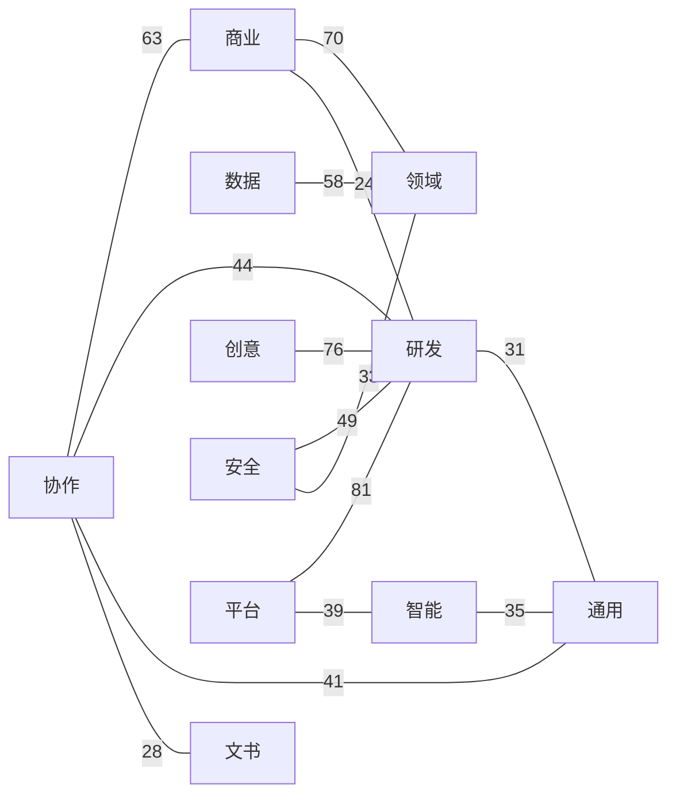
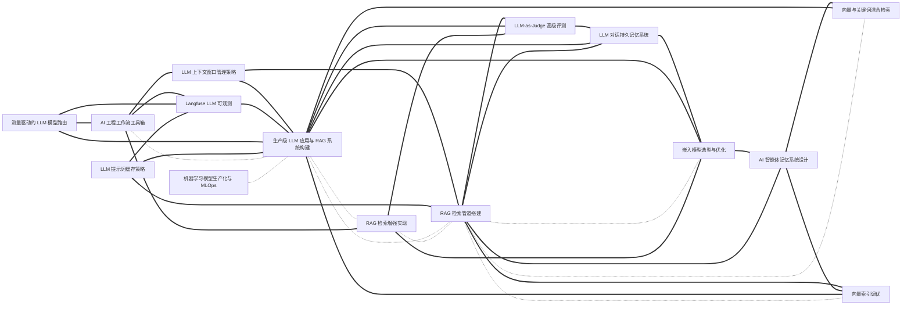

# 技能大典 · Everything Skills

> 一部面向 **AI Agent** 的技能类书。事以类聚，技以互见。
>
> 收录可被 Claude Code / Codex / Cursor / Gemini CLI 等智能体直接加载的 `SKILL.md` 技能包，
> 以中国传统**类书**的「分类 + 互见 + 索引」思想组织，但把实现换成了今天真正能 scale 的形态。

> **一键安装**：在 Claude Code 里运行 `/plugin marketplace add findscripter/everything-skills`，即可浏览、按卷分装 11 个插件。也提供 `AGENTS.md` / `GEMINI.md`（+ `gemini-extension.json`）/ `CLAUDE.md` 同源上下文，供 Codex / Gemini CLI / Cursor 等发现使用。
>
> **中文优先**：全库技能均为中文——这是以英文为主的技能生态里少见的体系化中文技能库。
>
> 本库 1108 条中文技能；另索引 **1386** 个外部 GitHub 技能库（只读 README）。
>
> **English version** — a full English tree mirrors this library 1-to-1 (same `name`, same cross-references) on the [`en`](https://github.com/findscripter/everything-skills/tree/en) branch. Where an upstream English original exists, the English tree **reuses it verbatim** rather than translating back from Chinese (`source` keeps every skill traceable).
>
> **安全与许可**：技能本体是给 Agent 的**指令文本**（非可执行程序）；凡涉及脚本/网络调用的已在各自「注意事项」中标注。本库为精选改编合集，逐条来源与许可见 [INDEX/sources.md](INDEX/sources.md)、总说明见 [LICENSE](LICENSE) / [NOTICE](NOTICE)。

---

## 一图看懂：技能互见图谱（节选）

全库 **1108 条技能、6843 条互见边**。整图见 [INDEX/graph.md](INDEX/graph.md)（卷级总览 + 按卷折叠）；以下两张为**示意节选**（由 graph.json 按固定规则自动重绘），便于在 GitHub 上直接渲染。

图例：实线箭头 `-->` = 依赖(requires)，虚线 `-.-` = 互见(related)，粗线 `===` = 组合(combines_with)。

**这正是本仓库区别于「平铺列表」的核心：技能不是孤立条目，而是连成网络。**

### 卷级总览（跨卷最强互见）

11 卷之间 Top 14 条无向跨卷边（边标签 = 边数）。



### 密集聚类示意（RAG / LLM）

以 `production-llm-app-builder` / `rag-pipeline-builder`（生产级 LLM 应用与 RAG 系统构建 / RAG 检索管道搭建）为枢纽的 ego 簇，约 15 个技能 / 36 条边（节点标签为中文标题）。




---

## 这是什么

每一条技能是一个文件夹，里面有一个标准的 `SKILL.md`（带 YAML frontmatter）。
AI Agent 在运行时**读取每条技能的 `description` 字段做匹配**来决定是否加载——
这意味着：

- **发现靠元数据，不靠目录树**。目录是给人类维护者用的；Agent 看的是 frontmatter。
- **一条技能只放一个地方**，跨领域的关联用「互见」字段（`related` / `requires` / `combines_with`）表达成**关系图**，而不是把技能复制到 5 个分类下。
- **索引、目录、互见图谱全部由脚本自动生成**，永不手工维护。

## 技能仓库目录

目前索引 **1386** 个 GitHub 技能库/市场/精选列表。只根据 README 摘要，不收录对方源码、不复制 SKILL.md。

完整分表（含 stars / summary / license）由 `data/skill-repos.jsonl`（及 part 分片）生成，见 **[INDEX/skill-repos.md](INDEX/skill-repos.md)**。本页为归类链接目录。

<details>
<summary>1. 官方与权威（official）（168）</summary>

- [`anthropics/skills`](https://github.com/anthropics/skills) — Anthropic 官方 Agent Skills 示例与文档技能；marketplace 源 anthropics/skills。
- [`vercel-labs/agent-browser`](https://github.com/vercel-labs/agent-browser) — Vercel 官方浏览器自动化 CLI + 可安装 Agent Skill（发现桩 + CLI 热加载 core）；npx skills add vercel-labs/agent-browser。仓库名含 agent。
- [`github/awesome-copilot`](https://github.com/github/awesome-copilot) — GitHub 官方 Awesome Copilot：自定义代理、指令、prompt 与技能精选。
- [`anthropics/claude-plugins-official`](https://github.com/anthropics/claude-plugins-official) — Anthropic 维护的 Claude Code / Cowork 官方插件市场。
- [`anthropics/financial-services`](https://github.com/anthropics/financial-services) — Claude for Financial Services 官方技能/插件包。
- [`vercel-labs/agent-skills`](https://github.com/vercel-labs/agent-skills) — Vercel 官方约 8 条可安装 Agent Skills。
- [`googleworkspace/cli`](https://github.com/googleworkspace/cli) — Google Workspace 非官方支持 CLI（gws）：Drive/Gmail/Calendar 等 Discovery 动态命令面，附 100+ Agent Skills。
- [`vercel-labs/skills`](https://github.com/vercel-labs/skills) — Vercel npx skills CLI 与 skills.sh：向 70 余种编码代理安装 GitHub 技能仓的事实标准安装器。
- [`openai/skills`](https://github.com/openai/skills) — OpenAI 早期技能示例；README 标明已弃用，现行示例迁至 openai/plugins。
- [`agentskills/agentskills`](https://github.com/agentskills/agentskills) — Agent Skills 开放规范（agentskills.io）：SKILL.md 格式与跨厂商可移植性。
- [`anthropics/knowledge-work-plugins`](https://github.com/anthropics/knowledge-work-plugins) — 知识工作向 Cowork 插件（约 11 个角色插件）。
- [`google/skills`](https://github.com/google/skills) — Google 官方 Agent Skills：GCP/GKE/BigQuery/Ads/Firebase 等，npx skills add google/skills；并捆绑 Claude/Codex/Antigravity 插件市场。
- [`larksuite/cli`](https://github.com/larksuite/cli) — 飞书/Lark 官方 CLI：200+ 命令与 26 条 Agent Skills（日历/文档/消息/表格/会议等），skills CLI 安装 larksuite/cli。
- [`microsoft/SkillOpt`](https://github.com/microsoft/SkillOpt) — 微软把 SKILL.md 当可训练状态的优化器：冻结模型、用轨迹与验证门编辑技能文档，产出可部署 best_skill.md。
- [`greensock/gsap-skills`](https://github.com/greensock/gsap-skills) — GSAP 官方动画技能 8 条：core/timeline/ScrollTrigger/plugins/utils/react/performance/frameworks；npx skills add greensock/gsap-skills。
- [`microsoft/playwright-cli`](https://github.com/microsoft/playwright-cli) — 微软 Playwright CLI with SKILLS：playwright-cli install --skills，面向编码代理的浏览器 CLI（相对 MCP 更省 token）。
- [`huggingface/skills`](https://github.com/huggingface/skills) — Hugging Face 官方 Hub/训练/评测/Spaces 技能；市场默认只暴露 hf-cli，其余用 hf skills add。
- [`anthropics/claude-for-legal`](https://github.com/anthropics/claude-for-legal) — Claude for Legal 官方技能：合同审查、法律研究与律所工作流。
- [`google-labs-code/stitch-skills`](https://github.com/google-labs-code/stitch-skills) — Google Stitch 设计技能与三个插件（design/build/utilities），兼容 Codex、Antigravity、Claude Code、Cursor。非官方支持产品。
- [`anthropics/defending-code-reference-harness`](https://github.com/anthropics/defending-code-reference-harness) — Anthropic 防御性安全参考 harness：威胁建模、扫描、分诊、补丁与检测响应技能，外加自主扫描流水线。标明不再维护。
- [`google/agents-cli`](https://github.com/google/agents-cli) — Gemini Enterprise Agent Platform 的 CLI + 技能：把任意编码代理变成 ADK 代理构建/评测/部署专家。
- [`openai/plugins`](https://github.com/openai/plugins) — OpenAI 现行 Codex 插件/技能示例目录，接替 openai/skills。
- [`dotnet/skills`](https://github.com/dotnet/skills) — .NET 官方 Agent Skills 插件市场：dotnet/advanced/data/diag/msbuild/nuget/upgrade/maui/ai/test/aspnetcore/blazor 等，Copilot/Claude/Codex/Cursor 插件市场。
- [`OpenSenseNova/SenseNova-Skills`](https://github.com/OpenSenseNova/SenseNova-Skills) — 商汤 SenseNova 办公技能：信息图/PPT/Excel 分析/深度研究/多源搜索，SKILL.md 可装 OpenClaw 与 Hermes。
- [`remotion-dev/skills`](https://github.com/remotion-dev/skills) — Remotion 官方 Agent Skills：best-practices/create/markup/studio/render/maps/captions/saas/interactivity/docs/upgrade/multimedia。
- [`google-gemini/gemini-skills`](https://github.com/google-gemini/gemini-skills) — Gemini API 官方技能：gemini-api-dev / live-api / omni-flash；npx skills add google-gemini/gemini-skills。非官方支持产品。
- [`browserbase/skills`](https://github.com/browserbase/skills) — Browserbase 官方浏览器自动化技能：browser/functions/trace/autobrowse/safe-browser/search/ui-test 等；npx skills add browserbase/skills。
- [`anthropics/claude-plugins-community`](https://github.com/anthropics/claude-plugins-community) — 社区插件市场只读镜像；经提交、安全扫描与审批后夜间同步。
- [`NVIDIA/skills`](https://github.com/NVIDIA/skills) — NVIDIA 官方已验证技能目录：Physical AI、仿真、CUDA-X、RAG。
- [`snyk/agent-scan`](https://github.com/snyk/agent-scan) — Snyk 官方：扫描 AI agents/MCP/skills 安全风险。
- [`microsoft/agent-skills`](https://github.com/microsoft/agent-skills) — Microsoft 官方 Agent Skills 仓库（WIP）。
- [`microsoft/skills`](https://github.com/microsoft/skills) — 微软官方 Azure SDK / AI Foundry Agent Skills；Skill Explorer 宣称 175 条。
- [`flutter/agent-plugins`](https://github.com/flutter/agent-plugins) — Flutter官方Agent插件市场（marketplace.json）；面向Flutter开发的可安装Skills。
- [`cloudflare/skills`](https://github.com/cloudflare/skills) — Cloudflare 官方 Workers/Agents SDK/Durable Objects/Wrangler/Cloudflare One 技能与 MCP。
- [`supabase/agent-skills`](https://github.com/supabase/agent-skills) — Supabase 官方技能：supabase 全产品包 + postgres-best-practices；skills CLI 与 Claude 插件市场。
- [`aws/agent-toolkit-for-aws`](https://github.com/aws/agent-toolkit-for-aws) — AWS 官方 Agent Toolkit：aws-core/agents/data-analytics/devsecops 四插件 + MCP；README 称后继 awslabs/agent-plugins；npx skills add aws/agent-toolkit-for-aws/skills。
- [`expo/skills`](https://github.com/expo/skills) — Expo 官方构建/部署/升级/调试技能；Claude/Codex 走插件市场，其余用 skills CLI。
- [`apify/agent-skills`](https://github.com/apify/agent-skills) — Apify 官方 5 条：ultimate-scraper/actor-development/actorization/output-schema/sdk-integration；npx skills add。社区精选见 apify/awesome-skills。
- [`anthropics/commerce-agents`](https://github.com/anthropics/commerce-agents) — Anthropic 购物与商户 Agent 参考蓝图（prompt/skills/工具契约）。
- [`WordPress/agent-skills`](https://github.com/WordPress/agent-skills) — WordPress 官方 17 条：blocks/themes/plugins/REST/Playground 等；npx skills add WordPress/agent-skills。
- [`figma/mcp-server-guide`](https://github.com/figma/mcp-server-guide) — Figma 官方 MCP 指南仓：Cursor/Claude 插件含 Agent Skills；另有 video-interaction-mapper / generate-project-plan 独立工作流技能。README 标明 Beta。
- [`callstackincubator/agent-skills`](https://github.com/callstackincubator/agent-skills) — Callstack：面向 React Native 的 Agent Skills 集合。
- [`microsoft/azure-skills`](https://github.com/microsoft/azure-skills) — 微软 Azure 技能插件：准备/校验/部署/诊断/成本/AI/RBAC 等，并接入 Azure MCP 与 Foundry MCP。
- [`mozilla-ai/cq`](https://github.com/mozilla-ai/cq) — Mozilla AI 共享知识 commons（cq）Claude 插件。
- [`langchain-ai/langchain-skills`](https://github.com/langchain-ai/langchain-skills) — LangChain/LangGraph/Deep Agents 21 条技能；npx skills add langchain-ai/langchain-skills。早期开发。
- [`TencentCloudBase/CloudBase-AI-Toolkit`](https://github.com/TencentCloudBase/CloudBase-AI-Toolkit) — 腾讯云 CloudBase AI Toolkit（含 Agent Skills）。
- [`microsoft/skills-for-fabric`](https://github.com/microsoft/skills-for-fabric) — Microsoft Fabric 技能市场：fabric-skills 全包与独立的 Power BI 作者包。
- [`Kotlin/kotlin-agent-skills`](https://github.com/Kotlin/kotlin-agent-skills) — Kotlin 官方：Kotlin 项目可用的 AI Agent Skills。
- [`vercel-labs/next-skills`](https://github.com/vercel-labs/next-skills) — 路标仓：原 Next.js Agent Skills 已迁入 vercel/next.js 的 skills/，用 npx skills add vercel/next.js。
- [`anthropics/launch-your-agent`](https://github.com/anthropics/launch-your-agent) — Anthropic 参考技能：访谈→范围 v0→在本人账户启动 Claude Managed Agent→评分迭代→定时部署。
- [`getsentry/skills`](https://github.com/getsentry/skills) — Sentry 团队官方开发技能约 27 条 + 2 子代理；npx skills add getsentry/skills。产品接入技能另见 getsentry/sentry-for-ai。
- [`awslabs/agent-plugins`](https://github.com/awslabs/agent-plugins) — AWS Labs Agent Plugins 市场：Amplify、Serverless、SageMaker、deploy-on-aws 等；README 称后继为 Agent Toolkit for AWS。
- [`oxylabs/agent-skills`](https://github.com/oxylabs/agent-skills) — Oxylabs官方产品Agent Skills。
- [`hashicorp/agent-skills`](https://github.com/hashicorp/agent-skills) — HashiCorp 官方 Terraform 16 条 + Packer 4 条 Agent Skills；npx skills add 与 Claude/Codex 产品插件包 terraform@hashicorp / packer@hashicorp。
- [`google/mantis`](https://github.com/google/mantis) — Google 可移植安全审查技能套件：计划、研究、复现、补丁、报告的顺序流水线；npx skills add google/mantis。非官方支持产品。
- [`higgsfield-ai/skills`](https://github.com/higgsfield-ai/skills) — Higgsfield 官方 9 条：generate/soul-id/photoshoot/brandkit/marketplace-cards/websites/explainer/thumbnail/game-generation；npx skills add higgsfield-ai/skills。
- [`microsoft/power-platform-skills`](https://github.com/microsoft/power-platform-skills) — 微软 Power Platform 插件市场：Power Pages、Model/Canvas/Code/Mobile Apps、Power Automate 等。
- [`laravel/agent-skills`](https://github.com/laravel/agent-skills) — Laravel 官方 Agent Skills（Cloud/LSP/Nightwatch 等）。
- [`Unity-Technologies/skills`](https://github.com/Unity-Technologies/skills) — Unity 官方 AI Agent Skills 集合（项目/CLI/UI/多人/IAP 等）。
- [`dbt-labs/dbt-agent-skills`](https://github.com/dbt-labs/dbt-agent-skills) — dbt Labs 官方：面向 dbt 工作流的 Agent Skills 集合。
- [`planetscale/database-skills`](https://github.com/planetscale/database-skills) — PlanetScale 官方数据库技能：mysql/postgres/vitess/neki；npx skills add planetscale/database-skills。
- [`angular/skills`](https://github.com/angular/skills) — Angular 官方编码技能：angular-developer 与 angular-new-app，npx skills add angular/skills；源在 angular/angular 的 skills/dev-skills。
- [`elastic/agent-skills`](https://github.com/elastic/agent-skills) — Elastic 官方技能：Cloud/Elasticsearch/Kibana/Observability/Security 五组，npx skills add elastic/agent-skills 与 Claude/Copilot 插件市场。
- [`lightonai/next-plaid`](https://github.com/lightonai/next-plaid) — LightOn 语义/多向量代码搜索 Tools Skills。
- [`ClickHouse/agent-skills`](https://github.com/ClickHouse/agent-skills) — ClickHouse 官方技能：best-practices/architecture/JS troubleshooting/chdb/infra/ClickStack OTel；npx skills add 与 clickhousectl skills。
- [`posit-dev/skills`](https://github.com/posit-dev/skills) — Posit 官方 Claude 技能：R 包/Shiny/Quarto/Connect/GitHub PR 等分类；npx skills add posit-dev/skills。
- [`makenotion/claude-code-notion-plugin`](https://github.com/makenotion/claude-code-notion-plugin) — Notion 官方 Claude Code Notion 插件与技能。
- [`anthropics/k12-teacher-skills`](https://github.com/anthropics/k12-teacher-skills) — Claude for Teachers 配套 K-12 技能与评测，与 Learning Commons 合编。
- [`NVIDIA-BioNeMo/bionemo-agent-toolkit`](https://github.com/NVIDIA-BioNeMo/bionemo-agent-toolkit) — NVIDIA BioNeMo 生命科学官方技能：Boltz-2/DiffDock/Evo2/GenMol/OpenFold/RFdiffusion/Parabricks 等 NIM 与工作流；npx skills add。双许可。
- [`elevenlabs/skills`](https://github.com/elevenlabs/skills) — ElevenLabs 官方 TTS/STT/agents/SFX/music/dubbing 等 10 条；npx skills add elevenlabs/skills。
- [`astronomer/agents`](https://github.com/astronomer/agents) — Astronomer 官方 Airflow/数仓技能 20+（DAG/dbt/lineage/分析）+ MCP；npx skills add astronomer/agents。
- [`firebase/agent-skills`](https://github.com/firebase/agent-skills) — Firebase 官方 Agent Skills：README 安装命令指向 firebase/skills 别名路径，兼 Gemini/Claude/Codex/Kimi 插件。
- [`microsoft/skills-for-copilot-studio`](https://github.com/microsoft/skills-for-copilot-studio) — 微软 Copilot Studio STANDARD agent YAML 插件：manage/author/test/advisor 四子代理。实验性、非官方支持产品。
- [`mckinsey/agents-at-scale-ark`](https://github.com/mckinsey/agents-at-scale-ark) — McKinsey Agents at Scale / ARK 插件 Skills。
- [`microsoft/win-dev-skills`](https://github.com/microsoft/win-dev-skills) — 微软 WinUI 3 / Windows App SDK 技能 8 条 + winui-dev 编排代理；Copilot/Claude/Codex 插件市场。Preview。
- [`getsentry/warden`](https://github.com/getsentry/warden) — Sentry 本地/PR AI 代码评审 Agents Skills。
- [`TheQtCompanyRnD/agent-skills`](https://github.com/TheQtCompanyRnD/agent-skills) — Qt 官方 12 条：C++/QML review、UI、docs、profiler、test、Figma tokens/components、CMake；Claude 插件市场 + npx skills add + Gemini 扩展。
- [`LambdaTest/agent-skills`](https://github.com/LambdaTest/agent-skills) — TestMu AI（原 LambdaTest）官方测试技能：Selenium/Playwright/Cypress 等跨语言框架，npx agentskillsforall add。
- [`amd/skills`](https://github.com/amd/skills) — AMD 官方 Agent Skills：Ryzen AI 本地推理、Instinct LLM serving、ROCm 诊断等；npx skills add amd/skills。
- [`JetBrains/benjamin-plus-skill`](https://github.com/JetBrains/benjamin-plus-skill) — JetBrains Benjamin-Plus 降 token 成本技能。
- [`NVIDIA/nvidia-kaggle`](https://github.com/NVIDIA/nvidia-kaggle) — NVIDIA 官方 Kaggle 插件：竞赛综述/writeup/kernel 复现/提交；Codex/Claude 插件市场 + SKILL.md。
- [`databricks/databricks-agent-skills`](https://github.com/databricks/databricks-agent-skills) — Databricks 官方稳定技能 29 条（core/jobs/pipelines/Unity Catalog 等）；databricks aitools install 与多宿主插件市场。
- [`vercel/vercel-plugin`](https://github.com/vercel/vercel-plugin) — Vercel 官方插件：35 条生态技能 + 3 专家代理 + 知识图谱；npx plugins add vercel/vercel-plugin。
- [`qdrant/skills`](https://github.com/qdrant/skills) — Qdrant 官方向量检索技能：scaling/sizing/search-quality/multitenancy/model-migration 等 + Advisor 元技能。
- [`OpenZeppelin/openzeppelin-skills`](https://github.com/OpenZeppelin/openzeppelin-skills) — OpenZeppelin 官方安全合约技能：Solidity/Cairo/Stylus/Stellar/Sui 的 setup/upgrade/review。
- [`mongodb/agent-skills`](https://github.com/mongodb/agent-skills) — MongoDB 官方 Atlas 插件 + 查询/schema/Search/Vector 技能；npx skills add mongodb/agent-skills。
- [`sanity-io/agent-toolkit`](https://github.com/sanity-io/agent-toolkit) — Sanity 官方 4 条技能 + MCP/Claude/Cursor/Codex 插件；npx skills add sanity-io/agent-toolkit。
- [`okx/agent-skills`](https://github.com/okx/agent-skills) — OKX 官方交易/组合/行情/机器人 Agent Skills（okx CLI）。
- [`resend/resend-skills`](https://github.com/resend/resend-skills) — Resend 官方邮件技能：resend/agent-email-inbox/resend-cli/react-email/email-best-practices，兼 MCP。
- [`coderabbitai/skills`](https://github.com/coderabbitai/skills) — CodeRabbit 官方 code-review / autofix 技能，适配 35+ 代理；npx skills add coderabbitai/skills。
- [`makenotion/skills`](https://github.com/makenotion/skills) — Notion 官方 Agent Skills，推荐 npx skills add makenotion/skills；当前公开表仅 notion-cli。
- [`CesiumGS/cesiumjs-skills`](https://github.com/CesiumGS/cesiumjs-skills) — CesiumJS 开发精选官方 Agent Skills。
- [`langchain-ai/langsmith-skills`](https://github.com/langchain-ai/langsmith-skills) — LangSmith 观测技能 3 条：trace/dataset/evaluator；npx skills add langchain-ai/langsmith-skills。
- [`adobe/spectrum-design-data`](https://github.com/adobe/spectrum-design-data) — Adobe Spectrum 设计令牌与组件 Skills。
- [`circlefin/skills`](https://github.com/circlefin/skills) — Circle 官方稳定币技能：USDC/CCTP/wallets/Gateway/Arc/agent-wallet 等，npx skills add circlefin/skills。
- [`alpacahq/alpaca-skills`](https://github.com/alpacahq/alpaca-skills) — Alpaca Trading/Broker API 官方 Agent Skills。
- [`veniceai/skills`](https://github.com/veniceai/skills) — Venice AI Agent Skills。
- [`redis/agent-skills`](https://github.com/redis/agent-skills) — Redis 官方技能：core/connections/search/semantic-cache/clustering/security/observability/iris-development。
- [`remix-run/agent-skills`](https://github.com/remix-run/agent-skills) — Remix 官方 React Router 三模式技能（已归档，后继 `npx skills add remix-run/react-router --skill react-router`）。
- [`coinbase/agentic-wallet-skills`](https://github.com/coinbase/agentic-wallet-skills) — Coinbase Agentic Wallet 官方技能（awal CLI）。
- [`base/skills`](https://github.com/base/skills) — Base链官方Skills（build-on-base/base-mcp/vibenet）；npx skills add base/skills。
- [`black-forest-labs/skills`](https://github.com/black-forest-labs/skills) — Black Forest Labs FLUX 图像/视频官方技能：prompt 实践、BFL API、FLUX 3 视频套件；npx skills add。
- [`huggingface/pwc-cli`](https://github.com/huggingface/pwc-cli) — Hugging Face 官方 Papers with Code CLI + `pwc skills add` 生成匹配版本的 Agent Skill。
- [`clay-run/agent-plugins`](https://github.com/clay-run/agent-plugins) — Clay 官方 GTM/ enrichment Agent Skills+MCP+CLI。
- [`ComPDFKit/compdf-skills`](https://github.com/ComPDFKit/compdf-skills) — ComPDF 面向 Agent 的 PDF 处理 Skills。
- [`Shopify/claude-for-commerce-examples`](https://github.com/Shopify/claude-for-commerce-examples) — Shopify 对 Anthropic commerce-agents 的店面/商户实现示例。
- [`firecrawl/skills`](https://github.com/firecrawl/skills) — Firecrawl 官方技能目录（CI 同步）：core CLI/MCP、build SDK、workflows；npx skills add firecrawl/skills。
- [`GoogleCloudPlatform/cxas-scrapi`](https://github.com/GoogleCloudPlatform/cxas-scrapi) — Google CX Agent Studio 官方 Python API/CLI/Skills。
- [`rstackjs/agent-skills`](https://github.com/rstackjs/agent-skills) — Rstack 官方 Agent Skills 合集。
- [`base44/skills`](https://github.com/base44/skills) — Base44 官方 Claude Code Skills。
- [`apache/magpie`](https://github.com/apache/magpie) — Apache 官方项目维护 Agent Skills（分诊/PR/发版/安全等配方族）
- [`microsoft/aspire-skills`](https://github.com/microsoft/aspire-skills) — .NET Aspire 官方 Agent Skills。
- [`resemble-ai/detect-skill`](https://github.com/resemble-ai/detect-skill) — Resemble AI 官方深伪检测/媒体安全 Agent Skill。
- [`polars-inc/skills`](https://github.com/polars-inc/skills) — Polars 官方 AI Agent Skills。
- [`zoom/skills`](https://github.com/zoom/skills) — Zoom 开发平台官方 Skills（REST/SDK/MCP 路由）
- [`elastic/elastic-docs-skills`](https://github.com/elastic/elastic-docs-skills) — Elastic 官方文档工作流技能目录；Claude 插件市场 + npx skills add elastic/elastic-docs-skills。
- [`Shopify/agent-skills`](https://github.com/Shopify/agent-skills) — Shopify 官方技能：Admin/Storefront/Functions/Hydrogen/Liquid/Polaris 扩展等 15 条；npx skill install。
- [`Shopify/ucp-cli`](https://github.com/Shopify/ucp-cli) — Shopify Universal Commerce Protocol 购物 Agent Skill。
- [`Cap-go/capgo-skills`](https://github.com/Cap-go/capgo-skills) — Capgo/Capacitor 移动开发 Agent Skills。
- [`wandb/skills`](https://github.com/wandb/skills) — Weights & Biases 官方训练/评测技能 3 条（experimental）；npx skills add wandb/skills。
- [`contentful/skill-kit`](https://github.com/contentful/skill-kit) — Contentful 官方：用 TypeScript 状态机构建 Agent Skills 的 SDK。
- [`Bria-AI/bria-skill`](https://github.com/Bria-AI/bria-skill) — Bria AI 图像 Agent Skill。
- [`califio/skills`](https://github.com/califio/skills) — Calif.io 官方 Agent Skills。
- [`motherduckdb/agent-skills`](https://github.com/motherduckdb/agent-skills) — MotherDuck 官方 22 个 Agent Skills：连接/SQL/Dive/管线。
- [`replicate/skills`](https://github.com/replicate/skills) — Replicate 官方模型检索/对比/运行/发布与图视频 prompting 7 条；npx skills add replicate/skills。
- [`confluentinc/agent-skills`](https://github.com/confluentinc/agent-skills) — Confluent 官方流处理/事件流 Agent Skills。
- [`prisma/skills`](https://github.com/prisma/skills) — Prisma 官方 ORM/Client/Postgres/Compute 技能 8 条。
- [`huggingface/transformers-to-mlx`](https://github.com/huggingface/transformers-to-mlx) — Hugging Face 官方：把 transformers LLM 移植到 mlx-lm 的 Agent Skill（`uvx hf skills add`）。
- [`microsoft/dataverse-business-skills`](https://github.com/microsoft/dataverse-business-skills) — Dataverse 业务开发官方 Skills。
- [`auth0/agent-skills`](https://github.com/auth0/agent-skills) — Auth0 官方 Agent Skills。
- [`publora/skills`](https://github.com/publora/skills) — Publora 官方社交发帖/排期 Agent Skills（经 MCP）
- [`microsoft/power-cat-skills`](https://github.com/microsoft/power-cat-skills) — Power Platform CAT 官方 Skills。
- [`microsoft/azure-devops-skills`](https://github.com/microsoft/azure-devops-skills) — Azure DevOps MCP+Copilot样例Skills/提示模式。
- [`cypress-io/ai-toolkit`](https://github.com/cypress-io/ai-toolkit) — Cypress 官方 AI Toolkit Agent Skills。
- [`quark-clouddrive/quarkclouddrive_offical`](https://github.com/quark-clouddrive/quarkclouddrive_offical) — 夸克网盘官方 Skill：Agent 内管理/检索网盘文件。
- [`microsoft/agent365-skills`](https://github.com/microsoft/agent365-skills) — Microsoft 365 Agent 官方 Skills。
- [`netlify/context-and-tools`](https://github.com/netlify/context-and-tools) — Netlify 官方 Claude 插件与上下文工具技能。
- [`NVIDIA/nurec-skills`](https://github.com/NVIDIA/nurec-skills) — NVIDIA Omniverse NuRec 官方 6 条：nurec-index/datasets/ncore/nre/asset-harvester/nurec-fixer。
- [`JetBrains/phpstorm-claude-marketplace`](https://github.com/JetBrains/phpstorm-claude-marketplace) — PhpStorm Claude Code 插件市场。
- [`Shopify/liquid-skills`](https://github.com/Shopify/liquid-skills) — Shopify Liquid 语言 Claude Code 插件技能。
- [`AtlasCloudAI/atlas-cloud-skills`](https://github.com/AtlasCloudAI/atlas-cloud-skills) — Atlas Cloud 图像/视频与多模型 Agent Skills。
- [`neondatabase/postgres-skills`](https://github.com/neondatabase/postgres-skills) — Neon 官方厂商无关 Postgres 最佳实践技能（schema/索引/查询）；npx skills add neondatabase/postgres-skills。与 neondatabase/agent-skills 并列。
- [`huggingface/s2-cli`](https://github.com/huggingface/s2-cli) — Hugging Face 官方 Semantic Scholar CLI + SKILL.md（引用/被引/检索）。
- [`metalbear-co/skills`](https://github.com/metalbear-co/skills) — MetalBear 官方用户 Agent Skills 包。
- [`awslabs/hcls-agent-skills`](https://github.com/awslabs/hcls-agent-skills) — AWS 医疗与生命科学官方 Agent Skills。
- [`helius-labs/core-ai`](https://github.com/helius-labs/core-ai) — Helius Solana Core AI Skills。
- [`Starchild-ai-agent/official-skills`](https://github.com/Starchild-ai-agent/official-skills) — Starchild 官方 Skills。
- [`atlassian/forge-skills`](https://github.com/atlassian/forge-skills) — Atlassian Forge 官方 Skills 插件（脚手架、审查、调试、安全）
- [`huggingface/physics-intern-skills`](https://github.com/huggingface/physics-intern-skills) — Hugging Face PhysicsIntern：理论物理/数学研究工作流，8 条 slash 技能，适配 Claude/Codex/OpenCode/Pi。
- [`cashfree/agent-skills`](https://github.com/cashfree/agent-skills) — Cashfree 支付集成 Agent Skills（npx 安装多框架）
- [`JetBrains/rider-skills`](https://github.com/JetBrains/rider-skills) — .NET/GameDev 向 Rider Agent Skills。
- [`powersync-ja/agent-skills`](https://github.com/powersync-ja/agent-skills) — PowerSync 官方 Agent Skills。
- [`awslabs/startups`](https://github.com/awslabs/startups) — AWS Startups 官方插件/Skills/工具资源库。
- [`Hashnode/gql-skill`](https://github.com/Hashnode/gql-skill) — Hashnode GraphQL API 官方可安装 Agent Skill。
- [`nocodb/agent-skills`](https://github.com/nocodb/agent-skills) — NocoDB Agent Skills。
- [`PSPDFKit-labs/nutrient-agent-skill`](https://github.com/PSPDFKit-labs/nutrient-agent-skill) — Nutrient/PSPDFKit 文档 Agent Skill。
- [`elastic/integration-skills`](https://github.com/elastic/integration-skills) — Elastic 官方集成包技能：research/create-integration + CEL/ingest/ECS 等域技能；npx skills add。Beta。
- [`trycourier/courier-skills`](https://github.com/trycourier/courier-skills) — Courier 官方通知技能：email/SMS/push/inbox/Slack/Teams/WhatsApp；npx skills add trycourier/courier-skills。
- [`Tencent-RTC/agent-skills`](https://github.com/Tencent-RTC/agent-skills) — 腾讯 RTC（Chat/Call/Live 等）集成 Agent Skills。
- [`webull-inc/webull-openapi-skills`](https://github.com/webull-inc/webull-openapi-skills) — Webull OpenAPI Agent Skills。
- [`2ChatCo/agent-skills`](https://github.com/2ChatCo/agent-skills) — WhatsApp/SMS/电话 Agent Skills。
- [`exasol-labs/exasol-agent-skills`](https://github.com/exasol-labs/exasol-agent-skills) — Exasol 数据库 Agent Skills。
- [`mailtrap/mailtrap-skills`](https://github.com/mailtrap/mailtrap-skills) — Mailtrap 官方邮件测试 Agent Skills。
- [`NVIDIA/digital-health-skills`](https://github.com/NVIDIA/digital-health-skills) — NVIDIA Digital Health 官方临床 ASR 四段技能：setup/build/eval/finetune。
- [`coinpaprika/skills`](https://github.com/coinpaprika/skills) — CoinPaprika/DexPaprika 加密行情 Agent Skills。
- [`microsoft/teams-platform-skills`](https://github.com/microsoft/teams-platform-skills) — Teams 平台开发官方 Skills。
- [`microsoft/code-optimizations-skills`](https://github.com/microsoft/code-optimizations-skills) — 代码优化官方 Agent Skills。
- [`transloadit/skills`](https://github.com/transloadit/skills) — Transloadit 官方媒体处理 Agent Skills。

</details>

<details>
<summary>2. 精选列表 / 大集合（collections）（315）</summary>

- [`ComposioHQ/awesome-claude-skills`](https://github.com/ComposioHQ/awesome-claude-skills) — Claude Skills 最大社区精选之一，README 收录 1000+ 技能条目。
- [`santifer/career-ops`](https://github.com/santifer/career-ops) — 求职/职业运营 Agent Skills 工作流（高星）。
- [`hesreallyhim/awesome-claude-code`](https://github.com/hesreallyhim/awesome-claude-code) — Claude Code 生态 awesome：技能、斜杠命令、hooks、MCP、插件与工作流。
- [`VoltAgent/awesome-openclaw-skills`](https://github.com/VoltAgent/awesome-openclaw-skills) — 从 ClawHub 等汇总的 OpenClaw 技能精选，README 宣称 5200-5400+。
- [`Imbad0202/academic-research-skills`](https://github.com/Imbad0202/academic-research-skills) — 学术研究全流程 Claude Skills：检索→写作→审稿→修改→定稿。
- [`sickn33/agentic-awesome-skills`](https://github.com/sickn33/agentic-awesome-skills) — AAS Core：跨代理 SKILL.md 大集合（v16.5.0 宣称 2107 条）。原名 antigravity-awesome-skills。
- [`Yuan1z0825/nature-skills`](https://github.com/Yuan1z0825/nature-skills) — 面向 Nature 风格论文写作/绘图/审稿的科研 Agent Skills 大库（npx skills）。
- [`VoltAgent/awesome-claude-skills`](https://github.com/VoltAgent/awesome-claude-skills) — VoltAgent 精选官方/社区 Agent Skills（非 AI 水货）。
- [`VoltAgent/awesome-agent-skills`](https://github.com/VoltAgent/awesome-agent-skills) — 官方+社区 Agent Skills 手选目录，徽章宣称 1497+ 条。
- [`alchaincyf/nuwa-skill`](https://github.com/alchaincyf/nuwa-skill) — 女娲：蒸馏任意公开人物思维方式为可安装 Agent Skill。
- [`freestylefly/awesome-gpt-image-2`](https://github.com/freestylefly/awesome-gpt-image-2) — GPT-Image2 工业级提示词引擎/模板库，提炼为可安装 Skills。
- [`Donchitos/Claude-Code-Game-Studios`](https://github.com/Donchitos/Claude-Code-Game-Studios) — 把 Claude Code 变成游戏工作室：49 Agent + 73 工作流 Skills。
- [`VoltAgent/awesome-claude-code-subagents`](https://github.com/VoltAgent/awesome-claude-code-subagents) — Claude Code 子代理精选 158+，相关但不是 SKILL.md 技能库。
- [`composio-community/awesome-codex-skills`](https://github.com/composio-community/awesome-codex-skills) — Codex 技能 awesome 列表；种子名 ComposioHQ/awesome-codex-skills 已迁此仓。
- [`travisvn/awesome-claude-skills`](https://github.com/travisvn/awesome-claude-skills) — Claude Skills 社区 awesome 列表，按领域分类索引可安装技能仓。
- [`ConardLi/garden-skills`](https://github.com/ConardLi/garden-skills) — ConardLi 开源 Skills 合集（网页设计/知识库等）。
- [`alchaincyf/zhangxuefeng-skill`](https://github.com/alchaincyf/zhangxuefeng-skill) — 张雪峰认知操作系统 Skill（志愿/考研/职业规划，女娲蒸馏）。
- [`BehiSecc/awesome-claude-skills`](https://github.com/BehiSecc/awesome-claude-skills) — Claude Skills 社区 awesome 精选列表。
- [`ykdojo/claude-code-tips`](https://github.com/ykdojo/claude-code-tips) — Claude Code 实用技巧合集（含 dx 插件与可安装 Skills）。
- [`nexu-io/html-anything`](https://github.com/nexu-io/html-anything) — Agent 驱动的多表面 HTML 编辑/生成技能（杂志/海报/小红书等）。
- [`PleasePrompto/notebooklm-skill`](https://github.com/PleasePrompto/notebooklm-skill) — 让 Claude Code 直接对话 NotebookLM 的 Skill。
- [`NomaDamas/k-skill`](https://github.com/NomaDamas/k-skill) — 面向韩国用户的 Agent Skills 合集。
- [`zenstory-ai/oh-story-claudecode`](https://github.com/zenstory-ai/oh-story-claudecode) — 网文/小说写作Skill包（扫榜/拆文/写作/去AI味/封面）。`npx skills add zenstory-ai/oh-story-claudecode`。
- [`heilcheng/awesome-agent-skills`](https://github.com/heilcheng/awesome-agent-skills) — Agent Skills 目录，配套站点 agent-skill.co。
- [`anbeime/skill`](https://github.com/anbeime/skill) — 中文 Skill 商店：自动抓取官方技能 + 63 条本地中文技能（文档/短视频/电商等），宣称总计 245 条、每 24 小时同步。
- [`alchaincyf/darwin-skill`](https://github.com/alchaincyf/darwin-skill) — 达尔文：评估→改进→测试→棘轮保留的 Skill 自进化系统。
- [`browser-act/skills`](https://github.com/browser-act/skills) — BrowserAct 浏览器自动化与抓取 Skills（含 Skill Forge/解决方案目录）。
- [`0xNyk/awesome-hermes-agent`](https://github.com/0xNyk/awesome-hermes-agent) — Nous Hermes Agent 独立目录：技能、插件、记忆、工具与指南。
- [`epoko77-ai/im-not-ai`](https://github.com/epoko77-ai/im-not-ai) — 韩文去 AI 腔润色 Claude Skill（Humanize KR）。
- [`libukai/awesome-agent-skills`](https://github.com/libukai/awesome-agent-skills) — Agent Skills 中文终极指南：规范、安装、官方项目表与精选技能。
- [`jakubkrehel/skills`](https://github.com/jakubkrehel/skills) — Interfaces.dev UI 技能包（typography/colors/a11y 等）；`npx skills add` + Claude 插件市场。
- [`BuilderIO/skills`](https://github.com/BuilderIO/skills) — Builder.io Agent-Native 技能包（visual-plan/recap/webmcp 等）；`npx @agent-native/skills` + 插件市场。
- [`conorbronsdon/avoid-ai-writing`](https://github.com/conorbronsdon/avoid-ai-writing) — 检测并改写去除 AI 写作痕迹的 Skill。
- [`dmmulroy/anti-slop`](https://github.com/dmmulroy/anti-slop) — 拒绝低证据 TypeScript/JS 模式的 Oxlint + Agent Skill。
- [`nyldn/claude-octopus`](https://github.com/nyldn/claude-octopus) — 多模型互补协作的 Claude Octopus 技能/插件。
- [`Dimillian/Skills`](https://github.com/Dimillian/Skills) — 个人Codex Skills合集。
- [`davidondrej/skills`](https://github.com/davidondrej/skills) — David Ondrej个人Agent Skills。
- [`sanyuan0704/sanyuan-skills`](https://github.com/sanyuan0704/sanyuan-skills) — 三元代码审查Skills（SOLID/安全/性能等）。`npx skills add sanyuan0704/sanyuan-skills`。
- [`liustack/modlens`](https://github.com/liustack/modlens) — 为纯文本编码 Agent 外挂视觉/OCR 的 Skill/插件。
- [`tmstack/awesome-persona-skills`](https://github.com/tmstack/awesome-persona-skills) — 中文人设/蒸馏技能精选：同事/老板/前任/自己/女娲等，链到 titanwings/distilly 等独立仓。
- [`brycewang-stanford/Auto-Empirical-Research-Skills`](https://github.com/brycewang-stanford/Auto-Empirical-Research-Skills) — 斯坦福 REAP 社科实证研究 Agent Skills 大库。
- [`nowork-studio/NotFair`](https://github.com/nowork-studio/NotFair) — 开源 SEO/GEO/营销 Agent Skills（NotFair）。
- [`Hisn00w/ASu-skills`](https://github.com/Hisn00w/ASu-skills) — 中文求职工作流插件：9 入口（简历/面试/开源贡献/投递）；Claude/Codex/Trae 插件。
- [`foryourhealth111-pixel/Vibe-Skills`](https://github.com/foryourhealth111-pixel/Vibe-Skills) — Vibe Skills 可安装技能合集。
- [`eracle/OpenOutreach`](https://github.com/eracle/OpenOutreach) — B2B 线索外联 Claude 插件/技能。
- [`rohitg00/pro-workflow`](https://github.com/rohitg00/pro-workflow) — Pro Workflow Agent Skills/工作流包。
- [`addyosmani/web-quality-skills`](https://github.com/addyosmani/web-quality-skills) — 基于Lighthouse/Core Web Vitals的Web质量优化Agent Skills。`npx skills add`。
- [`jeremylongshore/claude-code-plugins-plus-skills`](https://github.com/jeremylongshore/claude-code-plugins-plus-skills) — 跨模型 Agent Skills 平台与技能目录。
- [`cocoindex-io/cocoindex-code`](https://github.com/cocoindex-io/cocoindex-code) — AST 语义代码搜索 Claude/Cursor Skill（marketplace）。
- [`jeremylongshore/tons-of-skills-marketplace`](https://github.com/jeremylongshore/tons-of-skills-marketplace) — Tons of Skills 市场：440 插件、2984 条可见技能、347 代理定义；ccpi CLI 与 tonsofskills.com。
- [`ciembor/agent-rules-books`](https://github.com/ciembor/agent-rules-books) — 源自经典书籍的AGENTS.md规则/Skills（Codex/Cursor/Claude）。
- [`bergside/awesome-design-skills`](https://github.com/bergside/awesome-design-skills) — 67 套 DESIGN.md + SKILL.md 设计系统技能，用 npx typeui.sh pull <slug> 拉到 Cursor/Claude 等。
- [`twostraws/Swift-Agent-Skills`](https://github.com/twostraws/Swift-Agent-Skills) — Swift/Apple 平台开源 AI Agent Skills 精选目录。
- [`AMAP-ML/SkillClaw`](https://github.com/AMAP-ML/SkillClaw) — 高德 SkillClaw Agent Skills 相关项目。
- [`softaworks/agent-toolkit`](https://github.com/softaworks/agent-toolkit) — 意见化可共享 Agent Skills 工具包。
- [`mrgoonie/claudekit-skills`](https://github.com/mrgoonie/claudekit-skills) — ClaudeKit 专用工作流 Agent Skills。
- [`LeoYeAI/openclaw-master-skills`](https://github.com/LeoYeAI/openclaw-master-skills) — OpenClaw 热门 skills 精选合集（定期更新）。
- [`Paramchoudhary/ResumeSkills`](https://github.com/Paramchoudhary/ResumeSkills) — 简历优化与求职申请类 Agent Skills。
- [`GuDaStudio/skills`](https://github.com/GuDaStudio/skills) — GuDaStudio Agent Skills 合集。
- [`awesome-skills/code-review-skill`](https://github.com/awesome-skills/code-review-skill) — 代码审查 Agent Skill。
- [`bergside/typeui.sh`](https://github.com/bergside/typeui.sh) — TypeUI 设计系统拉取/安装 Agent Skills 平台。
- [`ReScienceLab/opc-skills`](https://github.com/ReScienceLab/opc-skills) — 一人公司/独立创业者Agent Skills合集。
- [`Alisa0808/vox-director`](https://github.com/Alisa0808/vox-director) — 影像/短视频导演向 Agent Skill。
- [`Prat011/awesome-llm-skills`](https://github.com/Prat011/awesome-llm-skills) — 跨 Claude/Codex/Gemini/OpenCode/Qwen 的 LLM Skills awesome 列表。
- [`zenstory-ai/drama-skills`](https://github.com/zenstory-ai/drama-skills) — AI短剧/漫剧创作Skill合集（剧本→分镜→提示词→审查）；Claude/Codex。
- [`qufei1993/skills-hub`](https://github.com/qufei1993/skills-hub) — Skills Hub 技能集散/索引。
- [`dvdsgl/claude-canvas`](https://github.com/dvdsgl/claude-canvas) — Claude Canvas 插件/marketplace。
- [`rohitg00/skillkit`](https://github.com/rohitg00/skillkit) — Skillkit 技能管理/安装工具与包。
- [`alchaincyf/huashu-skills`](https://github.com/alchaincyf/huashu-skills) — 花叔开源Agent Skills总目录（旗舰+人物视角+内置，50+）。
- [`hyhmrright/brooks-lint`](https://github.com/hyhmrright/brooks-lint) — Brooks Lint 代码质量 Agent Skill。
- [`CloudAI-X/claude-workflow-v2`](https://github.com/CloudAI-X/claude-workflow-v2) — Claude 工作流 v2 技能/插件包。
- [`tjboudreaux/cc-thinking-skills`](https://github.com/tjboudreaux/cc-thinking-skills) — 28个评测导向心智模型/批判思维Claude Skills。`npx skills add tjboudreaux/cc-thinking-skills`。
- [`cbrock84/headcount`](https://github.com/cbrock84/headcount) — 公司化组织的 Claude Code 部门 Skills 市场（125+）。
- [`obra/superpowers-marketplace`](https://github.com/obra/superpowers-marketplace) — Superpowers 的 Claude Code 插件市场：核心 superpowers、Elements of Style、插件开发技能、Private Journal MCP。
- [`irinabuht12-oss/marketing-skills`](https://github.com/irinabuht12-oss/marketing-skills) — 48 个免费 Claude 营销技能（Ads/SEO/GEO）并配 Ryze MCP 数据连接
- [`gooseworks-ai/goose-skills`](https://github.com/gooseworks-ai/goose-skills) — Growth/GTM Skills+数据API（广告/社媒等）for Claude/Codex/Cursor。
- [`GanyuanRan/Aegis`](https://github.com/GanyuanRan/Aegis) — Aegis 安全防护向 Agent Skills。
- [`JuliusBrussee/blueprint`](https://github.com/JuliusBrussee/blueprint) — Blueprint Agent Skill/工作流。
- [`MoizIbnYousaf/ai-agent-skills`](https://github.com/MoizIbnYousaf/ai-agent-skills) — AI Agent Skills 合集。
- [`openclaw/agent-skills`](https://github.com/openclaw/agent-skills) — OpenClaw 实用 Agent Skills 集合。
- [`dpearson2699/swift-ios-skills`](https://github.com/dpearson2699/swift-ios-skills) — iOS 26+/Swift 6.3/SwiftUI现代Apple框架Agent Skills。
- [`abubakarsiddik31/claude-skills-collection`](https://github.com/abubakarsiddik31/claude-skills-collection) — Claude Skills 精选合集。
- [`brycewang-stanford/Awesome-Journal-Skills`](https://github.com/brycewang-stanford/Awesome-Journal-Skills) — 斯坦福 REAP × CoPaper.AI 期刊技能包：README 宣称 4166 条技能、300 pack、744 venue，覆盖 11 学科投稿规范。
- [`numman-ali/n-skills`](https://github.com/numman-ali/n-skills) — 跨代理精选市场（SKILL.md + AGENTS.md + openskills）：orchestration、gastown、dev-browser 等。
- [`jezweb/claude-skills`](https://github.com/jezweb/claude-skills) — 全栈Cloudflare/React/Tailwind/AI应用Claude Skills。
- [`kostja94/marketing-skills`](https://github.com/kostja94/marketing-skills) — 营销Agent Skills（SEO/社媒/达人等）160+开源。
- [`new-silvermoon/awesome-android-agent-skills`](https://github.com/new-silvermoon/awesome-android-agent-skills) — 标准化Android Agent Skills精选（Copilot/Claude等）。
- [`bear2u/my-skills`](https://github.com/bear2u/my-skills) — My Skills Hub 可安装技能中心。
- [`ferdinandobons/startup-skill`](https://github.com/ferdinandobons/startup-skill) — 创业验证/竞品情报等创业Agent Skills。
- [`hashgraph-online/awesome-codex-plugins`](https://github.com/hashgraph-online/awesome-codex-plugins) — Codex/ChatGPT 插件与技能精选，自称 Codex Marketplace，配套 hol.org/registry。
- [`sergebulaev/linkedin-skills`](https://github.com/sergebulaev/linkedin-skills) — LinkedIn写作Claude/Codex Skills（11条）。
- [`figma/community-resources`](https://github.com/figma/community-resources) — Figma 社区开源资源目录：独立 Agent Skill Resources 分表（tokens/组件/无障碍/FigJam 等），指向 southleft/skills-for-figma 等。非官方背书。
- [`laolaoshiren/claude-code-skills-zh`](https://github.com/laolaoshiren/claude-code-skills-zh) — 中文开发者Claude Code Skills/Agents/Plugins精选与原创。
- [`rampstackco/claude-skills`](https://github.com/rampstackco/claude-skills) — 网站全生命周期栈无关Claude Skills（品牌→上线）。
- [`gamedev-skills/awesome-gamedev-agent-skills`](https://github.com/gamedev-skills/awesome-gamedev-agent-skills) — 68 条游戏开发技能 + 路由器：Godot/Unity/Unreal/Phaser 等十引擎，SKILL.md 可 npx skills add。
- [`scottstts/Threejs-Awesome-Graphics-Agent-Skills`](https://github.com/scottstts/Threejs-Awesome-Graphics-Agent-Skills) — Three.js炫酷图形场景Agent Skills精选。
- [`vshulcz/deja-vu`](https://github.com/vshulcz/deja-vu) — deja-vu Agent 技能/插件。
- [`coreyhaines31/makerskills`](https://github.com/coreyhaines31/makerskills) — 个人运营者工艺Agent Skills（决策/研究等）。
- [`ZeroPointRepo/youtube-skills`](https://github.com/ZeroPointRepo/youtube-skills) — YouTube运营/内容Agent Skills。
- [`spencerpauly/awesome-cursor-skills`](https://github.com/spencerpauly/awesome-cursor-skills) — Cursor 专用 SKILL.md 精选：Cursor-native 工作流 + 市场插件索引。
- [`realkimbarrett/advertising-skills`](https://github.com/realkimbarrett/advertising-skills) — 广告投放 Agent Skills。
- [`dongshuyan/compass-skills`](https://github.com/dongshuyan/compass-skills) — 指南针式多域Agent Skills。
- [`staruhub/ClaudeSkills`](https://github.com/staruhub/ClaudeSkills) — 研究/产品决策/幻灯/发布等13条精选Agent Skills。
- [`borghei/Claude-Skills`](https://github.com/borghei/Claude-Skills) — 大量 Claude Skills/专家 Agent 与工具合集。
- [`Appllama/appllama-skills`](https://github.com/Appllama/appllama-skills) — 把头部App拆解成可落地构建的Agent Skills。
- [`shinpr/claude-code-workflows`](https://github.com/shinpr/claude-code-workflows) — Claude Code 工作流/技能插件包（代码库探索与交付）。
- [`lawve-ai/awesome-legal-skills`](https://github.com/lawve-ai/awesome-legal-skills) — 法律工作自动化 Agent Skills 精选列表。
- [`skillmatic-ai/awesome-agent-skills`](https://github.com/skillmatic-ai/awesome-agent-skills) — Agent Skills 学习路径 awesome：规范、平台、市场、评测与论文索引。
- [`partme-ai/full-stack-skills`](https://github.com/partme-ai/full-stack-skills) — 免费全栈开发技能市场（多平台AI技能集合）。
- [`Affitor/affiliate-skills`](https://github.com/Affitor/affiliate-skills) — 联盟营销50条AI Agent Skills。
- [`JackyST0/awesome-agent-skills`](https://github.com/JackyST0/awesome-agent-skills) — V2EX 帖整理的跨 Cursor/Claude/Copilot Agent Skills awesome + 5 条示例技能与安装脚本。
- [`nexscope-ai/Amazon-Skills`](https://github.com/nexscope-ai/Amazon-Skills) — 亚马逊卖家关键词/竞品等免费Agent Skills。
- [`pedronauck/skills`](https://github.com/pedronauck/skills) — 个人/团队可安装Agent Skills。
- [`TexasBedouin/vibe-check`](https://github.com/TexasBedouin/vibe-check) — Vibe Check Agent Skill。
- [`momozi1996/awesome-ai-persona-skills`](https://github.com/momozi1996/awesome-ai-persona-skills) — 100+人格蒸馏Skills合集（名人/古籍/职场等）。
- [`levnikolaevich/claude-code-skills`](https://github.com/levnikolaevich/claude-code-skills) — 工程向独立 Claude/Codex skills（评审/审计/测试等）。
- [`hashgraph-online/hol-guard`](https://github.com/hashgraph-online/hol-guard) — Hashgraph Online HOL Guard 技能/插件。
- [`karanb192/awesome-claude-skills`](https://github.com/karanb192/awesome-claude-skills) — 50+已验证Awesome Claude Skills合集。
- [`ZeroPointRepo/awesome-hermes-skills`](https://github.com/ZeroPointRepo/awesome-hermes-skills) — Nous Hermes Agent 技能/插件精选，README 徽章 368 条（内置+可选+社区）。
- [`trailofbits/skills-curated`](https://github.com/trailofbits/skills-curated) — Trail of Bits 审核过的 Claude Code 插件市场：开发/安全/生产力/写作，以及从 openai/skills 转换的便携技能。
- [`mxyhi/ok-skills`](https://github.com/mxyhi/ok-skills) — 精选编码 Agent 技能合集 31 条（planning/docs/browser/design 等）；clone 到 ~/.agents/skills。
- [`coleam00/skills`](https://github.com/coleam00/skills) — 实战软件构建 Agent Skills（PIV 循环/规划/worktree 等）。
- [`coffeefuelbump/csv-data-summarizer-claude-skill`](https://github.com/coffeefuelbump/csv-data-summarizer-claude-skill) — CSV 数据摘要 Claude Skill。
- [`helloianneo/awesome-claude-code-skills`](https://github.com/helloianneo/awesome-claude-code-skills) — Claude Code Skills/Agents/Plugins 中文精选合集。
- [`claude-office-skills/skills`](https://github.com/claude-office-skills/skills) — 办公场景实用 Claude Skills 精选。
- [`freestylefly/canghe-skills`](https://github.com/freestylefly/canghe-skills) — 苍何 Skills 仓库：精选提效技能包。
- [`bencium/bencium-marketplace`](https://github.com/bencium/bencium-marketplace) — Bencium Skills 市场（设计与开发哲学）。
- [`sanjay3290/ai-skills`](https://github.com/sanjay3290/ai-skills) — 多列表引用的 AI Skills 合集。
- [`aiskillstore/marketplace`](https://github.com/aiskillstore/marketplace) — 安全审计过的 Claude/Codex 技能市场，一键安装。
- [`marimo-team/marimo-pair`](https://github.com/marimo-team/marimo-pair) — marimo 笔记本结对编程 Agent Skills。
- [`Context-Engine-AI/Context-Engine`](https://github.com/Context-Engine-AI/Context-Engine) — Context Engine 代码检索 Agent Skills。
- [`jnMetaCode/ai-shortfilm-prompts`](https://github.com/jnMetaCode/ai-shortfilm-prompts) — AI 短片提示词方法论 Claude Skill。
- [`redfox-data/redfox-community`](https://github.com/redfox-data/redfox-community) — Redfox 社区数据/Agent Skills。
- [`glebis/claude-skills`](https://github.com/glebis/claude-skills) — Claude Code Skills 合集，增强开发工作流。
- [`LinklyAI/best-skills`](https://github.com/LinklyAI/best-skills) — 跨 skills.sh / ClawHub / 腾讯 SkillHub 的每日 Top 100 技能排行与开放 CSV，非技能正文库。
- [`nuwa-skills/awesome-nuwa`](https://github.com/nuwa-skills/awesome-nuwa) — Awesome list of 濂冲ú.skill 鈥?鐢ㄥコ濞茶捀棣忕殑浜虹墿鎬濈淮妗嗘灦鍚堥泦 | Distille…
- [`JetBrains/skills`](https://github.com/JetBrains/skills) — JetBrains 官方校验 Agent Skills 精选集合。
- [`fleurytian/awesome-claude-skills`](https://github.com/fleurytian/awesome-claude-skills) — 小红书@如宝 的 Claude Skills：McKinsey 顾问 PPT、咪蒙写作、find-session、美国政府停摆追踪。
- [`inhouseseo/superseo-skills`](https://github.com/inhouseseo/superseo-skills) — SEO Claude Skills 11条（审计/外链/写作等）。
- [`intellectronica/agent-skills`](https://github.com/intellectronica/agent-skills) — intellectronica 精选 Claude Code/Cowork Skills。
- [`ohad6k/emulo`](https://github.com/ohad6k/emulo) — emulo Agent Skills/插件。
- [`OneWave-AI/claude-skills`](https://github.com/OneWave-AI/claude-skills) — 200+ 生产级 Claude Code Skills 合集。
- [`ilyautov/humanizer-ru`](https://github.com/ilyautov/humanizer-ru) — 俄语去 AI 腔 Humanizer Skill。
- [`Aperivue/medsci-skills`](https://github.com/Aperivue/medsci-skills) — 医学研究Agent Skills（文献/报告规范等）。
- [`niaka3dayo/agent-skills-vrc-udon`](https://github.com/niaka3dayo/agent-skills-vrc-udon) — VRChat UdonSharp 代码生成 Agent Skills。
- [`lijigang/ljg-skill-roundtable`](https://github.com/lijigang/ljg-skill-roundtable) — 结构化圆桌辩论 Claude 技能插件。
- [`lingxling/awesome-skills-cn`](https://github.com/lingxling/awesome-skills-cn) — 鐑棬Skills涓枃cn瀛︿範鐗?鏁欑▼锛屾彁渚?000+Skills锛岄泦鎴恈laude skills (11w+…
- [`majiayu000/spellbook`](https://github.com/majiayu000/spellbook) — 跨运行时 Claude/Codex 多 Agent 技能书。
- [`squirrelscan/squirrelscan`](https://github.com/squirrelscan/squirrelscan) — SquirrelScan 代码/仓库扫描 Agent Skill。
- [`tlehman/litprog-skill`](https://github.com/tlehman/litprog-skill) — Literate programming Agent Skill。
- [`futantan/agent-skills.md`](https://github.com/futantan/agent-skills.md) — Agent Skills 规范/集合文档站。
- [`michael-denyer/pstack-claude`](https://github.com/michael-denyer/pstack-claude) — Poteto pstack 工作流移植到 Claude Code/Codex/OpenCode/Gemini 的技能与插件集
- [`testdouble/han`](https://github.com/testdouble/han) — Han：证据驱动规划/调研/文档 Agent Skills。
- [`apify/awesome-skills`](https://github.com/apify/awesome-skills) — Apify 社区 Actor 技能精选 13 条（广告情报/地图线索/电商/OSINT 等），npx skills add apify/awesome-skills。
- [`BZDmathclub/bzd-math-modeling-skills`](https://github.com/BZDmathclub/bzd-math-modeling-skills) — 全国大学生数学建模竞赛全流程 Agent Skills（读题/建模/自查/评审）
- [`human-avatar/skills-for-humanity`](https://github.com/human-avatar/skills-for-humanity) — 171 个结构化推理方法论 Skills（决策/伦理/系统思维等），Show HN 推出
- [`talkstream/ru-text`](https://github.com/talkstream/ru-text) — 俄语文本处理 Agent Skill。
- [`Dominic789654/awesome-deepseek-harness`](https://github.com/Dominic789654/awesome-deepseek-harness) — DeepSeek Harness（DSH）插件/技能/MCP 精选列表。
- [`taisly/agent`](https://github.com/taisly/agent) — Taisly Agent 技能包（多列表引用）。
- [`ttfake92-lab/skills`](https://github.com/ttfake92-lab/skills) — 内容创作Skills合集（视频提示词/Remotion/缩略图）；npx skills add ttfake92-lab/skills。
- [`secondsky/claude-skills`](https://github.com/secondsky/claude-skills) — Cloudflare/React/Tailwind 等生产级 Claude Code Skills。
- [`deckardger/tanstack-agent-skills`](https://github.com/deckardger/tanstack-agent-skills) — TanStack 生态 Agent Skills。
- [`fewwwww/awesome-web3-skills`](https://github.com/fewwwww/awesome-web3-skills) — Web3/加密Agent Skills精选。
- [`finfin/awesome-frontend-skills`](https://github.com/finfin/awesome-frontend-skills) — 可`npx skills add`的前端Agent Skills精选列表。
- [`naodeng/awesome-qa-skills`](https://github.com/naodeng/awesome-qa-skills) — 双语（中/英）测试向AI Agent Skills库。
- [`w95/awesome-claude-corporate-skills`](https://github.com/w95/awesome-claude-corporate-skills) — 166 production-ready Claude AI skills organized by corporate…
- [`artwist-polyakov/polyakov-claude-skills`](https://github.com/artwist-polyakov/polyakov-claude-skills) — 俄语向 Claude Skills 合集。
- [`GetBindu/awesome-claude-code-and-skills`](https://github.com/GetBindu/awesome-claude-code-and-skills) — A collection of Claude Skills
- [`itgoyo/awesome-agent-skills`](https://github.com/itgoyo/awesome-agent-skills) — 全网热门Agent-Skills项目收集。
- [`smixs/creative-director-skill`](https://github.com/smixs/creative-director-skill) — 创意总监 Creative Director Agent Skill。
- [`AtlasCloudAI/awesome-seedance-2.5-prompts-skills`](https://github.com/AtlasCloudAI/awesome-seedance-2.5-prompts-skills) — Seedance 2.5 提示词与视频 Skills 精选。
- [`Epsilon617/Codex-Academic-Skills`](https://github.com/Epsilon617/Codex-Academic-Skills) — A curated list of research-oriented skills usable in OpenAI Codex, cov…
- [`yan-labs/yan-skills`](https://github.com/yan-labs/yan-skills) — Google Trends SEO/AI 新闻等 Yan 技能合集。
- [`seb1n/awesome-ai-agent-skills`](https://github.com/seb1n/awesome-ai-agent-skills) — 103个即用AI Agent Skills（Claude/Codex/Gemini）。
- [`BioTender-max/awesome-bio-agent-skills`](https://github.com/BioTender-max/awesome-bio-agent-skills) — 生物医学研究AI Agent Skills精选。
- [`JayZeeDesign/awesome-claude-skills`](https://github.com/JayZeeDesign/awesome-claude-skills) — Agent Skills 仓库：awesome-claude-skills。
- [`gaasher/Agent-Loop-Skills`](https://github.com/gaasher/Agent-Loop-Skills) — Agent Loop Skills 市场包。
- [`rand/cc-polymath`](https://github.com/rand/cc-polymath) — cc-polymath 多域 Skill 管理 marketplace。
- [`dfkai/xtquantai`](https://github.com/dfkai/xtquantai) — 迅投 QMT 量化交易 AI 技能集。
- [`smerchek/claude-epub-skill`](https://github.com/smerchek/claude-epub-skill) — EPUB 电子书处理 Claude Skill。
- [`swyxio/skills`](https://github.com/swyxio/skills) — swyx 的 Claude Code/Agent Skills 合集。
- [`Gerstep/HumanCompiler`](https://github.com/Gerstep/HumanCompiler) — 将人类行为访谈编译为 AI Agent 的技能包。
- [`pattern-ai-labs/agentcall`](https://github.com/pattern-ai-labs/agentcall) — AgentCall Agent Skills/工具包。
- [`gokapso/agent-skills`](https://github.com/gokapso/agent-skills) — Kapso Agent Skills 合集。
- [`firecrawl/firecrawl-workflows`](https://github.com/firecrawl/firecrawl-workflows) — Firecrawl 工作流 Agent Skills。
- [`oaustegard/claude-skills`](https://github.com/oaustegard/claude-skills) — 个人 Claude Skills 合集。
- [`TerminalSkills/skills`](https://github.com/TerminalSkills/skills) — 开源 AI Agent Skills 库（多客户端）。
- [`marmbiz/humanizer-de`](https://github.com/marmbiz/humanizer-de) — 德语 AI 文本人性化 Skill（Claude Code/Codex）。
- [`Cassette-Editor/oh-my-cassette`](https://github.com/Cassette-Editor/oh-my-cassette) — Oh My Cassette 影像/磁带工作流技能。
- [`jMerta/codex-skills`](https://github.com/jMerta/codex-skills) — Codex CLI skills catalog
- [`JasonColapietro/suede-creator-skills`](https://github.com/JasonColapietro/suede-creator-skills) — 74 个开源 Creator/营销/代码评审技能包（A–F ship grade）；Claude/Codex 插件 + `npx skills add`。
- [`MohamedAbdallah-14/unslop`](https://github.com/MohamedAbdallah-14/unslop) — Unslop 去低质 AI 输出 Agent Skill。
- [`sandbaseai/sandbase-skills`](https://github.com/sandbaseai/sandbase-skills) — Sandbase Agent Skills 合集。
- [`Vladimir-Human/humanizer-ru`](https://github.com/Vladimir-Human/humanizer-ru) — 去 AI 腔/人性化写作 Agent Skill。
- [`TheGoat395/Codex-Skills`](https://github.com/TheGoat395/Codex-Skills) — Codex 优先前端/网站/动效/无访问性技能库。
- [`wrsmith108/linear-claude-skill`](https://github.com/wrsmith108/linear-claude-skill) — Linear 项目管理 Claude Skill。
- [`mathbullet/skills`](https://github.com/mathbullet/skills) — mathbullet：面向日文工作流的可安装 Agent Skills 合集。
- [`promptadvisers/claudex`](https://github.com/promptadvisers/claudex) — Claude+Codex 对抗审查循环插件。
- [`infranodus/skills`](https://github.com/infranodus/skills) — InfraNodus 洞见生成配套的 LLM 思维增强 Skills
- [`Yila-AI/awesome-research-skills`](https://github.com/Yila-AI/awesome-research-skills) — 科研论文规划/撰写/修订/润色 Agent Skills（证据与引用保全）
- [`beefiker/superloopy`](https://github.com/beefiker/superloopy) — Superloopy Agent 技能/插件。
- [`numman-ali/zai-cli`](https://github.com/numman-ali/zai-cli) — Z.AI 视觉/搜索等 Agent Skills（zai-cli）。
- [`Necmttn/ax`](https://github.com/Necmttn/ax) — Ax Agent Skills/工具包。
- [`mblode/agent-skills`](https://github.com/mblode/agent-skills) — 交付向Skills 26条（UI/排版/PR/SEO等）+插件市场；npx skills add。
- [`GoekeLab/awesome-genomic-skills`](https://github.com/GoekeLab/awesome-genomic-skills) — A curated list of awesome genomics and bioinformatics agentic skills, …
- [`Kevin7Qi/codex-collab`](https://github.com/Kevin7Qi/codex-collab) — Codex 协作 Agent Skill/插件。
- [`omkamal/pypict-claude-skill`](https://github.com/omkamal/pypict-claude-skill) — PyPICT 成对测试 Claude Skill。
- [`agentrhq/authsome`](https://github.com/agentrhq/authsome) — Authsome 认证相关 Agent Skill。
- [`vasilyu1983/AI-Agents-public`](https://github.com/vasilyu1983/AI-Agents-public) — 生产级 Agent Skills + Custom GPT 提示词合集（Claude/Codex）
- [`RankSpotAI/awesome-seo-agent-skills`](https://github.com/RankSpotAI/awesome-seo-agent-skills) — SEO / GEO / AEO 方向 Agent Skills 精选列表
- [`neondatabase/agent-skills`](https://github.com/neondatabase/agent-skills) — Neon 官方 Agent Skills（Postgres/Auth/Object Storage/AI Gateway 等）；`npx skills add` + 插件。
- [`michtio/craftcms-claude-skills`](https://github.com/michtio/craftcms-claude-skills) — Craft CMS 5 生产级 Claude Code Skills/Agents。
- [`Gingiris-1031/gingiris-skills`](https://github.com/Gingiris-1031/gingiris-skills) — AI 创业运营可复用 Claude Code 技能集。
- [`ogulcancelik/agent-skills`](https://github.com/ogulcancelik/agent-skills) — 小而固执的跨 Agent 编码技能包。
- [`sneg55/agent-starter`](https://github.com/sneg55/agent-starter) — Agent Starter 入门技能包。
- [`fabricioctelles/skills`](https://github.com/fabricioctelles/skills) — 跨 Kiro/Cursor/Windsurf/Claude/Codex 的可复用 Agent Skills 集合
- [`justincasher/lean-explore`](https://github.com/justincasher/lean-explore) — Lean 4 声明检索 Claude 插件。
- [`eze-is/eze-skills`](https://github.com/eze-is/eze-skills) — 一泽 Eze Skills Claude 插件合集。
- [`fvadicamo/dev-agent-skills`](https://github.com/fvadicamo/dev-agent-skills) — 开发向 Agent Skills 合集。
- [`fei0810/bear-research-skills`](https://github.com/fei0810/bear-research-skills) — 熊言熊语：学术科研思路沉淀为 Agent Skills。
- [`thrixel/build-world`](https://github.com/thrixel/build-world) — Thrixel 3D 游戏资产生成 Claude 插件。
- [`PaulRBerg/agent-skills`](https://github.com/PaulRBerg/agent-skills) — PRB 个人 Agent Skills 合集。
- [`magnus919/agent-skills`](https://github.com/magnus919/agent-skills) — Hermes 等框架的 AI Agent Skills 精选集。
- [`LOGIN-TB/claude-skills`](https://github.com/LOGIN-TB/claude-skills) — LOGIN 德语区开放 Claude Skills。
- [`Jamie-BitFlight/claude_skills`](https://github.com/Jamie-BitFlight/claude_skills) — Claude Code/Codex/Cursor 插件与 Skills。
- [`k-kolomeitsev/data-structure-protocol`](https://github.com/k-kolomeitsev/data-structure-protocol) — Data Structure Protocol Agent Skill。
- [`Mann1988/awesome-claude-skills`](https://github.com/Mann1988/awesome-claude-skills) — 馃搳 Explore high-quality Claude skills focused on business an…
- [`nota-america/forgecat-agent-profiles`](https://github.com/nota-america/forgecat-agent-profiles) — ForgeCat 可安装 Agent Profiles/技能包市场。
- [`wendylabsinc/claude-skills`](https://github.com/wendylabsinc/claude-skills) — Wendy Labs Claude Skills。
- [`laguagu/claude-code-nextjs-skills`](https://github.com/laguagu/claude-code-nextjs-skills) — Next.js/AI SDK/pgvector 向 Claude Code Skills。
- [`terrylica/cc-skills`](https://github.com/terrylica/cc-skills) — Claude Code Skills/Plugins 市场：工作流、质量、DevOps 等插件包
- [`BENZEMA216/awesome-weread`](https://github.com/BENZEMA216/awesome-weread) — 微信读书官方 Agent Skill 二创项目精选
- [`zeroclaw-labs/zeroclaw-skills`](https://github.com/zeroclaw-labs/zeroclaw-skills) — ZeroClaw 官方社区技能注册表。
- [`palmier-io/palmier-skills`](https://github.com/palmier-io/palmier-skills) — Palmier Pro 精选/社区 Agent Skills 目录。
- [`open-fox/agents`](https://github.com/open-fox/agents) — open-fox：浏览器自动化/内容/设计/Obsidian 等 Agent Skills。
- [`takechanman1228/claude-persona`](https://github.com/takechanman1228/claude-persona) — Claude Persona 人设 Agent Skill。
- [`LeeJuOh/claude-code-zero`](https://github.com/LeeJuOh/claude-code-zero) — Claude Code Zero 可分享插件/技能包。
- [`agentbay-ai/agentbay-skills`](https://github.com/agentbay-ai/agentbay-skills) — AgentBay Skills。
- [`Kanevry/session-orchestrator`](https://github.com/Kanevry/session-orchestrator) — Session Orchestrator 会话编排 Agent Skills。
- [`richkuo/rk-skills`](https://github.com/richkuo/rk-skills) — rk Agent Skills（GitHub issue/PR/release + Fable规划）；npx/插件。
- [`avenoxai/avenoxskills`](https://github.com/avenoxai/avenoxskills) — 生产级 Agent Skills（Codex/视频/评审等）。
- [`huangwb8/skills`](https://github.com/huangwb8/skills) — 通用技能开发流水线（Claude Code & Codex）。
- [`adrianpuiu/specification-document-generator`](https://github.com/adrianpuiu/specification-document-generator) — 证据驱动架构规格文档技能/插件市场：`/plugin marketplace add` 安装 architecture-skills（含 specification-architect）；六阶段可追溯文档。接替已废弃的 claude-skills-marketplace。
- [`belumume/claude-skills`](https://github.com/belumume/claude-skills) — Claude Skills 合集。
- [`xmm/codex-bmad-skills`](https://github.com/xmm/codex-bmad-skills) — BMAD skills and workflows for OpenAI Codex (App, CLI, Web): intent-bas…
- [`massimodeluisa/recursive-decomposition-skill`](https://github.com/massimodeluisa/recursive-decomposition-skill) — 递归任务分解 Agent Skill。
- [`gbasin/stress-test-skill`](https://github.com/gbasin/stress-test-skill) — 压力测试 Agent Skill。
- [`ericwang915/PythonClaw`](https://github.com/ericwang915/PythonClaw) — Python 向 OpenClaw Skills。
- [`naderelewa/Product-to-Prod`](https://github.com/naderelewa/Product-to-Prod) — 产品管理全链路 Claude/Codex 技能与插件（PRD/路线图/GTM）
- [`terryso/claude-bmad-skills`](https://github.com/terryso/claude-bmad-skills) — BMAD 方法 Claude Code Skills 集合。
- [`J-nowcow/awesome-korean-agent-skills`](https://github.com/J-nowcow/awesome-korean-agent-skills) — 韩语Coding Agent Skills精选400+功能分类索引。
- [`frankxai/claude-skills-library`](https://github.com/frankxai/claude-skills-library) — 113 个生产级 Claude Agent Skills 目录（MCP/前端/云/创作等）
- [`OpenLinkSoftware/ai-agent-skills`](https://github.com/OpenLinkSoftware/ai-agent-skills) — OpenLink OPAL 标准 SKILL.md 技能包与 ZIP 分发集合
- [`Agents365-ai/365-skills`](https://github.com/Agents365-ai/365-skills) — Agents365生产级技能/插件市场；npx skills add + Claude marketplace。
- [`agentskillexchange/skills`](https://github.com/agentskillexchange/skills) — Agent Skill Exchange 技能库。
- [`yujiachen-y/codebase-recon-skill`](https://github.com/yujiachen-y/codebase-recon-skill) — 代码库侦察/概览 Agent Skill。
- [`awrshift/claude-memory-kit`](https://github.com/awrshift/claude-memory-kit) — Claude Memory Kit 记忆技能包。
- [`camoa/claude-skills`](https://github.com/camoa/claude-skills) — Claude Skills 合集。
- [`iliaal/whetstone`](https://github.com/iliaal/whetstone) — Claude Code 插件：19 agents / 22 commands / 32 skills 开发工具箱
- [`linny006/awesome-agent-skills`](https://github.com/linny006/awesome-agent-skills) — 自动更新Agent Skills精选列表（质量评级）。
- [`kesslernity/awesome-copilot-cowork-skills`](https://github.com/kesslernity/awesome-copilot-cowork-skills) — Microsoft 365 Copilot Cowork 可拖放 SKILL.md（工作流+评审人设）
- [`kreuzberg-dev/plugins`](https://github.com/kreuzberg-dev/plugins) — Kreuzberg 文档处理 Codex/Claude 插件。
- [`aktsmm/Agent-Skills`](https://github.com/aktsmm/Agent-Skills) — Agent Skills 合集。
- [`freenet/freenet-agent-skills`](https://github.com/freenet/freenet-agent-skills) — Freenet 应用开发 Agent Skills。
- [`songgoldenwind-crypto/liuyao-skills`](https://github.com/songgoldenwind-crypto/liuyao-skills) — 全平台六爻占卜 Agent Skills（Claude/Codex/Cursor 等）
- [`shajith003/awesome-claude-skills`](https://github.com/shajith003/awesome-claude-skills) — Awesome Claude Skills 精选列表。
- [`agents-inc/skills`](https://github.com/agents-inc/skills) — Agents Inc 官方 Skills 市场：按技术栈原子化 SKILL.md
- [`JamalMohafil/claude-skills`](https://github.com/JamalMohafil/claude-skills) — 源自真实问题的 Claude Skills。
- [`vinnie357/claude-skills`](https://github.com/vinnie357/claude-skills) — Claude Code Skills。
- [`flaqai/awesome_codex_skills`](https://github.com/flaqai/awesome_codex_skills) — Codex Skills 精选列表。
- [`felvieira/claude-skills-fv`](https://github.com/felvieira/claude-skills-fv) — Claude Skills（FV）合集。
- [`gohypergiant/agent-skills`](https://github.com/gohypergiant/agent-skills) — AI coding agent Skills 合集。
- [`codejunkie99/x-article-skills`](https://github.com/codejunkie99/x-article-skills) — 研究、写作与打包 X 平台长文的 8 个 Agent Skills
- [`Ezra144israel/governed-agent-skills`](https://github.com/Ezra144israel/governed-agent-skills) — 治理型 Agent Skills 合集。
- [`lidge-jun/codexclaw`](https://github.com/lidge-jun/codexclaw) — OpenAI Codex 开发纪律插件：28 skills + PABCD 工作流
- [`ConnorGriffin/skills`](https://github.com/ConnorGriffin/skills) — UI mockup/浏览器验证/Codebase Memory/worktree 等便携编码技能
- [`j4flmao/agent-skills`](https://github.com/j4flmao/agent-skills) — Agent Skills 合集。
- [`ommakes/Skills`](https://github.com/ommakes/Skills) — 产品设计向 Claude Skills 集合
- [`Sendmux/skills`](https://github.com/Sendmux/skills) — Sendmux Skills 合集。
- [`dubzeb/awesome-gemini-spark-prompts`](https://github.com/dubzeb/awesome-gemini-spark-prompts) — Gemini/Gems/Workspace 提示与 skills 规格精选
- [`Soushi888/holochain-agent-skills`](https://github.com/Soushi888/holochain-agent-skills) — Holochain hApp 开发 Agent Skills。
- [`fortunto2/solo-factory`](https://github.com/fortunto2/solo-factory) — 独行项目 45 skills + 3 agents 传感器工厂
- [`martinholovsky/SOTA-skills`](https://github.com/martinholovsky/SOTA-skills) — 工程最佳实践 40+ skills（安全/云/合规/UX 文案）
- [`mhylle/claude-skills-collection`](https://github.com/mhylle/claude-skills-collection) — 代码库研究/上下文/实现规划 Claude Skills。
- [`paulnsorensen/easy-cheese`](https://github.com/paulnsorensen/easy-cheese) — 便携跨harness Agent Skills工具包；npx skills/插件市场。
- [`zaidmukaddam/skills`](https://github.com/zaidmukaddam/skills) — 面向 Agents/Founders/Engineers 的 AI Skills。
- [`junminhong/awesome-agent-skills`](https://github.com/junminhong/awesome-agent-skills) — 精选 Agent Skills / 合集 / 工具外链目录（不托管正文）
- [`philipbankier/awesome-agent-skills`](https://github.com/philipbankier/awesome-agent-skills) — 跨平台 Agent Skills/工具/插件精选目录。
- [`ProxiBlue/claude-skills`](https://github.com/ProxiBlue/claude-skills) — Claude Skills 实验合集。
- [`Unknown-333/awesome-data-engineering-skills`](https://github.com/Unknown-333/awesome-data-engineering-skills) — 数据工程（dbt/Airflow/Spark 等）Agent Skills 精选
- [`ulises-jeremias/agent-toolkit`](https://github.com/ulises-jeremias/agent-toolkit) — 跨助手可组合 Skills/Agents/Loops 工具箱（CLI+市场）
- [`vladimirrott/claude-math`](https://github.com/vladimirrott/claude-math) — Claude Code 终端数学公式 Unicode 可读渲染 Skill。
- [`minsooparkk/budongsan-skills`](https://github.com/minsooparkk/budongsan-skills) — 韩国房产税费等计算器技能插件（Codex/Claude）
- [`mirkobozzetto/arsenal`](https://github.com/mirkobozzetto/arsenal) — 跨 Pi/OMP/Codex/Claude 的便携工作流 skills 运行时
- [`abagames/agentic-gamedev-skills`](https://github.com/abagames/agentic-gamedev-skills) — 游戏开发与 agentic 工作流提取的 Skills。
- [`alebgl77/claude-inc`](https://github.com/alebgl77/claude-inc) — 虚拟公司式 Claude Code：8 部门与 54 份技能手册
- [`Bikach/skills-claude-code`](https://github.com/Bikach/skills-claude-code) — 法语社区 Claude Code Skills。
- [`dreamers-laboratory/useful-skills-playbook`](https://github.com/dreamers-laboratory/useful-skills-playbook) — 生产实测 27 个 agent skills（11 类）
- [`GiaSip/giasip-skills`](https://github.com/GiaSip/giasip-skills) — GiaSip Skills 合集。
- [`MindGoblinStudios/grim-tome`](https://github.com/MindGoblinStudios/grim-tome) — Grim Tome：/skills 提示符法术书。
- [`mthines/agent-skills`](https://github.com/mthines/agent-skills) — 代码评审/DX/UX/TDD 等个人 Agent Skills。
- [`62656456/ai-film-skills`](https://github.com/62656456/ai-film-skills) — 影视脚本/分镜/提示词等 19 个独立 Agent Skills
- [`ai-shifu/skills`](https://github.com/ai-shifu/skills) — AI-Shifu 一对一互动课程创作 Skills
- [`aka-kika/akakika-skills`](https://github.com/aka-kika/akakika-skills) — 40 个面向冷静原生软件与 Agent 工作流的 SKILL.md 集合
- [`fdiblen/rseng-agent-skills`](https://github.com/fdiblen/rseng-agent-skills) — 研究软件工程（RSEng）向 AI coding agents 技能包
- [`timwukp/agent-skills-best-practice`](https://github.com/timwukp/agent-skills-best-practice) — Scrum/DevSecOps/合规/AWS 等最佳实践 Skills。
- [`carlymr/carlys-claude-skills`](https://github.com/carlymr/carlys-claude-skills) — Carly 的 Claude Skills。
- [`adeonir/agent-skills`](https://github.com/adeonir/agent-skills) — 个人 AI coding agent Skills。
- [`kevin-burns/claude-skills`](https://github.com/kevin-burns/claude-skills) — 小型 MIT Claude Code Skills。
- [`khasky/awesome-agent-skills`](https://github.com/khasky/awesome-agent-skills) — 代码评审/调试/重构等 Agent Skills 精选。
- [`neomjs/neo-agent-skills`](https://github.com/neomjs/neo-agent-skills) — Neo.mjs Agent Skills。
- [`Olshansk/agent-skills`](https://github.com/Olshansk/agent-skills) — Agent Skills 合集。
- [`Bang-isme/CodexAI---Skills`](https://github.com/Bang-isme/CodexAI---Skills) — 端到端开发工作流 Codex Skills 包。
- [`kevinaimonster/skill-hub`](https://github.com/kevinaimonster/skill-hub) — 中文技能宝50+可安装Skills；npx skills add --full-depth。
- [`flowkit-labs/skills`](https://github.com/flowkit-labs/skills) — Flowkit Skills；skills.sh热装。

</details>

<details>
<summary>3. 垂直领域技能包（vertical）（683）</summary>

- [`obra/superpowers`](https://github.com/obra/superpowers) — 方法论技能包：TDD、头脑风暴、子代理驱动开发等可组合工程纪律。
- [`affaan-m/ECC`](https://github.com/affaan-m/ECC) — Everything Claude Code 后继：技能/代理/命令/钩子插件市场。原名 everything-claude-code。
- [`mattpocock/skills`](https://github.com/mattpocock/skills) — Matt Pocock 给真工程师的可组合技能：grill-me、TDD、架构深化、分诊与规格化。
- [`addyosmani/agent-skills`](https://github.com/addyosmani/agent-skills) — Addy Osmani 生产工程技能 25 条 + 9 条斜杠命令。
- [`hugohe3/ppt-master`](https://github.com/hugohe3/ppt-master) — 文档/主题一键生成原生 PowerPoint 的 AI PPT Agent Skills。
- [`kepano/obsidian-skills`](https://github.com/kepano/obsidian-skills) — Obsidian 创始人维护：Markdown、Bases、JSON Canvas、CLI、Defuddle。
- [`coreyhaines31/marketingskills`](https://github.com/coreyhaines31/marketingskills) — 营销向 Agent Skills（内容、SEO、增长等），README 列出约 50 条。
- [`K-Dense-AI/claude-scientific-skills`](https://github.com/K-Dense-AI/claude-scientific-skills) — 科研 Agent Skills 大合集（Scientific Skills）。
- [`K-Dense-AI/scientific-agent-skills`](https://github.com/K-Dense-AI/scientific-agent-skills) — 科学计算技能库 v2.65.0：163 条技能 + 100+ 数据库/工具连接。
- [`wshobson/agents`](https://github.com/wshobson/agents) — Claude Code 插件超集：94 插件、202 代理、183 技能、105 命令。
- [`emilkowalski/skills`](https://github.com/emilkowalski/skills) — animations.dev 作者的设计/动效技能：emil-design-eng、animate、review-animations、apple-design 等。
- [`zarazhangrui/frontend-slides`](https://github.com/zarazhangrui/frontend-slides) — 用编码 Agent 生成精美 HTML 演示文稿的 Skill。
- [`virgiliojr94/book-to-skill`](https://github.com/virgiliojr94/book-to-skill) — 技术书PDF→Claude Code Skill；可学习/引用的知识技能包。`npx skills add virgiliojr94/book-to-skill`。
- [`ayghri/i-have-adhd`](https://github.com/ayghri/i-have-adhd) — ADHD 友好输出 Skill：减少废话、把答案前置。
- [`phuryn/pm-skills`](https://github.com/phuryn/pm-skills) — 产品经理技能市场：9 插件、68 技能与 42 条链式工作流。
- [`JimLiu/baoyu-skills`](https://github.com/JimLiu/baoyu-skills) — 宝玉自用内容创作技能集合（公众号、Markdown、小红书图文、PPT 等），带 .claude-plugin 与 skills/ 目录。
- [`alirezarezvani/claude-skills`](https://github.com/alirezarezvani/claude-skills) — 企业级 Claude 技能/代理/工具包，README 宣称 388 技能、118 代理、13 工具。
- [`EveryInc/compound-engineering-plugin`](https://github.com/EveryInc/compound-engineering-plugin) — Compound Engineering：brainstorm→plan→work→review→compound 循环的 33 条技能，覆盖 Claude Code、Cursor、Codex、Copilot、OpenCode 等 14 宿主。
- [`titanwings/distilly`](https://github.com/titanwings/distilly) — Distilly（原 Colleague Skill）：把人的经验蒸馏成可安装 Person Profile 技能，覆盖同事/关系/名人三族。
- [`alchaincyf/huashu-design`](https://github.com/alchaincyf/huashu-design) — 花书设计：Claude Code 里 HTML 原生高保真原型/幻灯片/动画 Skill。
- [`KKKKhazix/khazix-skills`](https://github.com/KKKKhazix/khazix-skills) — 数字生命卡兹克自用 6 条技能：leader/storage-analyzer/aihot/neat-freak/hv-analysis/khazix-writer。
- [`teng-lin/notebooklm-py`](https://github.com/teng-lin/notebooklm-py) — NotebookLM 非官方 Python API + 可安装 agentic Skill。
- [`op7418/Humanizer-zh`](https://github.com/op7418/Humanizer-zh) — 中文去 AI 味 Humanizer 技能。
- [`AgriciDaniel/claude-seo`](https://github.com/AgriciDaniel/claude-seo) — 开源 SEO 分析 Claude 插件/技能包。
- [`wanshuiyin/Auto-claude-code-research-in-sleep`](https://github.com/wanshuiyin/Auto-claude-code-research-in-sleep) — ARIS：睡眠/后台自动科研的轻量 Markdown Skills。
- [`AgriciDaniel/claude-obsidian`](https://github.com/AgriciDaniel/claude-obsidian) — Obsidian + Claude 自组织第二大脑技能包。
- [`Orchestra-Research/AI-Research-SKILLs`](https://github.com/Orchestra-Research/AI-Research-SKILLs) — AI 研究从选题到论文的开源技能库，README 宣称 98 条、23 个类别。
- [`Jeffallan/claude-skills`](https://github.com/Jeffallan/claude-skills) — 全栈工程技能与工作流（README：67 技能、9 工作流）。
- [`zubair-trabzada/geo-seo-claude`](https://github.com/zubair-trabzada/geo-seo-claude) — GEO/AI 搜索优化向 Claude SEO 技能包。
- [`Imbad0202/academic-research-skills-codex`](https://github.com/Imbad0202/academic-research-skills-codex) — Codex 原生学术研究 Skills 套件（人机协同科研工作流）。
- [`nicobailon/visual-explainer`](https://github.com/nicobailon/visual-explainer) — 生成图解/幻灯/差异评审等富 HTML 的 Agent Skill。
- [`Agents365-ai/drawio-skill`](https://github.com/Agents365-ai/drawio-skill) — 自然语言/资料→可维护.drawio架构图Skill（Diagram IR）；经365市场安装。
- [`eze-is/web-access`](https://github.com/eze-is/web-access) — 为 Claude Code 提供联网检索与浏览器能力的 skill。
- [`AgriciDaniel/claude-ads`](https://github.com/AgriciDaniel/claude-ads) — 跨 12 广告平台的付费媒体运营 Claude Skill。
- [`ibelick/ui-skills`](https://github.com/ibelick/ui-skills) — UI/界面构建向 Agent Skills。
- [`jnMetaCode/superpowers-zh`](https://github.com/jnMetaCode/superpowers-zh) — obra/superpowers 中文增强版：14 翻译 + 6 中国特色技能，npx superpowers-zh 适配 23 款编码代理。
- [`chuspeeism/dashi-ppt-skill`](https://github.com/chuspeeism/dashi-ppt-skill) — 多视觉主题、浏览器可编辑演示文稿生成Agent Skill（大师PPT）。
- [`Vincentwei1021/video-shotcraft`](https://github.com/Vincentwei1021/video-shotcraft) — 电影感产品视频 Agent Skill：157 镜配方卡 + Remotion 模板，面向 Claude Code/Codex。
- [`trailofbits/skills`](https://github.com/trailofbits/skills) — Trail of Bits 安全工程技能（代码审计、威胁建模等）。
- [`op7418/guizang-social-card-skill`](https://github.com/op7418/guizang-social-card-skill) — 小红书轮播/微信封面图生成Claude/Codex Skill。`npx skills add op7418/guizang-social-card-skill`。
- [`deanpeters/Product-Manager-Skills`](https://github.com/deanpeters/Product-Manager-Skills) — 77 条教学向 PM 框架技能 + 6 命令工作流；许可非商用共享。
- [`HKUSTDial/Supervisor-Skills`](https://github.com/HKUSTDial/Supervisor-Skills) — 将博导科研经验蒸馏为可执行 AI Skills（Idea评估、论文写作、审稿、作图等）
- [`Master-cai/Research-Paper-Writing-Skills`](https://github.com/Master-cai/Research-Paper-Writing-Skills) — ML/CV/NLP 论文写作技能包（适配 Codex/Claude/Gemini）。
- [`uditgoenka/autoresearch`](https://github.com/uditgoenka/autoresearch) — Claude Autoresearch：自主迭代研究/优化 skill。
- [`antfu/skills`](https://github.com/antfu/skills) — Anthony Fu 的 Vite/Nuxt/Vue 意见向技能集：手维护 + 文档生成 + 上游 vendored。
- [`MengTo/Skills`](https://github.com/MengTo/Skills) — Meng To 设计/游戏/Web 技能库：123 条 SKILL.md（Codex 工作流、Three.js 游戏、落地页动效）。
- [`ningzimu/codex-ppt-skill`](https://github.com/ningzimu/codex-ppt-skill) — Codex/Claude等GPT-Image-2图片风PPT生成Skill。
- [`internet-court/internet-court-skill`](https://github.com/internet-court/internet-court-skill) — Agent 间交易信任层总技能：路由 + 91 个 vendored 协议技能；插件市场 / `npx skills add`。
- [`wuyoscar/GPT-Image2-Skill`](https://github.com/wuyoscar/GPT-Image2-Skill) — GPT Image 2提示词库+Agent Skill/CLI；插件市场安装。
- [`tech-leads-club/agent-skills`](https://github.com/tech-leads-club/agent-skills) — 经过校验的技能注册表 + CLI；引擎 MIT，TLC 技能 CC-BY-4.0。
- [`Zeejay0/gathered-scenes-zine-skill`](https://github.com/Zeejay0/gathered-scenes-zine-skill) — 收集场景并生成 zine/小册的 Agent Skill。
- [`s1dashu/ip-as-logo-skill`](https://github.com/s1dashu/ip-as-logo-skill) — 极简 IP 吉祥物 Logo Agent Skill；`npx skills add s1dashu/ip-as-logo-skill`。
- [`coleam00/excalidraw-diagram-skill`](https://github.com/coleam00/excalidraw-diagram-skill) — 让Claude Code等生成美观实用Excalidraw图的Skill。
- [`twostraws/SwiftUI-Agent-Skill`](https://github.com/twostraws/SwiftUI-Agent-Skill) — SwiftUI专家指导Agent Skill（Claude/Codex等）。`npx skills add`。
- [`eugeniughelbur/obsidian-second-brain`](https://github.com/eugeniughelbur/obsidian-second-brain) — Obsidian 明文第二大脑：跨 CLI Agent 持久记忆技能包。
- [`SamurAIGPT/Generative-Media-Skills`](https://github.com/SamurAIGPT/Generative-Media-Skills) — 生成式媒体 Agent Skills：MuAPI CLI + 41 条图像/视频/社交配方，npx skills add SamurAIGPT/Generative-Media-Skills。
- [`0x0funky/agent-sprite-forge`](https://github.com/0x0funky/agent-sprite-forge) — 2D精灵表/地图透明PNG帧生成Agent Skill。
- [`vinvcn/mattpocock-skills-zh-CN`](https://github.com/vinvcn/mattpocock-skills-zh-CN) — mattpocock/skills 简体中文本地化 Skills。
- [`muxuuu/serenity-skill`](https://github.com/muxuuu/serenity-skill) — 供应链瓶颈选股研究Agent Skill（半导体/算力/创新药等）。
- [`JimLiu/baoyu-design`](https://github.com/JimLiu/baoyu-design) — 把 Claude Design 封装为本地 Agent Skill：高保真 UI/原型/PPT 输出独立 HTML，Cursor/Claude/Codex。
- [`HughYau/qiushi-skill`](https://github.com/HughYau/qiushi-skill) — 求是式调研Agent Skill：先调查、抓主要矛盾、实践验证。插件市场安装。
- [`larashero3-dotcom/lieflat-charts`](https://github.com/larashero3-dotcom/lieflat-charts) — 编辑向数据可视化 Agent Skill（Lupi/Glance + 12 套报告模板）；`npx skills add`。
- [`geekjourneyx/md2wechat-skill`](https://github.com/geekjourneyx/md2wechat-skill) — 微信公众号 Markdown→排版/草稿 CLI + Agent Skill（skills/md2wechat）；`md2wechat skills` discovery，适配 Claude/Codex/OpenClaw。
- [`zLanqing/codex-claude-academic-skills`](https://github.com/zLanqing/codex-claude-academic-skills) — 面向中文科研：文献阅读/论文写作/科学计算 Skills（Claude+Codex）。
- [`axtonliu/axton-obsidian-visual-skills`](https://github.com/axtonliu/axton-obsidian-visual-skills) — Axton Obsidian 可视化 Skills。
- [`AvdLee/SwiftUI-Agent-Skill`](https://github.com/AvdLee/SwiftUI-Agent-Skill) — SwiftUI 专家 Agent Skill（marketplace/npx）。
- [`isjiamu/gzh-design-skill`](https://github.com/isjiamu/gzh-design-skill) — 微信公众号 Markdown→内联 HTML 排版技能；6 主题 + 校验脚本；`npx skills add`。
- [`nowork-studio/notfair-plugin`](https://github.com/nowork-studio/notfair-plugin) — 开源 SEO/GEO/营销 Agent Skills 插件。
- [`KKKKhazix/human-writing`](https://github.com/KKKKhazix/human-writing) — 卡兹克「活人感写作」中文写作技能：材料门槛 + 去模型腔；MIT，SKILL.md 可装 ~/.agents/skills。
- [`jakubkrehel/make-interfaces-feel-better`](https://github.com/jakubkrehel/make-interfaces-feel-better) — 界面细节打磨 Skill：动效/字体/触控热区/光学对齐等。
- [`himself65/finance-skills`](https://github.com/himself65/finance-skills) — 金融分析/交易 Agent Skills：估值、财报、期权、社交只读源、TradingView/Hyperliquid 等插件组。
- [`op7418/NanoBanana-PPT-Skills`](https://github.com/op7418/NanoBanana-PPT-Skills) — NanoBanana PPT Skills：AI 生成高质量 PPT 图/视频。
- [`cloudflare/security-audit-skill`](https://github.com/cloudflare/security-audit-skill) — Cloudflare 开源的多阶段安全审计 Agent Skill；`npx skills add`，产出 findings.json。
- [`samber/cc-skills-golang`](https://github.com/samber/cc-skills-golang) — 生产级 Go 专用技能（风格、并发、测试、安全、samber/* 库等），评测宣称有技能 98% vs 无技能 57%。
- [`lackeyjb/playwright-skill`](https://github.com/lackeyjb/playwright-skill) — 面向编码Agent的通用Playwright自动化Skill。`npx skills add lackeyjb/playwright-skill`。
- [`FreedomIntelligence/OpenClaw-Medical-Skills`](https://github.com/FreedomIntelligence/OpenClaw-Medical-Skills) — 大型开源医疗 AI Skills 库（OpenClaw）。
- [`Ceeon/videocut-skills`](https://github.com/Ceeon/videocut-skills) — 用 Claude Code Skills 做的视频剪辑 Agent。
- [`op7418/Claude-to-IM-skill`](https://github.com/op7418/Claude-to-IM-skill) — 把 Claude Code/Codex 桥接到 Telegram/Discord 等 IM。
- [`RKiding/Awesome-finance-skills`](https://github.com/RKiding/Awesome-finance-skills) — AlphaEar 金融技能：新闻、行情、情绪、Kronos 预测、逻辑链可视化、研报；npx skills add。
- [`vuejs-ai/skills`](https://github.com/vuejs-ai/skills) — Vue 3 开发 Agent Skills 集合。
- [`tradermonty/claude-trading-skills`](https://github.com/tradermonty/claude-trading-skills) — 交易/量化工作流 Claude 技能包。
- [`aaron-he-zhu/aaron-marketing-skills`](https://github.com/aaron-he-zhu/aaron-marketing-skills) — 120 条营销技能伞仓（叙事/SEO-GEO/社交/邮件/付费/达人/发布）。
- [`NarratorAI-Studio/narrator-ai-cli-skill`](https://github.com/NarratorAI-Studio/narrator-ai-cli-skill) — AI解说大师：封装narrator-ai-cli供Claude/Codex调用的Skill。
- [`eternityspring/shuohao-skills`](https://github.com/eternityspring/shuohao-skills) — AI 短剧制作五段技能：大纲、角色、美术、剧本、分镜，软链到 Claude Code 与 Codex。
- [`yanliudesign/mono-color-skill`](https://github.com/yanliudesign/mono-color-skill) — 单色/双色编辑印刷风图像Skill（海报/杂志/肖像）。
- [`badlogic/pi-skills`](https://github.com/badlogic/pi-skills) — pi-coding-agent 技能集，兼容 Claude Code/Codex/Amp/Droid：Brave 搜索、浏览器、Gmail/Calendar/Drive、转录等。
- [`Sahir619/fable-method`](https://github.com/Sahir619/fable-method) — Claude Fable 工作流蒸馏为可安装 Skills。
- [`asuojun/claude-vision-skill`](https://github.com/asuojun/claude-vision-skill) — Claude 视觉相关 skill。
- [`op7418/Youtube-clipper-skill`](https://github.com/op7418/Youtube-clipper-skill) — YouTube 剪辑/切片相关 Agent Skill。
- [`HUANGCHIHHUNGLeo/claude-real-video`](https://github.com/HUANGCHIHHUNGLeo/claude-real-video) — 让 Agent 真正「看懂」视频的场景化 Skills。
- [`wondelai/skills`](https://github.com/wondelai/skills) — 畅销书框架蒸馏成商业/营销/UX/编码技能，README 宣称 50 技能 + 12 引导旅程。
- [`AgriciDaniel/claude-blog`](https://github.com/AgriciDaniel/claude-blog) — 博客写作 Claude 插件/技能套件（多 sub-skills + agents）。
- [`ScrapeCreators/social-media-research-skills`](https://github.com/ScrapeCreators/social-media-research-skills) — 社交研究技能 13 条：outlier/transcript/comments/ads/trends/influencer 等，npx skills add。
- [`YouMind-OpenLab/nano-banana-pro-prompts-recommend-skill`](https://github.com/YouMind-OpenLab/nano-banana-pro-prompts-recommend-skill) — Nano Banana Pro 提示词推荐 Skill。
- [`aiwithremy/claude-skills-llm-council`](https://github.com/aiwithremy/claude-skills-llm-council) — 多模型顾问团决策 skill（LLM Council）。
- [`Eronred/aso-skills`](https://github.com/Eronred/aso-skills) — App Store Optimization / 应用营销 Agent Skills。
- [`danyuchn/asd-ste100-skill`](https://github.com/danyuchn/asd-ste100-skill) — ASD-STE100 简化技术英语技能（面向 agent 间文本消歧）；npx skills add danyuchn/asd-ste100-skill。与 AminBlg/SimpleEnglish 独立实现。
- [`adamlyttleapps/claude-skill-aso-appstore-screenshots`](https://github.com/adamlyttleapps/claude-skill-aso-appstore-screenshots) — App Store 截图/ASO 相关 Claude skill。
- [`tigerless-labs/autoharness`](https://github.com/tigerless-labs/autoharness) — 从真实会话蒸馏并自我更新的 Claude Code Skill 层。
- [`amElnagdy/delegate-skills`](https://github.com/amElnagdy/delegate-skills) — 把编码任务委派给独立CLI Agent并审diff落地。`npx skills add amElnagdy/delegate-skills`。
- [`feiskyer/claude-code-settings`](https://github.com/feiskyer/claude-code-settings) — Claude Code 技能/子代理与配置模板合集。
- [`AvdLee/Swift-Concurrency-Agent-Skill`](https://github.com/AvdLee/Swift-Concurrency-Agent-Skill) — Swift Concurrency专家Agent Skill（开源Agent Skills格式）。
- [`Agents365-ai/video-podcast-maker`](https://github.com/Agents365-ai/video-podcast-maker) — 主题→4K口播视频Agent Skill（研究/脚本/TTS/Remotion）；经365-skills市场安装。
- [`Klotzkette/claude-fuer-deutsches-recht`](https://github.com/Klotzkette/claude-fuer-deutsches-recht) — 面向德国法律场景的实验性 Claude Skills。
- [`LottieFiles/motion-design-skill`](https://github.com/LottieFiles/motion-design-skill) — 通用动效设计原则Agent Skill（timing/easing等）。`npx skills add LottieFiles/motion-design-skill`。
- [`rjs/shaping-skills`](https://github.com/rjs/shaping-skills) — Basecamp Shape Up 方法论技能：framing-doc、kickoff-doc、shaping、breadboarding，给 Claude Code 做需求塑形。
- [`skills-directory/skill-codex`](https://github.com/skills-directory/skill-codex) — 把提示委托给 Codex 的 Claude Code Skill。
- [`truongduy2611/app-store-preflight-skills`](https://github.com/truongduy2611/app-store-preflight-skills) — App Store 上架预检 Agent Skills（拒审风险扫描）。
- [`mohitagw15856/pm-claude-skills`](https://github.com/mohitagw15856/pm-claude-skills) — 1153 条专业 Agent Skills（PRD/复盘到生活工作流），MIT，在 Anthropic 官方插件目录。
- [`BehiSecc/VibeSec-Skill`](https://github.com/BehiSecc/VibeSec-Skill) — 安全优先编码 Skill：把漏洞狩猎经验注入写作流程（防御向）。
- [`JuneYaooo/gpt-image2-ppt-skills`](https://github.com/JuneYaooo/gpt-image2-ppt-skills) — 用 gpt-image-2 仿制/生成 PPT 版式的 Skills。
- [`conorluddy/ios-simulator-skill`](https://github.com/conorluddy/ios-simulator-skill) — iOS Simulator Claude插件Skill。`/plugin marketplace add conorluddy/ios-simulator-skill`。
- [`amElnagdy/guard-skills`](https://github.com/amElnagdy/guard-skills) — 编码代理质检闸门 5 条：clean-code/test/docs/wp/woo-guard；npx skills add amElnagdy/guard-skills。
- [`AvdLee/Xcode-Build-Optimization-Agent-Skill`](https://github.com/AvdLee/Xcode-Build-Optimization-Agent-Skill) — Xcode增量/清洁构建优化Agent Skill。`npx skills add`。
- [`mem9-ai/mem9`](https://github.com/mem9-ai/mem9) — OpenClaw 无限记忆官方插件/Skills。
- [`GPTomics/bioSkills`](https://github.com/GPTomics/bioSkills) — 生物信息学 Agent Skills（SKILL.md 集合）。
- [`alchaincyf/x-mentor-skill`](https://github.com/alchaincyf/x-mentor-skill) — X/Twitter 运营方法论主题 Skill（女娲非人类蒸馏作品）。
- [`adamlyttleapps/claude-skill-app-onboarding-questionnaire`](https://github.com/adamlyttleapps/claude-skill-app-onboarding-questionnaire) — 问卷式 App onboarding 设计/生成 skill。
- [`dgreenheck/webgpu-claude-skill`](https://github.com/dgreenheck/webgpu-claude-skill) — Three.js WebGPU 开发 Claude skill。
- [`imxv/Pretty-mermaid-skills`](https://github.com/imxv/Pretty-mermaid-skills) — 美化Mermaid→SVG/终端ASCII的Agent Skill。`npx skills add imxv/pretty-mermaid-skills`。
- [`itsmostafa/aws-agent-skills`](https://github.com/itsmostafa/aws-agent-skills) — AWS场景Agent Skills合集。
- [`bevibing/tutor-skills`](https://github.com/bevibing/tutor-skills) — PDF/文档/代码库→Obsidian学习库的Claude Skill。
- [`RoundTable02/tutor-skills`](https://github.com/RoundTable02/tutor-skills) — 把 PDF/文档/代码库变成 Obsidian 学习资料的 Skill。
- [`ClawBio/ClawBio`](https://github.com/ClawBio/ClawBio) — 生物信息学原生 AI Agent Skills 库。
- [`fivetaku/gptaku_plugins`](https://github.com/fivetaku/gptaku_plugins) — GPTaku Claude Code 插件市场：17 插件（insane-search/design/review/research 等），韩英中日西多语 README。
- [`prompt-security/clawsec`](https://github.com/prompt-security/clawsec) — OpenClaw/Hermes/NanoClaw/PicoClaw 安全技能套件：签名情报、漂移检测、安装闸门；`npx skills add prompt-security/clawsec`。
- [`adithya-s-k/manim_skill`](https://github.com/adithya-s-k/manim_skill) — Manim/3Blue1Brown风格动画Agent Skills。
- [`titanwings/ex-skill`](https://github.com/titanwings/ex-skill) — Distilly 作者：把聊天记录蒸馏成数字人格 Skill（/create-ex）；Claude/OpenClaw/DSH。
- [`aklofas/kicad-happy`](https://github.com/aklofas/kicad-happy) — KiCad PCB 设计 Agent Skills。
- [`XiaoMaColtAI/math-modeling-skill`](https://github.com/XiaoMaColtAI/math-modeling-skill) — 数学建模三阶段技能（建模/编程/论文）+ DSH 插件；`npx skills add` math-modeling。
- [`am-will/codex-skills`](https://github.com/am-will/codex-skills) — Codex skills 集合。
- [`SeanJ1ang/design-judge-skills`](https://github.com/SeanJ1ang/design-judge-skills) — 设计奖申报证据驱动技能 6 条：search/evaluation/match/prep/check/pipeline；npx skills add SeanJ1ang/design-judge-skills。
- [`199-biotechnologies/claude-deep-research-skill`](https://github.com/199-biotechnologies/claude-deep-research-skill) — 企业级深度研究流水线 Claude skill。
- [`rorkai/app-store-connect-cli-skills`](https://github.com/rorkai/app-store-connect-cli-skills) — App Store Connect CLI自动化Skills。
- [`Spielewoy/autoprompt-skill`](https://github.com/Spielewoy/autoprompt-skill) — 降低agentic任务失败率的Autoprompt编码Skill。
- [`Jane-xiaoer/claude-skill-web-clone`](https://github.com/Jane-xiaoer/claude-skill-web-clone) — 高保真网站克隆方法论 skill。
- [`coji/natural-japanese`](https://github.com/coji/natural-japanese) — 让日文职场写作更自然易读的 Agent Skill。
- [`komal-SkyNET/claude-skill-homeassistant`](https://github.com/komal-SkyNET/claude-skill-homeassistant) — Home Assistant 工作流 Claude skill。
- [`Kulaxyz/self-learning-skills`](https://github.com/Kulaxyz/self-learning-skills) — 元技能：把会话里验证过的 golden path 收成 SKILL.md / Cursor rule；npx skills add kulaxyz/self-learning-skills。
- [`alchaincyf/steve-jobs-skill`](https://github.com/alchaincyf/steve-jobs-skill) — 乔布斯认知操作系统 Skill（女娲蒸馏，含心智模型与启发式）。
- [`BagelHole/DevOps-Security-Agent-Skills`](https://github.com/BagelHole/DevOps-Security-Agent-Skills) — DevOps/安全/基础设施/合规 Agent Skills，README 宣称 160+。
- [`Raymondhou0917/speak-human-tw`](https://github.com/Raymondhou0917/speak-human-tw) — 繁中去 AI 腔改写 Skill（含中国用语/标点校正）。
- [`simonw/claude-skills`](https://github.com/simonw/claude-skills) — Claude 代码解释器 /mnt/skills 内容镜像。
- [`boyang-hu/website-rebuild-skill`](https://github.com/boyang-hu/website-rebuild-skill) — 只读镜像抓取+压缩代码还原网站复刻Agent Skill。
- [`alchaincyf/huashu-md-html`](https://github.com/alchaincyf/huashu-md-html) — 花叔 md↔html/docx 四向流水线 Agent Skill（4 主题反 AI-slop）；`npx skills add alchaincyf/huashu-md-html`。
- [`Bhanunamikaze/Agentic-SEO-Skill`](https://github.com/Bhanunamikaze/Agentic-SEO-Skill) — 面向 Antigravity/Codex/Claude 的 LLM 优先 SEO 分析 Skill。
- [`sunbigfly/ppt-agent-skills`](https://github.com/sunbigfly/ppt-agent-skills) — 代码驱动演示文稿生成框架与 Agent Skills。
- [`data-goblin/power-bi-agentic-development`](https://github.com/data-goblin/power-bi-agentic-development) — Power BI / Fabric 插件市场：11 插件（semantic-models/reports/pbip/fabric-cli 等），Claude Code 与 Copilot CLI。
- [`plugin87/ux-ui-agent-skills`](https://github.com/plugin87/ux-ui-agent-skills) — 高级设计架构师 UX/UI Agent Skills。
- [`Sushegaad/Claude-Skills-Governance-Risk-and-Compliance`](https://github.com/Sushegaad/Claude-Skills-Governance-Risk-and-Compliance) — GRC治理风险合规Claude Skills。
- [`wshuyi/x-article-publisher-skill`](https://github.com/wshuyi/x-article-publisher-skill) — 将 Markdown 文章发布到 X（Twitter）的 Claude Skill。
- [`nexscope-ai/eCommerce-Skills`](https://github.com/nexscope-ai/eCommerce-Skills) — 电商研究/营销自动化 Agent Skills。
- [`Anionex/dsh-vision-toolkit`](https://github.com/Anionex/dsh-vision-toolkit) — DeepSeek Harness 视觉工具箱 Skill/插件。
- [`karanb192/itr-wala`](https://github.com/karanb192/itr-wala) — 印度 ITR 报税 Agent Skill：确定性 Python 税引擎 + AI 读单；插件 / `npx skills add`。
- [`Gabberflast/academic-pptx-skill`](https://github.com/Gabberflast/academic-pptx-skill) — 学术会议答辩PPTX生成Claude Skill。
- [`WJZ-P/gemini-skill`](https://github.com/WJZ-P/gemini-skill) — 浏览器驱动的 Gemini 绘图 MCP/skill。
- [`tfriedel/claude-office-skills`](https://github.com/tfriedel/claude-office-skills) — Office 文档创建/编辑 Claude skills（PPTX/DOCX/XLSX/PDF）。
- [`indranilbanerjee/digital-marketing-pro`](https://github.com/indranilbanerjee/digital-marketing-pro) — 数字营销专业 Agent Skills。
- [`BBuf/AI-Infra-Auto-Driven-SKILLS`](https://github.com/BBuf/AI-Infra-Auto-Driven-SKILLS) — LLM serving / SGLang / vLLM 基建技能 11 条 + 72 份模型 PR 史；Claude 插件市场安装。
- [`zenstory-ai/novel-to-game`](https://github.com/zenstory-ai/novel-to-game) — 小说改编为可玩游戏的 Agent Skills 套件。
- [`JeffLi1993/seo-audit-skill`](https://github.com/JeffLi1993/seo-audit-skill) — 单页SEO审计Agent Skill；输出结构化HTML报告。V2EX。`npx skills add JeffLi1993/seo-audit-skill`。
- [`ZhangHanDong/makepad-skills`](https://github.com/ZhangHanDong/makepad-skills) — Makepad/Robius/MolyKit 应用开发 Skills。
- [`LB623/no-negative-echo`](https://github.com/LB623/no-negative-echo) — 减少被否决方案残留于标题/commit/PR 的 Codex Skill。
- [`GarethManning/education-agent-skills`](https://github.com/GarethManning/education-agent-skills) — 教育领域 Agent Skills。
- [`inference-sh/skills`](https://github.com/inference-sh/skills) — inference.sh 官方技能：图像/视频生成、LLM、搜索、SDK/UI 组件。
- [`learnwithu/mingli-master`](https://github.com/learnwithu/mingli-master) — 紫微斗数命盘解读与可视化 HTML Skill。
- [`AmazingAng/old-coder`](https://github.com/AmazingAng/old-coder) — 证据优先的老派工程策略 Skill（先跑验收再读代码）。
- [`onmax/nuxt-skills`](https://github.com/onmax/nuxt-skills) — Nuxt 前端 Agent Skills。
- [`feichanggege/ecommerce-visual-copywriting-skill`](https://github.com/feichanggege/ecommerce-visual-copywriting-skill) — 电商视觉文案设计 Skill：主图/详情分镜/图内文案与生图 Prompt。
- [`rshankras/claude-code-apple-skills`](https://github.com/rshankras/claude-code-apple-skills) — Apple 平台（iOS/macOS）开发 Claude Skills。
- [`tourmind-com/Tourmind-Booking-Skills`](https://github.com/tourmind-com/Tourmind-Booking-Skills) — 酒店搜索预订端到端AI Agent Skill。
- [`JimLiu/Illustrated-Agent-Skills`](https://github.com/JimLiu/Illustrated-Agent-Skills) — 宝玉《图解 Skill》配套仓：book-illustrator 等可安装技能 + 附录。
- [`heliocosta-dev/revenue-centric-design`](https://github.com/heliocosta-dev/revenue-centric-design) — 面向 SaaS 转化与行为科学的产品设计 Skills。
- [`thedivergentai/GD-Agentic-Skills`](https://github.com/thedivergentai/GD-Agentic-Skills) — Godot 4.7+ AI Agent 高密度技能库。
- [`Hao0321/claude-skill-social-post`](https://github.com/Hao0321/claude-skill-social-post) — 学习风格并自动发 FB/IG/Threads 的社交发帖 skill。
- [`chubbyguan/chubbyskills`](https://github.com/chubbyguan/chubbyskills) — 中文全渠道内容采集进个人知识库的 13 个 AI Skills。
- [`product-on-purpose/pm-skills`](https://github.com/product-on-purpose/pm-skills) — 产品管理 Agent Skills 68 条（Triple Diamond 全生命周期）+ 插件；skills.sh / agentskills.io。
- [`sparklabx/drawio-ai-kit`](https://github.com/sparklabx/drawio-ai-kit) — 教 Agent 画正确美观 draw.io 图的 Skill 工具包。
- [`evanca/flutter-ai-rules`](https://github.com/evanca/flutter-ai-rules) — Flutter AI Skills/Rules（多 Agent）。
- [`leenbj/novel-creator-skill`](https://github.com/leenbj/novel-creator-skill) — 小说创作Agent Skill。
- [`analogjs/angular-skills`](https://github.com/analogjs/angular-skills) — Analog/Angular Agent Skills。
- [`Light0305/Light-skills`](https://github.com/Light0305/Light-skills) — 科研/竞赛/创新项目工作流 Skill 包。
- [`aldefy/compose-skill`](https://github.com/aldefy/compose-skill) — Jetpack Compose Agent Skill（真实API知识）。
- [`michaelshimeles/skills`](https://github.com/michaelshimeles/skills) — Claude Code 工作流技能包 6 条（worktree/证据测试/Greptile 循环等）+ AGENTS.md。
- [`memvid/claude-brain`](https://github.com/memvid/claude-brain) — Memvid 官方 Claude Code 记忆插件 Skills。
- [`crawfordxx/xiaoma-durex-copywriter`](https://github.com/crawfordxx/xiaoma-durex-copywriter) — 杜蕾斯式双层语义文案与海报 Skill。
- [`sleekdotdesign/agent-skills`](https://github.com/sleekdotdesign/agent-skills) — 设计向 Agent Skills 集合。
- [`HoangNguyen0403/agent-skills-standard`](https://github.com/HoangNguyen0403/agent-skills-standard) — 多语言/框架 Agent Skills 标准与最佳实践合集。
- [`aiworkskills/wechat-article-skills`](https://github.com/aiworkskills/wechat-article-skills) — 微信公众号全流程运营 Skills（选题/写稿/审稿/排版/配图/发布）。
- [`axtonliu/smart-illustrator`](https://github.com/axtonliu/smart-illustrator) — 文章智能配图与位置检测 Skill。
- [`24kchengYe/human-skill-tree`](https://github.com/24kchengYe/human-skill-tree) — 终身学习技能树（30+ human skills）Agent Skills。
- [`ayi-ai/nie-grassroots-logic`](https://github.com/ayi-ai/nie-grassroots-logic) — 聂·基层运行逻辑方法论工具箱 Agent Skill。
- [`michalparkola/tapestry-skills-for-claude-code`](https://github.com/michalparkola/tapestry-skills-for-claude-code) — 下载文章/PDF/YouTube 等资料的 Tapestry Skills。
- [`joeseesun/qiaomu-design`](https://github.com/joeseesun/qiaomu-design) — 乔木设计：反 AI 味设计与风格系统 Skill。
- [`AAASS554/codex-academic-paper-skills`](https://github.com/AAASS554/codex-academic-paper-skills) — 软工论文规划与修订 Codex skills。
- [`njzjz/nsfc-agent-skills`](https://github.com/njzjz/nsfc-agent-skills) — 撰写 NSFC 本子的 Agent Skills。
- [`NoizAI/skills`](https://github.com/NoizAI/skills) — 让 Agent 以更自然语音说话/喊话的 Skills。
- [`ancoleman/ai-design-components`](https://github.com/ancoleman/ai-design-components) — AI 辅助 UI/UX 与后端组件设计 Skills。
- [`Jaycheng1103/chatgpt-video-editing-skills`](https://github.com/Jaycheng1103/chatgpt-video-editing-skills) — ChatGPT/Codex 可验证短影音剪辑环境 Skills。
- [`Johell1NS/browser-search`](https://github.com/Johell1NS/browser-search) — SearXNG + 浏览器自动化的 Agent 联网搜索 Skill。
- [`alchaincyf/elon-musk-skill`](https://github.com/alchaincyf/elon-musk-skill) — 马斯克认知操作系统 Skill（女娲蒸馏）。
- [`badseal/ssh-skill`](https://github.com/badseal/ssh-skill) — 跨平台 SSH 工作流 Skill（Codex/Claude Code）。
- [`cookjohn/gs-skills`](https://github.com/cookjohn/gs-skills) — Google Scholar 检索/引用/全文/Zotero 导出 Claude Skills。
- [`skydoves/compose-performance-skills`](https://github.com/skydoves/compose-performance-skills) — Jetpack Compose 性能优化 Agent Skills 合集。
- [`zenstory-ai/video-recap-skills`](https://github.com/zenstory-ai/video-recap-skills) — 视频剪辑成解说回顾的 Claude Skills。
- [`agentenatalie/get-job.skill`](https://github.com/agentenatalie/get-job.skill) — 求职实习 Skill：改简历、抠面经、面试准备。
- [`OSideMedia/higgsfield-ai-prompt-skill`](https://github.com/OSideMedia/higgsfield-ai-prompt-skill) — Higgsfield 电影级视频提示词 Skill（多子技能）。
- [`alonw0/web-asset-generator`](https://github.com/alonw0/web-asset-generator) — 网站图标/App Icon/社媒图生成 Claude Skill。
- [`Orkas-AI/Orkas-VideoStudio`](https://github.com/Orkas-AI/Orkas-VideoStudio) — Orkas 视频工作室 Agent Skill。
- [`archlizheng/frontend-slides-editable`](https://github.com/archlizheng/frontend-slides-editable) — 可编辑 HTML 演示文稿 Skill（拖拽缩放/导出）。
- [`leonardomso/rust-skills`](https://github.com/leonardomso/rust-skills) — Rust 惯用写法 Agent Skills（多分类规则）。
- [`aj-geddes/claude-code-bmad-skills`](https://github.com/aj-geddes/claude-code-bmad-skills) — BMAD Method 的 Claude Code Skills。
- [`Boom5426/Nature-Paper-Skills`](https://github.com/Boom5426/Nature-Paper-Skills) — Nature 风格论文撰写/修订/审计 Agent Skills。
- [`lllllllama/RigorPilot-Skills`](https://github.com/lllllllama/RigorPilot-Skills) — 深度学习实验可复现研究技能 11 条（trusted/explore 双车道）；npx skills add lllllllama/rigorpilot-skills。
- [`bentossell/visualise`](https://github.com/bentossell/visualise) — 对话内联交互可视化（SVG/HTML/图表）Agent Skill。
- [`blacktwist/social-media-skills`](https://github.com/blacktwist/social-media-skills) — 社交媒体内容策略/创作/分析 Agent Skills。
- [`yzddmr6/repo-analyzer`](https://github.com/yzddmr6/repo-analyzer) — 开源项目深度架构分析 Agent Skill。
- [`codejunkie99/graph-engineering`](https://github.com/codejunkie99/graph-engineering) — 知识图谱/任务图工程 Skill（9 阶段流水线与教学模式）。
- [`JimLiu/baocut`](https://github.com/JimLiu/baocut) — 宝玉 BaoCut 字幕/转写/剪辑 Agent Skill；npx skills add JimLiu/baocut。
- [`claesbackman/AI-research-feedback`](https://github.com/claesbackman/AI-research-feedback) — 学术研究评审 Claude Code Skills 合集。
- [`managedcode/dotnet-skills`](https://github.com/managedcode/dotnet-skills) — .NET 可安装技能目录与 CLI（Codex/Claude/Copilot/Gemini）。
- [`Ryze-AI-Adgent/open-seo-mcp-skills`](https://github.com/Ryze-AI-Adgent/open-seo-mcp-skills) — 开源 SEO/GEO Claude Skills（含关键词/排名）。
- [`Yuzzyuk/marketing-os`](https://github.com/Yuzzyuk/marketing-os) — 一整套营销部门能力封装为单个 Claude Skill。
- [`yanhua1010/self-media-content-workflow`](https://github.com/yanhua1010/self-media-content-workflow) — 模块化自媒体内容生产与经营 Skills。
- [`bitwize-music-studio/claude-ai-music-skills`](https://github.com/bitwize-music-studio/claude-ai-music-skills) — Suno 人机音乐制作工作流 Claude Skills。
- [`cosmicstack-labs/mercury-agent-skills`](https://github.com/cosmicstack-labs/mercury-agent-skills) — Mercury/OpenClaw/Hermes 可复用技能注册表。
- [`geekjourneyx/claude-design-card`](https://github.com/geekjourneyx/claude-design-card) — 14 种版式设计卡片生成 Skill。
- [`YurunChen/repo-docs-skills`](https://github.com/YurunChen/repo-docs-skills) — 为编码 Agent 维护活文档/进度日志的 Skills。
- [`ViryaZheng/recomby-geo`](https://github.com/ViryaZheng/recomby-geo) — GEO 领域 AI 员工开源 Skills 方案。
- [`limingrui679-design/high-stakes-analytics-decision-lab`](https://github.com/limingrui679-design/high-stakes-analytics-decision-lab) — 高风险决策的数据剖析与可视化分析 Skill。
- [`himself65/trade-skills`](https://github.com/himself65/trade-skills) — AI 交易相关 Skills 合集。
- [`AvdLee/Swift-Testing-Agent-Skill`](https://github.com/AvdLee/Swift-Testing-Agent-Skill) — Swift Testing 专注 Agent Skill（迁移/架构/现代测试）。
- [`waditu-tushare/skills`](https://github.com/waditu-tushare/skills) — Tushare 金融数据 Skills 包。
- [`bahayonghang/academic-writing-skills`](https://github.com/bahayonghang/academic-writing-skills) — 学术写作后处理 Skills（格式/语法/去AI味/审稿）。
- [`tt-a1i/simplify-codebase`](https://github.com/tt-a1i/simplify-codebase) — 证明并移除代码库偶然复杂度的 Agent Skill。
- [`wyh0626/resume-optimizer`](https://github.com/wyh0626/resume-optimizer) — 面向求职者的简历优化 Skill。
- [`jabrena/plinth`](https://github.com/jabrena/plinth) — 现代 Java 企业工程 AI 原生工具包 Skills。
- [`EvoScientist/EvoSkills`](https://github.com/EvoScientist/EvoSkills) — 为 EvoScientist 扩展的可安装科研 Skill/知识包。
- [`secondsky/sap-skills`](https://github.com/secondsky/sap-skills) — SAP 开发生产级 Skills（BTP/CAP/Fiori/ABAP 等）。
- [`boshu2/agentops`](https://github.com/boshu2/agentops) — Agent 工程运维层便携 Skills。
- [`geekjourneyx/hyperframes-motion-director`](https://github.com/geekjourneyx/hyperframes-motion-director) — 中文优先 HyperFrames 动态视频 Skill。
- [`reticlehq/reticle`](https://github.com/reticlehq/reticle) — 给 Agent 运行时感知 Web/桌面应用的验证 Skills。
- [`evolsb/claude-legal-skill`](https://github.com/evolsb/claude-legal-skill) — 合同审查/CUAD 风险检测法律 Skill。
- [`alirezarezvani/claude-code-aso-skill`](https://github.com/alirezarezvani/claude-code-aso-skill) — Claude Code AEO/ASO 自动化框架 skill。
- [`gcpdev/llm-council-skill`](https://github.com/gcpdev/llm-council-skill) — 多 LLM 理事会头脑风暴 Skill。
- [`rollingSirius/equity-research-skill`](https://github.com/rollingSirius/equity-research-skill) — 深度个股/财报研究与可复现估值 Skill（美/港/A）。
- [`palkan/layered-rails-skills`](https://github.com/palkan/layered-rails-skills) — Layered Rails 架构实践 Agent Skills。
- [`appautomaton/latex-arxiv-SKILL`](https://github.com/appautomaton/latex-arxiv-SKILL) — 面向 arXiv 就绪论文的 LaTeX/科研 Skill。
- [`obra/superpowers-lab`](https://github.com/obra/superpowers-lab) — Superpowers 实验技能 4 条：语义重复检测、mcp-cli、tmux 交互、windows-vm。
- [`twostraws/Swift-Testing-Agent-Skill`](https://github.com/twostraws/Swift-Testing-Agent-Skill) — Swift Testing Agent Skill（Claude/Codex 等）。
- [`wanshuiyin/HERO-Anti-OverDefense`](https://github.com/wanshuiyin/HERO-Anti-OverDefense) — HERO 反过度防御：粘贴式编码 Agent 契约。
- [`seo-skills/seo-audit-skill`](https://github.com/seo-skills/seo-audit-skill) — 332 条规则的综合 SEO 审计 CLI Skill。
- [`chenxiachan/xhs-claude-skills`](https://github.com/chenxiachan/xhs-claude-skills) — 小红书内容提取到 Obsidian 的 Claude skills。
- [`BrianRWagner/ai-marketing-claude-code-skills`](https://github.com/BrianRWagner/ai-marketing-claude-code-skills) — AI 营销 Claude Code Skills。
- [`BrianRWagner/ai-marketing-skills`](https://github.com/BrianRWagner/ai-marketing-skills) — 可被 Claude Code 执行的营销框架 Skills。
- [`waynesutton/convexskills`](https://github.com/waynesutton/convexskills) — Convex 后端开发 Agent Skills。
- [`HuangYuChuh/ComfyUI_Skills_OpenClaw`](https://github.com/HuangYuChuh/ComfyUI_Skills_OpenClaw) — 面向 OpenClaw/Hermes/Codex 的 ComfyUI 工作流 skills。
- [`Adkid-Zephyr/anti-defensive-writing-Skill`](https://github.com/Adkid-Zephyr/anti-defensive-writing-Skill) — 学术论文去防御性写作的轻量 Skill。
- [`leopard627/fire-your-seo-agency`](https://github.com/leopard627/fire-your-seo-agency) — 可替代 SEO 代理的 Agent Skills。
- [`LukasNiessen/kubernetes-skill`](https://github.com/LukasNiessen/kubernetes-skill) — Kubernetes 运维 Agent Skill。
- [`cclank/lanshu-awesome-ai-video-kit`](https://github.com/cclank/lanshu-awesome-ai-video-kit) — 揽书 AI 视频工具包 Skills。
- [`jamditis/claude-skills-journalism`](https://github.com/jamditis/claude-skills-journalism) — 新闻采写 Claude Skills。
- [`fcakyon/phd-skills`](https://github.com/fcakyon/phd-skills) — 博士研究工作流 Skills。
- [`yanliudesign/offer-toolkit-skill`](https://github.com/yanliudesign/offer-toolkit-skill) — 求职 Offer 工具箱 Skill。
- [`dogwood-policy/dogwood`](https://github.com/dogwood-policy/dogwood) — 政策/合规相关 Dogwood Claude 插件。
- [`tizzy916/humanities-writing-companion`](https://github.com/tizzy916/humanities-writing-companion) — 人文学科写作陪伴 Skills。
- [`achimala/dream-loop`](https://github.com/achimala/dream-loop) — 用图像生成目标图+子代理评审闭环做高视觉质量场景的 Agent Skill
- [`Kiterlin/anti-defensive-writing`](https://github.com/Kiterlin/anti-defensive-writing) — 去防御性写作 Skill。
- [`DougTrajano/pydantic-ai-skills`](https://github.com/DougTrajano/pydantic-ai-skills) — 在 pydantic-ai 中接入 Agent Skills 标准。
- [`saurabhkumar8112/cyclomatic-complexity-skill`](https://github.com/saurabhkumar8112/cyclomatic-complexity-skill) — 降低圈复杂度重构 Claude 技能；`/plugin marketplace add saurabhkumar8112/cyclomatic-complexity-skill`。
- [`KKKKhazix/sun-style-writing`](https://github.com/KKKKhazix/sun-style-writing) — 卡兹克「孙割写作」白描/留白叙事技能；SKILL.md 可装 ~/.agents/skills。
- [`zexuanw958-svg/travel-plan-viz`](https://github.com/zexuanw958-svg/travel-plan-viz) — 旅行计划可视化 Skill。
- [`jaechang-hits/SciAgent-Skills`](https://github.com/jaechang-hits/SciAgent-Skills) — 生物医学科研技能，README 称 199 条生物技能，BixBench 约 92%。
- [`testdino-hq/playwright-skill`](https://github.com/testdino-hq/playwright-skill) — Playwright 测试 Agent Skill。
- [`alchaincyf/munger-skill`](https://github.com/alchaincyf/munger-skill) — 芒格多元思维模型 Skill（女娲蒸馏）。
- [`staskh/trading_skills`](https://github.com/staskh/trading_skills) — 交易/量化相关 Agent Skills。
- [`arpitg1304/robotics-agent-skills`](https://github.com/arpitg1304/robotics-agent-skills) — 机器人学 Agent Skills 10 条（ROS1/ROS2/感知/测试/安全）；SKILL.md 集合 + install.sh。
- [`zhoushoujianwork/easyeda-agent`](https://github.com/zhoushoujianwork/easyeda-agent) — EasyEDA 电路设计 Agent Skills。
- [`yushui2022/MathModel-Skill`](https://github.com/yushui2022/MathModel-Skill) — 数学建模全流程Skills（赛题→建模→代码→论文）；Trae/Claude/Codex安装包。异于XiaoMaColtAI同主题仓。
- [`AgriciDaniel/claude-youtube`](https://github.com/AgriciDaniel/claude-youtube) — YouTube 相关 Claude Skills。
- [`Kronop/vibe-aso`](https://github.com/Kronop/vibe-aso) — iOS App Store 优化与多语言 ASO 技能。
- [`leeguooooo/chatgpt-imagegen`](https://github.com/leeguooooo/chatgpt-imagegen) — ChatGPT 图像生成相关 Skills。
- [`agiprolabs/claude-trading-skills`](https://github.com/agiprolabs/claude-trading-skills) — 交易/DeFi/量化金融 Agent Skills（68+）。
- [`AlpacaLabsLLC/skills-for-architects`](https://github.com/AlpacaLabsLLC/skills-for-architects) — 建筑/地产/职场策略 Claude Skills。
- [`giuseppe-trisciuoglio/developer-kit`](https://github.com/giuseppe-trisciuoglio/developer-kit) — 模块化 Claude Code 插件市场：150+ 技能、45+ 代理，覆盖 Java/TS/Python/PHP/AWS。
- [`athola/claude-night-market`](https://github.com/athola/claude-night-market) — Claude 夜市 Skills 市场合集。
- [`joeseesun/qiaomu-cut-skill`](https://github.com/joeseesun/qiaomu-cut-skill) — 乔木剪辑/视频剪 Skill。
- [`cosai-oasis/project-codeguard`](https://github.com/cosai-oasis/project-codeguard) — 安全 AI 编码 Project CodeGuard 插件。
- [`op7418/guizang-yingzao-skill`](https://github.com/op7418/guizang-yingzao-skill) — 中国传统营造/建筑文化图像生成Claude/Codex Skill。
- [`AThevon/genjutsu`](https://github.com/AThevon/genjutsu) — Genjutsu Agent Skills 插件包。
- [`Mr-funny/hbg-classical-poem-silk-video`](https://github.com/Mr-funny/hbg-classical-poem-silk-video) — 古典诗词丝绸视频生成 Skill。
- [`codeswithroh/tastemaker`](https://github.com/codeswithroh/tastemaker) — 品味/设计品味 Agent Skills。
- [`Neeeophytee/finding-unknowns-skills`](https://github.com/Neeeophytee/finding-unknowns-skills) — Thariq Shihipar 未知项方法论 11 条技能；npx skills add + Claude/Codex 插件。非 Anthropic 官方。
- [`AlmogBaku/debug-skill`](https://github.com/AlmogBaku/debug-skill) — 调试向 Agent Skill（npx/skills.sh）。
- [`tachikomared/character-animation-creator-skill`](https://github.com/tachikomared/character-animation-creator-skill) — 角色动画创建 Skill。
- [`LukasNiessen/terrashark`](https://github.com/LukasNiessen/terrashark) — Terraform/IaC Shark Skills（Claude/Codex）。
- [`educlopez/ui-craft`](https://github.com/educlopez/ui-craft) — UI Craft 设计质量系统 Agent Skills。
- [`kennyzir/7deer_skills`](https://github.com/kennyzir/7deer_skills) — 可审计的 Roblox 游戏站增长 Agent Skills 工作流
- [`EveryInc/charlie-cfo-skill`](https://github.com/EveryInc/charlie-cfo-skill) — 面向创业公司的 CFO 财务管理 Claude Skill。
- [`Lupynow/math-modeling-skills`](https://github.com/Lupynow/math-modeling-skills) — 数学建模竞赛全流程工具链 Skills（国赛/美赛）。
- [`web-infra-dev/midscene-skills`](https://github.com/web-infra-dev/midscene-skills) — Midscene 视觉驱动跨平台 UI 自动化 7 条（browser/desktop/Android/iOS/Harmony/E2E）；npx skills add web-infra-dev/midscene-skills。
- [`AvdLee/Core-Data-Agent-Skill`](https://github.com/AvdLee/Core-Data-Agent-Skill) — Apple Core Data框架Agent Skill。
- [`datadrivenconstruction/DDC_Skills_for_AI_Agents_in_Construction`](https://github.com/datadrivenconstruction/DDC_Skills_for_AI_Agents_in_Construction) — 建筑业 AI Agent Skills。
- [`BeamusWayne/simp-skill`](https://github.com/BeamusWayne/simp-skill) — Simp 简化工作流 Skill。
- [`bevibing/socrates-skill`](https://github.com/bevibing/socrates-skill) — 苏格拉底式提问/思辨 Skill。
- [`alchaincyf/karpathy-skill`](https://github.com/alchaincyf/karpathy-skill) — Karpathy 认知操作系统 Skill（女娲蒸馏）。
- [`sv-number/skills`](https://github.com/sv-number/skills) — 可安装 Agent Skills 合集。
- [`AaravKashyap12/safe-project-approach`](https://github.com/AaravKashyap12/safe-project-approach) — 可移植的项目规划 Skill（Codex/Claude）。
- [`smixs/visual-skills`](https://github.com/smixs/visual-skills) — 视觉设计 Agent Skills。
- [`coldteadotai/pr-lens`](https://github.com/coldteadotai/pr-lens) — PR 评审视角 Skill。
- [`ognjengt/founder-skills`](https://github.com/ognjengt/founder-skills) — 面向创始人的 Claude Skills 合集。
- [`Rimagination/good-question`](https://github.com/Rimagination/good-question) — 高质量提问 Skill。
- [`CosmoBlk/email-marketing-bible`](https://github.com/CosmoBlk/email-marketing-bible) — 邮件营销 Claude Code Skill（大型资料库）。
- [`ZeKaiNie/universal-examprep-skill`](https://github.com/ZeKaiNie/universal-examprep-skill) — 考前突击教练Claude Agent Skill（课件→复习）。
- [`likaku/Mck-ppt-design-skill`](https://github.com/likaku/Mck-ppt-design-skill) — McKinsey 风格 PPT 设计 Skill。
- [`membranedev/application-skills`](https://github.com/membranedev/application-skills) — 应用开发 Skills（含 ClawHub）。
- [`alchaincyf/trump-skill`](https://github.com/alchaincyf/trump-skill) — 特朗普谈判与权力分析框架 Skill（女娲蒸馏）。
- [`alchaincyf/feynman-skill`](https://github.com/alchaincyf/feynman-skill) — 费曼学习/教学思维 Skill（女娲蒸馏）。
- [`jzOcb/writing-style-skill`](https://github.com/jzOcb/writing-style-skill) — 写作风格 Skill 模板，内置从修改中自动学习规则。
- [`andylizf/nonstop`](https://github.com/andylizf/nonstop) — Claude Code 持续自主工作模式插件/Skills。
- [`AIDevGTM/gtm-cofounder`](https://github.com/AIDevGTM/gtm-cofounder) — Product Hunt #1：开发者工具 GTM 技能（定位/首批用户/发布/定价），npx skills add AIDevGTM/gtm-cofounder。
- [`Bomx/super-video-maker-skill`](https://github.com/Bomx/super-video-maker-skill) — 超级视频制作 Skill。
- [`rrezartprebreza/spring-boot-skills`](https://github.com/rrezartprebreza/spring-boot-skills) — Spring Boot 3/4 生产级 Claude Code & Codex Skills（含 marketplace）
- [`LeoYeAI/teammate-skill`](https://github.com/LeoYeAI/teammate-skill) — Distill a teammate into an AI Skill. Auto-collect Slack/Teams/GitHub d…
- [`zouchenzhen/thesis-defense-pptx-skill`](https://github.com/zouchenzhen/thesis-defense-pptx-skill) — PDF/LaTeX→可编辑答辩PPTX的Codex/Claude Skill。
- [`CloudWave818/ieee-skills`](https://github.com/CloudWave818/ieee-skills) — 非官方 IEEE 论文工作流 10 条 Codex skills（summarize/writing/reviewer/experiment/figure 等）。
- [`provencher/codex-skills`](https://github.com/provencher/codex-skills) — Reusable skills for ChatGPT work and Codex.
- [`Yeachan-Heo/My-Jogyo`](https://github.com/Yeachan-Heo/My-Jogyo) — 科研目标→可复现 Jupyter 的科学研究插件。
- [`alchaincyf/naval-skill`](https://github.com/alchaincyf/naval-skill) — Naval 财富/杠杆人生哲学 Skill（女娲蒸馏）。
- [`gozen3ji/consulting-pptx-skill`](https://github.com/gozen3ji/consulting-pptx-skill) — 咨询风 PPTX：62 型幻灯片目录与机械校验。
- [`WenyuChiou/ai-research-skills`](https://github.com/WenyuChiou/ai-research-skills) — 科研工作流通用 SKILL.md 目录（文献/设计/写作等）。
- [`jakubkrehel/oklch-skill`](https://github.com/jakubkrehel/oklch-skill) — OKLCH 颜色工作流 Agent Skill。
- [`JimLiu/science-skills`](https://github.com/JimLiu/science-skills) — 宝玉 Claude Science 风格科学技能：alphafold/boltz/文献/单细胞/远程计算等。
- [`Kyure-A/agent-skills-nix`](https://github.com/Kyure-A/agent-skills-nix) — Nix 相关 Agent Skills。
- [`jiabaobei/skills-constitution`](https://github.com/jiabaobei/skills-constitution) — Skills 宪章/规范合集。
- [`OrangeViolin/content-pipeline`](https://github.com/OrangeViolin/content-pipeline) — 内容流水线 Skills。
- [`kharmanskyi/open-steps`](https://github.com/kharmanskyi/open-steps) — 开放步骤/流程 Skills。
- [`Spark-To-Paper-Skills/paperjury-codex`](https://github.com/Spark-To-Paper-Skills/paperjury-codex) — Codex-first port of PaperJury, a pre-submission CS paper review and ed…
- [`machina-sports/sports-skills`](https://github.com/machina-sports/sports-skills) — 体育数据与预测市场开源 Agent Skills（足球/F1/Kalshi 等）
- [`tigerless-labs/design-harness`](https://github.com/tigerless-labs/design-harness) — 证据驱动系统设计 Agent Skill（sources/ideas 画布）；Claude/Codex 插件市场。
- [`Aboudjem/humanizer-skill`](https://github.com/Aboudjem/humanizer-skill) — 开源去 AI 写作痕迹/检测 Skill。
- [`chrichuang218/ai-learning-coach`](https://github.com/chrichuang218/ai-learning-coach) — Codex 项目制 AI 私教学习教练技能。
- [`luoling8192/technical-writing`](https://github.com/luoling8192/technical-writing) — 技术写作 Agent Skills。
- [`techjanitor/botmaker`](https://github.com/techjanitor/botmaker) — Hermes Agent 专精「造专科 bot」的 skill + SOUL
- [`AgriciDaniel/claude-shorts`](https://github.com/AgriciDaniel/claude-shorts) — 短视频 Shorts Claude Skills。
- [`ai4s-research/ai4s-skills`](https://github.com/ai4s-research/ai4s-skills) — AI for Science 科研 Agent Skills。
- [`SkyworkAI/Skywork-Skills`](https://github.com/SkyworkAI/Skywork-Skills) — 天工办公技能 6 条：PPT/文档/Excel/图像/搜索/音乐；npx skills add SkyworkAI/Skywork-Skills。
- [`lornshrimp/Lorn.NovelWriteSkills`](https://github.com/lornshrimp/Lorn.NovelWriteSkills) — 长篇网文写作工作流技能库（题材/大纲/章节/多平台分发）+ CommonSkills。
- [`ahmedasmar/devops-claude-skills`](https://github.com/ahmedasmar/devops-claude-skills) — DevOps Claude Skills。
- [`T8mars/minimax-h3-prompt-skill-T8`](https://github.com/T8mars/minimax-h3-prompt-skill-T8) — MiniMax H3/Seedance 2.0 创意 DNA 视频技能。
- [`rileyhilliard/rr`](https://github.com/rileyhilliard/rr) — 远端同步跑命令的 Claude 插件/Skills。
- [`johnpapa/ai-ready`](https://github.com/johnpapa/ai-ready) — 扫描仓库并生成 AGENTS.md/Copilot/CI 等 AI-ready 配置的 Skill
- [`aaron-he-zhu/seo-geo-claude-skills`](https://github.com/aaron-he-zhu/seo-geo-claude-skills) — 路标仓：16 条 SEO/GEO 技能已迁入 aaron-marketing-skills；独立 20 技能线冻结于 v9.9.12。
- [`Bomx/distribb-skill`](https://github.com/Bomx/distribb-skill) — AI SEO 写作 Distribb CLI/多 Agent Skill。
- [`techygarg/lattice`](https://github.com/techygarg/lattice) — 可组合工程纪律 Skills（设计→实现→评审流水线），兼容 Claude/Codex/Cursor
- [`Wholiver/swiftui-design-skill`](https://github.com/Wholiver/swiftui-design-skill) — SwiftUI 设计 Skill。
- [`Vivixiao980/xhs-cover-skill`](https://github.com/Vivixiao980/xhs-cover-skill) — 灏忕孩涔﹀皝闈㈢敓鎴愬櫒 - Claude Code Skill锛屾敮鎸?8绉嶉璁鹃鏍硷紝鍛戒护琛岀洿鎺ョ敓鎴愬皬绾…
- [`mattgierhart/PRD-driven-context-engineering`](https://github.com/mattgierhart/PRD-driven-context-engineering) — PRD 驱动上下文工程 / Memory 基建 Skills。
- [`addyosmani/clarity`](https://github.com/addyosmani/clarity) — 面向更清晰写作的 Agent Skill（Clarity）
- [`tigerless-labs/influencer-discovery`](https://github.com/tigerless-labs/influencer-discovery) — 影响者发现与联系人富化管线技能。
- [`Impertio-Studio/Frappe_Claude_Skill_Package`](https://github.com/Impertio-Studio/Frappe_Claude_Skill_Package) — 60 deterministic Claude AI skills for Frappe Framework & ERPNext v14-v…
- [`GaZmagik/iso-24495`](https://github.com/GaZmagik/iso-24495) — ISO 24495 简明语言写作与审计技能/插件。
- [`leeguooooo/cross-request-master`](https://github.com/leeguooooo/cross-request-master) — YApi 浏览器插件 + YApi Skill。
- [`calesthio/generative-media-skills`](https://github.com/calesthio/generative-media-skills) — 生成式图像/视频/音频制作研究型 Agent Skills 套件
- [`alexgreensh/repo-forensics`](https://github.com/alexgreensh/repo-forensics) — 仓库取证/分析 Skills。
- [`kitze/council`](https://github.com/kitze/council) — 强制多 Agent CLI 会商后再给计划的协作 Skill
- [`tigerless-labs/paper-radar`](https://github.com/tigerless-labs/paper-radar) — 28 家科技公司 arXiv 论文雷达技能。
- [`ascend-ai-coding/awesome-ascend-skills`](https://github.com/ascend-ai-coding/awesome-ascend-skills) — 昇腾NPU开发Skills知识库；npx按域安装；skills.sh收录。
- [`alchaincyf/zhang-yiming-skill`](https://github.com/alchaincyf/zhang-yiming-skill) — 张一鸣认知操作系统 Skill（女娲蒸馏）。
- [`EXboys/skilllite`](https://github.com/EXboys/skilllite) — A lightweight secure Self-evolution engine built in Rust, featuring a …
- [`Square-Zero-Labs/video-prompting-skill`](https://github.com/Square-Zero-Labs/video-prompting-skill) — 视频模型提示词 Agent Skill。
- [`guiguiyan930-source/game-ui-design-workflow`](https://github.com/guiguiyan930-source/game-ui-design-workflow) — Cursor 游戏 UI 设计 Agent Skills（策划→规范→延展→拆解）
- [`anildash/better-documents`](https://github.com/anildash/better-documents) — 商业文档沟通最佳实践 Claude Skill。
- [`dbwls99706/ros2-engineering-skills`](https://github.com/dbwls99706/ros2-engineering-skills) — ROS2 工程 Skills。
- [`bartekpucek/miodkuj`](https://github.com/bartekpucek/miodkuj) — 含 marketplace 的 Claude 插件技能包。
- [`csthink/dashmotion`](https://github.com/csthink/dashmotion) — DashMotion 动效 Skills。
- [`simbajigege/book2skills`](https://github.com/simbajigege/book2skills) — Create best skills based on best books
- [`adaptyvbio/protein-design-skills`](https://github.com/adaptyvbio/protein-design-skills) — 蛋白质设计 Agent Skills。
- [`Blotato-Inc/blotato-skills`](https://github.com/Blotato-Inc/blotato-skills) — Blotato 社媒发布 Claude Skills 插件市场（空白到排期）
- [`DoHyun468/claw-hwp`](https://github.com/DoHyun468/claw-hwp) — 韩文HWP读写Claude/Codex插件技能；plugin marketplace add。
- [`moonlarry/codex-paper-skills`](https://github.com/moonlarry/codex-paper-skills) — Codex杩愯瑙勮寖鍙婂啓璁烘枃浣跨敤鐨勫涓猻kills
- [`appautomaton/document-SKILLs`](https://github.com/appautomaton/document-SKILLs) — PDF/Excel/Word/PPTX 文档操作 Claude/Codex Skills。
- [`Digidai/product-manager-skills`](https://github.com/Digidai/product-manager-skills) — SaaS 指标诊断等 PM Skills（多 Agent）。
- [`irinabuht12-oss/email-campaigns-claude`](https://github.com/irinabuht12-oss/email-campaigns-claude) — 用 Resend 做 HTML 邮件活动的 Claude Skill
- [`O0000-code/paper-search-pro`](https://github.com/O0000-code/paper-search-pro) — 学术文献发现 Skill（多源检索与报告）。
- [`dososo/blcaptain-style-skill`](https://github.com/dososo/blcaptain-style-skill) — BL Captain 风格写作 Skill。
- [`oil-oil/vibe-hub-skill`](https://github.com/oil-oil/vibe-hub-skill) — Vibe Hub 设计/氛围 Skill。
- [`phileiny/h3-storyboard-skill`](https://github.com/phileiny/h3-storyboard-skill) — MiniMax H3 分镜与角色表演技能。
- [`aronhy/tiktok-agent-skills`](https://github.com/aronhy/tiktok-agent-skills) — TikTok Shop 运营 Agent Skills（选品/店铺/达人/字幕+方案）
- [`jdforsythe/forge`](https://github.com/jdforsythe/forge) — 科学组队：Mission/Agent/Skill Creator 套件。
- [`Yusuke710/manim-skill`](https://github.com/Yusuke710/manim-skill) — Manim 动画制作 Agent Skill。
- [`RollingGo-AI/rollinggo-hotel-skill-cn`](https://github.com/RollingGo-AI/rollinggo-hotel-skill-cn) — 酒店运营中文 RollingGo Skills。
- [`mujingquan835/dashiai-ppt-skill`](https://github.com/mujingquan835/dashiai-ppt-skill) — 大石 AI PPT 生成 Skill。
- [`aleksandr-alhoff/seo-landing`](https://github.com/aleksandr-alhoff/seo-landing) — 技术 SEO 落地页 Agent Skill（CWV/PageSpeed/Schema）
- [`angieruiz17/claude-fintech-skills`](https://github.com/angieruiz17/claude-fintech-skills) — 金融科技/交易与经纪基础设施 Claude Skills。
- [`firefly-hefeng/VESTI-SKILLS`](https://github.com/firefly-hefeng/VESTI-SKILLS) — VESTI 记忆与交接 Agent Skills（跨 coding agent 工作延续）
- [`maplibre/maplibre-agent-skills`](https://github.com/maplibre/maplibre-agent-skills) — MapLibre GL JS社区Skills；npx skills add maplibre/maplibre-agent-skills。
- [`proflead/codex-skills-library`](https://github.com/proflead/codex-skills-library) — Codex Skills Library is a curated library of reusable Codex skills for…
- [`open-infra-skills/infra-skills`](https://github.com/open-infra-skills/infra-skills) — AI 基础设施构建/运维/性能优化的便携 Agent Skills
- [`SerhiiKorniienko/bullshit-detector`](https://github.com/SerhiiKorniienko/bullshit-detector) — 逐条核验音视频/文章的事实核查 Agent Skills。
- [`godot-fun/godot-agent`](https://github.com/godot-fun/godot-agent) — 轻量 Godot 框架 + 出游戏 Agent Skills。
- [`Mark393295827/third-brain-v5-skills`](https://github.com/Mark393295827/third-brain-v5-skills) — Agent Wiki + 工程 Skills 第三脑包。
- [`Alisa0808/vibe-creating-skill`](https://github.com/Alisa0808/vibe-creating-skill) — 双语 AI 视频提示词改写 Skill。
- [`op7418/guizang-sports-skill`](https://github.com/op7418/guizang-sports-skill) — 归藏运动/体育主题 Skill。
- [`N1arko/redaktura-skills`](https://github.com/N1arko/redaktura-skills) — 俄语编辑政策/文案/UX 文案 Agent Skills 套件
- [`0xE1337/thesis-figure-skill`](https://github.com/0xE1337/thesis-figure-skill) — 论文文本自动生成投稿级 LaTeX 图 Skill。
- [`try-works/recursive-mode`](https://github.com/try-works/recursive-mode) — 文件化递归工程工作流技能包：requirements→plan→TDD→review→memory；Show HN。
- [`voidful/academic-skills`](https://github.com/voidful/academic-skills) — 学术研究技能（文献、写作、投稿等）。
- [`OctagonAI/skills`](https://github.com/OctagonAI/skills) — Octagon 金融分析技能 + Octagon MCP。
- [`Infrasity-Labs/dev-gtm-claude-skills`](https://github.com/Infrasity-Labs/dev-gtm-claude-skills) — 开发者 GTM Claude Skills。
- [`AIwithhassan/lets-scroll`](https://github.com/AIwithhassan/lets-scroll) — 滚动驱动飞越落地页 Agent Skill。
- [`alchaincyf/taleb-skill`](https://github.com/alchaincyf/taleb-skill) — 塔勒布反脆弱/风险思维 Skill（女娲蒸馏）。
- [`pillar-labs/sail-skill`](https://github.com/pillar-labs/sail-skill) — SAIL AI 安全生命周期评估 Skill。
- [`adand-91/requirement-ledger`](https://github.com/adand-91/requirement-ledger) — 把纠错沉淀为可追溯需求与修复计划的隐私优先反馈 Skill
- [`manavmishra/ZeroSlop`](https://github.com/manavmishra/ZeroSlop) — AI 文风去味评分与本地改写 Agent Skill
- [`lokikill123/codex-token-skills`](https://github.com/lokikill123/codex-token-skills) — 鈿?Cut 60-80% token cost for DeepSeek V4 Pro on Codex CLI. to…
- [`machina-exm/film-studio-skills`](https://github.com/machina-exm/film-studio-skills) — AI 影视制片管线：7 个可安装技能。
- [`DogInfantry/claude-skill-management-consultant-B1`](https://github.com/DogInfantry/claude-skill-management-consultant-B1) — MBB 级管理咨询 Claude Skill/插件。
- [`Ovid/paad`](https://github.com/Ovid/paad) — PAAD：把工程实践带回 AI 速度的 Claude 插件技能。
- [`alchaincyf/mrbeast-skill`](https://github.com/alchaincyf/mrbeast-skill) — MrBeast 内容创造方法论 Skill（女娲蒸馏）。
- [`emaynard/claude-family-history-research-skill`](https://github.com/emaynard/claude-family-history-research-skill) — 家族史/谱系研究 Claude Skill。
- [`obra/claude-session-driver`](https://github.com/obra/claude-session-driver) — 启动/控制/监控其他 Claude Code 会话的 Skill。
- [`opentrace/opentrace`](https://github.com/opentrace/opentrace) — 知识图谱平台附带的 Agent marketplace Skills。
- [`gviiisen/repo-context-ledger`](https://github.com/gviiisen/repo-context-ledger) — 用 Git 保存可验证功能说明，跨会话交接上下文的 Agent Skill
- [`LiarMTTT/TavernWeave`](https://github.com/LiarMTTT/TavernWeave) — SillyTavern 角色卡工程非商业 Agent Skills。
- [`v2space-labs/shader-for-interfaces`](https://github.com/v2space-labs/shader-for-interfaces) — 产品界面 GPU 特效设计/校验 Agent Skill。
- [`drpwchen/lecture-to-notes`](https://github.com/drpwchen/lecture-to-notes) — 讲座录音→带时间戳结构化笔记+HTML 查看器。
- [`Azhi-ss/academic-figure-skills`](https://github.com/Azhi-ss/academic-figure-skills) — 学术论文配图Skills 5条；npx skills add -g --all。
- [`nwiizo/oi-owarasero`](https://github.com/nwiizo/oi-owarasero) — 《おい、とりあえず終わらせろ》五步收尾流程的 Claude/Codex Skill
- [`kwhi6693-web/photo-abstract-editorial`](https://github.com/kwhi6693-web/photo-abstract-editorial) — 照片→忠实编辑风抽象艺术作品 Agent Skill。
- [`bmad-code-org/bmad-method-test-architecture-enterprise`](https://github.com/bmad-code-org/bmad-method-test-architecture-enterprise) — BMAD 方法测试架构企业增强 Skills。
- [`cognyai/claude-code-marketing-skills`](https://github.com/cognyai/claude-code-marketing-skills) — Cogny 营销 Claude Skills。
- [`alchaincyf/paul-graham-skill`](https://github.com/alchaincyf/paul-graham-skill) — Paul Graham 认知操作系统 Skill（女娲蒸馏）。
- [`rbrown101010/codex-marketing-skills`](https://github.com/rbrown101010/codex-marketing-skills) — Private team repo for Codex creator and marketing skills
- [`kgraph57/mckinsey-style-visualization-skill`](https://github.com/kgraph57/mckinsey-style-visualization-skill) — 麦肯锡风格可视化 Agent Skill。
- [`ahacker-1/cre-agent-skills`](https://github.com/ahacker-1/cre-agent-skills) — 商业地产承销/尽调/融资工作流 Agent Skills。
- [`wakatime/claude-code-wakatime`](https://github.com/wakatime/claude-code-wakatime) — WakaTime Claude Code 用时追踪插件。
- [`Xquik-dev/tweetclaw`](https://github.com/Xquik-dev/tweetclaw) — X/Twitter 相关 OpenClaw Skills。
- [`meshy-dev/meshy-3d-agent`](https://github.com/meshy-dev/meshy-3d-agent) — Meshy AI 3D 生成/打印 Agent Skills（Cursor/Claude/OpenClaw）
- [`nathankim0/clean-architecture-skills`](https://github.com/nathankim0/clean-architecture-skills) — 整洁架构评审与设计 Claude Skills。
- [`See-Sol-Lab/private-house-code-v2.5`](https://github.com/See-Sol-Lab/private-house-code-v2.5) — Codex 全局编码约束 Skill：抑制过度工程与 token 浪费
- [`shepsci/kaggle-skill`](https://github.com/shepsci/kaggle-skill) — Kaggle 竞赛工作流 Agent Skill。
- [`longsizhuo/openInvest`](https://github.com/longsizhuo/openInvest) — 金融/投资研究 Agent Skills。
- [`wuwangzhang1216/DirectorSKILL`](https://github.com/wuwangzhang1216/DirectorSKILL) — AI 影视分镜/关键帧提示词（十位导演风）。
- [`aurorascharff/nextjs-app-architecture-skill`](https://github.com/aurorascharff/nextjs-app-architecture-skill) — Next.js 16+ App Router 构建与审计技能。
- [`JustSteveKing/api-skill`](https://github.com/JustSteveKing/api-skill) — An opinionated agent skill that encodes production-ready patterns for …
- [`plasma-ai/wiki`](https://github.com/plasma-ai/wiki) — Plasma Wiki 第二大脑 Agent 技能包。
- [`Ronvaknins/ableton-extensions-skill`](https://github.com/Ronvaknins/ableton-extensions-skill) — Ableton Live 扩展脚手架/打包 Agent Skill。
- [`KerberosClaw/kc_ai_skills`](https://github.com/KerberosClaw/kc_ai_skills) — 中文优先的 Claude/Codex 实用 AI Skills。
- [`kevindutra/crit`](https://github.com/kevindutra/crit) — 评审 AI 生成代码/方案的 TUI（含 marketplace）。
- [`moonlin1213/muted-zine-poster-v01`](https://github.com/moonlin1213/muted-zine-poster-v01) — 低饱和 zine 风纸海报图像生成 Agent Skill。
- [`daishuge/pcb-skill`](https://github.com/daishuge/pcb-skill) — 从创意到可下单 PCB 的 EasyEDA MCP 驱动 Agent Skill
- [`jiankang1991/nsfc-benzi-audit`](https://github.com/jiankang1991/nsfc-benzi-audit) — 国自然申请书初稿诊断 Agent Skill。
- [`mcpads/create-retro-game-kr-patch`](https://github.com/mcpads/create-retro-game-kr-patch) — 复古游戏韩语同人补丁全流程 Agent Skill。
- [`grp06/useful-codex-skills`](https://github.com/grp06/useful-codex-skills) — Agent Skills 仓库：useful-codex-skills。
- [`LeeHueeng/store-screenshots`](https://github.com/LeeHueeng/store-screenshots) — App Store/Play 营销截图自动生成 Agent Skill。
- [`nuyoah-ai-works/nuyoah-image-reverse-prompt`](https://github.com/nuyoah-ai-works/nuyoah-image-reverse-prompt) — 南鸢：参考图结构字段与中文提示词反推技能。
- [`heyman333/agent-notion-template-docs`](https://github.com/heyman333/agent-notion-template-docs) — 锁定 Notion 文档结构与视觉风格的写作技能。
- [`akii-technologies-ltd/akii-seo-ai-search-optimizer`](https://github.com/akii-technologies-ltd/akii-seo-ai-search-optimizer) — 免费 SEO/AEO/GEO Claude 插件：审计与 AI 可见度。
- [`Ashutos1997/claude-design-auditor-skill`](https://github.com/Ashutos1997/claude-design-auditor-skill) — 按 19 条设计规则审计界面的 Claude Skill。
- [`gongnyang/deck-factory`](https://github.com/gongnyang/deck-factory) — 一句话意图→暗色编辑风 HTML 演示稿技能。
- [`kcchien/model-thinking`](https://github.com/kcchien/model-thinking) — 心智模型思考 Agent Skill（决策/系统/统计等十大领域）
- [`Zsun79/ConferenceWatch`](https://github.com/Zsun79/ConferenceWatch) — 盯 AI 会议截稿日期的 Agent Skill。
- [`mykpono/ultimate-seo-geo`](https://github.com/mykpono/ultimate-seo-geo) — 面向 AI Agent 的 SEO/GEO 分析与优化技能包。
- [`netresearch/agent-rules-skill`](https://github.com/netresearch/agent-rules-skill) — 按 agents.md 规范生成/维护 AGENTS.md 的 Agent Skill
- [`Timefiles404/lean-mode-skill`](https://github.com/Timefiles404/lean-mode-skill) — 节制工程：何时防御性代码与压缩构建耗时。
- [`beiyuii/personal-api-skill`](https://github.com/beiyuii/personal-api-skill) — 个人 API Skill。
- [`Hao0321/claude-skill-code-cleanup`](https://github.com/Hao0321/claude-skill-code-cleanup) — 代码/Skill 清理与基准驱动研发 Skills。
- [`liangdabiao/weekend-city-trip`](https://github.com/liangdabiao/weekend-city-trip) — 中国城市周末微旅行深度调研 Agent Skill。
- [`mmiani/kotlin-kmp-claude-agent-skills`](https://github.com/mmiani/kotlin-kmp-claude-agent-skills) — Public AI agent skills for Kotlin Multiplatform projects, grounded in …
- [`trussary/vietnamese-language-skill`](https://github.com/trussary/vietnamese-language-skill) — 让 Claude 写出可交付越南语专业文案的技能。
- [`AsyrafHussin/agent-skills`](https://github.com/AsyrafHussin/agent-skills) — Skills for AI coding agents 鈥?Laravel, PHP, React, TypeScrip…
- [`JangHyun-bin/korean-report-skills`](https://github.com/JangHyun-bin/korean-report-skills) — 韩语文档表达与设计补强 Agent Skills。
- [`JuneYaooo/self-media-compliance-review`](https://github.com/JuneYaooo/self-media-compliance-review) — 自媒体发布前违规风险五级审核技能。
- [`eduardo-sl/go-agent-skills`](https://github.com/eduardo-sl/go-agent-skills) — Go 语言工程 Agent Skills。
- [`fivetaku/claude-office-skills`](https://github.com/fivetaku/claude-office-skills) — Excel/PowerPoint 办公建模 Claude Skills。
- [`madebypan/threads-api-skill`](https://github.com/madebypan/threads-api-skill) — Threads API 发帖/串帖/图片全流程技能。
- [`morankor/theorist-toolbox`](https://github.com/morankor/theorist-toolbox) — 经济理论证明/对抗校验 Claude 技能工具箱。
- [`ricmmartins/azure-sre-agent-skills`](https://github.com/ricmmartins/azure-sre-agent-skills) — Azure SRE Agent 治理/成本/架构质量技能。
- [`TomGranot/hubspot-admin-skills`](https://github.com/TomGranot/hubspot-admin-skills) — HubSpot CRM 管理 Agent Skills。
- [`ujjwalredd/Dopamine`](https://github.com/ujjwalredd/Dopamine) — 仿人类多巴胺调度的 Agent Skill。
- [`jaakla/openmapstack`](https://github.com/jaakla/openmapstack) — 可复现 GIS 分析开源栈 Agent Skill。
- [`wangjinger1218/nsfc-skills`](https://github.com/wangjinger1218/nsfc-skills) — Agent Skills 仓库：nsfc-skills。
- [`ZeoxCode/gaokao-advisor-skill`](https://github.com/ZeoxCode/gaokao-advisor-skill) — 站在学生家长一侧的高考志愿决策技能。
- [`dreamrec/LivePilot`](https://github.com/dreamrec/LivePilot) — Ableton Live 音乐制作 Agent/MCP 技能插件。
- [`dripips/plain-prose`](https://github.com/dripips/plain-prose) — 英/俄/德散文去 AI 味写作 Agent Skill。
- [`salespeak-ai/buyer-eval-skill`](https://github.com/salespeak-ai/buyer-eval-skill) — 买方评估 Salespeak Skill。
- [`xiaofeng-928/chinese-longnovel-skill`](https://github.com/xiaofeng-928/chinese-longnovel-skill) — 中文长篇网文：分层上下文与伏笔追踪技能。
- [`Yuki001/game-dev-skills`](https://github.com/Yuki001/game-dev-skills) — 游戏开发 Agent Skills。
- [`alchaincyf/huashu-mac-use`](https://github.com/alchaincyf/huashu-mac-use) — 让 Agent 操控 macOS 无 API 原生 app 的 computer-use skill
- [`anshaneja5/markscrub`](https://github.com/anshaneja5/markscrub) — 清洗文本/文件中 AI 出处标记的 CLI+技能。
- [`HeshamFS/materials-simulation-skills`](https://github.com/HeshamFS/materials-simulation-skills) — 计算材料学 Agent Skills。
- [`millwright-labs/minto-pyramid-skill`](https://github.com/millwright-labs/minto-pyramid-skill) — Barbara Minto 金字塔原理写作 Agent Skill。
- [`ZongziForu/cn-law-hub`](https://github.com/ZongziForu/cn-law-hub) — 中国法条检索与现行有效核验 Agent Skill。
- [`kangarooking/director-skills`](https://github.com/kangarooking/director-skills) — AI 视频创作导演技能包（开源）。
- [`muthuishere/hand-drawn-diagrams`](https://github.com/muthuishere/hand-drawn-diagrams) — 手绘风格图表生成 Agent Skill。
- [`Songzhi-lab/chinese-font-selector`](https://github.com/Songzhi-lab/chinese-font-selector) — 可商用中文字体选字与中英混排知识包技能。
- [`AlterLab-IEU/AlterLab-Academic-Skills`](https://github.com/AlterLab-IEU/AlterLab-Academic-Skills) — 学术研究 AlterLab Agent Skills。
- [`Dianel555/DSkills`](https://github.com/Dianel555/DSkills) — CLI 工具类 AI 编程助手 Skills。
- [`ziho7/agnes-skills`](https://github.com/ziho7/agnes-skills) — Claude Code skills for Agnes AI image and video generation APIs
- [`guinacio/claude-image-gen`](https://github.com/guinacio/claude-image-gen) — 经 Skills/MCP 调用 Gemini/OpenAI 图像生成
- [`heleninsights-dot/phd-deepread-workflow`](https://github.com/heleninsights-dot/phd-deepread-workflow) — 博士生精读文献 CLI 工作流 Skills。
- [`KieranGao/general-readme-skill`](https://github.com/KieranGao/general-readme-skill) — 为任意项目生成专业 README 的 Skill。
- [`DwDestiny/codex-visual-asset-skills`](https://github.com/DwDestiny/codex-visual-asset-skills) — Codex skills for transparent image assets and animation sprite sets
- [`Equilateral-AI/equilateral-agents-open-core`](https://github.com/Equilateral-AI/equilateral-agents-open-core) — 多 Agent 编排开源核心（含可安装 Skills）。
- [`erfnzdeh/arvancloud-agent-skill`](https://github.com/erfnzdeh/arvancloud-agent-skill) — ArvanCloud API Agent Skill（非官方）。
- [`Ericyoung-183/alpha-insights`](https://github.com/Ericyoung-183/alpha-insights) — Alpha Insights 投资洞察 Agent Skill。
- [`mrSutivu/Unreal-Engine-5-C-Expert-Skills`](https://github.com/mrSutivu/Unreal-Engine-5-C-Expert-Skills) — UE5 C++ 专家级 Agent Skills（大量 SKILL.md）。
- [`btachinardi/church`](https://github.com/btachinardi/church) — 整洁代码「教团」式 subagents/插件包。
- [`sechiro/VRCUdonSkills-for-Codex`](https://github.com/sechiro/VRCUdonSkills-for-Codex) — VRCUdonSkills-for-Codex
- [`typefully/agent-skills`](https://github.com/typefully/agent-skills) — Typefully 官方写作/社交 Agent Skills。
- [`bangtutorial/bang-motion`](https://github.com/bangtutorial/bang-motion) — 浏览器动效 / 开场片头类 Agent Skill（单页 HTML 输出）
- [`KeWang0622/kaogong-skill`](https://github.com/KeWang0622/kaogong-skill) — 公务员考试（行测/申论/面试）AI 辅导 Agent Skill
- [`sergebulaev/x-skills`](https://github.com/sergebulaev/x-skills) — X/Twitter 相关 Agent Skills。
- [`Desko77/claude-code-skills-1c`](https://github.com/Desko77/claude-code-skills-1c) — 1C 平台 Claude Code Skills。
- [`Desko77/cursor-1c-skills`](https://github.com/Desko77/cursor-1c-skills) — Cursor 1C:Enterprise 开发 Skills/规则/命令（元数据、表单、扩展）
- [`getaero-io/gtm-eng-skills`](https://github.com/getaero-io/gtm-eng-skills) — GTM 工程 Agent Skills（TAM、线索富化、信号、outbound）
- [`LinklyAI/linkly-ai-skills`](https://github.com/LinklyAI/linkly-ai-skills) — Agent Skills for Linkly AI 鈥?search, browse, and read your l…
- [`ningzimu/codex-gpt-image`](https://github.com/ningzimu/codex-gpt-image) — Codex OAuth 驱动 gpt-image 的 OpenClaw/Claude Skill。
- [`Rylaispirit/rylai-codex-hermes-skills`](https://github.com/Rylaispirit/rylai-codex-hermes-skills) — 35 portable Agent Skills for Codex, Hermes, and Claude, maintained by …
- [`wbso-ai/omarchy-plugin-security-skill`](https://github.com/wbso-ai/omarchy-plugin-security-skill) — Omarchy 插件市场上架安全陷阱审查 skill
- [`ElmatadorZ/MoneyAtlas-ClaudeSkill-Agent`](https://github.com/ElmatadorZ/MoneyAtlas-ClaudeSkill-Agent) — 金融宏观/地缘 Money Atlas Claude Skill。
- [`jeremylongshore/excel-analyst-pro-skill-md`](https://github.com/jeremylongshore/excel-analyst-pro-skill-md) — 专业财务建模 Excel Claude Skill。
- [`robzolkos/skill-rails-upgrade`](https://github.com/robzolkos/skill-rails-upgrade) — Rails 升级相关 Agent Skill。
- [`scdenney/open-science-skills`](https://github.com/scdenney/open-science-skills) — 社会科学开放科学方法 Agent Skills。
- [`modem-dev/skills`](https://github.com/modem-dev/skills) — Modem Agent Skills（含可发现内容写作等）。
- [`suntay44/buildable-plugin-skills`](https://github.com/suntay44/buildable-plugin-skills) — 本地优先 AI 应用构建脑（Claude 插件 Skills）。
- [`tikoci/routeros-skills`](https://github.com/tikoci/routeros-skills) — MikroTik RouterOS v7 Agent Skills。
- [`dembrandt/dembrandt-skills`](https://github.com/dembrandt/dembrandt-skills) — Dembrandt 设计向 Agent Skills。
- [`JanYork/llm-wiki-cli`](https://github.com/JanYork/llm-wiki-cli) — LLM Wiki CLI 第二大脑/知识库 Agent 技能。
- [`Job-Yang/jobbyang-ai-skills`](https://github.com/Job-Yang/jobbyang-ai-skills) — Job Yang's AI Agent Skills: writing, video reading, and reusable agent…
- [`moonlight-lupin/agent-skills`](https://github.com/moonlight-lupin/agent-skills) — Hermes Agent Skills（研究/创意/生产力/DevOps）。
- [`Rtur2003/Claude-Code-Promts-Skills`](https://github.com/Rtur2003/Claude-Code-Promts-Skills) — 面向 Claude 编程 Agent 的生产级提示词/Skills 库。
- [`alchaincyf/ilya-sutskever-skill`](https://github.com/alchaincyf/ilya-sutskever-skill) — Ilya Sutskever 研究品味/AI 安全思维 Skill（女娲蒸馏）。
- [`AVGVSTVS96/better-github-skill`](https://github.com/AVGVSTVS96/better-github-skill) — 精简 GitHub 工作流 Agent Skill（少工具调用）。
- [`takechanman1228/claude-ecom`](https://github.com/takechanman1228/claude-ecom) — 电商运营 Claude Agent Skills。
- [`LeadMagic/gtm-skills`](https://github.com/LeadMagic/gtm-skills) — GTM 获客/增长 Agent Skills。
- [`Linked-API/linkedin-skills`](https://github.com/Linked-API/linkedin-skills) — LinkedIn 自动化 Agent Skills（销售/社媒）。
- [`netresearch/git-workflow-skill`](https://github.com/netresearch/git-workflow-skill) — Git 分支/提交/PR 工作流最佳实践 Agent Skill
- [`jvogan/a-fable-of-codexes`](https://github.com/jvogan/a-fable-of-codexes) — Claude 指挥并行 Codex 舰队的编排 skills
- [`0731coderlee-sudo/wechat-publisher`](https://github.com/0731coderlee-sudo/wechat-publisher) — Markdown→微信公众号草稿OpenClaw Skill；npx skills add。V2EX。
- [`levineam/lastXdays-skill`](https://github.com/levineam/lastXdays-skill) — 近 X 天主题调研 Claude Skill。
- [`zhangpeicheng8788-ux/xhs-skill`](https://github.com/zhangpeicheng8788-ux/xhs-skill) — xhs-skill锛岃嚜鍔ㄥ彂甯冪瑪璁帮細鏍囬銆傛鏂囷紝閰嶅浘鍒板皬绾功
- [`XieWxx/maxhub-api-skills`](https://github.com/XieWxx/maxhub-api-skills) — MAXHUB API Skills。
- [`DeliciousBuding/xiaohongshu-skill`](https://github.com/DeliciousBuding/xiaohongshu-skill) — 小红书浏览器工具箱 Skill（搜索/发布/互动等）。
- [`liuyuexi1987/shenlun-review-pro`](https://github.com/liuyuexi1987/shenlun-review-pro) — 申论材料解析/作答批改 Claude 插件。
- [`netresearch/php-modernization-skill`](https://github.com/netresearch/php-modernization-skill) — PHP 8.x 现代化（类型/属性/PHPStan）Agent Skill
- [`haidrrrry/compose-kotlin-agent-skills`](https://github.com/haidrrrry/compose-kotlin-agent-skills) — Jetpack Compose/Kotlin Agent Skills。
- [`jefflester/claude-skills-supercharged`](https://github.com/jefflester/claude-skills-supercharged) — A "supercharged" implementation of Claude Code Skills 鈥撀爑sin…
- [`kunhai1994/xhs-research`](https://github.com/kunhai1994/xhs-research) — 小红书调研 Skill。
- [`naorsabag/openhop`](https://github.com/naorsabag/openhop) — OpenHop 动画数据流图 Claude Skill。
- [`prime-skills/runcomfy-agent-skills`](https://github.com/prime-skills/runcomfy-agent-skills) — RunComfy媒体生成Skills；skills.sh热榜；agentspace-so别名指向本仓。
- [`respira-press/agent-skills-wordpress`](https://github.com/respira-press/agent-skills-wordpress) — WordPress 站点审计/迁移/SEO 等社区 Agent Skills 枢纽
- [`YeyeQian/codex-thesis-review-skills`](https://github.com/YeyeQian/codex-thesis-review-skills) — Codex skills for master's and doctoral thesis review
- [`ultimatile/arxiv-skills`](https://github.com/ultimatile/arxiv-skills) — arXiv 检索与文档构建 Claude skills
- [`brycewang-stanford/many-ppt-skills`](https://github.com/brycewang-stanford/many-ppt-skills) — AI 幻灯片 Skill 对比选型注册表。
- [`memi-design/memi`](https://github.com/memi-design/memi) — 面向 Agent 的设计上下文层 Skills。
- [`latentwill/ideonomy-skill`](https://github.com/latentwill/ideonomy-skill) — Patrick 创意展开方法论 Claude Skill。
- [`EodHistoricalData/eodhd-claude-skills`](https://github.com/EodHistoricalData/eodhd-claude-skills) — EODHD 金融数据 Claude Skills。
- [`jinwx/weather-data-skills`](https://github.com/jinwx/weather-data-skills) — 气象数据 Agent Skills。
- [`Natan-Mohart/24-strategy-skills-for-claude`](https://github.com/Natan-Mohart/24-strategy-skills-for-claude) — 24 个战略分析 Claude Skills。
- [`shinpr/codex-workflows`](https://github.com/shinpr/codex-workflows) — Codex 开发工作流 Skills/编排。
- [`skywain/trip-planner-skill`](https://github.com/skywain/trip-planner-skill) — 可核验可预订行程规划 Agent Skill。
- [`matteotitta/genesys-skills`](https://github.com/matteotitta/genesys-skills) — B2B SaaS GTM Claude Skills（内容/获客/SEO 等）。
- [`Servosity/msp-skills`](https://github.com/Servosity/msp-skills) — MSP 工具（PSA/RMM/M365）本地优先 MCP + Skills
- [`yha9806/academic-writing-toolkit`](https://github.com/yha9806/academic-writing-toolkit) — 证据可控的学术写作 Agent Skills（修订边界与发布治理）
- [`AugustusW/audio-tldr-skill`](https://github.com/AugustusW/audio-tldr-skill) — 音视频/播客本地转写摘要 Claude Skill。
- [`cfh-7598/cnki-codex-skills`](https://github.com/cfh-7598/cnki-codex-skills) — Codex-native CNKI skills with Playwright/CDP automation and Zotero exp…
- [`cth9191/motion-design`](https://github.com/cth9191/motion-design) — 经 Higgsfield 改编运动设计成片的 Codex/Claude Skill
- [`Jakeschincariol/linkedin-agent-skill`](https://github.com/Jakeschincariol/linkedin-agent-skill) — 运营 LinkedIn 账号的 11 个免费 Claude Skills
- [`malkreide/socratic-method-skill`](https://github.com/malkreide/socratic-method-skill) — 苏格拉底教学法 Claude Skill。
- [`ilindaniel/impeccable-lite`](https://github.com/ilindaniel/impeccable-lite) — 轻量 UI 品味约束 Skill（单 SKILL.md）。
- [`SupercmoHQ/superCMO-skills`](https://github.com/SupercmoHQ/superCMO-skills) — SuperCMO 营销 Agent Skills。
- [`powerofjinbo/phdtaketaketake`](https://github.com/powerofjinbo/phdtaketaketake) — 博士导师匹配导向的连接优先 Skill。
- [`sakhadib/IUT-Thesis-Skill-for-AI`](https://github.com/sakhadib/IUT-Thesis-Skill-for-AI) — IUT 本科论文起草与维护可复用 Agent Skill
- [`Shehabov/pm-resume-builder-skill`](https://github.com/Shehabov/pm-resume-builder-skill) — 产品经理简历 ATS 友好生成 Claude Skill
- [`tcsenpai/specification-website-skill`](https://github.com/tcsenpai/specification-website-skill) — specification.website 离线打包 Agent Skill。
- [`Echo-aloha/asphalt-codex-skills-5`](https://github.com/Echo-aloha/asphalt-codex-skills-5) — Codex Skills for version-pure PFC2D/PFC3D 5.0 asphalt-mixture modeling…
- [`javen-wangjunren/elementor-website-skill`](https://github.com/javen-wangjunren/elementor-website-skill) — 用可维护 Elementor 组件规划/搭建 B2B 站点的技能套件
- [`nevertoday/xxd-strip-ai-meta`](https://github.com/nevertoday/xxd-strip-ai-meta) — 批量剥离 AI 溯源与图片元数据的 CLI+Agent Skill
- [`zx1160763849-hash/codex-cost-router-skills`](https://github.com/zx1160763849-hash/codex-cost-router-skills) — Codex Cost Router Skills - preflight task routing skills for Codex to …
- [`1102tools-dev/federal-contracting-skills`](https://github.com/1102tools-dev/federal-contracting-skills) — 美国联邦采购/合同 Agent Skills。
- [`CrowdStrike/foundry-skills`](https://github.com/CrowdStrike/foundry-skills) — CrowdStrike Falcon Foundry 应用构建 Skills。
- [`Gracker/Perfetto-Skills`](https://github.com/Gracker/Perfetto-Skills) — Android/Linux/Chromium Perfetto 证据分析便携 Skill
- [`WenyuChiou/agent-collab-skills`](https://github.com/WenyuChiou/agent-collab-skills) — 多智能体协作 Claude Code marketplace Skills。
- [`Daqi029/saas-onboarding-diagnosis`](https://github.com/Daqi029/saas-onboarding-diagnosis) — SaaS 新用户引导 / 激活 / Aha Moment 诊断 skill
- [`DenisSergeevitch/game-sensitivity-coach`](https://github.com/DenisSergeevitch/game-sensitivity-coach) — 游戏鼠标灵敏度调校与跨游戏换算 Agent Skill
- [`pimenov/codex-first-skills-pack`](https://github.com/pimenov/codex-first-skills-pack) — 袩褍斜谢懈褔薪褘泄 锌邪泻械褌 懈薪卸械薪械褉薪褘褏 skills 写谢褟 Codex
- [`Djarvur/go-ultimate`](https://github.com/Djarvur/go-ultimate) — 意见化 Go 编程 Agent Skill（架构/测试/MCP/生产就绪）
- [`marceloeatworld/nixos-ai-skill`](https://github.com/marceloeatworld/nixos-ai-skill) — NixOS/Nix 生态文档驱动 Agent Skill。
- [`MohgaNabil/deutsch-lernpaket`](https://github.com/MohgaNabil/deutsch-lernpaket) — 德语 B2 周练三件套 Claude skills（会话/测验/翻译）
- [`Romandredan/1c-quality-gate`](https://github.com/Romandredan/1c-quality-gate) — 1C:Enterprise 开发质量门禁 Claude Code 插件/skills
- [`PureTokens/andrej-karpathy-skills-codex`](https://github.com/PureTokens/andrej-karpathy-skills-codex) — Codex-compatible package for Forrest Chang's Karpathy coding guideline…
- [`PyModel/css-pro-tips`](https://github.com/PyModel/css-pro-tips) — 面向现代 CSS Baseline 的跨 Agent 单一 SKILL.md
- [`Alchemist-Jo/textbook-anything`](https://github.com/Alchemist-Jo/textbook-anything) — 大学 STEM 教材讲解与连通习题生成 Agent Skill
- [`geekjourneyx/geekx-skills`](https://github.com/geekjourneyx/geekx-skills) — 工程裁决/追问/实现约束 Agent Skills（geekx-gate 等）
- [`Warlord-K/visual-thinking`](https://github.com/Warlord-K/visual-thinking) — 视觉设计与产品视频向 Agent Skill
- [`Leehyunbin0131/claude-ros2-skills`](https://github.com/Leehyunbin0131/claude-ros2-skills) — ROS2 Claude Skills。
- [`reqvire-org/reqvire`](https://github.com/reqvire-org/reqvire) — 语义工程框架附带的 marketplace Skills。
- [`KirKruglov/claude-skills-kit`](https://github.com/KirKruglov/claude-skills-kit) — Claude Skills 工具包。
- [`GabrielOnDelphi/Claude-Tools-for-Delphi`](https://github.com/GabrielOnDelphi/Claude-Tools-for-Delphi) — Delphi 商业开发 Claude Code Skills/Agents
- [`Interstellar-code/claud-skills`](https://github.com/Interstellar-code/claud-skills) — Production-ready Claude Code framework with 13 agents, 9 skills, and a…
- [`teixasalone/UnrealEngine5-Skills`](https://github.com/teixasalone/UnrealEngine5-Skills) — Provide reusable workflows for Unreal Engine 5.6/5.7 to simplify Bluep…
- [`zhu-hailin/cumcm-modeling-analyst`](https://github.com/zhu-hailin/cumcm-modeling-analyst) — CUMCM 数学建模竞赛协作 Skill（读题、求解、验证、论文）
- [`CreateLafont/dnr-flat-pic`](https://github.com/CreateLafont/dnr-flat-pic) — 照片转扁平矢量插画的跨平台 Agent Skill
- [`hanhuark/mechanical-engineering-research-skill`](https://github.com/hanhuark/mechanical-engineering-research-skill) — 机械工程研究 Skills。
- [`mcdenil-skills/razbor-servisa`](https://github.com/mcdenil-skills/razbor-servisa) — 把无 API 服务逆向成 Agent 可调用 CLI 的 Claude Skill
- [`MO7YW4NG/openscite`](https://github.com/MO7YW4NG/openscite) — 学术 PDF 入链引用分析 Agent Skill（Scite 替代向）
- [`oila-gmbh/skill-bill`](https://github.com/oila-gmbh/skill-bill) — SkillBill packages your engineering judgment into governed skills, the…
- [`ALLENLION35/geo-first-principles`](https://github.com/ALLENLION35/geo-first-principles) — 面向企业负责人的 GEO 第一性原理分析 Skill
- [`bmad-labs/skills`](https://github.com/bmad-labs/skills) — 可安装 Agent Skill/插件包（README 含安装证明）。
- [`momotarabitch2/write-in-pencil`](https://github.com/momotarabitch2/write-in-pencil) — 把 UI/幻灯/图示探索成铅笔草图的 Agent Skill
- [`shir-danishyar/humanize`](https://github.com/shir-danishyar/humanize) — 去除 AI 写作痕迹的双模式 Skill（含确定性检查）
- [`uxuiprinciples/agent-skills`](https://github.com/uxuiprinciples/agent-skills) — 五份 UX 评估/气味检测/流程检查 SKILL.md
- [`wanshuiyin/ALIGN-Agentic-Loop-Image-GeneratioN`](https://github.com/wanshuiyin/ALIGN-Agentic-Loop-Image-GeneratioN) — Agentic loop image generation without diffusion or autoregressive imag…
- [`yalishevant/kotlin-backend-agent-skills`](https://github.com/yalishevant/kotlin-backend-agent-skills) — Agent Skills 仓库：kotlin-backend-agent-skills。
- [`ahmedyehya92/saas-platform-teardown-kit`](https://github.com/ahmedyehya92/saas-platform-teardown-kit) — 输入 SaaS URL 输出尽调级平台拆解的 Claude Skill
- [`av/skills`](https://github.com/av/skills) — Agent skills for Claude Code, Codex, OpenCode & Cursor 鈥?aut…
- [`DogukanK/claude-pc-cleanup`](https://github.com/DogukanK/claude-pc-cleanup) — macOS 磁盘清理（分级确认）Claude Skill
- [`girish6055/NanoBanana-PPT-Skills`](https://github.com/girish6055/NanoBanana-PPT-Skills) — 馃帹 Generate high-quality PPTs with AI, featuring smart trans…
- [`novoads/agent-skills`](https://github.com/novoads/agent-skills) — 营销向 AI 视频/图片广告 Skills。
- [`zimodzh/dsh-plugin-dev-skills`](https://github.com/zimodzh/dsh-plugin-dev-skills) — 开发 DeepSeek Harness 插件的 Agent Skill 标准
- [`0nicell/data-deletion-skill`](https://github.com/0nicell/data-deletion-skill) — 个人数据经纪商清除与隐私请求流程 Claude skill
- [`bitdezi/claude-skill-product-optimize`](https://github.com/bitdezi/claude-skill-product-optimize) — 产品打磨 Skill：主动发现视觉/逻辑/代码质量问题并逐项讨论-实施-验收-提交
- [`idea2go2go/smartfolder-skill`](https://github.com/idea2go2go/smartfolder-skill) — A Claude skill that turns a folder into a collaboration knowledge base…
- [`TokenHungryMash/personalized-travel-guide-skill`](https://github.com/TokenHungryMash/personalized-travel-guide-skill) — 个性化旅行手册网页生成 Agent Skill
- [`aiopshwang/data-analysis-ml-agent-skills`](https://github.com/aiopshwang/data-analysis-ml-agent-skills) — 证据优先的数据分析/ML Agent Skills 套件
- [`ariaxhan/kernel-claude`](https://github.com/ariaxhan/kernel-claude) — Kernel Claude 插件 Skills。
- [`EmblemCompany/Agent-skills`](https://github.com/EmblemCompany/Agent-skills) — EmblemAI 官方 Agent Skills（多链加密工具）。
- [`HetCreep/CoalMine`](https://github.com/HetCreep/CoalMine) — 九项质量金丝雀 Skills + 自动节奏 hooks。
- [`icesixgod/awesome-astra-blender-characters`](https://github.com/icesixgod/awesome-astra-blender-characters) — Blender 角色创建/修复与九视图校验 Agent Skill
- [`kanfu-panda/pdlc-skills`](https://github.com/kanfu-panda/pdlc-skills) — 38 slash commands that turn Claude Code into a real PDLC wor…
- [`kpab/seo-mastery-agent-skills`](https://github.com/kpab/seo-mastery-agent-skills) — 基于官方检索文档的 SEO Agent Skills（英日）
- [`noartem/skills`](https://github.com/noartem/skills) — Collection of Agents Skill for Laravel, Vue
- [`PauloFelipeM/agent-laravel-skills`](https://github.com/PauloFelipeM/agent-laravel-skills) — A structured repository for creating and maintaining Laravel Best Prac…
- [`QingYunA/agent-html`](https://github.com/QingYunA/agent-html) — 零依赖单文件 HTML 设计系统与 Agent Skill
- [`88lin/computer-repair-skill`](https://github.com/88lin/computer-repair-skill) — 跨平台电脑维修诊断 Playbook Agent Skill
- [`a-attia/scicomp-research-skills`](https://github.com/a-attia/scicomp-research-skills) — 科学计算科研论文与软件工作流 Agent Skills
- [`Alexeyisme/hermes-spotify-skill`](https://github.com/Alexeyisme/hermes-spotify-skill) — Hermes Agent 的 Spotify 播放控制 Skill。
- [`AlterLab-IEU/AlterLab-FC-Skills`](https://github.com/AlterLab-IEU/AlterLab-FC-Skills) — 传播学学生向 72 个 Claude Skills（公关/广告等）。
- [`ciberjohn/Hermes-Skills`](https://github.com/ciberjohn/Hermes-Skills) — Hermes Agent Skills（内容/图示/社媒/业务等）。
- [`enwong93-sketch/video-to-3d`](https://github.com/enwong93-sketch/video-to-3d) — 转台/多视角证据驱动的 Blender 角色重建 Skill
- [`fatdog-pro/Comsol-automatic-wwj`](https://github.com/fatdog-pro/Comsol-automatic-wwj) — 真实 COMSOL 计算与 Desktop 可视化的配套 Skill/MCP 环境
- [`kurone-kito/idd-skill`](https://github.com/kurone-kito/idd-skill) — 馃 An automated setup kit for implementing loop engineering …
- [`qqyumidi/eli5-plus`](https://github.com/qqyumidi/eli5-plus) — 分层可视化独立 HTML 讲解页 Agent Skill
- [`0xArchiveIO/0xarchive-skill`](https://github.com/0xArchiveIO/0xarchive-skill) — 0xArchive 市场数据 Skill（Hyperliquid/Lighter）。
- [`afrozahmad07/excalidraw-board`](https://github.com/afrozahmad07/excalidraw-board) — 从 JSON 规格生成可编辑 Excalidraw 图的 Claude Skill
- [`harebeats/cannonball`](https://github.com/harebeats/cannonball) — 复用既有站点组件再生成的跨 Agent Skills
- [`hope138/enterprise-ai-project-assessor`](https://github.com/hope138/enterprise-ai-project-assessor) — 企业 AI 立项/POC/试点方案评审 Agent Skill
- [`Latifox/find-me-saas`](https://github.com/Latifox/find-me-saas) — SaaS 点子调研 / 打分 / 枢轴分析 skills 包
- [`mikefutia/ad-multiplier`](https://github.com/mikefutia/ad-multiplier) — 保留镜头与成片结构仅替换出镜人的视频广告复用 Skill
- [`Tetra-Research/dangerous-professional-plugin`](https://github.com/Tetra-Research/dangerous-professional-plugin) — Patio11 Dangerous Professional沟通风格插件/Skill；HN Show。
- [`Aznatkoiny/zAI-Skills`](https://github.com/Aznatkoiny/zAI-Skills) — Claude Code 插件市场：AI/ML 与咨询框架 Skills。
- [`brandondees/code-quality-atlas`](https://github.com/brandondees/code-quality-atlas) — 代码质量地图 Skills。
- [`CoinLobster/agent-skills`](https://github.com/CoinLobster/agent-skills) — 加密货币鲸鱼流向解读 Agent Skills（无需 API Key）。
- [`bcanfield/agentic-tech-debt`](https://github.com/bcanfield/agentic-tech-debt) — 技术债治理 Agent Skills。
- [`BuildShipGrowRepeat/nextjs-sanity-blog-skill`](https://github.com/BuildShipGrowRepeat/nextjs-sanity-blog-skill) — Next.js + Sanity SEO 博客 Claude Skill。
- [`Deibler/universal-design-principles`](https://github.com/Deibler/universal-design-principles) — 42 条通用设计原则的可组合 Claude 插件/Skills。
- [`kali20gakki/mindstudio-skills`](https://github.com/kali20gakki/mindstudio-skills) — MindStudio Skills 包。
- [`lcrawfurd/claude-skills`](https://github.com/lcrawfurd/claude-skills) — 学术论文/代码审阅与可复现审计 Skills。
- [`lnvestor/twitr-skills`](https://github.com/lnvestor/twitr-skills) — Twitter/X 相关 Skills。
- [`thatmike1/claude-skills`](https://github.com/thatmike1/claude-skills) — 可复用情境化 Claude Skills。
- [`Tygb99/claude-code-session-skills`](https://github.com/Tygb99/claude-code-session-skills) — Claude Code 会话交接/查询/日志还原 Skills。
- [`Amey-Thakur/AI-SKILLS`](https://github.com/Amey-Thakur/AI-SKILLS) — 即插即用 AI 编程助手 Skills/提示词。
- [`AndreaBozzo/Ceres-Claude-Skill`](https://github.com/AndreaBozzo/Ceres-Claude-Skill) — Ceres 相关 Claude Code Skill。
- [`Benknightdark/neo-skills`](https://github.com/Benknightdark/neo-skills) — 可安装 AI Agent 技能模组（语言/框架/DevOps/治理等）。
- [`DotDebian/asd-ste100-skill`](https://github.com/DotDebian/asd-ste100-skill) — 软件文档简化技术英语（STE）Claude Skill。
- [`IcyCreamDAS/shidi-skill`](https://github.com/IcyCreamDAS/shidi-skill) — 师弟风格写作 Skill。
- [`JohnWayneeee/casely-qa-skill`](https://github.com/JohnWayneeee/casely-qa-skill) — Casely 问答/质检 Skill。
- [`Natan-Mohart/24-finance-skills-for-claude`](https://github.com/Natan-Mohart/24-finance-skills-for-claude) — 24 个金融向 Claude Skills。
- [`tartinerlabs/skills`](https://github.com/tartinerlabs/skills) — 可安装 Agent Skills 包。
- [`lltx/skills`](https://github.com/lltx/skills) — 可安装 Agent Skills（npx）。
- [`Aarvion-AI/stackwise-skills`](https://github.com/Aarvion-AI/stackwise-skills) — Stackwise 技术栈 Agent Skills。
- [`Cristhianzl/claude-skills-czl`](https://github.com/Cristhianzl/claude-skills-czl) — 实战 Claude Code 配置与 Skills 基线。
- [`HideinbushZY/boss-zhipin-skill`](https://github.com/HideinbushZY/boss-zhipin-skill) — BOSS 直聘求职相关 Skill。
- [`HiMyNameIsDavidKim/prompt-triwizard-skill`](https://github.com/HiMyNameIsDavidKim/prompt-triwizard-skill) — Prompt Triwizard 提示工程 Skill。
- [`Jason-chen-coder/dev-skills`](https://github.com/Jason-chen-coder/dev-skills) — 开发向 Agent Skills。
- [`KKenny0/card-skill`](https://github.com/KKenny0/card-skill) — 卡片设计/生成 Skill。
- [`Maksim-Burtsev/simple-man`](https://github.com/Maksim-Burtsev/simple-man) — 可安装简易 Agent Skills。
- [`Aident-AI/aident-skill`](https://github.com/Aident-AI/aident-skill) — Aident Loadout：连接千级应用的 Agent Skill。
- [`Basic-XYZ/baku-skills`](https://github.com/Basic-XYZ/baku-skills) — 我自己在真实工作流里跑过、觉得值得留下的 Agent Skills。
- [`findscripter/everything-skills`](https://github.com/findscripter/everything-skills) — 本项目：中文优先类书式技能大典，1108 条技能、11 卷插件市场。
- [`ASOScan/aso-skills`](https://github.com/ASOScan/aso-skills) — ASO（应用商店优化）Agent Skills。

</details>

<details>
<summary>4. 安装器 / 注册表 / 基础设施（infra）（95）</summary>

- [`Fission-AI/OpenSpec`](https://github.com/Fission-AI/OpenSpec) — 规格驱动开发 OpenSpec（含 agent skills）。
- [`bmad-code-org/BMAD-METHOD`](https://github.com/bmad-code-org/BMAD-METHOD) — BMAD 方法：多智能体规格驱动开发技能体系。
- [`mksglu/context-mode`](https://github.com/mksglu/context-mode) — 跨 17+ 平台的上下文窗口优化插件：沙箱工具输出、会话记忆与路由，附带一组 ctx-* Agent Skills
- [`NVIDIA/SkillSpector`](https://github.com/NVIDIA/SkillSpector) — Agent Skills 安全扫描器：安装前检测漏洞、恶意模式、提示注入与供应链风险。
- [`yusufkaraaslan/Skill_Seekers`](https://github.com/yusufkaraaslan/Skill_Seekers) — 把文档站、GitHub、PDF、视频等 18 类来源转成 SKILL.md 的 CLI 与 MCP。
- [`millionco/react-doctor`](https://github.com/millionco/react-doctor) — React Doctor：Agent 可安装的 React 审查/修复技能（含 CLI）。
- [`numman-ali/openskills`](https://github.com/numman-ali/openskills) — 通用 SKILL.md 安装器：从 GitHub 技能仓装到多种代理目录。
- [`openclaw/clawhub`](https://github.com/openclaw/clawhub) — OpenClaw 官方公共技能注册表：发布/检索/版本/扫描 SKILL.md，clawhub CLI 与 clawhub.ai。
- [`modelcontextprotocol/registry`](https://github.com/modelcontextprotocol/registry) — MCP 服务器官方注册表，不是 SKILL.md 库；作为相邻基础设施收录。
- [`tw93/Waza`](https://github.com/tw93/Waza) — Waza：Claude Code 设计/工程技能包。
- [`iflytek/skillhub`](https://github.com/iflytek/skillhub) — 科大讯飞开源自托管技能注册表与市场。
- [`microsoft/skill-recorder`](https://github.com/microsoft/skill-recorder) — 微软桌面录屏工具：把一次真实操作还原成可复用技能文档或定时自动化。
- [`davepoon/buildwithclaude`](https://github.com/davepoon/buildwithclaude) — Claude Skills/Agents/Commands/Hooks/Plugins/Marketplace发现枢纽。仓库名无skill。
- [`runkids/skillshare`](https://github.com/runkids/skillshare) — 一条命令跨 60+ AI CLI 同步/分享 Skills（含审计）。
- [`yaojingang/yao-meta-skill`](https://github.com/yaojingang/yao-meta-skill) — YAO元技能：工程化/评测/治理/可移植的技能工作流。
- [`rebelytics/one-skill-to-rule-them-all`](https://github.com/rebelytics/one-skill-to-rule-them-all) — 自改进元技能：构建并改进你的全部skills（含自身）。
- [`DenisSergeevitch/agents-best-practices`](https://github.com/DenisSergeevitch/agents-best-practices) — 跨厂商Agent Skill最佳实践（Codex/Claude/harness）。`npx skills add DenisSergeevitch/agents-best-practices`。
- [`Astro-Han/karpathy-llm-wiki`](https://github.com/Astro-Han/karpathy-llm-wiki) — Karpathy风格LLM Wiki，兼容Claude/Cursor/Codex Agent Skills。
- [`a5c-ai/babysitter`](https://github.com/a5c-ai/babysitter) — Agent 劳动力服从性与确定性自编排 harness。
- [`activeloopai/hivemind`](https://github.com/activeloopai/hivemind) — 团队共享记忆：从轨迹挖掘并生成可复用 SKILL.md；Claude 插件市场 + OpenClaw/Codex/Cursor hooks。
- [`microsoft/waza`](https://github.com/microsoft/waza) — 微软 Agent Skills CLI/框架：创建、测试、度量并改进技能质量与触发效果。
- [`first-fluke/oh-my-agent`](https://github.com/first-fluke/oh-my-agent) — 跨运行时多 Agent harness：产物门控与独立评审。
- [`AI-Builder-Club/skills`](https://github.com/AI-Builder-Club/skills) — Codebase harness + loop engineer Skills。
- [`CreminiAI/skillpack`](https://github.com/CreminiAI/skillpack) — 本地AI Agent打包部署给团队的Skill包。
- [`fcakyon/claude-codex-settings`](https://github.com/fcakyon/claude-codex-settings) — 实战 Claude/Codex/Cursor 配置、插件与 Agents。
- [`agenmod/immortal-skill`](https://github.com/agenmod/immortal-skill) — 开源数字永生：聊天记录蒸馏七维数字分身Skill框架。
- [`alirezarezvani/claude-code-skill-factory`](https://github.com/alirezarezvani/claude-code-skill-factory) — Claude Code Skill 工厂/生成与部署工具包。
- [`huggingface/upskill`](https://github.com/huggingface/upskill) — Hugging Face 官方：从任务/轨迹生成并评测 SKILL.md（teacher→student）。
- [`darkrishabh/agent-skills-eval`](https://github.com/darkrishabh/agent-skills-eval) — agentskills.io 风格技能评测运行器。
- [`Railly/tinte`](https://github.com/Railly/tinte) — 把设计系统编译成 Agent Plugin（SKILL.md + tokens.css）；`bunx tinte build --plugin`。仓库名无 skill。
- [`sandiiarov/skill-creator`](https://github.com/sandiiarov/skill-creator) — Skill 创建器基建：`npx @asnd/skill-creator` 安装，从 OpenAPI/GraphQL/MCP 生成含 SKILL.md 的可复用 Agent Skill。
- [`majiayu000/claude-skill-registry`](https://github.com/majiayu000/claude-skill-registry) — Claude Code skills 注册表/检索。
- [`WoJiSama/skill-based-architecture`](https://github.com/WoJiSama/skill-based-architecture) — 可路由项目 Skill 元架构（routing.yaml + 薄壳）；Claude 插件市场 `/plugin marketplace add WoJiSama/skill-based-architecture`。V2EX 热帖。
- [`antfu/skills-npm`](https://github.com/antfu/skills-npm) — Anthony Fu helper for publishing agent skills as packages.
- [`EverMind-AI/SkillCorpus`](https://github.com/EverMind-AI/SkillCorpus) — 把散落 SKILL.md 聚合成可检索语料 + 评测/插件（OpenClaw/Hermes/DSH）；SkillHub 配套开源层。
- [`instavm/open-skills`](https://github.com/instavm/open-skills) — 本地沙箱运行 Claude Skills 的 MCP 运行时（原 BandarLabs/open-skills），可导入官方/自定义 SKILL.md
- [`notque/vexjoy-agent`](https://github.com/notque/vexjoy-agent) — VexJoy：自然语言路由到专家 Agent 的技能系统。
- [`agent-sh/agnix`](https://github.com/agent-sh/agnix) — Agent 指令文件（SKILL.md/CLAUDE.md）linter 与 LSP。
- [`tobihagemann/turbo`](https://github.com/tobihagemann/turbo) — 可组合 agent 开发流程（Claude/Codex 双版本 modular skills）
- [`K-Dense-AI/claude-skills-mcp`](https://github.com/K-Dense-AI/claude-skills-mcp) — 科学 Agent Skills 向量检索 MCP。
- [`NVIDIA/SkillEvaluator`](https://github.com/NVIDIA/SkillEvaluator) — NVIDIA 官方技能三层评测：校验/去重/现场 agent 评测；Verified Skills 流水线，配合 SkillSpector。
- [`joeseesun/qiaomu-meta-skill`](https://github.com/joeseesun/qiaomu-meta-skill) — 乔木元技能：工作流→可研究/评测/发布的Agent Skill。
- [`zhuyansen/agent-skills-hub`](https://github.com/zhuyansen/agent-skills-hub) — AgentSkillsHub：Claude/MCP/Codex 技能目录与评分站点开源后端（非 SKILL.md 库本体）。
- [`cloudflare/agent-skills-discovery-rfc`](https://github.com/cloudflare/agent-skills-discovery-rfc) — Cloudflare 草案：用 RFC 8615 .well-known/agent-skills/index.json 发现 Agent Skills。规范而非技能库。
- [`TanStack/intent`](https://github.com/TanStack/intent) — TanStack 官方 CLI：为库作者生成并校验 Agent Skills。
- [`opensesh/KARIMO`](https://github.com/opensesh/KARIMO) — Claude Code harness：PRD 驱动编排与评审。
- [`K-Dense-AI/mimeo`](https://github.com/K-Dense-AI/mimeo) — 把公开专家语料编译成 SKILL.md/AGENTS.md 的 CLI（mimeo）；arxiv:2609.00453。
- [`initializ/forge`](https://github.com/initializ/forge) — Anthropic Agent Skills 标准的开源安全便携运行时
- [`what1f/kitter`](https://github.com/what1f/kitter) — 本地优先 Skill 管理器：一库多项目按需装。
- [`kairyou/agent-tools`](https://github.com/kairyou/agent-tools) — 可复用 Agent Skills + Codex/Claude/opencode 集成。
- [`changchangidea-oss/SkillRadar`](https://github.com/changchangidea-oss/SkillRadar) — Agent Skills 发现/安全扫描/排序/路由：Codex 插件 + npx skills add；离线注册表 Top-3。
- [`sudokar/openspec-plus`](https://github.com/sudokar/openspec-plus) — 增强 OpenSpec 规范驱动开发的 Agent Skills。
- [`oliver-zehentleitner/keep-the-why`](https://github.com/oliver-zehentleitner/keep-the-why) — 仓库原生保留决策理由的 Agent Skill 约定。
- [`Chat2AnyLLM/awesome-claude-skills`](https://github.com/Chat2AnyLLM/awesome-claude-skills) — Claude Skills上游源元数据目录（不镜像正文）。
- [`genggng/hermes-arxiv-agent`](https://github.com/genggng/hermes-arxiv-agent) — Hermes 每日 arXiv 抓取摘要推飞书技能。
- [`ashutoshsinghpr7/wikiskill`](https://github.com/ashutoshsinghpr7/wikiskill) — WikiSkill：持久知识 wiki 自进化 Hermes Skills。
- [`Peiiii/skild`](https://github.com/Peiiii/skild) — Agent Skills包管理器/平台（skild.sh）；安装/发布/搜索。V2EX。
- [`LearnPrompt/skillrush-town`](https://github.com/LearnPrompt/skillrush-town) — 淘金小镇：ClawHub Top100快照+潜力技能雷达，附可安装Skill。
- [`ollygarden/opentelemetry-agent-skills`](https://github.com/ollygarden/opentelemetry-agent-skills) — 上游来源锚定的 OpenTelemetry Agent Skills。
- [`qkycir-123/dsh-run2skill`](https://github.com/qkycir-123/dsh-run2skill) — 成功 DeepSeek Harness 会话自动变可复用 Skills。
- [`YPares/rigup.nix`](https://github.com/YPares/rigup.nix) — Nix 模块化打包可参数化 Agent Skills/工具。
- [`ooocooc/open-skill-sunset`](https://github.com/ooocooc/open-skill-sunset) — 只读审计过期 AGENTS.md/CLAUDE.md/通用 SKILL.md 指令
- [`klubinskak/skilldex`](https://github.com/klubinskak/skilldex) — 本地优先桌面：发现/组织/收藏 Agent Skills。
- [`smixs/mentor`](https://github.com/smixs/mentor) — 读本地 Claude/Codex 历史写工作洞察报告技能。
- [`Apeironics/prompt-refine-skill`](https://github.com/Apeironics/prompt-refine-skill) — 静默按当前模型精炼提示词的 Agent Skill。
- [`NulightJens/rocket-fuel-skill`](https://github.com/NulightJens/rocket-fuel-skill) — Fable+Codex 联合创始人式 V/I 操作系统技能。
- [`adewale/skill-eval-harness`](https://github.com/adewale/skill-eval-harness) — Agent Skill 成对变体评测与轨迹产物 harness。
- [`Tasihi89/build-to-learn`](https://github.com/Tasihi89/build-to-learn) — 以学习为目标、构建为测验的 Claude 技能。
- [`levi-qiao/longgraph-skill`](https://github.com/levi-qiao/longgraph-skill) — 长程多任务账本循环 Agent Skill（跨宿主）。
- [`Lyn-77/ProMentor`](https://github.com/Lyn-77/ProMentor) — 把 AI 编程助手变成阶梯式导师的 Skill。
- [`lingbol088-spec/auto-skill-installer`](https://github.com/lingbol088-spec/auto-skill-installer) — AI Agent 技能自动发现与安装器。
- [`pc-style/skill-view`](https://github.com/pc-style/skill-view) — 本地 Web GUI 检视各来源 SKILL.md。
- [`ericrisco/rsc-harness`](https://github.com/ericrisco/rsc-harness) — 给 Agent 记忆与数据库手臂的元 harness。
- [`musoyangrigor/gitx-skill`](https://github.com/musoyangrigor/gitx-skill) — 跨 Agent 干净提交/打标签/安全推送的 GitX 技能。
- [`per-simmons/fable-orchestration`](https://github.com/per-simmons/fable-orchestration) — 用 Fable 架构、Opus 执行的廉价编排技能。
- [`luna-prompts/skillnote`](https://github.com/luna-prompts/skillnote) — 开源 Skill 注册表：创建/管理/分发 SKILL.md 跨多 Agent
- [`beautyfree/skiller`](https://github.com/beautyfree/skiller) — 跨 Claude/Cursor/Codex 的桌面 Skills 管理器
- [`alifurkangokce/driftlint`](https://github.com/alifurkangokce/driftlint) — 检测 CLAUDE.md/AGENTS.md/skills 声明与代码漂移的零配置检查器
- [`dfrysinger/qrspi-plus`](https://github.com/dfrysinger/qrspi-plus) — QRSPI结构化agentic开发流水线Claude/Copilot插件。
- [`MichelKerkmeester/skilled-agent-harness_spec-driven-loops`](https://github.com/MichelKerkmeester/skilled-agent-harness_spec-driven-loops) — Spec-driven agent loops定制Skill/连续性框架。
- [`Berserk-hub150/skillhawk`](https://github.com/Berserk-hub150/skillhawk) — Agent Skills/SKILL.md/MCP 配置安全扫描器（防御向）
- [`lattebbrook/agent-skiller`](https://github.com/lattebbrook/agent-skiller) — 可视化逐步编排 Agent Skills 的开源构建器
- [`gtrabanco/agentic-workflow`](https://github.com/gtrabanco/agentic-workflow) — 栈无关的 agentic 编程工作流 Skills + 文档脚手架
- [`hussi9/skill-router`](https://github.com/hussi9/skill-router) — 按任务自动路由 Skill/Agent/模型/思考深度的元 Skill
- [`jameskomo/config-drift-checker`](https://github.com/jameskomo/config-drift-checker) — Claude Code 配置（CLAUDE.md/skills/hooks）漂移与回归 CI
- [`bshea-1/Routed`](https://github.com/bshea-1/Routed) — 跨 AI 编码环境的本地通用 Agent Skills 路由器
- [`netresearch/skill-repo-skill`](https://github.com/netresearch/skill-repo-skill) — 技能仓库结构与多渠道分发指南 Skill
- [`zernie/vigiles`](https://github.com/zernie/vigiles) — Agent harness 体检：校验 CLAUDE.md/AGENTS.md/skills/hooks
- [`Hannay001/lockkeeper`](https://github.com/Hannay001/lockkeeper) — 跨 Claude/Codex/Cursor 的能力路由与注入防火墙
- [`avibe-bot/askill`](https://github.com/avibe-bot/askill) — Agent Skills 包管理器（版本/依赖/安全评分），Show HN Askill
- [`moatazhamada/ai-omni-skills`](https://github.com/moatazhamada/ai-omni-skills) — 跨工具统一分发与同步 Agent Skills 的源包
- [`MSiccDev/ai-context-kit`](https://github.com/MSiccDev/ai-context-kit) — AGENTS-first / skills-first 上下文协作框架与模板
- [`pdugan20/claudelint`](https://github.com/pdugan20/claudelint) — Claude Code 项目 linter（CLAUDE.md/skills/settings/hooks）
- [`EvolveHQ/docflow`](https://github.com/EvolveHQ/docflow) — ADR 驱动文档工作流 Skills（Claude Code / pi）
- [`CyrilLeMat/temper-skills`](https://github.com/CyrilLeMat/temper-skills) — Temper：Skill 决策逻辑对抗测试/冻结工具；Claude Code 内 `/temper`，技能位于 `.claude/skills`。

</details>

<details>
<summary>5. 其他（other）（7）</summary>

- [`anthropics/claude-cookbooks`](https://github.com/anthropics/claude-cookbooks) — Claude API cookbook（笔记本/教程），不是 SKILL.md 技能库；作为官方学习材料索引。
- [`UditAkhourii/neuroarxiv`](https://github.com/UditAkhourii/neuroarxiv) — 写新架构前先检索 arXiv 先验的技能。
- [`Socialpranker/deepdive`](https://github.com/Socialpranker/deepdive) — Claude Code 十二阶段结构化深度研究技能。
- [`aigorahub/elves`](https://github.com/aigorahub/elves) — 多批次自主开发/研究过夜技能（跨模型）。
- [`SeanEllyJames/deep-research-skill`](https://github.com/SeanEllyJames/deep-research-skill) — 强调判断而非堆砌信息的深度调研技能。
- [`Vuk97/forward-implementation-first`](https://github.com/Vuk97/forward-implementation-first) — 先交付实现、再验证的反簿记拖延技能。
- [`MrZoyo/deslop-GPT`](https://github.com/MrZoyo/deslop-GPT) — 删除优先：去测试膨胀与验证剧场的技能。

</details>

<details>
<summary>6. 名称不含 skill / agent（unnamed）（118）</summary>

- [`garrytan/gstack`](https://github.com/garrytan/gstack) — Garry Tan 的 Claude Code 虚拟工程团队：23 个角色 slash 命令 + 8 个工具，全 Markdown。
- [`nextlevelbuilder/ui-ux-pro-max-skill`](https://github.com/nextlevelbuilder/ui-ux-pro-max-skill) — UI/UX 设计智能技能：192 条推理规则、可安装到 Claude/Cursor 等；marketplace + CLI。
- [`DietrichGebert/ponytail`](https://github.com/DietrichGebert/ponytail) — 「懒惰的高级工程师」技能/插件：YAGNI 梯子，少写代码；`/plugin marketplace add`，附带 6 条 slash 技能。
- [`Graphify-Labs/graphify`](https://github.com/Graphify-Labs/graphify) — `/graphify` 技能：把代码/文档/PDF 建成可查询知识图谱（tree-sitter 本地解析）。
- [`JuliusBrussee/caveman`](https://github.com/JuliusBrussee/caveman) — 压缩 agent 输出（及输入代理）的技能；`npx skills add JuliusBrussee/caveman`，宣称适配 30+ agent。
- [`Leonxlnx/taste-skill`](https://github.com/Leonxlnx/taste-skill) — Anti-slop 前端审美技能：design-taste-frontend 等约 13 条。
- [`pbakaus/impeccable`](https://github.com/pbakaus/impeccable) — 前端设计技能：1 技能 + 23 命令 + 61 检测规则；impeccable install 与 Claude 插件市场。
- [`mvanhorn/last30days-skill`](https://github.com/mvanhorn/last30days-skill) — /last30days 跨 Reddit/X/YouTube/HN/Polymarket 的近期研究技能，marketplace + npx skills add；仓库名无 agent。
- [`heygen-com/hyperframes`](https://github.com/heygen-com/hyperframes) — HeyGen HTML→MP4 视频框架，附 20 条 Agent Skills（hyperframes 路由器）。
- [`tt-a1i/archify`](https://github.com/tt-a1i/archify) — 架构图 Agent Skill：把代码/系统描述编成可交互 HTML/SVG。
- [`blader/humanizer`](https://github.com/blader/humanizer) — 去 AI 腔写作技能，35 条维基模式。
- [`cathrynlavery/diagram-design`](https://github.com/cathrynlavery/diagram-design) — 39 种编辑向图示类型技能，输出独立 HTML+SVG，面向 Claude Code/Codex/Pi。
- [`Nutlope/hallmark`](https://github.com/Nutlope/hallmark) — Together AI 反 AI-slop 设计技能：21 主题 + 57 闸门；npx skills add nutlope/hallmark。仓库名无 skill。
- [`OthmanAdi/planning-with-files`](https://github.com/OthmanAdi/planning-with-files) — 文件化规划技能：task_plan/findings/progress 落盘，hooks 每轮注入；`npx skills add`，60+ agent。
- [`op7418/guizang-ppt-skill`](https://github.com/op7418/guizang-ppt-skill) — 歸藏 HTML PPT：杂志/瑞士双视觉 + 演讲者模式。
- [`guillaumemeyer/watermarks-remover`](https://github.com/guillaumemeyer/watermarks-remover) — Agent Skill + 纯标准库 Python 服务：剥离多厂商 AI 溯源水印（文本/文件），面向自有内容隐私。仓库名无 skill。
- [`tanweai/pua`](https://github.com/tanweai/pua) — PUA/PIP 高能动技能（多宿主 SKILL.md + 插件）。仓库名无 skill。
- [`muratcankoylan/Agent-Skills-for-Context-Engineering`](https://github.com/muratcankoylan/Agent-Skills-for-Context-Engineering) — 上下文工程技能约 17 条 + 插件市场；Claude/Cursor/Codex。
- [`earthtojake/text-to-cad`](https://github.com/earthtojake/text-to-cad) — CAD/CAE/CAM 技能库 12 条（cad/urdf/sdf/gcode 等）；`npx skills add earthtojake/text-to-cad`。
- [`nidhinjs/prompt-master`](https://github.com/nidhinjs/prompt-master) — 为任意AI工具写准提示词的Claude Skill；零额外token宣传。仓库名无skill。
- [`dontbesilent2025/dbskill`](https://github.com/dontbesilent2025/dbskill) — dontbesilent 商业/内容 31 条中文技能。
- [`kangarooking/cangjie-skill`](https://github.com/kangarooking/cangjie-skill) — 仓颉：把书/长视频/播客蒸馏成可调用 Skill Pack 的元技能。
- [`shadcn/improve`](https://github.com/shadcn/improve) — `/improve` 审计技能：用强模型出可执行计划、从不改源码；`npx skills add shadcn/improve`。仓库名无 skill。
- [`open-gsd/gsd-core`](https://github.com/open-gsd/gsd-core) — GSD Core：跨宿主 spec-driven / 上下文工程循环；`npx @opengsd/gsd-core`。仓库名无 skill。
- [`oso95/scroll-world`](https://github.com/oso95/scroll-world) — 滚动飞越落地页技能：Claude 插件市场 + `npx skills add`；Monid/Higgsfield 生成连贯镜头。仓库名无 skill。
- [`petergyang/no-ai-slop`](https://github.com/petergyang/no-ai-slop) — 写作去 AI 腔技能（20+ 模式），保留个人声线；`npx skills add` + Codex 插件。仓库名无 skill。
- [`czlonkowski/n8n-skills`](https://github.com/czlonkowski/n8n-skills) — n8n-mcp 配套 14 条 Claude 技能 + 路由/hooks；`/plugin install czlonkowski/n8n-skills`。
- [`diffusionstudio/lottie`](https://github.com/diffusionstudio/lottie) — Text-to-Lottie 技能：`npx skills add diffusionstudio/lottie`，在 coding agent 中生成可交付 Lottie。仓库名无 skill。
- [`neilsonnn/image-blaster`](https://github.com/neilsonnn/image-blaster) — 图像→世界Skillset for Claude。仓库名无skill。
- [`gotalab/cc-sdd`](https://github.com/gotalab/cc-sdd) — Spec-driven长期自治实现框架；附可安装Skills。仓库名无skill。
- [`CloudAI-X/threejs-skills`](https://github.com/CloudAI-X/threejs-skills) — Three.js 技能 10 条（fundamentals→interaction）；SKILL.md 集合。
- [`AminBlg/SimpleEnglish`](https://github.com/AminBlg/SimpleEnglish) — ASD-STE100 简化技术英语写作技能；`npx skills add` + Claude/Codex 插件，带基准评测。仓库名无 skill。
- [`Forward-Future/loopy`](https://github.com/Forward-Future/loopy) — Loop Library 可安装 loopy 技能：发现/审计/运行有界 agent loop；npx skills add Forward-Future/loopy --skill loopy。仓库名无 skill。
- [`Leonxlnx/unlazy`](https://github.com/Leonxlnx/unlazy) — Depth Tree 反懒惰完成纪律技能（验收闸门）。
- [`plannotator/effective-html`](https://github.com/plannotator/effective-html) — 自包含 HTML 制品技能 6 条：html/design-artifact/wireframe/prototype/plan/diagram；npx skills add plannotator/effective-html。仓库名无 skill。
- [`jangviktor-web/nihaixia`](https://github.com/jangviktor-web/nihaixia) — 倪海厦视角中医Agent Skill（伤寒/金匮/针灸等）。`npx skills add`。仓库名无skill。
- [`xstongxue/best-skills`](https://github.com/xstongxue/best-skills) — 中文高质量 SKILL.md 合集：论文/专利/drawio/公众号/前端/开发五步法。
- [`Owl-Listener/designer-skills`](https://github.com/Owl-Listener/designer-skills) — 设计师技能套件前门：241 skills + 91 commands / 33 plugins；`/plugin marketplace add Owl-Listener/designer-skills`。
- [`romainsimon/paperasse`](https://github.com/romainsimon/paperasse) — 法国官僚流程专项Agent Skills（会计/公证等）。仓库名无skill。
- [`antonbabenko/terraform-skill`](https://github.com/antonbabenko/terraform-skill) — Terraform/OpenTofu 技能；`npx skills add antonbabenko/terraform-skill`；Claude/Cursor/Codex/Gemini/OpenCode。
- [`JuneYaooo/nihaisha-nishi-tcm`](https://github.com/JuneYaooo/nihaisha-nishi-tcm) — 倪海厦中医课程Agent Skill：检索/方证穴位/笔记与板书证据。仓库名无skill。
- [`mcollina/skills`](https://github.com/mcollina/skills) — Matteo Collina Node.js 技能库 11 条（fastify/node/oauth/typescript 等），SKILL.md 集合。
- [`yetone/native-feel-skill`](https://github.com/yetone/native-feel-skill) — 跨平台桌面原生感架构技能。
- [`Nanako0129/sepia`](https://github.com/Nanako0129/sepia) — 去 AI 腔写作 Agent Skill（叙事结构优先）；`npx skills add Nanako0129/sepia`，Claude/Codex/Grok/Antigravity 原生插件。仓库名无 skill。
- [`nateherkai/scroll-craft`](https://github.com/nateherkai/scroll-craft) — 高端沉浸式滚动驱动网站构建Agent Skill。仓库名无skill。
- [`stripe/ai`](https://github.com/stripe/ai) — Stripe 官方 Agent Skills/插件；`npx skills add https://docs.stripe.com`。
- [`lennney/stop-that-shit`](https://github.com/lennney/stop-that-shit) — Stop That Shit：拦截无需求哈希/校验和乱造的Hook+Skill Guard。仓库名无skill。
- [`lyra81604/zhengxi-views`](https://github.com/lyra81604/zhengxi-views) — 可溯源郑希投研Agent Skill（公开观点+基金数据打分）。仓库名无skill。
- [`NeoLabHQ/context-engineering-kit`](https://github.com/NeoLabHQ/context-engineering-kit) — Context Engineering Kit 插件市场：SDD/reflexion 等；Claude/Gemini/OpenCode/Cursor/Antigravity。
- [`MrGeDiao/shuorenhua`](https://github.com/MrGeDiao/shuorenhua) — 说人话：中文优先去AI味改写Skill（Codex/Claude）。仓库名无skill。
- [`wuji-labs/nopua`](https://github.com/wuji-labs/nopua) — 用尊重/关怀激发AI潜能的Skill（找Bug等）。仓库名无skill。
- [`noobnooc/agent`](https://github.com/noobnooc/agent) — 个人主页式Agent Skills合集。仓库名无skill。
- [`daymade/claude-code-skills`](https://github.com/daymade/claude-code-skills) — Claude Code 生产技能市场（skill-creator 加固叉）；MIT。
- [`pyang5166/gbro-collage-broll`](https://github.com/pyang5166/gbro-collage-broll) — 半调纸拼贴B-roll生成Skill（三闸门审批）。仓库名无skill。
- [`sunchaokun/PPT-Design-Skill`](https://github.com/sunchaokun/PPT-Design-Skill) — 可编辑 PPTX 设计技能：Build/FreeStyle/VI 三模式 + installer（OpenCode/Claude/Codex）。
- [`huytieu/COG-second-brain`](https://github.com/huytieu/COG-second-brain) — 自演进第二大脑：33 skills/10 agents/CRM闭环。仓库名无skill。
- [`Anionex/agent-vision-toolkit`](https://github.com/Anionex/agent-vision-toolkit) — 纯文本模型看图工具箱与技能（多图/UI还原/GUI自动化）。仓库名无skill。
- [`SpaceZephyr/creator-buddy`](https://github.com/SpaceZephyr/creator-buddy) — 跨平台内容搜索/创作者分析编排Agent Skills。仓库名无skill。
- [`shang-zhu/violin`](https://github.com/shang-zhu/violin) — 开源视频翻译Skill。仓库名无skill。
- [`917Dhj/DeepPaperNote`](https://github.com/917Dhj/DeepPaperNote) — 单篇论文深读与高质量笔记Agent Skill。仓库名无skill。
- [`agiwhitelist/auteur`](https://github.com/agiwhitelist/auteur) — 像导电影一样导网站的Claude Skill。仓库名无skill。
- [`feicaiclub/video-spec-builder`](https://github.com/feicaiclub/video-spec-builder) — 视频分镜导演技能：问答直到写出 video-spec.md，再交给 HyperFrames；npx skills add feicaiclub/video-spec-builder。仓库名无 skill。
- [`bitjaru/styleseed`](https://github.com/bitjaru/styleseed) — 设计风格种子/品味Skill。仓库名无skill。
- [`alibaba/skill-up`](https://github.com/alibaba/skill-up) — 阿里巴巴 Agent Skills 评测/演化 CLI + skill-upper；`npx skills add alibaba/skill-up`。
- [`obra/superpowers-skills`](https://github.com/obra/superpowers-skills) — Superpowers 社区可编辑技能库（已归档）；由 superpowers 插件自动 clone。
- [`MicrosoftDocs/Agent-Skills`](https://github.com/MicrosoftDocs/Agent-Skills) — Microsoft Learn Azure Agent Skills：193 条 + VS Code/Claude/Codex 插件市场。
- [`miqdadbadjuber/anti-slop`](https://github.com/miqdadbadjuber/anti-slop) — 反 AI-slop 过滤器 6 条（core/ui/copy/human/mobile/code）；npx skills add + Claude/Codex/Antigravity 插件。与 no-ai-slop/hallmark 独立。仓库名无 skill。
- [`mhattingpete/claude-skills-marketplace`](https://github.com/mhattingpete/claude-skills-marketplace) — Claude Code 工程工作流插件市场 ~17 skills（git/test/review/docs）。
- [`Vincentwei1021/video-talkcraft`](https://github.com/Vincentwei1021/video-talkcraft) — 口播视频动效 Agent Skill：字级配音同步 + 79 动效卡 + Remotion；`npx skills add Vincentwei1021/video-talkcraft`。仓库名无 skill。
- [`s0xDk/refactoring-ui-skill`](https://github.com/s0xDk/refactoring-ui-skill) — Refactoring UI 书中机械设计规则技能。
- [`superdesigndev/superdesign-skill`](https://github.com/superdesigndev/superdesign-skill) — Superdesign UI/演示/图形技能。
- [`kwakseongjae/oh-my-design`](https://github.com/kwakseongjae/oh-my-design) — `oh-my-design-cli` 安装设计系统工作流：23 skills + 440+ 参考 DESIGN.md；适配 Claude/Codex/Cursor。仓库名无 skill。
- [`yan-labs/serenity-aleabitoreddit`](https://github.com/yan-labs/serenity-aleabitoreddit) — Serenity AI/半导体供应链研究技能。仓库名无 skill。
- [`n8n-io/skills`](https://github.com/n8n-io/skills) — n8n 官方 13 条能力技能 + using-n8n-skills-official；Claude/Codex/OpenCode 插件 + npx skills add n8n-io/skills。
- [`gitroomhq/postiz-agent`](https://github.com/gitroomhq/postiz-agent) — Postiz 社媒排期 Agent（Claude/OpenClaw Skills）。
- [`QuZhan51496/paper2anything`](https://github.com/QuZhan51496/paper2anything) — 论文 PDF 转幻灯/海报等的技能包。
- [`ghostsecurity/skills`](https://github.com/ghostsecurity/skills) — Ghost Security 官方 AppSec 插件市场 8 条（SCA/SAST/DAST/secrets）。
- [`panggungunvibe/atutun-xhs-cover`](https://github.com/panggungunvibe/atutun-xhs-cover) — 闃垮洡鍥ら鏍煎皬绾功灏侀潰鎻愮ず璇嶇敓鎴?skill
- [`haunchen/n8n-skills`](https://github.com/haunchen/n8n-skills) — n8n 工作流技能包：1 条 SKILL.md 覆盖 545 nodes + 20 templates。
- [`inkboard/system-atlas`](https://github.com/inkboard/system-atlas) — 架构讨论→可交互等轴测 atlas 的 Agent Skill；`npx skills add inkboard/system-atlas`。仓库名无 skill。
- [`zxkane/aws-skills`](https://github.com/zxkane/aws-skills) — AWS Claude 插件市场：CDK/SST/cost/serverless/AgentCore；`npx skills add zxkane/aws-skills`。
- [`K-Dense-AI/science-superpowers`](https://github.com/K-Dense-AI/science-superpowers) — 科研 Superpowers 重实现：16 条预注册方法论技能；Claude/Cursor/Codex/Gemini/OpenCode/Antigravity。
- [`kunchenguid/vision`](https://github.com/kunchenguid/vision) — 从仓库历史起草并压力测试 VISION.md 的 Agent Skill；`npx skills add kunchenguid/vision`。仓库名无 skill。
- [`LunarXuan/image-prompt-reverse`](https://github.com/LunarXuan/image-prompt-reverse) — 高保真图像提示词逆向工程技能。
- [`hopechen067/MapStage`](https://github.com/hopechen067/MapStage) — 地图投影/地形调参器+可安装mapstage Skill；仓库名无skill。
- [`aaronyi97/image-story-video-wizard`](https://github.com/aaronyi97/image-story-video-wizard) — 确认门控的图文故事视频制作技能。
- [`NanmiCoder/open-image-prompts`](https://github.com/NanmiCoder/open-image-prompts) — 开源视觉提示词档案 + 2 个可安装 Agent Skills；`npx skills add NanmiCoder/open-image-prompts`。仓库名无 skill。
- [`i18next/i18next-cli`](https://github.com/i18next/i18next-cli) — i18next 统一高性能 CLI（含 Agent Skills）。
- [`bybit-exchange/svg-diagram`](https://github.com/bybit-exchange/svg-diagram) — 手写SVG架构/流程/时序图Skill+svg-lint；npx skills add。V2EX。仓库名无skill。
- [`microsoft/Dataverse-skills`](https://github.com/microsoft/Dataverse-skills) — Microsoft Dataverse 官方 9 条技能插件（Copilot/Claude/Codex/Cursor）。
- [`wpsnote/wpsnote-skills`](https://github.com/wpsnote/wpsnote-skills) — WPS 笔记官方技能市场：笔记/创作/学习/长篇等 30+ 条；`/plugin marketplace add wpsnote/wpsnote-skills`。
- [`vinayaklatthe/microsoft-security-skills`](https://github.com/vinayaklatthe/microsoft-security-skills) — Microsoft Security 88 条技能；`npx skills add` / APM；Defender/Sentinel/Entra/Purview。
- [`Owl-Listener/ai-design-skills`](https://github.com/Owl-Listener/ai-design-skills) — AXD 套件 44 skills / 6 plugins（model-interaction 到 prompt-architecture）；Claude/Gemini 插件。
- [`payloadcms/skills`](https://github.com/payloadcms/skills) — Payload 官方 2 条（开发规范 + cms-migration）。
- [`bergside/design-md-figma`](https://github.com/bergside/design-md-figma) — Figma plugin that extracts local style guidelines and generates DESIGN…
- [`camilleroux/genart-skill`](https://github.com/camilleroux/genart-skill) — 确定性哈希种子生成艺术 Claude 插件技能。
- [`ant-design/antd-skill`](https://github.com/ant-design/antd-skill) — Ant Design 官方 2 条（antd v6/Pro/X + CLI）。
- [`smartcontractkit/chainlink-agent-skills`](https://github.com/smartcontractkit/chainlink-agent-skills) — Chainlink 官方 6 条（CRE/CCIP/Feeds/Streams/ACE/VRF）。
- [`K-Dense-AI/mimeographs`](https://github.com/K-Dense-AI/mimeographs) — 80 位专家 SKILL.md；`npx skills add K-Dense-AI/mimeographs`。
- [`video-db/skills`](https://github.com/video-db/skills) — VideoDB 官方视频感知技能（ingest/search/edit/stream）。
- [`yschimke/compose-ai-tools`](https://github.com/yschimke/compose-ai-tools) — Compose Preview→PNG CLI，附Claude skills供Agent看UI；仓库名无skill。
- [`hi-nikola/hand-drawn-explainer-video-nikola`](https://github.com/hi-nikola/hand-drawn-explainer-video-nikola) — 中文手绘知识讲解视频 Codex Skill。
- [`Owl-Listener/inclusive-design-skills`](https://github.com/Owl-Listener/inclusive-design-skills) — 包容性设计 40 skills / 6 plugins；`/plugin marketplace add Owl-Listener/inclusive-design-skills`。
- [`frmoretto/stream-coding`](https://github.com/frmoretto/stream-coding) — Stream Coding 方法论与官方 SKILL.md。
- [`existential-birds/beagle`](https://github.com/existential-birds/beagle) — Beagle 技能市场：Python/Go/Rust/Elixir/React/iOS 审查。
- [`labring/sealos-skills`](https://github.com/labring/sealos-skills) — Sealos 官方 8 条部署/数据库/S3/canvas；npx skills + 插件。
- [`marswaveai/skills`](https://github.com/marswaveai/skills) — ListenHub/Cola 官方内容技能 13+（播客/TTS/图视频）。
- [`livekit/agent-skills`](https://github.com/livekit/agent-skills) — LiveKit 官方语音技能 2 条（agents/simulations）。
- [`microsoft/cat-agent-skills`](https://github.com/microsoft/cat-agent-skills) — Microsoft CAT 技能画廊：Cowork/Copilot Studio/Scout 可下载 SKILL.md 市场。
- [`PostHog/skills`](https://github.com/PostHog/skills) — PostHog 官方技能插件市场（integration/feature-flags/all）；`/plugin marketplace add PostHog/skills`。
- [`LcpMarvel/feishu-whiteboard-pro`](https://github.com/LcpMarvel/feishu-whiteboard-pro) — A Claude Code / agent skill for building genuinely designed,…
- [`longbridge/skills`](https://github.com/longbridge/skills) — 长桥官方 13 条行情/持仓技能；npx skills + Claude/Codex 插件。
- [`opensearch-project/opensearch-agent-skills`](https://github.com/opensearch-project/opensearch-agent-skills) — OpenSearch 官方 6 条搜索/可观测/云部署技能。
- [`mahmoudilyan/marmoui`](https://github.com/mahmoudilyan/marmoui) — Marmo UI 组件库配套 Claude Skills/插件。
- [`Kayforkind/reimagine-it`](https://github.com/Kayforkind/reimagine-it) — HTML→更强独立页CLI+Agent Skill/插件；仓库名无skill。
- [`V-Songbird/foreman`](https://github.com/V-Songbird/foreman) — Claude插件：跨会话项目计划保活；仓库名无skill。
- [`jinyh/nsfc-xai-review`](https://github.com/jinyh/nsfc-xai-review) — NSFC AI+鑷劧绉戝浜ゅ弶鏂瑰悜鍩洪噾鐢宠涔﹀嚱璇勮嚜鏌?Skill
- [`swaylq/humanize-chinese`](https://github.com/swaylq/humanize-chinese) — 中文 AI 文本去痕迹 Skill。

</details>

## 设计哲学：保留类书的魂，换掉过时的骨

类书（《永乐大典》《四库全书》）的伟大，在于**没有全文检索的时代**用人工分类 + 互见解决"找东西"。
今天搜索已经解决了检索，所以我们**继承它的思想，修正它的机制**：

| 类书思想 | 在本仓库的对应实现 | 为什么这样改 |
|---|---|---|
| 事以类聚（分类） | 11 卷功能域目录（[TAXONOMY.md](TAXONOMY.md)） | 命名**内容可预测**，贡献者一眼知道往哪放；不用乾坤五行那种语义为空的隐喻 |
| 互见法（一物多见） | frontmatter 关系字段 → 自动生成[互见图谱](INDEX/) | Agent 不浏览目录；互见做成**图的边**才能驱动依赖/组合/进阶推荐 |
| 总目 + 分目 + 索引 | `scripts/build-index.mjs` **自动生成** [INDEX/](INDEX/) | 手工维护多套索引必然腐烂；让机器从 frontmatter 重建 |
| 条目体例统一 | [SCHEMA.md](SCHEMA.md) + [`_template/SKILL.md`](_template/SKILL.md) | 机读友好、单一职责、token 精简——为 Agent 而非为人类阅读优化 |

> **为什么不用「天-地-人-事-物 / 乾坤坎离 / 金木水火土」？**
> 因为受众是 AI Agent。那套命名很美，但"思维归乾、沟通归坤"是**不可预测的映射**——
> 贡献者猜不到该放哪、用户猜不到去哪找，会原样复活你最想消灭的"分类混乱"。
> 对机器它更是完全不可见。我们把"类书味"留在**标题、目录、互见**这一层，而非生硬套在原始路径上。

## 目录结构

```
everything-skills/
├── README.md                # 本文件（总序）
├── TAXONOMY.md              # 分类总纲：11 卷功能域 + 设计原则
├── SCHEMA.md                # 技能条目的 frontmatter 字段规范
├── taxonomy.json            # 卷→合法类 受控词表（生成器校验依据）
├── CONTRIBUTING.md          # 如何新增一条技能
├── _template/
│   └── SKILL.md             # 条目模板（复制即用）
├── data/
│   ├── skill-repos.jsonl    # 外部技能库目录源（jsonl）
│   └── skill-repos.meta.md  # 总目前言（检索方法等）
├── scripts/
│   ├── build-index.mjs      # 索引/目录/互见图谱生成器（零依赖 Node）
│   └── build-skill-repos.mjs # 由 jsonl 生成 INDEX/skill-repos.md
├── INDEX/                   # catalog/tags/tools/graph/search/sources 由脚本生成
│   ├── catalog.md           # 全书总目（按卷·类）
│   ├── tags.md              # 标签索引
│   ├── tools.md             # 工具索引
│   ├── graph.md             # 互见图谱（Mermaid）
│   ├── graph.json           # 互见图谱（机读，供可视化）
│   ├── search.json          # 召回层：扁平记录，供两段式发现/搜索
│   └── skill-repos.md       # 技能仓库总目（由 jsonl 生成，勿手改）
├── .claude-plugin/
│   └── marketplace.json     # 插件市场清单（自动生成，可 /plugin marketplace add 安装）
├── 00-meta/                 # 卷〇·通用元能力
├── 01-documents/            # 卷一·文书
├── 02-engineering/          # 卷二·研发
├── 03-data/                 # 卷三·数据
├── 04-ai/                   # 卷四·智能
├── 05-business/             # 卷五·商业
├── 06-creative/             # 卷六·创意
├── 07-productivity/         # 卷七·协作
├── 08-security/             # 卷八·安全
├── 09-verticals/            # 卷九·领域专精
└── 10-platform/             # 卷十·平台集成（连接器/CLI/云/浏览器/MCP）
```

> **路径用 ASCII kebab-case，标题用中文。** 单条技能的文件夹名即它的 `name`（技能 ID），
> 必须是 ASCII 短横线命名（跨平台 / 跨 Agent 安全），中文标题写在 frontmatter 的 `title` 里。
> 「类书」活在目录与索引层，而非原始路径层。

## 一条技能长什么样

见 [`_template/SKILL.md`](_template/SKILL.md) 与字段规范 [SCHEMA.md](SCHEMA.md)。核心是 frontmatter：

```yaml
---
name: pdf-form-filler
title: PDF 表单填写
description: 当需要以编程方式填写、提取或勾选 PDF 表单字段（AcroForm/XFA）时使用；触发词：填表、PDF 表单、表单字段、批量盖章。
domain: 文书/PDF
tags: [pdf, forms, extraction]
level: 进阶
requires: [pdf-basics]            # 依赖（前置技能）
related: [markdown-to-docx]       # 互见
combines_with: [csv-data-cleaner] # 组合
agents: [claude-code, codex, cursor]
tools: [python, pypdf]
status: stable
---
```

## 如何被 AI Agent 使用

- **作为插件市场安装（推荐）**：仓库含 `.claude-plugin/marketplace.json`，在 Claude Code 里 `/plugin marketplace add <repo>` 即可浏览、**按卷分装**（11 个插件对应 11 卷）。对标 anthropics/skills、wshobson/agents 的安装方式。
- **Claude Code / Agent SDK**：把整个仓库（或某几卷）作为 skills 目录挂载，Agent 按 `description` 自动发现。
- **导出单包**：每个技能文件夹自包含，可单独复制给任意支持 `SKILL.md` 的工具。
- **多版本适配**：`agents:` 字段声明兼容的助手；后续可由脚本生成各家优化变体。

## 如何检索

不靠人脑爬目录，靠生成出来的索引（运行 `node scripts/build-index.mjs` 重建）：

- 按领域浏览 → [INDEX/catalog.md](INDEX/catalog.md)
- 按标签找 → [INDEX/tags.md](INDEX/tags.md)
- 按工具找 → [INDEX/tools.md](INDEX/tools.md)
- 看技能关系（依赖/互见/组合）→ [INDEX/graph.md](INDEX/graph.md)
- 技能仓库目录（只索引 GitHub 技能库，不收录源码）→ [本页目录](#技能仓库目录) · 详细表 [INDEX/skill-repos.md](INDEX/skill-repos.md)
- 全文/语义搜索 → 直接用编辑器或后续接入的搜索（这才是"检索"的正解）

## 路线图

- **第一阶段 · 骨架**：定稿分类总纲、字段规范、条目模板、索引生成器；每卷放数条样例技能跑通全链路。
- **第二阶段 · 填肉（当前）**：填肉进行中 / 1108 条已收录。
- **第三阶段 · 特色**：技能依赖图可视化、组合推荐、一键导出各 Agent 变体、社区贡献与评分。

> 已做过一轮 3 视角对抗评审（发现机制 / 归位 / 规模化）。完整发现与 P0–P3 待办见 [ROADMAP.md](ROADMAP.md)。

## 贡献

读 [CONTRIBUTING.md](CONTRIBUTING.md)。一句话：复制模板 → 填 frontmatter → 写正文 → 跑 `node scripts/build-index.mjs` 与 `node scripts/build-skill-repos.mjs` 校验 → 提 PR。

---

*事以类聚，技以互见。— 技能大典*
