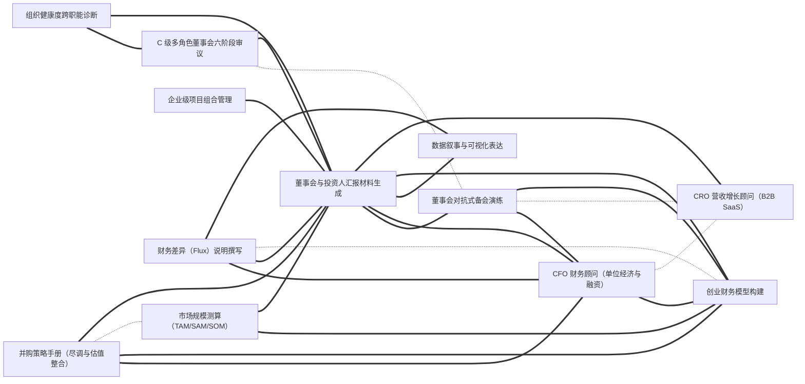

# 互见图谱展示（节选）

> 全库 2674 条互见边无法整图渲染，这里截取连接最密的一个技能簇做示意。实线=依赖(requires)，虚线=互见(related)，粗线=组合(combines_with)。

```mermaid
graph LR
  board_deck_builder["董事会与投资人汇报材料生成"]
  cfo_financial_advisor["CFO 财务顾问（单位经济与融资）"]
  startup_financial_modeler["创业财务模型构建"]
  cro_revenue_advisor["CRO 营收增长顾问（B2B SaaS）"]
  data_storyteller["数据叙事与可视化表达"]
  market_sizing_analyst["市场规模测算（TAM/SAM/SOM）"]
  org_health_diagnostic["组织健康度跨职能诊断"]
  boardroom_deliberation["C 级多角色董事会六阶段审议"]
  enterprise_project_manager["企业级项目组合管理"]
  board_meeting_prep["董事会对抗式备会演练"]
  ma_playbook["并购策略手册（尽调与估值整合）"]
  variance_flux_commentary["财务差异（Flux）说明撰写"]
  boardroom_deliberation -.- board_meeting_prep
  boardroom_deliberation === board_deck_builder
  board_deck_builder === board_meeting_prep
  board_deck_builder === cfo_financial_advisor
  startup_financial_modeler === board_deck_builder
  board_deck_builder === data_storyteller
  board_meeting_prep === cfo_financial_advisor
  board_meeting_prep -.- cro_revenue_advisor
  board_meeting_prep === startup_financial_modeler
  cfo_financial_advisor === startup_financial_modeler
  cfo_financial_advisor -.- cro_revenue_advisor
  cro_revenue_advisor === board_deck_builder
  ma_playbook === cfo_financial_advisor
  ma_playbook === startup_financial_modeler
  ma_playbook -.- market_sizing_analyst
  ma_playbook === board_deck_builder
  market_sizing_analyst === startup_financial_modeler
  market_sizing_analyst === board_deck_builder
  variance_flux_commentary === cfo_financial_advisor
  variance_flux_commentary === board_deck_builder
  variance_flux_commentary -.- startup_financial_modeler
  variance_flux_commentary === data_storyteller
  enterprise_project_manager === board_deck_builder
  org_health_diagnostic === boardroom_deliberation
  org_health_diagnostic === board_deck_builder
```

*由 `.vendor/showcase.mjs` 从 INDEX/graph.json 抽取，数据真实。*
